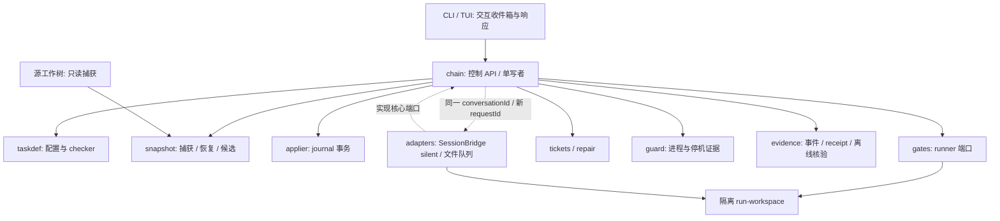

# ProofRail 概要与架构设计

[English](ARCHITECTURE_EN.md)

日期：2026-09-07；S1 架构基线。本文是模块边界、依赖方向、数据流和部署拓扑的规范性权威；[项目建议书](RFC-proofrail-unattended-ai-engineering-product.md) §10-13、§16 保留设计来源。输入：[需求](PRODUCT_REQUIREMENTS.md) 与 [业务流程](BUSINESS_WORKFLOWS.md)。本文同时区分已实现模块与目标架构，未标明完成的能力不得视为可用。

## 1. 现状和目标

当前 T005–T010 已实现 evidence、snapshot、guard、taskdef change-set checker、applier transaction、Chain Engine 与 fail-close gate runner，并有核心测试；adapter、可用 CLI/TUI 和产品 CI 尚未完成。`init`/`run` 仍打印未实现，不能用其退出成功作为验收。internal 模块继续作为责任边界，不因目标架构存在而提前生成空接口。

采用单机单用户、单写者 Go 模块化单体。持久事实以文件对象、append-only 事件和 journal 表达；S1 不引入服务集群、数据库、远程对象存储或消息中间件。内部调用优先 Go 方法与 `context.Context`，跨进程才使用版本化协议。

图中 adapter 到工作区表示其能力允许的执行路径；silent 文本本身不获得文件工具。默认可把结构化变更交给 applier，只有能力验证通过的工具代理才能选择 isolated-workspace。

AI 需要人工输入时，adapter 只接收结构化 `operator-action-required` 并交给 chain；chain 持久化交互请求并进入 `WAITING_FOR_OPERATOR`，console 从控制 API 展示待办和允许响应。操作员响应经 chain 校验主体、run/task/attempt、上下文摘要和权限后，写入可重放记录；需要人工写入时转入既有 handoff，而不是绕过其租约。恢复 silent 执行必须保持同一非空 `conversationId` 并使用新的 `requestId`。SessionBridge 的 `@sbr-review` 可用于独立诊断或人工测试，但不是 ProofRail 状态转换、授权或恢复的依赖。

## 2. 所有权与依赖契约

| 模块 | 唯一责任/输出 | 禁止事项 | 首批验证 |
|---|---|---|---|
| cmd/prfrail | 参数、依赖装配、退出码 | 实现领域状态判断 | CLI 黑盒 |
| console | 视图、命令意图、--json、待处理交互展示/响应 | 直接写 state/store/receipt、把 UI 文本当授权 | 假控制 API、窄终端、断线恢复 |
| chain | 状态转换、调度、effective config、写锁、交互请求/响应校验 | import 具体 adapter、信任自由文本 PASS/提问 | 表驱动状态转换、陈旧/伪造响应 |
| taskdef | 解析/Schema、引用/所有权、顺序 checker、文档义务 | 写目标文件或启动命令 | 合法/非法 goldens |
| snapshot | 捕获、物化、内容对象、引用与 GC | 使用 Git 恢复、接受未经评审候选 | 路径/损坏/配额 |
| applier | 全量预验证、journal、写后验、整组回滚 | 边验证边写、修改源目录 | 每写入边界崩溃 |
| gates | 运行声明 hook 并归一化结果 | 拼接 shell 字符串、直接批准任务 | argv/超时/产物 |
| guard | 受管进程身份、停止与存活证据 | 仅凭 PID/租约过期宣告停机 | 子进程/PID 重用 |
| tickets | 分类、去重、lease、attempt/指纹预算 | 自行重启进程/提升候选 | 重放/耗尽 |
| repair | Prepare/Inspect/Validate/Promote 协调 | 直接修补正式定义、扩大权限 | 陈旧候选/哈希变化 |
| adapters | 外部协议映射、能力探测、conversation/request 映射 | 回执覆盖业务状态、GUI/`@sbr-review` 兜底 | 两通道同一契约、历史连续性 |
| evidence | 编码/哈希、事件链、receipt、交互记录、离线检查 | 让执行面覆写证据、存秘密 | 缺失/重排/篡改/重放 |

端口由消费模块定义：AgentPort、GateRunner、ProcessSupervisor、Clock、ObjectStore 是责任名，Go 签名在对应任务细化后冻结，不是现有导出 API。`cmd` 装配端口实现；核心不得 import `internal/adapters` 或 `console`。拒绝为了共享几个字段创建无所有者的“大 common 包”。

## 3. 数据流与事务

1. validate：解析用户 TOML 与版本化 JSON，检查未知字段、引用、依赖环和能力；解析 profile/task/step 覆盖来源并冻结 run manifest。
2. baseline：源树只读捕获；排除 .git、run/store、缓存和 secret 路径并记录原因。捕获期间外部变动造成一致性不明时重试或暂停，不混合版本。
3. execute：从最近已接受父快照物化独立工作区；按 steps 执行。managed-change-set 经 checker/applier；isolated-workspace 记录前后 manifest 和 diff，不宣称 IDE 每次写入原子。
4. interact：仅结构化 `operator-action-required` 可请求人工输入；先持久化请求并进入 WAITING_FOR_OPERATOR。console 通过控制 API 提交响应；chain 验证绑定与权限，失败、超时、断线或持久化失败都保持暂停。恢复时同一 conversationId 使用新 requestId，历史只作上下文，不作权威状态。
5. validate/review：阻断型技术门禁全部通过，停止写者，冻结候选与证据根，进入 REVIEW_PENDING。独立评审绑定同一候选，变更后旧批准失效。
6. accept：以可恢复 journal 发布 snapshot/receipt 引用，再产生 PASSED 状态事实；读者只消费完成发布的接受记录。多文件 rename 不等于跨文件原子事务。
7. recover：验证单写锁和旧写者停止，重放事件/journal/待处理交互，重建投影。不确定则 PAUSED/REPAIR_PENDING；不重复投递未知结果请求。

状态名严格复用 RFC §10.3：chain `CREATED/BASELINED/RUNNING/PAUSED/COMPLETED/FAILED/CANCELLED`；task `PENDING/PRECHECK/STEPS_RUNNING/WAITING_FOR_OPERATOR/REVIEW_PENDING/PASSED/FAILED/REPAIR_PENDING/CANCELLED`；step `PENDING/RUNNING/WAITING_FOR_OPERATOR/PASSED/FAILED/CANCELLED/NOOP_RECORDED`。不得把状态集合误当任意转换许可。

最重要的转换前置条件：PRECHECK 成功才运行；noop 不经过 RUNNING；任务技术成功不等于 PASSED；FAILED 不可直接 PASSED；cancel/repair/recover/accept 先证明相关受管写进程已停止；handoff complete 先收回租约、扫描并重新跑门禁。事件先落盘，投影可重建。

## 4. 存储与生命周期

RFC 默认快照根是 `out/prfrail/snapshots/`。run/state/outbox 的具体布局属于待冻结契约，不能凭本文生成生产路径。要求物理上分离源目录、run-workspace、执行 outbox、核心 state/store；启动前验证无嵌套捕获和别名重叠。

baseline、已接受快照、最终报告及失败证据默认保留；候选/中间物按 profile TTL；GC 先 dry-run，只删除无引用且过期、未锁定对象。空间不足先暂停，不删除审计链。多个 run 共享 store 时，GC 与发布的引用更新必须协调，不能只靠单 run 锁。

## 5. 关键取舍

| 决策 | 理由 | 代价/控制 |
|---|---|---|
| 核心单写者 | 明确顺序和恢复责任 | 不做 S1 并行任务调度 |
| 本地内容寻址文件 | 标准库实现、离线核验 | 原子替换/持久化需 Windows/Linux 实测 |
| TOML 用户入口 + JSON 规范 | 用户易读、机器严格 | 必须唯一 canonical 规则，不能按 Go map 输出直接哈希 |
| 外部 agent 端口 | 无 IDE 与多模型可测 | 需要 adapter 能力矩阵，消息成功不是任务成功 |
| 目录隔离不称安全沙箱 | 如实描述 S1 保证 | 无法实施要求的网络/资源/路径限制时拒绝执行 |

详细协议见 [CONTRACTS.md](CONTRACTS.md)，安全见 [SECURITY.md](SECURITY.md)。字段级未决项见 [ADR_REGISTER.md](ADR_REGISTER.md)；不得绕过 RFC 修改顺序直接实现猜测值。

## 6. 产品闭环责任扩展（RFC §19）

不新增服务或“大管理模块”：PC-01 由 taskdef 生成静态执行计划、console 展示，探测执行与只读预览分离；PC-02 由 snapshot/evidence 核验已接受引用并导出，chain 记录独立交付事件，console 不能直接复制 store；PC-03 由 chain 在调度/发布边界校验授权，guard 停在途写者，console 仅呈现待审批队列。

PC-04 由 gates/adapters 声明能力和副作用，taskdef 校验可信策略，chain/guard 控制恢复；evidence 只读生成脱敏诊断。PC-05 由 tickets 维护持久预算账本、chain 在调用前预留、adapter 返回用量、evidence 保存计量来源；跨 run 共享上限需要共享协调锁，单 run 锁不足。PC-06 由 snapshot/evidence 实现完整引用闭包备份和新 store 恢复，发布工具产出 SHA256SUMS、SBOM/许可证清单及可选签名，停用通过 chain 控制 API。

新增持久事实是授权记录、预览计划摘要、导出清单/回执、成本预留/结算和备份/处置清单，不增设 task 成功状态。源树继续只读；导出目标不得与源/run/store 物理重叠。凭据不进备份；运行中备份需一致性屏障，否则停机后才执行。目录隔离和策略声明不能代替真实 OS 权限执行。