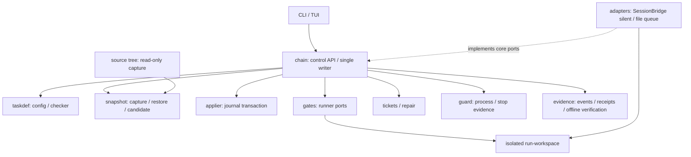

# ProofRail High-Level and Architecture Design

[简体中文](ARCHITECTURE.md)

Date: 2026-09-07; S1 architecture baseline. This document is the normative authority for module boundaries, dependency direction, data flow, and deployment topology. [Project proposal](RFC-proofrail-unattended-ai-engineering-product.md) sections 10-13 and 16 retain design provenance. Inputs: [requirements](PRODUCT_REQUIREMENTS_EN.md) and [business workflows](BUSINESS_WORKFLOWS_EN.md). This document distinguishes implemented modules from target architecture; uncompleted capabilities are not available.

## 1. Current State and Target

T005–T010 currently implement evidence, snapshots, guards, the taskdef change-set checker, applier transactions, the Chain Engine, and a fail-closed gate runner with core tests. Adapters, usable CLI/TUI, and product CI remain incomplete. init/run still print unimplemented messages and their successful exits are not acceptance. Internal modules remain responsibility boundaries and must not be populated with speculative interfaces merely because they appear in the target architecture.

Use a local single-user, single-writer Go modular monolith. Persist facts as content objects, append-only events and journals. S1 adds no service cluster, database, remote object store or message broker. Prefer Go calls with context.Context internally and versioned protocols across processes.

The adapter/workspace edge depends on verified capability: silent text has no implicit file tools. Structured output can feed applier; only a verified tool agent may select isolated-workspace.

## 2. Ownership and Dependency Contracts

| Module | Owned responsibility/output | Prohibition | First verification |
|---|---|---|---|
| cmd/prfrail | Arguments, composition, exit codes | Domain-state decisions | CLI black-box tests |
| console | Views, command intents, --json | Direct state/store/receipt writes | Fake control API, narrow terminal |
| chain | Transitions, scheduling, effective config, write lock | Concrete adapter imports, free-text PASS | Transition tables |
| taskdef | Parsing/schema, references/ownership, sequential checker, doc obligations | Target writes or commands | Valid/invalid goldens |
| snapshot | Capture, materialization, objects, references, GC | Git recovery or unreviewed acceptance | Paths, corruption, quota |
| applier | Full prevalidation, journal, postconditions, group rollback | Validate-while-writing, source writes | Crash at every write boundary |
| gates | Declared hooks and normalized results | Shell string concatenation, task approval | argv, timeouts, artifacts |
| guard | Managed process identity, stop/liveness evidence | PID/lease-expiry-only stop claims | Child processes, PID reuse |
| tickets | Classification, deduplication, lease, attempt/fingerprint budgets | Restarting processes or promotion | Replay, exhaustion |
| repair | Prepare/Inspect/Validate/Promote coordination | Editing formal definitions directly, widening authority | Stale candidates, changed hashes |
| adapters | External protocol mapping and capability probes | Business-state replacement, GUI fallback | Same contracts across transports |
| evidence | Encoding/hashes, event chain, receipts, offline checks | Execution-plane overwrites, secret storage | Missing/reordered/tampered data |

Consumers own their ports. AgentPort, GateRunner, ProcessSupervisor, Clock and ObjectStore are responsibility names, not existing exported Go APIs; signatures freeze during the relevant design task. cmd composes implementations; core must not import internal/adapters or console. Avoid an ownerless common package for a few shared fields.

## 3. Data Flow and Transactions

1. Validate TOML/versioned JSON, unknown fields, references, cycles and capabilities. Resolve profile/task/step origins and freeze the run manifest.
2. Capture source read-only, recording excluded .git, run/store, caches and secret paths. Retry/pause if concurrent source changes prevent a coherent capture.
3. Materialize an isolated workspace from the latest accepted parent. managed-change-set uses checker/applier; isolated-workspace records manifests/diffs without claiming atomic IDE writes.
4. After blocking gates pass, stop writers, freeze candidate/evidence root and enter REVIEW_PENDING. Independent review binds that candidate; later changes invalidate approval.
5. Publish snapshot/receipt references with a recoverable journal, then persist PASSED facts. Readers consume completed acceptance only. Multiple renames are not a cross-file transaction.
6. On recovery, validate single-writer ownership and the old writer's termination, replay events/journals and rebuild projections. Uncertainty means PAUSED/REPAIR_PENDING, not redispatch of an unknown request.

Reuse RFC section 10.3 states exactly: chain CREATED/BASELINED/RUNNING/PAUSED/COMPLETED/FAILED/CANCELLED; task PENDING/PRECHECK/STEPS_RUNNING/WAITING_FOR_OPERATOR/REVIEW_PENDING/PASSED/FAILED/REPAIR_PENDING/CANCELLED; step PENDING/RUNNING/WAITING_FOR_OPERATOR/PASSED/FAILED/CANCELLED/NOOP_RECORDED. A list of states does not authorize arbitrary transitions.

Preconditions: successful PRECHECK before execution; noop bypasses RUNNING; technical success is not PASSED; FAILED cannot directly become PASSED. cancel/repair/recover/accept require fresh managed-writer stop evidence. Handoff complete revokes the lease, rescans and reruns gates. Events persist before rebuildable projections.

## 4. Storage and Lifecycle

The RFC default snapshot root is out/prfrail/snapshots/. Exact run/state/outbox layouts remain pending contracts, not production paths inferred from this document. Physically separate source, run-workspace, execution outbox and core state/store; reject nested captures and aliased overlap.

Keep baseline, accepted snapshots, final reports and failure evidence by default. Candidate/intermediate TTL follows the profile. GC produces a dry-run list and deletes only unreferenced, expired, unlocked objects. Disk pressure pauses rather than pruning audit evidence. Shared-store GC must coordinate with publication reference updates; a per-run lock alone is insufficient.

## 5. Trade-Offs

| Decision | Reason | Cost/control |
|---|---|---|
| Single core writer | Explicit ordering/recovery | No S1 parallel task scheduling |
| Local content-addressed files | Standard-library implementation, offline checks | Native Windows/Linux replacement/durability probes |
| TOML entry plus JSON contracts | Human readability, machine strictness | One canonical algorithm; never hash incidental map output |
| External agent ports | No-IDE and multi-model testability | Capability matrix; messaging success is not task success |
| Directory isolation is not a sandbox | Honest S1 guarantees | Reject when requested network/resource/path constraints cannot be enforced |

See [contracts](CONTRACTS_EN.md), [security](SECURITY_EN.md) and [decision register](ADR_REGISTER_EN.md). Do not implement guessed field values before RFC revision.

## 6. Product Flow Ownership (RFC Section 19)

No new service or generic management module: taskdef builds PC-01 static plans and console displays them, separating execution probes from read-only preview. For PC-02, snapshot/evidence verify accepted references and export; chain records separate delivery events, not console copying the store. PC-03 authorization checks belong to chain dispatch/publication boundaries, in-flight stopping to guard and the approval inbox view to console.

For PC-04, gates/adapters declare capabilities/effects, taskdef checks trusted policy and chain/guard control recovery; evidence produces read-only redacted diagnostics. PC-05 uses tickets for durable budget ledgers, chain for pre-call reservations, adapters for usage and evidence for measurement provenance. Shared cross-run caps need shared coordination, not just per-run locks. PC-06 uses snapshot/evidence for complete reference-closure backups/new-store restore, release tooling for SBOM/signatures and chain API for retirement.

New persistent facts are authorization records, preview-plan hashes, export manifests/receipts, cost reservations/settlements and backup/disposition manifests, not new task success states. Source stays read-only; export destinations cannot physically overlap source/run/store. Credentials are excluded from backups. Live backups need a consistency barrier or must wait for stopped writers. Directory separation and declarations do not replace OS enforcement.