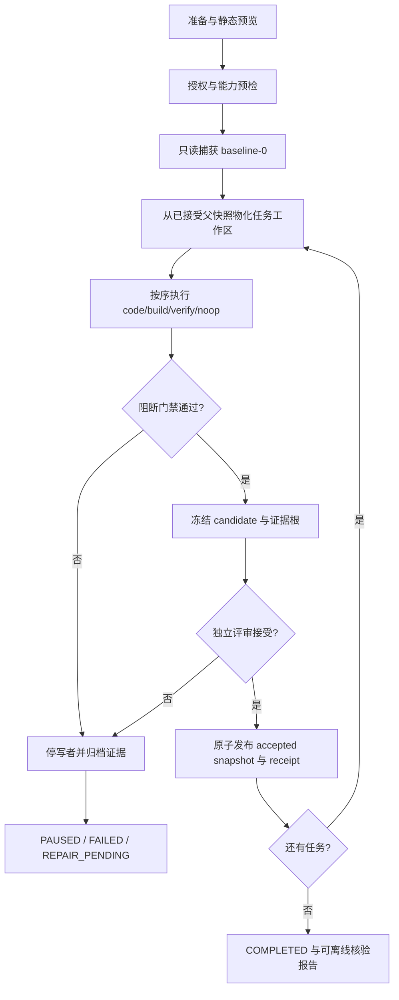

# ProofRail 业务流程

[English](BUSINESS_WORKFLOWS_EN.md)

日期：2026-09-07。状态：产品业务基线。本文是端到端业务规则与用户流程的规范性权威；机器状态、事件和 receipt 以 [架构契约](CONTRACTS.md) 为准，[项目建议书](RFC-proofrail-unattended-ai-engineering-product.md) 保留设计来源。本文独立于 whois，且不声明尚未实现的命令可用。

## 1. 产品结果与参与者

ProofRail 帮助维护者在不把源工作树交给 AI 直接修改的前提下，将一组工程任务沿可验证、可暂停、可恢复的轨道执行，并只把经独立评审接受的结果传给下一任务。一次运行的业务结果不是“代理回复成功”，而是可离线复核的已接受快照、证据链和最终报告，或者带原因及恢复入口的安全暂停/失败。

| 参与者 | 责任 | 不得据此获得的权限 |
|---|---|---|
| 产品所有者 | 批准范围、策略、预算、发布与高风险例外 | 不因拥有项目而省略证据或完整性门禁 |
| 操作员 | 初始化、启动、暂停、取消、恢复、交接和诊断 | 不手改运行状态、journal 或 receipt |
| 变更执行者 | AI、人工或确定性工具，在授权工作区产生候选 | 不批准自己的候选，不修改源工作树 |
| 独立评审者 | 对绑定候选和证据作 approve/reject/有效 waive | 不豁免完整性、独占写、停机和秘密边界 |
| 外部工具 | adapter、harness、编译器、测试器和 SessionBridge | 工具成功不等于 task PASSED |

## 2. 核心业务对象与规则

- `chain` 是有序 task 集合；`task` 从一个已接受父快照开始，经 steps、门禁和评审产生至多一个已接受子快照。
- `step` 仅为 `code/build/verify/noop`；noop 必须说明原因并留 receipt，不能启动进程。
- `baseline-0` 是源目录的只读事实；运行工作区与源目录、store 必须物理隔离。
- `candidate` 只表示待评审结果；只有 promotion 完成并有 receipt 后才成为 accepted snapshot。
- event 是状态事实，projection 可重建；聊天历史、终端文字和模型自报不是权威状态。
- 每个 run 只有一个有效写者；每次工作区、journal、receipt 或 projection 写入前校验 fencing token。
- 任一阻断门禁失败、证据不全或状态不确定均停止推进；后续 task 不得消费候选或失败快照。

## 3. 端到端主流程

1. **准备**：用户选择源工作区、任务链、workspace/profile、adapter、harness、预算和评审主体。静态预览不得启动命令、网络或模型。
2. **授权与预检**：冻结 effective run manifest，验证路径隔离、容量、工具能力、网络/副作用策略和有效授权。未知能力按策略阻断或暂停。
3. **建立基线**：只读捕获包括未提交文件在内的源目录；捕获期间发生变化则重试或暂停，不拼接两个时刻的内容。
4. **执行任务**：从最近 accepted snapshot 物化隔离工作区，按 sequence 执行 steps。managed-change-set 先全量内存验证再事务应用；isolated-workspace 记录前后 manifest 和完整 diff。
5. **技术验收**：运行适用的阻断门禁。失败时停止写者、保留候选与证据，不启动下一 task。
6. **人工/策略评审**：冻结候选及证据根后进入 `REVIEW_PENDING`。变更发生后旧批准失效；技术通过不能自行变成 PASSED。
7. **接受与传播**：原子发布 snapshot、promotion receipt 和状态事实。只有该 accepted snapshot 可成为下一 task 的父快照。
8. **结束与复核**：全部任务接受后生成链报告；离线 verifier 从内容存储重读对象、事件和 receipt 后给出结论。

## 4. 暂停、取消与恢复

| 场景 | 系统动作 | 恢复条件 |
|---|---|---|
| 用户暂停 | 在当前原子边界停下，不启动新 step | 写者与 journal 状态明确，授权仍有效 |
| 用户取消 | 停止受管进程树，归档证据并进入终态 | 不恢复原 run；需要新 run/attempt |
| 进程或主机崩溃 | 先验证旧写者失效，再重放 event/journal | 每项内容处于已知 before/after；否则保持 uncertain |
| 门禁失败 | 首错即停，Tn+1 不启动 | 有界修复产生新证据并重新执行门禁 |
| 磁盘或预算不足 | 在安全边界暂停，不删审计对象、不重置预算 | 增加经授权资源或清理无引用且可删对象 |
| 外部副作用不明 | 记录 uncertain，禁止换 requestId 盲目重试 | 对账、补偿或人工决策形成新记录 |

## 5. AI 请求人工干预

1. AI 只能返回结构化 `operator-action-required` 请求，说明问题、原因、允许答复、风险、所需人工动作及相关证据；自由文本中的提问不自动取得暂停或授权语义。
2. ProofRail 在当前原子边界停止推进，持久化交互请求并令 task/step 进入 `WAITING_FOR_OPERATOR`；TUI 在同一终端展示待办、上下文、允许操作和等待时长。SessionBridge `@sbr-review` 或聊天面板可见性不属于通知或恢复依赖。
3. 用户在 TUI 中答复。普通澄清、批准/拒绝、授权变更和人工写入分别形成对应的 operator interaction、review、authorization 或 handoff 记录；终端文字本身不是权威事实，秘密只进入受控安全输入。
4. ProofRail 校验操作者、attempt、候选/上下文摘要、租约、授权与答复范围后才收回控制权。无答复、断线、超时或记录失败均保持暂停，不自动选择默认答案。
5. 无需人工写入时，把已确认答复及记录摘要送回当前可恢复的 CLI Agent session；恢复前重新验证 attempt/workspace/session/进程和授权，不确定则建立新 attempt。SessionBridge silent 仅可承载辅助分析上下文，不承载正式执行恢复。
6. 一般澄清问答的 `operator-interaction` 记录在实现前必须先冻结 Schema、正反黄金样例、摘要域和重放规则；不得用聊天历史、TUI 缓冲区或 `reply_<conversationId>.json` 代替持久记录。

## 6. 人工交接流程

1. 引擎停止并确认全部受管写者，刷新 journal 和当前 manifest。
2. 创建有范围、有期限的人工写租约及脱敏 handoff pack。
3. 操作员只在指定 run-workspace 内工作；密码、token、MFA 不经模型或持久上下文传递。
4. `complete` 仅表示归还：引擎收回租约、重扫越界/秘密/未知进程并重跑既定门禁。
5. 通过后仍进入独立评审；断线、到期或无法证明独占写入时保持暂停。

### 6.1 受监督黑箱候选

1. 用户显式选择 `supervised-black-box`，TUI 展示其保证低于 AgentRunner，并列明不可观测工具/读取/网络/费用/后台进程/会话和外部副作用；确认记录绑定 task/attempt/workspace 和风险版本。
2. ProofRail 物化隔离 workspace、冻结 target 和验证计划，再通过 SessionBridge visible 投递请求；投递回执只证明 UI 可见，不证明代理启动或完成。
3. 用户监督外部 Agent，并负责宿主信任、凭据和网络限制；ProofRail 不从聊天记录推断工具轨迹。用户显式结束工作窗口并归还 workspace，断线或超时不自动归还。
4. ProofRail 停止已知受管进程、重建完整 manifest/diff，并检查范围、秘密、文件类型/大小和可观测副作用；未知进程或外部副作用保持暂停。
5. 独立 build/test/verify gates 与评审通过后才可接受。报告同时显示“产物验收结果”和“过程保证：unknown/reduced”，不得宣称等同 AgentRunner；任何失败不得自动切换模式重试。

## 7. 交付、升级与停用

- **交付**：只从 accepted snapshot 导出到与源/run/store 不重叠的空目标；导出记录不改变 task 状态，也不自动执行 Git、上传或部署。
- **升级**：停止相关写者，核验 schema 支持范围，备份对象、事件和引用闭包，并在新 store 演练恢复；未知格式保留原件并拒绝写入。
- **停用/卸载**：撤销授权、停止进程、展示保留/删除清单；默认保留审计证据，不删除共享 SessionBridge 或用户工具链。
- **秘密事件**：隔离对象、撤销凭据并阻止外发；不得静默改写不可变历史来伪造完整性。

## 8. whois 的位置

whois 只用于说明这些流程的经验来源及未来只读影子验收。A/B、D/V、Step47、start-file 等术语不得进入 ProofRail 核心业务规则；没有 whois 背景的 generic/Go 用户必须能够仅凭本文件、产品需求和操作文档理解完整流程。

## 9. 实施追踪

T009 实现第 3–4 节的有序调度、投影、暂停、取消与重放；T010 接入真实 gate runner；T011 完成评审与接受；T013/T014 完成抽象 adapter 和人工交接；T016 提供可用逐行 CLI；T019–T024 完成预览、导出、授权、副作用、成本和生命周期；T025 规划第 5 节 TUI AI/操作员交互；T026/T027 规划 AgentRunner 契约与实现；T028 规划 §6.1 黑箱候选。各阶段只能把已实测能力从“规划”改为“可用”。