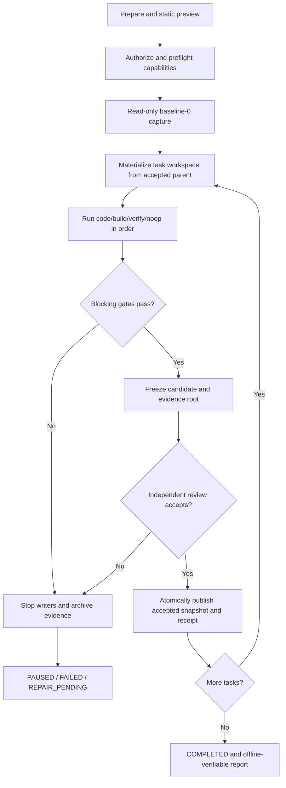

# ProofRail Business Workflows

[简体中文](BUSINESS_WORKFLOWS.md)

Date: 2026-09-07. Status: product workflow baseline. This document is the normative authority for end-to-end business rules and user workflows. [Architecture contracts](CONTRACTS_EN.md) govern machine states, events, and receipts, while the [project proposal](RFC-proofrail-unattended-ai-engineering-product.md) retains design provenance. This document is independent of whois and does not claim planned commands are implemented.

## 1. Product Outcome and Actors

ProofRail helps maintainers execute engineering tasks along verifiable, pausable, recoverable rails without giving AI direct write access to the source workspace. Only independently accepted results feed later tasks. A run succeeds through an offline-verifiable accepted snapshot, evidence chain, and final report, not through an agent's success message. Otherwise it ends in a safe pause or failure with a reason and recovery entry point.

| Actor | Responsibility | Authority not implied |
|---|---|---|
| Product owner | Approves scope, policy, budget, release, and high-risk exceptions | Cannot omit evidence or integrity gates |
| Operator | Initializes, starts, pauses, cancels, recovers, hands off, and diagnoses | Cannot edit runtime state, journals, or receipts |
| Change producer | AI, human, or deterministic tool producing a candidate in an authorized workspace | Cannot approve its own candidate or edit the source workspace |
| Independent reviewer | Approves, rejects, or validly waives a bound candidate and evidence set | Cannot waive integrity, exclusive-write, stopped-writer, or secret boundaries |
| External tool | Adapter, harness, compiler, test runner, or SessionBridge | Tool success does not mean task PASSED |

## 2. Core Business Objects and Rules

- A `chain` is an ordered task set. A `task` starts from an accepted parent snapshot and produces at most one accepted child through steps, gates, and review.
- A `step` is exactly `code/build/verify/noop`; noop records a reason and receipt and starts no process.
- `baseline-0` is a read-only fact about the source; run workspaces must be physically separate from source and store.
- A `candidate` is pending review. It becomes an accepted snapshot only after completed promotion with a receipt.
- Events are state facts and projections are rebuildable. Chat history, terminal text, and model claims are not authoritative state.
- A run has one valid writer. Every workspace, journal, receipt, or projection write revalidates the fencing token.
- Any blocking gate failure, incomplete evidence, or uncertainty stops progress. Later tasks never consume candidate or failed snapshots.

## 3. End-to-End Main Flow

1. **Prepare**: select source workspace, chain, workspace/profile, adapter, harness, budgets, and reviewer. Static preview starts no commands, network, or model.
2. **Authorize and preflight**: freeze the effective run manifest and verify path isolation, capacity, tool capabilities, network/effect policy, and authorization. Unknown capability blocks or pauses according to policy.
3. **Baseline**: capture the source, including uncommitted files, read-only. Concurrent changes cause retry or pause, never a mixed-time snapshot.
4. **Execute task**: materialize an isolated workspace from the latest accepted snapshot and execute steps by sequence. Managed change sets receive complete in-memory validation before transactional apply; isolated workspaces record before/after manifests and a complete diff.
5. **Technical acceptance**: execute applicable blocking gates. On failure, stop writers and preserve candidate/evidence without starting the next task.
6. **Review**: freeze candidate and evidence root before `REVIEW_PENDING`. Any subsequent change invalidates approval; technical success cannot self-promote to PASSED.
7. **Accept and propagate**: atomically publish the snapshot, promotion receipt, and state fact. Only that accepted snapshot can parent the next task.
8. **Finish and verify**: after all tasks are accepted, produce the chain report. An offline verifier rereads objects, events, and receipts from content storage.

## 4. Pause, Cancel, and Recovery

| Scenario | System action | Resume condition |
|---|---|---|
| Operator pause | Stop at the current atomic boundary and start no new step | Writer and journal state are known; authorization remains valid |
| Operator cancel | Stop the managed process tree, archive evidence, enter a terminal state | Do not resume the same run; create a new run/attempt |
| Process or host crash | Prove the old writer stopped, then replay events and journals | Every item equals known before/after content; otherwise remain uncertain |
| Gate failure | Fail fast; do not start Tn+1 | Bounded repair produces new evidence and gates rerun |
| Disk or budget exhaustion | Pause safely; do not delete audit objects or reset budgets | Authorized capacity increase or deletion of unreferenced eligible objects |
| Unknown external effect | Record uncertain and never blindly retry with a new requestId | Reconciliation, compensation, or operator decision creates a new record |

## 5. AI Requests for Operator Intervention

1. The AI may request intervention only through a structured `operator-action-required` result that states the question, reason, allowed responses, risk, required operator action, and related evidence. A question embedded in free text gains no pause or authorization semantics.
2. ProofRail stops at the current atomic boundary, persists the interaction request, and moves the task/step to `WAITING_FOR_OPERATOR`. The TUI shows the pending item, context, allowed actions, and elapsed wait in the same terminal. Notification and recovery do not depend on SessionBridge `@sbr-review` registration or chat-panel visibility.
3. The operator responds in the TUI. Clarification, approval/rejection, authorization changes, and manual writes produce the applicable operator-interaction, review, authorization, or handoff records. Terminal text is not authoritative state, and secrets use only controlled secure input.
4. ProofRail retakes control only after validating the operator, attempt, candidate/context hashes, lease, authorization, and response scope. Missing responses, disconnection, timeout, or persistence failure remain paused and never select a default answer.
5. When no manual write occurred, ProofRail sends the confirmed response and record hashes back through silent using the same attempt and `conversationId` but a new `requestId`. Manual writes first complete the next section's writer-stop, lease, return, and revalidation flow, then resume or create a new attempt.
6. Before implementation, the general-clarification `operator-interaction` record requires a frozen Schema, positive/negative goldens, hash domain, and replay rules. Chat history, a TUI buffer, or `reply_<conversationId>.json` cannot substitute for that durable record.

## 6. Operator Handoff

1. Stop and verify every managed writer, then flush journals and the current manifest.
2. Create a scoped, expiring manual write lease and redacted handoff pack.
3. The operator edits only the specified run workspace. Passwords, tokens, and MFA never pass through the model or persistent context.
4. `complete` means return, not approval: reclaim the lease, rescan boundaries/secrets/processes, and rerun prescribed gates.
5. Successful checks still lead to independent review. Disconnection, expiry, or uncertain exclusivity remains paused.

## 7. Delivery, Upgrade, and Retirement

- **Delivery** exports only an accepted snapshot to an empty target separate from source/run/store. It does not change task state or automatically perform Git, upload, or deployment actions.
- **Upgrade** stops writers, checks schema support, backs up the complete object/event/reference closure, and rehearses restore into a new store. Unknown formats remain untouched and read-only.
- **Retirement/uninstall** revokes authorization, stops processes, and presents retention/deletion inventory. Evidence is retained by default; shared SessionBridge and user toolchains are not removed.
- **Secret incident** isolates objects, revokes credentials, and blocks egress. Immutable history is never silently rewritten to fabricate integrity.

## 8. Position of whois

whois documents the experience source and a future read-only shadow acceptance example only. A/B, D/V, Step47, and start-file terminology must not enter ProofRail core business rules. A generic or Go user with no whois background must understand the complete flow from this document, product requirements, and operations documentation.

## 9. Implementation Trace

T009 implements ordered scheduling, projections, pause, cancel, and replay from sections 3–4. T010 adds real gate runners; T011 completes review and acceptance; T013/T014 complete the abstract adapter and handoff; T016 delivers the usable line-oriented CLI; T019–T024 complete preview, export, authorization, effects, cost, and lifecycle; T025 plans the embedded SessionBridge IPC and TUI AI/operator interaction loop from section 5. A planned capability becomes documented as available only after executable validation.