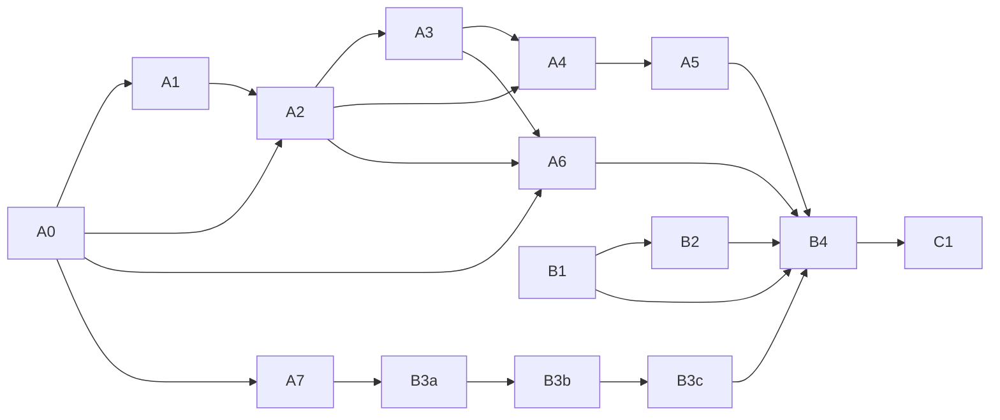

# T027 剩余切片清单（临时执行台账）

> 状态：临时执行台账；**自 2026-09-20 `babc041` 起已入库并受版本控制**（此前曾由 `.git/info/exclude` 本地忽略，该忽略已解除）。
> 权威账本仍为 docs/DEV_PLAN.md、docs/DEV_PLAN_EN.md 与 docs/validation/；本清单只作为临时执行台账。
> 基线：68664d8（2026-09-14，已包含 #38 CI 修复）。盘点修正为 12 个必做切片 + 1 个可后置切片；必做规模合计 M×7、M-L×1、L×4；含 C1 后为 M×8、M-L×1、L×4。
> **2026-09-19 修订：B3 拆分为 B3a（断电注入装置与对照标定）+ B3b（候选注入矩阵与耐久定案）** ⇒ 必做切片 **13** 个；必做规模改为 **M×8、M-L×2、L×3**；含 C1 后为 **M×9、M-L×2、L×3**。理由：A7 已证伪“kill 级注入可判定耐久步”（CP4≡CP5），B3 的前置物（可证耐久的轮次 journal + 另一物理设备 + 重启盘点 + 双向对照标定）与后续物（逐候选注入与三档定案）是两类不同工作与不同风险，混在一片会让“装置未标定就下结论”。
> **2026-09-21 修订：新增 B3c（CONTRACTS 耐久升级条款，纯文档）** ⇒ 必做切片 **14** 个；必做规模改为 **M×8、M-L×2、L×3、S×1**；含 C1 后为 **M×9、M-L×2、L×3、S×1**。理由：B3b 给出的是**分级**结论（C2 `proven`、C1/C3/C2C3/U4 `unresolved`），而 CONTRACTS 双语仍把“发布耐久未证明”写成**平台常量**，既无升级条件也无解锁边界；不先固化口径，B4 会在“契约口径”与“分级结论”之间踩空。

## 用法

1. 切片开始：本文件中对应切片小节就是交给 Flash 的完整输入，包含依赖、步骤、目标、现状缺口、交付物、验收证据、边界，无需再补口头上下文。
2. 切片完成：同步勾选中英文两份清单、更新本文件状态表、追加完成记录，并按原有风格回写 DEV_PLAN / DEV_PLAN_EN 的 T027 段落及 docs/validation/ 对应证据。
3. 本文件自 2026-09-20 `babc041` 起已入库并受版本控制（`commit`/`push` 仍须同一轮显式授权）；轮换操作者时，以本文件 + DEV_PLAN + validation 记录交接。

## 统一门禁

- 协议先行：凡语义变化，先改 CONTRACTS 双语、schema、fixtures，再改 Go 实现。
- 首次实质性代码修改后，立刻运行所触及切片的聚焦测试；通过后再继续扩展。
- 收尾验证：gofmt、go build ./...、go vet ./...、go test ./...；涉及 Node 合同夹具时补跑对应 Node contract 检查。
- 平台要求：Windows 证据必须在 Windows 原生环境取得；Linux 回归可用 GitHub Actions Ubuntu 或经批准的 Ubuntu 24.04 环境，但本清单不得记录 IP、用户名、SSH key 路径或其他连接材料，连接信息只来自本地安全 runbook / 环境。
- 远程验证纪律：只允许一次性 /tmp 副本，完成后立即清理并验证清理；不得改动远端仓库、系统、代理或长期环境。
- 代码改动后必须做独立 Codex review，并解决所有 medium 及以上发现。
- 闭环纪律（修复后重走该环节，铁律，2026-09-15 更新；**2026-09-21 起改指新准则**）：任一环节失败/需整改时，修复后必须重新执行该环节直至通过，禁止修复后直接跳步。**完整口径（逐环节的失败后动作表、⑦ 不可省、⑨ 连续 2 次失败升级 ⑤、⑩ 停点）以 `docs/DELIVERY_DIRECTIVE.md` §5.3 为唯一权威**——本行原按准则 v3.1 的 ①–⑥ 步骤编号表述，该编号与新准则的流水线编号（①架构→②实现→③测试→④集成→⑤预审→⑥扫描→⑦终审→⑧文档→⑨验证→⑩停点）**不兼容**，故不再复述，以免双份口径漂移。
- 审查结论记录：每次前置分析/预审/终审/复审的结论（含整改与复审结果）必须记录到对应切片验证报告中。
- 回复标记：每次回复首行标注 [自执行] / [V4 Pro×N] / [Codex×N]。
- 只有在同一轮明确授权后才可 push；获得授权后必须观察 GitHub Actions；除非同一轮明确要求，否则绝不触碰 gitee。
- 禁止事项：Agent 不得写 source、store、policy、acceptance；不得自发 commit、push、publish；不得把 exit 0 或 completed receipt 直接当作 PASS；不得对 unknown 盲目重试。
- 编码保持：这两份 .md 必须继续为 UTF-8 BOM + LF。

## 状态表

| 切片 | 状态 | 直接依赖 | 规模 | 完成日期 | 证据 |
|---|---|---|---|---|---|
| A0 replay-root composition | ✅ 完成 | — | M | 2026-09-14 | docs/validation/t027-replay-root-composition.md |
| A1 pure admission | ✅ 完成 | A0 | M | 2026-09-14 | docs/validation/t027-pure-admission.md |
| A2 dispatch and launch ambiguity | ✅ 完成 | A0、A1 | M-L | 2026-09-14 | docs/validation/t027-dispatch-launch-ambiguity.md |
| A3 terminal publication and settlement | ✅ 完成 | A2 | M | 2026-09-14 | docs/validation/t027-terminal-publication.md |
| A4 chain terminal routing and resume | ✅ 完成 | A2、A3 | M | 2026-09-15 | docs/validation/t027-terminal-routing.md |
| A5 postflight acceptance integration | ✅ 完成（`b8bad47`） | A4 | M | 2026-09-15 | docs/validation/t027-postflight-acceptance.md |
| A6 pinned CLI adapter offline process slice | ✅ 完成（`c2d2819` + `6db5a10` + `c6cf339`） | A0、A2、A3 | L | 52 项变异全红、原生 E1–E8 全绿；试点组合漏 1 High（Codex 盲审捕获）；CI Ubuntu 腿暴露 Linux 僵尸语义缺陷 → 已修复并加 Linux 回归测试 | `docs/validation/t027-offline-process.md` |
| A7 Windows publication durability ADR + falsification prototype | ✅ 完成（①②③③.5④ 全闭环；④ 第 6 轮 `RE-REVIEW: PASS`；三提交已推送 + CI 两跑全绿 run 35118531930 / 35119805652） | A0 | M | | `docs/validation/t027-windows-publication-durability.md` |
| B1 candidate live capability + availability discovery | ✅ 完成（结论：**已评估范围内无可接受候选** ⇒ 保持 blocked；真探针 9 次、付费 6 个；④ 3 轮至 PASS + 工具收编 6 轮） | 外部按次授权 | M | 2026-09-17 | `docs/validation/t027-b1-candidate-live-discovery.md`、`docs/validation/evidence/b1-20260917/` |
| B2 candidate/enforcement decision + proof | ✅ 完成（2026-09-18；定案=**外部 OS 强制**；四提交已推送 `58757e8`+`fd99dc3`+`408bd99`+`815c03f`，CI 三跑全绿 run 35259806285 / 35261204021 / 35265268993；证据包 41 工件 + 排练转录已归档） | B1 | L | 2026-09-18 | `docs/validation/B2-EXTERNAL-ENFORCEMENT.md`、`docs/validation/evidence/b2-2026-09-17/`、`tools/agent-probe/{appcontainer-b2,enforcement-proxy}/` |
| B3a power-loss injection rig + calibration | ✅ 完成（2026-09-20） | A7 | M-L | 标定 `CALIBRATED`：负对照 4/5 丢失、正对照 0/5；journal 36 条全链通过；12 轮审计均 `HARD-POWER-LOSS` | `docs/validation/B3A-CALIBRATION.md`；`docs/validation/evidence/b3a-2026-09-20/` |
| B3b candidate injection matrix + durability verdict | ✅ 完成（`abfcecc`） | B3a | M | 2026-09-21 | `docs/validation/t027-b3b-durability.md`、`docs/validation/evidence/b3b-2026-09-21/` |
| B3c CONTRACTS durability-upgrade clause revision | ✅ 完成（`7bdfa0c`） | B3b | S | 2026-09-21 | `docs/validation/t027-b3c-contracts-durability.md`、`docs/validation/t027-b3c-contracts-durability_EN.md` |
| B4 AT-23 E2E evidence + independent review | ⬜ 未开始 | A5、A6、B1、B2、B3b、B3c | L | | |
| C1 Linux AgentRunner native validation | ⬜ 未开始 | B4（Windows T027 完成） | M | | |

状态符号：⬜ 未开始 / 🔄 进行中 / ✅ 完成 / ⛔ 阻断

## 依赖图

## 硬门

- B1 必须先于 B2：先完成真实候选能力与可用性发现，再做候选/强制边界定案与证明，禁止倒序。
- B2 是真实 E2E 前的候选/强制边界硬门：必须拿到经验证的 compatible candidate 或外部 OS enforcement 证明。**该硬门已于 2026-09-18 满足**（外部 OS 强制边界已实测且证据归档）；B4 仍须在该边界之上完成 AT-23 E2E 与独立审查。
- B3 是 Windows 原生持久化硬门：只有真实崩溃或断电注入证明通过，Windows first-dispatch 才能解除 unproven。**已拆分为 B3a（装置与标定）+ B3b（候选注入与定案）；只有 B3b 给出带同一前提的 `proven` 才解除 `unproven`，否则保持 blocked。**
- A2、A3、A4、A5、A6 构成离线实现链，B4 之前必须全部完成，且不得用 completed receipt、request-only receipt、terminal receipt 或 durability failure 直接触发重启、PASS 或完成任务。

---

## A0 — replay-root composition · ✅

依赖：无

- [x] 从 durable run/store root 推导稳定 replay root，去掉任意调用方自选 root 的生产入口。
- [x] 绑定 runID 与跨重启定位规则，明确 request、run、workspace、store 的归属关系。
- [x] 拒绝 source/workspace/store 重叠，以及 alias、symlink、reparse 逃逸。
- [x] 明确 root ownership 与恢复前置检查，并补充聚焦测试。

目标：把 replay 根路径变成稳定、可恢复、可审计的核心组成，不接受任意 caller root。
现状缺口：root 推导、绑定与所有权规则不完整，跨重启定位和重叠逃逸拒绝不够严格。
交付物：root composition 设计与实现、冲突拒绝逻辑、聚焦测试、文档回写。
验收证据：聚焦单测覆盖稳定推导、runID 绑定、重叠拒绝、symlink 或 reparse 拒绝、ownership 校验。
边界：不在此切片引入真实 dispatch；不开放任意 caller root。

## A1 — pure admission · ✅

依赖：A0

- [x] 移除 admission 对内存 RequestIndex 的消费或任何 replay 写入副作用。
- [x] 把 admission 收敛为纯 preflight 与 immutable binding，只返回错误或通过结果。
- [x] 明确 admission 与后续 dispatch 的责任分界，并补聚焦测试。

目标：admission 只做纯校验与不可变绑定，不再提前消耗一次性派发语义。
现状缺口：admission 仍混入运行期 replay 消费，导致内存态与持久态责任交叉。
交付物：纯 admission 实现、责任边界说明、聚焦测试。
验收证据：触达 admission 的聚焦测试证明无 replay 写入、无 launch、副作用仅限 error-only preflight。
边界：不在这里落 replay durable 记录；不引入 launch 行为。

## A2 — dispatch and launch ambiguity · ✅

依赖：A0、A1

- 前置提醒（已入 CONTRACTS 双语）：admission 是 preflight 而非锁，verdict 可能过期；dispatch 必须在发布 R 后依据 replay store 对 launch 资格终判，并在允许 launch 前重确认授权未撤销、预算 reservation 仍 outstanding，任一不满足即 fail-closed。

A2 设计裁定（V4 Pro 前置分析 2026-09-14，已确认与 A1 契约逐句对齐）：

- R1 落实：新设值语义 `AgentRunnerLaunchReconfirmer`（adapters）仅窄重检"授权 active/unrevoked/unexpired + reservation outstanding"，在 `RecordRequest` 返回 first-dispatch 之后、receipt/spawn 之前调用；失败返回 `ErrAgentRunnerLaunchReconfirmation`，R 保留、不写 receipt、不 spawn、不自动重试（死锁交 A3/operator）。
- 回执协议：二文件拆分——spawn 前 `launches/intent.<requestID>.jsonl`（no-replace、unproven 与 R 同等 pre-write 拒绝）、spawn 后 `launches/identity.<launchID>.jsonl`；不变式"无 intent ⇒ 从未 spawn"；identity 缺失不 relaunch。
- 状态机：R-only=未知阻断→不 launch；receipt-only=已占用→不重发；receipt+identity=已证明已启动→不 relaunch；R+C=终局永不 launch；仅 launcher 返回 error（契约保证未 spawn）允许同进程重试 Start。
- 归属：`AgentRunnerReplayDispatcher`（adapters，实现 `chain.AgentRunnerPort`）；chain 新增 `AgentRunnerLauncher` 端口与 LaunchRequest/Result DTO（A6 提供实现）。
- A0 回归点：`launches/` 必须纳入 `bootstrapReplayStoreRoot`、`verifyPathSafetyLocked` 与所有权/路径枚举。
- 已拍板：U1 抽取 A1 私有校验为包级共享（A1 测试守护行为不变）；U2 chain 持有接口/DTO；U3 接受 W1/W2 不自动接管；U4 接受 recheck→spawn 残余窗口为已知边界；U5 receipt 内嵌重确认证据摘要；U6 哨兵命名确认（A4 映射引用）。
- 实施顺序：先冻结 CONTRACTS 双语 → 实现 → 聚焦测试 → V4 Pro 预审 → Codex → 全量门禁 → 文档回写。

A2 实施偏离注记（2026-09-14，经 V4 Pro 预审与 Codex 终审确认可接受）：

- identity 记录增加 `RequestID` 字段（便于按 requestId 装载意图与冲突归类，store-local、无 wire 影响）。
- 新增第 5 哨兵 `ErrAgentRunnerLaunchFailed`（端口契约性未 spawn 失败），错误链同时保留底因。
- 自动重试口径：契约只“允许”端口契约性未 spawn 失败的同进程重试；本切片选择更保守的永不自动重试，失败后仅人工/上层处置（状态机一行已按此措辞生效）。
- launchID 确定性派生 `"launch-"+requestID`；意图已占用（含并发首派发窗口）统一归类 `ErrAgentRunnerDispatchUnknownBlock`（消息区分 owning launchId，errors.Is 可判）。
- unproven 平台排序语义：回执/身份允许“无写纯重放”、拒绝一切新写入（同 `RecordCompletion`）；`RecordRequest` 因携带首次 dispatch 资格而先拒 unproven。
- 零 `StartedAt`：由 A6 端口实现保证“返回 result 即已 spawn 且身份齐备”，本切片不做额外拒绝（A6 校验点）。

- [x] 做 replay-aware dispatcher，先发布 R，再决定是否允许首次 dispatch 尝试 launch。
- [x] 定义 durable launch 或 process-identity receipt，以及 crash window 下 unknown reconciliation。
- [x] 保证 request-only、terminal、convergence、durability failure 都不会盲目 relaunch。
- [x] 为 first-dispatch 单赢家、crash window、unknown reconciliation 补聚焦测试。

目标：把 launch 资格与 replay/receipt 语义绑定到 dispatcher，而不是靠调用时机猜测。
现状缺口：dispatch 与 launch 归属模糊，崩溃窗口和未知状态下的重启规则不够可证。
交付物：replay-aware dispatcher、launch receipt 规则、unknown reconciliation 逻辑、测试。
验收证据：聚焦测试证明只有 first-dispatch 可尝试 launch，未知状态不会盲重启。
边界：不在此切片完成 settlement、postflight 或真实候选运行。

## A3 — terminal publication and settlement · ✅

依赖：A2

A3 设计裁定（V4 Pro 前置分析 2026-09-14，已确认与 A0/A1/A2 纪律逐句对齐）：

- 顺序（四阶段）：terminal-intent（no-replace、内嵌完整 C 记录与结算计划）→ 账本 `Settle`（按 idempotencyKey 去重）→ `RecordCompletion` 发布 C → terminal-closure 完成链；C 对外发布时结算决策必已入账。
- 记录集：`terminals/terminal-intent.<requestId>.jsonl` + `terminals/terminal-closure.<requestId>.jsonl`（store-local、独立域摘要、no-replace + 有界重读收敛）；纳入 bootstrap、生产构造器、运行期路径复检与所有权前置枚举。
- 幂等键：`settle-<20hex>` = 域 `proofrail:agent-runner-settlement-key:1` 上 (requestId, C.recordHash) 摘要；EntryID 同值；CompletionID=`"completion-"+requestId`；账本侧同键同载荷幂等、同 reservation 异键拒绝；证据含 C/R 两个 recordHash。
- unknown 保留：`uncertain` C 或 `usageComplete=false` 只允许 unknown 结算；unknown 后 `RequireOutstandingReservation` 按既有语义**失败**，占用改由 `UnknownHoldReservations()`/`Summary().UnknownReservedAmountMicros`/共享上限观察，reservation 不得复用、不得 relaunch。
- 拒绝矩阵：C 无意图=orphan（不回写收养）；reservation 已被异键结算占用→不发布 C；charged>reserved、证据缺失/不含 C/R 摘要、intent 载荷冲突→fail-closed；不同 outcome 同 request→conflict；已完成链的重复发布=幂等重放。
- unproven 平台强约束：任何新终局发布在**结算之前**整链拒绝；已有完整链仅无写重放。
- 恢复纪律：只依据 store-local 记录（intent 为唯一恢复源），账本只作强制者、不查询；恢复=幂等补写自有槽位，不等于接管（W1/W2 口径不变）。
- 归属：`AgentRunnerTerminalPublisher`（adapters，值语义，依赖 `*tickets.CostLedger` + 测试单发 hooks afterIntentWrite/afterSettle）；chain 不动（A4 边界）；不接 Engine、不跑真实候选。
- 未定项与裁定：intent 内嵌完整 C（采纳，恢复必需）；不新增账本查询路径（采纳）；completed 且缺金额证据→允许 unknown（采纳，否则出现无结算决策的 C）；uncertain 只允许 unknown 且不定义 upgrade（留 A5）；durability 预检提前到 Settle 之前（采纳，契约已写）。
- 实施顺序：先冻结 CONTRACTS 双语 → 实现 → 聚焦测试 → V4 Pro 预审 → Codex → 全量门禁 → 文档回写。

A3 实施与审查结果（2026-09-14）：四阶段协议、二文件记录、幂等键与拒绝矩阵全部落地。V4 Pro 实现预审：有条件通过（无 High）——H1（resume 会话绑定缺口）改按统一 `ValidateAgentRunnerCompletionBinding` 预检；M1 改语义槽位匹配（completionHash+plan）并补异时钟用例；M2 改写意图前证据预校验+确定性去重+精确成员匹配；M3/L1/L5 均整改补测。Codex 终审：有条件通过（无 High）——unproven 完整链改为严格无写重放（不再触碰账本）；converge 复用完整 closure 绑定校验（含 settlement key），`RecordTerminalClosure` 增加 intent runId 复核；异时钟并发加起跑栅栏并补顺序确定性用例；happy-path 增 hook 触发断言；补三条缺失反例（无写重放/closure 键失配/恢复要求持久 R）。Codex 整改复审（2026-09-15）：PASS（中高危清零、可签收；另记录 3 条低风险测试严谨性尾项，不阻断签收）。尾项整改完成（beforeSettle 单点探针 + 两反例加固 + runId 专项回归），Codex 追加确认（用户授权超额 +1）：PASS（回滚即红、无新增缺陷）；本机全量门禁全绿。已提交 `c6f8585` 并推送，GitHub Actions Ubuntu（含 Race）/Windows 全绿（run 34900979883）。

- [x] 定义 completion C 发布、usage 或 cost settlement、idempotency key 的稳定顺序。
- [x] 处理 crash recovery 与重复发布，unknown settlement 必须保留 reservation。
- [x] 明确拒绝 C-without-settlement 与 settlement-without-auditable-C 的模糊状态。
- [x] 为发布顺序、幂等键、crash recovery 补聚焦测试。

目标：让 terminal publication 与 settlement 形成稳定、可恢复、可审计的完成链。
现状缺口：completion 发布与费用或用量结算次序未固定，崩溃后幂等和保留策略不够清晰。
交付物：publication 或 settlement 顺序实现、稳定幂等键、恢复逻辑、测试。
验收证据：聚焦测试证明不会出现无结算的 C，或无审计 C 的结算。
边界：unknown settlement 只能保留 reservation，不得伪造完成。

## A4 — chain terminal routing and resume · ✅

依赖：A2、A3

A4 设计裁定（V4 Pro 前置分析 2026-09-15，已拍板 U-1..U-9；与 A0–A3 纪律及 T025 机器对齐。协议先行已落地：CONTRACTS 双语 §2.1 新状态与转移行、新 §7「chain terminal 路由」段、operator 段接缝均已冻结）：

- DTO 归属：新文件 `internal/chain/agent_runner_terminal.go` 定义 chain 自有 `AgentRunnerTerminal`（五态枚举 completed/failed/cancelled/operator-action-required/uncertain；绑定 RequestID/RequestHash/CompletionHash/Run/Task/Step/Attempt/SessionID/Prior* 与去重有序证据哈希；不含结算摘要与 wire 细节）；adapters 侧单向翻译 `ToChainAgentRunnerTerminal`（新文件 `agent_runner_terminal_chain.go`），零值/混态/哈希缺失/`CompletionHash∉Evidence`/resume 会话不等一律 fail-closed。
- 新 step 状态 `TERMINAL_PENDING`（U-2）：`RUNNING→TERMINAL_PENDING`（证据=dispatch 三哈希）表示“已派发、等终局”；`TERMINAL_PENDING→WAITING_FOR_OPERATOR|PASSED|FAILED|CANCELLED`；同步 `evidence/event.go` 转移表与 schema/checker fixtures（协议先行）；非可停留调度态，重启无终局则按不确定暂停。
- 投递路径（U-6，push 模型）：Engine 新增 `SubmitAgentRunnerTerminal` 为 external receipt 进入核心状态的唯一写入口；不新增端口、不读 replay store；runStep 对 AgentRunner 步骤改为 dispatch 成功→`TERMINAL_PENDING`→返回 `ErrAwaitingAgentRunnerTerminal`（不再走 step-passed）；RUNNING 重入仅限 resume。
- 路由表：completed→仅 step `TERMINAL_PENDING→PASSED`（task 仍走 REVIEW_PENDING→acceptance→review→completed promotion→PASSED，chain 全任务接受才 COMPLETED）；failed→task FAILED（不自动重试/relaunch）；uncertain（U-5）→task FAILED+chain PAUSED（保持暂停、不重试、修必修新 attempt；仅改写处于 RUNNING 的 chain）；cancelled→先归档停机证据再写终态；operator-action-required（U-4）→写 task/step `WAITING_FOR_OPERATOR`+chain `RUNNING→PAUSED`（证据均含 C hash）后走 T025 机器，需 5 处加法式匹配扩展（task/step 等待绑定 ×2、resume 侧 task/step 绑定 ×2、暂停 chain 绑定 ×1；既有路径零变化）。路由即暂停：使重启后仍能开出交互并收敛（预审 Medium 整改）。
- A4 预审与整改（V4 Pro，2026-09-15）：预审 1 Medium（operator 路由未暂停 chain → 重启后 Recover 以 `recovery-uncertain` 写暂停，Open 与 Run 均无法离开，路由永不能收敛）+ 2 Low（Open 侧绑定弱于经典路径需文档化；uncertain 在 chain 已暂停时不到达 PAUSED 的边界）；复审又报 1 Low（超期重放已归还控制权的 operator 终局会把 task/chain 压回等待）＋文档缺失。整改：路由同步 `RUNNING→PAUSED`、`operatorWaitingPauseMatches` 加法式接受暂停 reason、`convergeAgentTerminalRoute` 在 step 已不处于 WAITING 时视为已收敛（零写）、契约双语补链暂停/加法式接受/账本排他边界/uncertain 暂停边界。复审无 Medium+；上述边界已写入 CONTRACTS §7。
- resume continuity：resume=同 attempt/同 session/同 workspace，绑定 `priorSessionId`+`priorCompletionHash`；`PriorCompletionHash ∈ 该 step 事件历史证据` 为唯一可证明判据（chain 不读 store）；不满足即 `ErrAgentRunnerResumeContinuityUnproven` 零写入（U-8 整拒）；新 attempt 由 CLI 从持久 envelope 构建（U-9，chain 只拒绝不猜测）；U-7：A4 暂不放开 dispatcher/admission 的 resume 拒绝（留 A6）。
- 不直通不变量（验收证据）：completed 终局不产生 task PASSED/chain COMPLETED；非 completed 终局零下游调用；AgentRunner 步骤的 step-passed 唯一写点在 Submit 路由；receipt 本身零状态副作用（publisher 不依赖 chain）；重复终局幂等收敛、不同终局冲突；`TERMINAL_PENDING` 加入 recover 不确定清单。
- 预期内必改既有测试：`TestEnginePreparesAgentRunnerIntentBeforeSingleExecutionPort`（dispatch 后不再直接完成，需注入 Submit 终局）；T025 既有用例如数守护（匹配扩展必须是纯 OR 分支）。
- 实施顺序：协议先行已冻结（本次）→ `evidence/event.go` 转移表与 fixtures → chain DTO/路由/Engine → adapters 翻译层 → 聚焦测试 → V4 Pro 预审 → Codex 终审 → 全量门禁 → 文档回写。

- [x] 引入 chain-owned terminal DTO，区分 completed、failed、cancelled、operator-action-required、uncertain。
- [x] 实现 session create 或 resume continuity，绑定 priorSessionId 与恢复路径。
- [x] 保证 external terminal receipt 不会直接把 task 置为 PASSED、chain 置为 COMPLETED，也不会绕过 build、verify、review、promotion。
- [x] 明确 AgentRunner code step 只有经过 core 显式处理才可到 verified step-complete，且 task acceptance 仍走现有下游流。
- [x] 为 routing、resume continuity、重复 terminal、不直通 PASS 补聚焦测试。

目标：把 terminal 终局语义收敛到 chain 核心路由与恢复，而不是让 adapter receipt 直接驱动任务结论。
现状缺口：terminal DTO、resume continuity 与 acceptance 路径边界不够严密，存在 receipt 越权风险。
交付物：chain terminal DTO、routing 或 resume 逻辑、测试。
验收证据：聚焦测试证明 external terminal receipt 不会直接导致 PASSED、COMPLETED 或跳过后续环节。
边界：不在这里做 postflight 接受判定；不修改现有下游 acceptance policy 所有权。

## A5 — postflight acceptance integration · ✅

依赖：A4

A5 设计裁定（V4 Pro 前置分析 2026-09-15，已拍板 U1..U7；与 A0–A4 纪律、A3 恢复源、A4 路由与 T025 机器对齐）：

- 单一机制（不新建引擎入口/不新增 task 状态）：在 `runTask` 的 steps 循环之后、写 `REVIEW_PENDING` 之前，插入 chain 自有 **postflight 门**；只对含 AgentRunner step 的任务生效。门的钥匙=三样共同成立：(a) completed 终局随附的 chain 自有冻结事实 DTO（五枚互异摘要），(b) chain 从该 step terminal-passed 路由事件证据前缀重建的同组事实（跨重启可恢复、不读 replay store），(c) `PostflightPort` 的原始判定（passed/failed/uncertain，且 passed 必须携带全部五枚事实摘要，否则按失败处置）。非 AgentRunner 任务原路径零变化。
- 冻结事实 DTO `AgentRunnerFrozenFacts`（新 `internal/chain/postflight.go`）：仅五枚摘要——`ManifestHash`/`DiffHash`/`LogHash`/`UsageHash`/`ProcessStopEvidenceHash`；五枚两两互异且与 RequestHash/CompletionHash 互异；**不得**含判定字段（Outcome/Assessment/Passed/PolicyDisposition）、不得把 exit code 作决策字段、不得含结算状态/金额、不得含 review/promotion 决定、不得含授权 grant 或 policy hash、不得含完整 wire 记录体（仅摘要）。
- DTO 归属与校验：`AgentRunnerTerminal` 增 `Facts *AgentRunnerFrozenFacts`（U5）；`Validate` 收紧为 **completed 必带 Facts、非 completed 必须为 nil**；`routeEvidence()` 扩展为 `[RequestHash, CompletionHash, 五事实摘要, ...Evidence]`（去重保序），postflight 门按位置 2..6 重建（U4），互异性为防碰撞前提。
- 事实持久化（U1）：事实落在 terminal-intent（A3 已定唯一恢复源）作为 store-local 可选块，completed 必填；`ToChainAgentRunnerTerminal` 单向投影；发布器在写 intent 前要求 outcome.Facts 齐备（结算前拒绝，A3 顺序不变）。
- 端口（U6）：`PostflightPort{ RunPostflight(ctx, PostflightRequest) (PostflightDecision, error) }` 为 `Options` **必填**（`New` nil 检查）；console 桩 fail-closed（noop-only 永不被调用）。端口契约：必须自己重新推导（新停机证据、重捕 manifest 并与父快照算 diff、范围/秘密/类型与副作用检查）并与冻结事实逐项对账；不得写任何状态、不得接触 Engine。
- 失败路由：postflight 拒绝（failed，证据齐全）→ `markTaskForRepair` + reason `postflight-rejected`（task `REPAIR_PENDING` + chain `PAUSED`，Accept/Review/Publish 零调用）；**需要协议先行新增转移 `STEPS_RUNNING→REPAIR_PENDING`**（U2，仅 postflight 拒绝使用）；uncertain → task `FAILED` + chain 仅当 RUNNING 时 `PAUSED`（reason `recovery-uncertain`，`Run` 拒绝重试）；端口 error → `failTask("postflight-failed")`；事实缺失/越界/碰撞 → `failTask("postflight-facts-missing")`。
- 幂等与崩溃窗口：postflight 门只在 task 仍为 `STEPS_RUNNING` 时执行；`REVIEW_PENDING` 转移加状态守卫，**顺带修复既有重入自转移缺陷**（U7，否则 postflight 幂等测试不成立）；事实已入证据与 postflight 之间重启可重建收敛；重放 completed 终局时前缀五元组不一致按 conflict 拒绝。
- 验收不变量：exit 0 / completed receipt / 任何 adapter 记录均不直接产生 task PASSED；task PASSED 唯一写点仍在 `runTask` 尾部；postflight 通过是 `REVIEW_PENDING` 唯一资格来源。
- 预期内必改既有测试（合法语义升级，需写验证报告）：chain 侧 `agentRunnerTerminal()` 助手补 Facts 并连带 completed 相关用例（路由矩阵 completed 行、部分写收敛、Recover parked、Validate fail-closed）；`engine_test.go testOptions` 补 fake PostflightPort、`TestEnginePreparesAgentRunnerIntentBeforeSingleExecutionPort` 注入带 Facts 终局；adapters 侧翻译/发布/store 夹具的 completed intent 补 Facts。
- 残余边界（可接受、写入文档）：引擎现有 gates（build/test/verify hook step）排在 `Acceptance.Accept` 之前，与 CONTRACTS §7 “freeze 后跑 gates”的措辞存在顺序差异，本切片**不重排**，交 B4 终审对账；端口实现质量是唯一信任边界；引擎串行驱动假设不变；`REVIEW_PENDING→Accept` 之间 Accept 幂等属既有假设。
- ④ Codex 复审第二轮（2026-09-15）：发现新 Medium 并整改：已处于 `REVIEW_PENDING` 的任务重入时会跳过门、直接进 acceptance，使 A5 前的 REVIEW_PENDING（及损坏存储中无门痕迹的 review 状态）可无 postflight 直达 PASSED，与新增契约句冲突。现新增 `requirePostflightQualifiedReview`：有 completed 路由终局的任务重入 REVIEW_PENDING 时，必须从该 REVIEW_PENDING 转移证据证明五枚事实摘要齐全，否则零写入拒绝（新增哨兵 `ErrUnqualifiedReview`）；无 facts 的任务保持原路径不变。两轮整改后 ④ 复审 PASS。
- ④ Codex 终审整改（2026-09-15，High 1 + Medium 2 全部收口）：(1) **撤销我自行加码的「事实摘要等于父快照摘要即拒绝」**——`parent.Hash` 是已接受快照的 manifest 摘要，而按已拍板端口契约「重捕 manifest 并与父快照算 diff」，无变更执行合法地与之相等；该判别需要独立重捕，只属于端口，chain 只执法可证明的部分（五枚互异、与请求/完成摘要互异、可按位置重建），已写入 CONTRACTS 双语；③ 预审原 Low“事实与父摘要碰撞”由此**转为端口义务**（端口必须重捕对账，不得因相等而放行）。(2) A5 前的 completed 路由证据不含事实前缀，重放按 conflict 整体拒绝且零写入、**不得就地续跑**（只按新 attempt 重新执行）：作为兼容边界写入契约与验证报告。(3) `TestPostflightDecisionRejectsMalformedEvidence` 原首例被“缺第 5 枚事实”共因覆盖，改为「五枚全在 + 额外一枚非法摘要」，变异检验证明去掉摘要循环即红。另补适配器侧事实反例：intent 构造器 completed 缺事实、非 completed 带事实、事实不互异；发布器 completed 无事实在写 intent 与结算前拒绝。
- 实施顺序：协议先行（CONTRACTS 双语 §2.1 任务行 + §7 新段 → schema `taskTransition` 增 `REPAIR_PENDING` → 新夹具 + 计数 128）→ `evidence/event.go` 转移表 → chain `postflight.go`/`models.go`/`agent_runner_terminal*.go`/`engine.go` → adapters（intent Facts/发布器/翻译）→ console 桩 → 聚焦测试（含点名升级）→ V4 Pro 预审 → Codex 终审 → 全量门禁 → 文档回写。

- [x] 让 chain 持有 policy 与 state，adapters 只上交冻结事实，例如 manifest、diff、log、usage、process-stop。
- [x] 绑定并复用现有 freeze、gates、review、promotion 流程。
- [x] 保证 exit 0 或 completed receipt 永远不会直接让 task PASS。
- [x] 为 postflight pass、postflight fail、frozen facts 注入补聚焦测试。

完成：2026-09-15。`internal/chain/postflight.go` 落地 chain 自有 postflight 门与五枚冻结事实 DTO，`Options.Postflight` 必填（console 桩 fail-closed），`runTask` 在 steps 之后、`Acceptance.Accept` 之前运行门，只有携带全部五枚事实摘要的 passed 决策才写 `REVIEW_PENDING`；协议先行新增 `STEPS_RUNNING→REPAIR_PENDING` 与 2 条夹具（计数 128）；completed 重放同事实收敛、异事实/证据不可重建按 conflict 零写入拒绝；`REVIEW_PENDING` 重入新增资格证明（`ErrUnqualifiedReview`）。③ 预审两轮与 ④ 终审三轮全闭环（④ 第三轮 `PASS`），并完成 5 项变异检验。**已提交 `b8bad47` 并推送，GitHub Actions Ubuntu（含 Race/Contract fixtures 步骤）/Windows 全绿（run 34950623175）。A5 完全闭合。** 验证：[中文](validation/t027-postflight-acceptance.md) / [English](validation/t027-postflight-acceptance_EN.md)。

目标：把 acceptance 重新收口到 chain 的 postflight，而不是让 adapter 或退出码决定任务通过。
现状缺口：policy 和 state 归属仍可能散落在 adapter 或 terminal receipt 侧，postflight 接线不完整。
交付物：postflight acceptance 接线、冻结事实 DTO 使用、测试。
验收证据：聚焦测试证明只有 postflight 成功才能进入后续 acceptance 流程。
边界：adapter 不得写 policy 或 acceptance；不在此切片做真实 E2E。

## A6 — pinned CLI adapter offline process slice · ✅

依赖：A0、A2、A3

- [x] 做 stub CLI 与隔离 workspace 的离线闭环，不接真实候选。
- [x] 补齐 guard、Job Object、start、stop、process tree、timeout 管理。
- [x] 采集 logs、events、manifest、diff、usage，并验证崩溃或取消路径。
- [x] 为 start、stop、timeout、tree kill、日志缺失补聚焦测试。

目标：先把固定 CLI adapter 的离线进程层和证据层做实，为后续真实候选留接口。
现状缺口：缺少可验证的离线进程切片，真实候选前置的 workspace、guard、证据采集尚未闭环。
交付物：stub CLI adapter 流程、隔离 workspace 生命周期、证据采集、测试。
验收证据：聚焦测试证明离线 start 或 stop 或 timeout 或 process tree 路径完整可恢复。
边界：不得连接真实候选；不得把此切片当作候选兼容性证明。

A6 完成记录（2026-09-15；2026-09-16 已提交 `c2d2819` 并推送 `origin/main`，修复提交 `6db5a10`，CI 全绿）：范围与实现见 `docs/validation/t027-offline-process.md`；③ V4 Pro 预审 7 轮全闭环（最终 `PASS WITH FIXES`、无阻塞）；**④ 试点**：Haiku（`quick-verifier`）×1，输出 0 条并自标可疑，格式偏离（附散文）；MAI（`independent-reviewer`）×2（首轮 FINDINGS + 整改后复审 PASS），独立发现 2 项（High 1 + Medium 1），**均经主控实际执行确认**（新增反例行首跑即红；200 轮同刻竞态实验 cancelled 138 / timeout 62 → 修复后 200/0），A11 抽查 2/2 命中；试点阶段 Codex 0/2；探针 1/2（解析 ④ 模型标识，余 1）。

A6 CI 收尾（2026-09-16）：`c2d2819` 推送后 `main CI`（run `35074301616`）Windows 腿全绿、**Ubuntu 腿 Test 失败**（12 个 pinned-CLI 用例 `termination uncertain: context deadline exceeded`）——根因是 Linux 存活判定把“已退出但父进程尚未 `wait` 回收”的僵尸读为存活（`/proc` 条目、start token、`kill(-pgid,0)` 都仍在），使**不持有子句柄的按身份停机路径**把已完成的停机误报为 uncertain。修复：`process_linux.go` 解析 `/proc` state 与 pgrp（`Z`/`X`/`x` 视为不在运行）、`processGroupAlive` 在信号 0 仍成功时扫 `/proc` 判定是否存在非终态成员（EPERM 保持保守语义）；新增 Linux-only 回归测试 `TestLinuxStopProvesAnUnreapedTerminatedChild`（子进程故意不回收）。修复提交 `6db5a10` 推送后 CI（run `35076045445`）**全绿**（Windows 1m00s / Ubuntu 1m39s，含 Race 与契约夹具 4/4）。CI 证据固化提交 `c6cf339`（`docs: record A6 CI evidence`：DEV_PLAN 双语 A6 段 + 验证报告 §14 回填哈希与绿跑 run id + CONTRACTS 双语“停机已消失”平台口径澄清），其 CI run `35078424963` 亦**全绿**（Ubuntu 1m35s 含 Race/契约夹具，Windows 1m16s）。

A6 追加独立审查（2026-09-15，用户同轮显式授权，用于试点残差评估）：④ 之后调用 Codex（`independent-reviewer`，`GPT-5.3-Codex (copilot)`）**共 3 次**——第 1 次盲审（仅给范围/契约/只读约束）报 `RE-REVIEW: FINDINGS`：**2 项 NOVEL** = High 1（`refuseForeignSlot` 在“除 NotExist 外的读错误”与“owner 为空”上 fail-open：重启 + 槽不可读 + 外来 launchId 可继续走镜像并停机存活进程）+ Medium 1（声称停机存在“两套机制”）；第 2 次为整改后复审（**`RE-REVIEW: PASS`**）；第 3 次为测试增量复审（主控在复审后自行改写断言，按“禁止自审”纪律补审，**`RE-REVIEW: PASS`**，Section B 无发现，Section D 三处未钉不变量已补钉）。主控裁定：High **确认并整改**为三分支 fail-closed（新增 M52/M53/M54），Medium **部分驳回**（读作“一套 guard 身份机制、两个入口”，契约措辞双语收紧为“一套机制、两个入口、无第三通道”）。**残差数据**：组合本片漏掉 1 项 High（盲审捕获、4 条变异实测证实）、③ 预审漏项 0 → 记作“组合可作常规切片的低成本补充扫描层；硬门切片 A7/B2/B3/B4 保留 Codex 终审”，最终是否推广由用户决定；§6 轻度失败处置路径（应重跑 MAI）未走，改用同轮授权的 Codex 复审收口，偏离已登记。变异合计 **52 项全 RED / SURVIVED 0**（第一部分 48 项 + Codex 轮 M52–M55；M49 锚文本被 High 整改取代，以等价新条目 M55 补回并实跑；测试两次加强后均重跑，还原全部经 SHA-256 校验）。原生 E1–E8 全绿；门禁全绿（含契约夹具 128）。

A6 设计裁定（① V4 Pro 前置分析 2026-09-15，Max；主控核准 **U1–U14 全部按推荐选项通过**，其中 U1/U3/U5/U9 经代码实地核实）：完整分析见 `docs/t027/A6_PRE_ANALYSIS.md`（工作稿）。要点——

- **范围**：无新 task/step 状态、无新 wire 记录类型、零 Schema 与契约夹具改动、不改 CI 工作流（`internal/release/workflow_test.go` 冻结契约不变）；**协议先行仅一处**：CONTRACTS 双语 §7 新增 A6 离线运行段（离线工件布局 `<runRoot>/agent-runner-replay/runs/<requestId>/` 与五枚冻结事实口径、证据缺口降级表、超时/取消语义、stub 版本绑定 + `executableHash` 仅记录不作准入）。
- **实现面**：新建 `internal/adapters/agent_runner_pinned_cli.go`（launcher）、`agent_runner_process_registry.go`、`agent_runner_timeout.go`（watchdog）、`agent_runner_evidence.go`、`agent_runner_run.go` + 各自测试；`tools/agent-stub/`（确定性 stub，**仅 ⑤ 实验用**；单测走 `PROOFRAIL_*_HELPER` re-exec 模式，沿用 `guard/process_test.go:19` 既有做法）；**加法式**扩展 `chain.AgentRunnerLaunchRequest`（`Command/Args/Dir/Env/Timeout/Grace/WorkspaceRoot`，replay/receipt 语义零变化）；replay root 增加 `runs/`；`guard/process.go` 一处有界化修复（**U1**：`process.go:129` 现为无界 `context.Background()`，同函数 103/110 行已有界，属不一致且有真实挂死窗口）。
- **结局映射（U11）**：completed ⇔ exit 0 且树 stopped（含自然退出后按 stub 自报子 PID 集补验）且 logs/usage 完整且 post manifest + diff 齐；非零退出 ⇒ failed；外部 stop/cancel ⇒ cancelled（先归档停机证据）；超时 / 日志或 usage 缺口 / 树残留 / 采集失败 ⇒ uncertain（`Facts=nil`）；stub `ask` ⇒ operator-action-required；**任何缺口都不是“DTO 放空字段”，而是整个终局不得 completed**。
- **身份与停机（U9）**：ProcessID 为不透明 canonical JSON `{"pid":N,"startToken":"..."}`，并镜像写 `<runDir>/managed-process.identity.json`（字段名与 `guard.ProcessIdentity` JSON tag 一致），使 operator 停机零新代码（`console/stopper.go:15` 既有读取点）。
- **不做（U10）**：不新增 store-local run-state 记录——预写先于 spawn，同样证不了 W2；保持“零新持久记录类型”。
- **测试与 ⑤**：C.1 全部聚焦测试进默认 `go test ./...`，每条绑定变异检验目标（删掉哪个守卫必须变红）；C.2 原生实验 E1 进程树泄漏 / E2 超时边界 / E3 取消竞态 / E4 崩溃注入，走 `//go:build a6native`、轮数 env 可配（默认 20），**不进默认测试路径**（防 CI 抖动）。
- **残余不可证**：W2（spawn 后 identity 前）、W4（宿主崩溃时存活状态）离线不可证（归 A7/B3）；进程树全集不可证（只验 stub 自报集）；Windows job-close 异步窗口以 `VerifyWait` 上界收敛；时间断言只证区间（±50ms 下界）。

A6 实施进度（2026-09-15）：

- **协议先行已完成**：`docs/CONTRACTS{,_EN}.md` §7 新增「离线 pinned CLI 运行（A6）」段——离线工件布局 `runs/<requestId>/`（7 个工件）、五枚事实摘要口径（含 `LogHash`=stdout+stderr **原始字节**拼接、不得先解码）、日志 marker 与有界截断规则、events/usage 严格解码即完整性证明、**任何缺口不得以 completed 表达也不得以空字段表达**（非零退出⇒failed、外部 stop/cancel⇒cancelled、其余⇒uncertain 且无 Facts）、有界停机验证（grace 派生、禁止无界后台 ctx）、cancel/timeout 单赢家与幂等 `already-stopped`、身份镜像 `managed-process.identity.json` 零新机制、版本常量 + `--print-version` 预检（不匹配不得 spawn）且 `executableHash` 仅记录、离线边界（不接真实候选/不联网/不得引为兼容性证明）。
- **② 第一批已完成（U1）**：`internal/guard/process.go` 的 `ctx.Done()` 分支由无界 `context.Background()` 改为 `stopVerificationContext(grace)` 派生的**有界** ctx；`ManagedProcess.Terminate` 亦改为经 `boundedTerminationContext(ctx, grace)` 限定验证；新增 `ManagedProcess.verify` 测试接缝 + 统一 `verifyGone` 入口（四处调用点全部走它），并拆出 `runManaged` 以便驱动取消路径。回归测试 `TestRunManagedCancellationVerifiesStopWithinBoundedContext`（注入验证器：拿到无 deadline 即记录并快速失败；断言 outcome=uncertain 且 bound 派生自 grace）。**变异检验**：把该分支还原为无界 ctx → 测试变红（`stop verification was handed a context without a deadline`），源码按 SHA-256 还原。
- **门禁**：`gofmt -l` 空、`go build ./...`、`go vet ./...`、`go test -count=1 ./...` 全绿（绿色检查点）。
- **下一步（② 续）**：replay root 增 `runs/` 子目录 → 加法式扩展 `chain.AgentRunnerLaunchRequest` → 新建 `agent_runner_{process_registry,timeout,evidence,pinned_cli,run}.go` + 测试 → `tools/agent-stub`；随后 ③ 预审。

A6 ② 进度（第 2 批，2026-09-15）：

- **Step A（集成点）**：`agent_runner_replay_root.go` 新增 `runs` 证据子目录（构造期 bootstrap + `verifyPathSafetyLocked` 两处同步）、`RunEvidenceDir(requestID)`（含路径安全/所有权检查）与 `RunRoot()` 访问器；`chain.AgentRunnerLaunchRequest` **加法式**扩展 `Command/Args/Dir/Env/Timeout/Grace/WorkspaceRoot`（注释更新为 A6 语义，replay/receipt 不变）；dispatcher 新增可选 `Process AgentRunnerProcessConfig` 并在派发时转发（`Dir`/`WorkspaceRoot` 取 `request.Workspace.Root`），A2 既有测试零改动。
- **Step B（进程 registry）**：新建 `agent_runner_process_registry.go`——生命周期 phase（starting/running/stopping/stopped，`stopped` 为终态不可再前进）、`launchID→handle` 注册表（拒绝重复注册/无句柄/非法 phase）、不透明 `ProcessID` 编解码（canonical JSON，严格解码 + `PID>0 && StartToken!=""`）、身份镜像原子写 `<runRoot>/managed-process.identity.json`（与 `console/stopper.go` 既有读取点同址同格式）。测试 3 条；**变异检验 3/3 红**（重复注册守卫、终态守卫、身份校验）。
- **Step C（看门狗）**：新建 `agent_runner_timeout.go`——`RunWithWatchdog`（超时/取消单赢家：取消优先，超时携带证据摘要；超时/取消都不产生 completed）、`Timeout<=0`/nil run 失败关闭、已取消调用方**不得启动** run。测试 5 条；**变异检验 4 项**：超时分支、超时校验、nil-run 守卫均红；第 4 项（已取消短路）**首版断言不可证伪**（选择分支已覆盖同一结果）→ 按 H1 重写为"已取消时不得启动 run（等待式断言）"，重做变异后红。
- **抖动修复（A4 类）**：满负载下 `TestAgentRunnerWatchdogTimesOutWithBoundedEvidence` 曾抖动（上界过紧）→ 下界保"确实等到超时"，上界放宽为仅防挂死（10s）；随后连续两次全量 `go test -count=1 ./...` 无 FAIL。
- **门禁**：`gofmt -l` 空、`go build ./...`、`go vet ./...`、全量测试全绿。
- **Step D（证据采集器）**：新建 `agent_runner_evidence.go`——工件布局与名称（`manifest.pre/post.json`/`diff.json`/`logs/stdout|stderr.log`/`events.jsonl`/`usage.json`）、日志**原始字节**哈希 + 双流各自 marker 完整性 + 有界截断标记、usage **闭合形状**校验（键必须恰为 calls/tokens/durationMs，杜绝 Go 零值把"缺字段"掩盖成 0）+ 严格解码 + 负值拒绝、events 逐行严格解码 + 有界读截断判定、manifest/diff 经 `AgentRunnerManifestCapturer` 可注入捕获器（生产实现留 Step E）；`FrozenFacts()` 只在 logs/usage 完整且五枚摘要齐备时产出，任何缺口一律 **gap 而非空字段**。测试 7 条。
- **Step D 变异审计（脚本化，11 项）**：初轮 9 红 / 2 可存活 / 3 无效变异（编译失败）。按 H1 处置**三处真实缺陷**：① usage 的截断早返分支**冗余**（严格解码已拦）→ 删除；② 「文件缺失」语义不明 → 显式化（缺失=空且未截断，由各采集器自行判定）；③ events 截断标记**未被任何测试打到**（截断点落在行中间，撕裂行先被解码拦住）→ 重写用例把行长度对齐到 1MiB 边界（256B×4096），重做变异后**红**。最终：可执行变异全红，唯一"skip"项是已被删除的冗余分支。
- **门禁**：`gofmt -l` 空、`go build ./...`、`go vet ./...`、全量测试全绿。
- **Step E（pinned CLI launcher）**：新建 `agent_runner_pinned_cli.go`——版本预检（**经 `guard.RunManaged` 走受审进程边界**，不引入 `os/exec`）、单次 spawn、日志工件由 launcher 拥有（`logs/stdout|stderr.log`）、证据目录经 `PROOFRAIL_EVIDENCE_DIR` 交给子进程（workspace 保持干净、manifest 不被自身工件污染）、身份镜像 + registry 登记、`StopAgentRunnerProcess` 双路（活体 handle / 重启后经镜像 = operator 停机同一机制）、身份不可发布时**停掉已 spawn 的进程**并在错误里报告停机结局、两条停机路径都 `releaseLaunch`（修掉我初版经镜像停机时遗留同进程 handle 与未关日志文件的真实缺陷）。测试 8 条。
- **Step E 变异审计（脚本化）**：**9 个守卫全部可证伪**——版本 pin 比对、可执行文件 pin、workspace root 必填、请求 id 校验、镜像失败分支、镜像停机回落、handle 退役（`retireLaunch`）、env 白名单过滤、证据目录环境变量；源码按 SHA-256 还原。另修一处**仓库安全边界违规**：adapters 引入 `os/exec` 触发 `TestProductionCodeHasNoDirectNetworkImports`（生产子进程入口必须在受审边界内）→ **不加白名单**，改为版本预检也走 guard（顺带获得预检进程同样受 Job Object/pgid 包含）；`evidence.go` 的死代码 `decodeAgentRunnerUsage` 已删。
- **门禁**：`gofmt -l` 空、`go build ./...`、`go vet ./...`、全量测试全绿。
- **下一步（② 续）**：`agent_runner_run.go`（编排：dispatch → watchdog 等待 → 采集 → U11 结局映射 → 交 A3 publisher/A4 翻译）→ `tools/agent-stub` + `a6native` 四项实验 → ③ 预审。

## A7 — Windows publication durability ADR + falsification prototype · ✅

依赖：A0

- [x] 先写 ADR，枚举候选发布协议；若考虑 marker，也只作为候选而非既定正确答案。（ADR-013：C1–C6 + 排除项）
- [x] 逐项检验 torn 或 stale writes、R 与 marker 跨文件一致性、多进程 fencing 或 reuse、各 crash point 可证性。（四行矩阵 A–D + E2–E10）
- [x] 做最小 falsification prototype，输出 proven、disproven 或 unresolved，而不是预设通过。（5 项进 CI 测试 + 7 项 `a7native` 实验）
- [x] 保持 Windows unproven 状态，不在此切片启用真实 dispatch。（生产仅新增 nil 默认零语义接缝）

目标：验证 Windows publication durability 候选协议是否站得住，而不是先假定两阶段 marker 已成立。
现状缺口：当前缺少经过反证压力的协议结论，无法支撑 Windows 原生 first-dispatch 解锁。
交付物：ADR、falsification prototype、结论记录、聚焦测试或实验记录。
验收证据：结论只能是 proven、disproven 或 unresolved，并附对应实验或测试证据。
边界：此切片不改变 unproven 状态，不开放真实 dispatch。

完成记录（2026-09-16）：
- 结论（**级别与前提必须一起读**，前提 P = 进程级崩溃、无断电、单主机 Windows 11 / NTFS 本卷）：可见性与仲裁层 `proven`（P1–P5）；断电耐久 `unresolved`（U1–U5）；被证伪的**断言**集合 D1–D6 一律 `disproven`；候选 C2/C3 的断电耐久仍 `unresolved` 且为 B3 注入候选；**Windows 发布耐久保持 `unproven`，first-dispatch 仍被拒绝**；T027 仍 `BLOCKED / NOT IMPLEMENTED`，AT-23 未通过。
- 审查：① V4 Pro 前置分析（C1–C10 候选、四行矩阵、原型设计、ADR 定位）；③ V4 Pro 预审 `PASS WITH FIXES` + 复审 3 轮到 `RE-REVIEW: PASS`；③.5 MAI 低成本组合 2 轮（`FINDINGS` → `INDEPENDENT SCAN: PASS`）；④ Codex 独立终审 6 轮（第 1–5 轮 `FINDINGS` 合计 1 High + 10 Medium + 5 Low 全部整改，第 6 轮 **`RE-REVIEW: PASS`**）。
- 门禁（Windows 本机）：`gofmt -l` 空、`go build ./...`、`go vet ./...`、`go vet -tags a7native ./internal/adapters/` 干净；`go test -count=1 ./...` 13 包全 ok；contract 4 tests / 4 pass / 0 fail；`PROOFRAIL_A7_ROUNDS=20 go test -tags a7native -count=1 -run TestA7Native ./internal/adapters/` → `ok … 21.696s`。
- 探针额度：0/10 使用（全离线）。
- 提交与 CI（2026-09-17）：`cc9adf4`（生产接缝 + 4 个测试文件）→ `dee0066`（报告/ADR-013/DEV_PLAN）→ `555ce19`（`docs: record A7 CI evidence`，仅文档）已全部推送 `origin/main`（`c6cf339..555ce19`）。
  - run `35118531930`（head `dee0066`）**全绿**（约 2m04s）：Windows 腿 Build/Vet/Test success（Race 与 Contract fixtures 按 `runner.os` 跳过）；Ubuntu 腿 Build/Vet/Test + **Race**（`CGO_ENABLED=1 go test -race -count=1 ./internal/adapters/... ./internal/chain/...`）+ Contract fixtures（4/4）全 success ⇒ 进套件 5 项 A7 测试已在 Linux `-race` 下实际执行。
  - run `35119805652`（head `555ce19`）**全绿**（约 1m57s）：两端步骤结论与上一跑一致（本提交仅改文档，未动代码与测试）。
  - **边界订正**：报告/DEV_PLAN 中原「`a7native` 不进 CI」已收敛为「**仅** `a7native` 不进 CI」——进套件的 5 项 A7 测试随默认套件在两腿执行，且已过 Ubuntu `-race`。
- 遗留：`a7native` 不进 CI（Windows 单机手工重跑）；E4/E6/E9/E10 仅 Windows；U1–U4（真断电 + 异物理设备逐轮崩溃日志 + 重启清单）与 C2/C3 注入验证交 B3；E8 `.tmp` 残留会累积且本切片刻意不修。

## B1 — candidate live capability + availability discovery · ✅

依赖：外部按次授权

- [x] 先拿到本次调用授权，再发现并 pin 可选 candidate。（用户同轮授权 10 次探针；1.0.83 与 1.0.85 双 pin）
- [x] 先跑最小真实 probe，确认实际 tool、network、session、process、usage 能力与可用性。（9 次尝试 / 6 个付费请求；含 1.0.85 两条绕过复现 + 1.0.83 对照 + 最小零工具 `PONG`）
- [x] 若无可接受 candidate，明确保持 blocked，不进入 B2。（已评估范围内无可接受候选 ⇒ 保持 blocked）
- [x] 记录 probe 结果与可用性结论，并回写台账。（双语验证报告 + 本节 + DEV_PLAN）

目标：先得到真实候选能力与可用性事实，作为后续定案前提。
现状缺口：真实候选能力、可用性、付费授权状态都未完成事实确认。
交付物：candidate 发现结果、pin 信息、最小真实 probe 记录、availability 结论。
验收证据：真实 probe 记录证明能力与可用性已被验证，或明确证明无可接受 candidate。
边界：无授权不得发起真实 probe；不可把帮助文本或静态文档当作能力证据。

完成记录（2026-09-17）：
- **结论**：在**已评估范围**（GitHub 托管 Copilot CLI 稳定通道 **1.0.83** 与 **1.0.85**）内**无可接受候选**：T026 的两项 unsupported（`toolControl` 的 `gci` 别名绕过、`networkControl` 的 shell 出口绕过）在 1.0.85 上**仍复现**（含 OS 级运行时 argv 证据：deny 参数确实进入候选进程命令行，而被覆盖命令仍由 CLI 自启子进程执行）。⇒ **保持 blocked**，不进入 B2 的 candidate-native 路线；**未评估、未排除**：BYOK `deepseek-anthropic` 与非 Copilot CLI 候选族。
- **探针**：9/10 尝试、**6 个付费 premium request**；#3/#4/#5 与一个排除工件为零付费；工作区内无生产改动。
- **产品缺陷 DR-1（已登记，未修）**：`ai check` 把 `--max-requests` 直通为 CLI 的 `--max-ai-credits`（`ai_probe_copilot.go:111`），而 `ai check` 强制 `--max-requests == 1`（`console/ai.go:46`），CLI 要求 ≥30 ⇒ 产品可用性探针**无法驱动该候选**，`ai-availability` 记录返回 `unknown`、`requestsUsed=0` ⇒ **“真实 availability verdict”仍不存在**。修复属生产变更，需另立切片 + 协议先行。
- **审查**：③ V4 Pro 预审 2 轮（`PASS WITH FIXES`：1 High + 2 Medium + 5 Low → `PRE-REVIEW: PASS`）；③.5 MAI `INDEPENDENT SCAN: PASS`（Section B: NONE）；④ Codex 终审 3 轮（第 1 轮 1 High + 1 Low、第 2 轮 2 Medium + 1 Low，均整改 → 第 3 轮 **`RE-REVIEW: PASS`**）。
- **⑤ 门禁**（无生产改动，仅确认树仍绿）：`gofmt -l` 空、`go build`/`go vet` 干净、`go test -count=1 ./...` 13 包 ok、contract 4/4。
- **收编落地（2026-09-17 收尾，用户同轮授权提交推送 origin）**：runner 收编为仓库工具 `tools/agent-probe/Invoke-CandidateProbe.ps1`（默认 dry-run；**仅 `-Run` 执行候选**，`-RequireVersionText` 无 `-Run` 亦拒；SHA-256 pin；工件根限仓 `tmp/` 子树并拒逃逸/已存在/reparse）+ 自检 `tools/agent-probe/Test-CandidateProbe.ps1`（stub 候选、零模型调用；`checks=35 failures=0`，且自测自清、不遗留空父目录）；决定性工件脱敏后入库 `docs/validation/evidence/b1-20260917/`（README 含逐文件 sha256；两份 `*.argv.json` 按仓库 `.json` 规则由 CRLF 归一为 LF，语义经 round-trip 校验不变）。收编另经 ④ Codex 6 轮复审收至 **`RE-REVIEW: PASS`**（无 Medium+），随后一次自洁性小修再经 ④ 1 轮 `RE-REVIEW: PASS`。提交：`2ccdf41`（feat: 工具收编）与 `c5c22ad`（chore: 自洁性修正），已推 origin/main；CI 两次均 success（`35147567004`、`35149373780`，Go windows/ubuntu 双腿含 Race 与 Contract fixtures）。`tmp/` 已按纪律清理，仅剩 `.gitkeep`。
- **待办/决策**：① DR-1 的修复切片；② B2 应走**外部 OS enforcement** 路线（以本片场景为反例基线）；③ ~~`tmp/b1/` 的去留~~ **已决策并落地**：runner 入库为工具、决定性工件入证据包、其余按纪律清除（原始 JSONL 与 CLI 日志不入库）。

## B2 — candidate/enforcement decision + proof · ✅

依赖：B1

- [x] 依据 B1 事实决定走 candidate-native compatibility 还是外部 OS enforcement。（定案：**外部 OS 强制**——零网络能力 AppContainer + 宿主侧白名单代理；已评估候选族内无可接受 candidate）
- [x] 绑定 capability、enforcement、platform、config hashes，并固定证明材料。（受管候选身份摘要 `sha256 d3f3bb7b…0f671ee2`；基线 `schemaVersion 2` + 豁免表快照；证据包 `MANIFEST.md` + `SHA256SUMS.txt`，0 失配）
- [x] 重跑 allow-all 绕过控制，证明工具或网络 deny 不可绕过。（边界电池：公网/LAN/DNS 内核阻断；仅 `127.0.0.1:39877` 代理可达；代理默认拒绝、审计写失败 fail-closed、占用端口即退出）
- [x] 形成可审计 proof，而不是只留 help text 或口头说明。（13 节双语报告 + 脱敏证据包 + 2026-09-18 排练转录归档）

目标：拿到真实可验证的候选或强制边界定案，作为进入真实 E2E 的前置门。
现状缺口：当前没有经实测绑定的定案与 proof，先前顺序还存在 B2/B1 颠倒风险。
交付物：decision 记录、hash 绑定、绕过控制重跑证据、proof 包。
验收证据：proof 明确展示 compatible candidate 或外部 enforcement 已被验证且不可轻易绕过。
边界：不得跳过 B1；不得以帮助文本替代实测证明。

完成记录（2026-09-18）：
- **定案**：采用**方案 B：外部 OS 强制**。受管进程运行在零网络能力 AppContainer 内（内核阻断公网/LAN/DNS），容器持有全回环豁免，唯一可用出口是宿主侧白名单代理 `127.0.0.1:39877`；策略判定位于 OS 边界与代理两处，均不归受管进程控制。边界定义与术语澄清见报告 §1。
- **证据**：双语报告 `docs/validation/B2-EXTERNAL-ENFORCEMENT.md`（13 节）+ 脱敏证据包 `docs/validation/evidence/b2-2026-09-17/`（41 工件 + `MANIFEST.md` + `SHA256SUMS.txt`，校验 0 失配）；机器纪律脚本已收编为仓库工具 `tools/agent-probe/appcontainer-b2/`（含密闭自检 `Test-B2Tooling.ps1`，`checks=8 failures=0`）与 `tools/agent-probe/enforcement-proxy/`（Go 标准库代理 + 15 项测试；端口 39877 冻结）。
- **排练与恢复（2026-09-18 用户提权实跑）**：`Invoke-B2LoopbackRehearsal.ps1` 六步全 `exit=0`、`rehearsal-ok=True`、revert 后 `restoral: zero-difference`；收尾 `revert-b2-loopback.ps1` 零差异、`remove-b2-container-profile.ps1` 报 `nothing to do`、只读确认 `expect=absent ok=True`；转录（6 步日志 + `summary.json` + 收尾）已归档 `restorability/rehearsal.txt`，包内未闭环项由此清零（报告 §13）。
- **审查**：④ 由独立第三方模型（Codex）逐轮终审至 `RE-REVIEW: PASS`（0 blockers），重点发现均已整改：基线身份闸门、旧基线 schema 不兼容、profile 存在性不得由名称推导（须读注册表）、PowerShell 5.1 读取无 BOM UTF-8 的编码缺陷、以及 `normalize-encoding.ps1` 的遍历/输出性能缺陷（33.7 分钟无输出 → 17 秒且只列违规）。
- **门禁**：机器纪律自检 `checks=8 failures=0`；`gofmt` / `go build ./...` / `go vet ./...` / `go test ./...` 全绿（含代理 15 项测试）；`normalize-encoding.ps1` 报 `violations=0`。
- **遗留（交 B4 / 后续）**：① B4 必须在本边界之上完成 AT-23 E2E 与独立审查（本片**不构成** AT-23 证据，也不解除任何 `unproven`）；② B4 复用同一端口前必须重做基线快照与只读确认，`revert` 默认删除 profile（需保留时显式 `-KeepProfile`）；③ 已登记 S2 `Sandbox` 接口待办（报告 §8 第 8 项）；④ B4 取得计费调用证据前需先解决报告 §8.3/§8.4 两项限制；⑤ 交付物已按用户同轮授权提交并推送（见下）。
- **提交与 CI（2026-09-18）**：`58757e8`（`feat: adopt the external-enforcement proxy and the AppContainer discipline tools`，24 文件，含 `.gitignore` 的 `/tools/tmp/` 守卫）→ `fd99dc3`（`docs: record the B2 external OS enforcement decision, evidence bundle and rehearsal transcript`，48 文件）→ `408bd99`（`chore: scope the raw-capture gitattributes rule to the evidence tree`）已全部推送 `origin/main`（`c5c22ad..408bd99`；未推送 gitee）。GitHub Actions **两跑全绿**：run `35259806285`（head `fd99dc3`，约 1m48s）与 run `35261204021`（head `408bd99`，约 1m52s）——Windows 腿 Build/Vet/Test success，Ubuntu 腿 Build/Vet/Test + Race（`internal/adapters`/`internal/chain`）+ Contract fixtures（`tools/contracts`）success；新增代理包 `tools/agent-probe/enforcement-proxy` 的 15 项测试计入**两腿**默认套件、**不在** `-race` 子集；三个条件任务按设计跳过（仅 `workflow_dispatch`）。其后 `815c03f`（`docs: record the B2 CI evidence and correct the test-count and file-count claims`，4 文件：报告与 DEV_PLAN 的 CI 回写 + 两处数字修正）推送后 run `35265268993` 亦全绿（149s，两腿 success，条件任务 skipped）。
- **入库保真修复（推送前发现并修掉）**：仓库 `.gitattributes` 的 `* text=auto eol=lf` 会把原始字节捕获 `measuring/probe10-dir-listing.raw.txt`（357 B / CRLF）归一为 344 B / LF，使克隆后该条 `SHA256SUMS.txt` 无法自证；已加限定规则 `docs/validation/evidence/**/*.raw.txt -text` 并 `git add --renormalize`。复核：blob = 357 B、sha256 `d03e1798…` 与清单一致；以 `git worktree add --detach`（克隆语义）整包校验 **41/41 条 0 失配**（在 `fd99dc3`、`408bd99` 各验一次）。

## B3a — power-loss injection rig + calibration · ✅

依赖：A7

- [x] 选定注入环境与前提（**已定：本机 VirtualBox 7.2.18 + Windows 11 guest 硬断电**，即 A7 允许的“等价设备级注入”；guest 镜像用**微软官方 Windows 11 Enterprise 评估版（GA 主线优先：与 A7 前提“Windows 11 / NTFS、本机 24H2 build 26100”同代，也与产品 `windows/amd64` 目标版一致）**；若改用 Enterprise LTSC 评估版，必须在该切片前提声明里写明版本分支差异（LTSC 2024 与 24H2 同代码基线，但非交付目标版）；安装后必须记录**精确 build 号**并在前提里锁定；**ISO 与 VM 均放 D 区**（本机唯一物理盘，C/D 同盘）；本机物理断电经评估**否决**（30 轮整机断电风险不可接受 + 无第二物理设备）；专用机物理断电为可选升级路径，本片不做）。前提声明必须写：hypervisor 版本、虚拟磁盘后端与宿主缓存模式（`--hostiocache` / SSD 标志）、guest 文件系统（NTFS）、以及结论仅覆盖“该前提下 guest 侧磁盘语义”。
  - **环境固化（2026-09-19）**：VM `Win11Eval-B3`（VirtualBox **7.2.18 r175117**，EFI + **vTPM 2.0**，SATA/AHCI `useHostIOCache=false`，`os.vdi` 64 GB 动态 + `data.vdi` 8 GB **固定**作为注入卷，网卡 `none`）；安装 ISO = 微软官方 **Windows 11 企业评估版 10.0.26200.6584（25H2, zh-CN）**，`sha256 7b4ac87391b659f7724229682b642256289a1c00504056249f0f12029157d3d2`，字节数 7 371 034 624。**与 A7 前提的差异须在前提声明里写明**：A7 主机为 24H2 build 26100，本 guest 为 25H2 build 26200（同一 GA 主线代码代际、不同 build）。
  - **装机与固化结果（2026-09-19 实测）**：安装成功（`ver` = `10.0.26200.6584`）；UAC 已关（`EnableLUA=0`，自动化令牌 = High Mandatory Level）；注入卷 **`R:` = INJECT，NTFS 7.98 GB**（`data.vdi`，4096 B 群集 / 512 B 扇区）；降噪：`wuauserv`/`UsoSvc`/`WSearch`/`SysMain` 禁用，Defrag 与 Defender 计划任务禁用，休眠+快速启动关，系统还原关，`R:\` Defender 排除；`RealTimeIsUniversal=1`；基线快照 **`pristine`**（UUID `6dc175a3…`；无光驱、`boot1=disk`；guest 工具集在 `C:\prfrail-prep`）。硬断电往返实测：`controlvm poweroff` → 重启至 `guestcontrol` 可用 **48.3 s**；未 flush 写入断电后表现为**元数据存活、数据区全零**（目录项已提交但数据未持久）。**已知限制（必须进前提）**：评估版 `TIMEBASED_EVAL` 时间窗早于系统日期 ⇒ 许可状态=通知（`0xC004F009`，`slmgr /rearm` 无效），`wlms.exe` **每次开机 61 分钟**干净关机一次（两次实测 61.1 / 61.1 分钟）；禁用该服务被其受保护 ACL 拒绝（管理员亦被拒），绕过服务保护或回拨时钟属许可决定故未执行 ⇒ **每轮测量窗口 guest 连续运行须 < 50 分钟**，注入前断言、重启后跑 `11-shutdown-audit.ps1`，命中 `wlms` 即作废该轮。**2026-09-19 用户决定改用非评估版镜像重建；2026-09-20 重建完成**：VM `Win11B3`（UUID `02205fb0…`）安装**零售 Windows 11 专业版 25H2 build 26200.8037**（ISO `Win11_25H2_Chinese_Simplified_x64_v2.iso`，8 543 608 832 B，sha256 `7408581e…`，Image #4；答案模板 `InputLocale` 改 zh-CN、显卡直接 VBoxSVGA、一次性随机口令），并完成固化与**70 分钟空转取证**（`IDLE-NO-SHUTDOWN`，uptime ≈72 分钟无自关机；对照评估版 61.1 分钟自关机）——该缺陷已消除，上述窗口/断言/审计降为廉价安全网；新基线 `pristine` = `7e0287b6…`。
- [x] 搭建每轮崩溃点 journal：写入**不随被测对象掉电**的存储并按轮记录 {轮次, 候选, 阶段, 目标路径, 预写内容摘要, 时间戳}（VM 场景：落**宿主侧**、在 guest 之外（host 不在断电对象内），追加写 + flush + 读回自证；不得放进 guest 内。若日后升级为物理断电，则必须回到真正的另一物理设备并**重做标定**），并采用“先记后写、确认后才注入”的确认协议（未确认则本轮不注入）。
- [x] 明确断电执行方式与恢复预案：由用户本人执行（或经批准的智能插座自动化）；预备恢复介质与脏卷处置（`fsutil dirty query` 监控、必要时 chkdsk）；登记矩阵轮数预算（5 阶段 × N 轮 × 候选数）与每轮重启时间窗口。
- [x] 实现重启盘点：重启后枚举 R/C 对、目录项（`requests/`、`completions/`、`terminals/`、`.tmp` 残留）与内容哈希，输出与 journal 的逐轮对账。
- [x] 做**双向对照标定**：负对照（故意不 flush 的写入）必须在 N 轮内至少出现一次丢失；正对照（显式 flush + 目录项提交）必须 0 丢失。两者行为不符则装置不可用，**不得进入 B3b**。
- [x] 固化装置脚本与流程（仓库工具 + 复现命令），形成 B3a 标定证据包。
- **完成记录（2026-09-20）**：装置 11 个脚本（`tools/b3a-rig/`）；密闭自检 `checks=22 failures=0`、`analyzer=0`；
  标定 **`CALIBRATED`**（负对照 4/5 丢失、正对照 0/5 丢失、journal 36 条全链通过、每轮盘点×2 逐字节一致、
  12 轮审计均 `HARD-POWER-LOSS`、卷均不脏）；证据包 `docs/validation/evidence/b3a-2026-09-20/`（128 文件，
  `SHA256SUMS.txt` 126 条 **0 失配**）；验证报告 `docs/validation/B3A-CALIBRATION.md`（+ `_EN`）。
  ④ 独立终审 4 轮：FAIL（3H/3M/2L）→ FAIL（新增 1H）→ PASS → 专项 FAIL（3M 守卫强度），均修复并加回归测试。
  ⑤ 原生验证暴露并修复 5 个晚期缺陷：点源重绑（Critical，静默改写 `-Round`/`-Candidate`，每轮退化为第 0 轮/负对照）、
  父子并发写 `session.log` 竞争（exit 1 双双阵亡）、PS 5.1 `@(List[object])` binder（部署函数永不返回）、
  **轮目录未创建**（被测写入 `DirectoryNotFoundException`，VBoxManage 报 33）、证据包根路径未规范化。
  前提修正：重建后两盘丢失 SSD 标志（被 S0 拦下）→ 重设并**重取基线** `pristine` = `065a25e1…`。
  遗留：凭据文件保留待定（B3b 复用同一环境所需）；**B3b 必须沿用冻结的 2.0 s 注入延时与 S1–S9 协议，改动即需重标定**。
  提交与 CI（2026-09-20）：`136352b` + `243ed82` + `babc041` 已推送 `origin/main`（`815c03f..babc041`；**未推 gitee**）；
  GitHub Actions run `35482066033`（head `babc041`，1m48s）两腿 success、三个条件任务 skipped；推送前经克隆语义
  （`git worktree add --detach`）整包复核 128/128 哈希 0 失配。

目标：先让“断电后到底丢了什么”**可观察、可重复、可逐轮对账**，再谈候选结论。
现状缺口：A7 已证伪“kill 级注入可判定耐久步”（CP4≡CP5 等价），且尚无“自身可证耐久”的轮次 journal 与重启盘点。
交付物：注入环境与前提声明、journal 写入器、重启盘点工具、双向对照标定结果、装置文档与复现命令。
验收证据：负对照出现丢失、正对照零丢失、journal 重启后完整且可逐轮对账、盘点结果可重复（≥2 次同结果）。
边界：不在此切片对 C2/C3 下结论；不得用“模拟落盘/软件注入”替代设备级注入；不得在非受控主机或含不可丢失数据的卷上做真断电。

## B3b — candidate injection matrix + durability verdict · ✅

依赖：B3a

- [x] 对 C2（`MoveFileEx(MOVEFILE_WRITE_THROUGH)`）做 5 个发布阶段 × N 轮真实注入，逐轮与 journal/盘点对账。
- [x] 对 C3（目录句柄 `FlushFileBuffers`）做同样矩阵（可含 C2+C3 组合）。
- [x] 按三档口径给出每个候选的 **proven / disproven / unresolved**（带同一前提），含目录项丢失有序、真孤儿 C、torn 可见等反例判定。
      （**结果**：**C2 `proven`**；C1/C3/C2C3 `unresolved`；U4 `unresolved` 且 0 真孤儿；逐字理由见报告 §4）
- [x] 结论回写：ADR-013 候选排序、验证报告、DEV_PLAN 双语、切片清单；若 `proven` 则同步评估/修订 CONTRACTS 的耐久口径与 first-dispatch 解锁条件（协议先行），否则维持 `unproven` 并记录失败模式。
      （**评估已完成**并写入报告 §7/§11：Windows `unproven` 与 first-dispatch 拒绝**未**解除；**契约修订按设计 §10.6 属条件性后续子步骤，本片不做**——协议先行，需独立切片，已立为 **B3c**）
- [x] 复现与证据包：命令、轮数、原始 journal、盘点输出、失败样本，纳入 `docs/validation/evidence/`。
      （`docs/validation/evidence/b3b-2026-09-21/`：2157 文件、`rigMismatches=0 missingRequired=0`，含 `variant/` 变异臂分区）

目标：用真实设备级证据决定 Windows 发布耐久能否从 `unproven` 升级，以及按哪条协议升级。
现状缺口：C2/C3 的耐久保证均 `unresolved`（C2 文档措辞歧义、C3 是否真正提交目录项未证），且 U4（断电下目录项丢失有序）从未被真实注入。
交付物：候选注入矩阵结果、三档结论（带前提）、ADR/报告/台账回写、可复现证据包。
验收证据：结论只能是 proven/disproven/unresolved 并附逐轮原始证据；**只有 proven 才能解除 first-dispatch 的 `unproven` 拒绝**，其余情形必须保持 blocked 并记录失败模式。
边界：不得把 B3a 的对照结果当作候选结论；不得因失败而放宽 first-dispatch；不得以单轮或单次样本外推。

## B3c — CONTRACTS durability-upgrade clause revision（耐久口径固化）· ✅

依赖：B3b

- [x] 在 `docs/CONTRACTS{,_EN}.md` 新增“**耐久升级条件**”规范条款：耐久等级为**三态** `proven` / `disproven` / `unresolved`（与 A7 一致），**逐平台、逐前提 P** 判定；记 `proven` 必须同时具备同一前提下的（a）可复现注入或对照证据、（b）**区分力门**（负对照可丢失、正对照不丢失）、（c）**机制证据**（该阶段机制确实被执行过）；任一缺失即 `unresolved`，不得以“未观测到丢失”或“某轮成功”兑现 `proven`；禁止“永久耐久/长期保证”类句式。
- [x] 把三条冻结句从“**平台常量**”改为“**按平台耐久等级参数化**”的规则：(1) replay store 发布耐久句（`CONTRACTS.md` §7 replay store 段，当前第 207 行 / `CONTRACTS_EN.md` 第 201 行）；(2) launch-intent 与 R 同规则句（§7 launch 回执段，当前 219 / 213）；(3) 终局发布拒绝句（§7 终局发布与结算段，当前 225 / 219）。三处都必须写明：升级只改变该**平台在该前提下的**规则取值，不影响其它平台或其它前提。
- [x] 明确**解锁边界**：某平台耐久升为 `proven` 只在该平台且同一前提内解除相应拒绝；AT-23 仍必须通过、其它平台仍保持各自结论；并写明“**本次结论是分级的**（C2 `proven`，其余 `unresolved`），不是整体升级”。
- [x] 协议先行顺序：CONTRACTS 双语 → schema/fixtures（**仅当**引入机器可读枚举）→ 代码（**仅当**涉及门禁语义）；本片**不修改 Go 实现**。
- [x] 回写：ADR-013 行、验证报告、`DEV_PLAN{,_EN}.md`、本清单双语。

目标：把 B3b 的分级结论固化为**可被判定的契约口径**，使“某平台发布耐久从 `unproven` 升级为 `proven`”成为一条有前提、有判据、有边界的规范路径，为 B4 提供稳定基础。
现状缺口：CONTRACTS 双语把“发布耐久未证明”写成平台常量（Windows 侧“新目录项持久性当前既不能强制也不能证明”⇒ `unproven`），既没有规定升级条件，也没有规定升级后解锁什么、不解锁什么；与 B3b 的分级结论之间存在口径空档。
交付物：CONTRACTS 双语耐久升级条款、三条冻结句修订、解锁边界说明、双语台账与报告回写。
验收证据：条款自洽（三态、逐平台逐前提、三项判据齐全、禁长期保证句式）；三条冻结句与条款逐词一致；双语逐句对齐（行数/标记同构）；全文不出现“解除 Windows `unproven`”的表述；编码门禁（BOM+LF）与 `gofmt`/`build`/`vet`/`test` 全绿（无代码改动时以不变为准）。
边界：**本片只固化口径，不解除 Windows `unproven`**（解除需要该平台自身的完整证据 + 本片条款 + 独立评审，另属后续切片）；不改 schema/fixtures（除非条款确需机器可读枚举）、不改 Go 实现、不重跑 B3b 实机、不触碰 `tools/agent-probe/enforcement-proxy`（DR-2 属独立切片）。

**观察项（2026-09-21 登记，不改准则）**：**③.5 在纯文档切片上的有效性待评估**——MAI 在代码切片（A6）输出正常，本片（纯 `.md`）2 次输出均偏离格式契约且未产出可执行发现（n=1，不足以修订准则）；**下片 B4（代码切片）作对照**：B4 正常 ⇒ 归因“文档类任务特性”；B4 同样偏离 ⇒ 归因模型能力问题。若再有 2–3 片纯文档切片同样表现，再议为 §7.2 增加例外（“纯 `.md` 且不涉及可执行语义的契约修订可跳过 ③.5，由 ⑦ 确认”）。详见验证报告 §7。

## B4 — AT-23 E2E evidence + independent review · ⬜

依赖：A5、A6、B1、B2、B3b、B3c

- [ ] 在真实宿主跑完整 AT-23 场景，覆盖隔离 workspace、timeout、日志缺失、未知恢复、exit 0 后重扫与独立 gates 或 review。
- [ ] 形成 evidence pack，包含输入摘要、环境摘要、命令与 cwd、退出码、用例统计、失败证据、跳过原因。
- [ ] 做独立第三方 review，解决 medium 及以上发现。
- [ ] 更新 T018、S1 exit 与双语验证台账。

目标：给 T027 的真实端到端验收和独立复核提供可审计证据。
现状缺口：离线实现链、候选或强制边界、Windows durability proof 未全部闭合前，E2E 证据不可成立。
交付物：AT-23 evidence pack、独立 review 记录、台账回写。
验收证据：真实宿主 E2E 记录 + 独立 review 完成且 medium 及以上发现已解决。
边界：不得以夹具或离线 stub 冒充真实 E2E；不得跳过独立 review。

## C1 — Linux AgentRunner native validation · ⬜

依赖：B4（Windows T027 完成）

- [ ] 在 Linux 原生环境补齐 capability、enforcement、replay durability、AT-23 相关证据。
- [ ] 明确只覆盖 Linux AgentRunner native validation，不纳入 Linux SecretStore。
- [ ] 明确排除 SessionBridge silent 或 visible；visible 属于 T028 或 AT-24。
- [ ] 回写双语台账与验证记录。

目标：把 Linux 原生验证收敛为单独后置切片，不污染 Windows 主线范围。
现状缺口：Linux 原生 capability、enforcement、durability、AT-23 证据尚未独立建档。
交付物：Linux native validation 记录、证据链接、台账回写。
验收证据：Linux 原生证据完整且范围明确排除了 SecretStore 与 SessionBridge visible。
边界：这是后置平台切片，不得反向修改 Windows 主线结论。

---
## 已知缺陷（待清，**必须在 B4 之前处理**）

| 编号 | 载体 | 症状（可复现描述） | 证据（两次 run） | 处置计划 |
| --- | --- | --- | --- | --- |
| **DR-2** | 测试：`tools/agent-probe/enforcement-proxy`（B2 期工具，非本片引入） | `TestConnectAuditTrailFailureDeniesAndDoesNotTunnel` **高频失败**（同包近期 3/4 次 push 见红；本测试计 **1** 次）：`enforcement-proxy: AUDIT TRAIL BROKEN (write …/proxy.jsonl: file already closed)` + `main_test.go:125: target must have been reached while the audit trail was healthy`；同一代码不同 run 结果不同 ⇒ flake，指向该测试自身**句柄/时序竞态**（日志文件被关闭后仍被写） | run **`35563800665`**（head `d2f508c`）Ubuntu `Test` 步骤**红**；run **`35562559401`**（head `abfcecc`）同包**绿**；复跑 `35563800665` 双腿**全绿**；docs 回写提交 `dd36b9b` 的 run **`35564805991`** 双腿**全绿**、该包未复现 | **B4 之前**另立独立切片修复（协议先行 + 门禁）；本片及 B3b **不跨切片**修改该工具。理由：flaky 测试会污染后续 CI 可信度，B4 前必须清。**症状串（修复后规范串）**：`target accepts = %d, want %d`（匹配口径：修复前按历史串、修复后按规范串）。**已修复并验证**（DR-FIX 切片 2026-09-22，提交 `ff259b2`/`9f68a52`/`1b01115`，**3 连推首跑双腿全绿** run `35646859765`/`35647349443`/`35648196443`）：与 DR-3/DR-4/DR-5 **共享根因** ⇒ 单一修复方案（`waitForAccepts` 轮询替代“读到 200 后立即读计数”），断言强度由 `≥1` **提升**为 `==1`（**加强，不是放宽**）；验证证据见 `docs/validation/dr-fix-enforcement-proxy.md` |
| **DR-3** | 测试：`tools/agent-probe/enforcement-proxy`（同为 B2 期工具，非本片引入） | `TestObserveModeAllowsUnknownHostAndLogsIt` **高频失败**（同包近期 3/4 次 push 见红；本测试计 **2** 次）：`main_test.go:469: target accepts = 0, want 1`（observe 模式下目标连接未被接受）；**与 DR-2 不是同一个测试**（DR-2 为 `TestConnectAuditTrailFailureDeniesAndDoesNotTunnel`），属同包**第二处**时序/竞态敏感点；**复现（2026-09-21）：同测试、同行号（`main_test.go:469`）、同断言串**逐字再次出现 ⇒ **复现次数 = 2** ⇒ 进一步支持“同包系统性时序/计数问题”（与 DR-4 怀疑的共享根因一致） | run **`35575667145`**（head `7bdfa0c`）**首跑** Windows 腿 `Test` 步骤**红**（Ubuntu 腿全绿）；同 run `gh run rerun --failed` **复跑双腿全绿**、运行终态 `success`；该 run 中 DR-2 的测试**为绿**（其 `AUDIT TRAIL BROKEN` 行是正常输出）；run **`35620891181`**（head `30cf799`，v1.8 文档提交）**首跑** Windows 腿 `Test` 步骤**红**（同测试、同行号 `main_test.go:469`、同断言串；Ubuntu 腿全绿、其余 14 包全 `ok`），同 run `gh run rerun --failed` → **attempt 2 双腿全绿**、终态 `success`；该片**无任何 `.go` 改动** ⇒ 与改动**无因果关联**。**同一次失败步骤的日志中还出现 DR-2 的症状串**：`enforcement-proxy: AUDIT TRAIL BROKEN (sync …\TestTunnelWorksAcrossRealTLSThroughProxy666368954\001\proxy.jsonl: file already closed): requests are denied until the log is writable again` | 与 DR-2 **合并处置**：在 **B4 之前**的同一独立切片中修复该测试包的时序假设（协议先行 + 门禁）；本片及 B3b **不跨切片**修改该工具。**修复切片 ① 阶段的显式输入（用户 2026-09-21 要求）**：上面那条出现在本测试失败日志中的 DR-2 症状串**必须由架构师逐字确认归属**——它是某个反向用例的正常 fail-closed 输出，还是**共享 rig/临时目录**的直接证据；若为后者，根因判定与修法**完全不同**，不得推迟到实施阶段才查。**累计同包 flake 4 次**（DR-2×1 / DR-3×2 / DR-4×1）⇒ 按“**同包系统性时序问题**”单独立项。**症状串（修复后规范串）**：`target accepts = %d, want %d`（匹配口径：修复前按历史串、修复后按规范串）。**已修复并验证**（DR-FIX 切片 2026-09-22，提交 `ff259b2`/`9f68a52`/`1b01115`，**3 连推首跑双腿全绿** run `35646859765`/`35647349443`/`35648196443`）：同一修复方案覆盖（DR-2 行已述）；验证证据见 `docs/validation/dr-fix-enforcement-proxy.md` |
| **DR-4** | 测试：`tools/agent-probe/enforcement-proxy`（同为 B2 期工具，非本片引入；发生于 SW 准则切换切片） | `TestConnectUsesUpstreamProxy` **高频失败**（同包近期 3/4 次 push 见红；本测试计 **1** 次）：`main_test.go:450: target accepts = 0, want 1`；**与 DR-2/DR-3 均不是同一个测试**（DR-2 = `TestConnectAuditTrailFailureDeniesAndDoesNotTunnel`、DR-3 = `TestObserveModeAllowsUnknownHostAndLogsIt`），属同包**第三处**时序/竞态敏感点。**注**：DR-3 与 DR-4 的断言串相同（`target accepts = 0, want 1`）而测试不同 ⇒ 提示二者可能**共享根因**（同一 rig 的 "target accepts" 计数），待修复切片一并核对 | run **`35606581371`**（head `52c28af`）**首跑** Windows 腿 `Test` 步骤**红**（Ubuntu 腿全绿；其余 14 包全 `ok`）；同 run `gh run rerun --failed` → **attempt 2 双腿全绿**、运行终态 `success`。**该片无任何 `.go` 改动**（仅文档与角色文件）⇒ 与本片改动**无因果关联** | 与 DR-2/DR-3 **合并处置**：在 **B4 之前**的同一独立切片中修复该测试包的时序假设（协议先行 + 门禁）；本片**不跨切片**修改该工具。**症状串（修复后规范串）**：`target accepts = %d, want %d`（匹配口径：修复前按历史串、修复后按规范串）。**已修复并验证**（DR-FIX 切片 2026-09-22，提交 `ff259b2`/`9f68a52`/`1b01115`，**3 连推首跑双腿全绿** run `35646859765`/`35647349443`/`35648196443`）：同一修复方案覆盖；验证证据见 `docs/validation/dr-fix-enforcement-proxy.md` |
| **DR-5** | 测试：`tools/agent-probe/enforcement-proxy`（同为 B2 期工具，非本片引入） | `TestConnectTunnelAllowedReachesTarget` **高频失败**（同包近期 3/4 次 push 见红；本测试计 **1** 次）：`main_test.go:324: target accept count = 0, want 1`；**与 DR-2/DR-3/DR-4 均不是同一个测试**，属同包**第四处**时序/竞态敏感点；断言串与 DR-3/DR-4 **同族**（`target accept(s) = 0, want 1`）⇒ 强化“共享 rig 的 target-accepts 计数”根因假设 | run **`35622599102`**（head `b597728`，DR-3 复现登记提交）**首跑** Windows 腿 `Test` 步骤**红**（Ubuntu 腿全绿、其余 14 包全 `ok`）；同 run `gh run rerun --failed` → **attempt 2 双腿全绿**、终态 `success`；该片**无任何 `.go` 改动**（仅文档 + G4b 白名单）⇒ 与改动**无因果关联**。**日志另据**：同一失败步骤内出现 **3 条不同测试**的 `AUDIT TRAIL BROKEN (… file already closed)` 行（`TestAuditTrailFailureDeniesRequests…` / `TestConnectAuditTrailFailureDeniesAndDoesNotTunnel…` / `TestTunnelWorksAcrossRealTLSThroughProxy…`）⇒ 多测试告警串在**同一 `Test` 步骤内交织**，须由修复切片 ① 阶段确认归属。**症状串（修复后规范串）**：`target accepts = %d, want %d`（匹配口径：修复前按历史串、修复后按规范串）。**已修复并验证**（DR-FIX 切片 2026-09-22，提交 `ff259b2`/`9f68a52`/`1b01115`，**3 连推首跑双腿全绿** run `35646859765`/`35647349443`/`35648196443`）：同一修复方案覆盖；验证证据见 `docs/validation/dr-fix-enforcement-proxy.md` | 与 DR-2/DR-3/DR-4 **合并处置**：在 **B4 之前**的同一独立切片中修复该测试包的时序假设（协议先行 + 门禁）；本片**不跨切片**修改该工具 |

> 本表只登记**已观测到证据**的缺陷；DR-1 见 `DEV_PLAN.md` 的 B1 段与 `docs/validation/t027-b1-candidate-live-discovery.md`（产品缺陷，属生产行为变更，需独立切片）。

### 累计发生次数表（口径见下）

| DR | 测试 | 首跑红 run（head） | 复跑 | 关联切片 |
|---|---|---|---|---|
| DR-2 | `TestConnectAuditTrailFailureDeniesAndDoesNotTunnel` | `35563800665`（`d2f508c`） | 双腿绿 | B3c |
| DR-3（第 1 次） | `TestObserveModeAllowsUnknownHostAndLogsIt` | `35575667145`（`7bdfa0c`） | 双腿绿 | B3c |
| DR-4 | `TestConnectUsesUpstreamProxy` | `35606581371`（`52c28af`） | 双腿绿 | SW 准则切换片 |
| DR-3（第 2 次） | `TestObserveModeAllowsUnknownHostAndLogsIt` | `35620891181`（`30cf799`） | 双腿绿 | SW-4（v1.8） |
| DR-5 | `TestConnectTunnelAllowedReachesTarget` | `35622599102`（`b597728`） | 双腿绿 | DR-3 复现登记 |
| **（修复后）** | `tools/agent-probe/enforcement-proxy` 全套 | **无**（3 连推**首跑双腿绿**：`35646859765` / `35647349443` / `35648196443`） | — | **DR-FIX 切片** |

> **修复后延续口径（2026-09-22）**：本表**只登记“首跑红”事件**；DR-FIX 切片后三次连续 push **首跑双腿绿**（逐条包级证据见 `docs/validation/dr-fix-enforcement-proxy.md` §5.2）⇒ **未新增行**。**边界③即时生效**：此后同包任何 flake **不再计入本表**，而是“**修复失败**”的证据，**必须单独登记**。

**DR 处置口径（2026-09-21 用户裁决，临时）**：已登记 DR（DR-2/3/4/5）在**同一测试、同一断言串**下的**再次发生**，只在修复切片报告中累计记录（见上表），**不再单独发提交**。**三条边界**：① **新测试名 / 新包 / 新失败类型** ⇒ **仍必须单独登记**；② **非 flake 失败**（真实回归、build / vet 失败）⇒ **仍必须单独登记**——本口径**仅覆盖“复跑即绿”的时序抖动**；③ **修复切片结束后本口径自动失效**——修复完成后的 flake 是“**修复失败**”的证据，**必须单独登记**。**记录要求**：修复切片报告必须含**累计发生次数表**（每条 DR × 每次 run 号 × 首跑红 / 复跑绿），即上表的延续。

**修复切片 ① 阶段的输入追加（用户 2026-09-21）**：ⓐ **定性升级**：不写“偶发”、写“**高频（近期 3/4 次 push）**”；不写“同包多个测试的 flake”、写“**同包系统性时序问题**”——作为 ① 阶段要**验证 / 证伪的假设**，非结论。ⓑ **架构师任务显式包含**：DR-5 失败日志中 3 条不同测试的 `AUDIT TRAIL BROKEN` 交织证据——判断其是否为“**共享 rig / 临时目录**”的**直接证据**；若是，根因与修法**完全不同**。

### DR-FIX 切片（试点 `[PILOT]`）定义回写（2026-09-22）

| 字段 | 内容 |
| --- | --- |
| 标识 | `DR-FIX`（新准则下**首个正式切片** ⇒ 按 §12.1 即为**试点**，触发词 `PILOT:DR-FIX`） |
| 目标 | 使 `tools/agent-probe/enforcement-proxy` 测试包在 Windows 与 Ubuntu 上**首跑即稳定通过**；消除 DR-2 / DR-3 / DR-4 / DR-5 的时序抖动 |
| 依赖 | 用户 2026-09-22 授权（`[PILOT]`）；本表 §已知缺陷与 §累计发生次数表；B3b/B3c 的“不跨切片修改该工具”约束**在本片解除** |
| 规模 | 中等（行为变更、单包、4 个测试点、共享根因） |
| 步骤 | ①架构（含交织证据归属判定 + 修法粒度判定）→ ②实现 → ③测试 → ④主控集成 + 门禁 → ⑤预审 → ⑥独立扫描 → ⑦终审（+ 复审）→ ⑧a/⑧b 文档 → ⑨原生验证（Windows 本机 + 3 连推）→ ⑩停点 |
| 现状缺口 | 同包 flake **累计 5 次首跑红**（DR-2×1 / DR-3×2 / DR-4×1 / DR-5×1） |
| 交付物 | 修复 diff（**限** `tools/agent-probe/enforcement-proxy/**`）、聚焦测试（可证伪）、报告 `docs/validation/dr-fix-enforcement-proxy{,_EN}.md`、台账回写（本表 DR 行 + 累计表延续 + 本定义） |
| 验收证据 | ① 3 连推首跑双绿（**不得以复跑绿替代**）② `-count=10` 全绿 ③ 修法粒度：共享根因 ⇒ 单一修复方案 ④ 变异检验：每条修复各有反证 ⑤ §6.1 + §6.3 全绿 ⑥ 累计发生次数表的延续 |
| 边界 | **只改** `tools/agent-probe/enforcement-proxy/**` 与其测试；**不改** 生产 `internal/**`；**不改** CONTRACTS / schema / fixtures 语义；**不动** `.github/workflows/**`；**不新增 / 升级依赖**；不改准则本体 |

**① 阶段结论（2026-09-22）**：**任务 A（交织证据归属）判定**——DR-5 失败步骤中 3 条 `AUDIT TRAIL BROKEN` **各有独立归属**（两条为反向用例的**设计内 fail-closed 输出**，一条为 `TestTunnelWorksAcrossRealTLSThroughProxy` 自有 logger 的 cleanup 与 handler 关闭/写竞态噪声，路径含该测试**自己的** `t.TempDir()` 名）⇒ **不是**“共享 rig / 临时目录”的证据。**任务 B（修法粒度）判定**：**共享根因成立** ⇒ 采用**单一修复方案**——`startTCPEcho` 的接受计数器与“客户端观察到 200”之间无 happens-before 边，以 `waitForAccepts`（3 s 硬截止 / 20 ms 轮询）替代四处“立即读”。**反例自查**：(i) 共享句柄 / 提前关闭与源码顺序矛盾；(ii) 端口占用会是同步 `t.Fatal` 而非计数 0；(iii) 死锁与“200 已回”矛盾 ⇒ **无残留反例**。

**收尾结论（⑧b，2026-09-22）**：四行 DR 由**同一修复方案**统一消除，并以 **3 连推首跑双腿全绿**验证（run `35646859765` / `35647349443` / `35648196443`）；**验收①–⑥ 全部达成**（含 `-count=10` 全绿、变异反证甲-i/甲-ii、门禁 `TOTAL_FAIL=0`）；**§12.1 试点指标**中“缺陷自捕获率”**未达标**（2/5 = 40%，目标 ≥ 3/4，原因与行动见报告 §9），其余指标达成。**本片新增未登记项**：**审查包完整性与台账一致性两类缺 G1–G5 机械判据** ⇒ 报告 §9 建为下一个 `[SLICE]` 的候选内容。

## 完成记录（追加）

| 日期 | 切片 | 完成摘要 | 证据 |
|---|---|---|---|
| 2026-09-14 | A0 | replay-root composition：生产入口推导 + runID 绑定 + 重叠/别名/短名拒绝 + symlink/reparse 构造期与运行期复检 + ownership 单调发布；V4 Pro 预审与 Codex 终审/复审 PASS；Windows 原生门禁与平台反例全通过；已提交 `7ad1ac0` 并推送，GitHub Actions Ubuntu/Windows 全绿（run 34799747443，Linux 原生回归闭合） | docs/validation/t027-replay-root-composition.md |
| 2026-09-14 | A1 | pure admission：移除 RequestIndex 消费与 replay 阻断哨兵/类型；契约、接口与实现文档固化 admission/dispatch 边界；聚焦测试覆盖重复/并发通过与失败无消耗；V4 Pro 前置分析与预审（补做）及 Codex 终审/整改复审均 PASS；R1 契约补句与 R2–R4 已整改；Linux CI race 门禁、输入不变性回归已落地；已提交 `452d173` 并推送，GitHub Actions Ubuntu（含 Race 步骤）/Windows 全绿（run 34809403487）；CI 证据回写已提交 `0bda4b5`（run 34810343861 通过） | docs/validation/t027-pure-admission.md |
| 2026-09-14 | A2 | dispatch and launch ambiguity：R-first + 窄重确认 fail-closed；二文件 store-local 回执协议（intent/identity）与“无意图⇒绝不 spawn、身份缺失⇒unproven、不盲目重启”不变量；R-only/意图/意图+身份/终态一律阻断；U1 抽取与 `launches/` 全套路径安全/归属/同步纪律落地；跨 store 并发单赢家、碰撞双分支、撤销、启动失败、launchId 错配、身份冲突、Unix 换链/收敛/sync 失败反例齐备；V4 Pro 预审 M1/M2/L1–L5/L7 整改闭环、Codex 终审（含反例审计）无 High/Medium；Windows 原生门禁全绿；已提交 `aeb504e` 并推送，GitHub Actions Ubuntu（含 Race）/Windows 全绿（run 34844216048）；CI 证据回写已提交 `2206786`（run 34844659886 通过） | docs/validation/t027-dispatch-launch-ambiguity.md |
| 2026-09-14 | A3 | terminal publication and settlement：四阶段链（intent→Settle→C→closure）与二文件 store-local 记录；确定性幂等键与证据绑定；orphan/异键/charged>reserved/矩阵拒绝；unknown 保留占用；unproven 预结算拒绝与完整链无写重放；崩溃窗口 i/ii/iii 幂等恢复；V4 Pro 前置分析+预审（H1/M1/M2/M3/L1/L5 整改）与 Codex 终审（2 Medium+3 Low 整改，补 3 条反例）+ Codex 整改复审 PASS（2026-09-15，中高危清零）+ 尾项整改与 Codex 追加确认 PASS（2026-09-15）；已提交 `c6f8585` 并推送，GitHub Actions Ubuntu（含 Race）/Windows 全绿（run 34900979883）；CI 证据回写已提交 `057d599`（run 34901323914 通过） | docs/validation/t027-terminal-publication.md |
| 2026-09-15 | A4 | chain terminal routing and resume：协议先行（CONTRACTS 双语 §2.1 新状态行与 §7 “chain terminal 路由”段、schema `stepTransition`、126 契约夹具含 3 条新用例）；新 step 状态 `TERMINAL_PENDING`（派发成功才写、非可停留态、入 recover 不确定清单与 cancel 清理）；核心唯一写入口 `SubmitAgentRunnerTerminal` 按五态路由（completed 仅 step PASSED，failed→task/chain FAILED，uncertain→task FAILED+chain PAUSED 禁重试，cancelled 先归档停机证据，operator-action-required→task/step WAITING+chain PAUSED 交接 T025）；adapters 单向翻译绑定 request→intent→closure 全字段含结算槽位且对 store 严格只读；重复终局幂等收敛（含两种部分写入窗口）、异终局冲突零写；resume 连续性以 `PriorCompletionHash ∈ step 事件证据历史` 为唯一判据；V4 Pro 预审 1 Medium（operator 路由崩溃窗口）+2 Low 整改后复审无 Medium+（新增 1 Low 已整改）；Codex 终审 1 Medium（结算槽位未绑定）+1 Low（BOM 字节级实测为误报，已留证据澄清）整改后 Codex 复审 PASS；本地全量门禁与契约夹具门禁全绿；已提交 `a21335d` 并推送，GitHub Actions Ubuntu（含 Race 与 Contract fixtures 步骤）/Windows 全绿（run 34920155025）；CI 证据回写已提交 `a1c643c`（run 34920548264 通过） | docs/validation/t027-terminal-routing.md |
| 2026-09-21 | B3b | candidate injection matrix + durability verdict：装置全实机化（会话锁、硬断电后陈旧会话恢复、盘点稳定对、fail-closed 判定）；主矩阵 **17 格×5=85 轮全有效、0 void**，U4 **6 格×3=18 轮全有效、0 真孤儿**；判别力门成立（负对照 5/5 丢失、正对照 5/5 存活）；三档定案 **C2 `proven`**、C1/C3/C2C3 `unresolved`（C3/C2C3 逐字理由 `mechanism evidence missing in rounds 77 / 81`，属装置 fail-closed 行为而非“不耐久”）；变异臂（装置自证伪）2 轮降级原语下装置拒绝兑现 `proven`，并有离线互证；⑤ 就地修复 9 项实机缺陷（P1–P9）且每项带反证实验；③ V4 Pro `changes-required`→收口 PASS、③.5 MAI PASS、④ Codex **6 次**（超预算原因与逐次发现见报告 §8）；**已提交 `abfcecc` 并推送 `origin/main`（未推 gitee）**，CI run **`35562559401`** 双腿全绿（Ubuntu 含 Race 与 Contract fixtures、Windows） | docs/validation/t027-b3b-durability.md；证据包 docs/validation/evidence/b3b-2026-09-21/ |
| 2026-09-21 | B3c | CONTRACTS 耐久升级条款修订（纯文档、协议先行）：§7 新增「**发布耐久等级与升级条件**」（三态 `proven`/`disproven`/`unresolved`；判定单元（平台 × 前提 P）；记 `proven` 三判据 (a) 可复现注入或对照证据 / (b) 区分力门 / (c) 机制证据，缺一即 `unresolved`，可归属反例即 `disproven`；`unresolved` 不得读作“不耐久”；禁长期保证句式；候选机制等级 ≠ 平台等级；运行期 `unresolved`/`disproven` 按 `unproven` 行为执行；**升级的解锁边界**）；三条冻结句由平台常量改为按平台耐久等级参数化；ADR-013 行与 §5 回写指向该条款；**边界：不解除 Windows `unproven`**、不放宽 first-dispatch、不改 Go/schema/fixtures。① V4 Pro 裁定 U1–U14；③ 预审 `PASS WITH FIXES`→整改→复审 `PASS`→delta `PASS`；③.5 MAI 2 次均未产出可执行发现（格式偏离，已留痕）；④ Codex 3 次（首轮 `FINDINGS` 1M+1L → 复审仅缺原始 diff 证据 → 收口 **`PASS`**）。⑤ 34 项机械检查全绿 + 4 项变异检验全红且逐字节还原；门禁 gofmt/build/vet/test 全绿。**已提交 `7bdfa0c` 并推送 `origin/main`（未推 gitee）**；CI run **`35575667145`** 首跑 Windows `Test` 步红（同包 `TestObserveModeAllowsUnknownHostAndLogsIt`，`target accepts = 0, want 1`）→ `--failed` 复跑后**双腿全绿**、运行 `success`；该 flake 另立 **DR-3** | docs/validation/t027-b3c-contracts-durability.md |

| 2026-09-15 | A5 | （依据 `docs/validation/t027-postflight-acceptance.md`）chain postflight acceptance：把 task 的 review 资格从 adapter 记录收敛到 chain 自有 postflight 门——只有"可重建的冻结事实 + 端口独立判定通过"才允许写 `REVIEW_PENDING`；已提交 `b8bad47` 并推送，GitHub Actions Ubuntu（含 `Race` 与 `Contract fixtures`）/Windows 全绿（run `34950623175`）。**字段来源**：日期、提交号、运行号、一句话摘要均取自该报告头部 | docs/validation/t027-postflight-acceptance.md |
| 2026-09-15 | A6 | （依据 `docs/validation/t027-offline-process.md`）离线 pinned CLI 运行：以代码常量固定外部 CLI 版本、绑定运行时长与宽限、停止整棵进程树、采集五枚冻结事实并映射为 chain 可消费终局（任何缺口与未证明的停机不得以 completed 表达）；`c2d2819` 已提交并推送 `origin/main`，修复提交 `6db5a10`，CI 全绿（run `35076045445`）；变异审计 **52 项全 RED / SURVIVED 0**。**字段来源**：该报告头部与 §8、§14 | docs/validation/t027-offline-process.md |
| 2026-09-17 | A7 | （依据 `docs/validation/t027-windows-publication-durability.md`）Windows 发布耐久候选协议与反证（离线反证与 API 可观测性）：前提 P（进程级崩溃、无断电、单主机 Win11/NTFS 本卷）下可见性与仲裁层 `proven`、断电耐久 `unresolved`、被证伪断言集合 D1–D6 一律 `disproven`；**Windows 保持 `unproven`、first-dispatch 仍拒绝**；已提交 `cc9adf4`（生产接缝 + 4 测试文件）与 `dee0066`（报告/ADR-013/DEV_PLAN）并推送，GitHub Actions 全绿（run `35118531930`）。**字段来源**：该报告 §1 与 §9「⑤ 门禁终跑与 ⑥ 收尾」 | docs/validation/t027-windows-publication-durability.md |
| 2026-09-17 | B2 | （依据 `docs/validation/B2-EXTERNAL-ENFORCEMENT.md`）外部 OS 强制定案与证据：定案采用方案 B「外部 OS 强制」（受管进程运行在零网络能力 AppContainer 内）；证据根 `docs/validation/evidence/b2-2026-09-17/`（含 `MANIFEST.md` 与 `SHA256SUMS.txt`）；三个提交已推送 `origin/main`（`c5c22ad..408bd99`，含 `58757e8` 工具收编）。**字段来源**：该报告头部与第 8 行「CI 证据」；**历史缺失**：该报告头部未记录 CI 运行号 | docs/validation/B2-EXTERNAL-ENFORCEMENT.md |
| 2026-09-20 | B3a | （依据 `docs/validation/B3A-CALIBRATION.md`）断电注入装置与双向对照标定：结论 **`CALIBRATED`**（装置能双向分辨"丢失"与"存活"）；journal 全链 36 条记录、12 轮审计均 `HARD-POWER-LOSS`、盘点 ×2 逐字节一致；证据包 `docs/validation/evidence/b3a-2026-09-20/`（128 文件、`SHA256SUMS.txt` 126 条、0 失配）；已提交 `136352b` 与 `babc041` 并推送 `origin/main`（`815c03f..babc041`，**未推 gitee**），CI 全绿（run `35482066033`，1 分 48 秒）。**字段来源**：该报告头部、§2 与末节「提交与 CI（2026-09-20）」 | docs/validation/B3A-CALIBRATION.md |
| 2026-09-22 | DR-FIX | **首个正式切片（试点 `[PILOT]`）**：`tools/agent-probe/enforcement-proxy` 测试包时序竞态（DR-2/3/4/5）**共享根因**判定与**单一修复方案**（`waitForAccepts` 3 s 硬截止 / 20 ms 轮询，四处读点 + 完成记录 `waitForRecord` + `close()` 加锁 + `readLog` 容忍撕裂尾行）；① 任务 A 逐字排除“共享 rig / 临时目录”；变异判据分甲-i（回归会被抓）/ 甲-ii（修复本体被证伪）且均实测变红，`-count=10` 全绿，包级密闭自检 `checks=13 failures=0`，门禁 `TOTAL_FAIL=0`；⑤ 预审独立贡献“不对称性论证”，⑥ `PASS`（含一行执行类自报**不作证据**）、⑦ 终审 4 条 → 复审 `PASS`（0 High / 0 Medium / 0 Low / 3 Note）；**3 连推首跑双腿全绿**（run `35646859765` / `35647349443` / `35648196443`）；已提交 `ff259b2`（修复）+ `9f68a52`（台账 / 准则）+ `1b01115`（报告）并推送 `origin/main`（**未推 gitee**）；**未达标项如实登记**：缺陷自捕获率 2/5（目标 ≥ 3/4） | docs/validation/dr-fix-enforcement-proxy.md；台账 §已知缺陷 DR-2…DR-5 行 + §累计发生次数表 |

> **台账完整性注记（2026-09-21，已按用户授权补录）**：本表自 A4 行之后长期未追加完成行。**2026-09-21 依据各切片自己的验证报告补录 A5/A6/A7/B2/B3a 五行**（受"不凭记忆、只补可核验字段、缺失留空并标注历史缺失、不编造"三条约束），B3b 行先于本次补录写入，故五行列于其后；各行的日期/提交号/运行号/摘要均逐项标注来源，无法核验者已标注 **历史缺失**。
> 仍待回填：**B3a 的 `DEV_PLAN{,_EN}.md` 段落**（该文件 A0–A7/B1/B2 段均在，唯 B3a/B3b 缺；B3b 段已补，B3a 段待按其报告回填）。
