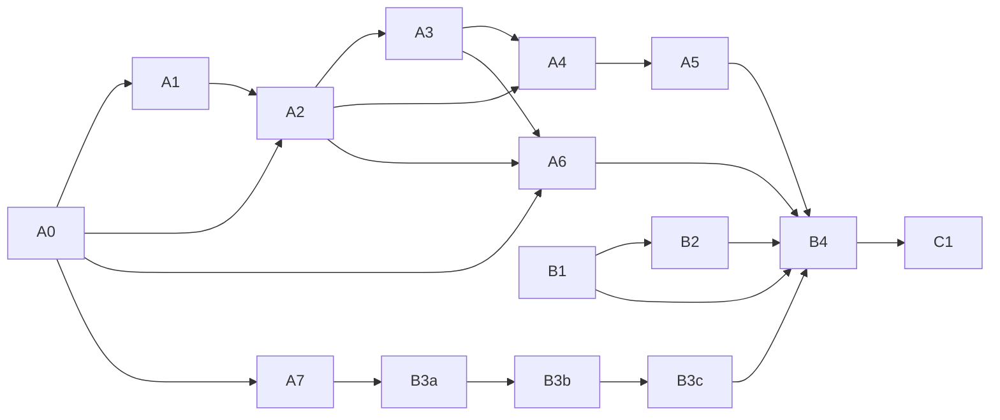

# T027 Remaining Slices (Temporary Working Checklist)

> Status: temporary execution ledger; **tracked in the repository since `babc041` (2026-09-20)** (it was previously hidden by a local `.git/info/exclude` rule, since removed).
> The authoritative ledger remains docs/DEV_PLAN.md, docs/DEV_PLAN_EN.md, and docs/validation/; this file is only a temporary execution ledger.
> Baseline: 68664d8 (2026-09-14, already includes the #38 CI fix). Corrected inventory: 12 required slices + 1 deferrable slice; required size totals are M×7, M-L×1, L×4; including C1 the totals are M×8, M-L×1, L×4.
> **Revision 2026-09-19: B3 is split into B3a (power-loss injection rig and calibration) + B3b (candidate injection matrix and durability verdict)** ⇒ **13** required slices; required size totals become **M×8, M-L×2, L×3**; including C1: **M×9, M-L×2, L×3**. Rationale: A7 disproved that kill-level injection can decide the durability step (CP4≡CP5), and B3's prerequisites (a per-round journal that is itself provably durable, on a second physical device, plus restart inventory and two-way calibration) and its outcome (per-candidate injection and the three-tier verdict) are different kinds of work with different risks; mixing them invites drawing conclusions from an uncalibrated rig.
> **Revision 2026-09-21: add B3c (CONTRACTS durability-upgrade clause, documentation only)** ⇒ **14** required slices; required size totals become **M×8, M-L×2, L×3, S×1**; including C1: **M×9, M-L×2, L×3, S×1**. Rationale: B3b produced a **tiered** verdict (C2 `proven`; C1/C3/C2C3/U4 `unresolved`), while the bilingual CONTRACTS still states "publication durability is unproven" as a **platform constant** with no upgrade condition and no unlock boundary; without freezing the wording first, B4 would stumble between the contract wording and the tiered verdict.

## How to use

1. Slice start: each slice section in this file is the complete input for Flash, including dependencies, steps, goal, current gap, deliverables, acceptance evidence, and boundaries. No extra verbal context is required.
2. Slice completion: tick both language files, update the status table, append the completion log, and write the result back to the T027 section of DEV_PLAN / DEV_PLAN_EN plus the matching docs/validation/ evidence in the original style.
3. This file has been tracked in the repository since `babc041` (2026-09-20) (`commit`/`push` still require explicit same-turn authorisation). If operators rotate, hand over this file together with DEV_PLAN and validation records.

## Cross-cutting gates

- Protocol first: whenever semantics change, update bilingual CONTRACTS, schema, and fixtures before changing Go.
- Immediately after the first substantive code edit, run the focused test for that slice before widening scope.
- Closing validation: run gofmt, go build ./..., go vet ./..., go test ./...; when Node contract fixtures are touched, also run the relevant Node contract check.
- Platform rule: Windows evidence must be collected on native Windows. Linux regression may use GitHub Actions Ubuntu or an approved Ubuntu 24.04 environment, but this checklist must not contain IPs, usernames, SSH key paths, or other connection material. Connection details come only from a local secure runbook or environment.
- Remote validation discipline: use disposable /tmp copies only, then clean them up immediately and verify cleanup. Never modify remote repos, systems, proxies, or long-lived environments.
- After code changes, require an independent Codex review and resolve every medium-or-higher finding.
- Closure discipline (re-run the same step after a fix; iron rule, updated 2026-09-15; **repointed to the new directive on 2026-09-21**): whenever a step fails or needs remediation, re-execute that same step until it passes; never jump ahead after a fix. **The complete wording (the per-step failure-action table, ⑦ is never optional, escalate to ⑤ after two consecutive ⑨ failures, the ⑩ stop point) is owned solely by `docs/DELIVERY_DIRECTIVE.md` §5.3** - this line used to restate it with directive v3.1's ①-⑥ step numbers, which are **incompatible** with the new pipeline numbering (① architecture → ② implementation → ③ tests → ④ integration → ⑤ pre-review → ⑥ scan → ⑦ final review → ⑧ docs → ⑨ native verification → ⑩ stop point); it is therefore no longer restated here, to avoid a drifting duplicate.
- Review records: every pre-analysis / pre-review / final-review / re-review conclusion (including remediation and re-review outcomes) must be recorded in the slice validation report.
- Reply marker: start every reply's first line with [自执行] / [V4 Pro×N] / [Codex×N].
- Push only with same-turn authorization. After an authorized push, watch GitHub Actions. Never touch gitee unless explicitly requested in the same turn.
- Prohibitions: the Agent must not write source, store, policy, or acceptance state; must not self-commit, self-push, or self-publish; must not treat exit 0 or a completed receipt as PASS; must not blindly retry unknown states.
- Encoding stays fixed: both .md files must remain UTF-8 BOM + LF.

## Status table

| Slice | Status | Direct dependencies | Size | Completed | Evidence |
|---|---|---|---|---|---|
| A0 replay-root composition | ✅ Complete | — | M | 2026-09-14 | docs/validation/t027-replay-root-composition.md |
| A1 pure admission | ✅ Complete | A0 | M | 2026-09-14 | docs/validation/t027-pure-admission.md |
| A2 dispatch and launch ambiguity | ✅ Complete | A0, A1 | M-L | 2026-09-14 | docs/validation/t027-dispatch-launch-ambiguity.md |
| A3 terminal publication and settlement | ✅ Complete | A2 | M | 2026-09-14 | docs/validation/t027-terminal-publication.md |
| A4 chain terminal routing and resume | ✅ complete | A2, A3 | M | 2026-09-15 | docs/validation/t027-terminal-routing.md |
| A5 postflight acceptance integration | ✅ Complete (`b8bad47`) | A4 | M | 2026-09-15 | docs/validation/t027-postflight-acceptance.md |
| A6 pinned CLI adapter offline process slice | ✅ Complete (`c2d2819` + `6db5a10` + `c6cf339`) | A0, A2, A3 | L | 52 mutations all RED, native E1–E8 green; the pilot pair missed 1 High (caught by the Codex blind audit); the CI Ubuntu leg exposed a Linux zombie-semantics defect → fixed with a Linux regression test | docs/validation/t027-offline-process.md |
| A7 Windows publication durability ADR + falsification prototype | ✅ Complete (①②③③.5④ all closed; ④ round 6 `RE-REVIEW: PASS`; three commits pushed and two CI runs green: 35118531930 / 35119805652) | A0 | M | | `docs/validation/t027-windows-publication-durability.md` |
| B1 candidate live capability + availability discovery | ✅ Complete (verdict: **no acceptable candidate in the assessed scope** ⇒ stays blocked; 9 live probes, 6 paid; ④ closed in 3 rounds + tool adoption in 6 rounds) | external per-call authorization | M | 2026-09-17 | `docs/validation/t027-b1-candidate-live-discovery.md`, `docs/validation/evidence/b1-20260917/` |
| B2 candidate/enforcement decision + proof | ✅ Complete (2026-09-18; decision = **external OS enforcement**; four commits pushed `58757e8`+`fd99dc3`+`408bd99`+`815c03f`, CI green three times run 35259806285 / 35261204021 / 35265268993; 41-artifact evidence bundle plus the archived rehearsal transcript) | B1 | L | 2026-09-18 | `docs/validation/B2-EXTERNAL-ENFORCEMENT.md`, `docs/validation/evidence/b2-2026-09-17/`, `tools/agent-probe/{appcontainer-b2,enforcement-proxy}/` |
| B3a power-loss injection rig + calibration | ✅ Complete (2026-09-20) | A7 | M-L | calibration `CALIBRATED`: negative control 4/5 losses, positive control 0/5; 36-record journal chain green; all 12 rounds audited `HARD-POWER-LOSS` | `docs/validation/B3A-CALIBRATION_EN.md`; `docs/validation/evidence/b3a-2026-09-20/` |
| B3b candidate injection matrix + durability verdict | ✅ Complete (`abfcecc`) | B3a | M | 2026-09-21 | `docs/validation/t027-b3b-durability.md`, `docs/validation/evidence/b3b-2026-09-21/` |
| B3c CONTRACTS durability-upgrade clause revision | ✅ Complete (`7bdfa0c`) | B3b | S | 2026-09-21 | `docs/validation/t027-b3c-contracts-durability.md`, `docs/validation/t027-b3c-contracts-durability_EN.md` |
| B4 AT-23 E2E evidence + independent review | ⬜ Not started | A5, A6, B1, B2, B3b, B3c | L | | |
| C1 Linux AgentRunner native validation | ⬜ Not started | B4 (Windows T027 complete) | M | | |

Status symbols: ⬜ Not started / 🔄 In progress / ✅ Complete / ⛔ Blocked

## Dependency graph

## Hard gates

- B1 must precede B2: first discover real candidate capability and availability, then make and prove the candidate or enforcement decision. Never invert that order.
- B2 is the candidate or enforcement hard gate before real E2E: a verified compatible candidate or a proven external OS enforcement boundary is required. **That hard gate is satisfied as of 2026-09-18** (the external OS enforcement boundary is measured and archived); B4 must still deliver the AT-23 end-to-end evidence and independent review on top of it.
- B3 is the Windows native durability hard gate: only real crash or power-loss proof can remove the Windows unproven block for first-dispatch. **Split into B3a (rig and calibration) + B3b (candidate injection and verdict); only a B3b `proven` carrying the same premise lifts `unproven`, otherwise the state stays blocked.**
- A2, A3, A4, A5, and A6 are the offline implementation chain that must all land before B4. Completed receipts, request-only receipts, terminal receipts, or durability failures must never directly trigger relaunch, PASS, or task completion.

---

## A0 — replay-root composition · ✅

Depends on: none

- [x] Derive a stable replay root from the durable run or store root and remove production acceptance of arbitrary caller roots.
- [x] Bind runID and cross-restart location rules, defining request, run, workspace, and store ownership.
- [x] Reject source or workspace or store overlap plus alias, symlink, and reparse escapes.
- [x] Define root ownership and recovery preflight checks, then add focused tests.

Goal: make the replay root a stable, restart-safe, auditable primitive instead of an arbitrary caller choice.
Current gap: root derivation, binding, and ownership rules are incomplete, and overlap or escape rejection is not strict enough.
Deliverables: root composition design and implementation, conflict rejection logic, focused tests, documentation write-back.
Acceptance evidence: focused tests covering stable derivation, runID binding, overlap rejection, symlink or reparse rejection, and ownership checks.
Boundaries: do not introduce real dispatch here and do not reopen arbitrary caller roots.

## A1 — pure admission · ✅

Depends on: A0

- [x] Remove any admission consumption of the in-memory RequestIndex or any replay-write side effect.
- [x] Reduce admission to pure preflight and immutable binding that only returns pass or error.
- [x] Document the admission versus dispatch responsibility split and add focused tests.

Goal: admission performs only pure validation and immutable binding, without consuming one-shot dispatch semantics.
Current gap: admission still mixes runtime replay consumption into the preflight path, crossing in-memory and durable responsibilities.
Deliverables: pure admission implementation, responsibility-boundary notes, focused tests.
Acceptance evidence: focused admission tests proving no replay writes, no launch, and error-only preflight behavior.
Boundaries: do not write durable replay records here and do not introduce launch behavior.

## A2 — dispatch and launch ambiguity · ✅

Depends on: A0, A1

- Handoff note (now frozen in the bilingual CONTRACTS): admission is a preflight, not a lock; its verdict may expire. Dispatch must decide launch eligibility after publishing R based on the replay store, and before allowing launch must reconfirm a non-revoked authorization and an outstanding budget reservation, failing closed otherwise.

A2 design rulings (V4 Pro pre-analysis, 2026-09-14; alignment with the A1 contract confirmed sentence by sentence):

- R1 embodiment: a value-semantics `AgentRunnerLaunchReconfirmer` (adapters) performs the narrow reconfirmation only (authorization active/unrevoked/unexpired plus reservation outstanding), invoked after `RecordRequest` returns first-dispatch and before any receipt or spawn; failure returns `ErrAgentRunnerLaunchReconfirmation` with R retained, no receipt, no spawn, no automatic retry (deadlocks defer to A3/operator).
- Receipt protocol: two-file split — pre-spawn `launches/intent.<requestID>.jsonl` (no-replace; unproven platforms reject pre-write exactly like R) and post-spawn `launches/identity.<launchID>.jsonl`; the invariant "no intent ⇒ never spawned" holds cross-platform; a missing identity never relaunches.
- State machine: R-only = unknown-block, never launch; receipt-only = slot owned, never re-publish; receipt+identity = proven launched, never relaunch; R+C = terminal, never launch; only a launcher error (contractually no spawn) permits an in-process Start retry.
- Ownership: `AgentRunnerReplayDispatcher` lives in adapters and implements `chain.AgentRunnerPort`; chain gains the `AgentRunnerLauncher` port plus LaunchRequest/Result DTOs (A6 supplies the implementation).
- A0 regression points: `launches/` must join `bootstrapReplayStoreRoot`, `verifyPathSafetyLocked`, and the ownership/path enumerations.
- Ratified: U1 extract the A1 private validators into shared package functions (A1 tests guard unchanged behavior); U2 chain owns the interface/DTOs; U3 accept no automatic takeover for W1/W2; U4 accept the recheck-to-spawn residual window as a known boundary; U5 receipts embed the reconfirmation evidence digest; U6 sentinel names confirmed (A4 maps them).
- Execution order: freeze the bilingual CONTRACTS first → implement → focused tests → V4 Pro pre-review → Codex → full gates → documentation write-back.

A2 implementation deviations (2026-09-14, confirmed acceptable by the V4 Pro pre-review and the Codex final review):

- The identity record gained a `RequestID` field (to load intents by requestId and classify conflicts; store-local, no wire impact).
- A fifth sentinel `ErrAgentRunnerLaunchFailed` was added (port-contractual unspawned failure), keeping the underlying cause in the error chain.
- Auto-retry stance: the contract only *permits* an in-process retry for a port-contractual unspawned failure; this slice chooses the more conservative never-auto-retry, leaving post-failure handling to humans or upper layers (the state-machine line already reflects this wording).
- Deterministic launchID derivation `"launch-"+requestID`; an already-owned launch slot (including the concurrent first-dispatch window) is uniformly classified as `ErrAgentRunnerDispatchUnknownBlock` (message names the owning launchId; `errors.Is`-identifiable).
- Unproven-platform ordering semantics: receipts and identities allow “write-free exact replay” and reject every new write (the `RecordCompletion` rule); `RecordRequest` rejects unproven first because it carries first-dispatch eligibility.
- Zero `StartedAt`: A6 port implementations must guarantee “a returned result means the process was spawned with a populated identity”; this slice adds no extra rejection (A6 verification point).

- [x] Implement a replay-aware dispatcher that publishes R first, then decides whether first-dispatch may attempt launch.
- [x] Define durable launch or process-identity receipts plus unknown reconciliation across crash windows.
- [x] Ensure request-only, terminal, convergence, and durability failures never relaunch blindly.
- [x] Add focused tests for first-dispatch single winner, crash windows, and unknown reconciliation.

Goal: bind launch eligibility to dispatcher-owned replay and receipt semantics rather than call timing guesses.
Current gap: dispatch versus launch ownership is ambiguous, and crash-window plus unknown-state rules are not yet provable.
Deliverables: replay-aware dispatcher, launch-receipt rules, unknown reconciliation logic, tests.
Acceptance evidence: focused tests proving only first-dispatch may attempt launch and unknown states never relaunch blindly.
Boundaries: do not finish settlement, postflight, or real candidate execution in this slice.

## A3 — terminal publication and settlement · ✅

Depends on: A2

A3 design rulings (V4 Pro pre-analysis 2026-09-14, aligned with the A0/A1/A2 discipline):

- Order (four phases): terminal-intent (no-replace, embedding the full C record and the settlement plan) → ledger `Settle` (deduplicated by idempotencyKey) → `RecordCompletion` publishes C → terminal-closure completes the chain; when C becomes externally visible, the settlement decision is already booked.
- Record set: `terminals/terminal-intent.<requestId>.jsonl` plus `terminals/terminal-closure.<requestId>.jsonl` (store-local, separate domain digests, no-replace with bounded reread convergence); wired into bootstrap, the production constructor, the locked runtime path re-check, and the ownership preflight enumeration.
- Idempotency keys: `settle-<20hex>` = digest over domain `proofrail:agent-runner-settlement-key:1` of (requestId, C.recordHash); EntryID reuses the same value; CompletionID is `"completion-"+requestId`; the ledger is idempotent for the same key and payload and rejects a different key for the same reservation; evidence carries both the C and R recordHash.
- Unknown retention: an `uncertain` C or `usageComplete=false` permits only an unknown settlement; after an unknown settlement `RequireOutstandingReservation` **fails** under the existing semantics, and the hold is observed through `UnknownHoldReservations()` / `Summary().UnknownReservedAmountMicros` / shared caps; the reservation is never reusable and never relaunches.
- Rejection matrix: a C without an intent is an orphan (never adopted by writing an intent back); a reservation already settled under a different key never receives a C; charged>reserved, missing evidence or evidence lacking the C/R digests, and intent payload conflicts all fail closed; a different outcome for the same request is a conflict; republishing a complete chain is an idempotent replay.
- Unproven-platform hard rule: any new terminal publication is rejected for the whole chain before any settlement; an already-complete chain allows write-free replay only.
- Recovery discipline: store-local records only (the intent is the sole recovery source); the ledger is an enforcer, never a query source; recovery is an idempotent completion of a slot we already own and is not takeover (W1/W2 unchanged).
- Ownership: `AgentRunnerTerminalPublisher` (adapters, value semantics, depending on `*tickets.CostLedger` plus test-only single-shot hooks afterIntentWrite/afterSettle); chain is untouched (A4 boundary); no Engine, no real candidate.
- Ratified open points: the intent embeds the full C (adopted; recovery requires it); no new ledger query path (adopted); completed with missing amount evidence allows unknown (adopted; otherwise a C without any settlement decision record would exist); uncertain permits unknown only and defines no upgrade (deferred to A5); the durability precheck moves before Settle (adopted and frozen in CONTRACTS).
- Execution order: freeze the bilingual CONTRACTS first → implement → focused tests → V4 Pro pre-review → Codex → full gates → documentation write-back.

A3 implementation and review outcome (2026-09-14): the four-phase protocol, two-file records, idempotency keys, and rejection matrix all landed. V4 Pro implementation pre-review: conditional pass (no High) — H1 (missing resume session binding) now preflights through the shared `ValidateAgentRunnerCompletionBinding`; M1 switched to semantic slot matching (completionHash + plan) with clock-skew tests; M2 prevalidates evidence before the intent with deterministic dedupe and exact membership matching; M3/L1/L5 were remediated with tests. Codex final review: conditional pass (no High) — unproven complete-chain replay is strictly write-free (no ledger call); converge reuses the full closure binding check (including settlement keys) and `RecordTerminalClosure` re-checks the intent runId; the different-clock concurrency test gained a start barrier plus a deterministic sequential case; the happy path asserts both hooks fire; three missing counterexamples were added (write-free replay, closure key mismatch, recovery requiring the persisted request). Codex remediation re-review (2026-09-15): PASS (no Critical/High/Medium; signable, with three recorded low-risk test-rigor gaps that do not block sign-off). Tail-item remediation complete (single-point beforeSettle probe, both counterexamples hardened, dedicated runId regression), Codex extra confirmation (user-authorized beyond the budget): PASS (revert-sensitive, no new defects); full local gates all green. Committed as `c6f8585` and pushed; GitHub Actions Ubuntu (including the Race step)/Windows green (run 34900979883).

- [x] Define the stable order for completion C publication, usage or cost settlement, and idempotency key creation.
- [x] Handle crash recovery and duplicate publication, keeping reservations when settlement remains unknown.
- [x] Reject ambiguity between C-without-settlement and settlement-without-auditable-C.
- [x] Add focused tests for ordering, idempotency, and crash recovery.

Goal: make terminal publication and settlement a stable, recoverable, auditable completion chain.
Current gap: completion publication and usage or cost settlement order is not fixed, and crash-time idempotency plus reservation handling is underspecified.
Deliverables: publication or settlement ordering implementation, stable idempotency key, recovery logic, tests.
Acceptance evidence: focused tests proving no completion without settlement and no settlement without an auditable completion.
Boundaries: unknown settlement may only retain reservation and must never fabricate completion.

## A4 — chain terminal routing and resume · ✅

Depends on: A2, A3

A4 design rulings (V4 Pro pre-analysis 2026-09-15; U-1..U-9 ratified; aligned with the A0–A3 discipline and the T025 machinery. Protocol-first is already landed: the bilingual CONTRACTS §2.1 state row, the new §7 "Chain terminal routing" paragraph, and the operator-paragraph seam are frozen):

- DTO ownership: the new `internal/chain/agent_runner_terminal.go` defines the chain-owned `AgentRunnerTerminal` (five-state enum completed/failed/cancelled/operator-action-required/uncertain; binding RequestID/RequestHash/CompletionHash/Run/Task/Step/Attempt/SessionID/Prior* plus deduplicated ordered evidence hashes; no settlement digests, no wire details); adapters add the one-way translation `ToChainAgentRunnerTerminal` (new `agent_runner_terminal_chain.go`), failing closed on zero values, mixed modes, missing hashes, `CompletionHash∉Evidence`, and resume-session inequality.
- New step state `TERMINAL_PENDING` (U-2): `RUNNING→TERMINAL_PENDING` (evidence = the three dispatch hashes) means "dispatched, awaiting terminal"; `TERMINAL_PENDING→WAITING_FOR_OPERATOR|PASSED|FAILED|CANCELLED`; sync the `evidence/event.go` transition table and schema/checker fixtures (protocol first); it is not a schedulable resting state — after a restart without terminal evidence it is treated as an uncertain pause.
- Delivery path (U-6, push model): the Engine gains `SubmitAgentRunnerTerminal` as the only write entry for an external receipt into core state; no new port, no replay-store reads; runStep for AgentRunner steps becomes dispatch-success → `TERMINAL_PENDING` → return `ErrAwaitingAgentRunnerTerminal` (it no longer takes the step-passed path); RUNNING re-entry is resume-only.
- Routing table: completed → step `TERMINAL_PENDING→PASSED` only (the task still goes REVIEW_PENDING→acceptance→review→completed promotion→PASSED, and the chain completes only after every task is accepted); failed → task FAILED (no auto retry/relaunch); uncertain (U-5) → task FAILED + chain PAUSED (stay paused, never retry, repair requires a new attempt; only a chain that is RUNNING is rewritten); cancelled → archive stop evidence before the terminal write; operator-action-required (U-4) → write task/step `WAITING_FOR_OPERATOR` plus chain `RUNNING→PAUSED` (both carrying the C hash) and then enter the T025 machinery, requiring five additive match extensions (waiting task/step binding ×2, resume-side task/step binding ×2, paused-chain binding ×1; existing paths unchanged). Routing itself pauses the run so a restart can still open the interaction and converge (the pre-review Medium remediation).
- A4 pre-review and remediation (V4 Pro, 2026-09-15): the pre-review found 1 Medium (the operator route left the chain RUNNING, so a restart followed by Recover wrote a `recovery-uncertain` pause that neither Open nor Run could leave, making the route permanently unconvergeable) and 2 Low (the open-side binding is weaker than the classic path and must be documented; an uncertain terminal while the chain is already paused never reaches PAUSED). The re-review found 1 further Low (replaying an operator terminal after the operator machine had returned control pushed the task and chain back into waiting) plus missing documentation. Remediation: the route pauses the chain, `operatorWaitingPauseMatches` accepts the pause reason additively, `convergeAgentTerminalRoute` treats a route whose step is no longer waiting as converged with zero writes, and the bilingual contract records the pause, the additive acceptance, the ledger-exclusivity boundary, and the uncertain-pause boundary. The re-review reported no Medium+ findings; the boundaries now live in CONTRACTS §7.
- Resume continuity: resume = same attempt / same session / same workspace, binding `priorSessionId` and `priorCompletionHash`; `PriorCompletionHash ∈ that step's event-evidence history` is the only provable criterion (chain reads no store); any failure means `ErrAgentRunnerResumeContinuityUnproven` with zero writes (U-8, whole-table rejection); a new attempt is built by the CLI from the durable envelope (U-9; chain only refuses, never guesses); U-7: A4 does not yet lift the dispatcher/admission resume refusal (deferred to A6).
- No-direct-pass invariants (acceptance evidence): a completed terminal never produces task PASSED/chain COMPLETED; non-completed terminals make zero downstream calls; the single write point for an AgentRunner step's step-passed is the Submit route; a receipt itself has zero state side effects (the publisher does not depend on chain); repeated terminals converge idempotently and different terminals conflict; `TERMINAL_PENDING` joins the recover uncertainty list.
- Expected existing-test change: `TestEnginePreparesAgentRunnerIntentBeforeSingleExecutionPort` (dispatch no longer completes the step directly; the test must inject a Submit terminal); T025 existing cases are guarded as-is (match extensions must be pure OR branches).
- Execution order: protocol-first frozen (this step) → `evidence/event.go` transition table and fixtures → chain DTO/routing/Engine → adapters translation → focused tests → V4 Pro pre-review → Codex final review → full gates → documentation write-back.

- [x] Introduce a chain-owned terminal DTO distinguishing completed, failed, cancelled, operator-action-required, and uncertain.
- [x] Implement session create or resume continuity, binding priorSessionId and restart paths.
- [x] Ensure an external terminal receipt never directly marks a task PASSED, a chain COMPLETED, or bypasses build, verify, review, or promotion.
- [x] Keep the rule precise: an AgentRunner code step may only reach a verified step-complete state through explicit core handling, while task acceptance remains the existing downstream flow.
- [x] Add focused tests for routing, resume continuity, duplicate terminal handling, and no direct PASS.

Goal: centralize terminal semantics in chain routing and resume handling instead of letting adapter receipts drive task outcomes.
Current gap: terminal DTO, resume continuity, and acceptance boundaries are not tight enough, leaving room for receipt overreach.
Deliverables: chain terminal DTO, routing or resume logic, tests.
Acceptance evidence: focused tests proving external terminal receipts cannot directly cause PASSED, COMPLETED, or skipped downstream stages.
Boundaries: do not decide postflight acceptance here and do not move policy ownership out of the existing downstream flow.

## A5 — postflight acceptance integration · ✅

Depends on: A4

A5 design rulings (V4 Pro pre-analysis 2026-09-15; U1..U7 ratified; aligned with the A0–A4 discipline, the A3 recovery source, A4 routing and the T025 machine):

- Single mechanism (no new engine entry point, no new task state): a chain-owned **postflight gate** is inserted in `runTask` after the steps loop and before `REVIEW_PENDING` is written, and only for tasks containing an AgentRunner step. The gate opens only when three things hold together: (a) the frozen-facts DTO attached to a completed terminal (five mutually distinct digests), (b) the same facts rebuilt by chain from the step's terminal-passed routing-event evidence prefix (recoverable across restarts without reading the replay store), and (c) the raw `PostflightPort` decision (passed/failed/uncertain, where passed must carry all five fact digests or it is treated as failed). Tasks without AgentRunner steps keep the original path unchanged.
- Frozen-facts DTO `AgentRunnerFrozenFacts` (new `internal/chain/postflight.go`): exactly five digests — `ManifestHash`/`DiffHash`/`LogHash`/`UsageHash`/`ProcessStopEvidenceHash`; mutually distinct and distinct from RequestHash/CompletionHash; it must NOT contain decision fields (Outcome/Assessment/Passed/PolicyDisposition), an exit code as a decision field, settlement status/amounts, review/promotion decisions, authorization grants or policy hashes, or full wire records (digests only).
- DTO ownership and validation: `AgentRunnerTerminal` gains `Facts *AgentRunnerFrozenFacts` (U5); `Validate` tightens to **completed must carry Facts, non-completed must not**; `routeEvidence()` extends to `[RequestHash, CompletionHash, five fact digests, ...Evidence]` (deduplicated, order preserving) and the gate rebuilds positionally from 2..6 (U4), with mutual distinctness as the anti-collision premise.
- Fact persistence (U1): facts live in the terminal-intent (A3's only recovery source) as an optional store-local block that is mandatory for completed; `ToChainAgentRunnerTerminal` projects them one way; the publisher requires `outcome.Facts` before writing the intent (rejection before settlement, A3 order unchanged).
- Port (U6): `PostflightPort{ RunPostflight(ctx, PostflightRequest) (PostflightDecision, error) }` is a **required** `Options` port (nil-checked in `New`); the console stub is fail-closed (never called on the noop-only path). Port contract: it must re-derive everything itself (fresh stop evidence, re-capture the manifest and diff it against the parent, scope/secret/type and side-effect checks) and reconcile field by field against the frozen facts; it must not write state and must not touch the Engine.
- Failure routing: a postflight rejection (failed with complete evidence) → `markTaskForRepair` with reason `postflight-rejected` (task `REPAIR_PENDING` + chain `PAUSED`, zero Accept/Review/Publish calls); this needs the protocol-first transition `STEPS_RUNNING→REPAIR_PENDING` (U2, reserved for postflight rejection); uncertain → task `FAILED` plus `PAUSED` on a `RUNNING` chain (reason `recovery-uncertain`, `Run` refuses to retry); a port error → `failTask("postflight-failed")`; missing/out-of-range/colliding facts → `failTask("postflight-facts-missing")`.
- Idempotency and crash windows: the gate runs only while the task is still `STEPS_RUNNING`; the `REVIEW_PENDING` transition gains a state guard, which **also fixes the pre-existing re-entry self-transition defect** (U7, otherwise the postflight idempotency tests cannot hold); a restart between facts-in-evidence and postflight converges by rebuilding; replaying a completed terminal with a different five-digest prefix is refused as a conflict.
- Acceptance invariants: exit 0, a completed receipt or any adapter record never directly produces task PASSED; the single task-PASSED write point stays at the end of `runTask`; a passed postflight is the only qualification for `REVIEW_PENDING`.
- Existing tests expected to change (legitimate semantics upgrade, to be named in the validation report): the chain-side `agentRunnerTerminal()` helper gains Facts and drags the completed cases with it (routing-matrix completed row, partial-write convergence, recover-parked, validate fail-closed); `engine_test.go testOptions` gains a fake PostflightPort and `TestEnginePreparesAgentRunnerIntentBeforeSingleExecutionPort` injects a terminal with Facts; adapters-side translation/publisher/store fixtures gain Facts on completed intents.
- Residual boundaries (accepted, documented): the engine runs gate hook steps (build/test/verify) before `Acceptance.Accept`, which differs in wording from CONTRACTS §7 "gates after freeze"; this slice does **not** reorder them and leaves the reconciliation to the B4 final review; the port implementation quality is the only trust boundary; the single-driver assumption is unchanged; `Accept` idempotency between `REVIEW_PENDING` and `Accept` remains a pre-existing assumption.
- ④ Codex re-review, second round (2026-09-15): a new Medium was found and remediated: a task already resting in `REVIEW_PENDING` skipped the gate and went straight to acceptance, so a pre-A5 review state (or a review state without a gate trace in a damaged store) could reach PASSED without any postflight, contradicting the new contract sentence. `requirePostflightQualifiedReview` was added: when a task with routed completed terminals is re-entered in `REVIEW_PENDING`, its review transition must prove all five fact digests are present, otherwise the run is refused with zero writes (new sentinel `ErrUnqualifiedReview`); tasks without facts keep the pre-existing path. ④ re-review PASSes after both remediation rounds.
- ④ Codex final-review remediation (2026-09-15; High 1 + Medium 2, all closed): (1) **the self-added "refuse when a fact digest equals the parent snapshot digest" rule was withdrawn** — `parent.Hash` is the accepted snapshot's manifest digest, and under the ratified port contract ("re-capture the manifest and diff it against the parent") a no-change execution legitimately equals it; that discrimination needs an independent re-capture and belongs to the port alone, while the chain enforces only what is provable (five mutually distinct fact digests, distinct from the request/completion digests, positionally rebuildable). The bilingual CONTRACTS paragraph now says so, and the ③ pre-review Low "facts colliding with the parent digest" **becomes a port obligation** (the port must re-capture and reconcile, never pass merely because the digests are equal). (2) Completed routing records written before A5 carry no fact prefix: replaying them is refused whole as a conflict with zero writes and **cannot be resumed in place** (re-execute as a new attempt) — recorded as a compatibility boundary in the contract and the validation report. (3) `TestPostflightDecisionRejectsMalformedEvidence`'s first case was masked by the shared "missing fifth fact" cause; it now adds an extra malformed digest on top of all five facts, and mutation proved that deleting the digest loop reddens it. Adapter-side counters were added too: the intent constructor (completed without facts, non-completed with facts, non-distinct facts) and the publisher (completed without facts refused before any intent or settlement).
- Execution order: protocol-first (bilingual CONTRACTS §2.1 task row + the new §7 paragraph → schema `taskTransition` with `REPAIR_PENDING` → new fixtures + count 128) → `evidence/event.go` transition table → chain `postflight.go`/`models.go`/`agent_runner_terminal*.go`/`engine.go` → adapters (intent Facts/publisher/translation) → console stub → focused tests (including the named upgrades) → V4 Pro pre-review → Codex final review → full gates → documentation write-back.

- [x] Make the chain own policy and state while adapters only report frozen facts such as manifest, diff, log, usage, and process-stop data.
- [x] Bind and reuse the existing freeze, gates, review, and promotion flow.
- [x] Ensure exit 0 or a completed receipt never directly causes task PASS.
- [x] Add focused tests for postflight pass, postflight fail, and frozen-fact injection.

Complete: 2026-09-15. `internal/chain/postflight.go` lands the chain-owned postflight gate and the five-digest frozen-facts DTO, `Options.Postflight` is mandatory (the console stub fails closed), `runTask` runs the gate after the steps and before `Acceptance.Accept`, and only a passed decision carrying all five fact digests writes `REVIEW_PENDING`; protocol-first added `STEPS_RUNNING→REPAIR_PENDING` plus 2 fixtures (count 128); a completed replay with identical facts converges while divergent facts or unrebuildable evidence are refused as a conflict with zero writes; `REVIEW_PENDING` re-entry now requires a qualification proof (`ErrUnqualifiedReview`). Two rounds of ③ pre-review and three rounds of ④ final review are fully closed (round three `PASS`), with five mutation checks. **Committed as `b8bad47` and pushed; GitHub Actions Ubuntu (with the Race/Contract fixtures steps) / Windows fully green (run 34950623175). A5 is fully closed.** Validation: [中文](validation/t027-postflight-acceptance.md) / [English](validation/t027-postflight-acceptance_EN.md).

Goal: route acceptance back through chain-owned postflight instead of letting adapters or exit codes decide task success.
Current gap: policy and state ownership can still leak toward adapters or terminal receipts, and postflight acceptance wiring is incomplete.
Deliverables: postflight acceptance integration, frozen-fact DTO usage, tests.
Acceptance evidence: focused tests proving only successful postflight can advance acceptance.
Boundaries: adapters must not write policy or acceptance, and this slice does not perform real E2E.

## A6 — pinned CLI adapter offline process slice · ✅

Depends on: A0, A2, A3

- [x] Build a stub-CLI offline loop with an isolated workspace and no real candidate.
- [x] Complete guard, Job Object, start, stop, process tree, and timeout management.
- [x] Capture logs, events, manifest, diff, and usage, and validate crash or cancel paths.
- [x] Add focused tests for start, stop, timeout, tree kill, and missing logs.

Goal: finish the offline process and evidence layer for a pinned CLI adapter before any real-candidate work.
Current gap: there is no fully testable offline process slice for workspace isolation, guard behavior, and evidence capture.
Deliverables: stub CLI adapter loop, isolated workspace lifecycle, evidence capture, tests.
Acceptance evidence: focused tests proving the offline start or stop or timeout or process-tree paths are complete and recoverable.
Boundaries: do not connect a real candidate and do not treat this slice as candidate-compatibility proof.

A6 completion record (2026-09-15; committed and pushed to `origin/main` as `c2d2819` on 2026-09-16, fix commit `6db5a10`, CI green): scope and implementation in `docs/validation/t027-offline-process.md`; ③ V4 Pro pre-review closed all 7 rounds (final `PASS WITH FIXES`, nothing blocking); **④ pilot**: Haiku (`quick-verifier`) ×1, 0 items with its own "suspicious" flag and a format deviation (added prose); MAI (`independent-reviewer`) ×2 (first round FINDINGS + re-review PASS after remediation), 2 independent findings (1 High + 1 Medium), **both confirmed by the driver actually executing them** (the new counterexample case reddened on its first run; the 200-round simultaneous-race experiment gave cancelled 138 / timeout 62 → 200/0 after the fix), A11 spot-checks 2/2 hit; Codex fallback during the pilot stage 0/2; probes 1/2 (resolving the ④ model id, 1 left).

A6 CI closeout (2026-09-16): after `c2d2819` was pushed, `main CI` (run `35074301616`) was green on the Windows leg and **failed the Test step on the Ubuntu leg** (12 pinned-CLI cases: `termination uncertain: context deadline exceeded`). Root cause: the Linux aliveness probe read a process that had exited but had not been reaped by its parent as alive (its `/proc` entry, start token and `kill(-pgid, 0)` all survive), so the **stop path that does not own the child handle** reported a completed stop as uncertain. Fix: `process_linux.go` now parses the `/proc` state and pgrp (`Z`/`X`/`x` read as not running) and `processGroupAlive` scans `/proc` for a non-terminal member when signal 0 still succeeds (EPERM keeps the conservative semantics); a Linux-only regression test `TestLinuxStopProvesAnUnreapedTerminatedChild` (deliberately unreaped child) was added. With fix commit `6db5a10` pushed, CI (run `35076045445`) is **fully green** (Windows 1m00s / Ubuntu 1m39s, including Race and the contract suite 4/4). The CI evidence is now frozen in commit `c6cf339` (`docs: record A6 CI evidence`: the bilingual DEV_PLAN A6 entry, the backfilled hash and green run id in validation report §14, and the bilingual CONTRACTS platform rule for “verified gone”), whose CI run `35078424963` is **fully green** too (Ubuntu 1m35s including Race/contract fixtures, Windows 1m16s).

A6 additional independent audit (2026-09-15, explicitly authorised by the user in the same turn, for the pilot's residual-miss assessment): after ④, Codex (`independent-reviewer`, `GPT-5.3-Codex (copilot)`) ran **3 times** — call 1 was the blind audit (scope, contracts and a read-only constraint only) and returned `RE-REVIEW: FINDINGS` with **2 NOVEL items** = 1 High (`refuseForeignSlot` failed open on "any read error other than NotExist" and on "an empty owner": after a restart, an unreadable slot plus a foreign launchId could still go through the mirror and stop a live process) + 1 Medium (it claimed stopping had "two mechanisms"); call 2 was the re-review after remediation (**`RE-REVIEW: PASS`**); call 3 was the test-delta review (the driver had rewritten assertions after that re-review, so the "a change you made yourself must be reviewed by an independent party" rule required another pass: **`RE-REVIEW: PASS`**, Section B empty, and Section D's three un-pinned invariants were then pinned). Adjudication: the High was **confirmed and fixed** into a three-arm fail-closed switch (new mutations M52/M53/M54); the Medium was **partially rejected** (read as "one guard identity mechanism with two entry points", with the contract wording tightened in both languages to "one mechanism, two entry points, no third channel"). **Residual data**: the pair missed 1 High in this slice (caught by the blind audit, confirmed by 4 mutations) while ③ missed 0 → recorded as "the combination can serve as a low-cost supplementary scan layer for regular slices; the hard-gate slices A7/B2/B3/B4 keep Codex as their final review", with promotion left to the user; the §6 mild-failure remedy path (re-run MAI) was not taken and the user-authorised Codex re-review closed it instead, registered as a deviation. Mutations: **52 total, all RED / SURVIVED 0** (48 in part 1 plus M52–M55 in the Codex round; M49's anchor text was superseded by the High fix, re-added as the equivalent M55 and actually run; the test was strengthened twice and re-run each time, with every restore verified by SHA-256). Native E1–E8 green; all gates green (including the 128 contract fixtures).

A6 design ruling (① V4 Pro pre-analysis 2026-09-15, Max; the driver approved **U1–U14 all on the recommended option**, with U1/U3/U5/U9 verified against the code): full analysis in `docs/t027/A6_PRE_ANALYSIS.md` (local working draft). Key points —

- **Scope**: no new task/step states, no new wire record types, zero schema or contract-fixture changes, and no CI-workflow changes (the `internal/release/workflow_test.go` frozen contract is untouched); **protocol-first in exactly one place**: the bilingual CONTRACTS §7 gained the A6 offline-run section (offline artifact layout `<runRoot>/agent-runner-replay/runs/<requestId>/` with the five frozen fact digests, the evidence-gap downgrade table, timeout/cancel semantics, the stub version binding, and `executableHash` recorded but never used for admission).
- **Implementation surface**: new `internal/adapters/agent_runner_pinned_cli.go` (launcher), `agent_runner_process_registry.go`, `agent_runner_timeout.go` (watchdog), `agent_runner_evidence.go`, `agent_runner_run.go` plus their tests; `tools/agent-stub/` (the deterministic stub, **⑤ experiments only**; unit tests re-exec through the `PROOFRAIL_*_HELPER` mode, following `guard/process_test.go:19`); an **additive** extension of `chain.AgentRunnerLaunchRequest` (`Command/Args/Dir/Env/Timeout/Grace/WorkspaceRoot`, replay/receipt semantics unchanged); a `runs/` subdirectory under the replay root; and one bounded-context fix in `guard/process.go` (**U1**: `process.go:129` was an unbounded `context.Background()` while lines 103/110 of the same function were already bounded — inconsistent, with a real hang window).
- **Terminal mapping (U11)**: completed ⇔ exit 0 and tree stopped (including re-verifying the child PID set the stub self-reports after a natural exit) and complete logs/usage and a post manifest + diff; a non-zero exit ⇒ failed; an external stop/cancel ⇒ cancelled (stop evidence archived first); timeout / log or usage gap / surviving tree / collection failure ⇒ uncertain (`Facts=nil`); stub `ask` ⇒ operator-action-required; **no gap may be expressed as "an empty DTO field" — the terminal simply may not be completed**.
- **Identity and stopping (U9)**: the ProcessID is opaque canonical JSON `{"pid":N,"startToken":"..."}` mirrored to `<runDir>/managed-process.identity.json` (field names identical to `guard.ProcessIdentity`'s JSON tags), so an operator stop needs zero new code (`console/stopper.go:15` already reads it).
- **Not doing (U10)**: no new store-local run-state record — a pre-write before spawn cannot prove W2 either; "zero new persistent record types" stands.
- **Testing and ⑤**: C.1 all focused tests join the default `go test ./...`, each bound to a mutation target (removing that guard must redden); C.2 native experiments E1 tree leak / E2 timeout boundary / E3 cancel race / E4 crash injection run under `//go:build a6native` with an env-configurable round count (default 20) and **never enter the default test path** (to avoid CI flakiness).
- **Residual unprovable**: W2 (after spawn, before identity) and W4 (liveness while the host crashes) are unprovable offline (handed to A7/B3); the full process-tree set cannot be proven (only the stub's self-reported set is verified); the Windows job-close async window converges through the `VerifyWait` bound; time assertions only prove intervals (a ±50ms lower bound).

A6 implementation progress (2026-09-15, **condensed**; the full step-by-step log lives in the Chinese tracker `REMAINING_SLICES.md`): protocol-first finished the bilingual CONTRACTS §7 A6 section; the first implementation batch (**U1**) made the `guard/process.go` cancellation path bounded (`stopVerificationContext(grace)` / `boundedTerminationContext`), added the `verify`/`verifyGone` seam and a regression test that reddens if the branch is reverted to an unbounded context; the second batch landed the integration points (`runs/` evidence subdirectory, `RunEvidenceDir`, `RunRoot`, the additive launch-request fields, dispatcher forwarding), the process registry (lifecycle phases, opaque ProcessID, atomic identity mirror; 3 mutation checks), the watchdog (cancel wins the single-winner race; 4 mutation checks, one assertion rewritten after it proved non-falsifiable), the evidence collector (raw-byte log digests, closed usage shape, strictly decoded events; an 11-item mutation audit that exposed and fixed three real defects) and the pinned-CLI launcher (version precheck through `guard.RunManaged` so adapters import no `os/exec`, single spawn, launcher-owned logs, two stop paths, handle retirement; 9 guards all falsifiable). It also fixed a repository boundary violation (the `os/exec` import tripped `TestProductionCodeHasNoDirectNetworkImports`; the precheck was routed through `guard` instead of whitelisting the import) and a test flake (a too-tight upper bound relaxed to a hang guard). Each batch ended on a green checkpoint (`gofmt -l` empty, `go build ./...`, `go vet ./...`, full `go test -count=1 ./...`).

## A7 — Windows publication durability ADR + falsification prototype · ✅

Depends on: A0

- [x] Write the ADR first, enumerating candidate publication protocols. If a marker is considered, treat it only as a candidate, not a presumed proof. (ADR-013: C1–C6 plus exclusions)
- [x] Evaluate torn or stale writes, R-versus-marker cross-file consistency, multi-process fencing or reuse, and every crash point. (rows A–D plus E2–E10)
- [x] Build the smallest falsification prototype and conclude only proven, disproven, or unresolved. (5 in-suite tests plus 7 `a7native` experiments)
- [x] Keep Windows in the unproven state and do not enable real dispatch here. (production gains only a nil-default, semantics-free seam)

Goal: determine whether a Windows publication durability protocol survives falsification pressure instead of assuming a two-phase marker is already valid.
Current gap: there is no pressure-tested protocol conclusion that can support unlocking native Windows first-dispatch.
Deliverables: ADR, falsification prototype, conclusion record, focused tests or experiment logs.
Acceptance evidence: the outcome is explicitly proven, disproven, or unresolved, with matching experiment or test evidence.
Boundaries: this slice does not change the unproven state and does not allow real dispatch.

Completion record (2026-09-16):
- Verdict (**the level and its premise must be read together**; premise P = process-level crash, no power loss, single host Windows 11 / NTFS on the local volume): the visibility and arbitration layer is `proven` (P1–P5); power-loss durability is `unresolved` (U1–U5); the falsified **claim** set D1–D6 is `disproven` throughout; the power-loss durability of candidates C2/C3 stays `unresolved` as B3 injection candidates; **Windows publication durability stays `unproven` with first-dispatch still refused**; T027 remains `BLOCKED / NOT IMPLEMENTED` and AT-23 has not passed.
- Review: ① V4 Pro pre-analysis (candidates C1–C10, the four-row matrix, the prototype design, the ADR placement); ③ V4 Pro pre-review `PASS WITH FIXES` plus three re-reviews to `RE-REVIEW: PASS`; ③.5 the MAI low-cost combination over two rounds (`FINDINGS` → `INDEPENDENT SCAN: PASS`); ④ Codex's independent final review over six rounds (rounds 1–5 `FINDINGS`, 1 High + 10 Medium + 5 Low in total, all fixed; round 6 **`RE-REVIEW: PASS`**).
- Gates (Windows host): `gofmt -l` empty, `go build ./...`, `go vet ./...` and `go vet -tags a7native ./internal/adapters/` clean; `go test -count=1 ./...` all 13 packages ok; contract 4 tests / 4 pass / 0 fail; `PROOFRAIL_A7_ROUNDS=20 go test -tags a7native -count=1 -run TestA7Native ./internal/adapters/` → `ok … 21.696s`.
- Probe budget: 0 of 10 used (fully offline).
- Commits and CI (2026-09-17): `cc9adf4` (the production seam plus four test files) then `dee0066` (report, ADR-013, dev plan) then `555ce19` (`docs: record A7 CI evidence`, documentation only) are all pushed to `origin/main` (`c6cf339..555ce19`).
  - run `35118531930` (head `dee0066`) is **fully green** (~2m04s): the Windows leg passed Build/Vet/Test (Race and Contract fixtures skipped by `runner.os`) while the Ubuntu leg passed Build/Vet/Test plus **Race** (`CGO_ENABLED=1 go test -race -count=1 ./internal/adapters/... ./internal/chain/...`) and Contract fixtures (4/4) - so the five in-suite A7 tests really ran under the Linux race detector.
  - run `35119805652` (head `555ce19`) is **fully green** (~1m57s) with the same per-step conclusions (that commit touched documentation only).
  - **Boundary correction**: the report and dev plan no longer say "a7native is not in CI" but "**only** a7native is not in CI" - the five in-suite A7 tests run on both legs and have already passed under `-race` on Ubuntu.
- Left open: `a7native` is not in CI (re-run by hand on a Windows host); E4/E6/E9/E10 are Windows-only; U1–U4 (real power loss plus a per-round crash journal on a different physical device plus a restart inventory) and the C2/C3 injection validation go to B3; E8's `.tmp` residue accumulates and is deliberately not fixed here.

## B1 — candidate live capability + availability discovery · ✅

Depends on: external per-call authorization

- [x] Obtain this call's authorization, then discover and pin the candidate. (10 probe accesses authorized in the same turn; dual pin 1.0.83 and 1.0.85)
- [x] Run the smallest real probe first to establish actual tool, network, session, process, and usage capability plus availability. (9 attempts / 6 paid requests: both 1.0.85 bypass reproductions, the 1.0.83 control and the zero-tool `PONG` smoke)
- [x] If there is no acceptable candidate, remain blocked and do not enter B2. (no acceptable candidate in the assessed scope ⇒ stays blocked)
- [x] Record the probe results and availability conclusion, then update the ledger. (bilingual validation report plus this section and DEV_PLAN)

Goal: establish real candidate capability and availability facts before any decision is made.
Current gap: real-candidate capability, availability, and paid-authorization state are still unverified facts.
Deliverables: candidate discovery result, pin details, minimum real probe record, availability conclusion.
Acceptance evidence: real probe records proving capability and availability, or proving that no acceptable candidate exists.
Boundaries: no real probe without authorization, and no help-text or static-doc evidence in place of actual capability proof.

Completion record (2026-09-17):
- **Verdict**: **no acceptable candidate within the assessed scope** (the stable channel of the GitHub-hosted Copilot CLI, **1.0.83** and **1.0.85**): T026's two unsupported items (the `gci` alias bypass under `toolControl`, the shell-egress bypass under `networkControl`) **still reproduce on 1.0.85** (with OS-level runtime argv evidence: the deny flags really reach the candidate process while the covered command is executed by a child the CLI spawns itself). ⇒ **stays blocked**, no candidate-native route for B2; **neither assessed nor excluded**: BYOK `deepseek-anthropic` and non-Copilot-CLI families.
- **Probes**: 9/10 attempts, **6 paid premium requests**; #3/#4/#5 and one excluded artifact were zero-cost; no production change in the workspace.
- **Product defect DR-1 (registered, not fixed)**: `ai check` forwards `--max-requests` straight into the CLI's `--max-ai-credits` (`ai_probe_copilot.go:111`) while it also forces `--max-requests == 1` (`console/ai.go:46`) and the CLI requires ≥30 ⇒ the product availability probe **cannot drive this candidate** (`ai-availability` returns `unknown`, `requestsUsed=0`) ⇒ **no real availability verdict exists yet**. Fixing it is a production change needing its own contract-first slice.
- **Review**: ③ V4 Pro pre-review over 2 rounds (`PASS WITH FIXES`: 1 High + 2 Medium + 5 Low → `PRE-REVIEW: PASS`); ③.5 MAI `INDEPENDENT SCAN: PASS` (Section B: NONE); ④ Codex final review over 3 rounds (1 High + 1 Low, then 2 Medium + 1 Low, all fixed → round 3 **`RE-REVIEW: PASS`**).
- **Gates** (no production change; tree-still-green check): `gofmt -l` empty, `go build`/`go vet` clean, `go test -count=1 ./...` all 13 packages ok, contract 4/4.
- **Tool adoption landed (2026-09-17 closeout, commit+push authorized in the same turn)**: the runner was promoted to the repository tool `tools/agent-probe/Invoke-CandidateProbe.ps1` (dry run by default; **only `-Run` executes the candidate**, and `-RequireVersionText` without `-Run` is refused; SHA-256 pin; artifact root constrained to the `tmp/` subtree and refuses escapes, existing roots and reparse points) plus the self-test `tools/agent-probe/Test-CandidateProbe.ps1` (stub candidate, zero model calls; `checks=35 failures=0`; it cleans up after itself and leaves no empty parent directory); the decisive artifacts were sanitised into `docs/validation/evidence/b1-20260917/` (README carries per-file sha256; the two `*.argv.json` files were normalised from CRLF to LF per the repository `.json` rule, with the parsed JSON verified identical by round-trip). The adoption took six further ④ rounds to **`RE-REVIEW: PASS`** (no Medium+), and a small self-cleanup follow-up took one more round to `RE-REVIEW: PASS`. Commits: `2ccdf41` (feat: tool adoption) and `c5c22ad` (chore: self-cleanup fix), both pushed to origin/main; CI green twice (`35147567004`, `35149373780`; the Go windows/ubuntu legs including Race and Contract fixtures). `tmp/` was cleaned per repo discipline, leaving only `.gitkeep`.
- **Outstanding decisions**: ① the DR-1 fix slice; ② B2 should take the **external OS enforcement** route (using this slice's scenarios as the counterexample baseline); ③ ~~the fate of `tmp/b1/`~~ **decided and landed**: the runner is now a repository tool, the decisive artifacts live in the evidence bundle, and the rest was removed per repo discipline (raw JSONL transcripts and the CLI logs stay out of the repository).

## B2 — candidate/enforcement decision + proof · ✅

Depends on: B1

- [x] Use B1 facts to decide between candidate-native compatibility and external OS enforcement. (decision: **external OS enforcement** — a zero-network-capability AppContainer plus a host-side allowlist proxy; no acceptable candidate inside the assessed family)
- [x] Bind capability, enforcement, platform, and config hashes and freeze the proof material. (managed candidate identity digest `sha256 d3f3bb7b…0f671ee2`; `schemaVersion 2` baseline plus exemption-table snapshot; bundle `MANIFEST.md` + `SHA256SUMS.txt`, 0 mismatches)
- [x] Rerun allow-all bypass controls to prove tool or network denials cannot be bypassed. (boundary battery: kernel-level denial of public/LAN/DNS; only `127.0.0.1:39877` is reachable; the proxy denies by default, fails closed when the audit write fails and exits on an occupied port)
- [x] Produce auditable proof instead of help text or verbal claims. (13-section bilingual report + sanitised evidence bundle + the rehearsal transcript archived on 2026-09-18)

Goal: obtain a real, verifiable candidate or enforcement decision before entering true end-to-end validation.
Current gap: there is no empirically bound decision with proof, and the previous ordering risked inverting B1 and B2.
Deliverables: decision record, hash bindings, rerun bypass-control evidence, proof pack.
Acceptance evidence: proof showing that a compatible candidate or external enforcement is verified and not trivially bypassed.
Boundaries: do not skip B1 and do not replace real proof with help text.

Completion record (2026-09-18):
- **Decision**: option B, **external OS enforcement**. The managed process runs inside a zero-network-capability AppContainer (the kernel blocks public/LAN/DNS traffic) and the container holds a full-loopback exemption, so the only usable egress is the host-side allowlist proxy `127.0.0.1:39877`; policy is enforced at the OS boundary and in the proxy, neither of which the managed process controls. Boundary definition and terminology clarifications: report section 1.
- **Evidence**: bilingual report `docs/validation/B2-EXTERNAL-ENFORCEMENT.md` (13 sections) plus the sanitised bundle `docs/validation/evidence/b2-2026-09-17/` (41 artifacts + `MANIFEST.md` + `SHA256SUMS.txt`, 0 mismatches); the machine-discipline scripts were promoted into the repository tools `tools/agent-probe/appcontainer-b2/` (including the hermetic `Test-B2Tooling.ps1`, `checks=8 failures=0`) and `tools/agent-probe/enforcement-proxy/` (stdlib-only Go proxy + 15 tests; port 39877 frozen).
- **Rehearsal and restoral (user-run elevated session, 2026-09-18)**: `Invoke-B2LoopbackRehearsal.ps1` reported all six steps `exit=0`, `rehearsal-ok=True` and `restoral: zero-difference` after the revert; the close-out `revert-b2-loopback.ps1` saw zero difference, `remove-b2-container-profile.ps1` reported `nothing to do` and the read-only check returned `expect=absent ok=True`; the transcript (six step logs + `summary.json` + close-out) is archived as `restorability/rehearsal.txt`, which clears the last open item (report section 13).
- **Review**: ④ independent third-party model (Codex) final review rounds to `RE-REVIEW: PASS` (0 blockers); the notable findings were all remediated: the baseline identity gate, legacy-baseline schema incompatibility, profile existence never being inferred from name-only derivation (registry read required), the PowerShell 5.1 BOM-less-UTF-8 read defect, and the `normalize-encoding.ps1` traversal/output performance defect (33.7 minutes with no output → 17 seconds listing only violations).
- **Gates**: hermetic tooling self-test `checks=8 failures=0`; `gofmt` / `go build ./...` / `go vet ./...` / `go test ./...` green (including the 15 proxy tests); `normalize-encoding.ps1` reports `violations=0`.
- **Handover (B4 and later)**: ① B4 must deliver the AT-23 end-to-end evidence and independent review on top of this boundary (this slice is **not** AT-23 evidence and does not lift any `unproven` state); ② any B4 reuse of the same port must take a fresh baseline snapshot and a read-only confirmation first (revert deletes the profile by default; keeping it needs the explicit `-KeepProfile`); ③ the S2 `Sandbox` interface item is registered only (report section 8 item 8); ④ billable-call evidence in B4 requires resolving report sections 8.3/8.4 first; ⑤ the deliverables were committed and pushed under the user's same-turn authorization (see below).
- **Commits and CI (2026-09-18)**: `58757e8` (`feat: adopt the external-enforcement proxy and the AppContainer discipline tools`, 24 files including the `/tools/tmp/` guard in `.gitignore`) → `fd99dc3` (`docs: record the B2 external OS enforcement decision, evidence bundle and rehearsal transcript`, 48 files) → `408bd99` (`chore: scope the raw-capture gitattributes rule to the evidence tree`), all pushed to `origin/main` (`c5c22ad..408bd99`; gitee untouched). GitHub Actions is **green twice**: run `35259806285` (head `fd99dc3`, about 1m48s) and run `35261204021` (head `408bd99`, about 1m52s) - the Windows leg passed Build/Vet/Test and the Ubuntu leg passed Build/Vet/Test plus Race (`internal/adapters`/`internal/chain`) and Contract fixtures (`tools/contracts`); the new `tools/agent-probe/enforcement-proxy` package (15 tests) runs in the default suite on both legs and is **not** in the `-race` subset; the three conditional jobs are skipped by design (`workflow_dispatch` only). A later commit `815c03f` (`docs: record the B2 CI evidence and correct the test-count and file-count claims`, 4 files: the CI write-back in the report and DEV_PLAN plus the two numeric corrections) was pushed and its run `35265268993` is also green (149s, both legs success, conditional jobs skipped).
- **Repository-fidelity fix (found and fixed before pushing)**: the repo's `* text=auto eol=lf` attributed normalised the raw byte capture `measuring/probe10-dir-listing.raw.txt` (357 B / CRLF) to 344 B / LF, which would make that `SHA256SUMS.txt` entry unverifiable after a clone; a scoped rule `docs/validation/evidence/**/*.raw.txt -text` plus `git add --renormalize` fixed it. Verified: blob = 357 B with sha256 `d03e1798…` matching the manifest, and a `git worktree add --detach` (clone semantics) check of the whole bundle gives **41/41 entries, 0 mismatches** (run once on `fd99dc3` and once on `408bd99`).

## B3a — power-loss injection rig + calibration · ✅

Depends on: A7

- [x] Choose the injection environment and premise (**decided: VirtualBox 7.2.18 on this host + Windows 11 guest hard power-off**, the “equivalent device-level injection” A7 allows; the guest image is the **official Microsoft Windows 11 Enterprise evaluation, preferring the GA mainline (same generation as A7's premise "Windows 11 / NTFS, host on 24H2 build 26100" and matching the product's `windows/amd64` target editions)**; if Enterprise LTSC evaluation is used instead, the slice must declare the branch difference in its premise (LTSC 2024 shares the 24H2 code base but is not the delivery target edition); record the **exact build number** after installation and pin it in the premise; **both the ISO and the VM live on the D: volume** (single physical disk on this host, C/D share it); the physical power cut of this machine is **rejected** after evaluation (30 whole-machine cuts are too risky and there is no second physical device); a power cut on a dedicated machine remains an optional upgrade path and is out of scope here). The premise declaration must state: hypervisor version, virtual-disk backend and host cache mode (`--hostiocache` / SSD flag), guest filesystem (NTFS), and that the verdict covers guest-side disk semantics under that premise only.
  - **Environment frozen (2026-09-19)**: VM `Win11Eval-B3` (VirtualBox **7.2.18 r175117**, EFI + **vTPM 2.0**, SATA/AHCI `useHostIOCache=false`, `os.vdi` 64 GB dynamic plus `data.vdi` 8 GB **fixed** as the injection volume, NIC `none`); install ISO = official Microsoft **Windows 11 Enterprise evaluation 10.0.26200.6584 (25H2, zh-CN)**, `sha256 7b4ac87391b659f7724229682b642256289a1c00504056249f0f12029157d3d2`, 7,371,034,624 bytes. **The difference from A7's premise must be declared in the premise**: A7's host was 24H2 build 26100 while this guest is 25H2 build 26200 (same GA mainline code generation, different build).
  - **Install and provisioning result (measured 2026-09-19)**: install succeeded (`ver` = `10.0.26200.6584`); UAC off (`EnableLUA=0`, automation token = High Mandatory Level); injection volume **`R:` = INJECT, NTFS 7.98 GB** (on `data.vdi`, 4096-byte clusters / 512-byte sectors); noise reduction: `wuauserv`/`UsoSvc`/`WSearch`/`SysMain` disabled, Defrag and Defender scheduled tasks disabled, hibernation + fast startup off, System Restore off, `R:\` excluded from Defender; `RealTimeIsUniversal=1`; baseline snapshot **`pristine`** (UUID `6dc175a3...`; no optical drive, `boot1=disk`; guest toolset in `C:\prfrail-prep`). Hard power-loss round trip measured: `controlvm poweroff` -> back to a controllable guest in **48.3 s**; an unflushed write after the cut showed **metadata survived, data blocks all zero** (directory entry committed, data not durable). **Known limitation (must go into the premise)**: the evaluation `TIMEBASED_EVAL` window predates the system date, so the licence sits in notification state (`0xC004F009`, `slmgr /rearm` ineffective) and `wlms.exe` cleanly powers the guest off **61 minutes after every boot** (two runs: 61.1 / 61.1 minutes); disabling that service is refused by its protected ACL (even for an elevated administrator) and bypassing service protection or back-dating the VM clock are licensing decisions, so neither was taken => **each measurement window must keep guest uptime under 50 minutes**, assert before injecting and run `11-shutdown-audit.ps1` after every restart, voiding any round that shows `wlms`. **Operator decision 2026-09-19: rebuild from non-evaluation media; the rebuild completed 2026-09-20**: VM `Win11B3` (UUID `02205fb0...`) runs **retail Windows 11 Professional 25H2 build 26200.8037** (ISO `Win11_25H2_Chinese_Simplified_x64_v2.iso`, 8,543,608,832 bytes, sha256 `7408581e...`, image #4; answer template patched to `InputLocale` zh-CN, graphics controller VBoxSVGA from the start, one-time random password), fully provisioned and proven by a **70-minute idle observation** (`IDLE-NO-SHUTDOWN`, ~72 minutes of uptime with no self-shutdown versus the evaluation image's 61.1-minute shutdown) - the defect is gone and the window/assertion/audit rules are downgraded to a cheap safety net; new baseline `pristine` = `7e0287b6...`.
- [x] Build the per-round crash-point journal on storage that does **not** lose power with the object under test, recording {round, candidate, stage, target path, pre-write content digest, timestamp} (in the VM case: host-side, outside the guest - the host is not the powered-off object - with append + flush + read-back self-proof; never inside the guest; if this is ever upgraded to a physical cut, a real second physical device is mandatory and the calibration must be redone), using a write-ahead plus acknowledgement protocol (a round is not injected without the acknowledgement).
- [x] Fix the power-cut execution method and the recovery plan: performed by the user (or by an approved smart plug automation); keep a recovery medium and a dirty-volume plan (`fsutil dirty query` monitoring, chkdsk when needed); register the matrix round budget (5 stages × N rounds × candidates) and the per-round reboot window.
- [x] Implement the restart inventory: after reboot enumerate R/C pairs, directory entries (`requests/`, `completions/`, `terminals/`, `.tmp` residue) and content hashes, and reconcile them round-by-round against the journal.
- [x] Run the **two-way calibration**: a negative control (a write deliberately left unflushed) must lose data at least once within N rounds; a positive control (explicit flush plus directory-entry commit) must lose nothing. If either control misbehaves, the rig is unusable and **B3b must not start**.
- [x] Freeze the rig scripts and procedure (repository tools + reproduction commands) and produce the B3a calibration evidence pack.
- **Completion record (2026-09-20)**: 11 rig scripts (`tools/b3a-rig/`); hermetic self-test `checks=22 failures=0`,
  `analyzer=0`; calibration **`CALIBRATED`** (negative control 4/5 losses, positive control 0/5 losses, 36-record journal
  chain green, two byte-identical inventories per round, all 12 rounds audited `HARD-POWER-LOSS`, no dirty volume);
  evidence bundle `docs/validation/evidence/b3a-2026-09-20/` (128 files, `SHA256SUMS.txt` with 126 entries, **0 mismatches**);
  verification report `docs/validation/B3A-CALIBRATION_EN.md` (+ `_EN` counterpart in Chinese).
  ④ four independent review passes: FAIL (3H/3M/2L) → FAIL (one new High) → PASS → focused FAIL (3 Medium on guard
  strength); all findings fixed with regression tests.
  ⑤ native verification exposed and fixed five late defects: dot-source rebinding (Critical - silently rewrote
  `-Round`/`-Candidate`, degrading every round to round 0/negative-control), concurrent `session.log` appends (both
  processes died with exit 1), the PS 5.1 `@(List[object])` binder (the deploy function could never return), the
  **missing round-root directory** (measured write failed with `DirectoryNotFoundException`, VBoxManage reported 33), and a
  non-normalized bundle root path.
  Premise correction: after the rebuild both disks had lost the SSD flag (caught by S0) -> flags re-applied and the
  **baseline re-taken**: `pristine` = `065a25e1...`.
  Open: the credential-file retention decision (B3b needs the same environment); **B3b must reuse the frozen 2.0 s
  injection delay and the S1–S9 protocol - any change requires recalibration**.
  Commits and CI (2026-09-20): `136352b` + `243ed82` + `babc041` pushed to `origin/main` (`815c03f..babc041`; **gitee not
  pushed**); GitHub Actions run `35482066033` (head `babc041`, 1m48s) both legs success, three conditional jobs skipped;
  before pushing, a clone-semantics (`git worktree add --detach`) check recomputed the bundle at 128/128 hashes, 0 mismatches.

Goal: make "what exactly is lost across a power cut" **observable, repeatable and reconcilable round by round** before any candidate verdict is drawn.
Current gap: A7 disproved that kill-level injection can decide the durability step (CP4≡CP5 equivalence), and there is no per-round journal that is itself provably durable, nor a restart inventory.
Deliverables: injection environment and premise declaration, journal writer, restart inventory tooling, two-way calibration results, rig documentation and reproduction commands.
Acceptance evidence: the negative control loses data, the positive control loses none, the journal is complete after reboot and reconciles round by round, and the inventory reproduces (same result at least twice).
Boundaries: do not issue C2/C3 verdicts here; never substitute simulation or a software-only injection for device-level injection; never cut power on an uncontrolled host or on a volume holding unrecoverable data.

## B3b — candidate injection matrix + durability verdict · ✅

Depends on: B3a

- [x] Inject for C2 (`MoveFileEx(MOVEFILE_WRITE_THROUGH)`) across the five publication stages × N rounds, reconciling each round against the journal and inventory.
- [x] Run the same matrix for C3 (directory-handle `FlushFileBuffers`), optionally including a C2+C3 combination.
- [x] Issue **proven / disproven / unresolved** per candidate under the same premise, covering the counterexample families: out-of-order directory-entry loss, true orphan C, torn visibility.
      (**Result**: **C2 `proven`**; C1/C3/C2C3 `unresolved`; U4 `unresolved` with 0 true orphans; verbatim reasons in report §4)
- [x] Write the conclusion back: ADR-013 candidate ordering, the validation report, both DEV_PLAN languages, the slice list; if `proven`, also evaluate/amend the CONTRACTS durability clauses and the first-dispatch unlock condition (protocol first), otherwise keep `unproven` and record the failure mode.
      (**Evaluation done** and written into report §7/§11: Windows `unproven` and the first-dispatch refusal are **not** lifted; **the CONTRACTS amendment is a conditional follow-up per design §10.6 and is not done in this slice** - protocol first, it needs its own slice; raised as **B3c**)
- [x] Reproduction and evidence pack: commands, round counts, raw journal, inventory output, failure samples, archived under `docs/validation/evidence/`.
      (`docs/validation/evidence/b3b-2026-09-21/`: 2157 files, `rigMismatches=0 missingRequired=0`, including the `variant/` self-falsification section)

Goal: decide with real device-level evidence whether Windows publication durability can be raised from `unproven`, and along which protocol.
Current gap: durability guarantees for C2/C3 are both `unresolved` (C2's documentation is ambiguous; C3's directory-entry commit is unproven), and U4 (out-of-order directory-entry loss under power loss) has never been truly injected.
Deliverables: candidate injection matrix results, three-tier verdicts with the premise, ADR/report/ledger write-back, reproducible evidence pack.
Acceptance evidence: verdicts may only be proven/disproven/unresolved and must carry the raw per-round evidence; **only `proven` may lift the first-dispatch `unproven` refusal**; everything else stays blocked with the failure mode recorded.
Boundaries: do not treat B3a's calibration results as candidate evidence; do not relax first-dispatch after failure; do not extrapolate from a single round or a single sample.

## B3c — CONTRACTS durability-upgrade clause revision · ✅

Depends on: B3b

- [x] Add a normative **durability upgrade condition** clause to `docs/CONTRACTS{,_EN}.md`: the durability tier is **three-state** `proven` / `disproven` / `unresolved` (as in A7) and is decided **per platform and per premise P**; recording `proven` requires, under the same premise, (a) reproducible injection or control evidence, (b) a **discrimination gate** (the negative control can lose, the positive control does not), and (c) **mechanism evidence** (that stage's mechanism actually executed); missing any one of them leaves the answer `unresolved`, and neither "we observed no loss" nor "this round succeeded" may be cashed in as `proven`; "permanent durability" or "long-term guarantee" wording is forbidden.
- [x] Turn the three frozen sentences from a **platform constant** into a rule **parameterised by the platform's durability tier**: (1) the replay store publication-durability sentence (`CONTRACTS.md` §7 replay-store paragraph, currently line 207 / `CONTRACTS_EN.md` line 201); (2) the launch-intent-follows-R sentence (§7 launch-receipt paragraph, currently 219 / 213); (3) the terminal-publication refusal sentence (§7 terminal publication and settlement paragraph, currently 225 / 219). All three must state that an upgrade only changes the rule value for **that platform under that premise** and does not affect any other platform or premise.
- [x] State the **unlock boundary**: a platform's upgrade to `proven` lifts the corresponding refusal only on that platform and within the same premise; AT-23 must still pass and every other platform keeps its own conclusion; and record that **this verdict is tiered** (C2 `proven`, the rest `unresolved`) and is **not** a wholesale upgrade.
- [x] Protocol-first order: bilingual CONTRACTS → schema/fixtures (**only if** a machine-readable enum is introduced) → code (**only if** gate semantics are touched); this slice **does not modify Go code**.
- [x] Write back: the ADR-013 row, the validation report, `DEV_PLAN{,_EN}.md`, and both languages of this list.

Goal: freeze B3b's tiered verdict into a **decidable contract wording**, so that "a platform's publication durability rises from `unproven` to `proven`" becomes a normative path with a premise, criteria, and boundaries, giving B4 a stable base.
Current gap: the bilingual CONTRACTS states "publication durability is unproven" as a platform constant (on Windows, "new directory-entry persistence cannot currently be forced or proved" ⇒ `unproven`) and defines neither the upgrade condition nor what an upgrade does and does not unlock; that leaves a wording gap against B3b's tiered verdict.
Deliverables: the bilingual durability-upgrade clause, the three amended frozen sentences, the unlock-boundary statement, and bilingual ledger/report write-back.
Acceptance evidence: the clause is self-consistent (three-state, per platform and premise, all three criteria, no long-term-guarantee wording); the three frozen sentences match the clause word for word; both languages align sentence by sentence (row/marker isomorphism); the text never states that Windows `unproven` is lifted; encoding gates (BOM+LF) and `gofmt`/`build`/`vet`/`test` are all green (unchanged counts as green when no code changed).
Boundaries: **this slice only freezes the wording and does not lift Windows `unproven`** (lifting needs that platform's own complete evidence, this clause, and an independent review, all of which belong to a later slice); do not change schema/fixtures (unless the clause genuinely needs a machine-readable enum), do not change Go code, do not re-run the B3b rig, and do not touch `tools/agent-probe/enforcement-proxy` (DR-2 is its own slice).

**Observation item (registered 2026-09-21, directive unchanged)**: **the effectiveness of ③.5 on documentation-only slices is to be assessed** - MAI output is normal on code slices (A6), while on this slice (pure `.md`) both calls deviated from the format contract and produced no actionable finding (n=1, too small to amend the directive); **the next slice, B4 (a code slice), serves as the control**: normal output on B4 attributes this to "documentation-type work"; the same deviation on B4 attributes it to the model. If another 2-3 documentation-only slices behave the same way, revisit adding a §7.2 exception ("a contract revision that only edits `.md` and touches no executable semantics may skip ③.5 with ⑦ confirming"). See validation report §7.

## B4 — AT-23 E2E evidence + independent review · ⬜

Depends on: A5, A6, B1, B2, B3b, B3c

- [ ] Run the full AT-23 scenario set on a real host, covering isolated workspace, timeout, missing logs, unknown recovery, and exit-0 rescan with independent gates or review.
- [ ] Build the evidence pack with input digests, environment summary, commands and cwd, exit codes, case counts, failure evidence, and skip reasons.
- [ ] Obtain an independent third-party review and resolve every medium-or-higher finding.
- [ ] Update T018, S1 exit inputs, and the bilingual validation ledger.

Goal: provide auditable real end-to-end acceptance evidence and independent review for T027.
Current gap: end-to-end evidence cannot stand until the offline chain, candidate or enforcement gate, and Windows durability proof are all closed.
Deliverables: AT-23 evidence pack, independent review record, ledger write-back.
Acceptance evidence: real-host E2E records plus an independent review with every medium-or-higher finding resolved.
Boundaries: do not let fixtures or offline stubs masquerade as real E2E and do not skip independent review.

## C1 — Linux AgentRunner native validation · ⬜

Depends on: B4 (Windows T027 complete)

- [ ] Add Linux-native evidence for capability, enforcement, replay durability, and AT-23.
- [ ] Keep the scope to Linux AgentRunner native validation only and exclude Linux SecretStore.
- [ ] Explicitly exclude SessionBridge silent and visible; visible belongs to T028 or AT-24.
- [ ] Write back the bilingual ledger and validation records.

Goal: keep Linux native validation as a separate follow-up slice instead of mixing it into the Windows mainline.
Current gap: Linux-native capability, enforcement, durability, and AT-23 evidence are not yet recorded as a separate slice.
Deliverables: Linux native validation record, evidence links, ledger updates.
Acceptance evidence: complete Linux native evidence with SecretStore and SessionBridge visible explicitly excluded from scope.
Boundaries: this is a follow-up platform slice and must not rewrite the Windows mainline conclusion.

---

## Known defects (must be cleared **before B4**)

| Id | Carrier | Symptom (reproducible description) | Evidence (two runs) | Disposition plan |
| --- | --- | --- | --- | --- |
| **DR-2** | test: `tools/agent-probe/enforcement-proxy` (a B2-era tool, not introduced by this slice) | `TestConnectAuditTrailFailureDeniesAndDoesNotTunnel` fails **intermittently**: `enforcement-proxy: AUDIT TRAIL BROKEN (write …/proxy.jsonl: file already closed)` plus `main_test.go:125: target must have been reached while the audit trail was healthy`; the same code gives different results across runs ⇒ flaky, pointing at a **handle/timing race** inside that test (the log file is written after it has been closed) | run **`35563800665`** (head `d2f508c`) failed the Ubuntu `Test` step; run **`35562559401`** (head `abfcecc`) passed that package; re-running `35563800665` is green on both legs; the docs back-fill commit `dd36b9b` (run **`35564805991`**) is green on both legs with no recurrence in that package | fix in its **own** slice with protocol-first and full gates, **before B4**; neither B3b nor this documentation change touches that tool across slices. Rationale: a flaky test erodes the credibility of every later CI signal, so it must be cleared before B4 |
| **DR-3** | test: `tools/agent-probe/enforcement-proxy` (again a B2-era tool, not introduced by this slice) | `TestObserveModeAllowsUnknownHostAndLogsIt` fails **intermittently**: `main_test.go:469: target accepts = 0, want 1` (in observe mode the target connection was never accepted); **this is not the same test as DR-2** (DR-2 is `TestConnectAuditTrailFailureDeniesAndDoesNotTunnel`), making it the **second** timing/race-sensitive point in the same package; **recurrence (2026-09-21): a verbatim repeat — same test, same line (`main_test.go:469`), same assertion string ⇒ recurrence count = 2** ⇒ further supports a "same-package systemic timing/counter problem" (consistent with the shared root cause suspected for DR-4) | run **`35575667145`** (head `7bdfa0c`) **failed the first attempt** of the Windows `Test` step (Ubuntu was green); `gh run rerun --failed` on the same run **passed on both legs** and the run ended `success`; DR-2's test was **green** in that run (its `AUDIT TRAIL BROKEN` lines are normal output); run **`35620891181`** (head `30cf799`, the v1.8 documentation commit) **failed the first attempt** of the Windows `Test` step (same test, same line `main_test.go:469`, same assertion string; Ubuntu was green and the other 14 packages were all `ok`), and `gh run rerun --failed` on the same run made **attempt 2 green on both legs** with the run ending `success`; **the slice changed no `.go` file** ⇒ **no causal link** to its changes. **The log of that very same failed step also contains DR-2's symptom string**: `enforcement-proxy: AUDIT TRAIL BROKEN (sync …\TestTunnelWorksAcrossRealTLSThroughProxy666368954\001\proxy.jsonl: file already closed): requests are denied until the log is writable again` | fix **together with DR-2** in the same standalone slice **before B4** (protocol first plus gates); neither this slice nor B3b touches that tool across slices. **Explicit input for stage ① of the fixing slice (requirement set by the user on 2026-09-21)**: the DR-2 symptom string that appeared in this test's failure log **must be attributed verbatim by the architect** — is it the normal fail-closed output of some negative-path case, or **direct evidence of a shared rig / temp directory**? If it is the latter, the root-cause verdict and the fix are **completely different**, so it must not be deferred to the implementation stage. **4 same-package flakes accumulated so far** (DR-2×1 / DR-3×2 / DR-4×1) ⇒ raise it as a standalone item under "**same-package systemic timing problem**" |
| **DR-4** | test: `tools/agent-probe/enforcement-proxy` (again a B2-era tool, not introduced by this slice; surfaced during the SW directive-switchover slice) | `TestConnectUsesUpstreamProxy` fails **intermittently**: `main_test.go:450: target accepts = 0, want 1`; **this is a different test from both DR-2 and DR-3** (DR-2 = `TestConnectAuditTrailFailureDeniesAndDoesNotTunnel`, DR-3 = `TestObserveModeAllowsUnknownHostAndLogsIt`), making it the **third** timing/race-sensitive point in the same package. **Note**: DR-3 and DR-4 share the same assertion string (`target accepts = 0, want 1`) while being different tests ⇒ they may share a root cause (the same rig's "target accepts" counter); verify together in the fixing slice | run **`35606581371`** (head `52c28af`) **failed the first attempt** of the Windows `Test` step (Ubuntu was green; the other 14 packages were all `ok`); `gh run rerun --failed` on the same run made **attempt 2 green on both legs** and the run ended `success`. **The slice changed no `.go` file** (docs and role files only) ⇒ **no causal link** to this slice's changes | fix **together with DR-2 and DR-3** in the same standalone slice **before B4** (protocol first plus gates); this slice **does not** touch that tool across slices |

> This table only registers defects with observed evidence; DR-1 lives in the B1 paragraph of `DEV_PLAN.md` and in `docs/validation/t027-b1-candidate-live-discovery.md` (a product defect, a production behaviour change needing its own slice).

## Completion log (append-only)

| Date | Slice | Completion summary | Evidence |
|---|---|---|---|
| 2026-09-14 | A0 | replay-root composition: production entry derivation + runID binding + overlap/alias/short-name rejection + construction-time and runtime symlink/reparse re-checks + monotonic ownership publication; V4 Pro pre-review and Codex final/closing review PASS; native Windows gates and platform counterexamples all pass; committed as `7ad1ac0` and pushed, GitHub Actions Ubuntu/Windows green (run 34799747443, Linux native regression closed) | docs/validation/t027-replay-root-composition.md |
| 2026-09-14 | A1 | pure admission: removed the RequestIndex consumption and the replay-blocking sentinel/type; contract, interface, and implementation docs freeze the admission/dispatch boundary; focused tests cover repeated/concurrent passes and failure without consumed state; V4 Pro pre-analysis and pre-review (retroactive) plus Codex final and remediation reviews all PASS; R1 contract amendment and R2–R4 remediated; Linux CI race gate and input-invariance regression landed; committed as `452d173` and pushed, GitHub Actions Ubuntu (including the Race step)/Windows green (run 34809403487); CI evidence write-back committed as `0bda4b5` (run 34810343861 green) | docs/validation/t027-pure-admission.md |
| 2026-09-14 | A2 | dispatch and launch ambiguity: R-first plus narrow reconfirmation (fail-closed); two-file store-local receipt protocol (intent/identity) with the invariants “no intent ⇒ never spawned, missing identity ⇒ unproven, never relaunch blindly”; R-only, intent-only, intent+identity, and terminal states all block; U1 extraction and the full `launches/` path-safety/ownership/sync discipline landed; cross-store concurrency single winner, collision branches, revocation, start failure, launchId mismatch, identity conflict, and Unix swap/convergence/sync-failure counterexamples complete; V4 Pro pre-review M1/M2/L1–L5/L7 remediation closed and the Codex final review (with counterexample audit) found no High/Medium; Windows native gates all green; committed as `aeb504e` and pushed, GitHub Actions Ubuntu (including the Race step)/Windows green (run 34844216048); CI evidence write-back committed as `2206786` (run 34844659886 green) | docs/validation/t027-dispatch-launch-ambiguity.md |
| 2026-09-14 | A3 | terminal publication and settlement: the four-phase chain (intent→Settle→C→closure) with two-file store-local records; deterministic idempotency keys and evidence binding; orphan/foreign-key/charged>reserved/matrix rejections; unknown retention; pre-settlement rejection on unproven with write-free complete-chain replay; idempotent recovery across crash windows i/ii/iii; V4 Pro pre-analysis plus pre-review (H1/M1/M2/M3/L1/L5 remediated) and the Codex final review (2 Medium + 3 Low remediated, 3 counterexamples added) plus the Codex remediation re-review PASS (2026-09-15, no Critical/High/Medium) plus tail-item remediation and the Codex extra confirmation PASS (2026-09-15); committed as `c6f8585` and pushed, GitHub Actions Ubuntu (including the Race step)/Windows green (run 34900979883); CI evidence write-back committed as `057d599` (run 34901323914 green) | docs/validation/t027-terminal-publication.md |
| 2026-09-15 | A4 | chain terminal routing and resume: protocol-first (bilingual CONTRACTS §2.1 state row and the §7 "Chain terminal routing" paragraph, the schema `stepTransition`, 126 contract fixtures including 3 new cases); the new step state `TERMINAL_PENDING` (written only after a successful dispatch, never a resting state, part of the recover uncertainty list and the cancel cleanup); the single core write entry `SubmitAgentRunnerTerminal` routes five statuses (completed passes only the step, failed fails task/chain, uncertain fails the task and keeps the chain PAUSED without retry, cancelled archives stop evidence first, operator-action-required parks task/step and pauses the chain before the T025 handover); the one-way adapters translation binds every request→intent→closure field including the settlement slot and is strictly read-only against the store; repeated terminals converge idempotently across both partial-write windows while a different terminal conflicts with zero writes; resume continuity accepts `PriorCompletionHash` appearing in the step's event evidence history as the only proof; the V4 Pro pre-review found 1 Medium (operator-route crash window) plus 2 Low and re-reviewed with no Medium+ after remediation (one further Low fixed); the Codex final review found 1 Medium (unbound settlement slot) plus 1 Low (a BOM claim shown to be a false positive by byte-level measurement, evidenced) and Codex re-reviewed PASS after remediation; all local gates and the contract-fixture gate are green; committed as `a21335d` and pushed, GitHub Actions Ubuntu (including the Race and Contract fixtures steps)/Windows green (run 34920155025); the CI evidence write-back is committed as `a1c643c` (run 34920548264 green) | docs/validation/t027-terminal-routing.md |
| 2026-09-21 | B3b | candidate injection matrix + durability verdict: the whole rig is now a live experiment (session lock, stale-session recovery after hard power-off, settled inventory pair, fail-closed verdicts); the main matrix ran **17 cells × 5 = 85 rounds, all valid, 0 void**, and U4 ran **6 cells × 3 = 18 rounds, all valid, 0 true orphans**; the discrimination gate holds (negative control 5/5 lost, positive control 5/5 survived); the three-tier verdict is **C2 `proven`** with C1/C3/C2C3 `unresolved` (the verbatim reasons for C3/C2C3 are `mechanism evidence missing in rounds 77 / 81`, which is the rig failing closed, not a durability finding); the variant arm (device self-falsification) shows the rig refusing to cash a `survived` round into a claim when the primitive was silently degraded, corroborated offline by a build-tag-only failing test; nine live-run defects (P1–P9) were fixed in place, each with a falsification experiment; V4 Pro `changes-required`→closing PASS, MAI PASS, Codex **6 calls** (over-budget rationale and per-call findings in report §8); **committed as `abfcecc` and pushed to `origin/main` (never to gitee)**, CI run **`35562559401`** green on both legs (Ubuntu including Race and Contract fixtures, and Windows) | docs/validation/t027-b3b-durability.md; evidence pack docs/validation/evidence/b3b-2026-09-21/ |
| 2026-09-21 | B3c | CONTRACTS durability-upgrade clause revision (documentation only, protocol first): §7 gains **Publication-durability tiers and upgrade conditions** (three-state `proven`/`disproven`/`unresolved`; unit of judgment (platform × premise P); the three `proven` criteria (a) reproducible injection or control evidence / (b) discrimination gate / (c) mechanism evidence, missing any one leaves `unresolved`, an attributable counterexample is `disproven`; `unresolved` must never be read as "not durable"; long-term-guarantee wording forbidden; candidate mechanism tier ≠ platform tier; at runtime `unresolved`/`disproven` behave as `unproven`; the **upgrade unlock boundary**); the three frozen sentences move from a platform constant to a rule parameterised by the platform's durability tier; the ADR-013 row and §5 now point at that clause; **boundary: Windows `unproven` is not lifted**, first-dispatch is not relaxed, and no Go/schema/fixtures change is made. ① V4 Pro rulings U1–U14; ③ pre-review `PASS WITH FIXES` → fixes → re-review `PASS` → delta `PASS`; ③.5 MAI produced no actionable finding in 2 calls (format deviation on record); ④ Codex 3 calls (first `FINDINGS` 1M+1L → re-review blocked only on raw-diff evidence → closing round **`PASS`**). ⑤ 34 mechanical checks all green plus 4 mutation experiments all red and byte-identical restore; gates gofmt/build/vet/test green. **Committed as `7bdfa0c` and pushed to `origin/main` (never to gitee)**; CI run **`35575667145`** failed the first attempt of the Windows `Test` step (same package, `TestObserveModeAllowsUnknownHostAndLogsIt`, `target accepts = 0, want 1`) → a `--failed` rerun was **green on both legs** with the run ending `success`; that flake is registered as **DR-3** | docs/validation/t027-b3c-contracts-durability.md |

| 2026-09-15 | A5 | (per `docs/validation/t027-postflight-acceptance.md`) chain postflight acceptance: moved a task's review qualification from adapter records into the chain's own postflight gate, so `REVIEW_PENDING` may only be written when "reconstructible frozen facts plus an independent port decision" both pass; committed as `b8bad47` and pushed, GitHub Actions Ubuntu (including `Race` and `Contract fixtures`)/Windows green (run `34950623175`). **Field sources**: date, commit, run id and the one-line summary all come from that report's header | docs/validation/t027-postflight-acceptance.md |
| 2026-09-15 | A6 | (per `docs/validation/t027-offline-process.md`) offline pinned CLI run: pins the external CLI version with a code constant, binds runtime and grace, stops the whole process tree, collects five frozen facts and maps the result into a chain-consumable terminal (no gap and no unproven stop may be expressed as completed); `c2d2819` committed and pushed to `origin/main`, fix commit `6db5a10`, CI green (run `35076045445`); mutation audit **52 items all RED / SURVIVED 0**. **Field sources**: that report's header plus §8 and §14 | docs/validation/t027-offline-process.md |
| 2026-09-17 | A7 | (per `docs/validation/t027-windows-publication-durability.md`) Windows publication-durability candidates and their falsification (offline falsification and API observability): under premise P (process-level crash, no power loss, single host Win11/NTFS on the local volume) the visibility/arbitration layer is `proven`, power-loss durability is `unresolved`, and the falsified claim set D1–D6 is `disproven` throughout; **Windows stays `unproven` and first-dispatch is still refused**; committed as `cc9adf4` (production seam + 4 test files) and `dee0066` (report/ADR-013/DEV_PLAN) and pushed, GitHub Actions green (run `35118531930`). **Field sources**: that report's §1 and §9 "⑤ 门禁终跑与 ⑥ 收尾" | docs/validation/t027-windows-publication-durability.md |
| 2026-09-17 | B2 | (per `docs/validation/B2-EXTERNAL-ENFORCEMENT.md`) external OS enforcement decision and evidence: option B ("external OS enforcement") was adopted, running the managed process inside a zero-network AppContainer; evidence root `docs/validation/evidence/b2-2026-09-17/` (with `MANIFEST.md` and `SHA256SUMS.txt`); three commits pushed to `origin/main` (`c5c22ad..408bd99`, including `58757e8` for tooling adoption). **Field sources**: that report's header and its line-8 "CI evidence"; **historic gap**: the report header records no CI run id | docs/validation/B2-EXTERNAL-ENFORCEMENT.md |
| 2026-09-20 | B3a | (per `docs/validation/B3A-CALIBRATION.md`) power-loss injection rig and two-way calibration: verdict **`CALIBRATED`** (the rig discriminates "lost" from "survived" in both directions); the journal chain has 36 records, all 12 audits read `HARD-POWER-LOSS`, and the two inventories matched byte for byte; evidence pack `docs/validation/evidence/b3a-2026-09-20/` (128 files, `SHA256SUMS.txt` 126 entries, 0 mismatches); committed as `136352b` and `babc041` and pushed to `origin/main` (`815c03f..babc041`, **never to gitee**), CI green (run `35482066033`, 1 m 48 s). **Field sources**: that report's header, §2 and its final "提交与 CI (2026-09-20)" section | docs/validation/B3A-CALIBRATION.md |

> **Ledger integrity note (2026-09-21, back-filled under explicit user authorisation)**: this table had no rows appended after A4. **On 2026-09-21 the five rows A5/A6/A7/B2/B3a were back-filled from each slice's own validation report** (under the three constraints: no memory-based entries, verifiable fields only, missing fields left blank and marked as historic gaps, nothing fabricated); the B3b row was written before this back-fill, which is why the five rows follow it.
> Still owed: **the B3a paragraph in `DEV_PLAN{,_EN}.md`** (that file carries paragraphs for A0–A7/B1/B2; only B3a and B3b were missing, B3b is now added and B3a is to be back-filled from its report).
