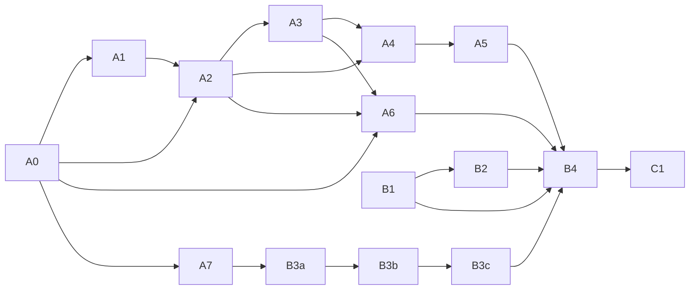

# T027 Remaining Slices (Temporary Working Checklist)

> Status: temporary execution ledger; **tracked in the repository since `babc041` (2026-09-20)** (it was previously hidden by a local `.git/info/exclude` rule, since removed).
> The authoritative ledger remains docs/DEV_PLAN.md, docs/DEV_PLAN_EN.md, and docs/validation/; this file is only a temporary execution ledger.
> Baseline: 68664d8 (2026-09-14, already includes the #38 CI fix). Corrected inventory: 12 required slices + 1 deferrable slice; required size totals are M×7, M-L×1, L×4; including C1 the totals are M×8, M-L×1, L×4.
> **Revision 2026-09-19: B3 is split into B3a (power-loss injection rig and calibration) + B3b (candidate injection matrix and durability verdict)** ⇒ **13** required slices; required size totals become **M×8, M-L×2, L×3**; including C1: **M×9, M-L×2, L×3**. Rationale: A7 disproved that kill-level injection can decide the durability step (CP4≡CP5), and B3's prerequisites (a per-round journal that is itself provably durable, on a second physical device, plus restart inventory and two-way calibration) and its outcome (per-candidate injection and the three-tier verdict) are different kinds of work with different risks; mixing them invites drawing conclusions from an uncalibrated rig.
> **Revision 2026-09-21: add B3c (CONTRACTS durability-upgrade clause, documentation only)** ⇒ **14** required slices; required size totals become **M×8, M-L×2, L×3, S×1**; including C1: **M×9, M-L×2, L×3, S×1**. Rationale: B3b produced a **tiered** verdict (C2 `proven`; C1/C3/C2C3/U4 `unresolved`), while the bilingual CONTRACTS still states "publication durability is unproven" as a **platform constant** with no upgrade condition and no unlock boundary; without freezing the wording first, B4 would stumble between the contract wording and the tiered verdict.
> **Extension 2026-10-13**: from today this ledger covers T027 and the later domains (including the T028 close-out, the S1-exit prerequisites and criteria governance).
> The T027 main-line slices (A0–A7, B1–B4, C1) keep their historical entries; later batch tasks are registered item by item against the §1.2 field table, each with a source citation.

## How to use

1. Slice start: each slice section in this file is the complete input for Flash, including dependencies, steps, goal, current gap, deliverables, acceptance evidence, and boundaries. No extra verbal context is required.
2. Slice completion: tick both language files, update the status table, append the completion log, and write the result back to the T027 section of DEV_PLAN / DEV_PLAN_EN plus the matching docs/validation/ evidence in the original style.
3. This file has been tracked in the repository since `babc041` (2026-09-20) (`commit`/`push` still require explicit same-turn authorisation). If operators rotate, hand over this file together with DEV_PLAN and validation records.
4. Stage close-out: at the end of T027 (when C1 is done), write the closing report per `docs/SLICE-CLOSEOUT-TEMPLATE{,_EN}.md` (retrospective = written by the driver; prospective = ruled by the user), and sync this list and `DEV_PLAN{,_EN}`.

## Cross-cutting gates

- Protocol first: whenever semantics change, update bilingual CONTRACTS, schema, and fixtures before changing Go.
- Immediately after the first substantive code edit, run the focused test for that slice before widening scope.
- Closing validation: run gofmt, go build ./..., go vet ./..., go test ./...; when Node contract fixtures are touched, also run the relevant Node contract check.
- Platform rule: Windows evidence must be collected on native Windows. Linux regression may use GitHub Actions Ubuntu or an approved Ubuntu 24.04 environment, but this checklist must not contain IPs, usernames, SSH key paths, or other connection material. Connection details come only from a local secure runbook or environment.
- Remote validation discipline: use disposable /tmp copies only, then clean them up immediately and verify cleanup. Never modify remote repos, systems, proxies, or long-lived environments.
- After code changes, require an independent Codex review and resolve every medium-or-higher finding.
- Closure discipline (re-run the same step after a fix; iron rule, updated 2026-09-15; **repointed to the new directive on 2026-09-21**): whenever a step fails or needs remediation, re-execute that same step until it passes; never jump ahead after a fix. **The complete wording (the per-step failure-action table, ⑦ is never optional, escalate to ⑤ after two consecutive ⑨ failures, the ⑩ stop point) is owned solely by `docs/DELIVERY_DIRECTIVE.md` §5.3** - this line used to restate it with directive v3.1's ①-⑥ step numbers, which are **incompatible** with the new pipeline numbering (① architecture → ② implementation → ③ tests → ④ integration → ⑤ pre-review → ⑥ scan → ⑦ final review → ⑧ docs → ⑨ native verification → ⑩ stop point); it is therefore no longer restated here, to avoid a drifting duplicate.
- Review records: every pre-analysis / pre-review / final-review / re-review conclusion (including remediation and re-review outcomes) must be recorded in the slice validation report.
- Reply marker: start every reply's first line with [自执行] / [V4 Pro×N] / [Codex×N].
- Push only with same-turn authorization. After an authorized push, watch GitHub Actions. Never touch gitee unless explicitly requested in the same turn.
- Prohibitions: the Agent must not write source, store, policy, or acceptance state; must not self-commit, self-push, or self-publish; must not treat exit 0 or a completed receipt as PASS; must not blindly retry unknown states.
- Encoding stays fixed: both .md files must remain UTF-8 BOM + LF.

## Status table

| Slice | Status | Direct dependencies | Size | Completed | Evidence |
|---|---|---|---|---|---|
| A0 replay-root composition | ✅ Complete | — | M | 2026-09-14 | docs/validation/t027-replay-root-composition.md |
| A1 pure admission | ✅ Complete | A0 | M | 2026-09-14 | docs/validation/t027-pure-admission.md |
| A2 dispatch and launch ambiguity | ✅ Complete | A0, A1 | M-L | 2026-09-14 | docs/validation/t027-dispatch-launch-ambiguity.md |
| A3 terminal publication and settlement | ✅ Complete | A2 | M | 2026-09-14 | docs/validation/t027-terminal-publication.md |
| A4 chain terminal routing and resume | ✅ complete | A2, A3 | M | 2026-09-15 | docs/validation/t027-terminal-routing.md |
| A5 postflight acceptance integration | ✅ Complete (`b8bad47`) | A4 | M | 2026-09-15 | docs/validation/t027-postflight-acceptance.md |
| A6 pinned CLI adapter offline process slice | ✅ Complete (`c2d2819` + `6db5a10` + `c6cf339`) | A0, A2, A3 | L | 52 mutations all RED, native E1–E8 green; the pilot pair missed 1 High (caught by the Codex blind audit); the CI Ubuntu leg exposed a Linux zombie-semantics defect → fixed with a Linux regression test | docs/validation/t027-offline-process.md |
| A7 Windows publication durability ADR + falsification prototype | ✅ Complete (①②③③.5④ all closed; ④ round 6 `RE-REVIEW: PASS`; three commits pushed and two CI runs green: 35118531930 / 35119805652) | A0 | M | | `docs/validation/t027-windows-publication-durability.md` |
| B1 candidate live capability + availability discovery | ✅ Complete (verdict: **no acceptable candidate in the assessed scope** ⇒ stays blocked; 9 live probes, 6 paid; ④ closed in 3 rounds + tool adoption in 6 rounds) | external per-call authorization | M | 2026-09-17 | `docs/validation/t027-b1-candidate-live-discovery.md`, `docs/validation/evidence/b1-20260917/` |
| B2 candidate/enforcement decision + proof | ✅ Complete (2026-09-18; decision = **external OS enforcement**; four commits pushed `58757e8`+`fd99dc3`+`408bd99`+`815c03f`, CI green three times run 35259806285 / 35261204021 / 35265268993; 41-artifact evidence bundle plus the archived rehearsal transcript) | B1 | L | 2026-09-18 | `docs/validation/B2-EXTERNAL-ENFORCEMENT.md`, `docs/validation/evidence/b2-2026-09-17/`, `tools/agent-probe/{appcontainer-b2,enforcement-proxy}/` |
| B3a power-loss injection rig + calibration | ✅ Complete (2026-09-20) | A7 | M-L | calibration `CALIBRATED`: negative control 4/5 losses, positive control 0/5; 36-record journal chain green; all 12 rounds audited `HARD-POWER-LOSS` | `docs/validation/B3A-CALIBRATION_EN.md`; `docs/validation/evidence/b3a-2026-09-20/` |
| B3b candidate injection matrix + durability verdict | ✅ Complete (`abfcecc`) | B3a | M | 2026-09-21 | `docs/validation/t027-b3b-durability.md`, `docs/validation/evidence/b3b-2026-09-21/` |
| B3c CONTRACTS durability-upgrade clause revision | ✅ Complete (`7bdfa0c`) | B3b | S | 2026-09-21 | `docs/validation/t027-b3c-contracts-durability.md`, `docs/validation/t027-b3c-contracts-durability_EN.md` |
| B4 AT-23 E2E evidence + independent review | ✅ Complete (`e8cbff6`; CI run `35812311023` green on both legs, with the `Gates` step really executing on both) | A5, A6, B1, B2, B3b, B3c | L | 2026-09-23 | **AT-23 is not passed** (the real AI candidate leg is unreachable, see OB-21); `docs/validation/t027-at23-e2e.md`, `tools/b4-e2e/` |
| C1 Linux AgentRunner native validation | ✅ Done (P19) | B4 (Windows T027 complete) | M | 2026-10-21 | `docs/validation/t027-c1-linux-native{,_EN}.md` |
| P20 AGENTRUNNER-PID-READER | ✅ Done | C1 | M-L | 2026-10-22 | docs/validation/agentrunner-pid-reader{,_EN}.md |
| P21 DIRECTIVE-COST-TIER | ✅ Done | P20 | M | 2026-10-22 | `docs/validation/directive-cost-tier{,_EN}.md` |
| P22 GATES-DEBT-SWEEP | ✅ Done | P21 | M-L | 2026-10-23 | `docs/validation/directive-gates-debt-sweep{,_EN}.md` |
| P23 DIRECTIVE-TMP-EXEMPT | ✅ Done | P22 | S | 2026-10-23 | `docs/validation/directive-tmp-exempt{,_EN}.md` |
| P24 GATES-CLEANUP | ✅ Done | P23 | M | 2026-10-23 | `docs/validation/directive-gates-cleanup{,_EN}.md` |
| P25 DIRECTIVE-CARRIER-ADJUST | ✅ Done | P24 | M | 2026-10-24 | `docs/validation/directive-carrier-adjust{,_EN}.md` |
| P26 GATES-G7F-DEDUP + DISPATCH-EVIDENCE | ✅ Done | P25 | M | 2026-10-24 | `docs/validation/gates-g7f-dedup-dispatch-evidence{,_EN}.md` |
| P27 G4b-CACHE | ✅ Done | P26 | M | 2026-10-25 | `docs/validation/gates-g4b-cache{,_EN}.md` |
| P28 DIRECTIVE-TMP-CACHE-EXCEPTION | ✅ Done | P27 | M | 2026-10-26 | `docs/validation/directive-tmp-cache-exception{,_EN}.md` |
| P29 DIRECTIVE-P28-FOLLOWUP | ✅ Done | P28 | M | 2026-10-26 | `docs/validation/directive-p28-followup{,_EN}.md` |
| P30 DIRECTIVE-WHITELIST-POLICY | ✅ Done | P29 | S | 2026-10-26 | `docs/validation/directive-whitelist-policy{,_EN}.md` |
| P31 DIRECTIVE-LEDGER-FIELD-SPLIT | ✅ Done | P30 | M | 2026-10-26 | docs/validation/directive-ledger-field-split{,_EN}.md |
| P32 DIRECTIVE-D-MECHANICAL-GUARD | ✅ Done | P31 | M | 2026-10-27 | docs/validation/directive-d-mechanical-guard{,_EN}.md; backfill: OB-133 (G4) |
| P33 DIRECTIVE-V21-OBS-SWEEP | ✅ Done | P32 | M | 2026-10-28 | docs/validation/directive-v21-obs-sweep{,_EN}.md; backfill: OB-134 (G5) |
| P34 DIRECTIVE-TMP-SELF-HEAL | ✅ Done | P33 | M | 2026-10-28 | docs/validation/directive-tmp-self-heal{,_EN}.md; backfill: OB-135 (G7) |
| P35 STRATEGIC-REVIEW-2026-10-30 | ✅ Done | P34 | L | 2026-10-29 | docs/validation/strategic-review-2026-10-30{,_EN}.md |
| P36 STRATEGIC-PLANNING-2026-10-31 | ✅ Done | P35 | L | 2026-10-30 | docs/validation/strategic-planning-2026-10-31{,_EN}.md |
| P37 P37-T027B-BREAKTHROUGH | ✅ Done | P36 | L | 2026-10-30 | docs/validation/t027b-breakthrough{,_EN}.md |
| P38 P38-T027B-TACTICAL-BLUEPRINT | ✅ Done | P37 | L | 2026-10-31 | docs/validation/t027b-tactical-blueprint{,_EN}.md |
| P39 P39-T027B-DURABLE-BUDGET | ✅ Done | P38 | L | 2026-10-31 | docs/validation/p39-durable-budget{,_EN}.md |
| P40 P40-T027B-LOCK-REAPER | ✅ Closed | P39 | L | 2026-10-31 | docs/validation/p40-lock-reaper{,_EN}.md |
| P41 P41-T027B-SPAWN-OWNERSHIP | ✅ Closed | P40 | L | 2026-10-31 | docs/validation/p41-spawn-ownership{,_EN}.md |
| P42 P42-T027B-EVIDENCE-BIND | ✅ Closed | P41 | M | 2026-10-31 | docs/validation/p42-evidence-bind{,_EN}.md |
| P43 P43-T027B-STATE-SEAL | ✅ Closed | P42 | L | 2026-10-31 | docs/validation/p43-state-seal{,_EN}.md |
| P44 P44-T027B-GATE-READINESS | ✅ Completed | P43 | M | 2026-11-01 | docs/validation/p44-gate-readiness{,_EN}.md |
| DR13-FIX DR13-FIX (P45 prerequisite) | ✅ Completed | P44 | S | 2026-11-01 | docs/validation/dr13-fix{,_EN}.md |
| P45 P45-T027B-E2E-ZERO-MODEL | ✅ Completed | DR13-FIX | M | 2026-11-01 | docs/validation/p45-e2e-zero-model{,_EN}.md |
| P46 STRATEGIC-REVIEW-2026-11-02 | ✅ Completed | P45 | L | 2026-11-02 | docs/validation/strategic-review-2026-11-02{,_EN}.md |
| P47 GOVERNANCE-BASELINE-VERIFY | ✅ Completed | P46 | M | 2026-11-02 | docs/validation/governance-baseline-verify{,_EN}.md; backfill: OB-133 to OB-136 |
| P48 DR13-FIX-D3 | ✅ Completed | DR13-FIX | S | 2026-11-02 | docs/validation/dr13-fix-d3{,_EN}.md (stopped at 10 for authorisation) |
| P49 RACE-LEG-EXPAND | ✅ Completed | P48 | M | 2026-11-02 | docs/validation/race-leg-expand{,_EN}.md (`75990a8`, run `41445657595` green on the first attempt) |
| P50 CONSOLE-MULTITASK-ASSEMBLY | ✅ Completed | P49 | L | 2026-11-03 | Report pair `docs/validation/console-multitask-assembly{,_EN}.md`; `81f9dc9` pushed to origin (never gitee), run `41507722672` green on the first attempt on both legs; temp artefacts `tmp/CONSOLE-MULTITASK-ASSEMBLY/` (cleared at 8c); R=1, D=1 |
| P51 CONSOLE-CLI-MULTITASK-WIRING | ✅ Completed | P50 | M | 2026-11-03 | Report pair `docs/validation/console-cli-multitask-wiring{,_EN}.md`; `2b0af2d` pushed to origin (never gitee), run `41569353460` green on the first attempt on both legs; temp artefacts `tmp/CONSOLE-CLI-MULTITASK-WIRING/` (cleared at 8c); R=1, D=2 |
| P52 ACCEPTANCE-SECURITY-COUNTEREXAMPLES | ✅ Completed | P51 | M | 2026-11-03 | Report pair `docs/validation/acceptance-security-counterexamples{,_EN}.md`; GAP-77 breach registered (P53 fix); stopped at 10 for authorisation; R=0, D=1 |
| P53 FIX-GAP-77-SYMLINK-ESCAPE | ✅ Completed | P52 | M | 2026-11-04 | Fix GAP-77 (single constrained openat2 resolution + fail-closed); T51-1 red-to-green + F1/F2 counterexamples; spec sync SEC-02/AT-02; `7802819` pushed to origin (never gitee), run `41707160563` green on the first attempt on both legs; R=0, D=0 |
| P54 CONTRACTS-S7-DURABILITY | ✅ Done (2026-11-04; commit `7c0763a` pushed to origin, never gitee; run `41840557379` green on the first attempt on both legs; R=1, D=1) | P53 | L | — | R/D=0 baseline (started 2026-11-04); evidence package `docs/validation/evidence/CONTRACTS-S7-DURABILITY/` |
| P55 EXIT-SEED-BUILD-EVIDENCE | ✅ Done (2026-11-05; commit `63e2e24` pushed to origin, not pushed to gitee) | P54 | M | — | report `docs/validation/exit-seed-build-evidence{,_EN}.md`; evidence package `docs/validation/evidence/EXIT-SEED-BUILD-EVIDENCE/`; R = 0, D = 1 |
| P56 G4B-CORPUS-DECOUPLE | ✅ Done (2026-11-05; directive v1.61; R=2, D=1) | P55 | M | — | report `docs/validation/g4b-corpus-decouple{,_EN}.md`; evidence package `docs/validation/evidence/G4B-CORPUS-DECOUPLE/`; `SELFTEST: PASS 703/703` |
| P58 P58-OB-TRIAGE | ✅ Done (2026-11-05) | P56 | S | — | report pair `docs/validation/p58-ob-triage-assessment{,_EN}.md`; evidence pack `docs/validation/evidence/P58-OB-TRIAGE/`; R = 0, D = 0 |
| P59 DIRECTIVE-SCOPE-GUARD | ✅ Done (2026-11-06; R-12 ruled A2×B1×Y1; v1.63) | P58 | S | — | report pair `docs/validation/p59-directive-scope-guard{,_EN}.md`; evidence pack `docs/validation/evidence/P59-DIRECTIVE-SCOPE-GUARD/`; R = 0, D = 0 |
| P60 DIRECTIVE-JUDGE-BLINDSPOTS | ✅ Done (2026-11-06; ruling J2×J3, J1 not selected; v1.64) | P59 | M | 2026-11-06 | report pair `docs/validation/p60-directive-judge-blindspots{,_EN}.md`; evidence pack `docs/validation/evidence/P60-DIRECTIVE-JUDGE-BLINDSPOTS/`; R = 0, D = 2 |
| P61 AT23-RESTRICTED-CANDIDATE | ✅ Done (PARTIAL close-out; closed 2026-11-08, ⑦ `FINAL REVIEW: PARTIAL`, ADR-036) | P60 (R-08/R-09 ruled) | M | 2026-11-08 | Report pair `docs/validation/at23-restricted-candidate{,_EN}.md`; evidence pack `docs/validation/evidence/P61-AT23-RESTRICTED-CANDIDATE/` |
| P62 R08-R09-RULING-REVISION | ✅ Done (closed 2026-11-08; ⑦ `FINAL REVIEW: PASS`, 1 final + 0 re-review; ADR-037; R/D=0; stopped at ⑩ awaiting authorization) | P61 (path A: R-08.5 revision first) | M | 2026-11-08 | Revise `docs/validation/r08-r09-ruling{,_EN}.md` (the R-08.5 inherited-drift waiver five elements + the R-08.1 factual correction); P61 report timestamp note; evidence pack `docs/validation/evidence/P62-R08-R09-RULING-REVISION/` |
| P63 AT23-RECHECK | ✅ Done (closed 2026-11-09; ⑦ rules the waiver does not hold; R/D=0; stopped at ⑩ awaiting authorization) | P62 (layer-1 item 11) | S | 2026-11-09 | Evidence pack `docs/validation/evidence/P63-AT23-RECHECK/`; P61 report §10 + the §1 timestamp note |
| F2-FIX-STUB-HANG | ✅ Done (closed 2026-11-09; ⑦ final `FINAL: PASS WITH FIXES` ⇒ premise ① met; R/D=0; stops at ⑩ awaiting authorization) | P63 (the waiver does not hold ⇒ start) | S | 2026-11-09 | Fixed the hang branch to write the 0-byte empty stub-child.pid + regression test + layer3 F2 red/green re-runs + f1 contrast; AT-23 stage-1 condition closure achieved (stage 2 not applicable, user ruling A1); evidence pack `docs/validation/evidence/F2-FIX-STUB-HANG/`; P61 report §11 + §1 timestamp note |
| P64 AT24-SUPERVISED-BLACK-BOX | ✅ Done (closed 2026-11-11; AT-24 conditionally closed; ⑦ re-review `RE-REVIEW: PASS`; R=2; stopped at ⑩ awaiting authorization) | F2-FIX (layer 1 post-hard-gate candidate item 12) | M | 2026-11-11 | Evidence pack `docs/validation/evidence/P64-AT24-SUPERVISED-BLACK-BOX/`; temp `tmp/P64-AT24-SUPERVISED-BLACK-BOX/` |
| P65 GATE-PIT-26-LANDING | ✅ Done (closed 2026-11-11; B-part landed + A-part path registered; the actual A-part landing awaits v54/P66 generation; R=1; stopped at ⑩ awaiting authorization) | P64 (promoted from the v53 §5 observation item; not a layer-2 queue item) | S | 2026-11-11 | Evidence pack `docs/validation/evidence/P65-GATE-PIT-26-LANDING/`; temp `tmp/P65-GATE-PIT-26-LANDING/`; report pair `docs/validation/gate-pit-26-landing{,_EN}.md` |
| P66 CHECKLIST-RULES-HOIST | ✅ Done (closed 2026-11-11; §13 five subsections landed; ⑦ final FINDINGS ⇒ remediation then re-review; ⑥ formal defect downgraded; R=3; stopped at ⑩ awaiting authorization) | P65 (layer-2 governance side, snapshot→directive structural migration) | L | 2026-11-11 | Report pair `docs/validation/checklist-rules-hoist{,_EN}.md`; evidence pack `docs/validation/evidence/P66-CHECKLIST-RULES-HOIST/`; temp artefacts `tmp/P66-CHECKLIST-RULES-HOIST/` |
| P67 GATES-DEBT-CLEANUP | ✅ Done (closed 2026-11-12; R=3, D=1; ⑦ blind 1 + final 1 + re-review 1; SELFTEST 737/737; controller V4 Pro, ADR-041) | P66 (layer-2 new queue item 13; one-shot cleanup: g4b cache LRU / gate pitfall 27 / §12.4 sampling block / ⑥ prompt hardening) | L | 2026-11-12 | Report pair `docs/validation/gates-debt-cleanup{,_EN}.md`; evidence pack `docs/validation/evidence/P67-GATES-DEBT-CLEANUP/`; temp artefacts `tmp/P67-GATES-DEBT-CLEANUP/` |
| P68 REMAINING-RULINGS | ✅ Done (closed 2026-11-12; R=1, D=1; ⑥ skip confirmed by ⑦; ⑦ final PASS; SELFTEST 737/737; controller Flash) | P67 (layer-2 governance side; advice on the four R items + stage-progression seal confirmation) | M | 2026-11-12 | Report pair `docs/validation/remaining-rulings{,_EN}.md`; evidence pack `docs/validation/evidence/P68-REMAINING-RULINGS/`; temp artefacts `tmp/P68-REMAINING-RULINGS/` |
| P69 T027B-E2E-WIRING | ✅ Done (closed 2026-11-12; report pair `docs/validation/t027b-e2e-wiring{,_EN}.md`) | P68 (the R-1 closeout from R-06 = b) | M | 2026-11-12 | Wire the P44 readiness / permit verdicts into the production assembly and the CLI entry; evidence pack `docs/validation/evidence/P69-T027B-E2E-WIRING/`; review chain ⑤ PASS / ⑥ PASS / ⑦ PASS; R=0, D=1 (the ⑧a1 doc carrier deleted its helper scripts, escalated to the user at ⑩) |
| P70 S1-STREAM-PROGRESS | ✅ Done (closed 2026-11-13; R=1, D=2; ⑦ final 1 + re-review 1; SELFTEST 737/737; controller Flash) | P68 (R-07 b1 condition 1) | S | 2026-11-13 | The lightweight `run --progress` stream switch (off by default, consuming the existing event stream, no view layer); evidence pack `docs/validation/evidence/P70-S1-STREAM-PROGRESS/` |
| P71 S1-SCOPE-ANNOTATE | ✅ Done (closed 2026-11-13; R=0, D=2; step 7 blind 1 + final 1; SELFTEST 737/737; controller Flash) | P68 (R-07 b1 condition 2) | M | 2026-11-13 | The visible debugging guidance + the REQ stage-ownership column + the matrix / strategy / gate-applicability write-backs (X-style, no entry deleted); evidence pack `docs/validation/evidence/P71-S1-SCOPE-ANNOTATE/` |
| P86 BOUNDDIR-UNC-EQUIVALENCE | ✅ Closed (closed 2026-11-22; R=0, D=0; (7) blind 1 + final 1; SELFTEST 740/740) | P84 (N13-UNC plus the evidence-attribution Low residual deferral) | S | 2026-11-22 | docs/validation/bounddir-unc-equivalence{,_EN}.md; evidence pack `docs/validation/evidence/P86-BOUNDDIR-UNC-EQUIVALENCE/`; temp files `tmp/P86-BOUNDDIR-UNC-EQUIVALENCE/` |

Status symbols: ⬜ Not started / 🔄 In progress / ✅ Complete / ⛔ Blocked (the four above are the closed set for slice entries in this file); ⏸ Pending evaluation = a marker used only for **pending-evaluation items** (not formal slices) in the "later batch slices" section and **not a member of that closed set**.

## Dependency graph

```mermaid
flowchart LR
    A0[A0] --> A1[A1]
    A0 --> A2[A2]
    A1 --> A2
    A2 --> A3[A3]
    A2 --> A4[A4]
    A3 --> A4
    A4 --> A5[A5]
    A0 --> A6[A6]
    A2 --> A6
    A3 --> A6
    A0 --> A7[A7]
    B1[B1] --> B2[B2]
    A7 --> B3a[B3a]
    B3a --> B3b[B3b]
    B3b --> B3c[B3c]
    A5 --> B4[B4]
    A6 --> B4
    B1 --> B4
    B2 --> B4
    B3c --> B4
    B4 --> C1[C1]
```

## Hard gates

- B1 must precede B2: first discover real candidate capability and availability, then make and prove the candidate or enforcement decision. Never invert that order.
- B2 is the candidate or enforcement hard gate before real E2E: a verified compatible candidate or a proven external OS enforcement boundary is required. **That hard gate is satisfied as of 2026-09-18** (the external OS enforcement boundary is measured and archived); B4 must still deliver the AT-23 end-to-end evidence and independent review on top of it.
- B3 is the Windows native durability hard gate: only real crash or power-loss proof can remove the Windows unproven block for first-dispatch. **Split into B3a (rig and calibration) + B3b (candidate injection and verdict); only a B3b `proven` carrying the same premise lifts `unproven`, otherwise the state stays blocked.**
- A2, A3, A4, A5, and A6 are the offline implementation chain that must all land before B4. Completed receipts, request-only receipts, terminal receipts, or durability failures must never directly trigger relaunch, PASS, or task completion.

---

## A0 — replay-root composition · ✅

Depends on: none

- [x] Derive a stable replay root from the durable run or store root and remove production acceptance of arbitrary caller roots.
- [x] Bind runID and cross-restart location rules, defining request, run, workspace, and store ownership.
- [x] Reject source or workspace or store overlap plus alias, symlink, and reparse escapes.
- [x] Define root ownership and recovery preflight checks, then add focused tests.

Goal: make the replay root a stable, restart-safe, auditable primitive instead of an arbitrary caller choice.
Current gap: root derivation, binding, and ownership rules are incomplete, and overlap or escape rejection is not strict enough.
Deliverables: root composition design and implementation, conflict rejection logic, focused tests, documentation write-back.
Acceptance evidence: focused tests covering stable derivation, runID binding, overlap rejection, symlink or reparse rejection, and ownership checks.
Boundaries: do not introduce real dispatch here and do not reopen arbitrary caller roots.

## A1 — pure admission · ✅

Depends on: A0

- [x] Remove any admission consumption of the in-memory RequestIndex or any replay-write side effect.
- [x] Reduce admission to pure preflight and immutable binding that only returns pass or error.
- [x] Document the admission versus dispatch responsibility split and add focused tests.

Goal: admission performs only pure validation and immutable binding, without consuming one-shot dispatch semantics.
Current gap: admission still mixes runtime replay consumption into the preflight path, crossing in-memory and durable responsibilities.
Deliverables: pure admission implementation, responsibility-boundary notes, focused tests.
Acceptance evidence: focused admission tests proving no replay writes, no launch, and error-only preflight behavior.
Boundaries: do not write durable replay records here and do not introduce launch behavior.

## A2 — dispatch and launch ambiguity · ✅

Depends on: A0, A1

- Handoff note (now frozen in the bilingual CONTRACTS): admission is a preflight, not a lock; its verdict may expire. Dispatch must decide launch eligibility after publishing R based on the replay store, and before allowing launch must reconfirm a non-revoked authorization and an outstanding budget reservation, failing closed otherwise.

A2 design rulings (V4 Pro pre-analysis, 2026-09-14; alignment with the A1 contract confirmed sentence by sentence):

- R1 embodiment: a value-semantics `AgentRunnerLaunchReconfirmer` (adapters) performs the narrow reconfirmation only (authorization active/unrevoked/unexpired plus reservation outstanding), invoked after `RecordRequest` returns first-dispatch and before any receipt or spawn; failure returns `ErrAgentRunnerLaunchReconfirmation` with R retained, no receipt, no spawn, no automatic retry (deadlocks defer to A3/operator).
- Receipt protocol: two-file split — pre-spawn `launches/intent.<requestID>.jsonl` (no-replace; unproven platforms reject pre-write exactly like R) and post-spawn `launches/identity.<launchID>.jsonl`; the invariant "no intent ⇒ never spawned" holds cross-platform; a missing identity never relaunches.
- State machine: R-only = unknown-block, never launch; receipt-only = slot owned, never re-publish; receipt+identity = proven launched, never relaunch; R+C = terminal, never launch; only a launcher error (contractually no spawn) permits an in-process Start retry.
- Ownership: `AgentRunnerReplayDispatcher` lives in adapters and implements `chain.AgentRunnerPort`; chain gains the `AgentRunnerLauncher` port plus LaunchRequest/Result DTOs (A6 supplies the implementation).
- A0 regression points: `launches/` must join `bootstrapReplayStoreRoot`, `verifyPathSafetyLocked`, and the ownership/path enumerations.
- Ratified: U1 extract the A1 private validators into shared package functions (A1 tests guard unchanged behavior); U2 chain owns the interface/DTOs; U3 accept no automatic takeover for W1/W2; U4 accept the recheck-to-spawn residual window as a known boundary; U5 receipts embed the reconfirmation evidence digest; U6 sentinel names confirmed (A4 maps them).
- Execution order: freeze the bilingual CONTRACTS first → implement → focused tests → V4 Pro pre-review → Codex → full gates → documentation write-back.

A2 implementation deviations (2026-09-14, confirmed acceptable by the V4 Pro pre-review and the Codex final review):

- The identity record gained a `RequestID` field (to load intents by requestId and classify conflicts; store-local, no wire impact).
- A fifth sentinel `ErrAgentRunnerLaunchFailed` was added (port-contractual unspawned failure), keeping the underlying cause in the error chain.
- Auto-retry stance: the contract only *permits* an in-process retry for a port-contractual unspawned failure; this slice chooses the more conservative never-auto-retry, leaving post-failure handling to humans or upper layers (the state-machine line already reflects this wording).
- Deterministic launchID derivation `"launch-"+requestID`; an already-owned launch slot (including the concurrent first-dispatch window) is uniformly classified as `ErrAgentRunnerDispatchUnknownBlock` (message names the owning launchId; `errors.Is`-identifiable).
- Unproven-platform ordering semantics: receipts and identities allow “write-free exact replay” and reject every new write (the `RecordCompletion` rule); `RecordRequest` rejects unproven first because it carries first-dispatch eligibility.
- Zero `StartedAt`: A6 port implementations must guarantee “a returned result means the process was spawned with a populated identity”; this slice adds no extra rejection (A6 verification point).

- [x] Implement a replay-aware dispatcher that publishes R first, then decides whether first-dispatch may attempt launch.
- [x] Define durable launch or process-identity receipts plus unknown reconciliation across crash windows.
- [x] Ensure request-only, terminal, convergence, and durability failures never relaunch blindly.
- [x] Add focused tests for first-dispatch single winner, crash windows, and unknown reconciliation.

Goal: bind launch eligibility to dispatcher-owned replay and receipt semantics rather than call timing guesses.
Current gap: dispatch versus launch ownership is ambiguous, and crash-window plus unknown-state rules are not yet provable.
Deliverables: replay-aware dispatcher, launch-receipt rules, unknown reconciliation logic, tests.
Acceptance evidence: focused tests proving only first-dispatch may attempt launch and unknown states never relaunch blindly.
Boundaries: do not finish settlement, postflight, or real candidate execution in this slice.

## A3 — terminal publication and settlement · ✅

Depends on: A2

A3 design rulings (V4 Pro pre-analysis 2026-09-14, aligned with the A0/A1/A2 discipline):

- Order (four phases): terminal-intent (no-replace, embedding the full C record and the settlement plan) → ledger `Settle` (deduplicated by idempotencyKey) → `RecordCompletion` publishes C → terminal-closure completes the chain; when C becomes externally visible, the settlement decision is already booked.
- Record set: `terminals/terminal-intent.<requestId>.jsonl` plus `terminals/terminal-closure.<requestId>.jsonl` (store-local, separate domain digests, no-replace with bounded reread convergence); wired into bootstrap, the production constructor, the locked runtime path re-check, and the ownership preflight enumeration.
- Idempotency keys: `settle-<20hex>` = digest over domain `proofrail:agent-runner-settlement-key:1` of (requestId, C.recordHash); EntryID reuses the same value; CompletionID is `"completion-"+requestId`; the ledger is idempotent for the same key and payload and rejects a different key for the same reservation; evidence carries both the C and R recordHash.
- Unknown retention: an `uncertain` C or `usageComplete=false` permits only an unknown settlement; after an unknown settlement `RequireOutstandingReservation` **fails** under the existing semantics, and the hold is observed through `UnknownHoldReservations()` / `Summary().UnknownReservedAmountMicros` / shared caps; the reservation is never reusable and never relaunches.
- Rejection matrix: a C without an intent is an orphan (never adopted by writing an intent back); a reservation already settled under a different key never receives a C; charged>reserved, missing evidence or evidence lacking the C/R digests, and intent payload conflicts all fail closed; a different outcome for the same request is a conflict; republishing a complete chain is an idempotent replay.
- Unproven-platform hard rule: any new terminal publication is rejected for the whole chain before any settlement; an already-complete chain allows write-free replay only.
- Recovery discipline: store-local records only (the intent is the sole recovery source); the ledger is an enforcer, never a query source; recovery is an idempotent completion of a slot we already own and is not takeover (W1/W2 unchanged).
- Ownership: `AgentRunnerTerminalPublisher` (adapters, value semantics, depending on `*tickets.CostLedger` plus test-only single-shot hooks afterIntentWrite/afterSettle); chain is untouched (A4 boundary); no Engine, no real candidate.
- Ratified open points: the intent embeds the full C (adopted; recovery requires it); no new ledger query path (adopted); completed with missing amount evidence allows unknown (adopted; otherwise a C without any settlement decision record would exist); uncertain permits unknown only and defines no upgrade (deferred to A5); the durability precheck moves before Settle (adopted and frozen in CONTRACTS).
- Execution order: freeze the bilingual CONTRACTS first → implement → focused tests → V4 Pro pre-review → Codex → full gates → documentation write-back.

A3 implementation and review outcome (2026-09-14): the four-phase protocol, two-file records, idempotency keys, and rejection matrix all landed. V4 Pro implementation pre-review: conditional pass (no High) — H1 (missing resume session binding) now preflights through the shared `ValidateAgentRunnerCompletionBinding`; M1 switched to semantic slot matching (completionHash + plan) with clock-skew tests; M2 prevalidates evidence before the intent with deterministic dedupe and exact membership matching; M3/L1/L5 were remediated with tests. Codex final review: conditional pass (no High) — unproven complete-chain replay is strictly write-free (no ledger call); converge reuses the full closure binding check (including settlement keys) and `RecordTerminalClosure` re-checks the intent runId; the different-clock concurrency test gained a start barrier plus a deterministic sequential case; the happy path asserts both hooks fire; three missing counterexamples were added (write-free replay, closure key mismatch, recovery requiring the persisted request). Codex remediation re-review (2026-09-15): PASS (no Critical/High/Medium; signable, with three recorded low-risk test-rigor gaps that do not block sign-off). Tail-item remediation complete (single-point beforeSettle probe, both counterexamples hardened, dedicated runId regression), Codex extra confirmation (user-authorized beyond the budget): PASS (revert-sensitive, no new defects); full local gates all green. Committed as `c6f8585` and pushed; GitHub Actions Ubuntu (including the Race step)/Windows green (run 34900979883).

- [x] Define the stable order for completion C publication, usage or cost settlement, and idempotency key creation.
- [x] Handle crash recovery and duplicate publication, keeping reservations when settlement remains unknown.
- [x] Reject ambiguity between C-without-settlement and settlement-without-auditable-C.
- [x] Add focused tests for ordering, idempotency, and crash recovery.

Goal: make terminal publication and settlement a stable, recoverable, auditable completion chain.
Current gap: completion publication and usage or cost settlement order is not fixed, and crash-time idempotency plus reservation handling is underspecified.
Deliverables: publication or settlement ordering implementation, stable idempotency key, recovery logic, tests.
Acceptance evidence: focused tests proving no completion without settlement and no settlement without an auditable completion.
Boundaries: unknown settlement may only retain reservation and must never fabricate completion.

## A4 — chain terminal routing and resume · ✅

Depends on: A2, A3

A4 design rulings (V4 Pro pre-analysis 2026-09-15; U-1..U-9 ratified; aligned with the A0–A3 discipline and the T025 machinery. Protocol-first is already landed: the bilingual CONTRACTS §2.1 state row, the new §7 "Chain terminal routing" paragraph, and the operator-paragraph seam are frozen):

- DTO ownership: the new `internal/chain/agent_runner_terminal.go` defines the chain-owned `AgentRunnerTerminal` (five-state enum completed/failed/cancelled/operator-action-required/uncertain; binding RequestID/RequestHash/CompletionHash/Run/Task/Step/Attempt/SessionID/Prior* plus deduplicated ordered evidence hashes; no settlement digests, no wire details); adapters add the one-way translation `ToChainAgentRunnerTerminal` (new `agent_runner_terminal_chain.go`), failing closed on zero values, mixed modes, missing hashes, `CompletionHash∉Evidence`, and resume-session inequality.
- New step state `TERMINAL_PENDING` (U-2): `RUNNING→TERMINAL_PENDING` (evidence = the three dispatch hashes) means "dispatched, awaiting terminal"; `TERMINAL_PENDING→WAITING_FOR_OPERATOR|PASSED|FAILED|CANCELLED`; sync the `evidence/event.go` transition table and schema/checker fixtures (protocol first); it is not a schedulable resting state — after a restart without terminal evidence it is treated as an uncertain pause.
- Delivery path (U-6, push model): the Engine gains `SubmitAgentRunnerTerminal` as the only write entry for an external receipt into core state; no new port, no replay-store reads; runStep for AgentRunner steps becomes dispatch-success → `TERMINAL_PENDING` → return `ErrAwaitingAgentRunnerTerminal` (it no longer takes the step-passed path); RUNNING re-entry is resume-only.
- Routing table: completed → step `TERMINAL_PENDING→PASSED` only (the task still goes REVIEW_PENDING→acceptance→review→completed promotion→PASSED, and the chain completes only after every task is accepted); failed → task FAILED (no auto retry/relaunch); uncertain (U-5) → task FAILED + chain PAUSED (stay paused, never retry, repair requires a new attempt; only a chain that is RUNNING is rewritten); cancelled → archive stop evidence before the terminal write; operator-action-required (U-4) → write task/step `WAITING_FOR_OPERATOR` plus chain `RUNNING→PAUSED` (both carrying the C hash) and then enter the T025 machinery, requiring five additive match extensions (waiting task/step binding ×2, resume-side task/step binding ×2, paused-chain binding ×1; existing paths unchanged). Routing itself pauses the run so a restart can still open the interaction and converge (the pre-review Medium remediation).
- A4 pre-review and remediation (V4 Pro, 2026-09-15): the pre-review found 1 Medium (the operator route left the chain RUNNING, so a restart followed by Recover wrote a `recovery-uncertain` pause that neither Open nor Run could leave, making the route permanently unconvergeable) and 2 Low (the open-side binding is weaker than the classic path and must be documented; an uncertain terminal while the chain is already paused never reaches PAUSED). The re-review found 1 further Low (replaying an operator terminal after the operator machine had returned control pushed the task and chain back into waiting) plus missing documentation. Remediation: the route pauses the chain, `operatorWaitingPauseMatches` accepts the pause reason additively, `convergeAgentTerminalRoute` treats a route whose step is no longer waiting as converged with zero writes, and the bilingual contract records the pause, the additive acceptance, the ledger-exclusivity boundary, and the uncertain-pause boundary. The re-review reported no Medium+ findings; the boundaries now live in CONTRACTS §7.
- Resume continuity: resume = same attempt / same session / same workspace, binding `priorSessionId` and `priorCompletionHash`; `PriorCompletionHash ∈ that step's event-evidence history` is the only provable criterion (chain reads no store); any failure means `ErrAgentRunnerResumeContinuityUnproven` with zero writes (U-8, whole-table rejection); a new attempt is built by the CLI from the durable envelope (U-9; chain only refuses, never guesses); U-7: A4 does not yet lift the dispatcher/admission resume refusal (deferred to A6).
- No-direct-pass invariants (acceptance evidence): a completed terminal never produces task PASSED/chain COMPLETED; non-completed terminals make zero downstream calls; the single write point for an AgentRunner step's step-passed is the Submit route; a receipt itself has zero state side effects (the publisher does not depend on chain); repeated terminals converge idempotently and different terminals conflict; `TERMINAL_PENDING` joins the recover uncertainty list.
- Expected existing-test change: `TestEnginePreparesAgentRunnerIntentBeforeSingleExecutionPort` (dispatch no longer completes the step directly; the test must inject a Submit terminal); T025 existing cases are guarded as-is (match extensions must be pure OR branches).
- Execution order: protocol-first frozen (this step) → `evidence/event.go` transition table and fixtures → chain DTO/routing/Engine → adapters translation → focused tests → V4 Pro pre-review → Codex final review → full gates → documentation write-back.

- [x] Introduce a chain-owned terminal DTO distinguishing completed, failed, cancelled, operator-action-required, and uncertain.
- [x] Implement session create or resume continuity, binding priorSessionId and restart paths.
- [x] Ensure an external terminal receipt never directly marks a task PASSED, a chain COMPLETED, or bypasses build, verify, review, or promotion.
- [x] Keep the rule precise: an AgentRunner code step may only reach a verified step-complete state through explicit core handling, while task acceptance remains the existing downstream flow.
- [x] Add focused tests for routing, resume continuity, duplicate terminal handling, and no direct PASS.

Goal: centralize terminal semantics in chain routing and resume handling instead of letting adapter receipts drive task outcomes.
Current gap: terminal DTO, resume continuity, and acceptance boundaries are not tight enough, leaving room for receipt overreach.
Deliverables: chain terminal DTO, routing or resume logic, tests.
Acceptance evidence: focused tests proving external terminal receipts cannot directly cause PASSED, COMPLETED, or skipped downstream stages.
Boundaries: do not decide postflight acceptance here and do not move policy ownership out of the existing downstream flow.

## A5 — postflight acceptance integration · ✅

Depends on: A4

A5 design rulings (V4 Pro pre-analysis 2026-09-15; U1..U7 ratified; aligned with the A0–A4 discipline, the A3 recovery source, A4 routing and the T025 machine):

- Single mechanism (no new engine entry point, no new task state): a chain-owned **postflight gate** is inserted in `runTask` after the steps loop and before `REVIEW_PENDING` is written, and only for tasks containing an AgentRunner step. The gate opens only when three things hold together: (a) the frozen-facts DTO attached to a completed terminal (five mutually distinct digests), (b) the same facts rebuilt by chain from the step's terminal-passed routing-event evidence prefix (recoverable across restarts without reading the replay store), and (c) the raw `PostflightPort` decision (passed/failed/uncertain, where passed must carry all five fact digests or it is treated as failed). Tasks without AgentRunner steps keep the original path unchanged.
- Frozen-facts DTO `AgentRunnerFrozenFacts` (new `internal/chain/postflight.go`): exactly five digests — `ManifestHash`/`DiffHash`/`LogHash`/`UsageHash`/`ProcessStopEvidenceHash`; mutually distinct and distinct from RequestHash/CompletionHash; it must NOT contain decision fields (Outcome/Assessment/Passed/PolicyDisposition), an exit code as a decision field, settlement status/amounts, review/promotion decisions, authorization grants or policy hashes, or full wire records (digests only).
- DTO ownership and validation: `AgentRunnerTerminal` gains `Facts *AgentRunnerFrozenFacts` (U5); `Validate` tightens to **completed must carry Facts, non-completed must not**; `routeEvidence()` extends to `[RequestHash, CompletionHash, five fact digests, ...Evidence]` (deduplicated, order preserving) and the gate rebuilds positionally from 2..6 (U4), with mutual distinctness as the anti-collision premise.
- Fact persistence (U1): facts live in the terminal-intent (A3's only recovery source) as an optional store-local block that is mandatory for completed; `ToChainAgentRunnerTerminal` projects them one way; the publisher requires `outcome.Facts` before writing the intent (rejection before settlement, A3 order unchanged).
- Port (U6): `PostflightPort{ RunPostflight(ctx, PostflightRequest) (PostflightDecision, error) }` is a **required** `Options` port (nil-checked in `New`); the console stub is fail-closed (never called on the noop-only path). Port contract: it must re-derive everything itself (fresh stop evidence, re-capture the manifest and diff it against the parent, scope/secret/type and side-effect checks) and reconcile field by field against the frozen facts; it must not write state and must not touch the Engine.
- Failure routing: a postflight rejection (failed with complete evidence) → `markTaskForRepair` with reason `postflight-rejected` (task `REPAIR_PENDING` + chain `PAUSED`, zero Accept/Review/Publish calls); this needs the protocol-first transition `STEPS_RUNNING→REPAIR_PENDING` (U2, reserved for postflight rejection); uncertain → task `FAILED` plus `PAUSED` on a `RUNNING` chain (reason `recovery-uncertain`, `Run` refuses to retry); a port error → `failTask("postflight-failed")`; missing/out-of-range/colliding facts → `failTask("postflight-facts-missing")`.
- Idempotency and crash windows: the gate runs only while the task is still `STEPS_RUNNING`; the `REVIEW_PENDING` transition gains a state guard, which **also fixes the pre-existing re-entry self-transition defect** (U7, otherwise the postflight idempotency tests cannot hold); a restart between facts-in-evidence and postflight converges by rebuilding; replaying a completed terminal with a different five-digest prefix is refused as a conflict.
- Acceptance invariants: exit 0, a completed receipt or any adapter record never directly produces task PASSED; the single task-PASSED write point stays at the end of `runTask`; a passed postflight is the only qualification for `REVIEW_PENDING`.
- Existing tests expected to change (legitimate semantics upgrade, to be named in the validation report): the chain-side `agentRunnerTerminal()` helper gains Facts and drags the completed cases with it (routing-matrix completed row, partial-write convergence, recover-parked, validate fail-closed); `engine_test.go testOptions` gains a fake PostflightPort and `TestEnginePreparesAgentRunnerIntentBeforeSingleExecutionPort` injects a terminal with Facts; adapters-side translation/publisher/store fixtures gain Facts on completed intents.
- Residual boundaries (accepted, documented): the engine runs gate hook steps (build/test/verify) before `Acceptance.Accept`, which differs in wording from CONTRACTS §7 "gates after freeze"; this slice does **not** reorder them and leaves the reconciliation to the B4 final review; the port implementation quality is the only trust boundary; the single-driver assumption is unchanged; `Accept` idempotency between `REVIEW_PENDING` and `Accept` remains a pre-existing assumption.
- ④ Codex re-review, second round (2026-09-15): a new Medium was found and remediated: a task already resting in `REVIEW_PENDING` skipped the gate and went straight to acceptance, so a pre-A5 review state (or a review state without a gate trace in a damaged store) could reach PASSED without any postflight, contradicting the new contract sentence. `requirePostflightQualifiedReview` was added: when a task with routed completed terminals is re-entered in `REVIEW_PENDING`, its review transition must prove all five fact digests are present, otherwise the run is refused with zero writes (new sentinel `ErrUnqualifiedReview`); tasks without facts keep the pre-existing path. ④ re-review PASSes after both remediation rounds.
- ④ Codex final-review remediation (2026-09-15; High 1 + Medium 2, all closed): (1) **the self-added "refuse when a fact digest equals the parent snapshot digest" rule was withdrawn** — `parent.Hash` is the accepted snapshot's manifest digest, and under the ratified port contract ("re-capture the manifest and diff it against the parent") a no-change execution legitimately equals it; that discrimination needs an independent re-capture and belongs to the port alone, while the chain enforces only what is provable (five mutually distinct fact digests, distinct from the request/completion digests, positionally rebuildable). The bilingual CONTRACTS paragraph now says so, and the ③ pre-review Low "facts colliding with the parent digest" **becomes a port obligation** (the port must re-capture and reconcile, never pass merely because the digests are equal). (2) Completed routing records written before A5 carry no fact prefix: replaying them is refused whole as a conflict with zero writes and **cannot be resumed in place** (re-execute as a new attempt) — recorded as a compatibility boundary in the contract and the validation report. (3) `TestPostflightDecisionRejectsMalformedEvidence`'s first case was masked by the shared "missing fifth fact" cause; it now adds an extra malformed digest on top of all five facts, and mutation proved that deleting the digest loop reddens it. Adapter-side counters were added too: the intent constructor (completed without facts, non-completed with facts, non-distinct facts) and the publisher (completed without facts refused before any intent or settlement).
- Execution order: protocol-first (bilingual CONTRACTS §2.1 task row + the new §7 paragraph → schema `taskTransition` with `REPAIR_PENDING` → new fixtures + count 128) → `evidence/event.go` transition table → chain `postflight.go`/`models.go`/`agent_runner_terminal*.go`/`engine.go` → adapters (intent Facts/publisher/translation) → console stub → focused tests (including the named upgrades) → V4 Pro pre-review → Codex final review → full gates → documentation write-back.

- [x] Make the chain own policy and state while adapters only report frozen facts such as manifest, diff, log, usage, and process-stop data.
- [x] Bind and reuse the existing freeze, gates, review, and promotion flow.
- [x] Ensure exit 0 or a completed receipt never directly causes task PASS.
- [x] Add focused tests for postflight pass, postflight fail, and frozen-fact injection.

Complete: 2026-09-15. `internal/chain/postflight.go` lands the chain-owned postflight gate and the five-digest frozen-facts DTO, `Options.Postflight` is mandatory (the console stub fails closed), `runTask` runs the gate after the steps and before `Acceptance.Accept`, and only a passed decision carrying all five fact digests writes `REVIEW_PENDING`; protocol-first added `STEPS_RUNNING→REPAIR_PENDING` plus 2 fixtures (count 128); a completed replay with identical facts converges while divergent facts or unrebuildable evidence are refused as a conflict with zero writes; `REVIEW_PENDING` re-entry now requires a qualification proof (`ErrUnqualifiedReview`). Two rounds of ③ pre-review and three rounds of ④ final review are fully closed (round three `PASS`), with five mutation checks. **Committed as `b8bad47` and pushed; GitHub Actions Ubuntu (with the Race/Contract fixtures steps) / Windows fully green (run 34950623175). A5 is fully closed.** Validation: [中文](validation/t027-postflight-acceptance.md) / [English](validation/t027-postflight-acceptance_EN.md).

Goal: route acceptance back through chain-owned postflight instead of letting adapters or exit codes decide task success.
Current gap: policy and state ownership can still leak toward adapters or terminal receipts, and postflight acceptance wiring is incomplete.
Deliverables: postflight acceptance integration, frozen-fact DTO usage, tests.
Acceptance evidence: focused tests proving only successful postflight can advance acceptance.
Boundaries: adapters must not write policy or acceptance, and this slice does not perform real E2E.

## A6 — pinned CLI adapter offline process slice · ✅

Depends on: A0, A2, A3

- [x] Build a stub-CLI offline loop with an isolated workspace and no real candidate.
- [x] Complete guard, Job Object, start, stop, process tree, and timeout management.
- [x] Capture logs, events, manifest, diff, and usage, and validate crash or cancel paths.
- [x] Add focused tests for start, stop, timeout, tree kill, and missing logs.

Goal: finish the offline process and evidence layer for a pinned CLI adapter before any real-candidate work.
Current gap: there is no fully testable offline process slice for workspace isolation, guard behavior, and evidence capture.
Deliverables: stub CLI adapter loop, isolated workspace lifecycle, evidence capture, tests.
Acceptance evidence: focused tests proving the offline start or stop or timeout or process-tree paths are complete and recoverable.
Boundaries: do not connect a real candidate and do not treat this slice as candidate-compatibility proof.

A6 completion record (2026-09-15; committed and pushed to `origin/main` as `c2d2819` on 2026-09-16, fix commit `6db5a10`, CI green): scope and implementation in `docs/validation/t027-offline-process.md`; ③ V4 Pro pre-review closed all 7 rounds (final `PASS WITH FIXES`, nothing blocking); **④ pilot**: Haiku (`quick-verifier`) ×1, 0 items with its own "suspicious" flag and a format deviation (added prose); MAI (`independent-reviewer`) ×2 (first round FINDINGS + re-review PASS after remediation), 2 independent findings (1 High + 1 Medium), **both confirmed by the driver actually executing them** (the new counterexample case reddened on its first run; the 200-round simultaneous-race experiment gave cancelled 138 / timeout 62 → 200/0 after the fix), A11 spot-checks 2/2 hit; Codex fallback during the pilot stage 0/2; probes 1/2 (resolving the ④ model id, 1 left).

A6 CI closeout (2026-09-16): after `c2d2819` was pushed, `main CI` (run `35074301616`) was green on the Windows leg and **failed the Test step on the Ubuntu leg** (12 pinned-CLI cases: `termination uncertain: context deadline exceeded`). Root cause: the Linux aliveness probe read a process that had exited but had not been reaped by its parent as alive (its `/proc` entry, start token and `kill(-pgid, 0)` all survive), so the **stop path that does not own the child handle** reported a completed stop as uncertain. Fix: `process_linux.go` now parses the `/proc` state and pgrp (`Z`/`X`/`x` read as not running) and `processGroupAlive` scans `/proc` for a non-terminal member when signal 0 still succeeds (EPERM keeps the conservative semantics); a Linux-only regression test `TestLinuxStopProvesAnUnreapedTerminatedChild` (deliberately unreaped child) was added. With fix commit `6db5a10` pushed, CI (run `35076045445`) is **fully green** (Windows 1m00s / Ubuntu 1m39s, including Race and the contract suite 4/4). The CI evidence is now frozen in commit `c6cf339` (`docs: record A6 CI evidence`: the bilingual DEV_PLAN A6 entry, the backfilled hash and green run id in validation report §14, and the bilingual CONTRACTS platform rule for “verified gone”), whose CI run `35078424963` is **fully green** too (Ubuntu 1m35s including Race/contract fixtures, Windows 1m16s).

A6 additional independent audit (2026-09-15, explicitly authorised by the user in the same turn, for the pilot's residual-miss assessment): after ④, Codex (`independent-reviewer`, `GPT-5.3-Codex (copilot)`) ran **3 times** — call 1 was the blind audit (scope, contracts and a read-only constraint only) and returned `RE-REVIEW: FINDINGS` with **2 NOVEL items** = 1 High (`refuseForeignSlot` failed open on "any read error other than NotExist" and on "an empty owner": after a restart, an unreadable slot plus a foreign launchId could still go through the mirror and stop a live process) + 1 Medium (it claimed stopping had "two mechanisms"); call 2 was the re-review after remediation (**`RE-REVIEW: PASS`**); call 3 was the test-delta review (the driver had rewritten assertions after that re-review, so the "a change you made yourself must be reviewed by an independent party" rule required another pass: **`RE-REVIEW: PASS`**, Section B empty, and Section D's three un-pinned invariants were then pinned). Adjudication: the High was **confirmed and fixed** into a three-arm fail-closed switch (new mutations M52/M53/M54); the Medium was **partially rejected** (read as "one guard identity mechanism with two entry points", with the contract wording tightened in both languages to "one mechanism, two entry points, no third channel"). **Residual data**: the pair missed 1 High in this slice (caught by the blind audit, confirmed by 4 mutations) while ③ missed 0 → recorded as "the combination can serve as a low-cost supplementary scan layer for regular slices; the hard-gate slices A7/B2/B3/B4 keep Codex as their final review", with promotion left to the user; the §6 mild-failure remedy path (re-run MAI) was not taken and the user-authorised Codex re-review closed it instead, registered as a deviation. Mutations: **52 total, all RED / SURVIVED 0** (48 in part 1 plus M52–M55 in the Codex round; M49's anchor text was superseded by the High fix, re-added as the equivalent M55 and actually run; the test was strengthened twice and re-run each time, with every restore verified by SHA-256). Native E1–E8 green; all gates green (including the 128 contract fixtures).

A6 design ruling (① V4 Pro pre-analysis 2026-09-15, Max; the driver approved **U1–U14 all on the recommended option**, with U1/U3/U5/U9 verified against the code): full analysis in `docs/t027/A6_PRE_ANALYSIS.md` (local working draft). Key points —

- **Scope**: no new task/step states, no new wire record types, zero schema or contract-fixture changes, and no CI-workflow changes (the `internal/release/workflow_test.go` frozen contract is untouched); **protocol-first in exactly one place**: the bilingual CONTRACTS §7 gained the A6 offline-run section (offline artifact layout `<runRoot>/agent-runner-replay/runs/<requestId>/` with the five frozen fact digests, the evidence-gap downgrade table, timeout/cancel semantics, the stub version binding, and `executableHash` recorded but never used for admission).
- **Implementation surface**: new `internal/adapters/agent_runner_pinned_cli.go` (launcher), `agent_runner_process_registry.go`, `agent_runner_timeout.go` (watchdog), `agent_runner_evidence.go`, `agent_runner_run.go` plus their tests; `tools/agent-stub/` (the deterministic stub, **⑤ experiments only**; unit tests re-exec through the `PROOFRAIL_*_HELPER` mode, following `guard/process_test.go:19`); an **additive** extension of `chain.AgentRunnerLaunchRequest` (`Command/Args/Dir/Env/Timeout/Grace/WorkspaceRoot`, replay/receipt semantics unchanged); a `runs/` subdirectory under the replay root; and one bounded-context fix in `guard/process.go` (**U1**: `process.go:129` was an unbounded `context.Background()` while lines 103/110 of the same function were already bounded — inconsistent, with a real hang window).
- **Terminal mapping (U11)**: completed ⇔ exit 0 and tree stopped (including re-verifying the child PID set the stub self-reports after a natural exit) and complete logs/usage and a post manifest + diff; a non-zero exit ⇒ failed; an external stop/cancel ⇒ cancelled (stop evidence archived first); timeout / log or usage gap / surviving tree / collection failure ⇒ uncertain (`Facts=nil`); stub `ask` ⇒ operator-action-required; **no gap may be expressed as "an empty DTO field" — the terminal simply may not be completed**.
- **Identity and stopping (U9)**: the ProcessID is opaque canonical JSON `{"pid":N,"startToken":"..."}` mirrored to `<runDir>/managed-process.identity.json` (field names identical to `guard.ProcessIdentity`'s JSON tags), so an operator stop needs zero new code (`console/stopper.go:15` already reads it).
- **Not doing (U10)**: no new store-local run-state record — a pre-write before spawn cannot prove W2 either; "zero new persistent record types" stands.
- **Testing and ⑤**: C.1 all focused tests join the default `go test ./...`, each bound to a mutation target (removing that guard must redden); C.2 native experiments E1 tree leak / E2 timeout boundary / E3 cancel race / E4 crash injection run under `//go:build a6native` with an env-configurable round count (default 20) and **never enter the default test path** (to avoid CI flakiness).
- **Residual unprovable**: W2 (after spawn, before identity) and W4 (liveness while the host crashes) are unprovable offline (handed to A7/B3); the full process-tree set cannot be proven (only the stub's self-reported set is verified); the Windows job-close async window converges through the `VerifyWait` bound; time assertions only prove intervals (a ±50ms lower bound).

A6 implementation progress (2026-09-15, **condensed**; the full step-by-step log lives in the Chinese tracker `REMAINING_SLICES.md`): protocol-first finished the bilingual CONTRACTS §7 A6 section; the first implementation batch (**U1**) made the `guard/process.go` cancellation path bounded (`stopVerificationContext(grace)` / `boundedTerminationContext`), added the `verify`/`verifyGone` seam and a regression test that reddens if the branch is reverted to an unbounded context; the second batch landed the integration points (`runs/` evidence subdirectory, `RunEvidenceDir`, `RunRoot`, the additive launch-request fields, dispatcher forwarding), the process registry (lifecycle phases, opaque ProcessID, atomic identity mirror; 3 mutation checks), the watchdog (cancel wins the single-winner race; 4 mutation checks, one assertion rewritten after it proved non-falsifiable), the evidence collector (raw-byte log digests, closed usage shape, strictly decoded events; an 11-item mutation audit that exposed and fixed three real defects) and the pinned-CLI launcher (version precheck through `guard.RunManaged` so adapters import no `os/exec`, single spawn, launcher-owned logs, two stop paths, handle retirement; 9 guards all falsifiable). It also fixed a repository boundary violation (the `os/exec` import tripped `TestProductionCodeHasNoDirectNetworkImports`; the precheck was routed through `guard` instead of whitelisting the import) and a test flake (a too-tight upper bound relaxed to a hang guard). Each batch ended on a green checkpoint (`gofmt -l` empty, `go build ./...`, `go vet ./...`, full `go test -count=1 ./...`).

## A7 — Windows publication durability ADR + falsification prototype · ✅

Depends on: A0

- [x] Write the ADR first, enumerating candidate publication protocols. If a marker is considered, treat it only as a candidate, not a presumed proof. (ADR-013: C1–C6 plus exclusions)
- [x] Evaluate torn or stale writes, R-versus-marker cross-file consistency, multi-process fencing or reuse, and every crash point. (rows A–D plus E2–E10)
- [x] Build the smallest falsification prototype and conclude only proven, disproven, or unresolved. (5 in-suite tests plus 7 `a7native` experiments)
- [x] Keep Windows in the unproven state and do not enable real dispatch here. (production gains only a nil-default, semantics-free seam)

Goal: determine whether a Windows publication durability protocol survives falsification pressure instead of assuming a two-phase marker is already valid.
Current gap: there is no pressure-tested protocol conclusion that can support unlocking native Windows first-dispatch.
Deliverables: ADR, falsification prototype, conclusion record, focused tests or experiment logs.
Acceptance evidence: the outcome is explicitly proven, disproven, or unresolved, with matching experiment or test evidence.
Boundaries: this slice does not change the unproven state and does not allow real dispatch.

Completion record (2026-09-16):
- Verdict (**the level and its premise must be read together**; premise P = process-level crash, no power loss, single host Windows 11 / NTFS on the local volume): the visibility and arbitration layer is `proven` (P1–P5); power-loss durability is `unresolved` (U1–U5); the falsified **claim** set D1–D6 is `disproven` throughout; the power-loss durability of candidates C2/C3 stays `unresolved` as B3 injection candidates; **Windows publication durability stays `unproven` with first-dispatch still refused**; T027 remains `BLOCKED / NOT IMPLEMENTED` and AT-23 has not passed.
- Review: ① V4 Pro pre-analysis (candidates C1–C10, the four-row matrix, the prototype design, the ADR placement); ③ V4 Pro pre-review `PASS WITH FIXES` plus three re-reviews to `RE-REVIEW: PASS`; ③.5 the MAI low-cost combination over two rounds (`FINDINGS` → `INDEPENDENT SCAN: PASS`); ④ Codex's independent final review over six rounds (rounds 1–5 `FINDINGS`, 1 High + 10 Medium + 5 Low in total, all fixed; round 6 **`RE-REVIEW: PASS`**).
- Gates (Windows host): `gofmt -l` empty, `go build ./...`, `go vet ./...` and `go vet -tags a7native ./internal/adapters/` clean; `go test -count=1 ./...` all 13 packages ok; contract 4 tests / 4 pass / 0 fail; `PROOFRAIL_A7_ROUNDS=20 go test -tags a7native -count=1 -run TestA7Native ./internal/adapters/` → `ok … 21.696s`.
- Probe budget: 0 of 10 used (fully offline).
- Commits and CI (2026-09-17): `cc9adf4` (the production seam plus four test files) then `dee0066` (report, ADR-013, dev plan) then `555ce19` (`docs: record A7 CI evidence`, documentation only) are all pushed to `origin/main` (`c6cf339..555ce19`).
  - run `35118531930` (head `dee0066`) is **fully green** (~2m04s): the Windows leg passed Build/Vet/Test (Race and Contract fixtures skipped by `runner.os`) while the Ubuntu leg passed Build/Vet/Test plus **Race** (`CGO_ENABLED=1 go test -race -count=1 ./internal/adapters/... ./internal/chain/...`) and Contract fixtures (4/4) - so the five in-suite A7 tests really ran under the Linux race detector.
  - run `35119805652` (head `555ce19`) is **fully green** (~1m57s) with the same per-step conclusions (that commit touched documentation only).
  - **Boundary correction**: the report and dev plan no longer say "a7native is not in CI" but "**only** a7native is not in CI" - the five in-suite A7 tests run on both legs and have already passed under `-race` on Ubuntu.
- Left open: `a7native` is not in CI (re-run by hand on a Windows host); E4/E6/E9/E10 are Windows-only; U1–U4 (real power loss plus a per-round crash journal on a different physical device plus a restart inventory) and the C2/C3 injection validation go to B3; E8's `.tmp` residue accumulates and is deliberately not fixed here.

## B1 — candidate live capability + availability discovery · ✅

Depends on: external per-call authorization

- [x] Obtain this call's authorization, then discover and pin the candidate. (10 probe accesses authorized in the same turn; dual pin 1.0.83 and 1.0.85)
- [x] Run the smallest real probe first to establish actual tool, network, session, process, and usage capability plus availability. (9 attempts / 6 paid requests: both 1.0.85 bypass reproductions, the 1.0.83 control and the zero-tool `PONG` smoke)
- [x] If there is no acceptable candidate, remain blocked and do not enter B2. (no acceptable candidate in the assessed scope ⇒ stays blocked)
- [x] Record the probe results and availability conclusion, then update the ledger. (bilingual validation report plus this section and DEV_PLAN)

Goal: establish real candidate capability and availability facts before any decision is made.
Current gap: real-candidate capability, availability, and paid-authorization state are still unverified facts.
Deliverables: candidate discovery result, pin details, minimum real probe record, availability conclusion.
Acceptance evidence: real probe records proving capability and availability, or proving that no acceptable candidate exists.
Boundaries: no real probe without authorization, and no help-text or static-doc evidence in place of actual capability proof.

Completion record (2026-09-17):
- **Verdict**: **no acceptable candidate within the assessed scope** (the stable channel of the GitHub-hosted Copilot CLI, **1.0.83** and **1.0.85**): T026's two unsupported items (the `gci` alias bypass under `toolControl`, the shell-egress bypass under `networkControl`) **still reproduce on 1.0.85** (with OS-level runtime argv evidence: the deny flags really reach the candidate process while the covered command is executed by a child the CLI spawns itself). ⇒ **stays blocked**, no candidate-native route for B2; **neither assessed nor excluded**: BYOK `deepseek-anthropic` and non-Copilot-CLI families.
- **Probes**: 9/10 attempts, **6 paid premium requests**; #3/#4/#5 and one excluded artifact were zero-cost; no production change in the workspace.
- **Product defect DR-1 (fixed by slice `DR-1`, 2026-09-24)**: `ai check` used to forward `--max-requests` straight into the CLI's `--max-ai-credits` (previously `ai_probe_copilot.go:111`, now `:117` applying `max(30, maximumRequests)`) while it still forces `--max-requests == 1` (`console/ai.go:46`); pin 1.0.83 requires ≥30, so before the fix the product probe could not drive this candidate. After the fix the product probe produces `available` (record: `docs/validation/evidence/dr-1-2026-09-24/availability-1083-available.json`, same `profileConfigHash` as the B1 main baseline); the **remaining cost-dimension difference stays unfixed per R1=A** and is registered as candidate OB-52.
- **Review**: ③ V4 Pro pre-review over 2 rounds (`PASS WITH FIXES`: 1 High + 2 Medium + 5 Low → `PRE-REVIEW: PASS`); ③.5 MAI `INDEPENDENT SCAN: PASS` (Section B: NONE); ④ Codex final review over 3 rounds (1 High + 1 Low, then 2 Medium + 1 Low, all fixed → round 3 **`RE-REVIEW: PASS`**).
- **Gates** (no production change; tree-still-green check): `gofmt -l` empty, `go build`/`go vet` clean, `go test -count=1 ./...` all 13 packages ok, contract 4/4.
- **Tool adoption landed (2026-09-17 closeout, commit+push authorized in the same turn)**: the runner was promoted to the repository tool `tools/agent-probe/Invoke-CandidateProbe.ps1` (dry run by default; **only `-Run` executes the candidate**, and `-RequireVersionText` without `-Run` is refused; SHA-256 pin; artifact root constrained to the `tmp/` subtree and refuses escapes, existing roots and reparse points) plus the self-test `tools/agent-probe/Test-CandidateProbe.ps1` (stub candidate, zero model calls; `checks=35 failures=0`; it cleans up after itself and leaves no empty parent directory); the decisive artifacts were sanitised into `docs/validation/evidence/b1-20260917/` (README carries per-file sha256; the two `*.argv.json` files were normalised from CRLF to LF per the repository `.json` rule, with the parsed JSON verified identical by round-trip). The adoption took six further ④ rounds to **`RE-REVIEW: PASS`** (no Medium+), and a small self-cleanup follow-up took one more round to `RE-REVIEW: PASS`. Commits: `2ccdf41` (feat: tool adoption) and `c5c22ad` (chore: self-cleanup fix), both pushed to origin/main; CI green twice (`35147567004`, `35149373780`; the Go windows/ubuntu legs including Race and Contract fixtures). `tmp/` was cleaned per repo discipline, leaving only `.gitkeep`.
- **Outstanding decisions**: ① the DR-1 fix slice; ② B2 should take the **external OS enforcement** route (using this slice's scenarios as the counterexample baseline); ③ ~~the fate of `tmp/b1/`~~ **decided and landed**: the runner is now a repository tool, the decisive artifacts live in the evidence bundle, and the rest was removed per repo discipline (raw JSONL transcripts and the CLI logs stay out of the repository).

## B2 — candidate/enforcement decision + proof · ✅

Depends on: B1

- [x] Use B1 facts to decide between candidate-native compatibility and external OS enforcement. (decision: **external OS enforcement** — a zero-network-capability AppContainer plus a host-side allowlist proxy; no acceptable candidate inside the assessed family)
- [x] Bind capability, enforcement, platform, and config hashes and freeze the proof material. (managed candidate identity digest `sha256 d3f3bb7b…0f671ee2`; `schemaVersion 2` baseline plus exemption-table snapshot; bundle `MANIFEST.md` + `SHA256SUMS.txt`, 0 mismatches)
- [x] Rerun allow-all bypass controls to prove tool or network denials cannot be bypassed. (boundary battery: kernel-level denial of public/LAN/DNS; only `127.0.0.1:39877` is reachable; the proxy denies by default, fails closed when the audit write fails and exits on an occupied port)
- [x] Produce auditable proof instead of help text or verbal claims. (13-section bilingual report + sanitised evidence bundle + the rehearsal transcript archived on 2026-09-18)

Goal: obtain a real, verifiable candidate or enforcement decision before entering true end-to-end validation.
Current gap: there is no empirically bound decision with proof, and the previous ordering risked inverting B1 and B2.
Deliverables: decision record, hash bindings, rerun bypass-control evidence, proof pack.
Acceptance evidence: proof showing that a compatible candidate or external enforcement is verified and not trivially bypassed.
Boundaries: do not skip B1 and do not replace real proof with help text.

Completion record (2026-09-18):
- **Decision**: option B, **external OS enforcement**. The managed process runs inside a zero-network-capability AppContainer (the kernel blocks public/LAN/DNS traffic) and the container holds a full-loopback exemption, so the only usable egress is the host-side allowlist proxy `127.0.0.1:39877`; policy is enforced at the OS boundary and in the proxy, neither of which the managed process controls. Boundary definition and terminology clarifications: report section 1.
- **Evidence**: bilingual report `docs/validation/B2-EXTERNAL-ENFORCEMENT.md` (13 sections) plus the sanitised bundle `docs/validation/evidence/b2-2026-09-17/` (41 artifacts + `MANIFEST.md` + `SHA256SUMS.txt`, 0 mismatches); the machine-discipline scripts were promoted into the repository tools `tools/agent-probe/appcontainer-b2/` (including the hermetic `Test-B2Tooling.ps1`, `checks=8 failures=0`) and `tools/agent-probe/enforcement-proxy/` (stdlib-only Go proxy + 15 tests; port 39877 frozen).
- **Rehearsal and restoral (user-run elevated session, 2026-09-18)**: `Invoke-B2LoopbackRehearsal.ps1` reported all six steps `exit=0`, `rehearsal-ok=True` and `restoral: zero-difference` after the revert; the close-out `revert-b2-loopback.ps1` saw zero difference, `remove-b2-container-profile.ps1` reported `nothing to do` and the read-only check returned `expect=absent ok=True`; the transcript (six step logs + `summary.json` + close-out) is archived as `restorability/rehearsal.txt`, which clears the last open item (report section 13).
- **Review**: ④ independent third-party model (Codex) final review rounds to `RE-REVIEW: PASS` (0 blockers); the notable findings were all remediated: the baseline identity gate, legacy-baseline schema incompatibility, profile existence never being inferred from name-only derivation (registry read required), the PowerShell 5.1 BOM-less-UTF-8 read defect, and the `normalize-encoding.ps1` traversal/output performance defect (33.7 minutes with no output → 17 seconds listing only violations).
- **Gates**: hermetic tooling self-test `checks=8 failures=0`; `gofmt` / `go build ./...` / `go vet ./...` / `go test ./...` green (including the 15 proxy tests); `normalize-encoding.ps1` reports `violations=0`.
- **Handover (B4 and later)**: ① B4 must deliver the AT-23 end-to-end evidence and independent review on top of this boundary (this slice is **not** AT-23 evidence and does not lift any `unproven` state); ② any B4 reuse of the same port must take a fresh baseline snapshot and a read-only confirmation first (revert deletes the profile by default; keeping it needs the explicit `-KeepProfile`); ③ the S2 `Sandbox` interface item is registered only (report section 8 item 8); ④ billable-call evidence in B4 requires resolving report sections 8.3/8.4 first; ⑤ the deliverables were committed and pushed under the user's same-turn authorization (see below).
- **Commits and CI (2026-09-18)**: `58757e8` (`feat: adopt the external-enforcement proxy and the AppContainer discipline tools`, 24 files including the `/tools/tmp/` guard in `.gitignore`) → `fd99dc3` (`docs: record the B2 external OS enforcement decision, evidence bundle and rehearsal transcript`, 48 files) → `408bd99` (`chore: scope the raw-capture gitattributes rule to the evidence tree`), all pushed to `origin/main` (`c5c22ad..408bd99`; gitee untouched). GitHub Actions is **green twice**: run `35259806285` (head `fd99dc3`, about 1m48s) and run `35261204021` (head `408bd99`, about 1m52s) - the Windows leg passed Build/Vet/Test and the Ubuntu leg passed Build/Vet/Test plus Race (`internal/adapters`/`internal/chain`) and Contract fixtures (`tools/contracts`); the new `tools/agent-probe/enforcement-proxy` package (15 tests) runs in the default suite on both legs and is **not** in the `-race` subset; the three conditional jobs are skipped by design (`workflow_dispatch` only). A later commit `815c03f` (`docs: record the B2 CI evidence and correct the test-count and file-count claims`, 4 files: the CI write-back in the report and DEV_PLAN plus the two numeric corrections) was pushed and its run `35265268993` is also green (149s, both legs success, conditional jobs skipped).
- **Repository-fidelity fix (found and fixed before pushing)**: the repo's `* text=auto eol=lf` attributed normalised the raw byte capture `measuring/probe10-dir-listing.raw.txt` (357 B / CRLF) to 344 B / LF, which would make that `SHA256SUMS.txt` entry unverifiable after a clone; a scoped rule `docs/validation/evidence/**/*.raw.txt -text` plus `git add --renormalize` fixed it. Verified: blob = 357 B with sha256 `d03e1798…` matching the manifest, and a `git worktree add --detach` (clone semantics) check of the whole bundle gives **41/41 entries, 0 mismatches** (run once on `fd99dc3` and once on `408bd99`).

## B3a — power-loss injection rig + calibration · ✅

Depends on: A7

- [x] Choose the injection environment and premise (**decided: VirtualBox 7.2.18 on this host + Windows 11 guest hard power-off**, the “equivalent device-level injection” A7 allows; the guest image is the **official Microsoft Windows 11 Enterprise evaluation, preferring the GA mainline (same generation as A7's premise "Windows 11 / NTFS, host on 24H2 build 26100" and matching the product's `windows/amd64` target editions)**; if Enterprise LTSC evaluation is used instead, the slice must declare the branch difference in its premise (LTSC 2024 shares the 24H2 code base but is not the delivery target edition); record the **exact build number** after installation and pin it in the premise; **both the ISO and the VM live on the D: volume** (single physical disk on this host, C/D share it); the physical power cut of this machine is **rejected** after evaluation (30 whole-machine cuts are too risky and there is no second physical device); a power cut on a dedicated machine remains an optional upgrade path and is out of scope here). The premise declaration must state: hypervisor version, virtual-disk backend and host cache mode (`--hostiocache` / SSD flag), guest filesystem (NTFS), and that the verdict covers guest-side disk semantics under that premise only.
  - **Environment frozen (2026-09-19)**: VM `Win11Eval-B3` (VirtualBox **7.2.18 r175117**, EFI + **vTPM 2.0**, SATA/AHCI `useHostIOCache=false`, `os.vdi` 64 GB dynamic plus `data.vdi` 8 GB **fixed** as the injection volume, NIC `none`); install ISO = official Microsoft **Windows 11 Enterprise evaluation 10.0.26200.6584 (25H2, zh-CN)**, `sha256 7b4ac87391b659f7724229682b642256289a1c00504056249f0f12029157d3d2`, 7,371,034,624 bytes. **The difference from A7's premise must be declared in the premise**: A7's host was 24H2 build 26100 while this guest is 25H2 build 26200 (same GA mainline code generation, different build).
  - **Install and provisioning result (measured 2026-09-19)**: install succeeded (`ver` = `10.0.26200.6584`); UAC off (`EnableLUA=0`, automation token = High Mandatory Level); injection volume **`R:` = INJECT, NTFS 7.98 GB** (on `data.vdi`, 4096-byte clusters / 512-byte sectors); noise reduction: `wuauserv`/`UsoSvc`/`WSearch`/`SysMain` disabled, Defrag and Defender scheduled tasks disabled, hibernation + fast startup off, System Restore off, `R:\` excluded from Defender; `RealTimeIsUniversal=1`; baseline snapshot **`pristine`** (UUID `6dc175a3...`; no optical drive, `boot1=disk`; guest toolset in `C:\prfrail-prep`). Hard power-loss round trip measured: `controlvm poweroff` -> back to a controllable guest in **48.3 s**; an unflushed write after the cut showed **metadata survived, data blocks all zero** (directory entry committed, data not durable). **Known limitation (must go into the premise)**: the evaluation `TIMEBASED_EVAL` window predates the system date, so the licence sits in notification state (`0xC004F009`, `slmgr /rearm` ineffective) and `wlms.exe` cleanly powers the guest off **61 minutes after every boot** (two runs: 61.1 / 61.1 minutes); disabling that service is refused by its protected ACL (even for an elevated administrator) and bypassing service protection or back-dating the VM clock are licensing decisions, so neither was taken => **each measurement window must keep guest uptime under 50 minutes**, assert before injecting and run `11-shutdown-audit.ps1` after every restart, voiding any round that shows `wlms`. **Operator decision 2026-09-19: rebuild from non-evaluation media; the rebuild completed 2026-09-20**: VM `Win11B3` (UUID `02205fb0...`) runs **retail Windows 11 Professional 25H2 build 26200.8037** (ISO `Win11_25H2_Chinese_Simplified_x64_v2.iso`, 8,543,608,832 bytes, sha256 `7408581e...`, image #4; answer template patched to `InputLocale` zh-CN, graphics controller VBoxSVGA from the start, one-time random password), fully provisioned and proven by a **70-minute idle observation** (`IDLE-NO-SHUTDOWN`, ~72 minutes of uptime with no self-shutdown versus the evaluation image's 61.1-minute shutdown) - the defect is gone and the window/assertion/audit rules are downgraded to a cheap safety net; new baseline `pristine` = `7e0287b6...`.
- [x] Build the per-round crash-point journal on storage that does **not** lose power with the object under test, recording {round, candidate, stage, target path, pre-write content digest, timestamp} (in the VM case: host-side, outside the guest - the host is not the powered-off object - with append + flush + read-back self-proof; never inside the guest; if this is ever upgraded to a physical cut, a real second physical device is mandatory and the calibration must be redone), using a write-ahead plus acknowledgement protocol (a round is not injected without the acknowledgement).
- [x] Fix the power-cut execution method and the recovery plan: performed by the user (or by an approved smart plug automation); keep a recovery medium and a dirty-volume plan (`fsutil dirty query` monitoring, chkdsk when needed); register the matrix round budget (5 stages × N rounds × candidates) and the per-round reboot window.
- [x] Implement the restart inventory: after reboot enumerate R/C pairs, directory entries (`requests/`, `completions/`, `terminals/`, `.tmp` residue) and content hashes, and reconcile them round-by-round against the journal.
- [x] Run the **two-way calibration**: a negative control (a write deliberately left unflushed) must lose data at least once within N rounds; a positive control (explicit flush plus directory-entry commit) must lose nothing. If either control misbehaves, the rig is unusable and **B3b must not start**.
- [x] Freeze the rig scripts and procedure (repository tools + reproduction commands) and produce the B3a calibration evidence pack.
- **Completion record (2026-09-20)**: 11 rig scripts (`tools/b3a-rig/`); hermetic self-test `checks=22 failures=0`,
  `analyzer=0`; calibration **`CALIBRATED`** (negative control 4/5 losses, positive control 0/5 losses, 36-record journal
  chain green, two byte-identical inventories per round, all 12 rounds audited `HARD-POWER-LOSS`, no dirty volume);
  evidence bundle `docs/validation/evidence/b3a-2026-09-20/` (128 files, `SHA256SUMS.txt` with 126 entries, **0 mismatches**);
  verification report `docs/validation/B3A-CALIBRATION_EN.md` (+ `_EN` counterpart in Chinese).
  ④ four independent review passes: FAIL (3H/3M/2L) → FAIL (one new High) → PASS → focused FAIL (3 Medium on guard
  strength); all findings fixed with regression tests.
  ⑤ native verification exposed and fixed five late defects: dot-source rebinding (Critical - silently rewrote
  `-Round`/`-Candidate`, degrading every round to round 0/negative-control), concurrent `session.log` appends (both
  processes died with exit 1), the PS 5.1 `@(List[object])` binder (the deploy function could never return), the
  **missing round-root directory** (measured write failed with `DirectoryNotFoundException`, VBoxManage reported 33), and a
  non-normalized bundle root path.
  Premise correction: after the rebuild both disks had lost the SSD flag (caught by S0) -> flags re-applied and the
  **baseline re-taken**: `pristine` = `065a25e1...`.
  Open: the credential-file retention decision (B3b needs the same environment); **B3b must reuse the frozen 2.0 s
  injection delay and the S1–S9 protocol - any change requires recalibration**.
  Commits and CI (2026-09-20): `136352b` + `243ed82` + `babc041` pushed to `origin/main` (`815c03f..babc041`; **gitee not
  pushed**); GitHub Actions run `35482066033` (head `babc041`, 1m48s) both legs success, three conditional jobs skipped;
  before pushing, a clone-semantics (`git worktree add --detach`) check recomputed the bundle at 128/128 hashes, 0 mismatches.

Goal: make "what exactly is lost across a power cut" **observable, repeatable and reconcilable round by round** before any candidate verdict is drawn.
Current gap: A7 disproved that kill-level injection can decide the durability step (CP4≡CP5 equivalence), and there is no per-round journal that is itself provably durable, nor a restart inventory.
Deliverables: injection environment and premise declaration, journal writer, restart inventory tooling, two-way calibration results, rig documentation and reproduction commands.
Acceptance evidence: the negative control loses data, the positive control loses none, the journal is complete after reboot and reconciles round by round, and the inventory reproduces (same result at least twice).
Boundaries: do not issue C2/C3 verdicts here; never substitute simulation or a software-only injection for device-level injection; never cut power on an uncontrolled host or on a volume holding unrecoverable data.

## B3b — candidate injection matrix + durability verdict · ✅

Depends on: B3a

- [x] Inject for C2 (`MoveFileEx(MOVEFILE_WRITE_THROUGH)`) across the five publication stages × N rounds, reconciling each round against the journal and inventory.
- [x] Run the same matrix for C3 (directory-handle `FlushFileBuffers`), optionally including a C2+C3 combination.
- [x] Issue **proven / disproven / unresolved** per candidate under the same premise, covering the counterexample families: out-of-order directory-entry loss, true orphan C, torn visibility.
      (**Result**: **C2 `proven`**; C1/C3/C2C3 `unresolved`; U4 `unresolved` with 0 true orphans; verbatim reasons in report §4)
- [x] Write the conclusion back: ADR-013 candidate ordering, the validation report, both DEV_PLAN languages, the slice list; if `proven`, also evaluate/amend the CONTRACTS durability clauses and the first-dispatch unlock condition (protocol first), otherwise keep `unproven` and record the failure mode.
      (**Evaluation done** and written into report §7/§11: Windows `unproven` and the first-dispatch refusal are **not** lifted; **the CONTRACTS amendment is a conditional follow-up per design §10.6 and is not done in this slice** - protocol first, it needs its own slice; raised as **B3c**)
- [x] Reproduction and evidence pack: commands, round counts, raw journal, inventory output, failure samples, archived under `docs/validation/evidence/`.
      (`docs/validation/evidence/b3b-2026-09-21/`: 2157 files, `rigMismatches=0 missingRequired=0`, including the `variant/` self-falsification section)

Goal: decide with real device-level evidence whether Windows publication durability can be raised from `unproven`, and along which protocol.
Current gap: durability guarantees for C2/C3 are both `unresolved` (C2's documentation is ambiguous; C3's directory-entry commit is unproven), and U4 (out-of-order directory-entry loss under power loss) has never been truly injected.
Deliverables: candidate injection matrix results, three-tier verdicts with the premise, ADR/report/ledger write-back, reproducible evidence pack.
Acceptance evidence: verdicts may only be proven/disproven/unresolved and must carry the raw per-round evidence; **only `proven` may lift the first-dispatch `unproven` refusal**; everything else stays blocked with the failure mode recorded.
Boundaries: do not treat B3a's calibration results as candidate evidence; do not relax first-dispatch after failure; do not extrapolate from a single round or a single sample.

## B3c — CONTRACTS durability-upgrade clause revision · ✅

Depends on: B3b

- [x] Add a normative **durability upgrade condition** clause to `docs/CONTRACTS{,_EN}.md`: the durability tier is **three-state** `proven` / `disproven` / `unresolved` (as in A7) and is decided **per platform and per premise P**; recording `proven` requires, under the same premise, (a) reproducible injection or control evidence, (b) a **discrimination gate** (the negative control can lose, the positive control does not), and (c) **mechanism evidence** (that stage's mechanism actually executed); missing any one of them leaves the answer `unresolved`, and neither "we observed no loss" nor "this round succeeded" may be cashed in as `proven`; "permanent durability" or "long-term guarantee" wording is forbidden.
- [x] Turn the three frozen sentences from a **platform constant** into a rule **parameterised by the platform's durability tier**: (1) the replay store publication-durability sentence (`CONTRACTS.md` §7 replay-store paragraph, currently line 207 / `CONTRACTS_EN.md` line 201); (2) the launch-intent-follows-R sentence (§7 launch-receipt paragraph, currently 219 / 213); (3) the terminal-publication refusal sentence (§7 terminal publication and settlement paragraph, currently 225 / 219). All three must state that an upgrade only changes the rule value for **that platform under that premise** and does not affect any other platform or premise.
- [x] State the **unlock boundary**: a platform's upgrade to `proven` lifts the corresponding refusal only on that platform and within the same premise; AT-23 must still pass and every other platform keeps its own conclusion; and record that **this verdict is tiered** (C2 `proven`, the rest `unresolved`) and is **not** a wholesale upgrade.
- [x] Protocol-first order: bilingual CONTRACTS → schema/fixtures (**only if** a machine-readable enum is introduced) → code (**only if** gate semantics are touched); this slice **does not modify Go code**.
- [x] Write back: the ADR-013 row, the validation report, `DEV_PLAN{,_EN}.md`, and both languages of this list.

Goal: freeze B3b's tiered verdict into a **decidable contract wording**, so that "a platform's publication durability rises from `unproven` to `proven`" becomes a normative path with a premise, criteria, and boundaries, giving B4 a stable base.
Current gap: the bilingual CONTRACTS states "publication durability is unproven" as a platform constant (on Windows, "new directory-entry persistence cannot currently be forced or proved" ⇒ `unproven`) and defines neither the upgrade condition nor what an upgrade does and does not unlock; that leaves a wording gap against B3b's tiered verdict.
Deliverables: the bilingual durability-upgrade clause, the three amended frozen sentences, the unlock-boundary statement, and bilingual ledger/report write-back.
Acceptance evidence: the clause is self-consistent (three-state, per platform and premise, all three criteria, no long-term-guarantee wording); the three frozen sentences match the clause word for word; both languages align sentence by sentence (row/marker isomorphism); the text never states that Windows `unproven` is lifted; encoding gates (BOM+LF) and `gofmt`/`build`/`vet`/`test` are all green (unchanged counts as green when no code changed).
Boundaries: **this slice only freezes the wording and does not lift Windows `unproven`** (lifting needs that platform's own complete evidence, this clause, and an independent review, all of which belong to a later slice); do not change schema/fixtures (unless the clause genuinely needs a machine-readable enum), do not change Go code, do not re-run the B3b rig, and do not touch `tools/agent-probe/enforcement-proxy` (DR-2 is its own slice).

**Observation item (registered 2026-09-21, directive unchanged)**: **the effectiveness of ③.5 on documentation-only slices is to be assessed** - MAI output is normal on code slices (A6), while on this slice (pure `.md`) both calls deviated from the format contract and produced no actionable finding (n=1, too small to amend the directive); **the next slice, B4 (a code slice), serves as the control**: normal output on B4 attributes this to "documentation-type work"; the same deviation on B4 attributes it to the model. If another 2-3 documentation-only slices behave the same way, revisit adding a §7.2 exception ("a contract revision that only edits `.md` and touches no executable semantics may skip ③.5 with ⑦ confirming"). See validation report §7.

## B4 — AT-23 E2E evidence + independent review · ✅

Depends on: A5, A6, B1, B2, B3b, B3c

**This slice's status (four things kept apart, never merged)**: ① **the B4 slice** = ✅ complete; ② **AT-23** = **not passed** (the real AI candidate leg is unreachable, see OB-21); ③ **the remaining T018 gates** = not closed; ④ **S1 exit** = not done.

> **Priority (user, 2026-09-22)**: this slice **takes precedence over** the two patch slices `GATES-G1G5` / `GATES-TIGHTEN` - **B4 blocks S1 exit** while the patch slices block nothing; the two are done **after B4** in order (**note 2026-09-29**: B4 completed on 2026-09-23, so this ordering is now due; both are next-batch candidates, and `DIRECTIVE-LEDGER-ARCHIVE` touches the §6.3 G6-6 criterion scope and needs Codex, so it queues separately).

- [ ] Run the full AT-23 scenario set on a real host, covering isolated workspace, timeout, missing logs, unknown recovery, and exit-0 rescan with independent gates or review - the listed mechanism faces **have been executed on a real host** (all five faces carry forward/reverse legs plus in-pack re-run legs), but AT-23 also contains the **real AI candidate start and billing** leg, which is **measurably unreachable** ⇒ this item stays unticked and AT-23 as a whole is **not passed**.
- [x] Build the evidence pack with input digests, environment summary, commands and cwd, exit codes, case counts, failure evidence, and skip reasons.
- [x] Obtain an independent third-party review and resolve every medium-or-higher finding.
- [ ] Update T018, S1 exit inputs, and the bilingual validation ledger - the T027 bilingual ledger is written back (this row and the completion log); **the remaining T018 gates and S1 exit are not closed**, so this item stays unticked.

Goal: provide auditable real end-to-end acceptance evidence and independent review for T027.
Current gap: end-to-end evidence cannot stand until the offline chain, candidate or enforcement gate, and Windows durability proof are all closed.
Deliverables: AT-23 evidence pack, independent review record, ledger write-back.
Acceptance evidence: real-host E2E records plus an independent review with every medium-or-higher finding resolved.
Boundaries: do not let fixtures or offline stubs masquerade as real E2E and do not skip independent review.

## C1 — Linux AgentRunner native validation · ✅

Depends on: B4 (Windows T027 complete)

- [x] Add Linux-native evidence for capability, enforcement, replay durability, and AT-23.
- [x] Keep the scope to Linux AgentRunner native validation only and exclude Linux SecretStore.
- [x] Explicitly exclude SessionBridge silent and visible; visible belongs to T028 or AT-24.
- [x] Write back the bilingual ledger and validation records.

Goal: keep Linux native validation as a separate follow-up slice instead of mixing it into the Windows mainline.
Current gap: Linux-native capability, enforcement, durability, and AT-23 evidence are not yet recorded as a separate slice.
Deliverables: Linux native validation record, evidence links, ledger updates.
Acceptance evidence: complete Linux native evidence with SecretStore and SessionBridge visible explicitly excluded from scope.
Boundaries: this is a follow-up platform slice and must not rewrite the Windows mainline conclusion.

## Later batch slices (registered from 2026-10-13)

> This section registers the batch candidates after the T027 main line (A0–A7 / B1–B4 / C1); the fields and their order follow `DELIVERY_DIRECTIVE.md` §1.2 item by item, and every entry must cite its source.
> Status symbols are as in this file's "status table"; this section is **not folded into** the T027 required-size counts.

> **Pending-evaluation item handling rule**: the authoritative text is promoted into `DELIVERY_DIRECTIVE{,_EN}.md` §1.8.1; only a pointer remains here.
>
> **Registration split rule (user ruling 2026-10-14)**: the authoritative text is promoted into `DELIVERY_DIRECTIVE{,_EN}.md` §1.8.2; only a pointer remains here.
>
> **Authority note**: the two rules in this section are **execution discipline** (per the category test in `DELIVERY_DIRECTIVE.md` §0.1); their **authority rests with `docs/DELIVERY_DIRECTIVE.md` §1.8**, and this copy is a **convenience copy in the temporary ledger** kept close to the point of use, so the directive prevails if the two ever conflict.

### P1 — `AT24-WORDING` · ✅

Sources: `docs/validation/t028-supervised-black-box.md:140` (the AT-24 clause "blocks" conflicts with §8 of the design document; the user ruled §8 authoritative and that the wording clarification moves to a later documentation slice, promoted to the next slice), its `:147` and `:192` (candidate C-11 folded into that slice), `:202` (priority restated); `docs/TEST_STRATEGY.md:54` (the AT-24 row carries the same wording ⇒ fix in the same pass); `docs/DEV_PLAN.md:113` already carries the (b)/(c) ruling qualifier and **needs no change**; the slice name is ruled by the user on 2026-10-13.

| Field | Content |
|---|---|
| Identity | `AT24-WORDING` (replaces the informal `AT24-DOC`) |
| Status | ✅ **complete** (report in docs/validation/at24-wording{,_EN}.md; in progress before ⑩, flipped by ⑧b) |
| Goal | Remove the AT-24 wording conflict under the user ruling (reading §8 of the design document as authoritative) and land the C-11 fixture version-drift note |
| Dependencies | none |
| Size | S (`.md` only) |
| Steps | step 0 → ① → ② → ③ → ④ → ⑤ → ⑥ → ⑦ → ⑧a → ⑨ → ⑧b → ⑧c → ⑩ |
| Current gap | `t028-supervised-black-box.md:140` states the wording clarification is carried by a later documentation slice, yet it is registered as no OB and has no formal slice name ⇒ on a literal reading the conflict is Critical with no carrier |
| Deliverables | the matching paragraphs of `docs/validation/t028-supervised-black-box{,_EN}.md`; the report pair `docs/validation/at24-wording{,_EN}.md`; the AT-24 row of `docs/TEST_STRATEGY{,_EN}.md`; this ledger's status line |
| Acceptance evidence | ① no unconditional "AT-24 fully closed" anywhere; ② the C-11 note is mechanically assertable; ③ no knock-on inconsistency in `TEST_STRATEGY{,_EN}.md`; ④ `gate.js --all` green in all three scopes |
| Boundaries | the AT-24 acceptance conclusion is unchanged (wording only); CONTRACTS / schema / fixtures unchanged; the historical conclusion lines of the T028 report are unchanged (clarification or the conflicting sentence only); no push to gitee; the directive body is unchanged (§2.2 / §2.4 / §5.2 / §7.5 / §6.3) |
| Tier | `[SLICE]` (touches a documentation conclusion) |
| Probe budget | none |
| Execution-freedom list path | `docs/validation/evidence/AT24-WORDING-freedom-list.md` |

### P2 — `GATES-TIGHTEN` · ✅ Done

Sources: `docs/DELIVERY_DIRECTIVE.md:964` (the §12.5 "criterion self-reference risk" row names `GATES-TIGHTEN` as the candidate slice, user ruling 2026-09-23); rows whose disposition points here = `:868` (OB-20), `:884` (OB-29), `:887` (OB-32), `:896` (OB-41), `:928` (OB-73); same-origin observations = `:883` (OB-28), `:897` (OB-42); see also `docs/validation/directive-review-saturation.md:243` and `:245`, `docs/validation/t028-supervised-black-box.md:203` (⑥ mandatory-coverage layering), `docs/validation/directive-haiku-bump.md:44` and `:157` (the ⑦ carrier is read-only, so the input package must be materialised).

| Field | Content |
|---|---|
| Identity | `GATES-TIGHTEN` |
| Goal | Tighten the §6.3 criteria, layer ⑥'s mandatory-coverage faces, and dispose of the affected OB rows per the §12.5 gap row |
| Dependencies | none |
| Size | M-L |
| Steps | ① → ② → ③ → ④ → ⑤ → ⑥ → ⑦ → ⑧a → ⑨ → ⑧b → ⑧c → ⑩ |
| Current gap | §12.5 states the "criterion self-reference risk"; OB-20 / OB-29 / OB-32 / OB-41 / OB-73 are all ruled into this slice and none is disposed yet |
| Deliverables | §6.3 criteria revision with matching `tools/gates/**`; the ⑥ mandatory-coverage layering clause; the report pair; ledger write-back |
| Acceptance evidence | ① the mechanical assertions of the tightened criteria are green; ② the affected OB dispositions flip; ③ `gate.js --all` green in all three scopes; ④ mutation testing can falsify them |
| Boundaries | unchanged §2.2 / §2.4 / §5.2 matrix / §7.5 numbers; unchanged role set and carriers; no change under `internal/**` |
| Tier | `[SLICE]` (touches the §6.3 criteria themselves) |
| Probe budget | none |
| Execution-freedom list path | `docs/validation/evidence/GATES-TIGHTEN-freedom-list.md` |

**Completed (2026-10-17)**: main commit `c6ada79` (`feat: tighten the G3(a.2)/G5/G6/G7 gate suite and land the v1.33 text merges`) plus the backfill `3393043` (commit hash and CI run); the review chain is in report §4; the single Medium from ⑦ r3 was registered as OB-91 and closed by `GATES-EDGE-COVERAGE` (v1.34) + `GATES-EDGE-COVERAGE-RECHECK` (T79 of v1.37). **The four residual items have been moved out to `GATES-PATCH` (v1.40)**: OB-32 (G6-5 content-level reconciliation), OB-28 (full-ledger temporal recheck + `-text` and the ⑧c priority), and §12.5's "G3(a.2) line-by-line compensating drift" and "double-byte CJK inter-character spacing".

Merge ruling: of the four items once collected under `DIRECTIVE-DOCTRINE-CLEAN`, the **⑥ coverage-gap layering** (source `t028-supervised-black-box.md:203`) and the **⑦ tooling-surface calibration** (source `directive-haiku-bump.md:44` and `:157`) are **merged into this slice** as G7-family candidates; the **§5.1 ordering** items (OB-13's ⑨ position and OB-48's freedom-list landing time) move the pipeline structure ⇒ **not merged**, left for separate evaluation; the "probe caliber" item has no source anywhere in the repository ⇒ **not registered**.

### P3 — `C1` field completion (no new slice)

Sources: `docs/t027/REMAINING_SLICES.md:461` (the formal slice section), `:49` (status-table row), `:463` (dependencies), `:465`–`:468` (check boxes), `:470` (deliverables), `:471` (acceptance evidence), `:473` (goal / current gap), `:474` (boundaries).

**Ruling**: the C1 slice section already exists and is not rewritten, per this file's header ("the T027 main-line entries are unchanged"); this section only supplies the §1.2 fields it is missing.

| Field | Content |
|---|---|
| Identity | `C1` |
| Goal | Linux AgentRunner native validation |
| Dependencies | B4 complete (`:463`; B4 finished 2026-09-23) |
| Size | M (the `:49` status row already records M) |
| Steps | ① → ② → ③ → ④ → ⑤ → ⑥ → ⑦ → ⑧a → ⑨ → ⑧b → ⑧c → ⑩ |
| Current gap | the original section lacks the §1.2 fields "tier / probe budget / execution-freedom list path" |
| Deliverables | as in `:470` (Linux native validation record, evidence links, ledger write-back) |
| Acceptance evidence | as in `:471` (native Linux evidence complete, with scope explicitly excluding SecretStore and SessionBridge visible) |
| Boundaries | as in `:474` (a deferred platform slice; it must not retroactively change the Windows main-line conclusion) |
| Tier | `[SLICE]` (not declared in the original; supplied here; **pending user confirmation**) |
| Probe budget | none (not declared in the original; **pending user confirmation**) |
| Execution-freedom list path | `docs/validation/evidence/C1-freedom-list.md` |

### P4 — `DIRECTIVE-OB-SWEEP` · ✅

Sources: newly established by the user on 2026-10-13; `docs/DELIVERY_DIRECTIVE.md:915` (OB-60), `:937` (OB-82), `:939` (OB-84) are the in-scope items after verification; `:923` (OB-68), `:928` (OB-73), `:930` (OB-75), `:932` (OB-77) are **to be split out**, see below.

| Field | Content |
|---|---|
| Identity | `DIRECTIVE-OB-SWEEP` |
| Status | ✅ **complete** (report in docs/validation/directive-ob-sweep{,_EN}.md; flipped by ⑧b) |
| Goal | Batch-dispose three `.md`-only ledger fixes: OB-60 (appendix B.1's architecture design document gains two sections), OB-82 (§7.7 sampling-window counting anchor and record location), OB-84 (a ⑦ cost budget caliber in the §12.5 gap row) |
| Dependencies | none |
| Size | S |
| Steps | ① → ② → ③ → ④ → ⑤ → ⑥ → ⑦ → ⑧a → ⑨ → ⑧b → ⑧c → ⑩ |
| Current gap | all three are registered in §12.4 and none is disposed; OB-60 and OB-82 carry the status word `待议` and OB-84 carries `观察中` (state at kickoff; already flipped by this slice) |
| Deliverables | the three OB dispositions flipped; the matching edits in appendix B.1, §7.7 and §12.5; the report pair; ledger write-back |
| Acceptance evidence | ① all three OBs flip or are truthfully shown not to hold; ② `gate.js --all` green in all three scopes; ③ each item has a `file:line`-level assertion |
| Boundaries | unchanged §2.2 / §2.4 / §5.2 / §6.3 / §7.5; no change under `internal/**`; unchanged role set and carriers |
| Tier | `[SLICE]` (touches directive wording and template structure) |
| Probe budget | none |
| Execution-freedom list path | `docs/validation/evidence/DIRECTIVE-OB-SWEEP-freedom-list.md` |

**Split-out recommendation (the proposal listed 7 items; only 3 survive verification)**:

| OB | Verdict | Basis |
|---|---|---|
| OB-68 (`:923`) | **must be split out** | its remedy requires changing the ⑦ labels and tier costs in §5.2 / §7.1 / §7.5 / §8.2 ⇒ it directly conflicts with this slice's "unchanged §5.2 / §7.5" boundary |
| OB-73 (`:928`) | **merged into P2** | its own disposition row says "evaluated together with the `GATES-TIGHTEN` family"; its candidate remedy would also touch G3(a.2) in §6.3, a section this slice may not change |
| OB-75 (`:930`) | **must be split out** | it calls itself "an identified blind spot (not a defect)"; the remedy lies in operator-side observability and cannot be closed by a `.md` edit |
| OB-77 (`:932`) | **must be split out** | its own conclusion is "worth a separate slice, low priority"; its criterion form is a new §6.3 soft-scan criterion |

### P5 — `T027-B` · 🔄 Tracking (product side, assessed by P57)

**Pending-evaluation item** (not a formal slice; fields follow §1.2, limited to "identity / source / goal").

| Field | Content |
|---|---|
| Identity | `T027-B` |
| Source | `docs/DEV_PLAN.md:145` (the T027-section pending-evaluation entry) + `docs/DELIVERY_DIRECTIVE.md:910` (OB-55) + `docs/validation/t028-supervised-black-box.md:140` (the D-18 known boundary) |
| Goal | land enforcement in production (segment B). **This item is a tracking row** (same origin as OB-55; the former "no design conclusion yet" wording is superseded by the 2026-10-31 registration) |
| Status (P57) | 🔄 **tracking**: registered on 2026-10-31 (`docs/DEV_PLAN.md:151`) and decomposed into P39–P44 (`:176` through `:181`) |
| Assessment verdict (P57) | **no new slice**: the design baseline is already decomposed and the residue has existing carriers - R-1 P44 end-to-end wiring (no queue slot), R-2 OB-55 ownership (pending R-06), R-3 real CLI end-to-end (layer 1 item 8); evidence `docs/validation/p57-closeout-assessment{,_EN}.md` §3 |

### P6 — `S1-EXIT-DOC` close-out checklist · ✅ Assessed (P57, no slice)

**Pending-evaluation item** (not a formal slice; fields follow §1.2, limited to "identity / source / goal").

| Field | Content |
|---|---|
| Identity | `S1-EXIT-DOC` |
| Source | `docs/DEV_PLAN.md:95` (the four remaining gates) + `:93` (T018 status and gaps) + `:91` (the T018 deliverable `docs/validation/s1-exit.md`) + this file's `:448` and `:455` |
| Goal | turn the remaining T018 gates (AT-24 / final ZIP binding and re-verification / EOL notification channel / product-owner S1-exit approval) from a status item into a **close-out checklist**, listing each gate's dependencies and unlock conditions; **it is not itself a slice** (**pointer** nature, same origin as `DEV_PLAN.md:93` and `:95`) |
| Assessment verdict (P57) | **inventory produced, no slice**: the eight-gate inventory is in `docs/validation/p57-closeout-assessment{,_EN}.md` §4.2 (including the S-G2 AT-24 wording lag and the S-G6 gate-versus-task source split); the item stays a pointer |

### P7 — Split-out OB roll-up · ⏸ Pending evaluation (governance side)

**Pending-evaluation item** (not a formal slice; fields follow §1.2, limited to "identity / source / goal").

| Field | Content |
|---|---|
| Identity | `P7-OB-TRIAGE` (governance-side roll-up item name; not a formal slice identifier - this slice is `P58-OB-TRIAGE`) |
| Source | `docs/DELIVERY_DIRECTIVE.md:923` (OB-68) + `:930` (OB-75) + `:932` (OB-77) + `:860` (OB-13) + `:903` (OB-48) |
| Goal | collect the five OBs split out of P2 / P4 as one independent pending-evaluation item; each split-out reason is recorded in the P2 and P4 rows, and **is not repeated here** |
| Assessment conclusion (P58) | **P58 assessed (conclusion in the report; awaiting the ⑩ ruling)** (2026-11-05): no slice, keep the row - four of the five carriers were dispositioned by other slices (OB-13 v1.41 / OB-48 v1.33 / OB-68 v1.43 / OB-77 v1.40), only OB-75 stays under discussion and its fix lands on the operator side; evidence `docs/validation/p58-ob-triage-assessment{,_EN}.md` §3 |

### P8 — `DIRECTIVE-LEDGER-DISCIPLINE` · ✅

| Field | Content |
|---|---|
| Identity | `DIRECTIVE-LEDGER-DISCIPLINE` (v1.30) |
| Status | ✅ **complete** (report in docs/validation/directive-ledger-discipline{,_EN}.md; in progress before ⑩, flipped by ⑧b) |
| Goal | promote this file's two ledger meta-rules into the authoritative location of `DELIVERY_DIRECTIVE{,_EN}.md` (a new §1.8 section) and reduce the two ledger rule blocks in this file to pointers |
| Dependencies | none |
| Size | S (`.md` only) |
| Steps | step 0 → ① → ② → ③ → ④ → ⑤ → ⑥ → ⑦ → ⑧a → ⑨ → ⑧b → ⑧c → ⑩ |
| Current gap | the two rules currently live in the "temporary execution ledger", which conflicts with the §0.1 authority table (execution-discipline authority belongs in `DELIVERY_DIRECTIVE.md`) |
| Deliverables | the new §1.8 section + the v1.30 row in §0.3 + appendix C.0r + the report pair + the two rule blocks in this file reduced to pointers + the P8 status row in this table |
| Acceptance evidence | ① both rules have authoritative text in the directive (CN/EN in positional parity); ② the two rule blocks in this file are pointers only and keep the authority note; ③ the §0.1 authority table already carries the directive row and both the text and the ledger note point at §1.8; ④ gates `TOTAL_FAIL=0` in all three scopes; ⑤ G1–G8 all green; ⑥ version v1.30 matches §0.3 (G1-b) |
| Boundaries | the two rules' semantics are unchanged (relocation only); unchanged §2.2 / §2.4 / §5.2 / §7.5 / §6.3; unchanged schema/fixtures/workflows; no change under `internal/**`; unchanged role set |
| Tier | `[SLICE]` (touches execution-discipline semantics) |
| Probe budget | none |
| Execution-freedom list path | `docs/validation/evidence/DIRECTIVE-LEDGER-DISCIPLINE-freedom-list.md` |

### P9 — `DIRECTIVE-SCAN-TEMPLATE` · ✅

| Field | Content |
|---|---|
| Identity | `DIRECTIVE-SCAN-TEMPLATE` (v1.31) |
| Status | ✅ **complete** (report in docs/validation/directive-scan-template{,_EN}.md; in progress before ⑩, flipped by ⑧b) |
| Goal | harden the ⑥ independent-scan prompt template in appendix B.6: Section A–E front-loaded with each section's content stated, a verdict-line ↔ Section B consistency hard constraint, and an explicit `UNCOVERED` registration (not counted as findings, does not affect the verdict line) |
| Dependencies | none |
| Size | S (`.md` only) |
| Steps | step 0 → ① → ② → ③ → ④ → ⑤ → ⑥ → ⑦ → ⑧a → ⑨ → ⑧b → ⑧c → ⑩ |
| Current gap | the ⑥ layer produced output problems in three consecutive slices (B3c had no Section A–E; v1.30 produced no SCAN verdict line; AT24-WORDING was format-compliant but its verdict line contradicted its body); the ⑥ template in appendix B.6 constrains the output contract too weakly (only "per Section A–E" at the end) |
| Deliverables | the rewritten ⑥ part of appendix B.6 + the v1.31 row in §0.3 + appendix C.0s + the report pair + the P9 status row in this table |
| Acceptance evidence | ① the ⑥ part of B.6 carries Section A–E (five rows) + the verdict-line consistency hard constraint + the `UNCOVERED` sentence; ② B.6 matches §7.2.2 item by item (no new contract semantics); ③ CN / `_EN` five-shape equality; ④ `gate.js --all` `TOTAL_FAIL=0` in all three scopes with `SELFTEST` 335/335 |
| Boundaries | unchanged §7.2.1 three conditions; unchanged §7.2.2 output-contract body; unchanged §7.2.3; unchanged role set and carriers; unchanged §2.2 / §2.4 / §5.2 / §7.5 / §6.3; unchanged schema/fixtures/workflows; no change under `internal/**`; no gitee push |
| Tier | `[SLICE]` (touches execution-discipline semantics - the review-layer output contract) |
| Probe budget | none |
| Execution-freedom list path | `docs/validation/evidence/DIRECTIVE-SCAN-TEMPLATE-freedom-list.md` |

### P10 — `DIRECTIVE-TEMP-AUTH-LIMIT` · ✅

| Field | Content |
|---|---|
| Id | `DIRECTIVE-TEMP-AUTH-LIMIT` (v1.35) |
| Status | ✅ **Completed** (report at `docs/validation/directive-temp-auth-limit{,_EN}.md`; commit `9d5bf9e` (backfill `290438d`), CI `39045058091` and `39046541251` both legs green) |
| Goal | Formally revise the §1.7.4 ⑤ threshold and the §7.5 quota cap; land OB-92 (the ADR-024 wording conflict) and OB-93 plus the ⑧c record timing (§5.1 per-input assertion in the review input builder, cleanup/record timing) |
| Depends on | none (upstream `GATES-EDGE-COVERAGE` is closed, HEAD = `aa49e0c`) |
| Size | M |
| Steps | step 0 (ADR status check) → ① → ② → ③ → ④ → ⑤ → ⑥ → ⑦ (r1 + re-review) → ⑧a → ⑨ → ⑧b → ⑧c → ⑩ |
| Current gap | §1.7.4 ⑤ never defines "the same class", so the threshold rests on a verbal reading; the §7.5 ⑦ cap is systematically mismatched with the review volume of governance / L-tier slices (ADR-025 records the 7th same-class exception); OB-92 and OB-93 each carry an anchor and a candidate fix |
| Deliverables | directive v1.35 (header, §0.3, §1.7.4 ⑤, §7.5, §5.1, §12.4, §12.5, appendix C.0w) plus the ADR-024 revision note, the report pair, the freedom list and this row |
| Acceptance evidence | (1) all four inputs flipped or truthfully reported as not holding; (2) `gate.js --all` reports `TOTAL_FAIL=0` in all three scopes; (3) every revision carries a mechanically verifiable assertion; (4) CN / `_EN` have all six shapes equal |
| Boundary | the §2.2 / §2.4 closed sets, the §5.2 matrix and the §6.3 criterion bodies stay untouched; CONTRACTS / schema / fixtures / workflows unchanged; `internal/**` untouched; role set and carriers untouched; no gitee push |
| Tier | `[SLICE]` (touches §1.7.4 / §7.5 / §5.1 / authorization-contract semantics) |
| Probe quota | none |
| Freedom-list path | `docs/validation/evidence/DIRECTIVE-TEMP-AUTH-LIMIT-freedom-list.md` |

### P11 — `GATES-G1G5` · ✅ Done

| Field | Content |
|---|---|
| Id | `GATES-G1G5` (v1.36) |
| Status | ✅ **Done** (v1.36, 2026-10-18; report `docs/validation/directive-gates-g1g5{,_EN}.md`) |
| Goal | Turn the two 6.3 rules that still print `SKIP` - base G1 (status marker consistency) and base G5 (change-set contract) - into mechanical criteria (or record them as unmechanised per the ① ruling), and synchronise the scripting-status paragraph and 12.5 |
| Depends on | none (upstream `DIRECTIVE-TEMP-AUTH-LIMIT` is closed, HEAD = `1819e2d`) |
| Size | M |
| Steps | step 0 (ADR and temporary-authorization status check) → ① → ② → ③ → ④ → ⑤ → ⑥ → ⑦ (r1 plus re-reviews, at most 3 under the v1.35 tiers) → ⑧a → ⑨ → ⑧b → ⑧c → ⑩ |
| Current gap | base G1 / G5 were the last two main 6.3 rules without a script; human judgement left ledger/report consistency to the eye, and OB-15 already measured "all gates green but coverage incomplete"; the 12.5 row still says base G1 / G5 are unscripted |
| Deliverables | `tools/gates/lib/criteria/g1.js` and `g5.js` plus the `gate.js` registry and `selftest.js` assertions; directive v1.36 (header, 0.3, two 6.3 rows, scripting-status paragraph, 12.5, appendix C.0x); the report pair, the freedom list and this row |
| Acceptance evidence | (1) both rules move from `SKIP` to executable criteria (or are recorded as unmechanised); (2) `gate.js --all` reports `TOTAL_FAIL=0` in all three scopes and `--selftest` is green including the new assertions; (3) every criterion has positive/negative fixtures and mutation assertions; (4) the G5 self-attestation risk has a mechanically checkable mitigation; (5) CN / `_EN` have all six shapes equal |
| Boundary | the 2.2 / 2.4 closed sets, the 5.2 matrix, the 7.5 figures and the G6-G8 criterion bodies stay untouched; CONTRACTS / schema / fixtures / workflows unchanged; `internal/**` untouched; role set and carriers untouched; no gitee push |
| Tier | `[SLICE]` (touches the criterion bodies - the two main 6.3 rules) |
| Probe quota | none |
| Freedom-list path | `docs/validation/evidence/GATES-G1G5-freedom-list.md` |

### P12 — `GATES-EDGE-COVERAGE-RECHECK` · ✅ Done

| Field | Content |
|---|---|
| Id | `GATES-EDGE-COVERAGE-RECHECK` (v1.37, verification only) |
| Status | ✅ **Done** (v1.37, 2026-10-18; report `docs/validation/directive-gates-edge-coverage-recheck{,_EN}.md`) |
| Goal | Re-check with counterexample sets and a real change set whether the OB-90 / OB-91 root causes are truly closed; zero changes to criterion bodies and criterion text |
| Depends on | none (upstream `GATES-G1G5` is closed, HEAD = `aa07eb4`) |
| Size | M |
| Steps | step 0 (baseline check) → ① → ② → ③ → ④ → ⑤ → ⑥ (r1-r3) → ⑦ (r1 plus re-review) → ⑧a → ⑨ → ⑧b → ⑧c → ⑩ |
| Current gap | both root causes had only been claimed closed inside their fixing slice; they lacked an independent counterexample set and real-change-set evidence, and the canary self-lock risk had no coverage |
| Deliverables | T78 / T79 / T79 canary in `tools/gates/selftest.js` (pure additions); directive v1.37 (header, 0.3, three 12.4 rows, appendix C.0y); the report pair, the freedom list and this row |
| Acceptance evidence | (1) `SELFTEST: PASS 536/536`; (2) `TOTAL_FAIL=0` in the index / tree / ci scopes; (3) all four real-change-set spot checks match their expectation and the index restores to the same tree hash; (4) CN / `_EN` have all six shapes equal |
| Boundary | no change to `tools/gates/lib/criteria/**` or the criterion text; CONTRACTS / schema / fixtures / workflows unchanged; `internal/**` untouched; no gitee push |
| Tier | `[SLICE]` (verification / criterion slice, meets §12.1 companion ②) |
| Probe quota | none |
| Freedom-list path | `docs/validation/evidence/GATES-EDGE-COVERAGE-RECHECK-freedom-list.md` |

### P13 — `G9-c` · ✅ Done

| Field | Content |
|---|---|
| Id | `G9-c` (criterion id `G9`, v1.38) |
| Status | ✅ **Done** (v1.38, 2026-10-19; report `docs/validation/directive-g9c{,_EN}.md`) |
| Goal | Mechanise the temp-artifact discipline as CI criterion `G9` (static shape); the temporal shape is registered honestly as OB-99 |
| Depends on | none (upstream `GATES-EDGE-COVERAGE-RECHECK` is closed, HEAD = `53b2a90`) |
| Size | M |
| Steps | step 0 → ① → ② → ③ → ④ → ⑤ (r1 plus an in-place re-run) → ⑥ → ⑦ (r1-r3) → ⑧a → ⑨ → ⑧b → ⑧c → ⑩ |
| Current gap | 6 same-shape violations of the temp-artifact discipline so far; "stop and escalate on violation" does not work on weak models |
| Deliverables | `tools/gates/lib/criteria/g9.js` plus the `gate.js` registration, `selftest.js` T80-T83 and `g9-whitelist.txt`; directive v1.38 (header / 0.3 / the 1.5 pointer / the 5.1 temp-artifact definition / the 6.3 G9 row / eight → nine kinds / R6.2 / appendix C.0z / OB-98 and OB-99 in 12.4); the report pair, the freedom list and this row |
| Acceptance evidence | `SELFTEST: PASS 552/552`; `TOTAL_FAIL=0` in all three scopes; the ⑨ pristine-worktree reproduction (536/536 → 552/552, exit codes 0/1/2); M1-M4 mutations each flip; CN / `_EN` have all six shapes equal |
| Boundary | the 2.2 / 2.4 closed sets, the 5.2 matrix, the 7.5 figures and the G1-G8 criterion bodies stay untouched; CONTRACTS / schema / fixtures / workflows and `internal/**` unchanged; role set and carriers untouched; no gitee push; **not merged with `GATES-FLOW`** |
| Tier | `[SLICE]` (touches the criterion bodies in 6.3) |
| Probe quota | none |
| Freedom-list path | `docs/validation/evidence/G9-C-freedom-list.md` |

### P14 — `DIRECTIVE-EVIDENCE-WINDOW` · ✅ Done

| Field | Content |
|---|---|
| Id | `DIRECTIVE-EVIDENCE-WINDOW` (v1.39; working name `G9-d`, no G number consumed) |
| Status | ✅ **Done** (v1.39, 2026-10-19; report `docs/validation/directive-evidence-window{,_EN}.md`) |
| Goal | Close the rule gap where no legal temp-artifact location exists for evidence gathering after ⑧c and before ⑩ |
| Depends on | none (upstream `G9-c` is closed, HEAD = `caf3b0f`) |
| Size | M |
| Steps | step 0 (dual identity + ADR-026) → ① → ② (5 dispatches) → ③ (2 rounds) → ④ → ⑤ (2 rounds) → ⑥ → ⑦ (3 rounds) → ⑧a → ⑨ → ⑧b → ⑧c → ⑩ |
| Current gap | ⑧c means "process temp artifacts cleared", while the ⑩ receipt needs evidence, so there was no legal location between them; the 3 violations in the previous slice are the evidence |
| Deliverables | directive v1.39 (the new "⑧c post-evidence window" sub-clause in 5.1, the temp-artifact exception sentence, the half-sentence in the 5.3 ⑧c row, the 1.5 cleanup-timing parenthetical, the final-state readback slot in appendix B.7.3, appendix C.0aa, the OB-99/OB-100 disposition cells in 12.4 and the header / 0.3); ADR-026; the report pair, the freedom list and this row |
| Acceptance evidence | `SELFTEST: PASS 552/552`; `TOTAL_FAIL=0` in all three scopes; the ⑨ pristine-worktree reproduction is fully green; CN / `_EN` have all six shapes equal |
| Boundary | the 2.2 / 2.4 closed sets (**no permanent FlashX whitelist entry**), the 5.2 matrix, the 7.5 figures, the 6.3 criterion bodies, `tools/**`, CONTRACTS / schema / fixtures / workflows, `internal/**` and the pipeline structure stay untouched; no gitee push |
| Tier | `[SLICE]` (touches the 5.1 process-discipline semantics) |
| Probe quota | none |
| Freedom-list path | `docs/validation/evidence/DIRECTIVE-EVIDENCE-WINDOW-freedom-list.md` |

### P15 — `GATES-PATCH` · ✅ Done

| Field | Content |
|---|---|
| Id | `GATES-PATCH` (v1.40) |
| Status | ✅ **Done** (v1.40, 2026-10-20; report `docs/validation/directive-gates-patch{,_EN}.md`) |
| Goal | Land the four criterion-work groups (OB-97 / OB-32 / OB-77 / OB-30 / OB-28 recorded-state ruling) + two satisfiability pre-gate downgrades + 12 ledger clearances + ADR-027 |
| Depends on | the four residuals of `GATES-TIGHTEN` (see the P2 completion paragraph) |
| Size | L |
| Steps | ① design → ② implementation (3 dispatches) → ③ test → ⑤ (r1 plus an in-place narrowed r2) → ⑥ → ⑦ (terminal r1 plus narrowed r2 / r3) → ⑧a → ⑨ → ⑧b → ⑩ |
| Current gap | §6.3 has 5 objects awaiting mechanisation or a ruling; the four `GATES-TIGHTEN` residuals had no carrying slice |
| Deliverables | v1.40 of `docs/DELIVERY_DIRECTIVE{,_EN}.md` (§0.3 / five rows in §6.3 / §12.4 / §12.5 / §5.1 / appendix C.0ab), ADR-027 in `docs/ADR_REGISTER{,_EN}.md`, the wording fix in `docs/DEV_PLAN{,_EN}.md`, 5 criterion files under `tools/gates/`, and `docs/validation/directive-gates-patch{,_EN}.md` |
| Acceptance evidence | `gate.js --all` green in all three scopes; `SELFTEST 588/588`; the four criterion groups are not no-ops on a real change set; `G6-7` historical replay of 50 commits / 96 path runs / 0 findings |
| Boundary | the 2.2 / 2.4 closed sets, the 5.2 matrix and the 7.5 figures stay untouched; `internal/**` / CONTRACTS / schema / fixtures / workflows untouched |
| Tier | `[SLICE]` (touches the 6.3 criterion bodies) |
| Probe quota | none |
| Freedom-list path | `docs/validation/evidence/GATES-PATCH-freedom-list.md` |

**Completed (2026-10-20)**: report `docs/validation/directive-gates-patch{,_EN}.md`; freedom list `docs/validation/evidence/GATES-PATCH-freedom-list.md`. Review chain ⑤ r1 → fix → ⑤ r2 → ⑥ → ⑦ r1 → ⑦ r2 (freedom list) → fix → ⑦ r3; ⑩ stop point awaits authorisation.

---

### P16 — `DIRECTIVE-BOUNDARY-CLARIFY` · ✅ Done

| Field | Content |
|---|---|
| Id | `DIRECTIVE-BOUNDARY-CLARIFY` (v1.41) |
| Status | ✅ **Done** (v1.41, 2026-10-20; report `docs/validation/directive-boundary-clarify{,_EN}.md`, review-finalised by ⑧b) |
| Goal | Close seven execution-discipline boundary clarifications in one slice (OB-13 / OB-23 / OB-25 / OB-26 / OB-44 / OB-45 / OB-50) and complete the lightweight ledger reconciliation of step 0 |
| Depends on | none (upstream `GATES-PATCH` is closed) |
| Size | L (7 items spanning §3.4 / §5.1 / §7.2.1 / §7.8 / §2.5 / §12.4 / §12.5) |
| Steps | step 0 → ① → ② → ③ → ④ → ⑤ → ⑥ → ⑦ (1 terminal review + 3 narrowed reviews) → ⑧a → ⑨ → ⑧b → ⑧c → ⑩ |
| Current gap | all 7 items are open for discussion; the two readings of OB-23 (honest fail-closed vs equivalent fulfilment of the production semantics) are not equivalent and need a user ruling on the form |
| Deliverables | the directive v1.41 package (header / §0.3 / §3.4 / §5.1 / §7.2.1 / §7.8 / §2.5 / §12.4 / §12.5 / a new appendix C block); the `docs/validation/directive-boundary-clarify{,_EN}.md` report pair; `docs/validation/evidence/DIRECTIVE-BOUNDARY-CLARIFY-freedom-list.md`; this P16 status row and completion row |
| Acceptance evidence | all 7 items flipped one by one or honestly declared not established (each with its section number); `TOTAL_FAIL=0` in all three scopes; `SELFTEST` fully green; CN and `_EN` equal in all six shapes |
| Boundary | the bodies of the §2.2 / §2.4 closed sets, the §5.2 matrix, the §7.5 figures and the §6.3 criterion bodies stay untouched; CONTRACTS / schema / fixtures and `internal/**` untouched; no gitee push |
| Tier | `[SLICE]` (touches the review semantics of §7.2.1 / §7.8) |
| Probe quota | none |
| Freedom-list path | `docs/validation/evidence/DIRECTIVE-BOUNDARY-CLARIFY-freedom-list.md` |

**Completed (2026-10-20)**: report `docs/validation/directive-boundary-clarify{,_EN}.md`; freedom list `docs/validation/evidence/DIRECTIVE-BOUNDARY-CLARIFY-freedom-list.md`. Review chain ⑤ r1 → fix → ⑤ r2 → ⑥ → ⑦ r1 terminal review (passed in one round); ⑩ stop point awaits authorisation.

---

### P17 — `CONTRACTS-QUOTA-ALIGN` · ✅ Done

| Field | Content |
|---|---|
| Id | `CONTRACTS-QUOTA-ALIGN` (directive still v1.41; this slice only touches `CONTRACTS{,_EN}.md` §7 and the related implementation) |
| Status | ✅ **Done** (2026-10-21; report `docs/validation/contracts-quota-align{,_EN}.md`, review-finalised by ⑧b) |
| Goal | Close the two §7 contract gaps in one slice — OB-52 (the quota reading of the AI availability pre-check differs from the CLI implementation; per the user ruling of 2026-10-21 this takes path D: layered reading, zero code) and OB-59 (the contract gap where the CLI must write the sub-pid report unconditionally, including the three-state semantics); OB-58 is moved out of this slice by the user ruling |
| Depends on | none (upstream `DIRECTIVE-BOUNDARY-CLARIFY` is closed, HEAD = `e91a8b0`) |
| Size | S (protocol text + a single stub implementation + focused tests; OB-52 zero code, OB-59 one implementation site) |
| Steps | step 0 → ① → ②a contract → ②b code → ③ → ④ → ⑤ → ⑥ → ⑦ (1 terminal review + 1 narrowed review) → ⑧a → ⑨ → ⑧b → ⑧c → ⑩ |
| Current gap | the quota reading in `CONTRACTS.md` §7 disagrees with `max(30, maximumRequests)` in `ai_probe_copilot.go`; `tools/agent-stub` only writes the sub-pid report when it spawns a child ⇒ consumers cannot tell "no child process" from "report missing" |
| Deliverables | a bilingual revision of the two §7 passages in `CONTRACTS{,_EN}.md` (the layered quota reading for ai availability, the unconditional pid-report writing and three-state semantics for A6); the unconditional-write implementation and three-state tests in `tools/agent-stub`; the `docs/validation/contracts-quota-align{,_EN}.md` report pair; `docs/validation/evidence/CONTRACTS-QUOTA-ALIGN-freedom-list.md`; this P17 status row and completion row |
| Acceptance evidence | each of the three OBs flipped or honestly declared not established (with file:line); `CONTRACTS{,_EN}` equal in all six shapes; `TOTAL_FAIL=0` in all three scopes; `SELFTEST` fully green; ordering evidence for ②a → ②b and ③ → ④/⑤ |
| Boundary | only `CONTRACTS{,_EN}.md` §7 and `tools/agent-stub/**`; `internal/adapters/ai_probe_copilot.go` and `internal/chain/postflight.go` stay at zero change (path D); `DELIVERY_DIRECTIVE{,_EN}.md`, §2.2 / §2.4 / the §5.2 matrix / the §7.5 figures / the §6.3 criterion bodies stay untouched; `internal/console/**`, other adapters, `schemas/**`, `testdata/contracts/**`, `.github/workflows/**` and `tools/gates/lib/criteria/**` untouched; no gitee push |
| Tier | `[SLICE]` (touches §7 protocol semantics ⇒ neither ① nor ⑦ may be downgraded) |
| Probe quota | none |
| Freedom-list path | `docs/validation/evidence/CONTRACTS-QUOTA-ALIGN-freedom-list.md` |

**Scope change (2026-10-21, user ruling)**: OB-58 (pid-report digests in the A5 frozen facts) is moved out of this slice — every form of it requires editing at least one file under `internal/adapters/` other than `ai_probe_copilot.go`, which is outside this slice's boundary; it is registered as OB-109 "to be chartered", recommending form C (a sixth `ProcessPidReportsHash` binding both pid reports plus a postflight re-verification leg) with the boundary extended to five adapter files.

**Completed (2026-10-21)**: OB-52 landed as path D (`CONTRACTS.md:192`, layered budget reading plus the cost-dimension prohibition sentence, zero code); OB-59 landed as "a write point (constant write) + three-state semantics + the mutual-inference prohibition" (`CONTRACTS.md:232`), with the constant write in `tools/agent-stub/main.go` and 4 three-state tests (`main_test.go`); OB-58 moved out and registered as OB-109 "to be chartered"; review chain ⑤ r1/r2, ⑥, ⑦ r1/r2 (⑦ r2 `PASS`); all three scopes `TOTAL_FAIL=0` (after staging) and `SELFTEST 588/588`. Report in `docs/validation/contracts-quota-align{,_EN}.md`. ⑩ stop point awaits authorisation.

---

### P18 — `AGENTRUNNER-PROD-PATCH` · ✅ Done

| Field | Content |
|---|---|
| Id | `AGENTRUNNER-PROD-PATCH` (directive still v1.41; this slice only touches `internal/adapters` and its tests) |
| Status | ✅ **Done** (2026-10-21; report `docs/validation/agentrunner-prod-patch{,_EN}.md`) |
| Goal | fix the defect where `agent_runner_replay_dispatcher.go`, after a successful spawn, returns without reclaiming the child when the identity record fails (OB-57), so that the process tree is fully reclaimed on that error path |
| Depends on | pool C closed (`HEAD` = `6eb69f1`; OB-59's constant pid-report write is the contract basis for the OB-57 test) |
| Size | M (single-file error-path fix plus focused tests) |
| Steps | step 0 (register OB-108/109/110 + P18 + clear the "pending registration" sentence in pool C) → ① → ② → ③ → ④ → ⑤ → ⑥ → ⑦ (1 final + 2 re-reviews) → ⑧a → ⑨ → ⑧b → ⑧c → ⑩ |
| Current gap | OB-57 (to be discussed) — `agent_runner_replay_dispatcher.go` returns immediately after a successful spawn when the identity record fails, and does not reclaim that process; the production positive chain would leave an orphan on that error path |
| Deliverables | `internal/adapters/agent_runner_replay_dispatcher.go` (changed along the path ruled by ①); focused tests (positive: spawn + identity success; negative: identity failure + process reclaimed); report pair `docs/validation/agentrunner-prod-patch{,_EN}.md`; freedom list `docs/validation/evidence/AGENTRUNNER-PROD-PATCH-freedom-list.md`; this P18 status row and its completion row; the three §12.4 registrations; the pool-C report §15 sentence switched from "pending registration" to "registered" |
| Acceptance evidence | OB-57 flipped (with `file:line` and the ruling basis); both tests pass and the negative one asserts "process reclaimed"; `go test -count=1 ./...` and `go test -race ./internal/adapters/` green; three scopes `TOTAL_FAIL=0`; `SELFTEST` green; step 0's `G6-6` / `G6-7` pass; the five pilot metrics recomputed at ⑧b; ③ offset earlier than ④ / ⑤ |
| Boundary | only `internal/adapters/agent_runner_replay_dispatcher.go` and its tests; no change to `CONTRACTS{,_EN}.md`, `tools/agent-stub`, `internal/chain/**`, `internal/console/**`; only three §12.4 rows are registered and the directive body is untouched; `tools/gates/lib/criteria/**` untouched; no gitee push; OB-109 / OB-110 / OB-104 / OB-105 / OB-107 not handled |
| Tier | `[PILOT]` (pilot landing; touches process-reclamation semantics ⇒ neither ① nor ⑦ may be downgraded) |
| Probe quota | none |
| Freedom-list path | `docs/validation/evidence/AGENTRUNNER-PROD-PATCH-freedom-list.md` |

**Completed (2026-10-21)**: OB-57 is closed — the three post-spawn failure branches in `agent_runner_replay_dispatcher.go` now reclaim the process through `reclaimUnprovenLaunch` (`:78-101`), called at `:205` / `:216` / `:220`, with the reclaim target being the dispatcher-derived `launchID`; the optional capability interface sits at `:70`, the sentinel comment at `:29-33`, and the defensive comment was added per the user's ruling; 10 new tests (including real process-level reclaim and a `guard.ProcessAlive` reality assertion); the mutation re-run evidence is `tmp/AGENTRUNNER-PROD-PATCH/mutation/evidence.txt` (baseline green / M1 pinpoint red / M2 eight red / SHA256 restored). Step 0 registered OB-108/109/110 in §12.4 and switched the pool-C report's "pending registration" to "registered". Review chain ⑤ r1 `PASS` (4 Low), ⑥ 5 items (1 High overturned by ⑦), ⑦ r1 `FINAL: PASS`; all three scopes `TOTAL_FAIL=0`, `SELFTEST 588/588`. **The pilot self-capture rate is 1/10 = 10%, below the ≥ 3/4 target**, handed to the user under §12.2. ⑩ stop point awaits authorisation.

---

### P19 — `C1` · ✅ Done

| Field | Content |
|---|---|
| Id | `C1` (Linux AgentRunner native validation; directive still v1.41) |
| Status | ✅ **Done** (2026-10-21; the four-face matrix and the CLI leg replayed natively, the report pair and the evidence pack are on disk; `TOTAL_FAIL=0` in all three scopes and `SELFTEST` 588/588) |
| Goal | close the AgentRunner evidence gaps for capability / enforcement / replay durability / AT-23 on a native Linux Ubuntu VM; explicitly limited to Linux AgentRunner native validation, excluding Linux SecretStore and SessionBridge visible |
| Depends on | B4 done; pool D done (`HEAD` = `6898f91`) |
| Size | M |
| Steps | step 0 (VM environment verification + three ledger items + pool D's four carry-overs) → ① → ② → ③ → ④ → ⑤ → ⑥ → ⑦ (1 final + 2 re-reviews) → ⑧a → ⑨ → ⑧b → ⑧c → ⑩ |
| Current gap | no new gap: the four evidence faces are on file from a native Linux environment, and pool D's dispatcher behaves the same as the frozen baseline on Linux; the remaining known limits are in report §8 |
| Deliverables | report pair `docs/validation/t027-c1-linux-native{,_EN}.md`; evidence pack `docs/validation/evidence/C1-2026-10-21/` (`MANIFEST.md` + `SHA256SUMS.txt` + core evidence); Linux validation scripts (if any); this P19 status row and its completion row; pool D's four carry-overs landed |
| Acceptance evidence | a verdict plus evidence per verification face; exclusions stated (Linux SecretStore / SessionBridge silent·visible); a complete platform-equivalence note; three scopes `TOTAL_FAIL=0`; `SELFTEST` green; the pack self-consistent (MANIFEST ↔ SHA256SUMS ↔ payload); ③ offset earlier than ④ / ⑤ |
| Boundary | Linux SecretStore excluded; SessionBridge silent / visible excluded (T028 / AT-24); Windows main-line conclusions not revised; the directive body and the §2.2 / §2.4 / §5.2 / §7.5 / §6.3 rule bodies untouched; CONTRACTS / schema / fixtures / workflows untouched; no gitee push |
| Tier | `[SLICE]` (confirmed by the user) |
| Probe quota | none (confirmed by the user) |
| Freedom-list path | `docs/validation/evidence/C1-freedom-list.md` (confirmed by the user) |

### P20 — `AGENTRUNNER-PID-READER` · ✅ Done

| Field | Content |
|---|---|
| Id | `AGENTRUNNER-PID-READER` (directive bumped to v1.42; this slice changes `CONTRACTS` §7, code, and three ledger entries) |
| Status | ✅ **Done** (2026-10-22; directive v1.42; `TOTAL_FAIL=0` in all three scopes and `SELFTEST` 588/588; the report pair `docs/validation/agentrunner-pid-reader{,_EN}.md` is on disk) |
| Goal | close OB-109 (a sixth pid-report digest in the A5 frozen facts, in the form the user rules) and OB-110 (`present` on the reader side reads a missing file as "not spawned"); also register OB-111 (frequent manual wording workarounds for G4b) without acting on it |
| Depends on | C1 closed (`HEAD` = `7201679`); pool D done (`6898f91`) |
| Size | M-L (contract text + five adapters + six chain edits + reader-side semantics + focused tests + ledger registration) |
| Steps | step 0 → ① (three judgments) → ②a contract → ②b code → ③ → ④ → ⑤ → ⑥ → ⑦ (1 final + 2 re-reviews) → ⑧a → ⑨ → ⑧b → ⑧c → ⑩ |
| Current gap | OB-109 (to be discussed): A5 binds five digests only and no pid report; OB-110 (to be discussed): the reader-side lenient read disagrees with the three-state semantics in §7; OB-111 (observing): G4b wording workarounds are frequent manual work |
| Deliverables | the A5 / A6 paragraphs of `CONTRACTS{,_EN}.md` §7; `internal/chain/postflight.go`; five adapter files; `internal/console/runtime_agent.go` and `tools/b4-e2e/` if the reader side is affected; focused tests; three directive ledger entries; the report pair `docs/validation/agentrunner-pid-reader{,_EN}.md`; the freedom list; this P20 status row and its completion row |
| Acceptance evidence | OB-109 / OB-110 handled item by item with `file:line`; OB-111 registered (`observing`, not acted on); the three-state semantics matching §7 word for word; the A5 sixth digest in step with the routeEvidence layout; at least one positive and one negative focused test; `TOTAL_FAIL=0` in all three scopes; `SELFTEST` green; evidence that ②a preceded ②b; the ③ offset earlier than ④ / ⑤; at least one dispatch each for ⑧a / ⑧b |
| Boundary | only three directive places change (§12.4 / §0.3 / the header version); only `CONTRACTS` §7 A5 / A6, five adapters, `chain/postflight.go` and the related tests change; the criteria bodies and `tools/gates/lib/criteria/**` stay untouched; `tools/agent-stub` is not touched; no gitee push; OB-104 / OB-105 / OB-107 are out of scope |
| Class | `[SLICE]` (touches the protocol semantics of the A5 frozen-fact DTO ⇒ neither ① nor ⑦ is downgraded) |
| Probe quota | none |
| Freedom-list path | `docs/validation/evidence/AGENTRUNNER-PID-READER-freedom-list.md` |

### P21 — `DIRECTIVE-COST-TIER` · ✅ Done

| Field | Content |
|---|---|
| Id | `DIRECTIVE-COST-TIER` (directive bumped to v1.43; this slice changes §5.2 / §7.5 / §8.2 / §9.2 / §0.3 / the header / appendix C / §12.4 / §12.5 of `DELIVERY_DIRECTIVE{,_EN}.md`) |
| Status | ✅ **Done** (2026-10-22; directive v1.43; `TOTAL_FAIL=0` in all three scopes and `SELFTEST` 588/588; the report pair `docs/validation/directive-cost-tier{,_EN}.md` is on disk) |
| Goal | close OB-31 (the R thresholds are scattered over three places and the fallback counter is not merged) and OB-68 (the three-model tiers in §5.2 are out of sync with the tier definitions in §7.5 / §8.2), applying the four values the user fixed on 2026-10-22 |
| Depends on | P20 closed (`HEAD` = `dc9d711`); pool D done |
| Size | M (directive slice: four sections aligned on values and tiers + ledger registration + DEV_PLAN backfill) |
| Steps | step 0 → ① (four placement judgments) → ② → ③ → ④ → ⑤ → ⑥ → ⑦ (1 final + 3 re-reviews) → ⑧a → ⑨ → ⑧b → ⑧c → ⑩ |
| Current gap | OB-31 (to be discussed): the R thresholds live in §5.2, in the ⑨ row of §5.3 and in §9.2, and the fallback counter is not merged with R; OB-68 (to be discussed): the three-model tiers of §5.2 disagree with the tier definitions in §7.5 / §8.2; four P20 residuals (the G4a double-BOM criterion gap, the second OB-111-family instance, the false-positive disposition caliber, and the two ⑤ Low findings) |
| Deliverables | `DELIVERY_DIRECTIVE{,_EN}.md` v1.43 (§5.2 / §7.5 / §8.2 / §9.2 / §0.3 / appendix C / §12.4 / §12.5); the T027 backfill in `DEV_PLAN{,_EN}.md`; this P21 status row and completion row; the report pair `docs/validation/directive-cost-tier{,_EN}.md`; the freedom list |
| Acceptance evidence | OB-31 / OB-68 handled item by item with `file:line`; the three R-threshold statements agree and share one R-count definition; the three model tiers agree with §7.5 / §8.2; `G6-4` / `G6-5` / `G6-6` / `G6-7` and `G3(a)` green; `TOTAL_FAIL=0` in all three scopes; `SELFTEST` green; the ③ offset precedes ④ / ⑤; at least one dispatch each for ⑧a / ⑧b |
| Boundary | only the nine directive places listed above; §2.2 / §2.4 / §6.3 and the criteria bodies are untouched; CONTRACTS / schema / fixtures / workflows unchanged; `internal/**` and `tools/gates/**` untouched; no gitee push; OB-104 / OB-105 / OB-107 not handled |
| Class | `[SLICE]` (directive slice; touches the criterion thresholds and the tier semantics ⇒ ⑦ 1+3, no downgrade) |
| Probe quota | none |
| Freedom-list path | `docs/validation/evidence/DIRECTIVE-COST-TIER-freedom-list.md` |

### P22 — `GATES-DEBT-SWEEP` · ✅ Done

| Field | Content |
|---|---|
| Id | `GATES-DEBT-SWEEP` (directive bumped to v1.44; this slice changes §6.3 / §12.4 / §0.3 / the header, three files under `tools/gates/**`, and the two P20 Low findings) |
| Status | ✅ **Done** (2026-10-23; directive v1.44; `--scope=index` and `--scope=tree` both with `changed=12` and `TOTAL_FAIL=0`, `SELFTEST: PASS 600/600`; the report pair and the freedom list are landed) |
| Goal | close three debts in one slice: OB-112 (G4a checks that a BOM exists, not how many), OB-113 sub-items (1) and (2) (`--skip-base` plus criterion parallelization), and the OB-111 same-family evaluation; also fix the two P20 (5) Low findings |
| Depends on | P21 closed (`HEAD` = `03c66cf`) |
| Size | M-L (criterion body + framework code + self-test assertions + bilingual text) |
| Steps | step 0 → (1) three judgments → (2) → (3) → (4) → (5) → (6) → (7) (1 final + 3 re-reviews) → 8a → (9) → 8b → 8c → (10) |
| Current gap | OB-112 (observing): G4a only checks for a BOM; OB-113 (observing): `G4b` takes 52.4 s per run, base takes 20.0 s, and the criteria run serially; OB-111 (observing): same-family evaluation of the wording workaround; two P20 (5) Low findings (the lenient `Sscanf` at `ports.go:525` and a test comment) |
| Deliverables | v1.44 of `DELIVERY_DIRECTIVE{,_EN}.md` (§6.3 / §12.4 / §0.3 / header); `tools/gates/lib/criteria/g4a.js`; `tools/gates/gate.js`; `tools/gates/selftest.js`; `tools/b4-e2e/ports.go`; `internal/adapters/agent_runner_postflight_test.go` (comment only); the report pair `docs/validation/directive-gates-debt-sweep{,_EN}.md`; the freedom list; this P22 status row and completion row |
| Acceptance evidence | OB-112 / OB-113 handled item by item with `file:line`; new 0-BOM / 2-BOM negative assertions and a parallelization assertion in `selftest.js`; `--all --skip-base` omits only the four base records, and its criterion output matches the criterion part of `--all`; `TOTAL_FAIL=0` in all three scopes; `SELFTEST` green; the (3) offset precedes (4) / (5); at least one dispatch each for 8a / 8b |
| Boundary | the `G4b` scan-cache logic is untouched (OB-113 sub-item (3) is left to a separate evaluation); §2.2 / §2.4 / the §5.2 matrix / the §7.5 figures are unchanged; `internal/chain/**`, `internal/console/**`, CONTRACTS / schema / fixtures / workflows untouched; no gitee push; OB-104 / OB-105 / OB-107 / OB-50 not handled; the permanent governance-slice pilot exemption is not handled |
| Class | `[SLICE]` (directive slice; touches the criterion body and the gate framework ⇒ (7) is not downgraded) |
| Probe quota | none |
| Freedom-list path | `docs/validation/evidence/GATES-DEBT-SWEEP-freedom-list.md` |

### P23 — `DIRECTIVE-TMP-EXEMPT` · ✅ Done

| Field | Content |
|---|---|
| Id | `DIRECTIVE-TMP-EXEMPT` (directive bumped to v1.45; this slice changes only §5.1 / §0.3 / the header / appendix C.0af, plus the disposition cell of §9.3's "② cleans early" (one cell) and the OB-114 row of §12.4) |
| Status | ✅ **Done** (2026-10-23; directive v1.45; `--scope=index` and `--scope=tree` each with `changed=9` and `TOTAL_FAIL=0`, `SELFTEST: PASS 600/600`; the report pair and the freedom list are landed) |
| Goal | land the "self-healed exemption" of the temp-artifact discipline: a violation that is self-reported, self-deleted and proved zero-residue is logged without halting; a missing self-report, a missing self-deletion or an unproven zero-residue still stops the slice; three occurrences inside one slice force a stop regardless |
| Depends on | P22 closed (`HEAD` = `2b1ee31`) |
| Size | S (documentation-only directive slice; (7) = 1 final + 3 re-reviews) |
| Steps | step 0 → (1) → (2) → (3) → (4) → (5) → (6) → (7) (1+3) → 8a → (9) → 8b → 8c → (10) |
| Current gap | §5.1 offers only the written path of "explicit registration" for temp-artifact violations, while every slice's start message states "violation ⇒ stop and escalate" (the two disagree; see OB-98), and both a "self-healed tier" and a "per-slice cumulative cap" are missing; the P22 D2 was still halted although it had self-healed (user ruling A, "register and continue"), while the P20 D1 was registered and continued under the written wording |
| Deliverables | v1.45 of `DELIVERY_DIRECTIVE{,_EN}.md` (§5.1 / §0.3 / header / appendix C.0af); the report pair `docs/validation/directive-tmp-exempt{,_EN}.md`; the freedom list `docs/validation/evidence/DIRECTIVE-TMP-EXEMPT-freedom-list.md`; this P23 status row and completion row; plus the `DR-1` to `DR-10` rename in `docs/validation/directive-gates-debt-sweep{,_EN}.md` (authorised by user ruling) |
| Acceptance evidence | §5.1 gains three tiers (self-healed / non-self-healed / cumulative cap) mirrored line by line in both languages; OB-114 flips to `Resolved`; `TOTAL_FAIL=0` in all three scopes and `SELFTEST: PASS 600/600`; the (3) Medium+ convergence precedes the dispatches of (4) and (5) (mechanically checkable: the (4) dispatch is later than the final (3) verdict) |
| Boundary | §2.2 / §2.4 / the §5.2 matrix / the §7.5 figures / the §6.3 criterion bodies are unchanged; `internal/**`, `tools/gates/**`, CONTRACTS / schema / fixtures / workflows untouched; no gitee push; OB-104 / OB-105 / OB-107 / OB-113 not handled |
| Class | `[SLICE]` (directive slice; changes rule semantics ⇒ (7) is not downgraded) |
| Probe quota | none |
| Freedom-list path | `docs/validation/evidence/DIRECTIVE-TMP-EXEMPT-freedom-list.md` |

### P24 — `GATES-CLEANUP` · ✅ Done

| Field | Content |
|---|---|
| Id | `GATES-CLEANUP` (directive bumped to v1.46; this slice changes §9.3 / §12.4 / §0.3 / the header / appendix C.0ag and also `tools/gates/lib/criteria/g6.js`, `tools/gates/lib/criteria/g7.js` and `tools/gates/selftest.js`) |
| Status | ✅ **Done** (2026-10-23; directive v1.46; `TOTAL_FAIL=0` in all three scopes (`--scope=index` / `--scope=tree` each `changed=10`, `--scope=ci` local `changed=2`) and `SELFTEST: PASS 663/663`; the report pair and the freedom list have landed; pushed to origin (gitee untouched); CI readings are recorded in the report) |
| Goal | dispose of four debts: the DR-number uniqueness criterion (a new G6 sub-item), a mechanical check of the (6) output contract, the §9.3 red-gate discipline entry, and the OB-98 / OB-100 disposition-cell sync |
| Depends on | P23 closed (`HEAD` = `09ca962`) |
| Size | M (governance slice; (7) = 1 final + 3 re-reviews, not downgraded) |
| Steps | step 0 → (1) four judgments → (2) → (3) → (4) → (5) → (6) → (7) (1+3) → 8a → (9) → 8b → 8c → (10) |
| Current gap | the DR numbers have no mechanical uniqueness check (the P22 report needed three renames before landing); the (6) output has missed the A-E sections for two slices running; §9.3 has no "committed while the gate was red" failure pattern; the OB-98 / OB-100 disposition cells still point at ⑧c |
| Deliverables | v1.46 of `DELIVERY_DIRECTIVE{,_EN}.md` (§9.3 / §12.4 / §0.3 / header / appendix C.0ag); `tools/gates/lib/criteria/g6.js`, `tools/gates/lib/criteria/g7.js`; `tools/gates/selftest.js` (the T91–T103 assertions, 63 of them); the report pair `docs/validation/directive-gates-cleanup{,_EN}.md`; the freedom list; this P24 status row and completion row |
| Acceptance evidence | the new criterion takes positive and negative readings from a **real staged-set probe** (collision injected ⇒ FAIL, no collision ⇒ PASS, missing Section C ⇒ FAIL, all five sections present ⇒ PASS; the probe was cleaned up afterwards), and `T91`–`T103` (63 new assertions) plus the mutation assertions carry the load-bearing proof; `SELFTEST` is green with more assertions; `TOTAL_FAIL=0` in all three scopes; the (3) Medium+ convergence precedes the dispatches of (4) and (5); **the gate is green before every commit** |
| Boundary | §2.2 / §2.4 / the §5.2 matrix / the §7.5 figures / CONTRACTS / schema / fixtures / workflows are unchanged; the symptom columns are not rewritten retroactively (per §11.1); no gitee push; OB-104 / OB-105 / OB-107 / OB-113 not handled |
| Class | `[SLICE]` (governance slice; changes a criterion body ⇒ (7) is not downgraded) |
| Probe quota | none |
| Freedom-list path | `docs/validation/evidence/GATES-CLEANUP-freedom-list.md` |

---

### P25 — `DIRECTIVE-CARRIER-ADJUST` · ✅ Done

| Field | Content |
|---|---|
| Id | `DIRECTIVE-CARRIER-ADJUST` (directive bumped to v1.47; changes the §2.2 table and note / §5.1 (9) / §7.5 / §12.4 / appendix B.5 / §0.3 / the header / appendix C.0ah, plus one sentence appended to the ADR-027 disposition cell) |
| Status | ✅ **Done** (2026-10-24; steps 0 through (9) all executed, the report pair and the freedom list have landed; committed and pushed to origin (gitee not pushed), with the CI readings in the report) |
| Goal | formally revise the §2.2 (5) pre-review preference (`GLM-5.3` to `DeepSeek V4 Pro`) and swap the fallback, updating the note accordingly; land the OB-116 carrier corrections (review layers use read-only carriers only; the batch-assist carrier must be `deep-reasoner`); write the `SELFTEST` time budget into §5.1 (9) and §7.5; discharge the ADR-027 follow-up duty (via the "record as-is" branch: `GLM-5.3-FlashX (glm)` is not in the §2.2 whitelist) |
| Depends on | P24 closed (`HEAD` = `392dc2c`) |
| Size | M (governance slice; (7) = 1 final + 3 re-reviews) |
| Steps | step 0 → (1) six judgments → (2) → (3) → (4) → (5) → (6) → (7) (1+3) → 8a → (9) → 8b → 8c → (10) |
| Current gap | the (5) preference costs several times more than `DeepSeek V4 Pro`; the OB-116 carrier drift (including `quick-researcher` for batch assistance); no written `SELFTEST` time budget; the ADR-027 follow-up duty is undischarged |
| Deliverables | v1.47 of `DELIVERY_DIRECTIVE{,_EN}.md`; zero change under `tools/gates/**`; one appended sentence in the `ADR_REGISTER{,_EN}.md` cell for ADR-027; the report pair `docs/validation/directive-carrier-adjust{,_EN}.md`; the freedom list; this P25 status row and completion row |
| Acceptance evidence | verbatim checks of the swapped §2.2 rows and the synchronised note; the carrier note and the §7.3 duty in writing; the time-budget entries in §5.1 (9) and §7.5; the ADR-027 sentence; `TOTAL_FAIL=0` in all three scopes; a green `SELFTEST`; **the gate is green before every commit** |
| Boundary | only §2.2 / §5.1 / §7.5 / §12.4 / appendix B.5 / §0.3 / the header / appendix C (§7.5 receives notes only; **the quota figures are unchanged**), plus one ADR-027 disposition sentence; §6.3 criteria bodies, the §2.4 blacklist body and the §5.2 matrix are unchanged; `tools/gates/**` / `internal/**` / CONTRACTS / schema / fixtures / workflows untouched; no gitee push |
| Class | `[SLICE]` (governance slice) |
| Probe quota | none |
| Freedom-list path | `docs/validation/evidence/DIRECTIVE-CARRIER-ADJUST-freedom-list.md` |

### P26 — `GATES-G7F-DEDUP + DISPATCH-EVIDENCE` · ✅ Done

| Field | Content |
|---|---|
| Id | `GATES-G7F-DEDUP + DISPATCH-EVIDENCE` (directive bumped to v1.48; changes the `G7-f` row of §6.3 / the Section A wording of §7.2.2 / §11.3 / §0.3 / the header / appendix C.0ai, and synchronises `tools/gates/lib/criteria/g7.js` with `tools/gates/selftest.js`) |
| Status | ✅ **Done** (2026-10-24; steps 0 through ⑨ all executed, the report pair and the freedom list have landed; committed and pushed to origin (gitee not pushed), with the CI readings in the report) |
| Goal | (1) relax `G7-f` so that a fence may carry several conclusion lines (the value requirement is in the revised §6.3 wording) and synchronise the Section A wording of §7.2.2 to remove the `D-3` criterion conflict left by P25; (2) write "the `agentName` of every (10) dispatch-table row must be read verbatim-mechanically from `transcript.arguments.agentName`, with the raw script stdout attached" into a fixed clause of §11.3 |
| Depends on | P25 closed (`HEAD` = `a2d0d3b`); OB-116 is resolved; the `D-3` criterion conflict was transferred to this slice |
| Size | M (governance slice; (7) = 1 final + 3 re-reviews) |
| Steps | step 0 → (1) four judgments → (2) → (3) → (4) → (5) → (6) → (7) (1+3) → 8a → (9) → 8b → 8c → (10) |
| Current gap | the `G7-f` / Section A conclusion-string conflict (P25 `D-3`); the mechanical dispatch-table discipline has no formal clause yet (an OB-116 derivative) |
| Deliverables | v1.48 of `DELIVERY_DIRECTIVE{,_EN}.md`; the relaxed judgement in `tools/gates/lib/criteria/g7.js`; the adjusted and added assertions in `tools/gates/selftest.js`; this P26 status row and completion row; the report pair; the freedom list |
| Acceptance evidence | the three assertion classes after the relaxation (several conclusion lines with equal values pass / unequal values fail / equal values whose last non-empty line is not one of them fail) plus the mutation checks; verbatim checks of the §7.2.2 and §6.3 wording; the dispatch-table clause in writing; `TOTAL_FAIL=0` in the index and tree scopes; a green `SELFTEST` |
| Boundary | only §6.3 / §7.2.2 / §11.3 / §0.3 / the header / appendix C plus the two `tools/gates/` files; §2.2 / §2.4 / the §5.2 matrix / the §7.5 figures / any other criterion body are unchanged; `internal/**` / CONTRACTS / schema / fixtures / workflows untouched; `DEV_PLAN` unchanged; no gitee push |
| Class | `[SLICE]` (governance slice) |
| Probe quota | none |
| Freedom-list path | `docs/validation/evidence/GATES-G7F-DEDUP-DISPATCH-freedom-list.md` |

### P27 — `G4b-CACHE` · ✅ Done

| Field | Content |
|---|---|
| Id | `G4b-CACHE` (directive bumped to v1.49; changes `tools/gates/lib/criteria/g4b.js` and `tools/gates/selftest.js`, and syncs the G4b row of §6.3 / §0.3 / the header / appendix C.0aj) |
| Status | ✅ **Done** (2026-10-25; directive v1.49; ⑤ r1/r2 and ⑥ r1-r3 are closed, and the ⑦ r1 High was closed by the three-step root-cause arbitration followed by the r2 `RE-REVIEW: PASS`; `TOTAL_FAIL=0` in all three scopes and `SELFTEST: PASS 697/697`; the report pair and the freedom list are on disk) |
| Goal | introduce a **cross-process cache** for the G4b CJK character-set scan, keyed on the `HEAD` commit plus the digest of the allow-list file, so that a cache hit skips the full scan; and guarantee the cache is invalidated by all three counterexamples (`HEAD` change / allow-list change / criterion-code change) |
| Depends on | P26 closed (`HEAD` = `7b84528`, directive v1.48) |
| Size | M (not a governance slice; (7) = 1 final + 2 re-reviews) |
| Steps | step 0 → (1) four judgments → (2) → (3) → (4) → (5) → (6) → (7) (1+2) → 8a → (9) → 8b → 8c → (10) |
| Current gap | `g4b.js` has no cache at all and rebuilds the character set on every run, which is the main cost of `--scope=tree` |
| Deliverables | `tools/gates/lib/criteria/g4b.js` (cache plus invalidation), `tools/gates/selftest.js` (added and adjusted assertions), v1.49 of `DELIVERY_DIRECTIVE{,_EN}.md`, the report pair, the freedom list, this P27 status row and completion row |
| Acceptance evidence | the mechanical proof that the cache is invalidated by all three counterexamples (`HEAD` change / allow-list change / criterion-code change) plus the mutation checks; a measured table of the three timing groups (first run / cache hit / rebuild after invalidation); the cache hit and miss log lines; `TOTAL_FAIL=0` in all three scopes; a green `SELFTEST` |
| Boundary | only `g4b.js` / `selftest.js` and the G4b row of §6.3 / §0.3 / the header / appendix C; §2.2 / §2.4 / §5.2 / §7.5 and any other criterion body are unchanged; `internal/**` / CONTRACTS / schema / fixtures / workflows untouched; `DEV_PLAN` unchanged; no gitee push |
| Class | `[SLICE]` (not a governance slice) |
| Probe quota | none |
| Freedom-list path | `docs/validation/evidence/G4B-CACHE-freedom-list.md` |
| Observation / next slice | **Observation**: `listAllMarkdown` uses `git ls-files` (the index) for tree/index, so a staged `.md` deletion shrinks a cold run's corpus below the HEAD truth (a cold run over-reports); inside the "write, then stage a `.md` deletion" window a cache hit and a cold run can disagree (measured warm=PASS / cold=FAIL) - the direction is fail-safe: a cached value is always a subset of the true corpus and never whitewashes a violation. **Next-slice proposal**: `G4B-CORPUS-DECOUPLE` - evaluate the tree/index enumeration semantics of `listAllMarkdown` (`ls-files` -> `ls-tree HEAD`) and its consumer surface (verified: `listAllMarkdown` is consumed only by G4b, `g4b.js:223`); not executed in this slice. **Candidate OB**: the ~24-37 s frozen cost under the ci scope is unattributed and not solvable by the G4b cache |
| Known limitations (not fixed here) | ⑤ Low#4: the second `rev-parse` inside `keyString` maps a failure to the `'none'` key segment (a TOCTOU), so when the first call succeeds and the second fails an empty corpus can be persisted under that key; the direction is fail-safe (it can only over-report unknown characters, never whitewash a violation), so this slice leaves it unfixed. ⑤ Low#5: the five T112 faces do not directly cover a `mkdirSync` failure, a throwing `put`, or syntactically invalid JSON (same shape as the paths already tested, but without a direct assertion); this slice leaves it unfixed. Both are recorded in the validation report's "known limitations" section and listed as candidates for a later small-fix slice |

### P28 — `DIRECTIVE-TMP-CACHE-EXCEPTION` · ✅ Done

| Field | Content |
|---|---|
| Id | `DIRECTIVE-TMP-CACHE-EXCEPTION` (directive bumped to v1.50; closes the internal conflict between the cache-retention clause of C.0aj and the pre-(10) final-state read-back clause of §5.1) |
| Status | ✅ **Done** (2026-10-26; directive v1.50; (1) ruling = option (ii); the two (5) rounds and the (6) / (7) review chain are closed; `TOTAL_FAIL=0` in all three scopes and `SELFTEST: PASS 697/697`; the report pair, the freedom list and the deviation/waiver registrations are on disk) |
| Goal | remove the conflict between the `tmp/` final-state caliber and the "keep the runtime cache directory" rule; the P27 option D was a temporary exception and must not be used as a precedent |
| Depends on | P27 closed (`HEAD` = `2c9b6a3`, directive v1.49) |
| Size | M (governance slice; (7) = 1 final + 3 re-reviews) |
| Steps | step 0 → (1) fix-direction ruling → (2) → (3) → (4) → (5) → (6) → (7) (1+3) → 8a → (9) → 8b → 8c → (10) |
| Current gap | ~~`tmp/gates-cache/g4b/` is runtime state that must be kept, while the pre-(10) final-state read-back of §5.1 requires the recursive file count under `tmp/` to be 1; the two clauses cannot hold at the same time~~ ⇒ closed by the runtime cache directory exception of v1.50 |
| Fix direction | **(1) ruled = option (ii)** (user 2026-10-25): add a "runtime cache directory exception" clause to §5.1; already landed by v1.50, so P27's option D is void |
| §5.1 exception status | The start-up message of this slice does **not** declare that the pre-(10) final-state read-back does not apply to (2) and (3); after v1.50 lands, the exception set `tmp/gates-cache/g4b/` is not counted in the (2) (3) readings, but the remaining top-level members of `tmp/` (including this slice's temp directory) must still be cleaned up before (10) |
| Deliverables | branch (ii): changes the directive only (§5.1 / §0.3 / appendix C / the header) + this slice's report pair and freedom list; branch (i) (the `g4b.js` cache path, `.gitignore` and the `selftest.js` assertions) was not adopted and not executed |
| Acceptance evidence | the recorded fix-direction ruling; the final semantics pinned by mechanical assertions; `TOTAL_FAIL=0` in all three scopes; a green `SELFTEST`; the report pair and the freedom list |
| Boundary | `internal/**` / CONTRACTS / schema / fixtures / workflows / `DEV_PLAN` untouched; §2.2 / §2.4 / §5.2 / §7.5 unchanged; OB-104 / OB-105 / OB-107 / OB-50 / OB-120 not handled; no gitee push |
| Class | `[SLICE]` (governance slice) |
| Probe quota | none |
| Freedom-list path | `docs/validation/evidence/DIRECTIVE-TMP-CACHE-EXCEPTION-freedom-list.md` |
| Observation A landing declaration | Remediation-round temp directory = `tmp/DIRECTIVE-TMP-CACHE-EXCEPTION/`; before any remediation action after 8c, confirm that directory exists, re-create it if absent, and register the fact in the report; if a remediation action before (10) triggers a re-creation, a second cleanup per alternative path two of §5.1 is required before (10), followed by a mechanical read-back (every path `Test-Path` = `False`; the `tmp/` count is judged with the exception set excluded) |
| Known limitations (not fixed here) | First, the (2) and (3) readings do not mechanically cover an empty subdirectory under `tmp/gates-cache/` that is undeclared and fileless; second, consistency with `.gitignore` is still a human check; third, §6.3 does not pin the G4b cache path (if OB-120 adopts fix (i), the literal enumeration in §5.1 must be amended with it); fourth, whether a receipt attached the four readings is not mechanically detected. All four are registered in the "Falsifiability and known limitations" chapter of this slice's validation report |

### P29 — `DIRECTIVE-P28-FOLLOWUP` · ✅ Done

| Field | Content |
|---|---|
| Id | `DIRECTIVE-P28-FOLLOWUP` (directive bumped to v1.51; one slice closes the five leftovers of P28) |
| Status | ✅ **Done** (2026-10-26; directive v1.51; the two (1) ruling groups = item 4 (a) / item 5 (d); (3) two rounds, (5) 1+1, (6) two rounds (r1 failed + r2 valid), (7) 1+2 (r2 reported 1 Medium, cleared by the r3 re-review PASS); `TOTAL_FAIL=0` in all three scopes, `SELFTEST: PASS 697/697`, and the (5) reading measured in four states as 1/2/1/0; the report pair and the freedom list are on disk; **commit `2713c69`; CI-evidence commit `e0911ba` (run `40252842900`) both legs green**, with D = 1 temp item for this slice) |
| Goal | close the five P28 leftovers: append a third instance to the symptom column of §9.3:886, add OB-122, add the closing requirement for an approved continuation to the disposition column of §9.3:886, fix the empty-subdirectory gap, and give the three collaboration disciplines a landing point |
| Depends on | P28 closed (`HEAD` = `92024b3`, directive v1.50) |
| Size | M (governance slice; (7) = 1 final + 3 re-reviews) |
| Steps | step 0 → (1) (two ruling groups) → (2) → (3) → (4) → (5) → (6) → (7) (1+3) → 8a → (9) → 8b → 8c → (10) |
| Current gap | four items: the symptom column records only 2 instances of the same deviation; the disposition column does not cover "if an approved continuation follows a third instance"; the v1.50 exception clause leaves an empty-subdirectory gap and has no fix; the three collaboration disciplines have no formal landing point |
| Fix direction | **(1) ruled = item 4 (a) / item 5 (d)**: item 4 has four options (a add an empty-subdirectory prohibition plus an assertion / b change (2) to count files and directories / c change (3) to recursive directory names / d accept it as a known limitation); item 5 has four options (a put it in the body / b put it in appendix C.0al / c put it in the §12.4 observation list / d split it into A in the body and B plus C in appendix C) |
| Deliverables | depending on the (1) ruling: three mechanical items always change (the symptom and disposition columns of §9.3, OB-122 in §12.4, the §0.3 and appendix C blocks plus the v1.51 header); items 4 and 5 change the positions chosen by the ruling; the report pair and the freedom list are common to both branches |
| Acceptance evidence | the two (1) ruling records with the user original wording; mechanical assertions pinning the final semantics; `TOTAL_FAIL=0` in all three scopes; a green `SELFTEST`; the report pair and the freedom list |
| Boundary | `internal/**` / CONTRACTS / schema / fixtures / workflows / `DEV_PLAN` / `tools/gates/**` untouched; the criterion bodies of §2.2 / §2.4 / §5.2 / §7.5 / §6.3 unchanged; OB-104 / OB-105 / OB-107 / OB-50 / OB-120 not handled; no gitee push |
| Class | `[SLICE]` (governance slice) |
| Probe quota | none |
| Freedom-list path | `docs/validation/evidence/DIRECTIVE-P28-FOLLOWUP-freedom-list.md` |
| Known limitations (not fixed here) | First, the (5) reading has no mechanical criterion protecting it - the user ruled that no G criterion is added, so a red verdict occurs only in the human-executed pre-(10) final-state readback (inheriting the P28 ledger item "whether a receipt attached the readings is not mechanically detected"; after v1.51 that caliber is read as "five" rather than "four"); second, (5) asserts only a count and does not verify member identity, so if `g4b/` is deleted and replaced by an empty directory at the same level, (5) still reads 1 (a false-green window with no mechanical closure - the next cold G4b run recomputes under fail-open and rewrites the cache without a red verdict; it is exposed only when the directory count differs from the known member count or when the cache content is compared by hand); third, the "SCM stale display" row of §9.3 states "the four commands such as `git status --porcelain -uall` are authoritative", which is a dangling reference with no definition and is not bound to the five readings of §5.1; this slice rejected broadening it to "five" (rationale: that sentence is a diagnostic command set, not a readback checklist) and registers it for the record without fixing it; fourth, the inferred authorisation in §11.2 rests only on textual boundary constraints - no mechanical criterion prevents its extension beyond the ⑩ CI-evidence push scenario, so it must be reviewed by hand at (5) and (7) |
| Observation A landing declaration | Remediation-round temp directory = `tmp/DIRECTIVE-P28-FOLLOWUP/`; before any remediation action after 8c, confirm that directory exists, re-create it if absent, and register the fact in the report |

### P30 — `DIRECTIVE-WHITELIST-POLICY` · ✅ Done

| Field | Content |
|---|---|
| Id | `DIRECTIVE-WHITELIST-POLICY` (directive bumped to v1.52; promotes collaboration discipline D to a formal clause in the directive body) |
| Status | ✅ **Done** (2026-10-26; directive v1.52; the ① ruling is in as candidate (b), a new paragraph at the end of `§1.7.2`; ⑤ 1+1 (r1 reported 1 Medium, r2 PASS after the fixes), ⑥ 1 round, ⑦ 1 final + 1 re-review (§7.8.3 normal convergence, the 1+3 cap unused), 8a/8b once each; `TOTAL_FAIL=0` in all three scopes and `SELFTEST: PASS 697/697`; the report pair and the freedom list are on disk; temp-artifact D = 1 (⑧b non-self-healing tier; user-approved continuation); **commit `e6d14a2`; CI `40283773081` both legs green (see report §8.1)**) |
| Goal | promote collaboration discipline D (the whitelist policy outranks the authorised quantity) from the "collaboration discipline" state in section 7 of v18 to a formal clause in the directive body; close the dangling state produced by P29; and register the P29 measured lesson (authorised +1, actual +3) as the first instance |
| Depends on | P29 closed plus the citation line-number correction committed (`HEAD` = `2a677bb`, directive v1.51) |
| Size | S (governance slice; (7) = 1 final + 3 re-reviews) |
| Steps | step 0 (P30 status line + deferral check + `DEV_PLAN` check + OB confirmation + observation A landing declaration) → (1) (landing ruling + draft wording) → (2) → (3) → (4) → (5) → (6) → (7) (1 final + 3 re-reviews) → 8a → (9) → 8b → 8c → (10) |
| Current gap | three items: discipline D exists only as a "collaboration discipline" in section 7 of v18 and not in the directive body, so its state is dangling; a later reference cannot tell whether it counts; the P29 measured lesson (authorised +1, actual +3) leaves no trace in the directive body |
| Fix direction | **the (1) ruling is in: candidate (b)** - a new paragraph at the end of `§1.7.2` (no new sub-clause number); the same paragraph states that it supplements §1.7.2 and does not change the five boundaries listed above, and defines "authorisation text" as the main controller dispatch text; appendix C.0am is a pointer only and does not restate the body |
| Deliverables | `DELIVERY_DIRECTIVE{,_EN}.md` at v1.52 (landing paragraph added + a §0.3 row + the new appendix C block C.0am + the header version), the three P30 status places in this ledger, the report pair `docs/validation/directive-whitelist-policy{,_EN}.md`, and the freedom list |
| Acceptance evidence | the four-candidate comparison from (1) with the user ruling original wording; the landing sentence mechanically located by `Select-String` with word-for-word agreement; `TOTAL_FAIL=0` in all three scopes; a green `SELFTEST`; the report pair and the freedom list |
| Boundary | only the landing paragraph (§1.7.4 / §1.7.2 / the §2.2 note paragraph, one of the three) + §0.3 + the new appendix C block + the header; the §2.2 carrier table body, the §2.4 blacklist body, the §5.2 matrix, the §7.5 figures and the §6.3 criterion bodies unchanged; `internal/**`, CONTRACTS / schema / fixtures / workflows untouched; `DEV_PLAN{,_EN}` unchanged; no gitee push; OB-104 / OB-105 / OB-107 / OB-50 / OB-120 not handled |
| Class | `[SLICE]` (governance slice) |
| Probe quota | none |
| Freedom-list path | `docs/validation/evidence/DIRECTIVE-WHITELIST-POLICY-freedom-list.md` |
| Observation A landing declaration | Remediation-round temp directory = `tmp/DIRECTIVE-WHITELIST-POLICY/`; before any remediation action after 8c, confirm that directory exists, re-create it if absent, and register the fact in the report |

### P31 — `DIRECTIVE-LEDGER-FIELD-SPLIT` · ✅ Done

| Field | Content |
|---|---|
| Id | `DIRECTIVE-LEDGER-FIELD-SPLIT` (directive bumped to v1.53; the ledger field split took "keep the status quo", and what this slice unifies is the D-count wording standard) |
| Status | ✅ **Done** (2026-10-26; directive v1.53; the (1) six rulings landed = ②-a took (iii) keep the status quo (the ledger **fields were not split**; what this slice unified is the D-count wording standard) + ⑥-a-c took ④ correction notes (P24 / P25 reports each gain 1 line) + ⑥-a-d took "register only, do not change" (the D-1 / D-4 of P26 / P27 are not retroactive and were not changed here) + observation H **registered only, not closed** + §9.3 "the 4th time" was verified not to hold (P30 does not match the symptom-cell literal) so the symptom cell was not extended; ③ r1 FAIL → r2 pass; ⑤ 1+1 with r3 used up (quota exception); ⑥ two rounds (r1 reported High 1 + Medium 2, r2 `INDEPENDENT SCAN: PASS`); ⑦ 1 final review passed (**narrowed input package**, proving only the narrowed items are closed); `TOTAL_FAIL=0` in all three scopes and `SELFTEST: PASS 697/697`; the report pair and the freedom list are on disk) |
| Goal | close out five same-class leftovers in one slice (observation H is registered only and deferred to a later slice): observation D (§5 self-referential readings) / observation E's four questions (field split, one standard among the four D-count wordings, retroactive backfill for P24/P25, the P26/P27 sequence mix-up) / observation F (a location assertion for the "paste the original" discipline) / observation H (the cross-slice duplicate registration of the P29 tense issue - registered only, not merged here) / observation I-2 (the §9.3 fourth-instance registration - the "fourth instance" premise does not hold, so the issue dissolves by itself), and coordinate their interdependencies (D and E-b both touch §11.3) |
| Depends on | none (`HEAD` = `bbb401c`, directive v1.52) |
| Size | M (governance slice, so (7) = 1+3) |
| Steps | step 0 (P31 + deferral check + `DEV_PLAN` check + OB confirmation + observation A landing declaration + observation disposition declaration) → (1) (six rulings + draft wording) → (2) → (3) → (4) → (5) → (6) → (7) (1+3) → 8a → (9) → 8b → 8c → (10) |
| Current gap | the §5 self-referential readings expire on every report edit; the ledger's "known limitations" field mixes real unfixed limits with rejected fixes; four D-count wordings (detailed / bare / implicit / absent) with no single standard; P24/P25 lack a D registration, P26/P27 misuse the deviation-table sequence, P28 is implicit; the "paste the original" discipline has no location-assertion requirement; the P29 tense issue is registered twice across slices; the §9.3 symptom column stops at the third instance |
| Fix direction | **(1) six-way ruling landed** ((1)-a §5 self-referential readings / (2)-a ledger field split / (3)-a paste-the-original discipline / (5)-a §9.3 fourth instance / (6)-a observation E's four questions / (7)-a the four §11.1 tension paths); (1) produces comparison tables only, states no preference, and stops for the user ruling, whose outcome is in the Status field above |
| Deliverables | per the (1) ruling: `DELIVERY_DIRECTIVE{,_EN}.md` §11.3 / §12.4 / §7.3 or appendix C / §5.1 / §9.3 / §0.3 / header (v1.53); P24/P25 handled per the (7)-a path (path 4 correction note or path 1 retroactive rewrite requires a §1.7.4 four-element registration); the observation H merge (**not closed in this slice**; see the observation disposition declaration); the report pair `docs/validation/directive-ledger-field-split{,_EN}.md`; the freedom list `docs/validation/evidence/DIRECTIVE-LEDGER-FIELD-SPLIT-freedom-list.md`; the three P31 status places |
| Acceptance evidence | the six rulings recorded with the user's original wording; every landing mechanically locatable; `TOTAL_FAIL=0` in all three scopes with `G6-1`'s `scanned N > 0` (say so explicitly when the change set is empty); a green `SELFTEST`; CN / `_EN` six-shape equality; the report pair and the freedom list |
| Boundary | only §11.3 / §12.4 / §7.3 or appendix C / §5.1 / §9.3 / §0.3 / the header; only the P24/P25/P26/P27/P29/P30 reports (when the (1) ruling requires it); the §2.2 / §2.4 / §5.2 / §7.5 / §6.3 criterion bodies unchanged; `internal/**`, CONTRACTS / schema / fixtures / workflows untouched; `DEV_PLAN{,_EN}` unchanged; no gitee push; OB-104 / OB-105 / OB-107 / OB-50 / OB-120 not handled |
| Class | `[SLICE]` (governance slice) |
| Probe quota | none |
| Freedom-list path | `docs/validation/evidence/DIRECTIVE-LEDGER-FIELD-SPLIT-freedom-list.md` |
| Known limitation (⑥'s Medium 3, handed to (7)) | the new §7.3 "verbatim-location assertion" (governs expression) sits next to the existing "data source must be a controller-landed path" (governs source) - adjacent but different subjects; ⑥ judged it "possible ownership drift, not a direct conflict"; not changed here, handed to the (7) final review |
| Observation A landing declaration | Remediation-round temp directory = `tmp/DIRECTIVE-LEDGER-FIELD-SPLIT/`; before any remediation action after 8c, confirm that directory exists, re-create it if absent, and register the fact in the report |
| Observation disposition declaration (step 0) | **Closed in this slice**: D ((1)-a), E-a ((2)-a), E-b / E-c / E-d ((6)-a and (7)-a), F ((3)-a), I-2 ((5)-a). **Registered only**: G (deferred to queue 2 `DIRECTIVE-D-MECHANICAL-GUARD`); **H (the cross-slice duplicate registration of the P29 tense issue; not closed in this slice, deferred to a later slice)**; the I-1 execution caliber (not in the body, observation only) |

### P32 — `DIRECTIVE-D-MECHANICAL-GUARD` · ✅ Done

| Field | Content |
|---|---|
| Id | `DIRECTIVE-D-MECHANICAL-GUARD` (directive to be bumped to v1.54; makes discipline D's dispatch duty and the transcript-contract boundary mechanical, or records them truthfully) |
| Status | ✅ **Done** (2026-10-27; governance slice, size M; (5) 2 rounds, (6) 1 round, (7) 1 final review; three scopes `TOTAL_FAIL=0`; `SELFTEST: PASS 697/697`; 9-phase fallback interventions R=3 (snapshot at draft time; final R=5 per report §3); `commit 6dc9259` + `backfill dbf5298` pushed to origin; `CI run 40541415000` + `CI run 40550644240` green in both legs) |
| Goal | close out the 4 off-slice Lows that (7) reported in P30 in one slice: G1 mechanical criterion for the dispatch duty / G2 the scope of the §11.3 transcript contract / G3 body-text deletion lacks a "legitimate deletion" registration duty (a symmetric two-sided deletion is not red; only a one-sided one is) / G4 cross-check for precedent bans |
| Depends on | P31 closed (`HEAD` = `0f637bd`, directive v1.53) |
| Size | M (governance slice ⇒ (7) 1+3) |
| Steps | step 0 → (1) (four rulings + draft texts) → (2) → (3) → (4) → (5) → (6) → (7) → 8a → (9) → 8b → 8c → 10 |
| Current gap | G1: discipline D's "pre-set statement" duty has no mechanical criterion and stays a textual promise; G2: §11.3 never states the scope of "verbatim" (reviewer originals vs all dispatcher text); G3: body-text deletion lacks a "legitimate deletion" registration duty (a symmetric two-sided deletion is not red; only a one-sided one is); G4: the four "must not be cited as a precedent" entries have no cross-check |
| Fix direction | **(1) ruled by the user on 2026-10-27** ((1)-a dispatch duty / (2)-a §11.3 scope / (3)-a record-only supplement: add a "record-only supplement" paragraph at the end of §6.3, listing three classes of legitimate deletion / (4)-a precedent-ban cross-check); (1) produces comparison tables only and states no preference, then stops for the user ruling |
| Deliverables | Depending on the (1) ruling: directive v1.54 (§5.0 / §6.3 / §11.3 / appendix C, one or a combination, plus §0.3 and the header); if (1) explicitly rules that "adding a criterion can be done inside this slice", also `tools/gates/**` and `selftest.js`; the report pair `docs/validation/directive-d-mechanical-guard{,_EN}.md`; the freedom list; the three P32 status places |
| Acceptance evidence | the four ruling records with the user's wording; every landing point mechanically locatable; `TOTAL_FAIL=0` in all three scopes with `G6-1` `scanned N > 0`; `SELFTEST` green; CN / `_EN` six-shape equality; the report pair and the freedom list |
| Boundary | only §5.0 / §6.3 / §11.3 / appendix C (one or a combination) plus §0.3 and the header; "adding a criterion" may only extend into `tools/gates/**` after an explicit (1) ruling; no change to §2.2 / §2.4 / §5.2 / §7.5; no touch of `internal/**`, CONTRACTS / schema / fixtures / workflows; no change to `DEV_PLAN{,_EN}`; no gitee push |
| Tier | `[SLICE]` (governance slice) |
| Probe quota | none |
| Freedom-list path | `docs/validation/evidence/DIRECTIVE-D-MECHANICAL-GUARD-freedom-list.md` |
| Observation A landing declaration | Remediation-round temp directory = `tmp/DIRECTIVE-D-MECHANICAL-GUARD/`; before any remediation action after 8c, confirm that directory exists, re-create it if absent, and register the fact in the report |
| Observation disposition declaration (step 0) | **Closed in this slice**: observation G (i.e. the four items this slice addresses). **Registered only, not handled**: H (the cross-slice duplicate registration of the P29 tense issue), K (the proving power of the §7.3 location assertion), L (no definition of "frozen" in §11.1), M (the `D-1` / `D-4` of P26/P27 are not retroactive) |

### P33 — `DIRECTIVE-V21-OBS-SWEEP` · ✅ Done

| Field | Content |
|---|---|
| Identifier | `DIRECTIVE-V21-OBS-SWEEP` (directive to be raised to v1.55; a whole-slice disposition of the five v21 observation items produced by P32) |
| Status | ✅ **Complete** (2026-10-28; governance slice, size M; ⑤ 1 round, ⑥ 1 round (budget 3/3), ⑦ 1 final review; `TOTAL_FAIL=0` in all three scopes; `SELFTEST: PASS 697/697`; R=4 (OB-37 pre-authorization), D=1 (the user ruled to continue); commit / push / CI only after same-turn authorization at the ⑩ stop point) |
| Goal | Close out in one slice the five v21 observation items produced by P32: v21-OBS-1 (kickoff message conflicts with §7.3) / v21-OBS-2 (the four 8a self-check items never land in the report) / v21-OBS-3 (report §1 text itself trips criteria) / v21-OBS-4 (temp-artifact tool-selection discipline) / v21-OBS-5 (`A-NN` anchor entity definition). If (1) rules that v21-OBS-3 must be split out, this slice closes the other four and v21-OBS-3 moves to the new slice `GATES-EXEMPT` |
| Depends on | P32 closed (`HEAD` = `dbf5298`, directive v1.54) |
| Size | M (governance slice ⇒ (7) 1+3) |
| Steps | step 0 → (1) (§9 mechanical checklist → five-group rulings + draft texts + split decision) → (2) → (3) → (4) → (5) → (6) → (7) → 8a → (9) → 8b → 8c → 10 |
| Current gap | All five v21 observation items are of the "textual duty exists, mandatory landing or mechanical verification missing" type; details in §1 of this slice's verification report |
| Fix direction | Awaiting the (1) five-group fork comparison table plus the user's per-group rulings ((1) produces the table only, states no preference, and stops for the ruling without entering (2)) |
| Deliverables | Depending on the (1) ruling: directive v1.55 (§5.0 / §5.1 / §6.3 / §9.3 / §11.2 / §11.3 / appendix B, one or a combination, plus §0.3 and the header); if (1) explicitly rules that "adding a criterion may be done in this slice", it also includes `tools/gates/**` and `selftest.js`; the report pair `docs/validation/directive-v21-obs-sweep{,_EN}.md`; the freedom list `docs/validation/evidence/DIRECTIVE-V21-OBS-SWEEP-freedom-list.md`; the P33 three places in this ledger and the P32 stale-field correction |
| Acceptance evidence | The five ruling records with the user's wording; the §9 mechanical checklist passing item by item (citations match the on-disk text); every landing point mechanically locatable; `TOTAL_FAIL=0` in all three scopes with `G6-1` `scanned N > 0`; `SELFTEST` fully green; CN / `_EN` six shapes equal; the report pair and the freedom list; all 15 mandatory items of the 10-phase receipt present |
| Boundary | only `DELIVERY_DIRECTIVE{,_EN}.md` §5.0 / §5.1 / §6.3 / §9.3 / §11.2 / §11.3 (one or a combination) plus §0.3 and the header plus **appendix B.7.1** (excluding the B.7 opening paragraph); "adding a criterion" may only extend into `tools/gates/**` when (1) rules so explicitly; the "marker mechanism" of v21-OBS-3 is advised to be split out; §2.2 / §2.4 / §5.2 / §7.5 unchanged; `internal/**`, CONTRACTS / schema / fixtures / workflows untouched; `DEV_PLAN{,_EN}` not written back |
| Tier | `[SLICE]` (governance slice) |
| Probe quota | none |
| Freedom-list path | `docs/validation/evidence/DIRECTIVE-V21-OBS-SWEEP-freedom-list.md` |
| Observation A landing declaration | Remediation-round temp directory = `tmp/DIRECTIVE-V21-OBS-SWEEP/`; after 8c a remediation action **must not rebuild** that directory (§5.1 boundary clause); when a rebuild is needed solely for ⑩ evidence, follow the four actions of the §5.1 "evidence window after 8c" backup path two (register → delete item by item precisely → read back mechanically → record the readings) |
| Observation disposition declaration (step 0) | **Already closed by P32**: observation G (not handled again here). **Registered only**: observation H (the P29 cross-slice duplicate registration), K (deferred to this slice's (1) evaluation), L (the undefined "frozen" in §11.1), M (the `D-1` / `D-4` of P26/P27 left untraced) |
| v21 observation disposition declaration (step 0) | One line per item for v21-OBS-1~5 stating "closed / registered only / split out + target slice name", to be landed in §1 of this slice's report after the (1) rulings |
| R / D baseline | This slice starts at R = 0 and D = 0 (counted from zero; P32's R=5 / D=3 are not inherited) |

### P34 — `DIRECTIVE-TMP-SELF-HEAL` · ✅ Done

| Field | Content |
|---|---|
| Identity | `DIRECTIVE-TMP-SELF-HEAL` (directive targeted for v1.56; adds a same-command create-and-delete exception under the §5.1 self-heal tier) |
| Status | ✅ **Done** (2026-10-28; an M-tier governance slice; R = 3 and D = 2; ⑥ internal quota 2/3) |
| Goal | add a same-command create-and-delete exception under the §5.1 self-heal tier: a temporary artifact created and deleted inside one continuous command or one atomic script may self-heal after the fact without stopping the slice |
| Dependency | P33 is closed (`HEAD` = `53ecf7f`, directive v1.55) |
| Size | M (governance slice ⇒ ⑦ 1+3) |
| Steps | step 0 → ① (§9 checklist → three-group divergence table) → ② → ③ → ④ → ⑤ → ⑥ → ⑦ → ⑧a → ⑨ → ⑧b → ⑧c → ⑩ |
| Current gap | the current "deletion before the reading ⇒ non-self-heal tier" rule in §5.1 makes same-command create-and-delete physically unable to self-heal; P32 (D-2/D-3) and P33 (D-1) tripped it three times in a row |
| Fix direction | pending the ① three-group divergence table plus per-group user rulings (① only produces the table and takes no position; after the table it stops and waits, with no entry into ② ) |
| Deliverables | subject to the ① rulings: directive v1.56 (§5.1 new clause + §0.3 + header + appendix C.0aq); the report pair `docs/validation/directive-tmp-self-heal{,_EN}.md`; the freedom list `docs/validation/evidence/DIRECTIVE-TMP-SELF-HEAL-freedom-list.md` |
| Acceptance evidence | the 〇·零 self-check with 0 findings; the three-group rulings with the user own words; every §9 row passing; `TOTAL_FAIL=0` across three scopes with `G6-1` reporting `scanned N > 0`; `SELFTEST` fully green; identical six shapes between CN and `_EN`; the ⑩ receipt 15 items plus the 12-field fact pack |
| Boundary | only §5.1 + §0.3 + header + appendix C.0aq + the §9.3 「② 提前清理」 disposition cell (boundary expansion) may change; the criterion bodies of §2.2 / §2.4 / §5.2 / §7.5 / §6.3 stay untouched; `internal/**`, CONTRACTS / schema / fixtures / workflows, `tools/gates/**` and `DEV_PLAN{,_EN}` are not touched |
| Tier | `[SLICE]` (governance slice) |
| Probe quota | none |
| Freedom-list write path | `docs/validation/evidence/DIRECTIVE-TMP-SELF-HEAL-freedom-list.md` |
| Observation A landing declaration | the rework-round temp directory = `tmp/DIRECTIVE-TMP-SELF-HEAL/`; after ⑧c a remediation action **must not rebuild** that directory (§5.1 demarcation clause); when a rebuild is needed solely to obtain ⑩ evidence, run the four actions of alternative path two in §5.1 "post-⑧c evidence window" (register → exact per-file cleanup → mechanical read-back → record the reading) in that order |
| Observation disposition declaration (step 0) | **register only, no action**: observation H (the P29 tense cross-slice re-registration), K (§7.3 locator-assertion probative value, handed to a later slice), L (§11.1 "frozen" has no definition), M (the `D-1` / `D-4` of P26/P27, not retroactively rewritten) |
| R / D baseline | this slice starts at R = 0 and D = 0 (from zero, not inheriting the R=4 / D=1 of P33) |

### P35 — `STRATEGIC-REVIEW-2026-10-30` · ✅ Done

| Field | Content |
|---|---|
| Identity | `STRATEGIC-REVIEW-2026-10-30` (a special evaluation slice; the directive stays at v1.56, no body change) |
| Status | ✅ **Done** (closed 2026-10-29; five read-only rounds plus the synthesis ruling; R=1, D=0; 5 commits, both CI runs green; commit and push authorised in the same round at the ⑩ stop) |
| Goal | five rounds of read-only third-party review (product / governance / management / strategy / synthesis) producing the strategic review report |
| Dependency | P34 is closed (`HEAD` = `ebec7d1`, directive v1.56) |
| Size | L (evaluation; trimmed pipeline) |
| Steps | step 0 (stage A prerequisite back-fill → stage B formal preparation) → five Sol rounds (batch one = rounds 1 to 3 then a stop; batch two = rounds 4 to 5) → ⑨ encoding gate + three scopes + `SELFTEST` → ⑧c cleanup → ⑩ stop |
| Current gap | two P34 leftovers (the completion table lacks a P34 entry; the report change-summary chapter lacks the boundary-guard positive example); the strategy side has no cross-layer review yet |
| Fix direction | change no product doc and no directive body; read-only review findings, dispositions deferred to later slices |
| Deliverables | the report pair `docs/validation/strategic-review-2026-10-30{,_EN}.md`; the evidence pack `docs/validation/evidence/STRATEGIC-REVIEW-2026-10-30/` (`MANIFEST.md` plus five per-round subdirectories) |
| Acceptance evidence | five rounds transcribed verbatim with `sha256` matching the originals (only BOM and LF normalisation may differ); `TOTAL_FAIL=0` across three scopes; `SELFTEST` green; CN and `_EN` six shapes equal |
| Boundary | no change to the directive body, `DEV_PLAN{,_EN}`, `CONTRACTS`, `internal/**`; Sol is read-only and the master transcribes; consumes no P-sequence number and no OB number |
| Tier | `[SLICE]` (evaluation, trimmed pipeline) |
| Probe quota | not applicable (governed by the total Sol call count) |
| Pipeline trimming | skip ①②③④⑤⑥ (no implementation, no diff); ⑧a is replaced by the master transcribing verbatim; ⑦ does not apply (no implementation review object, not replaced by Sol); ⑨ / ⑧c / ⑩ are kept |
| Temp-artifact landing declaration | this slice's temp directory = `tmp/STRATEGIC-REVIEW-2026-10-30/` (append-only until ⑧c, which performs the cleanup) |

### P36 — `STRATEGIC-PLANNING-2026-10-31` · ✅ Done

| Field | Content |
|---|---|
| Identity | `STRATEGIC-PLANNING-2026-10-31` (an assessment-type forward-planning slice; directive v1.57) |
| Status | ✅ **Done** (closed 2026-10-30: three rounds transcribed verbatim, the report pair and the CI evidence in place; R=1, D=0) |
| Goal | three forward-planning rounds that fix the November product roadmap and the next governance step |
| Dependency | P35 is closed (`HEAD` = `70cb193`, directive v1.56); a same-round user authorisation on 2026-10-29 for an off-list model (OB-129 in §12.4) |
| Size | L (cross-stack planning) |
| Steps | step 0 → round 1 → round 2 → round 3 → report assembly → ⑨ → ⑧c → ⑩ |
| Current gap | P35 reports a "double break", and governance slices take a large share; the product side depends on an IDE carrier; the platform and language scope must be narrowed |
| Deliverables | report pair `docs/validation/strategic-planning-2026-10-31{,_EN}.md`; evidence pack `docs/validation/evidence/STRATEGIC-PLANNING-2026-10-31/`; freedom list `docs/validation/evidence/STRATEGIC-PLANNING-2026-10-31/freedom-list.md` |
| Acceptance evidence | three rounds transcribed verbatim with `sha256` matching the originals; the report carries a `- ⑥ skipped:` declaration line; three scopes `TOTAL_FAIL=0`; `SELFTEST` green; CN and `_EN` six shapes equal |
| Boundary | no change to the directive business rule clauses; the only exception is the OB-129 registration, the header bump to v1.57, the §0.3 log row and this ledger entry in step 0; commit no / push no |
| Tier | `[SLICE]` (assessment type, trimmed pipeline) |
| Probe quota | none |
| Freedom-list path | `docs/validation/evidence/STRATEGIC-PLANNING-2026-10-31/freedom-list.md` |
| R / D baseline | R = 0, D = 0 for this slice (counted from zero, not inherited from the P35 R=1 / D=0) |
| Temp-artifact landing declaration | this slice temp directory = `tmp/STRATEGIC-PLANNING-2026-10-31/` (append-only until ⑧c, whose cleanup performs the removal) |

### P37 — `P37-T027B-BREAKTHROUGH` · ✅ Done

| Field | Content |
|---|---|
| Identity | `P37-T027B-BREAKTHROUGH` (assessment type; directive v1.58) |
| Status | ✅ **Done** (closed 2026-10-30: both rounds transcribed verbatim, the report pair and the CI evidence in place; R=4, D=0) |
| Goal | Sol designs and Astra critiques and rebuilds, producing the T027-B production-grade architecture design book |
| Dependency | P36 is closed (`HEAD` = `00ddc53`, directive v1.57); the Astra authorisation is OB-130 in §12.4 |
| Size | L (cross-stack architecture inference) |
| Steps | step 0 → round 1 → round 2 → report assembly → ⑨ → ⑧c → ⑩ |
| Current gap | breaking T027-B open needs very strong architecture design and critique; the current documents cannot support an November start |
| Deliverables | report pair `docs/validation/t027b-breakthrough{,_EN}.md`; evidence pack `docs/validation/evidence/P37-T027B-BREAKTHROUGH/`; freedom list `docs/validation/evidence/P37-T027B-BREAKTHROUGH/freedom-list.md` |
| Acceptance evidence | both rounds transcribed verbatim with `sha256` matching the normalised originals; the report carries `- ⑥ 跳过：` and `- ⑦ 不适用：`; three scopes `TOTAL_FAIL=0` and `SELFTEST` green; the report pair is six-shape equal in CN and EN; at least 2 batch-assist dispatches with per-dispatch review |
| Boundary | no change to code / contracts / schema / fixtures; no change to the directive business rule clauses (the only exception: the OB-130 registration, the header bump to v1.58, the §0.3 log row and this ledger entry); gitee is not pushed; commit no / push no |
| Tier | `[SLICE]` (assessment type, trimmed pipeline) |
| Probe quota | none |
| Freedom-list path | `docs/validation/evidence/P37-T027B-BREAKTHROUGH/freedom-list.md` |
| R / D baseline | R = 0, D = 0 for this slice (counted from zero, not inherited from the P36 R=1 / D=0); actual R = 4, D = 0 for this slice |
| Temp-artifact landing declaration | this slice temp directory = `tmp/P37-T027B-BREAKTHROUGH/` (append-only until ⑧c, whose cleanup performs the removal) |

### P38 — `P38-T027B-TACTICAL-BLUEPRINT` · ✅ Done

| Field | Content |
|---|---|
| Identity | `P38-T027B-TACTICAL-BLUEPRINT` (assessment type; directive v1.59) |
| Status | ✅ **Done** (closed 2026-10-31: both rounds transcribed verbatim, the report pair and the CI evidence in place; R=8, D=0) |
| Goal | Sol writes the code-level blueprint and Astra runs red-team acceptance, producing the T027-B code-level rebuild blueprint and test matrix |
| Dependency | P37 is closed (`HEAD` = `344c206`, directive v1.58); the Astra authorisation is OB-131 in §12.4 |
| Size | L (cross-stack tactical planning) |
| Steps | step 0 → round 1 → round 2 → report assembly → ⑨ → ⑧c → ⑩ |
| Current gap | P37 exposed the C1-C7 defects but there is no code-level rebuild plan or test matrix |
| Deliverables | report pair `docs/validation/t027b-tactical-blueprint{,_EN}.md`; evidence pack `docs/validation/evidence/P38-T027B-TACTICAL-BLUEPRINT/`; freedom list `docs/validation/evidence/P38-T027B-TACTICAL-BLUEPRINT/freedom-list.md` |
| Acceptance evidence | both rounds transcribed verbatim with `sha256` matching the normalised originals; the report carries `- ⑥ 跳过：` and `- ⑦ 不适用：`; three scopes `TOTAL_FAIL=0` and `SELFTEST` green; the report pair matches on all six shapes; at least 2 batch-assist dispatches, each re-verified |
| Boundary | no change to code / contracts / schema / fixtures; no change to the directive business rule clauses (the only exception: the OB-131 registration, the v1.59 header bump, the §0.3 log row and this ledger registration); no gitee push; commit no / push no |
| Tier | `[SLICE]` (assessment type, trimmed pipeline) |
| Probe quota | none |
| Freedom-list path | `docs/validation/evidence/P38-T027B-TACTICAL-BLUEPRINT/freedom-list.md` |
| R / D baseline | R = 0, D = 0 for this slice (counted from zero, not inherited from the P37 R=4 / D=0) |
| Temp-artifact landing declaration | this slice temp directory = `tmp/P38-T027B-TACTICAL-BLUEPRINT/` (append-only until ⑧c, whose cleanup performs the removal) |
### P39 — `P39-T027B-DURABLE-BUDGET` · ✅ Done

| Field | Content |
|---|---|
| Identity | `P39-T027B-DURABLE-BUDGET` (implementation type; directive v1.59) |
| Status | ✅ **Done** (closed 2026-10-31: red-then-green tests, pre-review, scan and final review all pass; the report pair and the CI evidence are in place; R=4, D=0) |
| Goal | Close C6: replace the in-memory snapshot with a durable budget ledger, adding a cross-process shared lock, read-modify-write inside the lock and durable acknowledgement, with unknown reservations persisted |
| Dependency | P38 is closed (`HEAD` = `8b16e21`, directive v1.59); no off-list model authorisation for this slice |
| Size | L (⑦ 1+1) |
| Steps | step 0 → ① architecture (Sol, batched) → ②③ implementation and tests → ④⑤⑥⑦ → ⑧ → ⑨ → ⑩ |
| Current gap | the budget lives only in memory, so a restart or two processes can overspend; settlement has no durable acknowledgement and unknown does not keep its reservation |
| Deliverables | report pair `docs/validation/p39-durable-budget{,_EN}.md`; evidence pack `docs/validation/evidence/P39-T027B-DURABLE-BUDGET/` |
| Acceptance evidence | `go build ./...`, `go vet ./...` and `go test ./...` all green; counter-example tests go red before green; three scopes `TOTAL_FAIL=0` and `SELFTEST` all green; the report carries the declaration lines |
| Boundary | no change to `docs/CONTRACTS.md` section 7 or to the criteria body; no schema or fixture change; no gitee push |
| Tier | `[IMPL]` (implementation type) |
| Probe quota | none |
| Freedom-list path | `docs/validation/evidence/P39-T027B-DURABLE-BUDGET/freedom-list.md` |
| R / D baseline | R = 4, D = 0 for this slice (counted from zero, not inherited from the P38 R=8 / D=0) |
| Temp-artifact landing declaration | this slice temp directory = `tmp/P39-T027B-DURABLE-BUDGET/` (append-only until ⑧c) |

### P40 — `P40-T027B-LOCK-REAPER` · ✅ Closed

| Field | Content |
|---|---|
| Identity | `P40-T027B-LOCK-REAPER` (implementation type; directive v1.60) |
| Status | ✅ **Closed** (2026-10-31; commit and CI are carried by the 10 receipt) |
| Goal | Fix C1 deadlock and lock order: one reaper per process (`waitOnce` / `waitDone`) instead of unbounded waiting; the budget lock and the replay lock never nest |
| Dependency | P39 closed (`HEAD` = `4994fa8`, the durable budget has landed); documents aligned (`8517e45`); v29 landed (`38a5cba`) |
| Size | L (lock order and reaping across guard / adapters / tickets) |
| Steps | step 0 -> round 1 architecture (V4 Pro) -> red tests -> green implementation -> pre-review -> scan -> final review -> report assembly -> 9 -> 8c -> 10 |
| Current gap | C1: `Run` / `Terminate` carry unbounded reclaim waits; no mechanical lock order; nested locks can deadlock |
| Deliverables | report pair `docs/validation/p40-lock-reaper{,_EN}.md`; evidence pack `docs/validation/evidence/P40-T027B-LOCK-REAPER/`; freedom list |
| Acceptance evidence | tests first with concurrency-deadlock and unbounded-wait counter examples; `go build` / `go vet` / `go test ./...` green; three scopes TOTAL_FAIL=0 and SELFTEST 697/697; report CN/EN six shapes equal |
| Boundary | no change to contracts / schema / fixtures; no change to directive business rules; no gitee push; commit no / push no, stop at 10 for authorisation |
| Tier | `[SLICE]` (implementation type) |
| Probe quota | none |
| Freedom-list path | `docs/validation/evidence/P40-T027B-LOCK-REAPER/freedom-list.md` |
| R / D baseline | R = 0, D = 0 (not inherited) |
| Temp-artifact landing declaration | this slice temp directory = `tmp/P40-T027B-LOCK-REAPER/` (append-only until 8c) |
| Completion record | 1 architecture confirmed -> 3 red tests (RED-CONFIRMED) -> 2 two rounds to green (plan A plus F-01..F-06) -> 5 two rounds (r1 PASS WITH FIXES -> r2 PASS) -> 6 INDEPENDENT SCAN: PASS -> 7 FINAL REVIEW: PASS; R=0 D=0（推送后 CI 暴露 Go 1.22 兼容缺陷，已按裁定修复并登记 DR-12）; later-slice candidates in the report section Later-slice candidates |

### P41 — `P41-T027B-SPAWN-OWNERSHIP` · ✅ Closed

| Field | Content |
|---|---|
| Identifier | `P41-T027B-SPAWN-OWNERSHIP` (implementation; directive v1.60) |
| Status | ✅ **Closed** (2026-10-31; commit and CI are carried by the 10 receipt) |
| Goal | C2+N1: `ProcessSpec.OnSpawn` hook + pre-registered starting owner + Job ownership before resume, closing the orphan window on host crash |
| Dependency | P40 closed (`a142eaa`) |
| Size | L (orphan-process reclamation across adapters / guard) |
| Steps | step 0 → ① architecture (V4 Pro) → ② red tests → ③ green implementation → ④ gates → ⑤ pre-review → ⑥ scan → ⑦ final review → ⑧a → ⑨ → ⑧c → ⑩ |
| Current gap | C2 orphan processes (N1 host-crash window); Job ownership lands after resume |
| Deliverables | report pair `docs/validation/p41-spawn-ownership{,_EN}.md`; evidence pack `docs/validation/evidence/P41-T027B-SPAWN-OWNERSHIP/`; freedom list |
| Acceptance evidence | ② red tests first; `go build` / `go vet` / `go test ./...` green; three scopes TOTAL_FAIL=0 and SELFTEST 697/697; report CN/EN six shapes equal |
| Boundary | only `internal/adapters/**` and `internal/guard/**`; no gitee push; commit/push stop at ⑩ for authorization |
| Class | `[SLICE]` (implementation) |
| Probe budget | none |
| Freedom-list path | `docs/validation/evidence/P41-T027B-SPAWN-OWNERSHIP/freedom-list.md` |
| R / D baseline | R = 0, D = 0 (not inherited) |
| Temp landing | slice temp dir = `tmp/P41-T027B-SPAWN-OWNERSHIP/` (append-only until ⑧c) |
| Completion record | 1 architecture confirmed -> 2 red tests (RED-CONFIRMED) -> 3 two rounds to green (including the F-01..F-04 fixes) -> 4 gates -> 5 two rounds (r1 PASS WITH FIXES -> r2 PASS) -> 6 INDEPENDENT SCAN: PASS -> 7 FINAL REVIEW: PASS; R=0 D=0; later-slice candidates in the report section Later-slice candidates |

### P42 — `P42-T027B-EVIDENCE-BIND` · ✅ Closed

| Field | Content |
|---|---|
| Identifier | `P42-T027B-EVIDENCE-BIND` (implementation; directive v1.60) |
| Status | ✅ **Closed** (2026-10-31; commit and CI carried by the 10 receipt) |
| Goal | C3+N2: bind bounded reads and PID reads to one open handle (TOCTOU) + keep the directory binding (`RunEvidenceDir`) through the actual I/O |
| Dependency | P41 closed (`caaf64d`) |
| Size | M (handle and directory binding across adapters / evidence) |
| Steps | step 0 → ① architecture (V4 Pro) → ③ red tests → ② green implementation → ④ gates → ⑤ pre-review → ⑥ scan → ⑦ final review → ⑧a → ⑨ → ⑧c → ⑩ |
| Current gap | C3 replace-between-check-and-use (TOCTOU); N2 directory replacement window |
| Deliverables | report pair `docs/validation/p42-evidence-bind{,_EN}.md`; evidence pack `docs/validation/evidence/P42-T027B-EVIDENCE-BIND/`; freedom list |
| Acceptance evidence | ③ red tests first; `go build` / `go vet` / `go test ./...` green; three scopes TOTAL_FAIL=0 and SELFTEST 697/697; report CN/EN six shapes equal |
| Boundary | only `internal/adapters/**` and `internal/evidence/**`; no gitee push; commit/push stop at ⑩ for authorization |
| Class | `[SLICE]` (implementation) |
| Probe budget | none |
| Freedom-list path | `docs/validation/evidence/P42-T027B-EVIDENCE-BIND/freedom-list.md` |
| R / D baseline | R = 0, D = 0 (not inherited) |
| Temp landing | slice temp dir = `tmp/P42-T027B-EVIDENCE-BIND/` (append-only until ⑧c) |
| Completion record | 1 architecture confirmed -> 3 red tests (RED-CONFIRMED) -> 2 two rounds to green (including the F1 per-read re-check) -> 4 gates -> 5 two rounds (r1 PASS WITH FIXES -> r2 PASS) -> 6 INDEPENDENT SCAN: PASS (first round format-non-compliant and reissued, budget 2/3) -> 7 FINAL REVIEW: PASS WITH FIXES; R=0 D=0; later-slice candidates in the report section Later-slice candidate registrations |
### P43 — `P43-T027B-STATE-SEAL` · ✅ Closed

| Field | Content |
|---|---|
| Identifier | `P43-T027B-STATE-SEAL` (implementation; directive v1.60) |
| Status | ✅ **Closed** (2026-10-31; commit and CI carried by the ⑩ receipt) |
| Goal | C4+C5+N3: the evidence seal barrier precedes the intent (a missing closure never yields a completed terminal); an immutable context digest K prevents a repeated collection from rewriting it; `Reopen` receives the real attempt instead of a hard-coded 1; the order seal → intent → settlement → C → closure stays strict |
| Dependency | P39 closed (`4d5ebf3`), P42 closed (`d3a511b`) |
| Size | L (chain state machine + tickets settlement and replay) |
| Steps | step 0 → ① architecture (V4 Pro) → ③ red tests → ② green implementation → ④ gates → ⑤ pre-review → ⑥ scan → ⑦ final review → ⑧a → ⑨ → ⑧c → ⑩ |
| Current gap | C4: the evidence reference closure is not persisted before the intent, leaving a path where a complete receipt carries evidence that does not hold; C5: `Reopen(..., 1, parent)` hard-codes the attempt; N3: with `attempt>1` next to an attempt=1 legacy workspace the wrong reopen identity is chosen |
| Deliverables | report pair `docs/validation/p43-state-seal{,_EN}.md`; evidence pack `docs/validation/evidence/P43-T027B-STATE-SEAL/`; freedom list; documentation back-fill (`docs/CONTRACTS{,_EN}.md`, `docs/ARCHITECTURE{,_EN}.md`, `docs/DEV_PLAN{,_EN}.md`) |
| Acceptance evidence | ③ tests red first; `go build` / `go vet` / `go test ./...` green; three scopes TOTAL_FAIL=0 and SELFTEST 697/697; report CN/EN six-shape parity |
| Boundary | code only `internal/chain/**` and `internal/tickets/**`; no `internal/adapters/**`; documentation back-fill limited to the contract, architecture and plan files in ⑧; no gitee; commit no / push no, stop at ⑩ for authorisation |
| Tier | `[SLICE]` (implementation) |
| Probe quota | none |
| Freedom list path | `docs/validation/evidence/P43-T027B-STATE-SEAL/freedom-list.md` |
| R / D baseline | R = 0, D = 0 (not inherited) |
| Temp location | temp dir for this slice = `tmp/P43-T027B-STATE-SEAL/` (append-only until ⑧c) |
| Completion record | 1 architecture -> 3 red tests (RED-CONFIRMED) -> 2 two rounds to green -> 4 gates -> 5 two rounds (r1 PASS WITH FIXES -> r2 PASS) -> 6 two rounds (r1 BLOCKED: K not wired -> r2 PASS WITH FINDINGS, budget 2/3) -> 7 three rounds (r1/r2 BLOCKED -> r3 PASS, budget 3/3); R=0 D=0; production assembly wiring registered as an out-of-boundary limitation |

### P44 — `P44-T027B-GATE-READINESS` · ✅ Completed

| Field | Content |
|---|---|
| Identifier | `P44-T027B-GATE-READINESS` (implementation; directive v1.60) |
| Status | ✅ **Completed** (2026-11-01; commit `9061b67`, CI `41253798647` green on both legs after a failed-job rerun) |
| Goal | C7+N4: `EvaluateT027BReadiness` separates probe readiness, real acceptance readiness and production release readiness; `ProbePermit` is consumed exactly once (atomic reservation before the call, invalid after consumption, never reset by failure or restart) |
| Dependency | P43 closed (`8a46b01`) |
| Size | M (console gate entry + gates criteria) |
| Steps | step 0 → ① architecture (V4 Pro) → ③ red tests → ② green implementation → ④ gates → ⑤ pre-review → ⑥ scan → ⑦ final review → ⑧a → ⑨ → ⑧c → ⑩ |
| Current gap | C7 readiness has no three-level separation, so a probe result can advance acceptance; N4 `Require` only checks authorisation parameters and lacks one-shot consumption with concurrent accounting |
| Deliverables | report pair `docs/validation/p44-gate-readiness{,_EN}.md`; evidence pack `docs/validation/evidence/P44-T027B-GATE-READINESS/` (including `00-briefing.md`); freedom list; documentation back-fill (CONTRACTS / ARCHITECTURE / DEV_PLAN) |
| Acceptance evidence | ③ tests red first; `go build` / `go vet` / `go test ./...` green; three scopes TOTAL_FAIL=0 and SELFTEST 697/697; report CN/EN six-shape parity |
| Boundary | code only `internal/console/**` and `internal/gates/**`; no `internal/chain/**`; no gitee; commit no / push no, stop at ⑩ |
| Tier | `[SLICE]` (implementation) |
| Probe quota | none |
| Freedom list path | `docs/validation/evidence/P44-T027B-GATE-READINESS/freedom-list.md` |
| R / D baseline | R = 0, D = 0 (not inherited) |
| Temp location | temp dir for this slice = `tmp/P44-T027B-GATE-READINESS/` (append-only until ⑧c) |
| Completion record | Report: `docs/validation/p44-gate-readiness{,_EN}.md` |

### DR13-FIX — `DR13-FIX` (P45 prerequisite fix) · ✅ Completed

| Field | Content |
|---|---|
| Identity | `DR13-FIX` (fix slice; directive v1.60) |
| Position | **Prerequisite fix for P45**; it does not take a v34 queue 1-4 number; v34 stays the "P44 closed to P45 start" baseline and v35 will fold this slice in (user ruling 2026-11-01) |
| Status | ✅ **Completed** (2026-11-01; slice closed) |
| Goal | Diagnose and fix the flaky root cause of `TestAgentRunnerPinnedCLILauncherConcurrentStartsHaveOneWinner`: separate "the test rig is too strict (A)" from "a real exclusion-window defect (B)" and change the assertion or the implementation accordingly |
| Depends on | P44 closed (`16abe2b`); DR-13 reproduced twice (runs `41253798647` and `41257990185`) |
| Size | S (one test file plus a possible implementation nudge) |
| Steps | Step 0, then 1 diagnosis (V4 Pro), then 3 and 2 fix, then 4 gates, then 5 pre-review, then 6 scan, then 7 final review, then 8a, then 9, then 8c, then 10 |
| Current gap | The concurrent-start case in `internal/adapters` produced two winners on the ubuntu leg twice, with no causal link to the changes; the root cause is undiagnosed |
| Deliverables | Report pair `docs/validation/dr13-fix{,_EN}.md`; evidence pack `docs/validation/evidence/DR13-FIX/` (including `00-briefing.md`); freedom list; the verdict feeds the P45 design |
| Acceptance evidence | The diagnosis names A or B with file:line evidence; the fix passes a local stress rerun; all three gate scopes report TOTAL_FAIL=0 with SELFTEST 697/697; the report pair has all six shapes equal |
| Boundary | Only `internal/adapters/agent_runner_pinned_cli*.go` and its test file; no other packages; never push to gitee; stop at 10 for authorisation |
| Class | `[SLICE]` (fix slice) |
| Probe budget | None |
| Freedom list path | `docs/validation/evidence/DR13-FIX/freedom-list.md` |
| R / D baseline | R = 0, D = 0 (not inherited) |
| Temp artefact location | `tmp/DR13-FIX/` (append-only until 8c) |
| Completion record | Report: `docs/validation/dr13-fix{,_EN}.md` |

### P45 — `P45-T027B-E2E-ZERO-MODEL` · ✅ Completed

| Field | Content |
|---|---|
| Identity | `P45-T027B-E2E-ZERO-MODEL` (assembly-validation slice; directive v1.60) |
| Status | ✅ **Completed** (2026-11-01; slice closed) |
| Goal | Zero-model three-task assembly E2E: T1 runs and is accepted (`PASSED` with parent snapshot binding); T2 fails naturally (`FAILED`) and **T3 never starts**; the whole run makes zero model calls and every step uses a declarative stub instead of real AI |
| Depends on | P44 closed (`16abe2b`); DR13-FIX closed (`eb36992`; the concurrency hazard is removed) |
| Size | M |
| Steps | Step 0, then 1 architecture (V4 Pro), then 3 red tests, then 2 implementation, then 4 gates, then 5 pre-review, then 6 scan, then 7 final review, then 8a, then 9, then 8c, then 10 |
| Current gap | No end-to-end evidence that the three-task chain is wired through; the interception point that keeps T3 from starting after T2 fails is not pinned mechanically; "zero model calls" has no mechanical criterion |
| Deliverables | Report pair `docs/validation/p45-e2e-zero-model{,_EN}.md`; evidence pack `docs/validation/evidence/P45-T027B-E2E-ZERO-MODEL/` (including `00-briefing.md`); freedom list; doc backfill (`ARCHITECTURE` / `DEV_PLAN`) |
| Acceptance evidence | Red tests come first; assertions on the three-task state order and the parent snapshot binding; an assertion that T3 never started; a model-call counter of zero; concurrent-start assertions (exactly one winner, all losers carry the sentinels, the winner stays `ProcessAlive`, a live winner rejects a late start, and stopping releases the slot so a new launch succeeds; `registry.len()==1` and slot-owner/mirror agreement are package-private in adapters, so this slice asserts behavioural equivalence from outside instead of asserting them directly); all three gate scopes report TOTAL_FAIL=0 with SELFTEST 697/697 |
| Boundary | Only `internal/chain/**`, `internal/console/**` and `examples/**`; never touch `internal/adapters/**`; never push to gitee; stop at 10 for authorisation |
| Class | `[SLICE]` (assembly-validation slice) |
| Probe budget | None |
| Freedom list path | `docs/validation/evidence/P45-T027B-E2E-ZERO-MODEL/freedom-list.md` |
| R / D baseline | R = 0, D = 0 (not inherited) |
| Temp artefact location | `tmp/P45-T027B-E2E-ZERO-MODEL/` (append-only until 8c) |
| Completion record | Report: `docs/validation/p45-e2e-zero-model{,_EN}.md` |

### P46 — `STRATEGIC-REVIEW-2026-11-02` (strategic review) · ✅ Completed

| Field | Content |
|---|---|
| Identity | `STRATEGIC-REVIEW-2026-11-02` (evaluation `[SLICE]`, trimmed pipeline) |
| Status | ✅ **Completed** (started 2026-11-02; anchor `f497ff3`) |
| Goal | Answer three questions: whether the P35 "double breakpoints" (production loop not wired / governance record-chain break) are closed after P39–P45; what the next best path is; whether November priorities need adjustment |
| Depends on | P45 closed (`3a7541d`) and v35 landed (`f497ff3`) |
| Size | L |
| Steps | Step 0, then round 1 (Sol, breakpoint verification), then round 2 (V4 Pro, gap ledger), then round 3 (Sol, path and priority), then the consolidated ruling, then the compensation review (MAI, format only), then 8a, then 9, then 8c, then 10 (stages 1-7 skipped) |
| Current gap | The P35 double breakpoints have no unified verification after P39–P45; the next path is undecided; November priorities are unsorted |
| Deliverables | Report pair `docs/validation/strategic-review-2026-11-02{,_EN}.md`; evidence pack (`00-briefing.md`, `freedom-list.md`, `input-list.md`, rounds 1-3, compensation review, CI evidence); ledger write-back |
| Acceptance evidence | Every round yields falsifiable output (breakpoint table with evidence, gap ledger with sources, three-tier sequence with reasons); the compensation review covers format only; all three gate scopes report TOTAL_FAIL=0 with SELFTEST 697/697; the report pair has all six shapes equal; the `00-briefing.md` byte spec and the section-7 keyword grep readings both land in the receipt |
| Boundary | No code, no directive text and no CONTRACTS changes; only the report pair, the evidence pack and the ledger write-back; never push to gitee |
| Class | `[SLICE]` (evaluation) |
| Probe budget | None (not applicable) |
| Freedom list path | `docs/validation/evidence/STRATEGIC-REVIEW-2026-11-02/freedom-list.md` |
| R / D baseline | R = 0, D = 0 (not inherited) |
| Temp artefact location | `tmp/STRATEGIC-REVIEW-2026-11-02/` (append-only until 8c) |
| Completion record | Report: `docs/validation/strategic-review-2026-11-02{,_EN}.md` |

### P47 — `GOVERNANCE-BASELINE-VERIFY` (breakpoint-B trusted-baseline verification and historical backfill) · ✅ Completed

| Field | Content |
|---|---|
| Identity | `GOVERNANCE-BASELINE-VERIFY` (assessment/governance `[SLICE]`; pipeline trimmed to 0 → 1 → 2 → 8 → 9 → 8c → 10) |
| Status | ✅ **Completed** (2026-11-02; anchor `0e46bd0`; R-11 ruling = option B; R = 3, D = 0) |
| Goal | Verify the seven breakpoint-B items rated "not closed (insufficient evidence)" one by one, give a binary verdict each ("closed after backfill" or "still open with the gap stated"), and correct the record chain by added registrations only |
| Depends on | R-11 ruling (granted: option B plus per-item differentiation); the P46 strategic-review report |
| Size | M |
| Steps | Step 0 → 1 baseline check → 2 backfill → 8 report assembly → 9 three scopes and SELFTEST → 8c → 10 stop point (steps 3–7 skipped per the trim) |
| Current gap | Record-chain breakpoints at G4 / G5 / G7; P3 semantics fork; P5 seed-build evidence; S7 three elements |
| Deliverables | Report pair `docs/validation/governance-baseline-verify{,_EN}.md`; evidence package (`00-briefing.md` / `01-baseline/` and further payloads); ledger backfills OB-133 to OB-136 |
| Acceptance evidence | Seven-item verdict table carrying search scope and mechanical criteria; zero edits to historical text; three scopes TOTAL_FAIL=0 and SELFTEST 697/697; CN / `_EN` six-shape parity |
| Boundaries | No directive-body change (the §5.1 exclusion question goes to a separate slice), no contract change, no code or CI change; no reopening of P32 / P33 / P34 acceptance; no gitee push |
| Tier | `[SLICE]` (assessment/governance) |
| Probe budget | None (not applicable) |
| Freedom list path | `docs/validation/evidence/GOVERNANCE-BASELINE-VERIFY/freedom-list.md` |
| R / D baseline | R = 0, D = 0 (not inherited) |
| Temp artefact location | `tmp/P47/` (append-only until 8c) |
| Completion record | Report: `docs/validation/governance-baseline-verify{,_EN}.md`; commits `bbd1745` and `b0d5b5a`; CI runs `41358624169` and `41360290908` both green; breakpoint-B verdicts: four closed after backfill, three still open |

### P48 — `DR13-FIX-D3` (cross-process concurrency hardening; layer 1, item 1) · ✅ Completed

| Field | Content |
|---|---|
| Identity | `DR13-FIX-D3` (implementation slice; directive v1.60) |
| Status | ✅ **Completed** (2026-11-02; ⑨ three scopes TOTAL_FAIL=0, SELFTEST 697/697; stopped at 10 for authorisation, uncommitted) |
| Goal | Close the D3 gap left by DR13-FIX: release removes the file before unlocking, which together with D2 fully closes W1; full Windows remove-while-open regression |
| Depends on | DR13-FIX closed (`eb36992`); R-05 ruling (standalone slice) |
| Size | S |
| Steps | Step 0 → 1 architecture (V4 Pro) → 3 red test first → 2 implementation → 4 gates → 5 pre-review → 6 scan → 7 final review → 8 docs → 9 validation → 8c → 10 stop point |
| Current gap | Release unlocks before removing, leaving the millisecond-level W1 window; Windows remove-while-open semantics not fully regression-tested |
| Deliverables | Report pair `docs/validation/dr13-fix-d3{,_EN}.md`; evidence pack `docs/validation/evidence/DR13-FIX-D3/` (including `00-briefing.md`); freedom list; doc backfills (`ARCHITECTURE` / `DEV_PLAN`) |
| Acceptance evidence | Red test first (deterministic failure on unfixed code, parking the gap between unlock and remove); green after the fix; `go build` / `go vet` / `go test ./...` all green; three scopes TOTAL_FAIL=0 and SELFTEST 697/697 |
| Boundaries | Only `internal/adapters/agent_runner_starting_marker*.go` and its tests; no change to the DR-13 verdict, no CONTRACTS change; no gitee push; stop at 10 for authorisation |
| Tier | `[SLICE]` (implementation) |
| Probe budget | None |
| Freedom list path | `docs/validation/evidence/DR13-FIX-D3/freedom-list.md` |
| R / D baseline | R = 0, D = 0 (not inherited) |
| Temp artefact location | `tmp/DR13-FIX-D3/` (append-only until 8c) |
| Completion record | Report pair: `docs/validation/dr13-fix-d3{,_EN}.md`; review chain ⑤/⑥/⑦ all PASS; red test red first, 6/6 green after the fix; three scopes TOTAL_FAIL=0, SELFTEST 697/697; stopped at 10 for authorisation, uncommitted |

### P49 — `RACE-LEG-EXPAND` (CI Race leg expansion; layer 1, item 2) · ✅ Completed

| Field | Content |
|---|---|
| Identity | `RACE-LEG-EXPAND` (infrastructure slice; directive v1.60) |
| Status | ✅ **Completed** (2026-11-02; `75990a8` pushed to origin, run `41445657595` green on the first attempt on both legs) |
| Goal | Expand the CI Race leg (`CGO_ENABLED=1 go test -race`) from `internal/adapters` and `internal/chain` to `internal/console`, `internal/gates`, `internal/guard` and `internal/tickets` (six packages in total) |
| Depends on | P48 closed (`81dd49f`); R-03 ruling (standalone slice, layer-1 governance wrap-up) |
| Size | M |
| Steps | Step 0 → 1 architecture (V4 Pro) → 3 test first → 2 implementation → 4 gates → 5 pre-review → 6 scan → 7 final review → 8 docs → 9 validation → 8c → 10 stop point |
| Current gap | The Race leg only covers `internal/adapters` and `internal/chain`; the concurrency legs of `console`/`gates`/`guard`/`tickets` have never passed the race detector (P45 candidate registration) |
| Deliverables | Report pair `docs/validation/race-leg-expand{,_EN}.md`; evidence pack `docs/validation/evidence/RACE-LEG-EXPAND/` (including `00-briefing.md`); freedom list; doc backfills (`ARCHITECTURE` / `DEV_PLAN`) |
| Acceptance evidence | Test-first assertion proving the current CI does not race-cover the four packages; after the `ci.yml` change, the expanded race tests pass locally; YAML syntax check passes; `go build` / `go vet` / `go test ./...` all green; three scopes TOTAL_FAIL=0 and SELFTEST 697/697 |
| Boundaries | Only the Race leg package list of `.github/workflows/ci.yml`; delete no existing CI step; no production code change; no gitee push; stop at 10 for authorisation |
| Tier | `[SLICE]` (infrastructure) |
| Probe budget | None |
| Freedom list path | `docs/validation/evidence/RACE-LEG-EXPAND/freedom-list.md` |
| R / D baseline | R = 1, D = 2 (R counts the step-2 r2 contract-digest remediation; D counts the step-1 retrieval miss and the main controller environment pre-check blind spot) |
| Temp artefact location | `tmp/RACE-LEG-EXPAND/` (append-only until 8c) |
| Completion record | Report pair: `docs/validation/race-leg-expand{,_EN}.md`; review chain 5 PASS WITH FIXES / 6 PASS WITH FINDINGS / 7 r1 PASS WITH FIXES → r2 PASS; red baseline exit 1 → flip exit 0 → real `-race` green on the VM; three scopes TOTAL_FAIL=0, SELFTEST 697/697; commit `75990a8` pushed to origin (never gitee), run `41445657595` green on the first attempt on both legs, Race leg six packages all ok (console 8.835s / gates 3.265s / guard 2.958s / tickets 5.759s) |

### P50 — `CONSOLE-MULTITASK-ASSEMBLY` (console multitask production assembly expansion; layer 2, item 3) · ✅ Completed

| Field | Content |
|---|---|
| Identity | `CONSOLE-MULTITASK-ASSEMBLY` (implementation slice; directive v1.60; tier L) |
| Status | ✅ **Completed** (2026-11-03; anchor HEAD = `8bd8224`, directive v1.60; committed as `81f9dc9` and pushed to origin, run `41507722672` green on the first attempt on both legs) |
| Goal | Lift the console single-task limit (`runtime_agent.go:774` and `runtime_supervised.go:335` force a single task), refactor into concurrent multitask assembly without breaking the existing A6 exclusivity contract (one identity mirror per runRoot) |
| Depends on | P49 closed (`75990a8` + `8bd8224`); **protocol first**: if CONTRACTS or the underlying lock mechanism must change, stage 1 first delivers the exact protocol amendment |
| Rulings recorded | Plan A (user ruling 2026-11-03): scope limited to the production assembly layer + offline harness + test rewrites, CLI wiring postponed to a later slice; stage 2 dispatched in small serial steps 2a-2d |
| Size | L |
| Steps | Step 0 → 1 architecture (protocol first, V4 Pro) → 3 test first (TDD red test) → 2 implementation → 4 gates → 5 pre-review → 6 scan → 7 final review (Codex) → 8 docs → 9 validation → 8c → 10 stop point |
| Current gap | `ExecuteNoopRun` and `localRuntime` force single-task; multitask assembly conflicts with the A6 contract (one identity mirror per runRoot), recorded as P45 D9 — needs a protocol-first ruling |
| Deliverables | Report pair `docs/validation/console-multitask-assembly{,_EN}.md` (stage 8); evidence pack `docs/validation/evidence/CONSOLE-MULTITASK-ASSEMBLY/` (including `00-briefing.md`); freedom list; doc sync (`ARCHITECTURE` / `DEV_PLAN` historical back-fill) |
| Acceptance evidence | Stage-3 red test proving concurrent multitask is refused today; flips green after stage 2; `go build` / `go vet` / `go test ./...` all green; three scopes TOTAL_FAIL=0 and SELFTEST 697/697; the A6 mirror stays intact |
| Boundaries | No lifting of the single-task limit before the protocol changes; tier-L core refactor, never downgrade to `[ROUTINE]`; no gitee push; stop at 10 for authorisation |
| Tier | `[SLICE]` (implementation) |
| Probe budget | None |
| Freedom list path | `docs/validation/evidence/CONSOLE-MULTITASK-ASSEMBLY/freedom-list.md` |
| R / D baseline | R = 1, D = 1 (R counts the stage-5 r1 remediation round; D counts the stage-2 dispatch-channel failures and the two partial-artifact dispositions) |
| Temp artefact location | `tmp/CONSOLE-MULTITASK-ASSEMBLY/` (append-only until 8c) |
| Completion record | Report pair: `docs/validation/console-multitask-assembly{,_EN}.md`; review chain: 1 DESIGN DONE → 3 red tests → 2a-2d plus the fix round → 5 r1 PASS WITH FIXES → r2 PASS → 6 INDEPENDENT SCAN: PASS → 7 FINAL REVIEW: PASS; doc sync: ARCHITECTURE/DEV_PLAN updated (DEV_PLAN back-fills the P39-P50 milestones); stage 9 three scopes TOTAL_FAIL=0, SELFTEST 697/697; R=1, D=1; commit `81f9dc9` pushed to origin (never gitee), run `41507722672` green on the first attempt on both legs |

### P51 — `CONSOLE-CLI-MULTITASK-WIRING` (console multitask CLI wiring; layer 2, item 3) · ✅ Completed

| Field | Content |
|---|---|
| Identity | `CONSOLE-CLI-MULTITASK-WIRING` (implementation slice; directive v1.60; tier M) |
| Status | ✅ **Completed** (2026-11-03; anchor HEAD = `3aa53d5`, directive v1.60; committed as `2b0af2d` and pushed to origin, run `41569353460` green on the first attempt on both legs) |
| Goal | Back-fill the P50 leftover CLI argument parsing and assembly wiring so the command line can drive the multitask serial assembly directly |
| Depends on | P50 closed (`81f9dc9`); interface boundary = the `AgentRunnerAssemblyOptions.RequestRecords` registry |
| Size | M |
| Steps | Step 0 → 1 architecture → 3 test first → 2 implementation (split per discipline V) → 4 gates → 5 pre-review → 6 scan → 7 final review → 8 docs → 9 validation → 8c → 10 stop point |
| Deliverables | Report pair `docs/validation/console-cli-multitask-wiring{,_EN}.md`; evidence pack `docs/validation/evidence/CONSOLE-CLI-MULTITASK-WIRING/` (including `00-briefing.md`); freedom list |
| Boundary | CLI wiring and argument parsing only, no assembly semantics change; existing single-task CLI compatibility must not break; no gitee push; stop at 10 for authorisation |
| Tier | `[SLICE]` (implementation) |
| Probe budget | None |
| Freedom list path | `docs/validation/evidence/CONSOLE-CLI-MULTITASK-WIRING/freedom-list.md` |
| R / D baseline | R = 1, D = 2 (R counts the stage-5 r1 remediation round; D1 counts the stage-6 first dispatch truncated for length and resent per section 9; D2 counts a receipt statistic written to the user temp directory outside the repository, a temp-artefact location violation that did not self-heal and was deleted) |
| Temp artefact location | `tmp/CONSOLE-CLI-MULTITASK-WIRING/` (append-only until 8c) |
| Completion record | Report pair `docs/validation/console-cli-multitask-wiring{,_EN}.md`; review chain: 1 DESIGN DONE → 3 red baseline four red one green → 2a/2b/2c → 5 r1 PASS WITH FIXES → r2 PASS → 6 INDEPENDENT SCAN: PASS → 7 FINAL REVIEW: PASS; docs sync: ARCHITECTURE/DEV_PLAN updated; gate readings in `docs/validation/evidence/CONSOLE-CLI-MULTITASK-WIRING/08-gates/gate-readings.txt`; commit `2b0af2d` pushed to origin (never gitee), run `41569353460` green on the first attempt on both legs; R=1, D=2 |

### P52 — `ACCEPTANCE-SECURITY-COUNTEREXAMPLES` (acceptance-chain security counterexamples; layer 2, item 4) · ✅ Completed

| Field | Content |
|---|---|
| Identity | `ACCEPTANCE-SECURITY-COUNTEREXAMPLES` (security validation slice; directive v1.60; tier M) |
| Status | ✅ **Completed** (2026-11-03; anchor HEAD = `941f60e`, directive v1.60; controller model = `DeepSeek V4 Pro`; commit `c636dd8` pushed to origin) |
| Goal | Land the GAP-51/52/55/60/64/70 security counterexamples against the acceptance-chain gap of breakpoint A; prove the system fails closed on illegal input, path forgery, handle overreach and boundary bypass |
| Depends on | P51 closed (`2b0af2d`) |
| Size | M |
| Steps | Step 0 → 1 architecture → 3 test first → 2 implementation (split per discipline V) → 4 gates → 5 pre-review → 6 scan → 7 final review → 8 docs → 9 validation → 8c → 10 stop point |
| Deliverables | Report pair `docs/validation/acceptance-security-counterexamples{,_EN}.md`; evidence pack `docs/validation/evidence/ACCEPTANCE-SECURITY-COUNTEREXAMPLES/` (including `00-briefing.md`); freedom list |
| Boundary | Test cases and assertions only, never touch production code (real security holes must be reported, not fixed in this slice); no acceptance-semantics change; no gitee push; stop at 10 for authorisation |
| Tier | `[SLICE]` (security validation) |
| Probe budget | None |
| Freedom list path | `docs/validation/evidence/ACCEPTANCE-SECURITY-COUNTEREXAMPLES/freedom-list.md` |
| R / D baseline | R = 0, D = 1 (D1: the ②b cross-compile artefact was written to the system temp directory, violating the v41 §8 temp-location closed set; the controller verified no residue remains) |
| Suspected holes | **GAP-77 (V-1, HIGH, breached)**: bounddir_unix.go:64 `openat(O_NOFOLLOW)` call guards only the final component (:66 is the error-return line); a middle symlink escapes the bound dir; 23 out-of-bound bytes read on Linux (go1.22.12) (evidence `05-attack/t51-1-linux-escape.md`); not fixed in this slice, fix in a separate slice (P53). **GAP-78 (V-2, LOW, candidate)**: seal.go validate admits an empty ContextKey. **GAP-79 (V-3, LOW, candidate)**: asymmetric normalisation of AT23Hash TrimSpace vs SealHash whitespace rejection. **GAP-80 (V-4, observation)**: isUnderDirectory spelling prefix rather than object identity |
| Temp artefact location | `tmp/ACCEPTANCE-SECURITY-COUNTEREXAMPLES/` (append-only until 8c) |
| Completion record | Report pair `docs/validation/acceptance-security-counterexamples{,_EN}.md`; review chain: 1 DESIGN DONE → 3 PROBE: ALL-GREEN → 2a-2d all green → 5 PRE-REVIEW: PASS (2 Low disposed) → 6 INDEPENDENT SCAN: PASS → 7 FINAL REVIEW: PASS (0 Medium+); core outputs = GAP-77 breach proven (Linux real run) + GAP-78/79/80 candidates; zero production changes; docs sync ARCHITECTURE/DEV_PLAN updated; commit `c636dd8` pushed to origin (never gitee), run `41642139932` green on the first attempt on both legs; R=0, D=1 |

### P53 — `FIX-GAP-77-SYMLINK-ESCAPE` (middle symlink escape fix; layer 2, item 5) · ✅ Completed

| Field | Content |
|---|---|
| ID | `FIX-GAP-77-SYMLINK-ESCAPE` (low-level security fix; directive v1.60; tier M) |
| Status | ✅ **Completed** (2026-11-04; anchor HEAD = `dc785ed`; controller model = `DeepSeek V4 Pro`; commit `7802819` pushed to origin (never gitee), run `41707160563` green on the first attempt on both legs) |
| Goal | Fix GAP-77 (middle symlink escape in bounddir_unix.go); openat2 single restricted resolution as the main path + fail-closed (no walk fallback); unskip T51-1 and turn it red-to-green |
| Depends on | P52 closed (`c636dd8`) |
| Scale | M |
| Steps | Step 0 → 1 architecture (double play: V4 Pro + Sol temporary authorisation) → 3 red-first → 3b test restructure → 2a implementation → 4 gates → 5 pre-review → 6 scan → 7 final review → 8 docs → 9 validation → 8c → 10 stop |
| Deliverables | production fix `internal/adapters/bounddir_unix.go`; T51-1 red-to-green + F1/F2 counterexamples; spec sync `SECURITY{,_EN}` SEC-02 and `TEST_STRATEGY{,_EN}` AT-02; report and evidence package `docs/validation/evidence/FIX-GAP-77-SYMLINK-ESCAPE/` |
| Boundary | frozen interface signatures; only `bounddir_unix.go` plus tests; zero Windows/darwin changes; fail-closed (rulings (a)-(e)); no gitee push; stop at 10 for authorisation |
| Tier | `[SLICE]` (low-level security fix) |
| Review-7 budget | Codex final review x1 |
| Temp artefact location | `tmp/FIX-GAP-77-SYMLINK-ESCAPE/` (append-only until 8c) |
| R / D baseline | R = 0, D = 0 |
| Completion record | Review chain: 1 double play (V4 Pro r1 → Sol red team FINDINGS 2H+4M → r2 openat2 final) → 3 real red (dedicated wording matched verbatim) → 2a implementation (+158/-12, the only production file bounddir_unix.go) → 3b/3c test restructure and remediation → 4 all gates green → 5 r2 PASS → 6 PASS → 7 PASS (0 findings); stopped at 10 for authorisation → closed: commit `7802819` pushed to origin (never gitee), run `41707160563` green on the first attempt on both legs; R=0, D=0 |

### P54 — `CONTRACTS-S7-DURABILITY` (Windows durability contract upgrade and C6 landing · layer-3 item 6) · ✅ Done

| Field | Content |
|---|---|
| Identifier | `CONTRACTS-S7-DURABILITY` (contract & implementation class; directive v1.60; size L) |
| Status | ✅ **Done** (started and closed 2026-11-04; anchor HEAD = `2b8ac3e`; controller model = `DeepSeek V4 Pro`; R-02 ruling approved the slice; commit `7c0763a` pushed to origin, never gitee; run `41840557379` green on the first attempt on both legs) |
| Goal | Raise the Windows publication durability grade from `unproven` to `proven`: land the C6 mechanism (ADR-013 candidate numbering; its relation to the B3b C2 `MoveFileEx(MOVEFILE_WRITE_THROUGH)` is decided by stage 1), and revise `CONTRACTS.md` §7 |
| Depends on | P53 closed (`7802819` + backfill `2b8ac3e`); R-02 ruling (approved 2026-11-04) |
| Size | L |
| Steps | Step 0 → 1 architecture (double play: V4 Pro + Sol red team §1.7.4 temporary authorisation) → 3 red test first (platform build-tag isolation) → 2 implementation (CONTRACTS first, interface signatures frozen) → 4 gates (GOOS=windows/linux) → 5 prereview → 6 scan → 7 final review → 8 docs → 9 verification → 8c → 10 stop point |
| Deliverables | `CONTRACTS{,_EN}` §7 revision (the core deliverable); the Windows C6 landing in the publish primitive (zero impact on Unix); red-to-green evidence; cross-platform build evidence; six-document sync (CONTRACTS/ARCHITECTURE/SECURITY/DEV_PLAN/ADR_REGISTER/REMAINING_SLICES, each CN+EN); report and evidence package `docs/validation/evidence/CONTRACTS-S7-DURABILITY/` |
| Boundary | Interface signatures frozen; zero Unix production-code change (`GOOS=linux build/vet` verification plus the CI ubuntu leg; no Ubuntu VM needed); never push gitee; stop at 10 and wait for authorisation |
| Class | `[SLICE]` (contract & implementation) |
| Review-7 budget | Codex 1+3 (L-tier high allocation) |
| Temp artefact location | `tmp/CONTRACTS-S7-DURABILITY/` (append-only until 8c; removed at 8c) |
| R / D baseline | R = 1 (②e dead-code relocation, fix re-run after a finding), D = 1 (§5.1 temp-file-discipline calibre: `tmp/s7a-contrasts.js` misplacement, self-heal tier; plus 1 deviation registration = the ⑧a-before-⑦ sequencing deviation, not merged into the D count) |
| Completion record | Review chain: 1 double play (r1 → first Sol red team `FINDINGS` → r2 → second Sol red team `FINDINGS` → r2b closure → r2c activation-semantics micro-fix; both red-team transcript sets archived as `docs/validation/evidence/CONTRACTS-S7-DURABILITY/01-arch/red-team-sol-review.md` and `red-team-sol-review-r2.md`) → 2a–d implementation (contract first + C6 prebuilt slots + narrowed seam + store-level activation) → 3a–c red tests and the BA3 two-arm rewrite → 4 all gates green (default / c6slot / linux build and vet, plus the tree/index scopes) → 5 `PRE-REVIEW: PASS WITH FIXES` (0H/0M/4L) → 6 `INDEPENDENT SCAN: PASS` → 7 `FINAL REVIEW: PASS` (0C/0H/0M/0L; the equivalence argument passed at §7.2.1 calibre) → 8a six-document sync → 8b ⑦ archiving and bookkeeping → 9 all three scopes green + `SELFTEST: PASS 697/697` → 8c temp-artefact cleanup → 10 stop point awaiting authorisation (after the first receipt, per the user clarification: ②e dead-code relocation + ⑦ re-review #1/3 `FINAL REVIEW: PASS` + stage ⑨ re-run all green) → after user authorisation: commit `7c0763a` pushed to origin (never gitee), run `41840557379` green on the first attempt on both legs (windows 15 packages ok / ubuntu 15 packages ok + Race 6 packages ok); the status row is ✅ Done |

### P55 — `EXIT-SEED-BUILD-EVIDENCE` (AT-13 seed-driven build evidence supplement · layer-3 item 7) · ✅ Done

| Field | Content |
|---|---|
| Identifier | `EXIT-SEED-BUILD-EVIDENCE` (evidence-chain supplement class; directive v1.60; size M) |
| Status | ✅ **Done** (2026-11-05; start anchor HEAD = `baa144d`; commit `63e2e24` pushed to origin, not pushed to gitee; controller model = `DeepSeek V4.1 Flash`) |
| Goal | Complete the AT-13 seed-driven build evidence chain (seed and candidate kept separate, external oracle comparison, clean-room success and failure both leave the seed intact); evidence only, no CI structure change |
| Depends on | P54 closed (`7c0763a` + backfill `f38e0ce`); AT-13 definition in `docs/TEST_STRATEGY.md`; existing implementation in `internal/release/**`, `cmd/prfrail-release/**` and the dispatch-only jobs of `.github/workflows/ci.yml` |
| Size | M |
| Steps | Step 0 → 1 architecture (**skipped**, explicitly disabled by start message [0, 2]) → 2 evidence capture and package → 3 verification tests → 4 gates → 5 pre-review → 6 scan → 7 final review → 8 docs (including the six document syncs) → 9 native validation → 8c → 10 stop point |
| Deliverables | Evidence package `docs/validation/evidence/EXIT-SEED-BUILD-EVIDENCE/` (with `MANIFEST.md` and `SHA256SUMS.txt`); report pair `docs/validation/exit-seed-build-evidence{,_EN}.md`; AT-13 status row sync |
| Boundary | No `.github/workflows/**` change (structure included); no Go product code change (`internal/release` and `cmd/prfrail-release` judgment semantics stay untouched); this slice delivers `.md` and the evidence package only; never push gitee; stop at 10 and wait for authorisation |
| Class | `[SLICE]` (evidence-chain supplement) |
| Review-7 budget | `GPT-5.3-Codex (copilot)` 1+2 (size M) |
| Temp artefact location | `tmp/EXIT-SEED-BUILD-EVIDENCE/` (append-only until 8c) |
| R / D baseline | R = 0, D = 1 (D = 1: early start without a trigger word, corrected by a forced interruption from the user, converted in place, no contamination; registered in the report's anomaly section) |
| 8a progress record (2026-11-05) | Evidence package `docs/validation/evidence/EXIT-SEED-BUILD-EVIDENCE/` (53 payload files + `MANIFEST.md` + `SHA256SUMS.txt`, hashes equal on all three sides); review chain 3 two rounds `TEST: DONE` → 5 `PRE-REVIEW: PASS WITH FIXES` (two rounds) → 6 `INDEPENDENT SCAN: PASS` → 7 `FINAL REVIEW: PASS WITH FIXES` (1 Low item fixed); R = 0, D = 1; status stays 🔄 In progress (not flipped to ✅ before the 10 stop point) |
| Completion record | Report pair `docs/validation/exit-seed-build-evidence{,_EN}.md`; review chain 3x2 `TEST: DONE` -> 5x2 `PRE-REVIEW: PASS WITH FIXES` -> 6 `INDEPENDENT SCAN: PASS` -> 7 `FINAL REVIEW: PASS WITH FIXES` (1 Low fixed) -> 9 three scopes green plus `SELFTEST: PASS 697/697` and the three Go legs green -> 8c temp artefacts cleared; R = 0, D = 1 |

### P56 — `G4B-CORPUS-DECOUPLE` (G4b corpus enumeration decoupled from the index · criterion optimisation) · ✅ Done

| Field | Content |
|---|---|
| Identifier | `G4B-CORPUS-DECOUPLE` (criterion-optimisation class; directive v1.60; size M) |
| Status | ✅ **Done** (started and closed 2026-11-05; start anchor HEAD = `f021af1`, the v45 snapshot commit; controller model = `DeepSeek V4.1 Flash`) |
| Goal | Close OB-120: switch the tree/index branch of `ctx.listAllMarkdown()` from index enumeration (`git ls-files`) to object-store enumeration (`git ls-tree -r --name-only HEAD`), decoupling the G4b corpus from the staging state so that a cache hit and a cold run agree |
| Depends on | P55 closed (`63e2e24` + backfill `c76c6ce`); OB-120 registered (directive §12.4); the cache clause of P27 `G4b-CACHE` |
| Size | M |
| Steps | Step 0 → 1 architecture (**skipped**, explicitly disabled by start message [0, 3]) → 2 implementation (`ctx.js` enumeration + `g4b.js` cache bump) → 3 tests (including the cold/hot equivalence mutation for a staged `.md` deletion) → 4 gates → 5 pre-review → 6 scan → 7 final review → 8 docs → 9 native validation → 8c → 10 stop point |
| Current gap | After a staged `.md` deletion the cold-run corpus shrinks below the HEAD truth ⇒ false positives; the same input can yield different verdicts on the cache-hit and cold paths (OB-120 measured warm=PASS / cold=FAIL) |
| Deliverables | `tools/gates/lib/ctx.js`, `tools/gates/lib/criteria/g4b.js`, `tools/gates/selftest.js`; report pair `docs/validation/g4b-corpus-decouple{,_EN}.md`; evidence package `docs/validation/evidence/G4B-CORPUS-DECOUPLE/`; directive v1.61 with its §0.3 row and appendix C.0ar |
| Acceptance evidence | Identical verdicts between cold and hot runs when a `.md` is staged-deleted (new mutation assertion plus mutation testing); `--selftest` and the three scopes at `TOTAL_FAIL=0`; a before/after timing table |
| Boundary | No other criterion body touched; no `internal/**` / CONTRACTS / schema / fixtures / workflows change; `DEV_PLAN` not updated (governance slices never write it back); never push gitee; stop at 10 and wait for authorisation |
| Class | `[SLICE]` (criterion optimisation) |
| Review-7 budget | `GPT-5.3-Codex (copilot)` 1+2 (size M) |
| Temp artefact location | `tmp/G4B-CORPUS-DECOUPLE/` (append-only until 8c) |
| R / D baseline | R = 0, D = 0 |
| Freedom-list path | `docs/validation/evidence/G4B-CORPUS-DECOUPLE/freedom-list.md` |
| 8a progress record (2026-11-05) | `tools/gates/lib/ctx.js` / `g4b.js` / `selftest.js` changed; `SELFTEST` 697 to 703 (T114-T118); two 5 rounds, one 6 round and three 7 rounds closed; R = 2, D = 1 |
| Completion record | Report pair `docs/validation/g4b-corpus-decouple{,_EN}.md`; the 6 output transcribed verbatim in a `sixstage` fence; 9 three scopes green plus `SELFTEST: PASS 703/703`; 8c temp artefacts cleared; R = 2 (the 5 Low drove T117, the 7 r1 findings drove T118 / MANIFEST), D = 1 (a subagent created `tmp/g4bcd/` in the wrong location and deleted it; the controller verified zero residue) |

### P58 — `P58-OB-TRIAGE` (P7 governance-side split-out OB roll-up and disposition recommendations · layer 2 item `G-1`) · ✅ Done

| Field | Content |
|---|---|
| Identifier | `P58-OB-TRIAGE` (assessment class; directive v1.62; size S; carries the P7 split-out OB roll-up) |
| Status | ✅ **Done** (started 2026-11-05; start anchor HEAD = `be1e89d`; controller model = `DeepSeek V4.1 Flash`; committed and closed after the user ⑩ authorization on 2026-11-05) |
| Goal | Compare the five OBs carried by P7 one by one against the current disposition cell of §12.4, give a per-item disposition recommendation plus an overall P7 conclusion, and write the pointers back into five authoritative documents |
| Depends on | P57 closed (`7a43dfa` + `3884351`); the `G-1` start condition under layer 2 of §4 in `CHECKLIST_v47` (named by the user) |
| Size | S (assessment class, no implementation object) |
| Steps | Step 0 → assessment analysis → ⑤ pre-review (1+1) → ⑧ assembly → ⑨ validation → ⑧c → ⑩ stop point (① ② ③ ④ ⑥ ⑦ trimmed per the briefing) |
| Current gap | The P7 carrier set was registered on 2026-10-13 and four of its members were dispositioned by other slices afterwards, so the roll-up holds a single registered item; without this assessment the queue would carry a pending-evaluation item with no deliverable |
| Deliverables | Report pair `docs/validation/p58-ob-triage-assessment{,_EN}.md`; evidence pack `docs/validation/evidence/P58-OB-TRIAGE/`; the v1.62 §0.3 row and the §12.4 / §12.5 pointers; this ledger's P58 block and the P7 assessment-conclusion row |
| Acceptance evidence | Each of the five OB identifiers is locatable in §12.4; four open with the status word `已处置` and are unchanged by this slice; three scopes `TOTAL_FAIL=0` and `SELFTEST 703/703` |
| Boundary | No product code / CI / contract / schema / fixture / criterion change; no ruling on any OB status flip or slice-name project on the user's behalf; P7 is not promoted to a formal slice; no gitee push; stops at ⑩ awaiting authorization |
| Class | `[SLICE]` (assessment) |
| Probe budget | none (no real external call) |
| Freedom-list path | `docs/validation/evidence/P58-OB-TRIAGE/freedom-list.md` |
| R / D baseline | R = 0, D = 0 |
| Temp artefact location | `tmp/P58-OB-TRIAGE/` (append-only until 8c) |
| Pre-⑩ state | The report pair and the evidence pack are on disk and all three scopes plus `SELFTEST` are green; the completion row is written after the user's ⑩ ruling and commit authorization |
| Completion record | Report pair: `docs/validation/p58-ob-triage-assessment{,_EN}.md` |

### P59 — `DIRECTIVE-SCOPE-GUARD` (anti-overreach defense · layer 2 item `G-3`) · ✅ Done

| Field | Content |
|---|---|
| Identifier | `DIRECTIVE-SCOPE-GUARD` (governance class; directive v1.63; carries layer 2 item `G-3` of §4 in v48) |
| Status | ✅ **Done** (started and closed 2026-11-06; start anchor HEAD = `33bd849`; controller model = `DeepSeek V4 Pro`, registered as ADR-032; R-12 ruled A2×B1×Y1; stops at ⑩ awaiting authorization) |
| Goal | Solidify the disposition form of the three D-6 execution-side boundaries (no self version-bump / no forged authorization / no over-quota dispatch within a slice) and the OB-137 review-side boundary (⑤ must verify the truth of user authorization facts); the final form is decided by R-12 |
| Depends on | P58 closed (`f798cea` + `8d30e66`); the `G-3` start condition under layer 2 of §4 in `CHECKLIST_v48` (named by the user); the R-12 ruling (ruled 2026-11-06, A2×B1×Y1) |
| Size | S (A2×B1×Y1, per the R-12 ruling) |
| Steps | Two-phase: phase A = step 0 → ① three-way table → stop for R-12; phase B = ② → ③ (only for criterion paths) → ④ → ⑤ → ⑥ → ⑦ → ⑧ → ⑨ → ⑧c → ⑩ |
| Current gap | Neither P58's D-6 (self version-bump, repeated twice) nor OB-137 (⑤ does not check the truth of authorization facts) has a formal carrier clause; without solidifying them, similar overreach has no disposition basis |
| Deliverables | Report pair `docs/validation/p59-directive-scope-guard{,_EN}.md`; evidence pack `docs/validation/evidence/P59-DIRECTIVE-SCOPE-GUARD/`; the `DELIVERY_DIRECTIVE{,_EN}` sections changed per the R-12 ruling; ADR-032 (step 0); this ledger's P59 block |
| Acceptance evidence | Three scopes `TOTAL_FAIL=0`; `SELFTEST 703/703` (increases truthfully on criterion paths); G3(a) bilingual symmetry; the OB-137 disposition cell updated per the ruling |
| Boundary | No product code / CI / CONTRACTS / schema / fixture change; no P7-row change; no `G-3`-row content change (already written in v48); no ruling on R-12 on the user's behalf; no gitee push; phase A stops at ①, phase B stops at ⑩ |
| Class | `[SLICE]` (governance) |
| Probe budget | none (no real external call) |
| Freedom-list path | `docs/validation/evidence/P59-DIRECTIVE-SCOPE-GUARD/freedom-list.md` |
| R / D baseline | R = 0, D = 0 |
| Temp artefact location | `tmp/P59-DIRECTIVE-SCOPE-GUARD/` (append-only until 8c) |
| Completion record | Report pair: `docs/validation/p59-directive-scope-guard{,_EN}.md` |

### P60 — `DIRECTIVE-JUDGE-BLINDSPOTS` (criterion blind-spot close-out · layer 2 item `G-4`) · ✅ Done

| Field | Content |
|---|---|
| Identifier | `DIRECTIVE-JUDGE-BLINDSPOTS` (governance class; directive v1.63 → **v1.64**; carries layer 2 item `G-4` of §4 in v49, closed by this slice) |
| Status | ✅ **Done** (closed 2026-11-06; ruling = J2×J3 combination, J1 not selected; start anchor HEAD = `30dc4a3`; controller model = `DeepSeek V4 Pro`, ADR-034) |
| Goal | Close out OB-138: the P-series in-block completion record rows are outside the G1(e)/G5(e) coverage; the disposition form (J1 migrate into the append table / J2 extend the criteria / J3 recorded state) is ruled by the user |
| Depends on | P59 closed (`75b90a8`); the `G-4` start condition under layer 2 of §4 in `CHECKLIST_v49` (named by the user); the J1/J2/J3 ruling (phase A stop point) |
| Size | M (J2-driven; J3 adds no cost; confirmed by the user with the ruling) |
| Steps | Two-phase: phase A = step 0 → ① three-way table → stop for the J1/J2/J3 ruling; phase B = ② → ③ (J2 only) → ④ → ⑤ → ⑥ → ⑦ → ⑧ → ⑨ → ⑧c → ⑩ |
| Current gap | OB-138: the P40–P58 in-block `\| 完成记录 \| … \|` field rows are not parsed by G1(e)/G5(e) (both criteria only recognize the date-key rows of the `## 完成记录（追加）` table) ⇒ no mechanical guard for completion records |
| Deliverables | Report pair `docs/validation/p60-directive-judge-blindspots{,_EN}.md`; evidence pack `docs/validation/evidence/P60-DIRECTIVE-JUDGE-BLINDSPOTS/`; the §12.4 OB-138 disposition cell changed per the ruling (J1 additionally touches ledger historical-row migration, J2 additionally touches `tools/gates/**` and selftest); ADR-034 (step 0); this ledger's P60 block |
| Acceptance evidence | Three scopes `TOTAL_FAIL=0`; `SELFTEST 722/722` (baseline 703 → +19, T119–T124 positive/negative fixtures); G3(a) bilingual symmetry; the OB-138 disposition cell flipped to 「已处置」 (J3); G1(e2)/G5(e2) took effect on this slice's own in-block completion row (J2 self-coverage evidence) |
| Boundary | No product code / CI / CONTRACTS / schema / fixture change; no P7-row change; no `G-4`-row content change (already written in v49); no ruling on J1/J2/J3 on the user's behalf; no gitee push; phase A stops at ①, phase B stops at ⑩ |
| Class | `[SLICE]` (governance) |
| Probe budget | none (no real external call) |
| Freedom-list path | `docs/validation/evidence/P60-DIRECTIVE-JUDGE-BLINDSPOTS/freedom-list.md` |
| R / D baseline | R = 0, D = 2 (D-1 blind-review order deviation from the §7.7 letter, D-2 tmp-top-level leftover `gate-v49-tree.txt` left for v50; both registered in report §1) |
| Temp artefact location | `tmp/P60-DIRECTIVE-JUDGE-BLINDSPOTS/` (append-only until 8c) |
| Completion record | Report pair: `docs/validation/p60-directive-judge-blindspots{,_EN}.md`; review chain ① `DESIGN: DONE` → ② two rounds (r2 fixed F-1/F-2) → ③ two rounds `TEST: DONE` (T119–T124) → ⑤ r1 `PASS WITH FIXES` (M-1/M-2) → r2 `PASS` → ⑥ `INDEPENDENT SCAN: PASS` → ⑦ `FINAL REVIEW: PASS` + blind r1 `FINDINGS` (1 Medium = the G7-f expected item, closed by the ⑧ transcript) → r2 `FINDINGS` (3 wrap-up-timing items, fixed) → r2b `PASS` (final, also serving as the ⑦ post-remediation re-review); SELFTEST 703 → 722; R=0, D=2 (D-1 blind-review order deviation / D-2 tmp-top-level leftover); committed `e381898` + `dafe004` and pushed to origin (not gitee), CI `42323986343` / `42328605588` both green |

- R-08/R-09 rulings see `docs/validation/r08-r09-ruling{,_EN}.md` (finalized 2026-11-06; landed 2026-11-07, [ROUTINE] docs-only).

### P61 — `AT23-RESTRICTED-CANDIDATE` (layer 1 item 8 · acceptance class) · ✅ Done (PARTIAL close-out)

| Field | Content |
|---|---|
| Identifier | `AT23-RESTRICTED-CANDIDATE` (acceptance-class `[SLICE]`; carries layer 1 item 8 of §4 in v50, "AT-23 restricted real candidate and sign-off") |
| Status | ✅ Done (PARTIAL close-out; closed 2026-11-08; final verdict = ⑦ `FINAL REVIEW: PARTIAL`, user ruling (E), ADR-036; start anchor HEAD = `05e8e35`; controller model = `DeepSeek V4 Pro`, ADR-035; R-08/R-09 ruled ⇒ block lifted) |
| Goal | Layered/staged AT-23 execution: layer 0 BYOK feasibility → layer 1 skeleton → layer 2 single scenarios → layer 3 full scenarios; close out per the R-08.5 conditional-closure approach (mechanism leg all green + real candidate leg run ≥3 times with unsupported/unknown recorded), with the report stating "does not constitute real-candidate compatibility proof" |
| Depends on | P60 closed; the R-08/R-09 ruling (`docs/validation/r08-r09-ruling{,_EN}.md`); existing B4 mechanism-leg evidence (`docs/validation/t027-at23-e2e.md`) |
| Size | M; ⑦ hard-gate high tier = 1 final + 3 re-reviews + 1 blind counted separately |
| Steps | ① execution-plan confirmation (lightweight) → ② BYOK wrapper + one Copilot smoke → ③ mechanism-leg four scenarios → ④ gates → ⑤ pre-review → ⑥ independent scan → ⑦ final review (with blind) → ⑧ docs → ⑨ three scopes + SELFTEST → ⑧c → ⑩ |
| Current gap | The AT-23 real candidate leg was unreachable (OB-21); this slice assesses AT-23 under the R-08.5 conditional-closure approach with BYOK as the main path plus local runs (R-08 ruling) |
| Deliverables | Report pair `docs/validation/at23-restricted-candidate{,_EN}.md`; evidence pack `docs/validation/evidence/P61-AT23-RESTRICTED-CANDIDATE/`; BYOK wrapper `Invoke-CopilotCli` / `buildCopilotArgs`; ADR-035 (step 0); this ledger's P61 block |
| Acceptance evidence | Layer gates all green layer by layer; conditional-closure premises (mechanism leg all green + real candidate leg ≥3 times); the three report sentences; three scopes `TOTAL_FAIL=0`; `SELFTEST 722/722`; **actual P61 outcome**: premise ① unmet, premise ② met ⇒ PARTIAL close-out |
| Boundary | No VM / proxy (R-08.3 / R-08.4); the controller must not enable a proxy or switch endpoints on its own; bound by the three bullets of §1.7.2; the BYOK conclusion does not replace the B1 Copilot-hosted baseline; the stage 1→2 upgrade waits for the user's ruling |
| Class | `[SLICE]` (acceptance) |
| Probe budget | Stage 1 per-run declaration (R-08.2; user approval in the same turn) |
| Freedom-list path | `docs/validation/evidence/P61-AT23-RESTRICTED-CANDIDATE/freedom-list.md` |
| R / D baseline | R = 0, D = 0 (registered at start, 2026-11-07) |
| Temp artefact location | `tmp/P61-AT23-RESTRICTED-CANDIDATE/` (append-only until 8c) |
| Layer 1 item 8 status marker | 🔄 P62 has revised R-08.5; premise ① still requires ⑦'s waiver verdict under the new criterion; if the waiver holds, conditional closure becomes reachable (the P61 PARTIAL conclusion is unchanged; the v50 snapshot table body is unchanged; the marker lives in the live ledger) |
| Completion record | Report pair: `docs/validation/at23-restricted-candidate{,_EN}.md` |

### P62 — `R08-R09-RULING-REVISION` (layer 1 item 9 · governance class) · ✅ Done (closed 2026-11-08; R/D=0)

| Field | Content |
|---|---|
| Identifier | `R08-R09-RULING-REVISION` (governance-class `[SLICE]`; carries layer 1 item 9 of §4 in v51, "R-08.5 criterion revision slice") |
| Status | ✅ Done (closed 2026-11-08; ⑦ `FINAL REVIEW: PASS` (1 final + 0 re-review; L-1 ruling: keep "sixth frozen fact"); controller V4 Pro, ADR-037; R/D=0; stopped at ⑩ awaiting same-turn authorization) |
| Goal | ① add the "inherited-drift waiver" applicability condition with five elements to R-08.5 (same baseline / same assertions / stricter drift direction / four states unchanged / traceable cause); ② correct the R-08.1 factual error ("already landed code" → "newly built in P61 ②" + a timestamp note); ③ add a timestamp pointer note to the P61 report |
| Depends on | P61 closed (PARTIAL, ADR-036); the R-08/R-09 ruling docs (`docs/validation/r08-r09-ruling{,_EN}.md`) |
| Size | M (pure .md revision; ③ tests pruned per the v1.64 §5.2 doc-slice note) |
| Steps | ① criterion design (lightweight) → ② criterion text implementation → ④ gates → ⑤ pre-review → ⑥ independent scan → ⑦ final review → ⑧ docs assembly → ⑨ three scopes + SELFTEST → ⑧c → ⑩ |
| Current gap | P61 premise ① unmet because of the F2 `process-tree-taken-away` inherited drift; this slice defines the waiver condition for R-08.5 and does not fix F2 directly |
| Deliverables | Revised `docs/validation/r08-r09-ruling{,_EN}.md`; the P61 report timestamp note; ADR-037 (step 0); this ledger's P62 block |
| Acceptance evidence | Three scopes `TOTAL_FAIL=0`; `SELFTEST 722/722`; bilingual mirror 0 mismatches line by line; ⑦ final review with no Medium+ |
| Boundary | Only in-repo `r08-r09-ruling{,_EN}.md` and related references; not the out-of-repo handover doc v3 (the user handles it); the waiver decision owner = ⑦ (written into the criterion text); bound by the three bullets of §1.7.2; no VM / proxy, no Sol double |
| Class | `[SLICE]` (governance) |
| Probe budget | 0 (pure docs, no external calls) |
| Freedom-list path | `docs/validation/evidence/P62-R08-R09-RULING-REVISION/freedom-list.md` |
| R / D baseline | R = 0, D = 0 (registered at start, 2026-11-08) |
| Temp artefact location | `tmp/P62-R08-R09-RULING-REVISION/` (append-only until 8c) |
| Layer 1 item 9 status marker | ✅ P62 done (the R-08.5 five elements landed + the R-08.1 factual correction done); layer 1 item 9 dequeued; layer 1 item 8 (AT-23) re-check registered (working name P63), start pending the user's explicit kickoff |
| Completion record | Revised ruling doc pair: `docs/validation/r08-r09-ruling{,_EN}.md` (the R-08.5 inherited-drift waiver five elements + the R-08.1 factual correction); the P61 report follow-up pointer section; evidence pack `docs/validation/evidence/P62-R08-R09-RULING-REVISION/` |
| Layer 1 item 10 status marker | Deferred (reason updated: the waiver verdict is to be issued by ⑦, not yet out; v52 generation will sync the v51 §4 item-10 dependency column) |
| Next-step suggestion | ① next step = `AT-23 re-check under the P62-revised criterion` (working name P63, size S, ⑦ must take part in the waiver verdict), start timing per the user's explicit kickoff; ② the F2 fix slice's start condition = ⑦ rules the F2 waiver does NOT hold under the P62-revised criterion (holds ⇒ cancelled, does not hold ⇒ start) |

### P63 — `AT23-RECHECK` (layer 1 item 11 · judgment class) · ✅ Done

| Field | Content |
|---|---|
| Identifier | `AT23-RECHECK` (judgment class `[SLICE]`; carries v52 §4 layer-1 item 11 "AT-23 re-check under the P62-revised criterion") |
| Status | ✅ Done (closed 2026-11-09; verdict = the waiver does not hold; R/D = 0; controller V4 Pro, ADR-038; stopped at ⑩ awaiting authorization) |
| Goal | ⑦ (independent final reviewer) judges, per the P62-revised R-08.5 five elements (same baseline / same assertion / stricter drift direction / four states unchanged / traceable cause), whether the F2 inherited-drift waiver holds; holds ⇒ AT-23 premise ① is deemed satisfied (premise ② already satisfied) ⇒ condition closure achieved and the F2 fix slice (layer-1 item 10) cancelled; does not hold ⇒ AT-23 stays PARTIAL and the F2 fix slice's start condition is met |
| Dependencies | P62 closed (R-08.5 five elements landed); P61 closed (PARTIAL, ADR-036); the user's explicit kickoff |
| Size | S; ⑦ high-risk tier = 1 final + 3 re-reviews, blind review +1 separately (§7.7 mandatory: touching stop semantics) |
| Steps | ① judgment preparation (comparison table, facts only, no judgment) → ④ gates → ⑤ pre-review → ⑥ independent scan → ⑦ final review + blind review (sole waiver-judgment owner) → ⑧ doc assembly → ⑨ three scopes + SELFTEST → 8c → ⑩ |
| Current gap | P61 premise ① unsatisfied due to the F2 `process-tree-taken-away` inherited drift; this slice only judges, it does not fix (the F2 fix slice is deferred) |
| Deliverables | Evidence pack `docs/validation/evidence/P63-AT23-RECHECK/`; §10 at the end of the P61 report + the timestamp note at the top of §1; ADR-038 (step 0); this ledger's P63 block; s1-exit / DEV_PLAN / TEST_STRATEGY updated per the verdict |
| Acceptance evidence | ⑦ per-element five-element verdict + final verdict; three scopes `TOTAL_FAIL=0`; `SELFTEST 722/722`; bilingual mirror 0 mismatches line by line |
| Boundary | No product code / CI / contracts / schema / fixtures / criterion-text changes; the controller must not self-judge (sole waiver-judgment owner = ⑦); the P61 report text stays unchanged; bound by the three bullets of §1.7.2; no VM / proxy, no Sol double |
| Class | `[SLICE]` (judgment) |
| Probe budget | 0 (pure .md judgment, no external calls) |
| Freedom-list path | `docs/validation/evidence/P63-AT23-RECHECK/freedom-list.md` |
| R / D baseline | R = 0, D = 0 (registered at start, 2026-11-09) |
| Temp artefact location | `tmp/P63-AT23-RECHECK/` (append-only until 8c) |
| Layer 1 item 11 status marker | ✅ Dequeued (P63 completed its judgment on 2026-11-09) |
| Completion record | Verdict = **the F2 inherited-drift waiver does not hold** (⑦ final `FINAL REVIEW: PARTIAL` + blind `BLIND REVIEW: FINDINGS`, two independent reads converging); ⑦ metering = 1 final + 1 blind + 0 re-review; deliverables = P61 report §10 + the §1 timestamp note, the ADR-038 "verdict-conclusion addendum (2026-11-09)", the AT-23/S-G1/S-G7 sync in `docs/validation/s1-exit{,_EN}.md`; evidence pack `docs/validation/evidence/P63-AT23-RECHECK/` |
| Layer 1 item 8 status marker | 🔄 Stays PARTIAL (premise ① unmet is maintained; the P61 verdict is unchanged; points to the F2 fix slice = layer-1 item 10) |
| Layer 1 item 10 status marker | Start condition met and awaiting the user's explicit kickoff (the user ruled on 2026-11-09 to start the F2 fix slice; its briefing will be drafted by the user separately; not started by this slice) |
| v53 observation-item candidates | ① the R-08.5 "same assertion" (element ②) file-level vs semantic-level criterion problem (candidate fix = the assertion expression / meaning / code path unchanged; do not change the criterion now, leave it to a later governance slice); ② **the G5(d) evidence-pack fence pitfall (gate-pitfall No. 26 candidate)**: three consecutive slices (P62 `d0971e5` / P63 `de37c58` / F2-FIX this slice) all hit `G5(d) staged is a subset of declared` on their first index runs; root cause = a new evidence pack was created at step 0 without adding `artifacts` fence rows in the same round; candidates: ① a step-0 requirement that a new evidence pack must add the fence rows in the same round; ② or record it as gate pitfall No. 26; 3 occurrences in total, the landing spot (briefing discipline or gate pitfall) to be evaluated at v53 generation — both carried at v53 generation |

### F2 — `F2-FIX-STUB-HANG` (layer 1 item 10 · fix class) · ✅ Done (closed 2026-11-09)

| Field | Content |
|---|---|
| Identifier | `F2-FIX-STUB-HANG` (fix class `[SLICE]`; carries v52 §4 layer-1 item 10 "F2 fix slice") |
| Status | ✅ Done (closed 2026-11-09; ⑦ final `FINAL: PASS WITH FIXES` ⇒ premise ① met; R/D = 0; controller V4 Pro, ADR-039; stops at ⑩ awaiting authorization) |
| Goal | Fix the `hang` branch of `tools/agent-stub` to write the 0-byte empty `stub-child.pid` (the CONTRACTS §7 constant-write rule), re-run layer3 F2, and let ⑦ judge whether AT-23 premise ① "mechanism legs all green" is met |
| Dependencies | P63 closed (the waiver does not hold, `de37c58` ⇒ start condition met); the user's explicit kickoff |
| Size | S; ⑦ governance/high-risk tier = 1 final + 3 re-reviews, blind review +1 separately (§7.7 mandatory: changing the test tool touches stop semantics) |
| Steps | ① design → ③ tests first (red) → ② implementation → ④ gates → ⑤ pre-review → ⑥ independent scan → ⑦ final review + blind review (sole premise-① judgment owner) → ⑧ doc assembly → ⑨ three scopes + SELFTEST → 8c → ⑩ |
| Current gap | P61 premise ① unmet due to the F2 `process-tree-taken-away` inherited drift; P63 ruled the waiver does not hold ⇒ fix it at the root |
| Deliverables | Fix `tools/agent-stub/main.go` + regression tests; evidence pack `docs/validation/evidence/F2-FIX-STUB-HANG/`; §11 at the end of the P61 report + the §1 timestamp note; ADR-039 (step 0); this ledger block; s1-exit / DEV_PLAN / TEST_STRATEGY updated per the verdict |
| Acceptance evidence | The F2 three-leg verdicts field-identical to the B4 baseline + `process-tree-taken-away` back to `true` + empty `failedChecks`; three scopes `TOTAL_FAIL=0`; `SELFTEST 722/722`; bilingual mirror 0 mismatches line by line |
| Boundary | Only `tools/agent-stub/main.go` and `tools/agent-stub/main_test.go`; no harness / product code / CI / contracts / schema / fixtures / criterion-text changes; sole premise-① judgment owner = ⑦; the P61 report text stays unchanged; bound by the three bullets of §1.7.2; no VM / proxy, no Sol double; no re-judging the R-08.5 five elements; no claim that S1 Exit passes as a whole |
| Class | `[SLICE]` (fix) |
| Probe budget | 0 (local code fix + local harness re-run, no external calls) |
| Freedom-list path | `docs/validation/evidence/F2-FIX-STUB-HANG/freedom-list.md` |
| R / D baseline | R = 0, D = 0 (registered at start, 2026-11-09) |
| Temp artefact location | `tmp/F2-FIX-STUB-HANG/` (append-only until 8c) |
| Layer 1 item 10 status marker | ✅ Dequeued (closed 2026-11-09; ⑦ ruled premise ① met ⇒ AT-23 stage-1 condition closure achieved (stage 2 not applicable, user ruling A1)) |
| Layer 1 item 8 status marker | ✅ Dequeued (**stage-1 condition closure achieved** (2026-11-09, F2-FIX closed); **stage 2 not applicable** (user ruling A1, 2026-11-09); premise ① = mechanism legs all green (met by this slice), premise ② = already met by P61; triggered by this slice's ⑦ verdict) |
| Completion record | Fixed the `hang` branch of `tools/agent-stub/main.go` to write the 0-byte empty `stub-child.pid` + the regression test `TestHangWritesEmptyChildPIDReport` (`main_test.go`); layer3 F2 red/green re-runs + the f1-control contrast all green; ⑦ final `FINAL: PASS WITH FIXES` + the blind review's four questions all hold ⇒ premise ① met ⇒ AT-23 stage-1 condition closure achieved (stage 2 not applicable, user ruling A1, 2026-11-09); evidence pack `docs/validation/evidence/F2-FIX-STUB-HANG/` |
| v53 observation-item candidates | ① **the G5(d) evidence-pack fence pitfall (gate-pitfall No. 26 candidate)**: three consecutive slices (P62 `d0971e5` / P63 `de37c58` / F2-FIX this slice) all hit `G5(d) staged is a subset of declared` on their first index runs; root cause = a new evidence pack was created at step 0 without adding `artifacts` fence rows in the same round; candidates: ① a step-0 requirement that a new evidence pack must add the fence rows in the same round; ② or record it as gate pitfall No. 26; 3 occurrences in total, the landing spot to be evaluated at v53 generation; ② the R-08.5 file-level vs semantic-level criterion problem (no longer triggered after the F2 fix; kept long-term) — both carried at v53 generation |

### P64 — `AT24-SUPERVISED-BLACK-BOX` (layer 1 post-hard-gate candidate item 12 · acceptance class) · ✅ Done (closed 2026-11-11)

| Field | Content |
|---|---|
| Identifier | `AT24-SUPERVISED-BLACK-BOX` (acceptance class `[SLICE]`; carries v53 §4 layer-1 post-hard-gate candidate item 12 "AT-24") |
| Status | ✅ Done (closed 2026-11-11; AT-24 conditionally closed; ⑦ re-review `RE-REVIEW: PASS`; R=2; stopped at ⑩ awaiting authorization) |
| Goal | AT-24 acceptance (the `supervised-black-box` explicit mode): 9 acceptance legs (item 9 expands into 9 sub-legs = 17 sub-legs in total, each with a positive + a negative example + a mechanical assertion); the R-09 three hard sentences must appear; **⑦ is the sole owner of the item-by-item R-09.1~R-09.9 judgment + the AT-24 acceptance conclusion** |
| Dependencies | F2-FIX closed (AT-23 stage-1 condition closure achieved); the R-09 ruling (`docs/validation/r08-r09-ruling{,_EN}.md`); the T028 implementation (`DEV_PLAN.md:119`); the user's explicit kickoff |
| Size | M; ⑦ high-risk tier = 1 final + 3 re-reviews, blind review +1 separately (§7.7 mandatory: touching stop/identity semantics) |
| Steps | ① plan (lightweight) → ③ acceptance legs → ② implementation (only when a T028 defect is found) → ④ gates → ⑤ pre-review → ⑥ independent scan → ⑦ final review + blind review → ⑧ docs → ⑨ → 8c → ⑩ |
| Current gap | The real SessionBridge visible E2E depends on T027-B ⇒ registered as unknown/boundary (judged per R-09.3 / R-09.7); this slice's acceptance legs are mechanism legs (stub visible delivery + simulated manual handoff + post-scan) |
| Deliverables | Report pair `docs/validation/at24-supervised-black-box{,_EN}.md`; evidence pack `docs/validation/evidence/P64-AT24-SUPERVISED-BLACK-BOX/`; ADR-040 (step 0); this ledger block; DEV_PLAN / TEST_STRATEGY / s1-exit updated per the acceptance conclusion |
| Acceptance evidence | Positive + negative examples + mechanical assertions for the 9 acceptance legs (including the 9 sub-legs); item-by-item R-09 boundary judgments (sole owner ⑦); the three sentences verbatim (checked ring by ring by ⑤⑥⑦); three scopes TOTAL_FAIL=0 + SELFTEST 722/722 |
| Boundary | No product-code changes (T028 already implemented; defect fixes limited to the supervised-related files under `internal/console/**` and `internal/chain/**`); no CONTRACTS / schema / fixtures / workflows / directive / R-09 / T028-report-text changes; contract defects or R-09 defects stop and escalate; bound by the three bullets of §1.7.2; no VM / proxy / Sol double; no claim that S1 Exit passes as a whole |
| Class | `[SLICE]` (acceptance) |
| Probe budget | 0 (local console/chain-layer acceptance + stub visible delivery, no external calls) |
| Freedom-list path | `docs/validation/evidence/P64-AT24-SUPERVISED-BLACK-BOX/freedom-list.md` |
| R / D baseline | R = 0, D = 0 (registered at start, 2026-11-11) |
| Temp artefact location | `tmp/P64-AT24-SUPERVISED-BLACK-BOX/` (append-only until 8c) |
| Layer 1 post-hard-gate candidate item 12 status marker | ✅ Dequeued (closed 2026-11-11; ⑦ ruled the AT-24 acceptance conclusion = conditional closure) |
| Completion record | AT-24 conditionally closed (⑦ re-review `RE-REVIEW: PASS`; report pair `docs/validation/at24-supervised-black-box{,_EN}.md`) |

### P65 — `GATE-PIT-26-LANDING` (layer-2 governance side · promoted from a v53 §5 observation item · governance class) · ✅ Done (closed 2026-11-11)

| Field | Content |
|---|---|
| Identifier | `GATE-PIT-26-LANDING` (governance `[SLICE]`; promoted from the v53 §5 observation item "G5(d) gate-pitfall No. 26 candidate"; not a layer-2 queue item) |
| Status | ✅ Done (closed 2026-11-11; R = 1; controller Flash; the actual A-part landing awaits v54/P66 generation; stopped at ⑩ awaiting authorization) |
| Goal | Formalize gate pitfall No. 26 (G5(d) new evidence-pack fence) and evaluate the landing point (A §9 only / B appendix B.7.1 only / C both; ① compares the three cases and recommends) |
| Dependencies | P64 closed (`2dbc54a`); the v53 §5 observation item; v1.64 §7.5 governance tier ⑦ 1+3 |
| Size | S; ⑦ governance tier = 1 final + 3 re-reviews; blind review per §7.7 (mandatory-pick condition not applicable) |
| Steps | ① three-case comparison → ② doc implementation → ③ consistency check → ④ gates → ⑤ pre-review → ⑥ independent scan → ⑦ final review → ⑧ doc assembly → ⑨ → 8c → ⑩ |
| Current gap | Landing point decided (user ruling route ②: B-part landed + A-part awaits v54/P66); v53 stays frozen |
| Deliverables | Report pair `docs/validation/gate-pit-26-landing{,_EN}.md`; evidence pack `docs/validation/evidence/P65-GATE-PIT-26-LANDING/`; directive `DELIVERY_DIRECTIVE{,_EN}.md` per the chosen landing point; this ledger block |
| Acceptance evidence | Complete three-case comparison + line-by-line CN/EN parity + pitfall 1–26 numbering continuity + no conflict with §5.0 + three scopes TOTAL_FAIL=0 + SELFTEST 722/722 |
| Boundary | No criterion-body (`tools/gates/**`) / CONTRACTS / schema / fixtures / product-code / CI changes; escalate if a judgment requires any; no change to §9 items 1–25; no change to other §5.0 steps or other appendix B.7 slots; bound by the three bullets of §1.7.2; no VM / proxy / Sol double |
| Class | `[SLICE]` (governance) |
| Probe budget | 0 (pure documentation, local) |
| Freedom-list path | `docs/validation/evidence/P65-GATE-PIT-26-LANDING/freedom-list.md` |
| R / D baseline | R = 0, D = 0 (registered at start, 2026-11-11) |
| Temp artefact location | `tmp/P65-GATE-PIT-26-LANDING/` (append-only until 8c) |
| A-part carry-over | At v54/P66 generation, formalize the v53 §9 item-26 candidate into a formal entry (A1 body + A2 header/version-note sync; verbatim text in `docs/validation/gate-pit-26-landing{,_EN}.md` §3 and `docs/validation/evidence/P65-GATE-PIT-26-LANDING/01-arch/design-r1.md` §4.1); this slice does not touch v53 (frozen snapshot) |
| Completion record | B-part landed (the Appendix B.7.1 slot) + A-part path registered; the actual A-part landing awaits v54/P66 generation (verbatim text in the report §3 and design-r1 §4.1); report pair `docs/validation/gate-pit-26-landing{,_EN}.md` |

### P66 — `CHECKLIST-RULES-HOIST` (layer-2 governance side · snapshot→directive structural migration · governance) · ✅ Done (closed 2026-11-11)

| Field | Content |
|---|---|
| Identifier | `CHECKLIST-RULES-HOIST` (governance `[SLICE]`; task package delivered; launched by user ruling) |
| Status | ✅ Done (closed 2026-11-11; §13 five subsections landed; ⑦ final FINDINGS ⇒ remediation then re-review; ⑥ formal defect downgraded; R = 3; stopped at ⑩ awaiting authorization) |
| Goal | Move the execution discipline already frozen in v53 §7 / §8 / §9 (the checklist meta-rules and gate pitfalls 1–26) into a new directive §13 "Cross-slice collaboration and startup general rules", promoting soft constraints to hard constraints; from v54 on, the snapshot keeps only point-in-time data |
| Dependency | P65 closed (`0eda074`); v53 §5 observation item (snapshot content inflation); v1.65 §7.5 tier-L governance ⑦ 1+3 |
| Size | L; ⑦ governance allowance = 1 final + 3 re-reviews; blind review judged per §7.7 |
| Steps | ① four artefacts (three-case comparison / dedup analysis / migration mapping / decision list) → ② steps A–G → ③ consistency check → ④ gates → ⑤ pre-review → ⑥ independent scan → ⑦ final review → ⑧ report assembly → ⑨ → ⑧c → ⑩ |
| Current gap | Migration scope and landing await the ① verdict; the partial overlap between v53 §9 and directive §6.3 must be classified item by item |
| Deliverables | Report pair `docs/validation/checklist-rules-hoist{,_EN}.md`; evidence pack `docs/validation/evidence/P66-CHECKLIST-RULES-HOIST/`; directive `DELIVERY_DIRECTIVE{,_EN}.md` new §13 (five subsections) plus the version line; this ledger block |
| Acceptance evidence | Dedup analysis landed item by item + migration mapping verifiable item by item + gate pitfalls 1–26 numbered contiguously with CN/EN 26/26 + §13 free of duplicate definitions against §1–§12 + three scopes TOTAL_FAIL=0 + SELFTEST 722/722 |
| Boundary | No change to the criterion body / CONTRACTS / schema / fixtures / product code / CI; no change to directive §0–§12 body text (except the §0.3 new row and the header version line); no change to v50–v53; no change to the semantics of gate pitfalls 1–26; bound by the three §1.7.2 bullets; no VM / proxy / Sol double-run |
| Tier | `[SLICE]` (governance) |
| Probe budget | 0 (documentation-only, local machine) |
| Freedom-list path | `docs/validation/evidence/P66-CHECKLIST-RULES-HOIST/freedom-list.md` |
| R / D baseline | R = 0, D = 0 (registered at start, 2026-11-11) |
| Temp artefact location | `tmp/P66-CHECKLIST-RULES-HOIST/` (append-only until 8c) |
| Completion record | §13 five subsections on disk + Appendix C.0at + the §0.3 v1.66 row + B.7.1/B.7.4 pointers; report pair `docs/validation/checklist-rules-hoist{,_EN}.md` |

### P67 — `GATES-DEBT-CLEANUP` (layer-2 governance side · criterion body + docs + review system one-shot cleanup · governance) · ✅ Done (closed 2026-11-12)

| Field | Content |
|---|---|
| Identifier | `GATES-DEBT-CLEANUP` (governance `[SLICE]`; layer-2 new queue item 13; started by the user's naming) |
| Status | ✅ Done (closed 2026-11-12; R = 3, D = 1; ⑦ blind 1 + final 1 + re-review 1; SELFTEST 737/737; controller `DeepSeek V4 Pro (deepseek)`, ADR-041) |
| Goal | One-shot debt cleanup of four classes: ① g4b cache LRU + entry cap (criterion body); ② formalize the gate-pitfall-27 candidates (4 pits merged); ③ settle the §12.4 proportional-sampling record block; ④ harden the ⑥ prompt |
| Dependency | P66 closed (`1650d5f` plus the v54 snapshot commit); v54 §5 five new observation items; v1.66 §7.5 tier-L governance ⑦ 1+3 |
| Size | L; ⑦ governance allowance = 1 final + 3 re-reviews; blind review judged per §7.7 (controller proactively adds 1, per briefing 【一】) |
| Steps | ① plan confirmation (five artefacts) → ② steps A–G → ③ consistency check → ④ gates → ⑤ pre-review → ⑥ independent scan → ⑦ final review (1+3) → ⑧ report assembly → ⑨ → ⑧c → ⑩ |
| Current gap | The ① four-case comparison and the stop-and-escalate boundary verdicts are pending; the "documentation-type slice degradation" does not apply to ②③ (#1 criterion body + #4 review-system semantics) |
| Deliverables | Report pair `docs/validation/gates-debt-cleanup{,_EN}.md`; evidence pack `docs/validation/evidence/P67-GATES-DEBT-CLEANUP/`; directive `DELIVERY_DIRECTIVE{,_EN}.md` per the landing points; this ledger block |
| Acceptance evidence | The four-case table + #1 boundary confirmation + #2 seven-pit verdict + #3 settlement plan + #4 boundary verdict (design-r1.md); per-step checks A–G; §13.4 numbering 27–30 contiguous with 1–26 untouched; §12.4 settlement free of conflict with §7.7; Appendix B.6 semantically consistent with §7.2.2; three scopes TOTAL_FAIL=0 + SELFTEST grows from 722 |
| Boundary | No change to directive §1–§12 existing clauses + §13.1–§13.3 + §13.5; no change to v50–v54; #1 limited to LRU + cap; #2 gate pitfalls 1–26 untouched; #3 no change to the §7.7 rule itself; #4 limited to Appendix B.6 (possibly B.7.4 too); no change to CONTRACTS / schema / fixtures / product code / CI; bound by the three §1.7.2 bullets; no VM / proxy / Sol double-run |
| Tier | `[SLICE]` (governance) |
| Probe budget | 0 (Windows-local governance slice, no external calls) |
| Freedom-list path | `docs/validation/evidence/P67-GATES-DEBT-CLEANUP/freedom-list.md` |
| R / D baseline | R = 0, D = 0 (registered at start, 2026-11-12); temp-artefact D = 1 (including 1 controller violation, confirmed by the user in lieu; a one-time exception for this slice, not precedent-setting) |
| Temp artefact location | `tmp/P67-GATES-DEBT-CLEANUP/` (append-only until 8c) |
| Closeout row | Criterion LRU + cap (g4b) + §13.4 items 27–30 + §12.4 settlement block + Appendix B.6 hardening landed; report pair `docs/validation/gates-debt-cleanup{,_EN}.md` (commit hash and CI run go into the report only, per §11.2, not into this ledger) |

### P68 — `REMAINING-RULINGS` (layer-2 governance side · stage-progression seal confirmation + ruling advice for the four R items · assessment type) · ✅ Done (closed 2026-11-12)

| Field | Content |
|---|---|
| Identifier | `REMAINING-RULINGS` (assessment-type `[SLICE]`; started by the user's naming; advice only, no ruling on the user's behalf) |
| Status | ✅ Done (closed 2026-11-12; R = 1, D = 1; ⑥ skipped (§7.2.1 three conditions, confirmed by ⑦); ⑦ final `FINAL REVIEW: PASS` with 0 findings; SELFTEST 737/737; controller `DeepSeek V4.1 Flash (deepseek)` (default)) |
| Goal | ① confirm the stage-progression seal (verify inside this repo where the A1 ruling of 2026-11-09 landed); ② for each of the four R items (R-04 / R-06 / R-07 / R-10): current-state anchors + candidate options + impact analysis + advice |
| Pipeline | ① five artefacts → ③ consistency check → ④ gates → ⑤ pre-review → ⑥ (judged under §7.2.1; a skip needs ⑦ confirmation) → ⑦ final review 1+2 → ⑧ → ⑨ → ⑧c → ⑩ (no ②③ implementation or tests) |
| Boundary | Advice only, no ruling on the user's behalf; no change to product code / CONTRACTS / schema / fixtures / CI; no change to the directive body (if R-10 needs a §7.5 edit ⇒ advise only, stop and escalate); no change to v50–v54; v55 not generated |
| Deliverables | Report pair `docs/validation/remaining-rulings{,_EN}.md`; evidence pack `docs/validation/evidence/P68-REMAINING-RULINGS/`; this ledger block |
| Freedom-list path | `docs/validation/evidence/P68-REMAINING-RULINGS/freedom-list.md` |
| R / D baseline | R = 0, D = 0 (registered at start, 2026-11-12) |
| Temp artefact location | `tmp/P68-REMAINING-RULINGS/` (append-only until 8c) |
| Four-R rulings (user, 2026-11-12, same turn) | R-04 = **option a**; R-06 = **option b** (close the P44 end-to-end wiring R-1 first, then start T027-B; the R-1 work is its own slice, not advanced here); R-07 = **option b1 plus conditions** (X-style deferral: only the REQ stage-ownership column changes - no REQ deleted, the MVA acceptance composite untouched, self-hosting untouched; condition 1 = the TUI carve-out presupposes a `run --progress` addition inside S1, carried by `S1-STREAM-PROGRESS`; condition 2 = the visible debugging guidance goes into `OPERATIONS` with three boundaries, carried by an S1 documentation slice); R-10 = **option a** (keep §7.5; no directive edit). The OB-11 exception is registered as ADR-042 (not a precedent) |
| Closeout row | Stage-progression seal confirmed (four landing anchors) + advice and rulings on the four R items landed + the full R-07 advice (technical premises A-D + three options + the four b1 combinations); report pair `docs/validation/remaining-rulings{,_EN}.md` (commit hash and CI run go into the report only, per §11.2) |

### P69 — `T027B-E2E-WIRING` (R-1 closeout) · ✅ done (closed 2026-11-12)

| Field | Content |
|---|---|
| Identifier | `T027B-E2E-WIRING` (layer-2 governance side; source = R-1 in P57 report §3.3) |
| Status | ✅ done (closed 2026-11-12; stopped at ⑩ pending authorisation; see the "Completion record" row for the report pair) |
| Goal | Wire the P44 readiness / permit verdicts into the production assembly path and the CLI entry |
| Dependency | P44 (closed); P67 / P68 (closed) |
| Size | M |
| Steps | (1) current-state check → (2) wiring → (3) tests → (4) gates → (5) pre-review → (6) scan → (7) final review → (8) → (9) → (8c) → (10) |
| Current gap | The P44 verdict implementation and tests are done; the end-to-end wiring is not (P57 §3.3 R-1) |
| Deliverables | Wiring implementation + tests + report pair; evidence pack `docs/validation/evidence/P69-T027B-E2E-WIRING/` |
| Acceptance evidence | The production assembly path actually consumes the P44 verdicts; related tests and gates all green |
| Boundary | Do not change the P44 verdict body or the `CONTRACTS` semantics; wiring only; no gitee push |
| Tier | `[SLICE]` |
| Probe budget | 0 (local machine, no external calls) |
| Freedom-list path | `docs/validation/evidence/P69-T027B-E2E-WIRING/freedom-list.md` |
| Completion record | Report pair `docs/validation/t027b-e2e-wiring{,_EN}.md`; review chain ① `DESIGN: DONE` → ②a–②c all green → ③ 7 tests + the M1–M5 mutation loop closed → ⑤ `PRE-REVIEW: PASS` (1 Low comment-level fix, ④ rerun in place) → ⑥ `INDEPENDENT SCAN: PASS` → ⑦ `FINAL REVIEW: PASS` (final 1 + re-review 0 + blind 0); GLM batch 2 times; R=0, D=1 (the ⑧a1 doc carrier deleted its one-shot helper scripts inside the slice directory before the pre-deletion count was recorded - an ordering violation, escalated to the user at ⑩); stopped at ⑩ pending authorisation (no hash/run recorded, §11.2). From the next slice on, the ⑧a doc carrier must not delete its helper scripts inside `tmp/<slice-id>/`; the ⑧c wrap-up removes them |

### P70 — `S1-STREAM-PROGRESS` (TUI carve-out condition 1) · ✅ done (closed 2026-11-13)

| Field | Content |
|---|---|
| Identifier | `S1-STREAM-PROGRESS` (layer-2 governance side; source = R-07 b1 condition 1) |
| Status | ✅ done (closed 2026-11-13) |
| Goal | Add a lightweight `run --progress` stream switch (off by default, consuming the existing event stream, printing per-task/step start and end plus gate command start/end and exit codes plus AI tool-call summary lines) |
| Dependency | P68 (closed, R-07 condition 1) |
| Size | S |
| Steps | (1) event-surface check → (2) switch and printing → (3) tests → (4) gates → (5) → (6) → (7) → (8) → (9) → (8c) → (10) |
| Current gap | `run` has no live output at all (six summary lines only when finished); no `--verbose` / `--progress`; no heartbeat |
| Deliverables | `internal/console` changes + tests + report pair; evidence pack `docs/validation/evidence/P70-S1-STREAM-PROGRESS/` |
| Acceptance evidence | Default behaviour unchanged; with the switch on, per-task/step lines are visible; `--json` semantics unchanged; gates all green |
| Boundary | `console` + tests; no new event model; no view layer; no change to `CONTRACTS` / `--json` semantics; no gitee push |
| Tier | `[SLICE]` |
| Probe budget | 0 |
| Freedom-list path | `docs/validation/evidence/P70-S1-STREAM-PROGRESS/freedom-list.md` |
| R/D baseline | R = 0, D = 0 (registered at step 0, §13.1.1) |
| Temporary-file location | Slice temp directory = `tmp/P70-S1-STREAM-PROGRESS/` (append-only until ⑧c) |
| Completion record | Report pair `docs/validation/s1-stream-progress{,_EN}.md`; review chain ① `DESIGN: DONE` → ②a–②c all green → ③ R1–R9 + the M1–M8 mutation loop closed → ⑤ `PRE-REVIEW: PASS` → ⑥ `INDEPENDENT SCAN: PASS` → ⑦ final 1 + re-review 1; GLM batch 2 times; R=1, D=2 (R=1 counts the CI first-run red and its fix repush; D=2 counts the capture files misplaced at the `tmp/` root inside the post-wrap-up slot and removed with zero residue, with DR-14 registered separately in the defect table); stopped at ⑩ pending authorisation (no hash/run recorded, §11.2) |

### P71 — `S1-SCOPE-ANNOTATE` (TUI carve-out condition 2 plus the stage-ownership column) · ✅ done (closed 2026-11-13)

| Field | Content |
|---|---|
| Identifier | `S1-SCOPE-ANNOTATE` (layer-2 governance side; source = R-07 b1 condition 2 and the X-style write-back) |
| Status | ✅ done (closed 2026-11-13) |
| Goal | Write the visible debugging guidance into `OPERATIONS{,_EN}` with three boundaries; mark the stage-ownership column of REQ-009 / REQ-019 / REQ-007 / REQ-021 as "not required by S1, deferred to S2"; align `S1_SUPPORT_MATRIX` with the TUI carve-out and the visible degraded guarantee; align the AT-13 / AT-24 items in `TEST_STRATEGY`; add the gate-applicability note to `s1-exit` |
| Dependency | P68 (closed, R-07 condition 2); recommended after P69 and P70 |
| Size | M (documentation only; touches product-side release wording) |
| Steps | (1) current-state and difference check → (2) per-document write-back → (3) consistency check → (4) gates → (5) → (6) → (7) → (8) → (9) → (8c) → (10) |
| Current gap | The S1 scope and stage ownership are not yet written per R-07 b1; the visible guidance is missing |
| Deliverables | The five document write-backs + report pair; evidence pack `docs/validation/evidence/P71-S1-SCOPE-ANNOTATE/` |
| Acceptance evidence | Stage-ownership marks in place with no entry deleted; the three visible boundaries present; matrix and strategy consistent; gates all green |
| Boundary | No change to REQ numbering or item count (X-style); no change to the MVA acceptance composite; no change to directive §7.5 / §6.3 criteria; no gitee push |
| Tier | `[SLICE]` |
| Probe budget | 0 |
| Freedom-list path | `docs/validation/evidence/P71-S1-SCOPE-ANNOTATE/freedom-list.md` |
| R/D baseline | R = 0, D = 0 (registered at step 0, §13.1.1; P70's R=1 / D=2 is not inherited) |
| Temporary-file location | Slice temp directory = `tmp/P71-S1-SCOPE-ANNOTATE/` (append-only until ⑧c; captures never at the `tmp/` root) |
| Completion record | Report pair `docs/validation/s1-scope-annotate{,_EN}.md`; review chain ① `DESIGN: DONE` (including the F-1 ruling) → ②a–②g all green step by step → ③ consistency (controller self-executed, carrier deviation registered) → ⑤ `PRE-REVIEW: PASS WITH FIXES` → ⑥ skipped (confirmed by ⑦) → ⑦ blind `PASS` + final `PASS`; GLM batch 2 times; R=0, D=2; stopped at ⑩ pending authorisation (no hash/run recorded, §11.2) |

### P72 — `REQ020-S2-RESTRICTION` (registering the S2 commitment narrowing for REQ-020) · ✅ Completed (closed 2026-11-14)

| Field | Content |
|---|---|
| Identifier | `REQ020-S2-RESTRICTION` (layer-2 routine governance; source = the step-5 Info recommendation of P71 plus the S2 narrowing in P68 b1 item 3 (the Q3 language freeze)) |
| Status | ✅ Completed (closed 2026-11-14) |
| Goal | The REQ-020 stage-ownership column becomes "not required by S1 (C+Go contract only); S2 commitment narrowed (Python/Node official harness + three-language product tasks + the release-support commitment frozen; existing tool scripts / open language IDs / generic capability are not frozen)"; sync AT-01 in `TEST_STRATEGY` and the language rows of `S1_SUPPORT_MATRIX` |
| Dependency | P68 (R-07 b1 / Q3 language freeze, closed), P71 (step-5 Info recommendation, closed) |
| Size | S (documentation only; touches the REQ stage ownership and the language support commitment wording) |
| Steps | (1) current-state and difference check -> (2) per-document write-back -> (3) consistency check -> (4) gates -> (5) -> (6) -> (7) -> (8) -> (9) -> (8c) -> (10) |
| Current gap | The REQ-020 stage column is still `S0-S2` with no S2-narrowing note; AT-01 and the language rows are not in sync |
| Deliverables | REQ-020 stage-column write-back + AT-01 and language-row sync + report pair; evidence pack `docs/validation/evidence/P72-REQ020-S2-RESTRICTION/` |
| Acceptance evidence | The three-language wording agrees; no entry deleted, no numbering changed, the "acceptable requirements" column untouched; gates all green |
| Boundary | Only the REQ-020 stage column plus the related documents; the MVA composite / criterion bodies / product code unchanged; no gitee push; **the kick-off discipline must cite the D=2 recurrence-prevention clause (P71 report §8) and the OB-139 "observing" wording** |
| Tier | `[SLICE]` |
| Probe budget | 0 |
| Freedom-list landing path | `docs/validation/evidence/P72-REQ020-S2-RESTRICTION/freedom-list.md` |
| R/D baseline | R = 0, D = 0 (registered at step 0, §13.1.1; does not inherit P71's R=0 / D=2) |
| Temp-file location declaration | This slice's temp directory = `tmp/P72-REQ020-S2-RESTRICTION/` (add-only before ⑧c; no capture file at the `tmp/` root) |
| Completion record | Report pair `docs/validation/req020-s2-restriction{,_EN}.md`; review chain ① `DESIGN: DONE` ((h) narrow reading) -> ②a–②c and ②e–②f green step by step -> ③ consistency -> ⑤ `PRE-REVIEW: PASS WITH FIXES` (2 Low + 4 Info addressed) -> ⑥ skipped (confirmed by ⑦) -> ⑦ `FINAL REVIEW: PASS WITH FIXES` (1 Low + 1 Info fixed), blind review 0; GLM batch 2 times; temp-file R=0, D=0 (the report's exception section separately records D-1 carrier deviation and D-2 unverified dispatch read - an independent sequence, not temp-file D); stopped at ⑩ pending authorisation (no hash/run recorded, §11.2) |

### P73 — `T027B-ADMISSION` (three-way OB-55 ownership assessment + part-B boundary) · ✅ Completed (closed 2026-11-14)

| Field | Content |
|---|---|
| Identifier | `T027B-ADMISSION` (layer-2 routine governance; source = the admission assessment after the R-06 = b ruling moved OB-55 into the T027-B boundary) |
| Status | ✅ Completed (closed 2026-11-14) |
| Goal | A three-way assessment of where OB-55 belongs (a standalone slice / landing the `Sandbox` interface early / keeping it in S2) + the part-B implementation boundary + candidate versions + the resource and probe authorisation needs; **after step 1 produces the three-way comparison plus a recommendation, stop and wait for the user to rule on OB-55, then push steps 2-10** |
| Dependency | P72 closed (this slice comes after it) |
| Size | M (assessment type; produces no production code) |
| Steps | (1) three-way comparison plus recommendation (**stop point: wait for the user's OB-55 ruling**) -> (2) register the ruling and land the T027-B section of `DEV_PLAN` -> (3) consistency -> (4) gates -> (5) -> (6) -> (7) -> (8) -> (9) -> (8c) -> (10) |
| Current gap | OB-55 ownership is undecided; the part-B implementation boundary and resource needs of T027-B are not shaped, so the main-line milestone cannot start |
| Deliverables | Three-way assessment + user ruling registration + `DEV_PLAN` T027-B section update + report pair; evidence pack `docs/validation/evidence/P73-T027B-ADMISSION/` |
| Acceptance evidence | The three-way comparison covers the cost / risk / rollback axes; the ruling registration carries all four elements; the T027-B start condition becomes decidable |
| Boundary | No production code; only the assessment plus the ruling registration; the criterion bodies / `CONTRACTS` / schema / fixtures / CI unchanged; no gitee push; **the kick-off discipline must cite the D=2 recurrence-prevention clause (P71 report §8) and the OB-139 "observing" wording** |
| Tier | `[SLICE]` |
| Probe budget | 0 |
| Freedom-list landing path | `docs/validation/evidence/P73-T027B-ADMISSION/freedom-list.md` |
| R/D baseline | R = 0, D = 0 (registered at step 0, §13.1.1; does not inherit P72) |
| Temp-file location declaration | This slice's temp directory = `tmp/P73-T027B-ADMISSION/` (add-only before ⑧c; no capture file at the `tmp/` root) |
| Completion record | Report pair `docs/validation/t027b-admission{,_EN}.md`; OB-55 ruling = option b (2026-11-14, a confirmation and refinement in the same direction as R-06, all three conditions accepted); review chain ① `DESIGN: DONE` -> ②a-②c step by step -> ③ consistency (controller self-executed, D-1 recorded) -> ⑤ `PASS` (r1 `PASS WITH FIXES`, re-run in place) -> ⑥ skipped (⑦ `SKIP CONFIRMED`) -> ⑦ `FINAL REVIEW: PASS` (0 findings plus 1 Info), blind review 0; GLM batch 2 times; R=0, D=0 (the exception section separately records D-1 / D-2, an independent sequence); stopped at ⑩ pending authorisation (no hash/run recorded, §11.2) |

### P74 — `SANDBOX-INTERFACE` (layer-1 part-B introduction · implementation) · ✅ Complete

| Field | Content |
|---|---|
| Identifier | `SANDBOX-INTERFACE` (layer-1 part-B introduction slice; source = the P73 ruling = the first implementing slice of OB-55 option b) |
| Status | ✅ Complete (closed 2026-11-15) |
| Goal | land the `Sandbox` interface abstraction plus the assembly check point (same layer as the P69 permit); no real enforcement boundary (left to S2) |
| Dependency | P73 (ADR-044 plus the three conditions, closed) |
| Size | M (implementation; new `internal/guard/sandbox*.go` plus two assembly wiring points) |
| Steps | ① design -> ②a contract -> ③0 skeleton -> ③ red tests -> ②b implementation -> ④ -> ⑤ -> ⑥ (mandatory) -> ⑦ -> ⑧ -> ⑨ -> ⑧c -> ⑩ |
| Current gap | the `Sandbox` abstraction does not exist and the assembly paths have no enforcement check point |
| Deliverables | a new Sandbox section in `CONTRACTS{,_EN}` §7; `internal/guard/sandbox{,_windows,_unsupported}.go`; check points in `runtime_agent.go` / `runtime_supervised.go`; red and green tests; report pair; evidence pack |
| Acceptance evidence | red tests fail first and then pass; the mutation check is falsifiable; `GOOS=linux go build/vet` all green; the four gate runs all green |
| Boundary | no change to the `internal/chain/**` / `internal/adapters/**` criterion bodies, schema / fixtures / CI, candidate version or R-08 / R-09; no P-prime; no scope expansion; **part B does not unlock S-G1 / S-G8** |
| Tier | `[SLICE]` |
| Probe budget | 0 |
| Freedom-list landing path | `docs/validation/evidence/P74-SANDBOX-INTERFACE/freedom-list.md` |
| R/D baseline | R = 0, D = 0 (step-0 registration, §13.1.1) |
| Temp-file location declaration | Slice temp directory = `tmp/P74-SANDBOX-INTERFACE/` (add-only before ⑧c; no capture file at the `tmp/` root) |

Completion record (2026-11-15): report pair `docs/validation/sandbox-interface{,_EN}.md`; evidence pack `docs/validation/evidence/P74-SANDBOX-INTERFACE/`; R = 3, D = 0 (no hash / run recorded, per §11.2).

### P75 — `R3-REAL-CLI-ASSESSMENT` (residual assessment of the layer-1 T027-B main-line milestone · assessment) · ✅ Complete

| Field | Content |
|---|---|
| Identifier | `R3-REAL-CLI-ASSESSMENT` (assessment of the only residual item of the layer-1 T027-B main-line milestone; source = v58 §4 "the only T027-B residual = the R-3 real CLI end-to-end assessment") |
| Status | ✅ Complete (closed 2026-11-15) |
| Goal | answer the three R-3 residual questions of the T027-B main-line milestone - (1) whether the milestone can be declared complete (C1-C7 / N1-N4 / R-1 / R-2 all landed); (2) whether the S-G8 gate can advance; (3) whether the closed AT-23 stage-1 condition state is maintained; produce the R-3 three-way comparison (A cannot start yet / B start in stages / C introduce P-prime or swap the candidate) plus a recommendation, **and stop mandatorily after step 1 pending the user's R-3 ruling** |
| Dependency | P74 closed (the `Sandbox` check layer landed), P73 (the T027-B admission ruling), P57 (§3.3 R-3 registration / §4.2 the eight gates), B1 and B2 (real CLI end-to-end conclusions), the R-08 and R-09 rulings (2026-11-06) |
| Size | M (assessment type; produces no production code) |
| Steps | (1) current-state check + three-way comparison + the eight assessments (**stop point: pending the user's R-3 ruling**) -> (2) ruling registration + `DEV_PLAN` T027-B section update + report write-up -> (3) consistency -> (4) gates -> (5) -> (6) (judged per §7.2.1) -> (7) blind + final + re-review -> (8) -> (9) -> (8c) -> (10) |
| Current gap | none (R-3 is ruled = (A); the completion decision, the S-G8 wording and the AT-23 maintenance are all written up) |
| Deliverables | report pair `docs/validation/r3-real-cli-assessment{,_EN}.md` + the T027-B section update in `DEV_PLAN{,_EN}` + evidence pack `docs/validation/evidence/P75-R3-REAL-CLI-ASSESSMENT/` |
| Acceptance evidence | the three-way comparison covers the cost / risk / rollback axes; the ruling registration carries all four elements; the eight assessments are written item by item; the three scopes and SELFTEST are all green |
| Boundary | no production code; the directive body / criterion bodies / `CONTRACTS` / schema / fixtures / CI / the S1 Exit eight-gate decisions unchanged; no ruling on the user's behalf; no gitee push; **the kick-off discipline must cite the D=2 recurrence-prevention clause (P71 report §8) and the OB-139 "observing" wording** |
| Tier | `[SLICE]` |
| Probe budget | 0 |
| Freedom-list landing path | `docs/validation/evidence/P75-R3-REAL-CLI-ASSESSMENT/freedom-list.md` |
| R/D baseline | R = 0, D = 0 (step-0 registration, §13.1.1; does not inherit P74's R=3 / D=0) |
| Temp-file location declaration | Slice temp directory = `tmp/P75-R3-REAL-CLI-ASSESSMENT/` (add-only before ⑧c; no capture file at the `tmp/` root) |

Completion record (2026-11-15): report pair `docs/validation/r3-real-cli-assessment{,_EN}.md`; R-3 ruling = (A) cannot start for now (including A1-A5 and O-7 = option 2); T027-B declared "complete (partly not applicable)"; S-G8 stays blocked until S2; ADR-045; R = 1, D = 1 (no hash / run recorded, per §11.2).

### P76 — `S1-EXIT-CLOSEOUT-ASSESSMENT` (S1 Exit closeout roadmap assessment; assessment type) · ✅ Complete

| Field | Content |
|---|---|
| Identifier | `S1-EXIT-CLOSEOUT-ASSESSMENT` (the S1 Exit eight-gate closeout roadmap; source = v59 §4 "remaining actionable items S-G3 / S-G4 / S-G5 / S-G6") |
| Status | ✅ Complete (closed 2026-11-16) |
| Goal | answer how S1 Exit gets from the four remaining actionable items to a declaration; Q1-Q11 written item by item (the eight-gate and ten-gate mapping, the S-G1 / S-G2 caliber, the `:52` correction, the S-G3 / S-G4 / S-G5 / S-G6 paths, the approval timing, the REQ boundary) |
| Dependency | P75 closed (R-3 = (A), S-G8 blocked, the AT-23 stage-1 permanent fact), P57 §4.2 the eight gates, the S1-REACH ten-gate frame |
| Size | M (assessment type; produces no production code) |
| Steps | (1) roadmap + stop point -> (2a) ruling registration + (2b) document sync + (2c) report -> (3) consistency -> (4) gates -> (5) (r1 + r2) -> (6) (skipped, confirmed by (7)) -> (7) final review -> (8) -> (9) -> (8c) -> (10) |
| Deliverables | report pair `docs/validation/s1-exit-closeout-assessment{,_EN}.md`; ADR-046 / ADR-047; the additive `:52` correction in `s1-exit{,_EN}`; the support-matrix `:13` / `:14` caliber; additive notes in SECURITY and PRODUCT_REQUIREMENTS §7; the p57 additive pointer; evidence pack `docs/validation/evidence/P76-S1-EXIT-CLOSEOUT-ASSESSMENT/` |
| Acceptance evidence | Q1-Q11 written item by item; six rulings plus the additional item plus the X authorization registered; the three scopes and SELFTEST all green; the report pair's six shapes equal |
| Boundary | no production code; no directive version bump; no change to `s1-reach`; no AT re-run; the S-G2 clause is not edited (registered residual, proposed carrier `S1-EXIT-SG2-SYNC`); no gitee push |
| Tier | `[SLICE]` |
| Probe budget | 0 |
| Freedom-list landing path | `docs/validation/evidence/P76-S1-EXIT-CLOSEOUT-ASSESSMENT/freedom-list.md` |
| R/D baseline | R = 0, D = 0 (step-0 registration, §13.1.1; does not inherit P75's R=1 / D=1) |
| Temp-file location declaration | Slice temp directory = `tmp/P76-S1-EXIT-CLOSEOUT-ASSESSMENT/` (add-only before ⑧c; no capture file at the `tmp/` root) |

Completion record (2026-11-16): report pair `docs/validation/s1-exit-closeout-assessment{,_EN}.md`; Q2=(a) / Q3=A additive / Q7=A waived and deferred to S2 / Q9 included / Q10=(C) two-step; ADR-046 / ADR-047; R = 1, D = 0 (no hash / run recorded, per §11.2).

### P77 — `ADR010-APPROVAL` (EOL notification documentation sync after ADR-010 approval; documentation type) · ✅ Complete

| Field | Content |
|---|---|
| Identifier | `ADR010-APPROVAL` (the EOL notification documentation sync after ADR-010 approval; source = v60 §4 layer-1 queue item) |
| Status | ✅ Complete (closed 2026-11-17) |
| Goal | after the product owner approves ADR-010, the controller lands the documentation: flip ADR-010 to `APPROVED` and sync the now-effective EOL notification policy to every related document |
| Dependency | the user's same-turn approval on 2026-11-16 (the start message is the same-turn authorization); v60 lists P77 as the next item; P76 already recorded the ADR-010 approval as the S-G4 unblock condition |
| Size | S (documentation `[SLICE]`) |
| Steps | 0 -> (1) -> (2a) -> (3) -> (4) -> (5) -> (6) -> (7) -> (8a) -> (9) -> (8b) -> (8c) -> (10) |
| Gap | ADR-010 currently reads `PROPOSED / NOT APPROVED` and the EOL notification policy is not frozen; the `S1_SUPPORT_MATRIX` tail still says the proposal is not approved yet; S-G4 has not passed because ADR-010 was unapproved |
| Deliverables | (1) `ADR_REGISTER{,_EN}` status flipped to `APPROVED` plus the four approval elements; (2) the `S1_SUPPORT_MATRIX{,_EN}` tail EOL section update; (3) `INSTALLATION_PLAN{,_EN}` EOL item sync (landing spot confirmed by reading); (4) an additive pointer on the `PRODUCT_REQUIREMENTS{,_EN}` §7 EOL item (confirmed by reading); (5) reading-dependent touches: EOL content in `S1_RELEASE_NOTES{,_EN}` / `INSTALLATION{,_EN}` / `OPERATIONS{,_EN}`; (6) the `REMAINING_SLICES{,_EN}` P77 completion record; (7) the report pair `docs/validation/adr010-approval{,_EN}.md` (new); (8) the evidence pack |
| Acceptance evidence | the three scopes `TOTAL_FAIL=0`; SELFTEST 737/737; CN/EN changed-line symmetry; the report pair's six shapes equal; an existence assertion for the `APPROVED` string in the ADR-010 status cell; zero hits for the "not approved yet" phrase in `S1_SUPPORT_MATRIX` |
| Boundary | no change to the S1 Exit eight gates (the p57 and s1-exit gate tables stay untouched, as ordered by P76); no change to the EOL notification policy itself; no change to the `S1_SUPPORT_MATRIX` platform list or support tiers; no change to the INSTALLATION install model; no external GitHub Release notes action (that belongs to P78); no change to any other ADR; no change to product code / CONTRACTS / schema / fixtures / CI |
| Tier | `[SLICE]` |
| Probe budget | 0 |
| Freedom-list landing path | `docs/validation/evidence/P77-ADR010-APPROVAL/freedom-list.md` |
| R/D baseline | R = 0, D = 0 (step-0 registration, §13.1.1; does not inherit P76's R=1 / D=0) |
| Temp-file location declaration | Slice temp directory = `tmp/P77-ADR010-APPROVAL/` (add-only before ⑧c; no capture file at the `tmp/` root) |

Completion record (2026-11-17): report pair `docs/validation/adr010-approval{,_EN}.md`; ADR-010 flipped to `APPROVED` with `S1_SUPPORT_MATRIX` / `INSTALLATION_PLAN` / `PRODUCT_REQUIREMENTS` / `s1-exit` synced; S-G4 moves from not passed to passed (p57 and s1-exit gate tables untouched); R = 1, D = 0 (no hash / run recorded, per §11.2).

### P78 — `RELEASE-ZIP-BINDING` (v0.1.0 Release creation + final ZIP build + release-record binding + install lifecycle re-verification; M-L implementation type) · ✅ Complete

| Field | Content |
|---|---|
| Identifier | `RELEASE-ZIP-BINDING` (v0.1.0 official Release creation, final ZIP candidate artifact build, release-record binding and install lifecycle re-verification; source = v61 §4 layer-1 queue item marked as the next slice) |
| Status | ✅ Complete (closed 2026-11-17) |
| Goal | land steps (2)(3)(4) of the P76 Q5 four-step plan: build the final ZIP and release evidence; bind version / commit / run / file name to the three landing spots named by `INSTALLATION.md:206`; re-run install / upgrade / rollback / uninstall-with-retained-data against the final ZIP; create the GitHub Release `v0.1.0`; move S-G3 from not passed to passed |
| Dependency | ADR-010 froze the first candidate version `v0.1.0` and the EOL notification policy; ADR-009 froze the install model and ZIP structure; ADR-006 froze release trust (pinned commit + GitHub CI + SHA256SUMS + SBOM + license manifest, no code signing); P77 turned S-G4 to passed; the user's same-turn approval in the 2026-11-17 start message authorizes the Release creation |
| Size | M-L (implementation type; no product code or CI workflow change, deliverables are artifacts, an external release action and documentation binding) |
| Steps | 0 -> (1) -> (2a) build -> (2b) binding and Release -> (2c) re-verification -> (2d) documentation sync -> (2e) draft report -> (3) consistency -> (4) gates -> (5) pre-review -> (6) independent scan (required) -> (7) final review -> (8a) -> (9) -> (8b) -> (8c) -> (10) |
| Gap | the "no official GitHub Release yet" sentence in `INSTALLATION{,_EN}` is still true; the three binding landing spots still lack a checkable version / commit / run / file-name tuple; S-G3 of the S1 Exit is still not passed |
| Deliverables | (1) the report pair `docs/validation/release-zip-binding{,_EN}.md` (with the S-G3 close-out chapter and the `sixstage` fence); (2) the GitHub Release `v0.1.0` with assets (ZIP / `SHA256SUMS` / SBOM / license manifest); (3) the three binding landing spots (`s1-exit{,_EN}` outside the gate table / `S1_SUPPORT_MATRIX{,_EN}` additive / `S1_RELEASE_NOTES{,_EN}`); (4) the `INSTALLATION{,_EN}` ZIP file name and download entry; (5) evidence for all four re-verification items; (6) the `REMAINING_SLICES{,_EN}` completion record; (7) the evidence pack `docs/validation/evidence/P78-RELEASE-ZIP-BINDING/` |
| Acceptance evidence | the three scopes `TOTAL_FAIL=0`; SELFTEST 737/737; `go build` / `go vet` / `go test` all green; one success assertion per re-verification item; the binding tuple identical across the three landing spots; the report pair's six shapes equal |
| Boundary | no change to product code / `go.mod` / `ci.yml`; no change to the p57 or `s1-exit` gate tables; no change to the directive / CONTRACTS / schema / fixtures / other ADRs; no change to the ADR-009 ZIP structure or the ADR-006 release trust; no code signing; no official Linux release; no change to the `S1_SUPPORT_MATRIX` platform list or support tiers; no new ADR / OB; no gitee action of any kind |
| Tier | `[SLICE]` |
| Probe budget | 0 |
| Freedom-list landing path | `docs/validation/evidence/P78-RELEASE-ZIP-BINDING/freedom-list.md` |
| R/D baseline | R = 0, D = 0 (step-0 registration, §13.1.1; does not inherit P77's R=1 / D=0) |
| Temp-file location declaration | Slice temp directory = `tmp/P78-RELEASE-ZIP-BINDING/` (add-only before ⑧c; build outputs and CI captures also land there, never at the `tmp/` root) |
| Budget-rule disclosure | the (7) budget follows §7.5 = 1 final review + 2 re-reviews (M-L counts as tier M); the v61 §4 P78 queue item's wording of one final review plus three re-reviews is a citation error, so this slice follows §7.5 and the correction ships with v62 or a later `[ROUTINE]` |

Completion record (2026-11-17): report pair `docs/validation/release-zip-binding{,_EN}.md`; GitHub Release `v0.1.0` created (tag targets the candidate commit, four assets present); the final ZIP passed install / upgrade / rollback / uninstall-with-retained-data re-verification; the three landing spots bind one tuple; S-G3 moves from not passed to passed (p57 and s1-exit gate tables untouched); R = 0, D = 1 (D-1 = the implementation-order change that used an empty commit as the verifier identity, self-disclosed and judged by (7) re-review as a difference that may be recorded in the report; no hash / run recorded, per §11.2).

### P80 — `SG6-GATELEVEL-CONSOLIDATE` (S-G6 gate-level consolidation + T018 side-by-side wording + S1 Exit next-step list; documentation type) · ✅ Complete

| Field | Content |
|---|---|
| Identifier | `SG6-GATELEVEL-CONSOLIDATE` (consolidate the gate-level verdicts and evidence landing spots of S-G1 through S-G5, decide whether the S-G6 gate-level side holds, state the side-by-side wording that separates it from the T018 task level, and produce the S1 Exit next-step list; source = v62 §4 layer-1 queue item marked as the next slice) |
| Status | ✅ Complete (closed 2026-11-18) |
| Goal | consolidate the gate-level verdicts and exact evidence landing spots of S-G1 through S-G5; decide under the criterion "dependency fields satisfied and the four remaining gates closed" whether the S-G6 gate-level side holds; separate the gate level from the T018 task level with side-by-side wording (P76 Q8=(c)); produce the S1 Exit next-step list (S-G5 step two, re-evaluation prerequisites, P79 security review, S2 scheduling advice) |
| Dependency | S-G2 / S-G3 / S-G4 already passed; S-G5 release part approved (step one, ADR-046 Q10=(C)); the user ruling in the same turn on 2026-11-18 that the step-one approval is sufficient to close the S-G6 gate-level side; the T018 task-level side-by-side wording follows P76 Q8=(c) |
| Size | S (documentation type; the slice carries adjudicated facts, it changes neither criteria nor gate tables) |
| Steps | 0 -> (1) -> (2) -> (3) consistency -> (4) gates -> (5) pre-review -> (6) skipped (confirmed by (7)) -> (7) blind review + final review + re-review -> (8a) -> (9) -> (8b) -> (8c) -> (10) |
| Gap | there is no consolidated gate-level verdict text for S-G6 yet; the S1 Exit next-step list has not been written to disk |
| Deliverables | (1) the report pair `docs/validation/sg6-gatelevel-consolidate{,_EN}.md` (Q1 through Q6 outputs, the S-G6 gate-level verdict chapter, the side-by-side wording chapter, the next-step list chapter, the gate readings and the `artifacts` fence); (2) the P80 ledger registration and completion record; (3) the evidence pack `docs/validation/evidence/P80-SG6-GATELEVEL-CONSOLIDATE/` |
| Acceptance evidence | the three scopes `TOTAL_FAIL=0`; SELFTEST 737/737; the S-G1 through S-G5 consolidation matches the source reports word for word; the S-G6 gate-level verdict does not conflict with p57 §4.2 / `s1-exit` / v62 §4 / ADR-046 / P76 Q8=(c); the p57 and `s1-exit` gate tables are untouched; the report pair has all six shapes equal |
| Boundary | no change to the S1 Exit gate criteria or the p57 / `s1-exit` gate tables; no change to the v62 snapshot; no change to the directive / CONTRACTS / schema / fixtures / product code / CI; no new ADR / OB unless the user rules otherwise; no inclusion of an s1-exit sync slice; no gitee action of any kind |
| Tier | `[SLICE]` |
| Probe budget | 0 |
| Freedom-list landing path | `docs/validation/evidence/P80-SG6-GATELEVEL-CONSOLIDATE/freedom-list.md` |
| R/D baseline | R = 0, D = 0 (step-0 registration, §13.1.1; does not inherit P78's R=0 / D=1) |
| Temp-file location declaration | Slice temp directory = `tmp/P80-SG6-GATELEVEL-CONSOLIDATE/` (add-only before ⑧c; CI captures also land there, never at the `tmp/` root) |
| Budget-rule disclosure | the (7) budget follows §7.5 = 1 final review + 1 re-review (tier S); one extra blind review follows the §7.7 proportional spot-check (not counted against the 1 + 1); reaching R = 2 also stops and escalates rather than self-upgrading to the high-risk 1 + 3 |

Completion record (2026-11-18): report pair `docs/validation/sg6-gatelevel-consolidate{,_EN}.md`; the S-G6 gate-level side holding, the T018 task-level side-by-side wording and the S1 Exit next-step list are all on disk; the p57 and `s1-exit` gate tables are untouched; R = 2, D = 1 (D under the self-imposed reading, for user ratification; no hash / run recorded, per §11.2).

### P81 — `DIRECTIVE-MODEL-UPGRADE` (direct replacement of the stage-6 carrier and the stage-7 deep-tier model + landing the P80 ruling (1) trace; governance slice) · ✅ Complete

| Field | Content |
|---|---|
| Identifier | `DIRECTIVE-MODEL-UPGRADE` (replace the section 2.2 stage-6 carrier model `MAI-Code-1.1-Flash (copilot)` with `MAI Code 2 Flash (copilot)` and the stage-7 deep tier `GPT-6.1 Sol (copilot)` with `GPT-6.2 Sol (copilot)` directly, synchronise section 5.2 / the G5-b closed set in section 6.3 / the section 7.5 cost table / the section 8.2 effort mapping and the `tools/gates/**` criterion code, and land the section 7.8.3 trace obligation of P80 ruling (1); source = the v63 section 4 layer-1 queue item marked as the next slice) |
| Status | ✅ Complete (closed 2026-11-18) |
| Goal | replace the stage-6 and stage-7 deep-tier carrier models **directly** per the user ruling of 2026-11-18 (no Astra expansion); make the three-way closed set (the modelId column in section 2.2 / the G5-b closed set in section 6.3 / `CLOSED_SET` in `g5b.js`) identical word for word; raise the directive to v1.70 and land the authorisation-exception trace of P80 ruling (1) |
| Dependency | the user ruling in the same turn on 2026-11-18 (replacement plan, effort semantics (a), the operator-UI read that Sol pricing is unchanged); P80 already closed (its ruling (1) landing obligation is taken over by this slice); the legacy stage-6 model is still dispatchable (all three probes passed) |
| Size | M (governance slice; touches sections 2.2 / 5.2 / 6.3 / 7.5 / 8.2, `tools/gates/**`, section 12.4 and appendix C) |
| Steps | 0 -> (1) -> (2) -> (3) consistency -> (4) gates -> (5) pre-review -> (6) independent scan (mandatory) -> (7) final review -> (8a) -> (9) -> (8b) -> (8c) -> (10) |
| Gap | the qualified names / modelIds of the stage-6 carrier and the stage-7 deep tier still point at the previous generation although the user has ruled the upgrade; the authorisation text and narrowed-input declaration of P80 ruling (1) are not yet in the directive (they live only in that report section 14.3) |
| Deliverables | (1) the directive pair `docs/DELIVERY_DIRECTIVE{,_EN}.md` (sections 2.2 / 5.2 / 6.3 / 7.5 / 8.2 / 12.4 / appendix B.6 / appendix C, raised to v1.70); (2) `tools/gates/lib/criteria/g5b.js` plus `tools/gates/selftest.js` and its fixtures; (3) the report pair `docs/validation/directive-model-upgrade{,_EN}.md`; (4) the P81 ledger registration and completion record; (5) the evidence pack `docs/validation/evidence/P81-DIRECTIVE-MODEL-UPGRADE/` |
| Acceptance evidence | the three scopes `TOTAL_FAIL=0`; the SELFTEST count equals the value the design document predicts; the three-way closed set is identical word for word (the member count is 8); the CN/EN changed-line counts are symmetric and the directive pair has all six shapes equal; G1-b version metadata agrees; the authorisation text and the narrowed-input declaration of P80 ruling (1) are retrievable word for word inside the directive |
| Boundary | no change to the G5-b wording or comparison semantics proper; no change to the p57 / `s1-exit` gate tables or the v63 snapshot; no change to CONTRACTS / schema / fixtures / product code / CI / `go.mod`; no change to the section 7.5 tier numbers or the section 8.2 effort table proper; no new ADR / OB unless the user rules otherwise; no Astra expansion; no gitee action |
| Tier | `[SLICE]` |
| Probe budget | 3 (minimal availability calls, section 7.6 pre-authorisation: new stage 6 / new stage 7 / legacy stage 6); **target deviation and extra dispatches**: the first three calls actually targeted already-enrolled models, and the user ruling of 2026-11-19 authorised one extra call each for the new stage 6 / new stage 7 (counted separately under section 7.6), both `PROBE-OK`, five calls in total |
| Freedom-list landing path | `docs/validation/evidence/P81-DIRECTIVE-MODEL-UPGRADE/freedom-list.md` |
| R/D baseline | R = 0, D = 0 (step-0 registration, section 13.1.1; does not inherit P80 R=2 / D=1) |
| Temp-file location declaration | Slice temp directory = `tmp/P81-DIRECTIVE-MODEL-UPGRADE/` (add-only before (8c); CI captures also land there, never at the `tmp/` root) |
| Budget-rule disclosure | the (7) budget follows the governance-slice row of section 7.5 = 1 final review + 3 re-reviews (when several rows match, take the one with the most re-reviews; the second re-review uses narrowed input and the third only checks the closure path of the previous Medium+ set); no blind review (none of the three mandatory semantics is touched and this is the first slice of the proportional spot-check window); the v63 section 4 queue item says "M 1+2", which is a citation slip (it misses the governance-slice row), so the section 7.5 tier rule yields 1+3 and the v64 snapshot corrects it |
| Numbering note | the number P81 follows registration order while the start order precedes P79 (that number was pre-allocated in v62), so number order and start order are inverted; recorded as-is |

Completion record (updated 2026-11-19): report pair `docs/validation/directive-model-upgrade{,_EN}.md`; the stage-6 and stage-7 deep-tier models are replaced and the three-way closed set (the section 2.2 modelId column / the section 6.3 G5-b closed set / `CLOSED_SET` in `g5b.js`) agrees word for word; the authorisation-exception trace of P80 ruling (1) is landed as a reference block at the end of section 12.4; SELFTEST rises from 737 to 740; **R = 1** (the probe-target deviation was found by the user while reviewing the (10) receipt and corrected: one extra dispatch each for the new stage 6 `MAI Code 2 Flash (copilot)` and the new stage 7 `GPT-6.2 Sol (copilot)`, both `PROBE-OK`, payloads under `03-probes/` in the evidence pack), **D = 2** (event 1 is the temp-file self-heal grade; event 2 is the "same-command create-delete plus out-of-repository location" combination with no self-heal path); the user ruling of 2026-11-19 confirms that OB-139 **tripped for the sixth time**, moves it to "to be discussed" and registers slice P82; no hash / run recorded, per section 11.2.

### P82 — `TMP-DISCIPLINE-OUT-OF-REPO` (section 5.1 temp-file discipline gains a disposition channel + the `tmp/`-root self-heal caliber; governance slice) · ✅ Completed (closed 2026-11-19)

| Field | Content |
|---|---|
| Identifier | `TMP-DISCIPLINE-OUT-OF-REPO` (governance slice; source = the user ruling of 2026-11-19 on the sixth OB-139 trigger: **register** a change to the section 5.1 temp-file discipline, the directive rises to v1.71) |
| Status | ✅ Completed (closed 2026-11-19) |
| Goal | add a disposition channel (self-heal or downgrade) for "an out-of-repository location (`%TEMP%` and the like) combined with a same-command create-delete", and state the self-heal caliber for the `tmp/` root explicitly; the three readings of the existing self-heal grade are not changed |
| Dependency | P81 closed (sixth OB-139 trigger, user ruling of 2026-11-19; this slice takes over its registration); the existing `tmp/` lifecycle and evidence-window clauses (sections 1.5.1 / 5.1) |
| Size | M (governance slice; touches the section 5.1 body plus sections 0.3 and appendix C; no criterion code expected to change) |
| Steps | 0 -> (1) -> (2) -> (3) consistency -> (4) gates -> (5) pre-review -> (6) independent scan -> (7) final review -> (8a) -> (9) -> (8b) -> (8c) -> (10) |
| Gap | section 5.1 has no self-heal path for the combination of an out-of-repository location and a same-command create-delete, and the same class of event has now occurred twice (P81); the `tmp/`-root self-heal caliber is scattered across several notes |
| Deliverables | (1) the directive pair `docs/DELIVERY_DIRECTIVE{,_EN}.md` (sections 5.1 / 0.3 / appendix C, raised to v1.71); (2) the report pair `docs/validation/tmp-discipline-out-of-repo{,_EN}.md`; (3) this ledger section and the completion record; (4) the evidence pack `docs/validation/evidence/P82-TMP-DISCIPLINE-OUT-OF-REPO/` |
| Acceptance evidence | the three scopes `TOTAL_FAIL=0`; the CN/EN changed-line counts are symmetric and the directive pair has all six shapes equal; G1-b version metadata agrees; the new channel is retrievable word for word inside the directive |
| Boundary | no change to the three readings or the stop-the-slice ceiling of the existing self-heal grade; no change to the criteria proper or the gate tables; no change to CONTRACTS / schema / fixtures / product code / CI; no gitee action |
| Tier | `[SLICE]` |
| Probe budget | 0 (this slice changes no model and needs no real external call) |
| Freedom-list path | `docs/validation/evidence/P82-TMP-DISCIPLINE-OUT-OF-REPO/freedom-list.md` |
| R/D baseline | R = 0, D = 0 (registered at start, section 13.1.1) |
| (7) budget | the governance row = 1 final review + 3 re-reviews (section 7.5 tier rule; the second re-review narrows its input and the third checks only the closure path of the previous round's Medium-plus items); no blind review; no downgrade |
| Temp-file location | this slice's temp directory = `tmp/P82-TMP-DISCIPLINE-OUT-OF-REPO/` (append-only before (8)c; CI captures go to that same directory, never to the `tmp/` root) |
| Precedent caliber | this registration follows the user ruling of 2026-11-19, and that ruling **grants no waiver and may not be cited as a precedent** |

Completion record (updated 2026-11-19): report pair `docs/validation/tmp-discipline-out-of-repo{,_EN}.md`; the directive rises to v1.71 (MINOR): section 5.1 gains the "out-of-repo same-command create-and-delete self-heal sub-clause" and the "`tmp/`-root self-heal per-element caliber", the "out-of-repo locations are strict" sentence is revised, section 0.3 gains the v1.71 row, the OB-139 disposition cell in section 12.4 flips to resolved, and appendix C gains C.0ax; **R = 2, D = 0**; stage 6 `MAI Code 2 Flash (copilot)` r1 FINDINGS -> r2 PASS (budget 3 used 2); stage 7 `GPT-5.3-Codex (copilot)` r1 FINDINGS -> r2 `RE-REVIEW: PASS` (budget 1+3 used 1+1); stage 5 exhausted its 2/2 budget and then, with user authorisation, one narrowed read returned `PASS` (this slice only, not a precedent).

### P79 — `S2-PRE-INDEPENDENT-SECURITY-REVIEW` (ADR-047 compensation duty: independent security review supplement; assessment type) · 🔄 In progress

| Field | Content |
|---|---|
| Identifier | `S2-PRE-INDEPENDENT-SECURITY-REVIEW` (independent security review supplement; scope = the S0-to-S1 security gate in `PRODUCT_REQUIREMENTS` section 7; source = the ADR-047 compensation duty plus the v65 snapshot section 4 queue item `next`; number P79 was pre-allocated before P81 / P82 while this slice starts after them, recorded as is) |
| Status | 🔄 In progress (started 2026-11-19 on the user's naming) |
| Goal | finish one independent security review before S2 starts and register the conclusion; three facets = threat-model facet / hard security gate facet / secrets and credentials facet (carried word for word from the ADR-047 "uncovered scope"); the conclusion is archived in `docs/validation/s2-pre-independent-security-review{,_EN}.md` and the `SECURITY{,_EN}` note and the `ADR_REGISTER{,_EN}` completion note are synced |
| Dependency | ADR-047 (the ADR-047 row of `ADR_REGISTER`); the `SECURITY{,_EN}.md` baseline; the blocking gate sentence in `PRODUCT_REQUIREMENTS` section 7; before S2 starts (due date = the earlier of the S2 start date and 2027-03-31) |
| Size | M-L (assessment type; already frozen in v65 snapshot section 4, this slice does not change the snapshot) |
| Steps | 0 -> (1) -> (2) document implementation -> (3) consistency -> (4) gates -> (5) pre-review -> (6) independent scan -> (7) final review (1 + 3 re-reviews) -> (8a) -> (9) -> (8b) -> (8c) -> (10) |
| Gap | the historical state of the independent security review = never executed; the note line of `SECURITY{,_EN}` still says "independent security sign-off not completed"; the ADR-047 compensation duty is still open |
| Deliverables | (1) the report pair `docs/validation/s2-pre-independent-security-review{,_EN}.md`; (2) the note line of `docs/SECURITY{,_EN}.md` updated to "completed + review date + reviewer"; (3) the ADR-047 completion note in `docs/ADR_REGISTER{,_EN}.md`; (4) this ledger section and the completion record; (5) the evidence pack `docs/validation/evidence/P79-S2-PRE-INDEPENDENT-SECURITY-REVIEW/` |
| Acceptance evidence | the three scopes `TOTAL_FAIL=0`; SELFTEST all green; each of the three facets gets a conclusion grade (PASS or FINDINGS + file:line + minimal fix); the report pair structure and the `artifacts` fence comply; the `SECURITY{,_EN}` note has all four items |
| Boundary | the review scope is the S0-to-S1 security gate; no change to the eight S1 Exit gate criteria; no change to the `SECURITY{,_EN}` threat-model baseline (only the conclusion archive and the note); no change to the directive; no new OB / ADR unless the user rules otherwise; no gitee action |
| Tier | `[SLICE]` |
| Probe budget | 0 (no real external call) |
| Freedom-list path | `docs/validation/evidence/P79-S2-PRE-INDEPENDENT-SECURITY-REVIEW/freedom-list.md` |
| R/D baseline | R = 0, D = 0 (registered at start, section 13.1.1; does not inherit R = 2 / D = 3 from P82) |
| Temp-file location | this slice's temp directory = `tmp/P79-S2-PRE-INDEPENDENT-SECURITY-REVIEW/` (append-only before (8)c; CI captures go to that same directory, never to the `tmp/` root) |
| (7) budget | the (7) budget follows the L row = 1 final review + 3 re-reviews (user ruling of 2026-11-19 in the same turn; that ruling exceeds the section 7.5 literal standard "M-L counts as M", is a direct user ruling, **may not be cited as a precedent**, and the report's review-and-metering section must say so); no blind review (the three mandatory semantics are not touched) |

Completion record (2026-11-19): report pair `docs/validation/s2-pre-independent-security-review{,_EN}.md`; (7) deep tier `GPT-6.2 Sol (copilot)` first round (blind) `FINAL REVIEW: FINDINGS` (3 High + 5 Medium, all three faces FINDINGS); (5) 2 rounds (budget exhausted), (6) 2 rounds (budget 3 used 2, r2 `INDEPENDENT SCAN: PASS`); R = 2 (one for the stage-5 fix re-run, one for the stage-6 fix re-run), D = 1 (after (8)c the controller mistakenly created `tmp/P79-fix/` to hold the correction scripts, removed the whole directory at once with zero residue; the self-heal verdict awaits the independent review layer or the user); the finding list (F1–F8, 3 High + 5 Medium) is handed over to a fix slice whose name and start time the user will designate later; per section 11.2 no hash / run recorded.

### P83 — `SECURITY-FINDINGS-REMEDIATION` (remediation of P79's F1–F8; implementation type) · ✅ Partially closed (2026-11-21)

| Field | Content |
|---|---|
| Identifier | `SECURITY-FINDINGS-REMEDIATION` (verbatim remediation of F1–F8 (3 High + 5 Medium) from the P79 report section 9; source = user ruling R3 of 2026-11-20 + the v66 snapshot section 4 queue item `next`; number P83 by registration order) |
| Status | ✅ Partially closed (2026-11-21): F2 / F5 / F7 plus the T9 narrowing are closed; F1 / F4 partially implemented; F3 / F6 / F8 deferred to P84 |
| Goal | Fix in priority order F2 / F3 (face-2 High) → F6 (face-3 High) → F1 / F4 / F5 / F7 / F8; one falsifiable closure assertion plus at least one counterexample regression test per finding; a finding that touches contract semantics changes `docs/CONTRACTS{,_EN}.md` before code |
| Dependencies | P79 closed (F1–F8 registered and archived verbatim in its report section 9); current state of the seven files under `internal/`; the cited sentences in `docs/CONTRACTS{,_EN}.md`; the user's 2026-11-20 start designation |
| Size | M-L (implementation type; 8 locations, 7 files + possibly contract text) |
| Steps | 0 → (1) → (2) → (3) consistency → (4) gates → (5) pre-review → (6) independent scan → (7) blind + final + re-review → (8)a → (9) → (8)b → (8)c → (10) (the blind review runs before the final review) |
| Current gap | All P79 F1–F8 remain "registered, not fixed": 3 High (authorization / reservation not re-read before launch, policy approval source not self-proving, credential and receiver binding not validated) + 5 Medium (artifact reads not bound to a directory handle, lease evidence derived only from the run ID, hook side-effect classification missing, native environment block not zeroed, child-process logs not redacted) |
| Deliverables | (1) the seven code files and their tests; (2) if (1) finds contract semantics are touched: `docs/CONTRACTS{,_EN}.md` (plus schemas / fixtures) changed first; (3) report pair `docs/validation/security-findings-remediation{,_EN}.md`; (4) this ledger section and its completion record; (5) the remediation-status sentence added to the `docs/SECURITY{,_EN}.md` note; (6) evidence pack `docs/validation/evidence/P83-SECURITY-FINDINGS-REMEDIATION/` |
| Acceptance evidence | Each of F1–F8 has a falsifiable closure assertion and its own counterexample regression test + mutation check (section 13.1.2); all three scopes `TOTAL_FAIL=0`; SELFTEST fully green; `go build/vet/test ./...` fully green; report pair strictly mirrored; CN / EN changed-line counts symmetric |
| Boundaries | Fix F1–F8 only; do not change the S1 Exit eight gates; do not change the `SECURITY{,_EN}` threat-model baseline; do not bump the directive version; do not change CI / `DEV_PLAN`; extra findings are registered only as candidate OBs and are not folded into this slice; no gitee |
| Grade | `[SLICE]` |
| Probe budget | 0 (default; if step (9) needs a real BYOK call to validate the F8 refusal path, stop and request pre-authorization per section 7.6) |
| Freedom-list path | `docs/validation/evidence/P83-SECURITY-FINDINGS-REMEDIATION/freedom-list.md` |
| R/D baseline | R = 0, D = 0 (registered at start, section 13.1.1; does not inherit R = 2 / D = 1 from P79) |
| Temp-file location | this slice's temp directory = `tmp/P83-SECURITY-FINDINGS-REMEDIATION/` (append-only before (8)c; CI captures go to that same directory, never to the `tmp/` root) |
| (7) budget | the (7) budget follows the L row = 1 final review + 3 re-reviews (user ruling of 2026-11-20 in the same turn; it exceeds the section 7.5 literal standard "M-L counts as M", is a direct user ruling, **may not be cited as a precedent**); one mandatory blind review (F3 / F6 touch identity semantics, section 7.7; counted separately as +1, does not consume the final or re-review budget, runs before the final review); (7) tier = `GPT-6.2 Sol (copilot)` Max (same-turn tier authorization, section 8.2). The user also ruled on 2026-11-20 to add ONE extra re-review after the 3/3 re-review budget was exhausted; that too is a direct user ruling and may not be cited as a precedent |

Completion record (2026-11-21): report pair `docs/validation/security-findings-remediation{,_EN}.md` (verdict `PARTIALLY CLOSED`); **F2 / F5 / F7 plus the T9 narrowing are closed; F1 / F4 partially implemented with residuals deferred to P84; F3 / F6 / F8 deferred to P84** (T2 STOP = AgentRunner has no persistable, independently re-verifiable frozen policy artifact; T3 = the Windows name-to-launch-image binding window and Linux same-inode not meaning byte-immutable; T8a = "refuse BYOK when on-disk redaction cannot be proven" not implemented); five deferral candidates (P84-a policy artifact, P84-b immutable install source, P84-c BYOK proof carrier, P84-d bounddir case-folding and reparse residuals, plus P84-e durable proof recovery) are listed in the report section 8; **contract impact = all eight are DOES-NOT-TOUCH** (no `CONTRACTS{,_EN}` / schema / fixture change); **R = 2, D = 0**; (7) ran six rounds (blind 1, final 1, re-review 3, additional 1); the (5) 2/2 and (6) 2/3 PASS verdicts bind the pre-remediation snapshot, and the final snapshot is covered only by the (7) re-reviews, which remained FINDINGS; anomaly E-1 (an unstaged change in `CHECKLIST_v66.md` whose origin could not be attributed) was reverted with `git checkout --` per the user ruling and is not counted as D; **the first CI run `44795140136` (head `ec532a4`) was red on both legs**: ubuntu `Test` failed 5 cases (the F8 fixtures used `cmd.exe`, the F2 end-to-end assertion was too strict, and the fix8E sibling script was not robust) while windows `Gates` reported `base go test ./...` ok=14 FAIL=3; **after fix commit `c820743` (three test files only) run `44801690679` is `success` on both legs** (ubuntu ran Test/Race/Contract fixtures/Gates; windows ran Test/Gates, with Race and Contract fixtures skipped by design), both legs report `PASS base go test ./... :: ok=15 FAIL=0`, `SELFTEST 740/740`, `TOTAL_FAIL=0`; on the VM (go1.22.12) the five cases all PASS in verbose mode, the full suite is 15/15 ok, and the targeted `-race` run is ok; the windows three-package flake is registered as DR-15; hash / run are recorded in this CI record (section 11.2 backfill).

### P84 — `BOUNDDIR-RESIDUAL` (T4 / T5#4 residuals, closes F1 / F4; implementation type) · ✅ Partially closed (2026-11-21)

| Field | Content |
|---|---|
| Identifier | `BOUNDDIR-RESIDUAL` (carries P84-d and P84-e from the P83 report section 8: T4 = bounddir case folding, intermediate reparse, root relative-path semantics; T5#4 = predecessor validation in the batch rewrite and a recoverable generation-to-proof transaction; source = the user's scheduling ruling of 2026-11-21) |
| Status | ✅ Partially closed (2026-11-21): T5#4 (F4 residual) fully closed; T4 (F1 residual) largely closed, residual = N13-UNC (deterministic in-bound false rejection, fail-closed in direction, an availability defect; the drive-root equality is fixed, the two canonical UNC share-root spellings are not covered as equal) closed by P86 (2026-11-22); N12 wraps up with (8)b |
| Goal | Close F1 and F4: make artifact enumeration and root binding provable on case-sensitive Windows directories and across intermediate reparse points, and make the lease generation plus task-proof update a recoverable transaction whose batch rewrite validates every predecessor |
| Dependencies | P83 partially closed (`4323503`); P83 report section 8 deferral list P84-d / P84-e; current state of `internal/evidence/bounddir_*`, `internal/guard/lease.go`, `internal/console/runtime_supervised.go` |
| Size | M (two platform-binding / transaction semantics areas; changes concentrate in the evidence and guard / console proof chain) |
| Steps | 0 → (1) → (2) → (3) consistency → (4) gates → (5) pre-review → (6) independent scan → (7) blind + final + re-review → (8)a → (9) → (8)b → (8)c → (10) |
| Current gap | Windows descendant enumeration compares path strings only, so `EqualFold` cannot prove ownership; an intermediate reparse point can still be followed; the root is expressed as an empty relative path while an explicit `.` is refused; the batch proof rewrite compares only `ResourceID`, so another task's proof can stand in; the generation commit and the proof write are not one transaction, so a cross-process interruption cannot be recovered |
| Deliverables | (1) the platform binding implementation and tests (including the Linux leg); (2) the transactional proof update and predecessor validation; (3) report pair `docs/validation/bounddir-residual{,_EN}.md`; (4) this ledger section and its completion record; (5) the evidence pack |
| Acceptance evidence | One falsifiable assertion plus counterexample and mutation check per item; at least one counterexample each for case folding, intermediate reparse, root semantics, predecessor tampering and interruption recovery; all three scopes `TOTAL_FAIL=0`; both the Ubuntu and the Windows leg actually run |
| Boundaries | Fix the F1 / F4 residuals only; do not change F3 / F6 / F8; do not change the S1 Exit eight gates; do not change the threat-model baseline; do not bump the directive version; no gitee |
| Grade | `[SLICE]` |
| Probe budget | 0 (no real external call) |
| Freedom-list path | `docs/validation/evidence/P84-BOUNDDIR-RESIDUAL/freedom-list.md` |
| R/D baseline | R = 0, D = 0 (registered at start, section 13.1.1; does not inherit R = 2 / D = 0 from P83) |
| Temp-file location | this slice's temp directory = `tmp/P84-BOUNDDIR-RESIDUAL/` (append-only before (8)c; CI captures go to that same directory, never to the `tmp/` root) |
| (7) budget | (7) deep tier = `GPT-6.2 Sol (copilot)`; budget = 1 final review + 3 re-reviews with one mandatory blind review (counted separately as +1); **this is the user's scheduling ruling of 2026-11-21 and may not be cited as a precedent**; the start message records the four elements; protocol first: (1) judges the contract impact before any code moves; plus one narrow re-review (budget exception; decider = the user, date = 2026-11-21, reason = the N13 deterministic in-bound false rejection has a clear and small fix direction, basis = the user's ruling message, may not be cited as a precedent) |

Completion record (2026-11-21): report pair `docs/validation/bounddir-residual{,_EN}.md` (verdict `PARTIALLY CLOSED`); T5#4 fully closed (predecessor chain / idempotent batch / in-lock write under RunLocked / the three run+consumer guards; C1–C18 counterexamples); T4 largely closed (chain walk / FSCTL ownership / Ordinal / root semantics / in-bound proof across an intermediate reparse; W1–W11 counterexamples); residual N13-UNC plus the Low evidence-attribution item closed by P86 (2026-11-22); R = 3, D = 0; (7) = blind 1 + final 1 + re-review 3 + narrow re-review 1 (budget exception); (5) 2/2, (6) 2/3; (9) = Windows host + VM (go1.22.12 full 15 packages ok plus targeted race on 4 packages ok); the CI readings and the first-run-red remediation are backfilled under report section 11.2 (first-run red `44877224368` -> fix `32bf234` -> double-green `44926215282`; DR-16 / DR-17); evidence pack `docs/validation/evidence/P84-BOUNDDIR-RESIDUAL/` (14 payloads + MANIFEST + SHA256SUMS)

### P85 — `SECURITY-PROOF-SUBSYSTEM` (policy artifact / immutable install source / BYOK proof carrier; closes F3 / F6 / F8; implementation type) · ✅ Closed

Completion record (2026-11-23): the report lives in the evidence pack `docs/validation/evidence/P85-SECURITY-PROOF-SUBSYSTEM/report.md` (T2 / T3 / T8a all closed; the (9) evidence debts F17 / F22 are written off on the CI 45208001981 dual-leg evidence); main commit `cc7d90f` → the first CI run failed 2 environment-only cases on the windows leg → R=8 test-side fix `6480bb1` (production code unchanged) → CI green on both legs (Gates TOTAL_FAIL=0 × 2, adapters/console/guard package-level ok on both legs, FAIL=0); R = 8, D = 0; (7) = 1 blind + 1 final + 3 re-reviews + the four same-input reads (Carbon/Neon/Sol/Codex) + 1 targeted small read (every budget exception OB-registered, OB-140/141/142/143/144); (5) 2/2, (6) 2/4 (one extra round via OB-140); mutations MUT-1..5 red → byte-identical SHA-256 restore; 15 packages ok on both platforms; evidence pack = 29 payloads + MANIFEST + SHA256SUMS. The scheduled deliverable-row report pair has landed at `docs/validation/security-proof-subsystem{,_EN}.md` (v70 backfill complete, 2026-11-24).

| Field | Content |
|---|---|
| Identifier | `SECURITY-PROOF-SUBSYSTEM` (carries P84-a / P84-b / P84-c from the P83 report section 8: T2 = a frozen policy artifact an AgentRunner run can re-verify persistently; T3 = an immutable install source; T8a = a BYOK proof carrier; source = the user's scheduling ruling of 2026-11-21) |
| Status | ✅ Closed (started 2026-11-22; closed 2026-11-23; four elements: ruled by = the user; date = 2026-11-23; reason = both CI legs green plus F17 / F22 written off on the dual-leg evidence; basis = the backfill authorization verbatim + the v69 snapshot section four) |
| Goal | Close F3 / F6 / F8: provide policy evidence that is protected from the executor, persistable and independently re-verifiable, bound to run / task / step; establish an install source that can be proven not to change; prove the BYOK child writes no unredacted log, and refuse when that cannot be proven |
| Dependencies | P83 partially closed (`4323503`); P83 report section 8 deferral list P84-a / P84-b / P84-c; P84 may run in parallel (no hard dependency); P86 has no dependency and may run in parallel |
| Size | L (three new evidence capabilities; expected to touch `CONTRACTS{,_EN}` plus schemas / fixtures, so protocol first) |
| Steps | 0 → (1) contract-impact verdict → protocol first (change the contract before code when touched) → (2) → (3) → (4) → (5) → (6) → (7) blind + final + re-review → (8)a → (9) → (8)b → (8)c → (10) |
| Current gap | AgentRunner has no persistent frozen policy artifact, so `grant.PolicyHash` has nothing independent to compare against; the Windows launch-image binding window and the Linux same-inode byte mutability remain open; the BYOK child's own on-disk logging is uncontrolled and `T8a` is not implemented |
| Deliverables | (1) the policy artifact (writer / verifier plus counterexamples); (2) the immutable install-source decision; (3) the BYOK proof carrier and its refusal path; (4) contract plus schemas / fixtures (when step (1) judges the semantics are touched); (5) report pair `docs/validation/security-proof-subsystem{,_EN}.md`; (6) the ledger section and completion record; (7) the evidence pack |
| Acceptance evidence | Each of the three has "missing / unreadable / shape-valid but mismatching" counterexamples that all refuse; an unprovable BYOK probe performs zero starts; all three scopes `TOTAL_FAIL=0`; both CI legs actually run; the report pair is strictly mirrored |
| Boundaries | Close only the deferred parts of F3 / F6 / F8; do not change F1 / F4 (P84 owns them); do not change the S1 Exit eight gates; do not change the threat-model baseline; do not bump the directive version; no gitee |
| Grade | `[SLICE]` |
| Probe budget | 0 (default; if a real BYOK call is needed, stop and request pre-authorization per section 7.6) |
| Freedom-list path | `docs/validation/evidence/P85-SECURITY-PROOF-SUBSYSTEM/freedom-list.md` |
| R/D baseline | R = 8, D = 0 (R = 0 / D = 0 registered at start, section 13.1.1; does not inherit R = 2 / D = 0 from P83; R = 8 = six remediation rounds after the (7) re-review, OB-registered via OB-140/142/144) |
| Temp-file location | this slice's temp directory is now archived at `docs/validation/evidence/P85-SECURITY-PROOF-SUBSYSTEM/archive/P85-SECURITY-PROOF-SUBSYSTEM/` (archiving executed by P89 on 2026-11-25; the original directory is removed; "append-only before (8)c, CI captures never in the tmp root" was that slice's historical execution rule) |
| (7) budget | (7) deep tier = `GPT-6.2 Sol (copilot)`; budget = 1 final review + 3 re-reviews with one mandatory blind review (counted separately as +1); **this is the user's scheduling ruling of 2026-11-21 and may not be cited as a precedent**; the start message records the four elements; protocol first: (1) judges the contract impact before any code moves |

### P86 — `BOUNDDIR-UNC-EQUIVALENCE` (UNC share-root two-spelling equality plus the W10 evidence-attribution correction; closes the N13-UNC / Low residuals; implementation type) · ✅ Closed

| Field | Content |
|---|---|
| Identifier | `BOUNDDIR-UNC-EQUIVALENCE` (carries the N13-UNC residual and the evidence-attribution Low item from the P84 report section 8; the user's ruling of 2026-11-22 established it separately, not folded into P85) |
| Status | ✅ Closed (2026-11-22): N13-UNC and W10 both closed; R = 0, D = 0; (7) blind 1 (counted separately) + final 1 (`GPT-5.3-Codex` regular tier, no budget exception); (5) 2/2, (6) 2/2; report in `docs/validation/bounddir-unc-equivalence{,_EN}.md`; evidence pack `docs/validation/evidence/P86-BOUNDDIR-UNC-EQUIVALENCE/` |
| Goal | Close N13-UNC: make the two canonical spellings of a UNC share root (`\\server\share` and its trailing-separator form) compare as the same root in the root classifier / `boundRelativeSuffix` (extending the already-fixed drive-root equality form to UNC); also correct the W10 evidence-attribution Low item (the mutation annotation contradicts the r3 wording) |
| Dependencies | P84 partially closed (`509b01b`); the P84 report section 8 deferral list (N13-UNC plus the evidence-attribution Low item); no dependency on P85, may run in parallel; the user must name the start |
| Size | S (a single equality form plus one evidence annotation; changes limited to `internal/evidence/bounddir_*` and its tests) |
| Steps | 0 → (1) contract-impact verdict → protocol first (change the contract before code when touched) → (2) → (3) counterexample red then green (the two UNC spellings admitted as equal / out-of-bound still refused; the W10 annotation corrected) → (4) → (5) → (6) → (7) blind + final + re-review → (8)a → (9) → (8)b → (8)c → (10) |
| Current gap | The two canonical UNC share-root spellings are rejected as unequal (N13-UNC, a deterministic in-bound false rejection in the fail-closed direction, an availability defect); the W10 mutation annotation contradicts the r3 wording (an evidence-attribution Low item) |
| Deliverables | (1) the UNC equality-form fix in the root classifier / `boundRelativeSuffix` plus counterexample tests; (2) the W10 annotation correction; (3) report pair `docs/validation/bounddir-unc-equivalence{,_EN}.md`; (4) this ledger section and its completion record; (5) the evidence pack |
| Acceptance evidence | The two UNC spellings compare as equal on a real share root while an out-of-bound target is still refused (counterexample red then green plus a mutation check); the W10 annotation matches the r3 transcript verbatim; all three scopes `TOTAL_FAIL=0`; both toolchains (go1.22.12 / go1.27.0) full runs EXIT=0 |
| Boundaries | Fix N13-UNC and W10 only; do not change the P85 scope (F3 / F6 / F8); do not change the other already-closed F1 / F4 items; do not change the gate table / directive / CI / threat-model baseline |
| Grade | `[SLICE]` |
| Probe budget | 0 (default; no real external call needed; if a real UNC share environment is required, stop and request pre-authorization per section 7.6) |
| Freedom-list path | `docs/validation/evidence/P86-BOUNDDIR-UNC-EQUIVALENCE/freedom-list.md` |
| R/D baseline | R = 0, D = 0 (registered at start, section 13.1.1; does not inherit R = 3 / D = 0 from P84; measured at start: R = 0, D = 0) |
| Temp-file location | this slice's temp directory = `tmp/P86-BOUNDDIR-UNC-EQUIVALENCE/` (append-only before (8)c; CI captures go to that same directory, never to the `tmp/` root) |
| (7) budget | (7) regular tier = `GPT-5.3-Codex (copilot)`; budget = **1 final review + 1 re-review** (the literal S-tier wording of section 7.5, **no budget exception**); whether a blind review is mandatory is decided by (1) before the start and the reason is written down (counted separately as +1); the four start-message elements are recorded; protocol first: (1) judges the contract impact before any code moves. **Registration (not counted as drift)**: this row previously pre-registered "`GPT-6.2 Sol` deep tier + 1 final + 3 re-reviews + mandatory blind review", which conflicts with the user's 2026-11-22 start message ("Codex regular tier + 1+1 + no budget exception"); per section 0.1 / section 13.2.11 discipline F the start message governs, and this row was corrected in place |

Completion record (2026-11-22): report pair `docs/validation/bounddir-unc-equivalence{,_EN}.md` (verdict `CLOSED`); N13-UNC closed - `boundRelativeSuffix` gained a UNC share-root equality branch (trailing-separator difference plus ASCII fold of the volume name) with the helpers `uncShareRootName` / `uncShareRootEqual` / `lowerASCII`, and no refusal condition was relaxed (other host / other share / descendant case variants / non-canonical spellings / host-only / extended namespaces all still refuse); W10 closed - M1/M2 annotated separately and the wrong "`D:\\` = the round-11-before shape" wording removed; counterexamples first red then green plus a real mutation run (removing the branch turns exactly 3 positives red and the restore is byte-identical); R = 0, D = 0; DR-18 (the guard round first run turned the windows leg red; the fixture was corrected to mirror the observed handle spelling and both legs are green); (7) = blind 1 (separate) + final 1 (`PASS WITH FIXES`, no Medium+); (5) 2/2, (6) 2/2; evidence pack `docs/validation/evidence/P86-BOUNDDIR-UNC-EQUIVALENCE/` |

### P87 — `DIRECTIVE-REVIEW-MODEL-POLICY` ((7) review-model selection matrix plus judging-threshold consensus plus the (2) hardening-round trigger; governance slice) · ✅ Closed

| Field | Content |
|---|---|
| Identifier | `DIRECTIVE-REVIEW-MODEL-POLICY` (ledger number = **P87**; source = the user's 2026-11-23 rulings (Sol / Carbon comparison, whole-Gemini-family evaluation, Grok excluded by final ruling, the (2) hardening-round trigger criteria, the P85 four-read matrix recorded as OB-141 / OB-142) plus the user's 2026-11-24 re-revision of three points in the selection matrix (measured cost: the GPT family is markedly cheaper than the Gemini family); starts after P85 closes, must be named by the user) |
| Status | ✅ Closed (closed 2026-11-25; four elements: ruling party = the user; date = 2026-11-24; reason = the four-read data is complete and the draft is final; basis = the start message plus the v70 snapshot section 4) |
| Goal | (1) turn the (7) review-model selection rules into a standing selection matrix (task type x risk x cost x context) and fix the judging-threshold consensus (fail-closed fallback versus contract completeness, removing cross-model judging drift); a four-tier model pool (regular tier `GPT-5.3-Codex` Extra High by default plus `GPT-6.2 Sol` Max as the cost-effective alternative; deep tier `GPT-6.2 Sol` Max as the main read plus `Gemini 4 Neon` Extra High as a triggered cross-check; large-context document tier `Gemini 4 Carbon` High; light tier `Gemini 4 Hydrogen` Extra High); (2) revise the section 5.2 "no mixing within one ring" clause into a combination-trigger clause; (3) add a new section 5.4 "(2) hardening-round trigger and fallback" (S1-S4 mechanical criteria plus the sensitivity linkage note); (4) optionally switch the (5) pre-review second fallback to Hydrogen (B-part, ruled separately by the user); (5) the effect mechanism (main control snapshots cite this matrix directly and the start message declares the tier choice and reason per the matrix) |
| Dependencies | P85 closed (`SECURITY-PROOF-SUBSYSTEM`); the prerequisite trial reads were already done by the P85 four-read matrix (Carbon / Neon / Sol / Codex once each on the same input, data pack = `docs/validation/evidence/P85-SECURITY-PROOF-SUBSYSTEM/P87-four-read-data/` plus the comparison table `07-three-read-comparison.md`, recorded as OB-140 / OB-141 / OB-142 / OB-143); at least one Hydrogen comparison review remains a prerequisite (a later business slice does it under a section 1.7.4 temporary authorization, or it is folded into this slice's B-part by a separate user ruling); Grok is not included (final user ruling) |
| Size | **M** (governance slice: sections 2.2 / 5.2 / 5.4 / 6.3 / 7.5 / 8.2 plus the `tools/gates` criterion implementation and its self-test) |
| Steps | 0 → (1) contract-impact verdict (CONTRACTS not expected to be touched; the directive body is touched) → (2) implement (directive clauses plus `g5b.js`) → (3) consistency → (4) gates → (5) → (6) → (7) blind (mandatory: the model roster touches identity-admission semantics) + final + re-review → (8)a → (9) → (8)b → (8)c → (10) |
| Current gap | Sections 2.2 / 5.2 carry no Gemini-family member at all; the G5-b closed set has no `gemini-4-*`; the section 7.5 price table has no Carbon / Neon / Hydrogen row; the section 5.2 "no mixing within one ring" clause has no combination exception; there is no "(2) hardening round" trigger and fallback clause; there is no judging-threshold definition clause |
| Deliverables | (1) three new section 2.2 rows for the independent final reviewer (deep-tier cross-check) / (large-context document tier) / (light tier) (qualified names `Gemini 4 Neon (copilot)` / `Gemini 4 Carbon (copilot)` / `Gemini 4 Hydrogen (copilot)`, modelId `gemini-4-neon` / `gemini-4-carbon` / `gemini-4-hydrogen`); (2) the four-tier selection matrix in section 5.2 plus the judging-threshold consensus sentence plus the combination-trigger clause ("no mixing by default; a combination = a main-read leg plus a cross-check leg, only for hard-gate / high-risk rounds and only with a same-round user authorization, counted as two rounds") plus the applicability-exclusion sentence (Codex and Carbon must not carry a deep-water round's final review alone); (3) the new section 5.4 (S1-S4 plus the sensitivity linkage note plus the optional pre-declaration plus the flow plus the record format); (4) three rows in the section 7.5 price table plus the context-window pricing note plus the four-read measured-consumption note plus the alternative-tier budget wording; (5) the section 8.2 effort mapping (Carbon = High fixed, Neon / Hydrogen = Extra High) plus the effort-authorization sentence; (6) the section 6.3 G5-b closed set plus `g5b.js` `CLOSED_SET` plus the self-test fixtures; (7) an appendix C ledger block plus a MINOR version bump; (8) report pair `docs/validation/directive-review-model-policy{,_EN}.md`; (9) this ledger section and its completion record; (10) the evidence pack |
| Acceptance evidence | (1) the G5-b closed set is byte-identical in three places (the section 2.2 modelId column / the section 6.3 closed set / `g5b.js` `CLOSED_SET`) plus new fixture red-green pairs (the three `gemini-4-*` members accepted plus one illegal value rejected); (2) the selection-matrix clauses, the judging-threshold consensus sentence and the combination-trigger clause are literally decidable (row by row against the comparison table); (3) all S1-S4 criteria in section 5.4 bind to existing mechanical reading sources and the sensitivity linkage note is in place; (4) all three scopes `TOTAL_FAIL=0` and the SELFTEST count updated; (5) the report pair is a strict mirror |
| Boundaries | Add no model row outside this draft's list (the model pool is a closed set equal to this list; retired / unadopted models are not written into the directive); do not change the current (5) / (6) first choice (MAI Code 2 Flash stays at (6), B-part excepted); do not change the deep-tier `GPT-6.2 Sol` Max first-choice position or its criterion row; do not touch CONTRACTS / schema / fixtures / workflows; do not raise a directive MAJOR; do not touch `internal/**` product code; Grok 4.7 is not included; P85 in-flight clauses are not retro-edited |
| Grade | `[SLICE]` |
| Probe budget | 0 (qualified names and prices are read from the operator UI and do not count as probes; the trial comparison reviews were done in the P85 four-read matrix and the Hydrogen trial belongs to a prerequisite business slice under a section 1.7.4 temporary authorization, so neither consumes this slice's budget) |
| Freedom-list path | `docs/validation/evidence/P87-DIRECTIVE-REVIEW-MODEL-POLICY/freedom-list.md` |
| R/D baseline | R = 0, D = 0 (registered at start, section 13.1.1) |
| Temp-file location | this slice's temp directory = `tmp/P87-DIRECTIVE-REVIEW-MODEL-POLICY/` (append-only before (8)c; CI captures go to that same directory, never to the `tmp/` root) |
| (7) budget | (7) = governance slice so the section 7.5 "L tier / governance slice / high risk" row applies: 1 final review + 3 re-reviews; tier = `GPT-5.3-Codex` regular tier (the section 5.2 (7) tier table criterion: rules semantics / gate criteria / role authorization imply Codex); one mandatory blind review (counted separately as +1: the model roster touches identity-admission semantics); the Neon cross-check follows the trigger-based wording and is not pre-configured for this slice; batch assist GLM >= 2 dispatches (mirror check / closed-set three-place consistency check) |

Precondition gap filled (2026-11-28, P97): the light-tier clause (Gemini 4 Hydrogen) is landed and its comparative review was completed by P97 `HYDROGEN-CONTROL-PILOT` (results in `hydrogen-control-pilot{,_EN}.md`); the item was still not measured within P87, so it must not be described as verified.

Completion record (2026-11-25): R = 0, D = 0, zero probes; main commit `8b64ce3` (directive v1.72) plus backfill `2782a09` (5 files); the CI main run `45294006169` is green on both legs (backfilled into the report) and the backfill run `45356014951` is an observation record only; (7) = blind 1 + final 1 PASS (the 1+3 quota was not exhausted); (6) 2/3; (5) 1+1; (2) carried by `prfrail-implementer` and (3) by `prfrail-tester`; the G5-b closed set of 11 is byte-identical in three places; SELFTEST 744/744; all three scopes `TOTAL_FAIL=0`; ADR-048 registered (the model whitelist / G5-b closed-set change touches identity-admission semantics, following ADR-019); report pair `docs/validation/directive-review-model-policy{,_EN}.md`; evidence pack `docs/validation/evidence/P87-DIRECTIVE-REVIEW-MODEL-POLICY/` (19 payloads). **Hydrogen precondition gap**: the light-tier clause is landed while its comparison-review measurement is not done; it points at a later business slice (section 1.7.4 temporary authorization plus an OB record) and must not be described as validated.

### P88 — `GATES-PERF-ASSESS` (gate timing-composition assessment plus lightweight efficiency tuning; tooling slice) · ✅ Closed

| Field | Content |
|---|---|
| Identifier | `GATES-PERF-ASSESS` (ledger number = **P88**; source = the "candidate OB (performance)" item of the P27 report section 7 plus the v70 snapshot's layer-3 registration slot plus the user's 2026-11-25 sequencing ruling; **starts after P87 closes, must be named by the user**) |
| Status | ✅ Closed (2026-11-25; the completion record is at the end of this section) |
| Goal | (1) measure and land the gate timing composition (SELFTEST, the three scopes index / tree / ci, and the base trio gofmt / build / vet / test: execution counts and time shares); (2) land **lightweight efficiency tuning** based on that composition (candidates: cross-scope de-duplication of the base trio, reusable reading caches, parallelizing independent steps) - **the criteria's verdicts stay byte-identical**; (3) deliver before/after comparison evidence plus a list of larger refactor suggestions (a large refactor would be a separate slice, not implemented here) |
| Dependencies | P87 closed (`DIRECTIVE-REVIEW-MODEL-POLICY`); no other prerequisite; the G5-b closed set of the v1.72 baseline already carries 11 members |
| Size | **S** (assessment plus lightweight tuning; pure `tools/gates/**` plus the report pair; does not touch `internal/**`) |
| Steps | 0 → (1) impact verdict (CONTRACTS not expected to be touched; whether a MINOR directive bump is needed is decided there) → (2) implement (assessment script / tuning points) → (3) consistency (the three-scope output diff before vs after is empty) → (4) gates → (5) → (6) (per section 7.2: mandatory when criterion files are touched) → (7) final plus re-review → (8)a → (9) → (8)b → (8)c → (10) |
| Current gap | No measured baseline for the gate timing composition; the number of repeated base-trio runs across the three scopes is not quantified; no section 12.4 entry (only the v70 snapshot's layer 3 and this ledger registration) |
| Deliverables | (1) assessment report (timing table plus repetition list plus commands and exit codes); (2) the lightweight tuning landing (de-duplication / cache / parallelism, with a byte-identity check); (3) before/after comparison evidence (timing readings plus an empty output diff); (4) report pair `docs/validation/gates-perf-assess{,_EN}.md`; (5) this ledger section and its completion record; (6) the evidence pack; (7) a larger-refactor suggestion list (handed to a later slice if needed) |
| Acceptance evidence | (1) the three-scope output is **byte-identical** before and after (verdicts unchanged, diff empty); (2) measured timing comparison (one reading set before and one after, same machine and repository, with commands and exit codes); (3) SELFTEST stays 744/744; (4) all three scopes `TOTAL_FAIL=0`; (5) the report pair is a strict mirror |
| Boundaries | Do not add or change any criterion's **decision logic** (only execution scheduling / caching / de-duplication); do not touch the section 6.3 criterion bodies; do not change `internal/**`, CONTRACTS / schema / fixtures / workflows or the CI workflow; do not raise a directive MAJOR; do not change the G5-b closed set or the whitelist; no gitee |
| Grade | `[SLICE]` |
| Probe budget | 0 |
| Freedom-list path | `docs/validation/evidence/P88-GATES-PERF-ASSESS/freedom-list.md` |
| R/D baseline | R = 0, D = 0 (registered at start) |
| Temp-file location | `tmp/P88-GATES-PERF-ASSESS/` (append-only before (8)c) |
| (7) budget | (7) = S tier so the section 7.5 "S tier 1+1" row applies; tier = `GPT-5.3-Codex` regular tier (the section 5.2 tier-table criterion: touching gate-criterion implementation implies Codex; no OS / security semantics, so the deep tier is not triggered); no blind review (identity-admission semantics not touched); batch assist GLM >= 1 (timing data collation / bilingual mirror) |
| Start condition | the user must name it explicitly; the four elements are recorded; the P87 formal ledger completion record and the v71 snapshot are closed |

Completion record (2026-11-25): R = 0, D = 0, zero probes; (1)(2)(3) were carried by `deep-reasoner` + `DeepSeek V4 Pro`, `prfrail-implementer` and `prfrail-tester` (the latter two on `DeepSeek V4.1 Flash`); (5) 1/2, (6) 2/3, (7) one final review of 2 (the re-review quota is retained); the tuning is the batched blob prefetch (O-1) plus raw-reading memos (O-3c) in `tools/gates/lib/ctx.js`, with zero change to the criterion decision logic; five same-input A/B pairs are byte-equal (including the `key12` and `corpus=` values of the `INFO G4b-cache` line); `SELFTEST` stays 744/744; all three scopes report `TOTAL_FAIL=0`; the ci criteria leg on a cold corpus drops from 170277 ms to 12929 ms; the directive rises to v1.73 (MINOR) with appendix C.0az; report pair `docs/validation/gates-perf-assess{,_EN}.md`; evidence pack `docs/validation/evidence/P88-GATES-PERF-ASSESS/` (22 payloads, as listed in that pack's `MANIFEST.md`, equal to the `SHA256SUMS.txt` entry set). The `TOTAL_FAIL=1` in the `range` scope has the criterion ID **`G5(d)`** (`stagedNotDeclared` lists four undeclared documents) and is a **pre-existing verdict of that historical commit range**, not a regression of this slice: the pre-change implementation produces byte-identical output for the same range, and the paired evidence is the B3 and B4 cells of `03-verification/ab-report.md`; the ledger's three scopes are `index` / `tree` / `ci`, which exclude `range`. The main commit `03c45f7` is pushed to `origin/main` (range `fed0f5c..03c45f7`, **gitee not pushed**); CI run `45523666470` is green on both legs (`Go ubuntu-latest` 3m09s / `Go windows-latest` 2m58s; both legs `SELFTEST` 744/744, `scope=ci changed=31`, `TOTAL_FAIL=0`; package-level ok ubuntu 21 / windows 15, FAIL 0, green on the first attempt); the backfill commit only records this section and its own CI run is an observation record.

### P89 — `TMP-ARCHIVE-P84-P85` (archive the two tmp directories and rewrite their references; tooling slice) · ✅ Closed

| Field | Content |
|---|---|
| Identifier | `TMP-ARCHIVE-P84-P85` (ledger number = **P89**; source = the next queue item of the v72 snapshot section 4 plus the three-tmp-leftovers registration; **starts after the v72 snapshot closes, must be named by the user**) |
| Status | ✅ Closed (closed on 2026-11-25; the four elements are on record in `docs/validation/evidence/P89-TMP-ARCHIVE-P84-P85/00-briefing.md`; report pair `docs/validation/tmp-archive-p84-p85{,_EN}.md`) |
| Goal | (1) archive the two former temp directories (`P84-CI-FIX` and `P85-SECURITY-PROOF-SUBSYSTEM`, both directly under the `tmp` root and already removed) into their own evidence packs (locations = `docs/validation/evidence/P84-BOUNDDIR-RESIDUAL/archive/P84-CI-FIX/` and `docs/validation/evidence/P85-SECURITY-PROOF-SUBSYSTEM/archive/P85-SECURITY-PROOF-SUBSYSTEM/`); (2) decide per **section 1.5.1** (the four temp-artifact lifecycle dispositions) whether each historical file is rewritten, annotated with a correction note, or left as-is ((1) rules, (7) endorses), with write-back per **section 11.2**; (3) remove both former directories; (4) deliver the reference-rewrite list and the pack self-consistency evidence (MANIFEST to SHA256SUMS to payloads) |
| Dependencies | v72 snapshot closed; no other prerequisite; `find-quotes.js` is **out of scope** (it belongs to the tmp-lifecycle slice) |
| Size | **S** (tooling / evidence slice; only `docs/validation/**` plus the ledger plus one test-file comment; no production logic under `internal/**`) |
| Steps | 0 → (1) impact verdict (whether CONTRACTS is touched and whether a MINOR directive bump is needed; (1) also rules on how historical files inside the packs are handled) → (2) archiving and reference rewriting → (3) consistency (pack self-consistency plus resolvable references) → (4) gates → (5) → (6) → (7) → (8)a → (9) → (8)b → (8)c → (10) |
| Current gap | both tmp directories are still held by several references; no archive copy exists; no section 12.4 entry |
| Deliverables | (1) two archive packs (MANIFEST + SHA256SUMS, the three entry sets equal); (2) the reference rewrites, each with its before and after text; (3) removal evidence for both directories (`Test-Path` readings before and after); (4) report pair `docs/validation/tmp-archive-p84-p85{,_EN}.md`; (5) this ledger section and its completion record; (6) the evidence pack |
| Acceptance evidence | (1) `git grep` finds zero hits for either tmp path (`find-quotes.js` excepted and untouched here); (2) each archive pack's `MANIFEST / SHA256SUMS / disk` entry sets are equal; (3) `SELFTEST` stays 744/744; (4) all three scopes `TOTAL_FAIL=0`; (5) the report pair is a strict mirror |
| Boundaries | leave `find-quotes.js` alone; do not wipe tmp wholesale; do not touch the directive body (unless (1) finds a MINOR version line is needed); do not change `internal/**` production logic (only the comment line in `p85_t2_frozen_policy_tester_test.go`); no change to CONTRACTS / schema / contract fixtures / workflows / the CI workflow; no gitee |
| Grade | `[SLICE]` |
| Probe budget | 0 |
| Freedom-list path | `docs/validation/evidence/P89-TMP-ARCHIVE-P84-P85/freedom-list.md` |
| R/D baseline | R = 0, D = 0 (registered at start) |
| Temp-file location | `tmp/P89-TMP-ARCHIVE-P84-P85/` (append-only before (8)c); the archiving itself must not create files in the `tmp` root |
| (7) budget | (7) = S tier so the section 7.5 "S tier 1+1" row applies; the tier is set by the start message (the slice touches evidence packs and references, not criterion bodies); no blind review (identity-admission semantics not touched); batch assist GLM >= 1 (reference-list check / bilingual mirror) |
| Start condition | the user must name it explicitly; the four elements are recorded; the v72 snapshot is closed |
| Measured reference list | `git grep -F` on 2026-11-25: nine source files, fifteen occurrences. Ledger pair `REMAINING_SLICES.md:2314` / `_EN.md:2301` (sequencing-field note); P84 report pair `bounddir-residual.md:156,160` / `_EN.md:156,160` (section 12 field note); `internal/console/p85_t2_frozen_policy_tester_test.go:6` (code comment); P85 evidence pack `00-briefing.md:109`, `07-carbon-r7-targeted-read.md:10`, `P87-four-read-data/07-codex-baseline-read.md:11,14,21,26` and `P87-four-read-data/diff.patch:237,11818` (the draft said seven files and thirteen occurrences; the measurement adds the two `diff.patch` lines, so **the measurement governs**; whether the historical files inside the packs are rewritten or annotated is decided at (1)). **Re-measured during P89 execution (2026-11-25)**: the "nine source files, fifteen occurrences" above is the planned value; counted with `git grep -F -o` the corpus holds **11 carrier files and 39 occurrences** (the difference = the two `CHECKLIST_v72{,_EN}.md:137` lines times both paths, a frozen snapshot that is not retroactively rewritten). |

Completion record (2026-11-25): R = 0, D = 1, probes 0; 110 archived items (44 under `P84-CI-FIX`, 66 under `P85-SECURITY-PROOF-SUBSYSTEM`) moved into the `archive/` subtree of their own packs and the original directories removed (`Test-Path` True/True before, False/False after); byte normalization on 88 items (`.gitattributes` is `* text=auto eol=lf`, so hashes must be taken after normalization) and path-literal normalization on 11 items / 39 occurrences; for all three packs `MANIFEST / SHA256SUMS / disk` are three-way equal (P84 58 / P85 95 / P89 14) and all 110 provenance rows replay from the untouched original backup; the residual `git grep` hits for the two former paths are 16 = the 16-entry whitelist (2 frozen snapshot + 8 frozen P85 originals + 6 verbatim originals of this slice); `SELFTEST` 744/744 and the three scopes `TOTAL_FAIL=0`; (5) 2/2 (the r2 leftovers were description and count wording), (6) 1/3 `PASS`, (7) 2/2 (`PASS WITH FIXES`, whose only fix is closed), endorsing B1-B4 plus F-9 / F-13; report pair `docs/validation/tmp-archive-p84-p85{,_EN}.md`; evidence pack `docs/validation/evidence/P89-TMP-ARCHIVE-P84-P85/` (14 payloads plus two metadata files). Main commit `5b85f7a` is pushed to `origin/main` (**never gitee**); CI main run `45584959722` has both legs green (each leg `SELFTEST` 744/744, `TOTAL_FAIL=0`, `scope=ci changed=135`); the backfill run `45587252859` failed `Gates` on both legs (`G8-b`: three `02-verification/` captures hashed with CRLF against LF blobs) and the fix commit `e15ad3d` made run `45589128432` green on both legs (`TOTAL_FAIL=0`, 36 package-level ok records), with D = 1 recorded in the report pair; (2)(3) were carried by the main controller directly, the GLM batch assist was replaced by deterministic mechanical verification, and F-09 / F-13 were endorsed by (7) - accepted by the user on 2026-11-25 and not to be taken as precedent.

### P90 — `GATES-CI-PERF` (deduplicate the base suite in the CI gates step and assess the Go cache; tooling slice) · ✅ Closed

| Field | Content |
|---|---|
| Identifier | `GATES-CI-PERF` (ledger id = **P90**; source = v72 snapshot layer-3 performance candidate + v73 snapshot §4/§6 next ruling item + user designation on 2026-11-25) |
| Status | ✅ Closed (closed 2026-11-25; four-element record in `docs/validation/evidence/P90-GATES-CI-PERF/00-briefing.md`; report pair `docs/validation/gates-ci-perf{,_EN}.md`) |
| Goal | (1) change the `Gates` step from `--all --scope=ci` to `--all --skip-base --scope=ci` (keeping `--selftest`); (2) restore the `gofmt` gap of the base quartet (add a dedicated format step so the defence is unchanged); (3) assess and record Go build-cache persistence (currently `cache: true`); (4) show the byte-identical criterion verdict face before and after plus local timing |
| Dependency | v73 snapshot closed; P88 report §7 recommendation 2 (short-term substitute path) |
| Size | **S** (tooling slice; `.github/workflows/ci.yml` + frozen-contract sync in `internal/release/workflow_test.go` + report pair + ledger + evidence pack; `tools/gates/**` untouched) |
| Steps | 0 → (1) impact determination → (2) implementation → (3) consistency → (4) gates → (5) → (6) → (7) → ⑧a → ⑨ → ⑧b → ⑧c → ⑩ |
| Current gap | the CI `Gates` step re-runs the base quartet (`Build` / `Vet` / `Test` already cover the last three); `gofmt` in base has no counterpart step in CI; there is no §12.4 entry for the "ci frozen cost" |
| Deliverables | (1) `Gates` step parameters and the new format step in `ci.yml`; (2) frozen-contract sync in `internal/release/workflow_test.go` (digest and step-name table); (3) report pair `docs/validation/gates-ci-perf{,_EN}.md` (coverage-equivalence argument, `gofmt` disposition, Go cache conclusion, major-change suggestions); (4) ledger section and completion record; (5) evidence pack |
| Acceptance evidence | (1) `SELFTEST` stays 744/744; (2) on the same change set the criterion verdict face of `--all` and `--all --skip-base` is byte-identical (base section excepted) with `TOTAL_FAIL=0`; (3) `go test ./internal/release/` passes (contract synced); (4) three scopes with `TOTAL_FAIL=0`; (5) the report pair mirrors strictly; (6) CI readings for both legs are recorded after the push |
| Boundary | `tools/gates/**` untouched (`gate.js` / `selftest.js` / `ctx.js` / `lib/criteria/**`); no change to criteria bodies or decision logic; `candidate-build` / `candidate-probe` / `selfhost` jobs unchanged; CONTRACTS / schema / contract fixtures unchanged; no directive version bump; no gitee. **Boundary extension (acting on the user behalf, pending ratification, not a precedent)**: the frozen-contract sync in `internal/release/workflow_test.go` is in scope (digest, step-name table, and one necessary adjustment of the `different-shell` mutation value in `workflow_mutation_test.go` (`bash` to `sh`, otherwise it is a no-op for the `Format` step and trips a false red), everything else under `internal/**` untouched) — rationale = that file asserts the sha256 of the `Gates` run string, so CI would be red on both legs without it |
| Tier | `[SLICE]` |
| Probe budget | 0 |
| Execution-freedom list path | `docs/validation/evidence/P90-GATES-CI-PERF/freedom-list.md` |
| R/D baseline | R = 0, D = 0 (recorded at start) |
| Temporary-file location | `tmp/P90-GATES-CI-PERF/` (append-only until ⑧c) |
| Budget disclosure | (7) = S tier ⇒ §7.5 "S tier 1+1"; tier = `GPT-5.3-Codex (copilot)` standard; blind review not sampled; batch assistance not dispatched (mechanical verification, user ruling) |
| Start condition | user designation on 2026-11-25; four-element record; v73 snapshot closed |

Completion record (2026-11-25): R = 1 (files created by `create_file` arrive without BOM and with CRLF and were normalized), D = 0, probes 0; the `Gates` step now runs `--all --skip-base --scope=ci` (keeping `--selftest`), a new `Format` step (`shell: bash`, `set -e` plus a non-empty-output red) restores the gofmt defence, and `cache: true` only gained comments (the Go cache was judged "already covered"); the frozen contract was synced in three places (the `test` step-name table, the `test/Gates` digest, the `test/Format` digest with `shell`) plus the necessary `different-shell` adaptation from `bash` to `sh`, and the driver ruling is marked "pending user ratification, not a precedent"; in (3) the A/B pair hashes to `ee00e354…` on both sides after stripping the four base records, and flipping one byte makes the comparator report DIFFERENT; in (9) all three scopes report `TOTAL_FAIL=0` (tree includes all four base records and `go test` is ok=15 FAIL=0) and `--selftest` is 744/744; the evidence pack holds 22 payloads with three-way equality; (5) took two rounds (1 Medium + 2 Low all closed), (6) took two rounds (r1 reported 2 Medium, r2 `PASS`), (7) took two rounds (r1 `FINDINGS` with 1 Medium + 1 Low, r2 `RE-REVIEW: PASS`); **uncommitted and unpushed** (stopped at (10) for same-turn authorization); the only open acceptance item is the two CI legs (recorded after the push; pre-change baseline run `45614659141`: windows `Gates` 103 s / ubuntu 44 s); the stale directive sentence is registered as candidate OB-145; main commit `ec221f5` is pushed to `origin/main` (not gitee) and run `45659843522` succeeded on both legs (`SELFTEST` 744/744, `GATE REPORT scope=ci changed=31`, `TOTAL_FAIL=0`; the `Format` step succeeded on both legs, so `shell: bash` works on the windows leg; `Gates` took 45 s / 6 s versus 103 s / 44 s before).

### P91 — `DIRECTIVE-CI-INVOCATION-SYNC` (sync the CI invocation sentence in the directive; governance slice) · ✅ Closed

| Field | Content |
|---|---|
| Identifier | `DIRECTIVE-CI-INVOCATION-SYNC` (ledger id = **P91**; source = P90 candidate OB-145 + v74 snapshot §4/§6 next ruling item + user designation on 2026-11-26) |
| Status | ✅ Closed (closed 2026-11-26; four elements in `docs/validation/evidence/P91-DIRECTIVE-CI-INVOCATION-SYNC/00-briefing.md`; report pair `docs/validation/directive-ci-invocation-sync{,_EN}.md`) |
| Goal | (1) sync the CI invocation wording in the directive "scripting status" sentence to `--all --skip-base --scope=ci`, stating that base is covered by the preceding steps of the same job; (2) land the version package (header v1.73 to v1.74 + §0.3 change row + the next free appendix C slot); (3) register OB-145 in §12.4 and flip it to `已处置`; (4) emit bilingual mirror evidence |
| Dependency | v74 snapshot closed; P90 closed (source of the proposed text) |
| Size | **S** (directive pair only, plus report pair, ledger and evidence pack) |
| Steps | 0 → (1) impact determination → (2) implementation → (3) consistency → (4) gates → (5) → (6) → (7) → ⑧a → ⑨ → ⑧b → ⑧c → ⑩ |
| Current gap | the directive "scripting status" sentence still describes the CI invocation from before P90; OB-145 is not yet registered in §12.4 |
| Deliverables | (1) the description sentence synced on both directive sides (verbatim mirror); (2) the version package in three places (header / §0.3 / appendix C); (3) OB-145 registered and flipped to handled; (4) report pair `docs/validation/directive-ci-invocation-sync{,_EN}.md`; (5) this ledger section and completion record; (6) evidence pack |
| Acceptance evidence | (1) the description sentence mirrors verbatim and the version package has all three parts; (2) three scopes with `TOTAL_FAIL=0`; (3) `SELFTEST` stays 744/744; (4) the bilingual shape gates are green; (5) the report pair mirrors strictly |
| Boundary | no criterion is touched (criterion bodies and decision logic unchanged); `tools/gates/**` untouched; `ci.yml` untouched; CONTRACTS / schema / contract fixtures / `internal/**` untouched; no new ADR; no gitee |
| Tier | `[SLICE]` |
| Probe budget | 0 |
| Execution-freedom list path | `docs/validation/evidence/P91-DIRECTIVE-CI-INVOCATION-SYNC/freedom-list.md` |
| R/D baseline | R = 0, D = 0 (recorded at start) |
| Temporary-file location | `tmp/P91-DIRECTIVE-CI-INVOCATION-SYNC/` (append-only until ⑧c) |
| Budget disclosure | (7) = S tier 1+1 (user ruling); tier = `GPT-5.3-Codex (copilot)` standard; blind review not sampled; batch assistance not dispatched (mechanical verification, user ruling) |
| Start condition | user designation on 2026-11-26; four-element record; v74 snapshot closed |

Completion record (2026-11-26): R = 1 (`create_file` produces `.md` without BOM and with CRLF, normalized afterwards), D = 0, probes 0; the directive :675 sentence now reads "then `--all --skip-base --scope=ci` (base is covered by the earlier Build/Vet/Test/Format steps, P90)" and is mirrored verbatim in `_EN`, matching the `Gates` step run string in `ci.yml`; the version package is complete (header v1.74 / a §0.3 change row / appendix C `C.0ba`), and §12.4 registers OB-145 with its status flipped to `Resolved`; (3) all six shapes are equal (`2575 / 6187 / 4362 / 597 / 6944`); (9) three scopes report `TOTAL_FAIL=0`, `--selftest` is 744/744, and the base gates report `ok` for 15 packages with 0 package-level `FAIL`; (5) took one round of `PASS WITH FIXES` (3 Low plus 1 note, `verdict: no Medium+`), (6) was skipped ((7) `SKIP CONFIRMED: YES`), and (7) took one round of `PASS WITH FIXES` (1 Low, `verdict: no Medium+`, re-review budget unused); **uncommitted and unpushed** (stopped at (10) for same-turn authorization); the two-leg CI reading is back-filled after the push per §11.2. Count correction (2026-11-26): each report has 110 lines (CN and EN equal) and the evidence pack has 16 payloads (following the `MANIFEST.md` rows). Main commit `f963dd7` is pushed to `origin/main` (not gitee) and CI run `45688549781` succeeded on both legs (`SELFTEST` 744/744, `GATE REPORT scope=ci changed=24`, `TOTAL_FAIL=0`).

### P92 — `GATES-SELFTEST-SPLIT` (selftest partition timing and fixture-read memoisation · tool slice) · ✅ Closed

| Field | Content |
|---|---|
| Identifier | `GATES-SELFTEST-SPLIT` (ledger id = **P92**; source = the v72 snapshot layer-3 performance candidates + the v75 snapshot §4/§6 next ruling + the user naming it on 2026-11-26) |
| Status | ✅ Closed (2026-11-26; the four elements are in `docs/validation/evidence/P92-GATES-SELFTEST-SPLIT/00-briefing.md`; report pair `docs/validation/gates-selftest-split{,_EN}.md`) |
| Goal | (1) `--selftest` partition timing (per suite, landed as composition data); (2) fixture-read memoisation (deduplicate repeated disk reads, verdicts byte-identical); (3) G4b inner-loop incremental evaluation (only if the benefit gate passes; touching `sourceDigest` requires a `CACHE_VERSION` / key12 migration protocol first); (4) in-tree `--timings` evaluation (its output format is a protocol surface; it is moved out when (1) rules that it touches the contract); (5) a benefit-gate report with comparison evidence |
| Dependency | v75 snapshot closed; P88 report §7 recommendations 1/3/5 (source); no other prerequisite |
| Size | **M** (touches the criterion implementation files `tools/gates/selftest.js` and `tools/gates/lib/criteria/g4b.js`) |
| Steps | 0 → (1) impact ruling + benefit gate → (2) implementation (within the (1) ruling) → (3) consistency → (4) gates → (5) → (6) → (7) → (8a) → (9) → (8b) → (8c) → (10) |
| Gap | No partition composition data for the selftest; repeated fixture disk reads are unquantified; the G4b inner loop is claimed to be sub-second without proof; the in-tree `--timings` output is a protocol surface that is not yet ruled |
| Deliverables | (1) benefit-gate report (composition table plus a benefit/cost verdict per candidate); (2) the approved implementation (verdicts byte-identical); (3) A/B sha256 comparison evidence; (4) the report pair `docs/validation/gates-selftest-split{,_EN}.md`; (5) the ledger section and completion record; (6) the evidence pack; (7) the large-change recommendation list (unapproved items handed over) |
| Acceptance evidence | (1) `SELFTEST` stays 744/744; (2) same-input A/B is byte-identical (equal sha256 plus a falsifiable comparator); (3) all three scopes report `TOTAL_FAIL=0`; (4) the report pair mirrors strictly; (5) the benefit-gate conclusion is on disk |
| Boundary | Zero change to the criteria bodies and their decision logic; no change to `ci.yml` / `internal/**` / CONTRACTS / schema / fixtures / workflows; the G5-b closed set and the whitelist are untouched; no new ADR (no identity admission); whether the directive takes a MINOR bump is decided by (1); no gitee |
| Class | `[SLICE]` |
| Probe quota | 0 |
| Freedom list path | `docs/validation/evidence/P92-GATES-SELFTEST-SPLIT/freedom-list.md` |
| R/D baseline | R = 0, D = 0 (registered at start-up) |
| Temp files | `tmp/P92-GATES-SELFTEST-SPLIT/` (append-only until (8c)) |
| Quota disclosure | (7) = size M ⇒ §7.5 "1+2"; tier = `GPT-5.3-Codex (copilot)` regular; no blind review; batch helper GLM ≥2 (user ruling e); (6) mandatory (touches a criterion implementation) |
| Start condition | Named by the user on 2026-11-26; four elements on record; v75 snapshot closed |

Completion record (2026-11-26): R = 3, D = 1, zero probes; `--selftest` drops from 150.9 s to 70.1 s (2.15x) with byte-identical stdout and `SELFTEST` 744/744; zero change to the criterion bodies or their decision logic (only the 23 repo-root discoveries collapse into one process-level lazy memo); report pair `docs/validation/gates-selftest-split{,_EN}.md`, evidence pack `docs/validation/evidence/P92-GATES-SELFTEST-SPLIT/`; the directive moves to v1.75 (header line / §0.3 changelog row / appendix C.0bb); reviews: (5) one round, (6) three rounds (last one `INDEPENDENT SCAN: PASS`), (7) 1+2 plus one narrow confirmation read (last one `CONFIRM: FINDINGS`, whose point A the user ruled closed as a mechanical fact correction); this slice did not stop at every round as the P85 precedent suggests, which is recorded and was accepted by the user.

### P93 — `DIRECTIVE-G6-4-TRANSCRIPT-EXEMPT` (governing the G6-4 / verbatim-transcript exclusion · governance slice) · ✅ Closed

| Field | Content |
|---|---|
| Identifier | `DIRECTIVE-G6-4-TRANSCRIPT-EXEMPT` (ledger id = **P93**; source = the P92 report §7 item 5 + the v76 snapshot §4/§6 + the user naming it on 2026-11-26) |
| Status | ✅ Closed (2026-11-26; the four elements are in `docs/validation/evidence/P93-DIRECTIVE-G6-4-TRANSCRIPT-EXEMPT/00-briefing.md`; report pair `docs/validation/g6-4-transcript-exempt{,_EN}.md`) |
| Goal | (1) give the G6-4 count literals and the §11.3 six-stage verbatim transcript a formal channel (one of three, judged by (1) and endorsed by (7)); (2) sync the T23 assertion and the whitelist policy; (3) keep the existing criterion inputs' regressions byte-identical |
| Dependency | v76 snapshot closed; P92 closed (source of the conflict); no other prerequisite |
| Size | S |
| Steps | 0 → (1) impact ruling → (2) implementation → (3) consistency → (4) gates → (5) → (6) → (7) → (8a) → (9) → (8b) → (8c) → (10) |
| Gap | No compliant channel exists for the G6-4 / §11.3 mutual exclusion; `tools/gates/g6-whitelist.txt` has zero real entries and T23 pins it empty, so one registration yields `SELFTEST` 743/744; P92 could only normalise minimally and disclose outside the fence (accepted by the user, not a precedent) |
| Deliverables | (1) the chosen channel on disk (clause + criterion/assertion implementation + whitelist policy, three places consistent); (2) the version package (MINOR v1.76); (3) a new-shape self-test; (4) the report pair `docs/validation/g6-4-transcript-exempt{,_EN}.md`; (5) the ledger section and completion record; (6) the evidence pack |
| Acceptance evidence | (1) existing inputs' regressions are byte-identical (`SELFTEST` and the three scopes' verdicts unchanged; new assertions are additive only); (2) all three scopes report `TOTAL_FAIL=0`; (3) the new exemption shape self-test passes (count shapes inside a closed fence PASS; unclosed / non-report path / plain fence FAIL); (4) the report pair mirrors strictly |
| Boundary | The G6-4 decision logic is untouched (only a scope sub-rule is added); no change to the G5-b closed set or the model allow-list; no change to `ci.yml` / `internal/**` / CONTRACTS / schema / fixtures / workflows; no new ADR; no gitee |
| Class | `[SLICE]` |
| Probe quota | 0 |
| Freedom list path | `docs/validation/evidence/P93-DIRECTIVE-G6-4-TRANSCRIPT-EXEMPT/freedom-list.md` |
| R/D baseline | R = 0, D = 0 (registered at start-up) |
| Temp files | `tmp/P93-DIRECTIVE-G6-4-TRANSCRIPT-EXEMPT/` (append-only until (8c)) |
| Quota disclosure | (7) = 1+2 (user ruling a); tier = `GPT-5.3-Codex` regular; no blind review; batch helper GLM ≥2 (user ruling e); (6) mandatory (touches a criterion implementation) |
| Start condition | Named by the user on 2026-11-26; four elements on record; v76 snapshot closed |

Completion record (2026-11-26): R = 4, D = 0, zero probes; channel = option b of three (a scope exemption on G6-4 for a CLOSED `sixstage` fence body whose five sections are in order), zero change to the decision logic (the four patterns / line scan / whitelist split / `emit` are untouched); single-source reuse of the G7 fence parser and report target set; `SELFTEST` 744 -> 757 (T133-T143 added) with every one of the 744 existing assertion lines byte-identical; the directive moves to v1.76 (header line / §0.3 row / appendix C.0bc, six shapes equal); (9) three scopes `TOTAL_FAIL=0` plus `gofmt` / `build` / `vet` / `test` all green; reviews: (5) one round `PASS WITH FIXES` (1 Low), (6) three rounds (last `INDEPENDENT SCAN: PASS`), (7) 1+2 (final PASS, both re-reviews closed and the last one `no Medium+`); report pair `docs/validation/g6-4-transcript-exempt{,_EN}.md`, evidence pack `docs/validation/evidence/P93-DIRECTIVE-G6-4-TRANSCRIPT-EXEMPT/`.

### P94 — `GATES-EXEMPT` (merged governance of criterion exemptions and the whitelist threshold · governance slice) · ✅ Closed

| Field | Content |
|---|---|
| Identifier | `GATES-EXEMPT` (ledger id = **P94**; source = the tier-3 slot since v28 and the P33 ①-3(iv) split + the P93 handover a / c + the v77 snapshot §4 / §6 + the user naming it on 2026-11-26) |
| Status | ✅ Closed (2026-11-26; the four elements are in `docs/validation/evidence/P94-GATES-EXEMPT/00-briefing.md`; report pair `docs/validation/gates-exempt{,_EN}.md`) |
| Goal | (1) merge-evaluate three items: generalising the exemption mechanism of the `GATES-EXEMPT` body itself (tracing the original P33 ①-3(iv) intent to fix its boundary), the P93 handover (a) generic citation-exemption registry slot (including the registry file self-reference and the T23 wording), the P93 handover (c) whitelist registration threshold and assertion policy; (2) land whatever is proven (the channel is fixed by (1) and endorsed by (7)); (3) keep the existing criterion inputs' regressions byte-identical |
| Dependency | v77 snapshot closed; P93 closed (handover source); no other prerequisite |
| Size | M |
| Steps | 0 → (1) impact ruling → (2) implementation → (3) consistency → (4) gates → (5) → (6) → (7) → (8a) → (9) → (8b) → (8c) → (10) |
| Gap | `GATES-EXEMPT` has no §12.4 row (tier-3 slot only); the whitelist registration threshold is undefined (P92 / P93 both hit "a registration means 743/744"); the transcript-normalisation registry slot is missing (the P93 channel b covers `sixstage` fences only) |
| Deliverables | (1) the merged evaluation verdict for the three items (each: do / do not / rationale); (2) the approved items on disk (clause + criterion / assertion implementation + whitelist policy, three places consistent); (3) the version package (MINOR v1.77 expected, decided by (1)); (4) the report pair `docs/validation/gates-exempt{,_EN}.md`; (5) the ledger section and completion record; (6) the evidence pack |
| Acceptance evidence | (1) existing inputs' regressions are byte-identical (`SELFTEST` all PASS; any count change must follow the (1) design and be recorded in the ledger); (2) all three scopes report `TOTAL_FAIL=0`; (3) the new exemption / registration shape self-test passes; (4) the report pair mirrors strictly |
| Boundary | Zero change to the criteria decision logic (only exemption channels / registry slots / threshold clauses are added); no change to the G5-b closed set or the model allow-list; no change to `ci.yml` / `internal/**` / CONTRACTS / schema / fixtures / workflows; no new ADR (no identity admission); no gitee |
| Class | `[SLICE]` |
| Probe quota | 0 |
| Freedom list path | `docs/validation/evidence/P94-GATES-EXEMPT/freedom-list.md` |
| R/D baseline | R = 0, D = 0 (registered at start-up) |
| Temp files | `tmp/P94-GATES-EXEMPT/` (append-only until (8c)) |
| Quota disclosure | (7) = 1+2 (user ruling a); tier = `GPT-5.3-Codex` regular; no blind review; batch helper GLM ≥2 (user ruling e); (6) mandatory (touches a criterion implementation) |
| Start condition | Named by the user on 2026-11-26; four elements on record; v77 snapshot closed |

Completion record (2026-11-26): R = 6, D = 0, zero probes; the three merged verdicts = (a) do the isomorphic extension (the `sixstage` fence-body scope exemption moves from G6-4 to G2 and G4b, **not** the `gate-exempt` marker mechanism), (b) do **not** build the generic citation-exemption registry slot, (c) do add the whitelist registration threshold clauses (the file stays empty, T23 byte-identical); zero change to the criteria decision logic, the exempt lines are dropped by line number before scanning; `SELFTEST` 757 -> 770 (T144-T156); the directive moves to v1.77 (header / §0.3 / two §6.3 clauses plus the threshold paragraph / appendix C.0bd, six shapes equal); (9) three scopes `TOTAL_FAIL=0` plus `gofmt` / `build` / `vet` / `test` all green; reviews: (5) one round `PASS WITH FIXES` (GLM-5.3 fallback, reduced independence recorded), (6) one round `INDEPENDENT SCAN: PASS`, (7) 1+2 (two Lows at the final review -> two Lows at re-review r2 -> `RE-REVIEW: PASS` at r3); report pair `docs/validation/gates-exempt{,_EN}.md`, evidence pack `docs/validation/evidence/P94-GATES-EXEMPT/`; main commit `49f1609` pushed to `origin/main` (gitee untouched, range `9217915..49f1609`), CI run `45910223000` both legs success (both legs `SELFTEST: PASS 770/770`, `GATE REPORT scope=ci changed=16`, `TOTAL_FAIL=0`; package-level ok ubuntu 21 / windows 15, FAIL 0).

### P95 — `GATES-CRITERIA-ASYNC` (making G6/G7/G8 async · tooling slice) · ✅ Closed

| Field | Content |
|---|---|
| Identifier | `GATES-CRITERIA-ASYNC` (ledger id = **P95**; source = the v72 tier-3 performance candidate + P88 report §7 recommendation 4 + the v78 tier-3 record state + the user naming it on 2026-11-27) |
| Status | ✅ Closed (closed out 2026-11-27; the (1) benefit gate = do not implement, the user ruled candidate A (assessment closure, not a precedent); the four elements are in `docs/validation/evidence/P95-GATES-CRITERIA-ASYNC/00-briefing.md`; report pair `docs/validation/gates-criteria-async{,_EN}.md`) |
| Goal | (1) benefit gate: measure the serial time composition of G6 / G7 / G8 inside a single-process `--all` run and the concurrency benefit ceiling, and assess the cost of shared-cache concurrent reads and of keeping the report-order contract; (2) if approved, switch G6 / G7 / G8 to true `runCriteriaConcurrent` concurrency; (3) keep the criteria verdicts byte-identical and the report order (the `RUN_ORDER` back-fill) unchanged |
| Dependency | v78 snapshot closed; P88 report §7 recommendation 4 (source); no other prerequisite |
| Size | M |
| Steps | 0 → (1) impact ruling + benefit gate → (2) implementation → (3) consistency → (4) gates → (5) → (6) → (7) → (8a) → (9) → (8b) → (8c) → (10) |
| Gap | G6 / G7 / G8 are still synchronous and serial; the `runCriteriaConcurrent` scheduling contract exists but is not enabled; the benefit is not yet measured |
| Deliverables | (1) the benefit report (serial composition + concurrency benefit ceiling + cost); (2) the approved concurrency implementation; (3) the A/B sha256 plus report-order invariance evidence; (4) the report pair `docs/validation/gates-criteria-async{,_EN}.md`; (5) the ledger section and completion record; (6) the evidence pack; (7) the list of suggestions for larger changes |
| Acceptance evidence | (1) same-input A/B byte-identical (same sha256 + the comparator is falsifiable) and the report order byte-identical; (2) `SELFTEST` all PASS (any count change must follow the (1) design and be recorded in the ledger); (3) all three scopes report `TOTAL_FAIL=0`; (4) the report pair mirrors strictly |
| Boundary | Zero change to the criteria decision logic itself (only the scheduling / concurrency mode changes); no change to `ci.yml` / `internal/**` / CONTRACTS / schema / fixtures / workflows; the G5-b closed set and the model allow-list stay untouched; no new ADR; whether the directive raises MINOR is decided by (1); no gitee |
| Class | `[SLICE]` |
| Probe quota | 0 |
| Freedom list path | `docs/validation/evidence/P95-GATES-CRITERIA-ASYNC/freedom-list.md` |
| R/D baseline | R = 0, D = 0 (registered at start-up) |
| Temp files | `tmp/P95-GATES-CRITERIA-ASYNC/` (append-only until (8c)) |
| Quota disclosure | (7) = regular tier `GPT-5.3-Codex (copilot)` 1 final review + 1 re-review (S-slice caliber, user ruling at the (1) stop on 2026-11-27, not a precedent); (6) = 1 light scan (kept by user ruling; no criterion implementation touched); lead = V4 Pro Max (user ruling, not a precedent); no blind review; batch helper GLM-5.3-Flash ≥2 (modelId `glm-5.3-flash`, `glm-5.3` forbidden); zero criteria code change, no directive version bump |
| Start condition | Named by the user (this message); four elements on record; v78 snapshot closed |

Completion record (2026-11-27): R = 1, D = 0, zero probes; the (1) benefit gate = **do not do it** (the ctx read APIs are fully synchronous and a single Node process cannot overlap synchronous I/O via asynchronisation, so the theoretical benefit ceiling is ≈0 and the practical bound is ≤250 ms out of a 5.8 s wall clock); the user ruled for candidate A at the (1) stop (assessment closure, not a precedent) - criterion code untouched, no directive version bump (v1.77 unchanged); P88 report section 7 recommendation 4 registered as "assessed, benefit does not hold, not implemented"; report pair `docs/validation/gates-criteria-async{,_EN}.md` (strict bilingual mirror), evidence pack `docs/validation/evidence/P95-GATES-CRITERIA-ASYNC/` (10 payloads plus MANIFEST/SHA256SUMS); reviews: (5) one round `PRE-REVIEW: PASS` (2 Lows fixed + 3 Info), (6) one round `INDEPENDENT SCAN: PASS`, (7) 1+1 (r1 `FINDINGS` 1 Medium + 1 Low -> fixed -> r2 `RE-REVIEW: PASS`, quota fully used); batch helper GLM-5.3-Flash x2 (`MIRROR: PASS` / `NUMBERS: PASS`); SELFTEST stays 770/770, all three scopes `TOTAL_FAIL=0`; main commit `238e45c` pushed to `origin/main` (gitee untouched, range `22370fe..238e45c`), CI run `45939437180` both legs success (both legs `SELFTEST: PASS 770/770`, `GATE REPORT scope=ci changed=16`, `TOTAL_FAIL=0`; package-level ok ubuntu 21 / windows 15, FAIL 0); parked at step (10) awaiting commit authorization (origin only); the (10) dispatch table is annotated "not mechanically verified" because the debug log has no transcript record (same-source note in the v79 snapshot section 2).

### P96 — `GATES-BASE-CACHE` (cross-scope base verdict cache · tooling slice) · 🔄 In progress

| Field | Content |
|---|---|
| Identifier | `GATES-BASE-CACHE` (ledger id = **P96**; source = P88 report §7 recommendation 2 + the single tier-3 performance candidate in the v79 snapshot + the user naming it on 2026-11-27) |
| Status | 🔄 In progress (started 2026-11-27; stop 1 ruled = do + option 1 + deep tier 1+3 (direct user ruling, not a precedent); the (2) clause has landed in v1.81 (four amendments in one slice); the four elements are in `docs/validation/evidence/P96-GATES-BASE-CACHE/00-briefing.md`) |
| Goal | (1) benefit gate: measure the four isolated base timings and the repeated payment across the three scopes, plus a key-design draft, a clause draft and a two-option flake policy comparison; (2) clause first: land the base verdict cache clause in §6.1 (directive MINOR bump, v1.78 expected), criteria code untouched, code only after CI is green; (3) implement the cross-scope base verdict cache (key / three counterexamples / fail-open); (4) zero change to the criteria decision logic, base verdict semantics unchanged, never cache any G1-G9 criteria verdict |
| Dependency | v79 snapshot closed; P88 report §7 recommendation 2 (source); the G4b-CACHE clause template (appendix C.0aj); no other prerequisite |
| Size | M |
| Steps | 0 → (1) stop 1 impact ruling + benefit gate → (2) clause landing → (3) implementation → (4) → (5) → (6) → (7) → (8a) → (9) two cold/hot passes → (8b) → (8c) → (10) |
| Gap | the four base gates (gofmt / build / vet / test) are paid repeatedly across the index / tree / ci scopes; no verdict-level cache exists; §6.1 has no base verdict cache clause |
| Deliverables | (1) benefit report + key-design draft + clause draft + flake policy comparison; (2) the landed clause (directive v1.78 or per the stop-1 ruling); (3) the cache implementation + new selftest assertions; (4) cold/hot A/B evidence; (5) the report pair `docs/validation/gates-base-cache{,_EN}.md`; (6) the ledger section and completion record; (7) the evidence pack; (8) the list of suggestions for larger changes |
| Acceptance evidence | (1) the three counterexamples must all miss, the key is recomputed before every read, and any anomaly fails open to the full computation (falsifiable assertions); (2) cold and hot verdicts are byte-identical (including detail and output order) and the comparator is falsifiable by flipping one byte; (3) `SELFTEST` all PASS (new assertions must match the (1) design and be recorded in the ledger); (4) all three scopes report `TOTAL_FAIL=0` in both passes (cold fill then hot hit); (5) the report pair mirrors strictly |
| Boundary | zero change to the criteria decision logic itself (only the base read path and the cache); the cache stores only the four §6.1 base verdicts and NEVER any G1-G9 criteria verdict; no change to `ci.yml` / `internal/**` / CONTRACTS / schema / fixtures / workflows; the G5-b closed set and the model allow-list stay untouched; whether an ADR is needed is decided by (1) (none expected; the clause landing point is decided by (1)); no gitee |
| Class | `[SLICE]` |
| Probe quota | 0 |
| Freedom list path | `docs/validation/evidence/P96-GATES-BASE-CACHE/freedom-list.md` |
| R/D baseline | R = 0, D = 0 (registered at start-up) |
| Temp files | `tmp/P96-GATES-BASE-CACHE/` (append-only until (8c)) |
| Quota disclosure | (7) = regular tier `GPT-5.3-Codex (copilot)` **1 final review + 2 re-reviews (M-slice 1+2)**; if stop 1 rules high risk the quota rises to 1+3 by user ruling; no blind review; batch helper GLM-5.3-Flash ≥2 (modelId `glm-5.3-flash`, `glm-5.3` forbidden); (6) mandatory (touches the `gate.js` / `selftest.js` criterion implementation) |
| Start condition | Named by the user (this message); four elements on record; v79 snapshot closed |

Completion record (2026-11-28): R = 12 ((3) 2 / (6) 2 / (7) 3 / narrowing and convergence 4 / (9) first-round G5(d) 1), D = 0, zero probes; the directive moved v1.78 -> v1.79 -> v1.80 -> v1.81 (four amendments in one slice); the cache covers only build / vet / test while gofmt always runs for real; `SELFTEST` 806/806, cold/hot `FULL_IDENTICAL=True`, three counterexamples and fail-open all pass; the (7) deep tier 1+3 was exhausted, plus the Neon cross-check and two out-of-quota narrow re-reviews (OB-37); the report pair is `docs/validation/gates-base-cache{,_EN}.md`. Main commit `81a6794`, CI run `46053254410` both legs success (`SELFTEST: PASS 806/806` x2, `changed=17` x2, `TOTAL_FAIL=0` x2); GLM batch assist x2 (report-pair mirror check + whole-slice number check); `find-quotes.js` disposed during this slice's (8)c (absorbed by the v80 snapshot).

### P97 — `HYDROGEN-CONTROL-PILOT` (light-tier comparative review pilot · docs-only) · ✅ Closed

| Field | Content |
|---|---|
| Identity | `HYDROGEN-CONTROL-PILOT` (ledger id = **P97**; source = P87 report section 7 pre-gap note + the ledger's P87 pre-gap entry + v80 snapshot section 5 + user naming on 2026-11-28) |
| Status | ✅ Closed (2026-11-28; R = 0, D = 0; four elements in the evidence pack `00-briefing.md`; report pair `docs/validation/hydrogen-control-pilot{,_EN}.md`) |
| Goal | (1) run a comparative review of the P87 input package with `Gemini 4 Hydrogen (copilot)` under the section 1.7.4 temporary authorization with the OB-146 record; (2) produce a comparison record across four faces (verdict / finding count / severity / misjudgement), recorded only and never re-adjudicated; (3) backfill the P87 report section 7 note and the ledger P87 "gap filled" entry; (4) register OB-146 in section 12.4; (5) deliver the report pair and the evidence package |
| Depends on | v80 snapshot closed; the P87 evidence package is available (`docs/validation/evidence/P87-DIRECTIVE-REVIEW-MODEL-POLICY/` with 00-briefing / input-list / 01-arch / 03-verification / 04-reviews); no other prerequisite |
| Size | S |
| Steps | 0 -> (1) stop 1 -> (2)(3) comparison record -> (4) gates -> (5) pre-review -> (6) skipped with (7) confirming -> (7) pilot round + final review round -> (8a) -> (9) -> (8b) -> (8c) -> (10) |
| Current gap | The P87 light-tier clause (`Gemini 4 Hydrogen`) has landed while its comparative review is not executed; the item must not be described as verified |
| Deliverables | (1) design note (comparison target / criteria / OB-146 text / version decision); (2) the verbatim Hydrogen pilot transcript; (3) the comparison table; (4) the report pair `docs/validation/hydrogen-control-pilot{,_EN}.md`; (5) the P87 section 7 note backfill + the ledger P87 "gap filled" entry + this section's completion record; (6) the OB-146 entry in section 12.4; (7) the evidence package |
| Acceptance evidence | (1) the pilot transcript is archived verbatim and MANIFEST / SHA256SUMS agree; (2) the four-face comparison is comparable with the original P87 (7) verdict; (3) the note backfill is a strict bilingual mirror; (4) gates tree / index / ci all `TOTAL_FAIL=0` and both CI legs succeed; (5) `SELFTEST` stays 806/806 (no criterion code touched) |
| Boundaries | no change to sections 2.2 / 2.4 / 5.2 matrix / 6.3 criterion body or the G5-b closed set; no rule-semantics change (OB registration plus note backfill only); no change to `tools/gates/**` / `internal/**` / `ci.yml` / CONTRACTS / schema / fixtures / workflows; no new ADR; no gitee |
| Grade | `[SLICE]` |
| Probe quota | 0 |
| Freedom-list path | `docs/validation/evidence/P97-HYDROGEN-CONTROL-PILOT/freedom-list.md` |
| R/D baseline | R = 0, D = 0 (recorded at start; D reaching 3 forces a stop) |
| Temp files | `tmp/P97-HYDROGEN-CONTROL-PILOT/` (append-only until (8c)) |
| Quota disclosure | (7) = one pilot round with `Gemini 4 Hydrogen (copilot)` (section 1.7.4 temporary authorization, out of quota, OB-146 record) plus the regular final review `DeepSeek V4 Pro` **1 final + 1 re-review (S-slice 1+1)**; (6) skipped (no criterion implementation file touched, confirmed by (7)); no blind review; batch helper GLM-5.3-Flash >= 2 (modelId `glm-5.3-flash`, `glm-5.3` forbidden) |
| Start condition | Named by the user (this 2026-11-28 message); four elements on record; v80 snapshot closed |

Completion record (2026-11-28): R = 0, D = 0, zero probes; the Hydrogen pilot ran one round = `FINAL REVIEW: FINDINGS` (1 High + 2 Medium + 2 Low; 184.3 credits, user-side single source of truth); P87 is never re-adjudicated, the three new findings are registered as observations O-2..O-4 and the two Low items as O-5; (5) `PRE-REVIEW: PASS` (4 Low disposed), (6) skipped, (7) final review `FINAL REVIEW: PASS` (3 Low cleared); the directive moved to v1.82 (OB-146, instance 1 of a window that starts at v1.72); `SELFTEST` 806/806 and tree / index / ci all `TOTAL_FAIL=0`; deviation-table D-1 = the input-pack path declaration disagreeing with the actual layout (found by the reviewer, no effect on the verdict; belongs to the report deviation-table series, not the section 5.1 temp-artifact D count); stopped at (10) awaiting commit authorization (origin only).

Observation disposition direction (user ruling, 2026-11-28): O-2..O-4 must be handled soon - folded into the next governance slice or a standalone small revision slice (revision targets = align the section 5.2 deep-tier tier column and tier-authorization sentence with section 8.2, the Neon price band attribution in section 7.5, and the matrix decidability wording); O-1 is recorded only and not retro-fixed.

CI (2026-11-28): run `46077231907` (head `4f3af5f`) is green on both legs (ubuntu / windows); the `Gates` step on each leg measured `SELFTEST: PASS 806/806`, `changed=18`, `TOTAL_FAIL=0`; this backfill commit's own run is an observation record only.

## Known defects (to be handled before later slices)

> **Blocking rule unchanged**: only high-frequency / reproduced defects block; observation-grade flakes are recorded and listed in the validation report.

| Id | Carrier | Symptom (reproducible description) | Evidence (two runs) | Disposition plan |
| --- | --- | --- | --- | --- |
| **DR-2** | test: `tools/agent-probe/enforcement-proxy` (a B2-era tool, not introduced by this slice) | `TestConnectAuditTrailFailureDeniesAndDoesNotTunnel` fails **frequently** (same package: 3 of the last 4 pushes red; this test: **1** time): `enforcement-proxy: AUDIT TRAIL BROKEN (write …/proxy.jsonl: file already closed)` plus `main_test.go:125: target must have been reached while the audit trail was healthy`; the same code gives different results across runs ⇒ flaky, pointing at a **handle/timing race** inside that test (the log file is written after it has been closed) | run **`35563800665`** (head `d2f508c`) failed the Ubuntu `Test` step; run **`35562559401`** (head `abfcecc`) passed that package; re-running `35563800665` is green on both legs; the docs back-fill commit `dd36b9b` (run **`35564805991`**) is green on both legs with no recurrence in that package | fix in its **own** slice with protocol-first and full gates, **before B4** (fixed by DR-FIX on 2026-09-22); neither B3b nor this documentation change touches that tool across slices. Rationale: a flaky test erodes the credibility of every later CI signal, so it must be cleared before B4. **symptom string (normative string after the fix)**: `target accepts = %d, want %d` (matching rule: the historic string before the fix, the normative string after it). **Fixed and verified** (DR-FIX slice 2026-09-22, commits `ff259b2`/`9f68a52`/`1b01115`, **3 consecutive pushes green on the first attempt on both legs** runs `35646859765`/`35647349443`/`35648196443`): it **shares the root cause** with DR-3/DR-4/DR-5 ⇒ a single fix (`waitForAccepts` polling instead of "read the counter immediately after seeing 200"), with the assertion **strengthened** from `≥1` to `==1` (**a tightening, not a relaxation**); see `docs/validation/dr-fix-enforcement-proxy.md` for the verification evidence |
| **DR-3** | test: `tools/agent-probe/enforcement-proxy` (again a B2-era tool, not introduced by this slice) | `TestObserveModeAllowsUnknownHostAndLogsIt` fails **frequently** (same package: 3 of the last 4 pushes red; this test: **2** times): `main_test.go:469: target accepts = 0, want 1` (in observe mode the target connection was never accepted); **this is not the same test as DR-2** (DR-2 is `TestConnectAuditTrailFailureDeniesAndDoesNotTunnel`), making it the **second** timing/race-sensitive point in the same package; **recurrence (2026-09-21): a verbatim repeat — same test, same line (`main_test.go:469`), same assertion string ⇒ recurrence count = 2** ⇒ further supports a "same-package systemic timing/counter problem" (consistent with the shared root cause suspected for DR-4) | run **`35575667145`** (head `7bdfa0c`) **failed the first attempt** of the Windows `Test` step (Ubuntu was green); `gh run rerun --failed` on the same run **passed on both legs** and the run ended `success`; DR-2's test was **green** in that run (its `AUDIT TRAIL BROKEN` lines are normal output); run **`35620891181`** (head `30cf799`, the v1.8 documentation commit) **failed the first attempt** of the Windows `Test` step (same test, same line `main_test.go:469`, same assertion string; Ubuntu was green and the other 14 packages were all `ok`), and `gh run rerun --failed` on the same run made **attempt 2 green on both legs** with the run ending `success`; **the slice changed no `.go` file** ⇒ **no causal link** to its changes. **The log of that very same failed step also contains DR-2's symptom string**: `enforcement-proxy: AUDIT TRAIL BROKEN (sync …\TestTunnelWorksAcrossRealTLSThroughProxy666368954\001\proxy.jsonl: file already closed): requests are denied until the log is writable again` | fix **together with DR-2** in the same standalone slice **before B4** (fixed by DR-FIX on 2026-09-22) (protocol first plus gates); neither this slice nor B3b touches that tool across slices. **Explicit input for stage ① of the fixing slice (requirement set by the user on 2026-09-21)**: the DR-2 symptom string that appeared in this test's failure log **must be attributed verbatim by the architect** — is it the normal fail-closed output of some negative-path case, or **direct evidence of a shared rig / temp directory**? If it is the latter, the root-cause verdict and the fix are **completely different**, so it must not be deferred to the implementation stage. **4 same-package flakes accumulated so far** (DR-2×1 / DR-3×2 / DR-4×1) ⇒ raise it as a standalone item under "**same-package systemic timing problem**". **symptom string (normative string after the fix)**: `target accepts = %d, want %d` (matching rule: the historic string before the fix, the normative string after it). **Fixed and verified** (DR-FIX slice 2026-09-22, commits `ff259b2`/`9f68a52`/`1b01115`, **3 consecutive pushes green on the first attempt on both legs** runs `35646859765`/`35647349443`/`35648196443`): covered by the same fix (already described in the DR-2 row); see `docs/validation/dr-fix-enforcement-proxy.md` for the verification evidence |
| **DR-4** | test: `tools/agent-probe/enforcement-proxy` (again a B2-era tool, not introduced by this slice; surfaced during the SW directive-switchover slice) | `TestConnectUsesUpstreamProxy` fails **frequently** (same package: 3 of the last 4 pushes red; this test: **1** time): `main_test.go:450: target accepts = 0, want 1`; **this is a different test from both DR-2 and DR-3** (DR-2 = `TestConnectAuditTrailFailureDeniesAndDoesNotTunnel`, DR-3 = `TestObserveModeAllowsUnknownHostAndLogsIt`), making it the **third** timing/race-sensitive point in the same package. **Note**: DR-3 and DR-4 share the same assertion string (`target accepts = 0, want 1`) while being different tests ⇒ they may share a root cause (the same rig's "target accepts" counter); verify together in the fixing slice | run **`35606581371`** (head `52c28af`) **failed the first attempt** of the Windows `Test` step (Ubuntu was green; the other 14 packages were all `ok`); `gh run rerun --failed` on the same run made **attempt 2 green on both legs** and the run ended `success`. **The slice changed no `.go` file** (docs and role files only) ⇒ **no causal link** to this slice's changes | fix **together with DR-2 and DR-3** in the same standalone slice **before B4** (fixed by DR-FIX on 2026-09-22) (protocol first plus gates); this slice **does not** touch that tool across slices. **symptom string (normative string after the fix)**: `target accepts = %d, want %d` (matching rule: the historic string before the fix, the normative string after it). **Fixed and verified** (DR-FIX slice 2026-09-22, commits `ff259b2`/`9f68a52`/`1b01115`, **3 consecutive pushes green on the first attempt on both legs** runs `35646859765`/`35647349443`/`35648196443`): covered by the same fix; see `docs/validation/dr-fix-enforcement-proxy.md` for the verification evidence |
| **DR-5** | test: `tools/agent-probe/enforcement-proxy` (again a B2-era tool, not introduced by this slice) | `TestConnectTunnelAllowedReachesTarget` fails **frequently** (same package: 3 of the last 4 pushes red; this test: **1** time): `main_test.go:324: target accept count = 0, want 1`; **this is a different test from DR-2, DR-3 and DR-4**, making it the **fourth** timing/race-sensitive point in the same package; its assertion string belongs to the **same family** as DR-3/DR-4 (`target accept(s) = 0, want 1`) ⇒ strengthens the "shared rig's target-accepts counter" root-cause hypothesis | run **`35622599102`** (head `b597728`, the DR-3 recurrence registration commit) **failed the first attempt** of the Windows `Test` step (Ubuntu was green; the other 14 packages were all `ok`); `gh run rerun --failed` on the same run made **attempt 2 green on both legs** with the run ending `success`; **the slice changed no `.go` file** (docs plus the G4b whitelist) ⇒ **no causal link** to its changes. **Further evidence from the log**: the same failed step contains **three** `AUDIT TRAIL BROKEN (… file already closed)` lines from **three different tests** (`TestAuditTrailFailureDeniesRequests…` / `TestConnectAuditTrailFailureDeniesAndDoesNotTunnel…` / `TestTunnelWorksAcrossRealTLSThroughProxy…`) ⇒ several tests' warning strings **interleave within one `Test` step**, so stage ① of the fixing slice must attribute them. **symptom string (normative string after the fix)**: `target accepts = %d, want %d` (matching rule: the historic string before the fix, the normative string after it). **Fixed and verified** (DR-FIX slice 2026-09-22, commits `ff259b2`/`9f68a52`/`1b01115`, **3 consecutive pushes green on the first attempt on both legs** runs `35646859765`/`35647349443`/`35648196443`): covered by the same fix; see `docs/validation/dr-fix-enforcement-proxy.md` for the verification evidence | fix **together with DR-2, DR-3 and DR-4** in the same standalone slice **before B4** (fixed by DR-FIX on 2026-09-22) (protocol first plus gates); this slice **does not** touch that tool across slices |
| **DR-6** | test: `internal/gates` (package added by this slice, `GATES-EXT`; not a pre-existing defect package) | `TestGuardExecutorCleansDescendantsAfterParentExit` **failed once** (2026-09-22, inside the ②g `go test ./...`): isolated re-runs were **5 times all green**, and the package is equally green inside `base go test` ⇒ classified as a "green on re-run" timing flake. | local observation, **no CI run** (this slice is not pushed yet) ⇒ under the "first-run reds only" rule it is **not added to the recurrence table**; the evidence lives in this slice's report, §5 "after the commit". | **registered per DR disposition boundary ①** (new package / new test name ⇒ registration is mandatory); **does not block this slice's push**; the package is part of `base go test` ⇒ if it recurs in CI it is upgraded to a real defect; **observed, does not block B4**. |
| **DR-7** | test: `internal/adapters` (the A6 pinned-CLI adapter, not introduced by this slice) | `TestAgentRunnerPinnedCLIRunOperatorAskOutranksSuccessAndTimeout` **failed once** (2026-09-23, CI of the docs-only commit `a28cca8`): `agent_runner_run_test.go:254: an operator request must outrank a timeout: {… Status:uncertain …}`; isolated re-runs (`go test -count=5 -run … ./internal/adapters/`) were **5 times all green**, and `go test ./...` on the same commit is green for every package ⇒ classified as a "green on rerun" timing flake; a **new package / new test name** (DR-2/3/4/5 = `enforcement-proxy`; DR-6 = `internal/gates`) | run **`35827240637`** (head `a28cca8`) **failed the first attempt** of the Windows `Test` step (**red**; the `Gates` step and the Ubuntu leg were green, the other packages all `ok`), and `gh run rerun --failed` on the same run made **attempt 2 green on both legs** with the run ending `success`; the slice changed no `.go` file (2 `.md` files only) ⇒ no causal link to its changes | **registered per DR disposition boundary ①** (new package / new test name ⇒ registration is mandatory); does not block this slice's push (the push is done and the rerun evidence is captured); **not folded into the DR-FIX conclusion** (a different package, not the same root-cause hypothesis); **observed**: a single occurrence, not reproduced locally with `-count=5`, and no causal link to the changes; if it recurs (same test, same assertion string) it is promoted under boundary ① to a standalone fixing slice |
| **DR-9** | test: `internal/console` (**added by this slice**, not a pre-existing defect package) | `TestAgentRunnerAssemblyFullChain` **first-run red, once** (CI run `37070276731` / head `68a1ef0`, the Ubuntu leg `Test` step): `runtime_agent_e2e_test.go:464: the production assembly must complete: invalid AgentRunner terminal intent: observed settlement requires a non-negative charged amount`. **Nature = a real defect (not a flake)**: the (A′) mapping added by this slice did not fulfil the existing caller obligation to supply the amount (`tools/b4-e2e/runmap.go`, divergence (b)); on Windows the path is unreachable (durability unproven), so neither the three ⑦ rounds nor the Windows-native evidence could see it - the Ubuntu CI leg exposed it on the first execution of the positive full chain. **Disposition = fixed in this slice** (the declared offline workload settles with the zero-cost amount, with an explicit boundary comment and an assertion; boundary: a real paid candidate must have the caller supply the real amount and must not default to zero, otherwise the publisher existing nil-amount rejection path fails closed). **Boundary basis = directive §6.4 rule ① (a new test name / a new failure type must be registered separately)**; no separate OB is opened. |
| **DR-11** | Gate criterion: the `_EN` mirror symmetry of `G3(a.1)` (introduced by this slice, not an existing defect) | **one-sided commit**: a single CN report line was changed without an equal `_EN` change ⇒ `G3(a.1)` reports `+1/-1 vs +0/-0 MISMATCH` and the `Gates` step fails on both legs (deterministic, not a flake) | CI run `39903364280` red on the first run plus still red after `gh run rerun --failed` on the same run | **Fixed** (`6149a80`: an equal `_EN` change makes the pair `+1/-1` on both sides, both legs green); discipline: **the gate must be green before a commit**, and a single-language edit must be mirrored in the same turn |
| **DR-12** | Test: `internal/guard` (this slice P40 red test, not a legacy flake package) | The red-test cleanup double `Process.Wait()`: after the single reaper already reaped the child via `cmd.Wait()`, a second `os.Process.Wait()` blocks deterministically on Go 1.22 Windows (closed handle → `WaitForSingleObject(-1, INFINITE)`) until the 600s package timeout; Go 1.27 tolerates it (local runs green) ⇒ **a toolchain-version compatibility defect** (⑤ r2 recorded it as a Note; CI falsified that) | CI run `41164098703` (head `3fab6ba`): windows leg `Test` step red (guard 600.019s panic), ubuntu leg green; local Go 1.27.0 `-count=1` green | **Fixed** (plan A: remove the two redundant Wait lines in `process_reaper_test.go`, keep Kill/close, zero assertion weakening; fix commit per the ⑩ receipt); **environment triage rule**: when CI and local disagree, check the toolchain version first |
| **DR-13** | Test: `internal/adapters` (not touched by P44; a pre-existing concurrency case) | `TestAgentRunnerPinnedCLILauncherConcurrentStartsHaveOneWinner` failed once: `agent_runner_pinned_cli_test.go:902: exactly one contender may win the launch slot, got 2 (losers 6)`; P44 only changed `internal/gates/**`, so there is no causal link; local Go 1.27.0 is green, so it looks like a timing jitter under ubuntu load | run `41253798647` (head `9061b67`): the ubuntu leg `Test` step failed while the windows leg stayed green; a `gh run rerun --failed` on the same run made attempt 2 green on both legs with final state `success` | Registered under DR boundary ① (a new test name must be registered separately); it does not block the P44 closeout; the same run Race leg covers `internal/adapters` and is green, so it stays observation-level until the same assertion string reappears; after the second reproduction the DR13-FIX slice took it over and **fixed** it (2026-11-01) - (1) diagnosed as `DIAGNOSIS: B`, a real exclusion window rather than an over-strict rig; (2) fixed by D1, a same-process ownership gate (a live handle registered for that launchID refuses the reclaim), plus D2, an orphan-inode re-check (after `tryLock` succeeds, `os.Stat` seeing `os.ErrNotExist` returns `(false,nil)`); (3) the counterexample `TestRecoverStartingNeverReclaimsALaunchThisProcessStillOwns` went red then green (deterministically red on the unfixed code at `spawn_recovery_test.go:281` on Windows); (4) a recurrence of the same assertion string re-opens it |
| **DR-14** | Test: the `progressSummaryJSON` helper in `internal/console/progress_test.go` (**added by this P70 slice**; not a pre-existing defect pack, and the production code in `progress.go` is sound) | The JSON leg of R9 `TestProgressFlagSupervisedRouteKeepsStdoutAndStreamsToStderr` fails deterministically on Linux: `progress_test.go:941: eventLogPath "<run-dir>/events/state-events.jsonl" must live under the run directory "/tmp/.../tmp/prfrail-runs/r9-json-progress"`. Mechanism: both legs first normalise stdout through `maskRunDir` - on **Linux** the forward slashes make the literal replacement match, so `eventLogPath` is already `<run-dir>/...` and the guard `strings.HasPrefix(eventLogPath, runDir)` fails; on **Windows** the JSON escapes the backslashes to `\\`, the replacement misses, the real path survives and the guard passes => a local false green. => **a deterministic platform difference, not a flake** | CI run **`43400311736`** (head `f77ab49`): the ubuntu leg `Test` step **failed** while the windows leg stayed **green** (4m57s, Build/Vet/Test/Gates all green); a `gh run rerun --failed` on the same run made **attempt 2 ubuntu red again** (same test, same line, same assertion string) with windows still green and final state `failure` => the rerun did not turn green, so it is not intermittent | **Fixed in this slice** (the test-helper guard now accepts both the real run-dir prefix and the already masked `<run-dir>` prefix; after normalisation the two legs still compare byte for byte and the guard stays falsifiable); the fix commit and the post-fix CI run are recorded in the P70 report and the step-10 r2 receipt |
| **DR-15** | Test: `internal/guard` case `TestP83Fix6T5cCorruptRetainedGenerationBlocksTheRenewal` (**added by this P83 slice**) | the first of three local full-suite re-runs produced `--- FAIL` (only the case name was captured, not the assertion text); the package then passed 5/5 on its own, the same case passed 20/20 in isolation, and both CI legs report `base go test ./... :: ok=15 FAIL=0` => suspected local environment (AV / IO timing) jitter | CI run `44801690679` after fix commit `c820743` is green on both legs; no second occurrence | registered per DR boundary 1 (a new test name is registered on its own); does not block the P83 partial closure; reopen if the same assertion string recurs |
| **DR-16** | Production: `internal/evidence/bounddir_windows.go` (**the deterministic CI red introduced by this P84 slice's main commit `d597f1e`**) | the windows-leg `Test` step is deterministically red: attempt 1 and attempt 2 (`gh run rerun --failed`) are **26/26 identical item by item** => a deterministic defect, not a flake; root causes = R-2 (the file leaf missing `FILE_SYNCHRONOUS_IO_NONALERT` => unreadable on the go1.22.12 toolchain) + R-1 (`%TEMP%` 8.3 short name `RUNNER~1` vs handle long name `runneradmin` Ordinal mis-refusal) | first run `44877224368` (head `d597f1e`): windows leg red, ubuntu leg green; attempt 2 red again on the same face | **fixed in this slice** (commit `32bf234`: R-2 + R-1 + the 48-bit record number + discriminator cases, 2 files +1014/−2); post-fix run `44926215282` green on both legs; does not block the P84 partial closure (the fix is folded into the follow-up) |
| **DR-18** | Test: `TestP86UncShareRootProductionEntry` in `internal/evidence` (**added by this P86 slice**) | The guard round first run `44965434402` turned the windows leg **deterministically red**: `p86_bounddir_unc_test.go:217: a CI host must derive the trailing-separator spelling ... got "\\\\localhost\\P86UNC..."` (the CI host's `GetFinalPathNameByHandle` returns the share root **without** the trailing separator while the fixture assumed the separator form); the ubuntu leg succeeded; not a flake | one CI red (run `44965434402`, head `a5ef122`); the case SKIPs locally (not elevated), so it only shows up in CI | **fixed in this slice**: the fixture now takes the OTHER canonical spelling as the stored target based on the observed handle spelling (trailing handle => bare target; bare handle => trailing target), so both host shapes enter the N13 equality branch; the fix round CI is in section 11.2; does not block the slice verdict |
| **DR-17** | Test: `internal/console` case `TestP84T5h4C7HistoryDepthIsFailClosed` (**added by this P84 slice**) | failed once in the first go1.22.12 full run with a lease-file rename `Access is denied`; isolated 3/3 PASS, the second full run is 15/15 ok, and both CI legs `base go test ./... :: ok=15 FAIL=0` => suspected local environment (AV / IO timing) jitter | a single local observation, no CI red | registered per DR boundary 1 (a new test name is registered on its own); does not block P84; reopen if the same assertion string recurs |

> This table only registers defects with observed evidence; DR-1 lives in the B1 paragraph of `DEV_PLAN.md` and in `docs/validation/t027-b1-candidate-live-discovery.md` (a product defect, a production behaviour change needing its own slice).

### Cumulative occurrence table (policy below)

| DR | Test | First-attempt red run (head) | Rerun | Related slice |
|---|---|---|---|---|
| DR-2 | `TestConnectAuditTrailFailureDeniesAndDoesNotTunnel` | `35563800665` (`d2f508c`) | green on both legs | B3c |
| DR-3 (1st) | `TestObserveModeAllowsUnknownHostAndLogsIt` | `35575667145` (`7bdfa0c`) | green on both legs | B3c |
| DR-4 | `TestConnectUsesUpstreamProxy` | `35606581371` (`52c28af`) | green on both legs | SW directive-switchover slice |
| DR-3 (2nd) | `TestObserveModeAllowsUnknownHostAndLogsIt` | `35620891181` (`30cf799`) | green on both legs | SW-4 (v1.8) |
| DR-5 | `TestConnectTunnelAllowedReachesTarget` | `35622599102` (`b597728`) | green on both legs | DR-3 recurrence registration |
| **(after the fix)** | the whole `tools/agent-probe/enforcement-proxy` suite | **none** (3 consecutive pushes **green on the first attempt on both legs**: `35646859765` / `35647349443` / `35648196443`) | — | **DR-FIX slice** |
| DR-7 | `TestAgentRunnerPinnedCLIRunOperatorAskOutranksSuccessAndTimeout` | `35827240637` (`a28cca8`) | green on both legs (attempt 2) | [ROUTINE] three model-key wording fixes |
| DR-9 | `TestAgentRunnerAssemblyFullChain` | `37070276731` (`68a1ef0`) | CI re-run in the same batch after the in-slice fix (see the completion log) | T027-ASSEMBLY-MIN (this slice) |
| DR-16 | bounddir windows deterministic CI red (R-2 / R-1) | `44877224368` (`d597f1e`) | after the fix `44926215282` green on both legs | P84 BOUNDDIR-RESIDUAL |
| DR-17 | `TestP84T5h4C7HistoryDepthIsFailClosed` | none (a single local observation) | isolated 3/3 green | P84 BOUNDDIR-RESIDUAL |

> **Continuation policy after the fix (2026-09-22)**: this table **registers only "first-attempt-red" events**; after the DR-FIX slice the three consecutive pushes are **green on the first attempt on both legs** (item-by-item package-level evidence in `docs/validation/dr-fix-enforcement-proxy.md` §5.2) ⇒ **no new row**. **Boundary ③ takes effect immediately**: from now on any flake in this package **is not counted in this table** but is evidence of a **"fix failure"** and **must be registered separately**.

**DR handling policy (user ruling, 2026-09-21, interim)**: **recurrences** of an already-registered DR (DR-2/3/4/5) with the **same test and the same assertion string** are accumulated only in the fixing slice's report (see the table above) and **no longer get their own commit**. **Three boundaries**: ① a **new test name / new package / new failure type** ⇒ **must still be registered separately**; ② a **non-flake failure** (a real regression, or a build / vet failure) ⇒ **must still be registered separately** — this policy **covers only "green on rerun" timing jitter**; ③ **the policy lapses automatically once the fixing slice is done** — a flake after the fix is evidence of a **failed fix** and **must be registered separately**. **Record requirement**: the fixing slice's report must contain the **cumulative occurrence table** (each DR × each run id × first-attempt red / rerun green), i.e. a continuation of the table above.

**Additional inputs for stage ① of the fixing slice (user, 2026-09-21)**: ⓐ **stronger characterisation**: do not write "intermittent", write "**high frequency (3 of the last 4 pushes)**"; do not write "flakes in several tests of the same package", write "**a same-package systemic timing problem**" — as a **hypothesis to verify or falsify** in stage ①, not a conclusion. ⓑ **the architect's task explicitly includes**: the interleaved `AUDIT TRAIL BROKEN` evidence from three different tests in the DR-5 failure log — decide whether it is **direct evidence of a shared rig / temp directory**; if so, the root cause and the fix are **completely different**.

### DR-FIX slice (pilot `[PILOT]`) definition write-back (2026-09-22)

| Field | Content |
| --- | --- |
| Id | `DR-FIX` (**the first formal slice** under the new directive ⇒ under §12.1 that makes it the **pilot**, trigger word `PILOT:DR-FIX`) |
| Objective | make the `tools/agent-probe/enforcement-proxy` test package **pass stably on the first attempt** on Windows and Ubuntu; remove the timing jitter of DR-2 / DR-3 / DR-4 / DR-5 |
| Dependencies | user authorisation (2026-09-22, `[PILOT]`); the §Known defects and §Cumulative occurrence table of this file; the B3b/B3c constraint "do not modify that tool across slices" **is lifted for this slice** |
| Size | medium (behaviour change, one package, 4 test points, shared root cause) |
| Steps | ①architecture (including the interleaved-evidence attribution verdict + the fix-granularity verdict) → ②implementation → ③testing → ④orchestrator integration + gates → ⑤pre-review → ⑥independent scan → ⑦final review (+ re-review) → ⑧a/⑧b documentation → ⑨native validation (local Windows + 3 consecutive pushes) → ⑩stop point |
| Current gap | same-package flake, **5 first-attempt reds accumulated** (DR-2×1 / DR-3×2 / DR-4×1 / DR-5×1) |
| Deliverables | the fix diff (**limited to** `tools/agent-probe/enforcement-proxy/**`), focused tests (falsifiable), the report `docs/validation/dr-fix-enforcement-proxy{,_EN}.md`, and the ledger write-back (the DR rows of this table + the continuation of the cumulative table + this definition) |
| Acceptance evidence | ① 3 consecutive pushes green on the first attempt on both legs (**a green rerun must not substitute for it**) ② `-count=10` all green ③ fix granularity: shared root cause ⇒ a single fix ④ variation evidence: each fix has its own counterexample ⑤ §6.1 + §6.3 all green ⑥ the continuation of the cumulative occurrence table |
| Boundaries | **change only** `tools/agent-probe/enforcement-proxy/**` and its tests; **do not change** production `internal/**`; **do not change** CONTRACTS / schema / fixtures semantics; **do not touch** `.github/workflows/**`; **add / upgrade no dependency**; do not change the directive itself |

**① Stage conclusion (2026-09-22)**: **Task A (attribution of the interleaved evidence) verdict** — the three `AUDIT TRAIL BROKEN` lines in the DR-5 failed step **each have an independent attribution** (two are the **by-design fail-closed output** of negative-path cases, and one is cleanup/write race noise between `TestTunnelWorksAcrossRealTLSThroughProxy`'s own logger and the handler being closed, with a path containing that test's **own** `t.TempDir()` name) ⇒ this is **not** evidence of a "shared rig / temp directory". **Task B (fix granularity) verdict**: **the shared root cause holds** ⇒ adopt a **single fix** — there is no happens-before edge between `startTCPEcho`'s accept counter and "the client observed 200", so `waitForAccepts` (3 s hard deadline / 20 ms polling) replaces the four "read immediately" sites. **Counter-example self-check**: (i) a shared handle / early close contradicts the source order; (ii) a port conflict would be a synchronous `t.Fatal` rather than a count of 0; (iii) a deadlock contradicts "200 already returned" ⇒ **no counter-example remains**.

**Closing conclusion (⑧b, 2026-09-22)**: the four DR rows were removed by **one single fix** and verified by **3 consecutive pushes green on the first attempt on both legs** (runs `35646859765` / `35647349443` / `35648196443`); **acceptance items ①–⑥ are all met** (including `-count=10` all green, the mutation counter-evidence 甲-i/甲-ii, and the gates `TOTAL_FAIL=0`); among the **§12.1 pilot metrics** the "defect self-capture rate" **was not met** (2/5 = 40 %, target ≥ 3/4; cause and follow-up in report §9) while the others were met. **A newly registered gap in this slice**: **review-bundle completeness and ledger consistency have no G1–G5 mechanical criteria yet** ⇒ report §9 proposes them as candidate content for the next `[SLICE]`.

### DR-1 slice-definition write-back (2026-09-24)

| Field | Content |
| --- | --- |
| Id | `DR-1` (business-slice validation, not directive governance; trigger word `SLICE:DR-1`) |
| Objective | make `prfrail ai check` produce an `available` record on the same pin (1.0.83, sha256 `d3f3bb7b…`) with `requestsUsed=1`, exit code 0 and no `reason`, compared field by field with the B1 pre-fix baseline |
| Dependencies | no code prerequisite; one live `ai check` on the verification side (needs a same-turn probe authorisation); independent review per the B1 registration; host credential present (read-only check 2026-09-24: Credential Manager holds `https://github.com:larsonzh.copilot-cli`) |
| Size | S |
| Steps | ①architecture (V4 Pro) → ②b code (`--max-ai-credits` = `max(30, maximumRequests)`, floor constant 30) → ③tests and mutation checks → ④gates → ⑤pre-review → ⑥independent scan → ⑦final review (`deepseek-v4-pro`, downgraded; recorded as ADR-014 in `docs/ADR_REGISTER.md` per the OB-37 meta-rule) → ⑧a/⑧b documentation → ⑨native validation (one live probe) → ⑩stop point; ②a contract-first is not triggered (R1=A) |
| Current gap | the product availability entry point always returns `unknown` for the real candidate ⇒ under the CONTRACTS §7 fail-closed preflight, AI entry points on that candidate can never admit; the diagnosis cost is already measured by B1 (9 attempts / 6 paid requests) |
| Deliverables | `internal/adapters/ai_probe_copilot.go` and its tests; the report `docs/validation/dr-1-availability-probe-floor{,_EN}.md`; the evidence bundle `docs/validation/evidence/dr-1-2026-09-24/` (chain config + before/after records + argv and stderr captures + checksum list); write-back to this ledger and to `DEV_PLAN{,_EN}` |
| Acceptance evidence | ① the new record decodes strictly with `status=available`, `requestsUsed=1` and no `reason`; ② `ai check` exit code 0; ③ the argv assertion `--max-ai-credits=30` with unchanged `--max-requests` semantics; ④ the before/after table (the B1 baseline `unknown` at 0 requests vs the new record); ⑤ mutation check: restoring the old floor turns it red; ⑥ all gates green |
| Boundaries | changes limited to `ai_probe_copilot.go` and its tests (`ai.go` untouched); no record-field or schema change; no fail-closed branch is relaxed; the wording-versus-measurement difference in CONTRACTS §7 is recorded as-is and not fixed here; probe budget 5 (target 1); commit and push need a same-turn authorisation; gitee is never pushed |

**Start (2026-09-24)**: step 0 landed — the chain config `docs/validation/evidence/dr-1-2026-09-24/proofrail.chain.json` self-proves through `config explain` that its `profileConfigHash` matches the main baseline exactly, with the non-blacklisted model `mai-code-1.1-flash`.

**Closeout (2026-09-24, pending commit / push authorisation)**: ⑤ `PASS WITH FIXES` → re-review `PASS`; ⑥ `INDEPENDENT SCAN: FINDINGS` (routed to ⑦ via the §7.2 alternate path); ⑦ `FINAL REVIEW: PASS`; ⑨ one live probe returned `available` (1/5). Report `docs/validation/dr-1-availability-probe-floor{,_EN}.md` (bilingual pair, zero per-line mismatches).

### S1-REACH slice definition write-back (2026-09-29)

| Field | Content |
| --- | --- |
| Identity | `S1-REACH` (a business assessment slice, not directive governance; trigger word `切片:S1-REACH`) |
| Objective | refresh the reachability verdicts for OB-21, T018 and S1 exit from the post-DR-1 facts (per gate x dependency x unlock condition) and register OB-51, OB-52 and OB-53 in §12.4 in the same slice |
| Dependencies | no code prerequisite; DR-1 is closed; on the environment side only local read-only enumeration (no probe) |
| Size | S |
| Steps | ① architecture (V4 Pro) -> ② documentation implementation (including the five-point read-only enumeration) -> ③ documentation consistency check -> ④ gates -> ⑤ pre-review (V4 Pro) -> ⑥ judged under §7.2.1 (to be skipped, pending ⑦ confirmation) -> ⑦ final review (`deepseek-v4-pro`, downgraded, ADR-015) -> ⑧a/⑧b documents -> ⑨ native validation (gates + G1-G7 + mirror) -> ⑧c wrap-up -> ⑩ stop point |
| Current gap | OB-21 ② contains a sub-item that has since been removed (`DR-1 not fixed`), and the reading basis for the remaining T018 gates and S1 exit is out of date |
| Deliverables | report `docs/validation/s1-reach-reachability{,_EN}.md`; the three §12.4 rows OB-51/52/53 plus the v1.15 ledger row; ADR-015; this ledger block and the closeout line; a `DEV_PLAN{,_EN}` pointer |
| Acceptance evidence | every gate verdict carries a `file:line`; all five points carry evidence and the non-enumerable item under point 4 is labelled as such; gates all green; the change set contains no Go, schema, fixtures or workflow file |
| Boundaries | no change to Go code, schema, CONTRACTS, fixtures or workflows; no live probe; if any of the five points implies a semantics change, stop and escalate; commit and push need same-turn authorization; never push gitee |
| Class | `[SLICE]` |
| Probe budget | none (zero real external calls) |
| Execution-freedom list path | `docs/validation/evidence/S1-REACH-freedom-list.md` |

**Start (2026-09-29)**: step 0 has landed - the slice definition was verified (§12.4 last row = OB-50, highest ADR = ADR-014, all five-point anchor lines locatable); this slice has no chain-configuration step (no live probe).
**Closeout (2026-09-29, the ⑩ stop point)**: ⑤ round 1 `PRE-REVIEW: FINDINGS` (one High plus five Medium and seven Low) -> remediation -> round 2 `PASS WITH FIXES` (H1, M1 to M5 and L1 to L7 removed, plus two literal Low fixes); ⑥ skippable per §7.2.1 and confirmed by ⑦; ⑦ round 1 `PASS WITH FIXES` -> re-review `PASS` (budget 2/2; downgraded to `deepseek-v4-pro`, ADR-015, reduced independence); ⑨ gates `TOTAL_FAIL=0` (the four `G7` criteria PASS after the report landed), `SELFTEST PASS 248/248`, zero per-line mirror mismatches in the report pair and zero probes. Report `docs/validation/s1-reach-reachability{,_EN}.md`. commit and push need same-turn authorization.

### LEDGER-BACKFILL slice definition write-back (2026-09-29)

| Field | Content |
| --- | --- |
| Identity | `LEDGER-BACKFILL` (a documentation back-fill slice, not directive governance; trigger word `切片:LEDGER-BACKFILL`) |
| Objective | correct stale ledger and document wording to the current facts and back-fill the B3a paragraph in `DEV_PLAN` |
| Dependencies | the user boundary ruling of 2026-09-29 (★1 to ★6 in scope; ★9 out of scope; ★7, ★8 and ★10 deferred) |
| Size | S |
| Steps | ② documentation implementation -> ③ documentation consistency check -> ④ gates -> ⑤ pre-review (V4 Pro) -> ⑥ judged under §7.2.1 (skippable, confirmed by ⑦) -> ⑦ final review (`deepseek-v4-pro`, downgraded, ADR-016; the re-review is a quota exception, ADR-017) -> ⑧a and ⑧b documents -> ⑨ native validation -> ⑧c wrap-up -> ⑩ stop point |
| Current gap | the ledger and `DEV_PLAN` carried wording that no longer matched the facts (including the stale note that the B3a paragraph was still missing) |
| Deliverables | report `docs/validation/ledger-backfill{,_EN}.md`; the landing changes for ★1 to ★6 and ①②; `DELIVERY_DIRECTIVE{,_EN}` (v1.16); `ADR_REGISTER{,_EN}` (ADR-016, ADR-017); this ledger block and the closeout line |
| Acceptance evidence | every landing point is locatable; gates `TOTAL_FAIL=0`; zero per-line mismatches in the report pair; the change set contains only `.md` files |
| Boundaries | no change to any run id, test name, conclusion line, task-status field or OB opening status word; no OB closed and no criterion changed; `internal/`, CONTRACTS, schema, fixtures, workflows, dependencies and role files untouched; zero probes |
| Class | `[SLICE]` |
| Probe budget | none (zero real external calls) |
| Execution-freedom list path | `docs/validation/evidence/LEDGER-BACKFILL-freedom-list.md` |

**Start (2026-09-29)**: step 0 landed - the read-only inventory produced the ★1 to ★10 candidate list (the user ruled ★1 to ★6 in scope, ★9 out of scope, ★7, ★8 and ★10 deferred); the ① stage is not enabled per the §5.2 documentation-form row.

**Closeout (2026-09-29, the ⑩ stop point)**: the ① verification concluded that the paragraph already exists (commit `dd36b9b`) so the back-fill is not repeated; ② added the fifth OB-53 item; ★1 to ★6 all landed (★1 changes only the evidence cell, the disposition word stays `待议` and the OB is not closed). ⑤ `PASS WITH FIXES` (1/1); ⑥ skippable (confirmed by ⑦); ⑦ `PASS WITH FIXES` (1/1, downgraded to `deepseek-v4-pro`, ADR-016); **the ⑦ round-two re-review ran** (a quota exception, ADR-017) ⇒ `PASS WITH FIXES` with the 2 Low findings disposed of. Recorded truthfully: the first-round input pack's empty diff was a **master error**; the **OB-54 candidate** (`DEV_PLAN.md:139`) is left to the next slice. Gates `TOTAL_FAIL=0`, `SELFTEST PASS 248/248`, zero per-line mismatches in the report pair and zero probes. commit and push were pre-authorised by the user in the same turn (never to gitee).

### T027-ASSEMBLY-MIN slice definition write-back (2026-10-03)

| Field | Content |
| --- | --- |
| Identifier | `T027-ASSEMBLY-MIN` (product-implementation slice; segment A minimal runnable assembly, scope strictly limited to the reject path) |
| Goal | assemble the frozen AgentRunner building blocks into a runnable reject-path chain: route to the assembly entry only when all eight input flags are present and an executable step exists, refusing fail-closed when any precondition fails |
| Dependency | A5 (postflight port), A6 (pinned CLI and offline process layer), A4 (terminal routing), A3 (terminal publication and settlement), A2 (dispatch and receipts); the user boundary ruling of 2026-10-02 |
| Size | M |
| Steps | step 0 (ledger and directive preconditions) → ① architecture (V4 Pro, v1 and v2) → ②b implementation (Flash, with the r2, r3 and r4 remediation rounds) → ③ tests → ④ gates → ⑤ pre-review (V4 Pro, three rounds, the third a quota exception under ADR-018) → ⑥ independent scan (MAI, blind) → ⑦ blind review, final review and re-review (Codex, 3/3 quota) → ⑧a and ⑧b documents → ⑨ native validation → ⑧c wrap-up → ⑩ stop point |
| Gap at the time | the frozen pieces existed, but the production entry that assembles them into a runnable reject-path chain was missing, as were the CLI surface wiring and the assembly-level drift guards |
| Deliverables | the report `docs/validation/t027-assembly-min{,_EN}.md`; the freedom list; five Go files; the step 0 `DELIVERY_DIRECTIVE{,_EN}` (v1.17) and `ADR_REGISTER{,_EN}` (ADR-018); this ledger block and the completion-log row |
| Acceptance evidence | the assembly legs in both directions and the assembly-level drift guards are green; the parser matrix uses the same inputs and expectations on both sides; the source-level invariant protects the single-entry reclaim; the 20 mutation entries are all red or truthfully marked superseded with byte-exact restoration; the three gate scopes report zero failures; the full test run has no failure |
| Boundary | no real enforcement landing (segment B); no change to `internal/chain/**`, to existing adapters and console files, to schemas, to CONTRACTS, to fixtures, to workflows or to `go.mod`; zero new sentinels; no Windows claim for the positive full chain; no fourth ⑦ round; zero probes |
| Tier | `[SLICE]` |
| Probe budget | none (zero real external calls) |
| Execution-freedom list path | `docs/validation/evidence/T027-ASSEMBLY-MIN-freedom-list.md` |

**Start (2026-10-03)**: step 0 landed - `DELIVERY_DIRECTIVE{,_EN}` rose to v1.17 (§12.4 registers OB-54 and OB-55 plus this slice master-orchestrator invocation record); ① produced the assembly design and the reject-path enumeration.

**Closeout (2026-10-03, the ⑩ stop point)**: ⑤ returned `PASS WITH FIXES` in all three rounds (the third an exception beyond the 2/2 quota, ADR-018); ⑥ `INDEPENDENT SCAN: PASS` (zero findings); ⑦ blind review `FINDINGS` (one High, one Medium and one Low) → final review `FINAL REVIEW: FINDINGS` (two Mediums on the hard gate) → re-review `RE-REVIEW: PASS WITH FIXES` (M-1 closed; F-02 still Medium and closed as a recorded state under the user pre-authorisation, with the root cause registered as candidate OB-57). Gates `TOTAL_FAIL=0` (tree and index), `SELFTEST PASS 248/248`, the full test run has 14 packages ok and 0 failing, the report pair is line-symmetric and probes are 0. Candidates OB-56 to OB-61 are registered in the report. commit and push require same-turn authorisation (never to gitee).
## Completion log (append-only)

| Date | Slice | Completion summary | Evidence |
|---|---|---|---|
| 2026-09-14 | A0 | replay-root composition: production entry derivation + runID binding + overlap/alias/short-name rejection + construction-time and runtime symlink/reparse re-checks + monotonic ownership publication; V4 Pro pre-review and Codex final/closing review PASS; native Windows gates and platform counterexamples all pass; committed as `7ad1ac0` and pushed, GitHub Actions Ubuntu/Windows green (run 34799747443, Linux native regression closed) | docs/validation/t027-replay-root-composition.md |
| 2026-09-14 | A1 | pure admission: removed the RequestIndex consumption and the replay-blocking sentinel/type; contract, interface, and implementation docs freeze the admission/dispatch boundary; focused tests cover repeated/concurrent passes and failure without consumed state; V4 Pro pre-analysis and pre-review (retroactive) plus Codex final and remediation reviews all PASS; R1 contract amendment and R2–R4 remediated; Linux CI race gate and input-invariance regression landed; committed as `452d173` and pushed, GitHub Actions Ubuntu (including the Race step)/Windows green (run 34809403487); CI evidence write-back committed as `0bda4b5` (run 34810343861 green) | docs/validation/t027-pure-admission.md |
| 2026-09-14 | A2 | dispatch and launch ambiguity: R-first plus narrow reconfirmation (fail-closed); two-file store-local receipt protocol (intent/identity) with the invariants “no intent ⇒ never spawned, missing identity ⇒ unproven, never relaunch blindly”; R-only, intent-only, intent+identity, and terminal states all block; U1 extraction and the full `launches/` path-safety/ownership/sync discipline landed; cross-store concurrency single winner, collision branches, revocation, start failure, launchId mismatch, identity conflict, and Unix swap/convergence/sync-failure counterexamples complete; V4 Pro pre-review M1/M2/L1–L5/L7 remediation closed and the Codex final review (with counterexample audit) found no High/Medium; Windows native gates all green; committed as `aeb504e` and pushed, GitHub Actions Ubuntu (including the Race step)/Windows green (run 34844216048); CI evidence write-back committed as `2206786` (run 34844659886 green) | docs/validation/t027-dispatch-launch-ambiguity.md |
| 2026-09-14 | A3 | terminal publication and settlement: the four-phase chain (intent→Settle→C→closure) with two-file store-local records; deterministic idempotency keys and evidence binding; orphan/foreign-key/charged>reserved/matrix rejections; unknown retention; pre-settlement rejection on unproven with write-free complete-chain replay; idempotent recovery across crash windows i/ii/iii; V4 Pro pre-analysis plus pre-review (H1/M1/M2/M3/L1/L5 remediated) and the Codex final review (2 Medium + 3 Low remediated, 3 counterexamples added) plus the Codex remediation re-review PASS (2026-09-15, no Critical/High/Medium) plus tail-item remediation and the Codex extra confirmation PASS (2026-09-15); committed as `c6f8585` and pushed, GitHub Actions Ubuntu (including the Race step)/Windows green (run 34900979883); CI evidence write-back committed as `057d599` (run 34901323914 green) | docs/validation/t027-terminal-publication.md |
| 2026-09-15 | A4 | chain terminal routing and resume: protocol-first (bilingual CONTRACTS §2.1 state row and the §7 "Chain terminal routing" paragraph, the schema `stepTransition`, 126 contract fixtures including 3 new cases); the new step state `TERMINAL_PENDING` (written only after a successful dispatch, never a resting state, part of the recover uncertainty list and the cancel cleanup); the single core write entry `SubmitAgentRunnerTerminal` routes five statuses (completed passes only the step, failed fails task/chain, uncertain fails the task and keeps the chain PAUSED without retry, cancelled archives stop evidence first, operator-action-required parks task/step and pauses the chain before the T025 handover); the one-way adapters translation binds every request→intent→closure field including the settlement slot and is strictly read-only against the store; repeated terminals converge idempotently across both partial-write windows while a different terminal conflicts with zero writes; resume continuity accepts `PriorCompletionHash` appearing in the step's event evidence history as the only proof; the V4 Pro pre-review found 1 Medium (operator-route crash window) plus 2 Low and re-reviewed with no Medium+ after remediation (one further Low fixed); the Codex final review found 1 Medium (unbound settlement slot) plus 1 Low (a BOM claim shown to be a false positive by byte-level measurement, evidenced) and Codex re-reviewed PASS after remediation; all local gates and the contract-fixture gate are green; committed as `a21335d` and pushed, GitHub Actions Ubuntu (including the Race and Contract fixtures steps)/Windows green (run 34920155025); the CI evidence write-back is committed as `a1c643c` (run 34920548264 green) | docs/validation/t027-terminal-routing.md |
| 2026-09-21 | B3b | candidate injection matrix + durability verdict: the whole rig is now a live experiment (session lock, stale-session recovery after hard power-off, settled inventory pair, fail-closed verdicts); the main matrix ran **17 cells × 5 = 85 rounds, all valid, 0 void**, and U4 ran **6 cells × 3 = 18 rounds, all valid, 0 true orphans**; the discrimination gate holds (negative control 5/5 lost, positive control 5/5 survived); the three-tier verdict is **C2 `proven`** with C1/C3/C2C3 `unresolved` (the verbatim reasons for C3/C2C3 are `mechanism evidence missing in rounds 77 / 81`, which is the rig failing closed, not a durability finding); the variant arm (device self-falsification) shows the rig refusing to cash a `survived` round into a claim when the primitive was silently degraded, corroborated offline by a build-tag-only failing test; nine live-run defects (P1–P9) were fixed in place, each with a falsification experiment; V4 Pro `changes-required`→closing PASS, MAI PASS, Codex **6 calls** (over-budget rationale and per-call findings in report §8); **committed as `abfcecc` and pushed to `origin/main` (never to gitee)**, CI run **`35562559401`** green on both legs (Ubuntu including Race and Contract fixtures, and Windows) | docs/validation/t027-b3b-durability.md; evidence pack docs/validation/evidence/b3b-2026-09-21/ |
| 2026-09-21 | B3c | CONTRACTS durability-upgrade clause revision (documentation only, protocol first): §7 gains **Publication-durability tiers and upgrade conditions** (three-state `proven`/`disproven`/`unresolved`; unit of judgment (platform × premise P); the three `proven` criteria (a) reproducible injection or control evidence / (b) discrimination gate / (c) mechanism evidence, missing any one leaves `unresolved`, an attributable counterexample is `disproven`; `unresolved` must never be read as "not durable"; long-term-guarantee wording forbidden; candidate mechanism tier ≠ platform tier; at runtime `unresolved`/`disproven` behave as `unproven`; the **upgrade unlock boundary**); the three frozen sentences move from a platform constant to a rule parameterised by the platform's durability tier; the ADR-013 row and §5 now point at that clause; **boundary: Windows `unproven` is not lifted**, first-dispatch is not relaxed, and no Go/schema/fixtures change is made. ① V4 Pro rulings U1–U14; ③ pre-review `PASS WITH FIXES` → fixes → re-review `PASS` → delta `PASS`; ③.5 MAI produced no actionable finding in 2 calls (format deviation on record); ④ Codex 3 calls (first `FINDINGS` 1M+1L → re-review blocked only on raw-diff evidence → closing round **`PASS`**). ⑤ 34 mechanical checks all green plus 4 mutation experiments all red and byte-identical restore; gates gofmt/build/vet/test green. **Committed as `7bdfa0c` and pushed to `origin/main` (never to gitee)**; CI run **`35575667145`** failed the first attempt of the Windows `Test` step (same package, `TestObserveModeAllowsUnknownHostAndLogsIt`, `target accepts = 0, want 1`) → a `--failed` rerun was **green on both legs** with the run ending `success`; that flake is registered as **DR-3** | docs/validation/t027-b3c-contracts-durability.md |

| 2026-09-15 | A5 | (per `docs/validation/t027-postflight-acceptance.md`) chain postflight acceptance: moved a task's review qualification from adapter records into the chain's own postflight gate, so `REVIEW_PENDING` may only be written when "reconstructible frozen facts plus an independent port decision" both pass; committed as `b8bad47` and pushed, GitHub Actions Ubuntu (including `Race` and `Contract fixtures`)/Windows green (run `34950623175`). **Field sources**: date, commit, run id and the one-line summary all come from that report's header | docs/validation/t027-postflight-acceptance.md |
| 2026-09-15 | A6 | (per `docs/validation/t027-offline-process.md`) offline pinned CLI run: pins the external CLI version with a code constant, binds runtime and grace, stops the whole process tree, collects five frozen facts and maps the result into a chain-consumable terminal (no gap and no unproven stop may be expressed as completed); `c2d2819` committed and pushed to `origin/main`, fix commit `6db5a10`, CI green (run `35076045445`); mutation audit **52 items all RED / SURVIVED 0**. **Field sources**: that report's header plus §8 and §14 | docs/validation/t027-offline-process.md |
| 2026-09-17 | A7 | (per `docs/validation/t027-windows-publication-durability.md`) Windows publication-durability candidates and their falsification (offline falsification and API observability): under premise P (process-level crash, no power loss, single host Win11/NTFS on the local volume) the visibility/arbitration layer is `proven`, power-loss durability is `unresolved`, and the falsified claim set D1–D6 is `disproven` throughout; **Windows stays `unproven` and first-dispatch is still refused**; committed as `cc9adf4` (production seam + 4 test files) and `dee0066` (report/ADR-013/DEV_PLAN) and pushed, GitHub Actions green (run `35118531930`). **Field sources**: that report's §1 and §9 "⑤ 门禁终跑与 ⑥ 收尾" | docs/validation/t027-windows-publication-durability.md |
| 2026-09-17 | B2 | (per `docs/validation/B2-EXTERNAL-ENFORCEMENT.md`) external OS enforcement decision and evidence: option B ("external OS enforcement") was adopted, running the managed process inside a zero-network AppContainer; evidence root `docs/validation/evidence/b2-2026-09-17/` (with `MANIFEST.md` and `SHA256SUMS.txt`); three commits pushed to `origin/main` (`c5c22ad..408bd99`, including `58757e8` for tooling adoption). **Field sources**: that report's header and its line-8 "CI evidence"; **historic gap**: the report header records no CI run id | docs/validation/B2-EXTERNAL-ENFORCEMENT.md |
| 2026-09-20 | B3a | (per `docs/validation/B3A-CALIBRATION.md`) power-loss injection rig and two-way calibration: verdict **`CALIBRATED`** (the rig discriminates "lost" from "survived" in both directions); the journal chain has 36 records, all 12 audits read `HARD-POWER-LOSS`, and the two inventories matched byte for byte; evidence pack `docs/validation/evidence/b3a-2026-09-20/` (128 files, `SHA256SUMS.txt` 126 entries, 0 mismatches); committed as `136352b` and `babc041` and pushed to `origin/main` (`815c03f..babc041`, **never to gitee**), CI green (run `35482066033`, 1 m 48 s). **Field sources**: that report's header, §2 and its final "提交与 CI (2026-09-20)" section | docs/validation/B3A-CALIBRATION.md |
| 2026-09-22 | DR-FIX | **the first formal slice (pilot `[PILOT]`)**: the `tools/agent-probe/enforcement-proxy` test package's timing race (DR-2/3/4/5) **shared-root-cause** verdict and **single fix** (`waitForAccepts` 3 s hard deadline / 20 ms polling at four read points + the completion-record `waitForRecord` + the locked `close()` + the torn-trailing-line-tolerant `readLog`); ① task A verbatim rules out a "shared rig / temp directory"; the mutation criteria split into 甲-i (the regression would be caught) / 甲-ii (the fix body itself is falsified) and both were measured red, `-count=10` all green, the package hermetic self-check `checks=13 failures=0`, gates `TOTAL_FAIL=0`; ⑤ pre-review's independent contribution "the asymmetry argument", ⑥ `PASS` (including one execution-class self-report that is **not** admissible as evidence), ⑦ final review 4 findings → re-review `PASS` (0 High / 0 Medium / 0 Low / 3 Note); **3 consecutive pushes green on the first attempt on both legs** (runs `35646859765` / `35647349443` / `35648196443`); committed as `ff259b2` (fix) + `9f68a52` (ledger / directive) + `1b01115` (report) and pushed to `origin/main` (**never to gitee**); **the missed metric registered truthfully**: defect self-capture rate 2/5 (target ≥ 3/4) | docs/validation/dr-fix-enforcement-proxy.md; ledger §Known defects DR-2…DR-5 rows + §Cumulative occurrence table |

| 2026-09-23 | B4 | (per `docs/validation/t027-at23-e2e.md`) AT-23 mechanism-leg end-to-end evidence plus independent review: an assembly harness (`tools/b4-e2e/`, reusing the production packages, no `os/exec`) drove the five faces (isolated workspace, timeout, missing logs, unknown recovery, exit-0 rescan) with forward/reverse and in-pack re-run legs on a real Windows host. **Four things kept apart**: the B4 slice ✅; **AT-23 is not passed** (the real AI candidate leg is unreachable, see OB-21); the remaining T018 gates are not closed; S1 exit is not done. Reviews: ⑤ pre-review F1-F5 remediated and re-verified; ⑥ independent scan `PASS` with 0 findings; ⑦ final review F1-F5 and R-1..R-4 (R-1 "the contract wording needs revision" tripped the pre-declared red line and forced a stop-and-escalate ⇒ after the user's ruling the `CONTRACTS` §7 ordering wording was unified, **wording only, no code change**, registered as OB-22); the Medium findings of the ⑦ re-review were closed deterministically under the OB-11 exception standard (OB-24). Every skipped face's alternative evidence is labelled **non-equivalent substitute** (the gate port pair additionally **policy port uncovered**), and **this slice claims no equivalent coverage**. ⑤ gates `TOTAL_FAIL=0` in all three scopes with `SELFTEST PASS`; ⑨ native validation included a same-command re-run (differences confined to the declared volatile fields) and a full recomputation of `tmp/b4/SHA256SUMS.txt` with 0 mismatches. **Committed as `e8cbff6` and pushed to `origin/main` (never to gitee)**; CI run **`35812311023`** green on both legs with the `Gates` step really executing on both (`TOTAL_FAIL=0`). **Derivative cost of the contract revision**: the wording it introduced consumed one further ⑦ re-review round (data point recorded in report §9.5) | docs/validation/t027-at23-e2e.md |
| 2026-09-24 | DR-1 | **Business slice (plus one directive-ledger registration)**: `ai check` now passes `max(30, maximumRequests)` (floor constant 30) to the candidate CLI, so the product availability probe produced an `available` record on pin 1.0.83 for the first time (`requestsUsed=1`, exit 0, `profileConfigHash` byte-identical to the B1 main baseline). ②b/③ touched only `ai_probe_copilot.go` and its tests (`ai.go` untouched); the mutation check (exactly one matching site, three reds after mutation, byte-identical restore with matching sha256) passed; ④ gates `TOTAL_FAIL=0`. ⑤ `PASS WITH FIXES` → re-review `PASS` (2/2); ⑥ `INDEPENDENT SCAN: FINDINGS` (routed to ⑦ via the §7.2 alternate path); ⑦ `FINAL REVIEW: PASS` (downgraded `deepseek-v4-pro`, ADR-014); ⑨ probe 1/5. **Not committed** (awaiting same-turn authorisation). The **known difference (unfixed per R1=A)** is registered as candidate OB-52. | docs/validation/dr-1-availability-probe-floor.md |
| 2026-09-29 | S1-REACH | **Business assessment slice (plus one directive ledger registration)**: refreshed the reachability verdicts for OB-21, T018 and S1 exit from the post-DR-1 facts (ten gates x dependency x unlock condition), concluding eight unreachable or not passed, one unknown (a human gate) and one executed but not standing alone; registered **OB-51 / OB-52 / OB-53** in the same slice (v1.15) and recorded the ⑦ downgrade as **ADR-015**. No code change and zero probes. Reviews: ⑤ `FINDINGS` -> `PASS WITH FIXES`; ⑥ skippable (confirmed by ⑦); ⑦ `PASS WITH FIXES` -> re-review `PASS` (`deepseek-v4-pro`, reduced independence). | docs/validation/s1-reach-reachability_EN.md |
| 2026-09-29 | LEDGER-BACKFILL | **Documentation back-fill slice**: corrected stale wording in the ledger and `DEV_PLAN` (★1 to ★6) and added the fifth OB-53 item; under ① the B3a paragraph was verified present (commit `dd36b9b`) so the back-fill was not repeated. ⑤ `PASS WITH FIXES` -> ⑦ `PASS WITH FIXES` -> re-review `PASS WITH FIXES` (`deepseek-v4-pro`, ADR-016; the re-review is a quota exception, ADR-017, with the 2 Low findings disposed of); also recorded truthfully: the first-round input pack's empty diff was a master error, and the **OB-54 candidate** (`DEV_PLAN.md:139`) goes to the next slice. No code change and zero probes. | docs/validation/ledger-backfill_EN.md |
| 2026-10-03 | T027-ASSEMBLY-MIN | **product-implementation slice (segment A: the reject path)**: assembled the frozen AgentRunner building blocks into a runnable reject-path chain, adding three production files and two test files and wiring the console eight-flag routing; after three remediation rounds ②b unified the parsers on both sides and routed every post-spawn failure return through one reclaim closure. ⑤ returned `PASS WITH FIXES` in all three rounds (the third a quota exception, ADR-018); ⑥ `INDEPENDENT SCAN: PASS` (zero findings); ⑦ blind review, final review and re-review (Codex, 3/3) ⇒ `RE-REVIEW: PASS WITH FIXES` (M-1 closed; F-02 closed as a **user pre-authorised recorded state** with the root cause registered as candidate OB-57). Mutation entries all red or truthfully marked superseded with byte-exact restoration; gates `TOTAL_FAIL=0` and no failing tests in the full run; committed as `68a1ef0` (first) and `d2d6370` (the DR-9 fix), with CI run `37073985144` green on both legs. Candidates OB-56 to OB-61 are registered in the report. | docs/validation/t027-assembly-min.md |
| 2026-10-03 | DIRECTIVE-MODEL-LISTS | **directive-governance slice (with one ledger registration)**: the §2.4 blacklist becomes the complete ID `kimi-k3` with the allow-list closed-set reading; §2.2 gains `gpt-6.1-sol` (deep tier) and `gpt-6-luna` (parallel alternative); §5.2 gains the ⑦ three-model tier table; §1.7 gains the 1.7.4 temporary-authorization five elements; §6.3 G5-b becomes a whitelist closed set, landing `g5b.js`, 13 fixtures and T29 to T42. ⑤ ran two rounds (round two reported R2-1, remediated; the ⑤ quota ran out ⇒ OB-69 registered and folded into the ⑦ input); ⑥ `INDEPENDENT SCAN: FINDINGS` (no file:line-level defect ⇒ no fix loop opened); ⑦ blind final review `FINDINGS` ⇒ re-review `PASS WITH FIXES` (H1 / M3 / M4 / H5 closed; H2 escalated to the user under Option B as ⑦ requires); gates `TOTAL_FAIL=0` with `SELFTEST PASS 264/264`; probes 0; this slice measured L1 to L5 (Luna passes through the display-name string the tool returned, while the `modelId` form is rejected ⇒ OB-67). Committed as `35e8198`, with CI run `37092310920` green on both legs (each leg: `SELFTEST: PASS 264/264`, `scope=ci changed=26`, `TOTAL_FAIL=0`). | docs/validation/directive-model-lists.md |
| 2026-10-03 | DIRECTIVE-CLEANUP-EVAL | **directive-governance slice (ledger cleanup plus read-only measurement)**: (1) two stale ledger statements cleared (the T027-ASSEMBLY-MIN row was completed by the previous slice and is re-verified verbatim here; the DIRECTIVE-MODEL-LISTS row now reads "committed `35e8198`, CI run `37092310920` green on both legs"); (2) the first sentence of the "ruling receipt after the ⑩ stop point" section of the previous report gains "this section is a factual record and does not rewrite the ⑩-stop-point wording of §11 / §12"; (3) the OB-66 disposition flips to `ruling` (deferral basis = the §12.4 ledger as the sole source of truth); (4) the OB-70 assessment is complete (three `modelId`-form probes all rejected + two official documentation pages checked + the display-name stability analysis ⇒ it recommends a "`modelId`-to-qualified-name (`Model Name (vendor)`) mapping table" as a separate slice); (5) OB-63 is landed in §11.2 (the ⑩ stop receipt must carry a write-back check line). ⑤ skipped (optional at tier S), ⑥ skipped (pure documentation, the §7.2 conditions hold and ⑦ confirms); ⑦ carried by `deepseek-v4-pro` (ADR-020) ⇒ `FINDINGS` followed by a remediation re-review; gates `TOTAL_FAIL=0` with `SELFTEST PASS 264/264`; probes 0. **Committed as `8d0ba88`, CI run `37100757524` double green**. | docs/validation/directive-cleanup-eval.md |
| 2026-10-03 | DIRECTIVE-DESIGN-LOOPBACK | **Directive-governance slice (design-loopback mechanism assessment; lands no rule body)**: three assessments - (1) session-only conclusions never flow back (each of three examples measured: the sessbridge "three generations" narrative cannot be reconstructed from either repository; the `modelId` rejection did flow back but its trigger was a **direct user ruling**; the whois-era V3.2 has no hit in either repository); (2) the RFC-to-directive mapping is missing (cross-reference matrix measured: directive to RFC two hits, both incidental; RFC to directive zero; product-layer normative documents to directive zero); (3) the "task-package closing report" mechanism (key boundary = the outlook needs the user viewpoint, so the mechanism must land as **two artifacts**); three options (light / medium / heavy) are compared by criteria, with **no recommendation**, for a user ruling. Landings: the OB-71 row plus numbering-provenance note in §12.4, the v1.20 version bundle, ADR-021 and this ledger row. ⑤ skipped (optional at tier S), ⑥ skipped (pure documentation; the §7.2 conditions hold and ⑦ confirms); ⑦ carried by `deepseek-v4-pro` (ADR-021), with its verdict and the gate readings in this slice report; probe 0. **Committed as `a815970`, CI run `37107634723` double green**. | docs/validation/directive-design-loopback.md |
| 2026-10-03 | DIRECTIVE-LOOPBACK-LANDING | **Directive-governance slice (lightweight loopback landing; no rule body touched)**: (1) §11.2 gains a "registration suggestion and traceability" paragraph (the D-1 principle plus its first instance) and a "ledger completion-row format" paragraph (completion rows record only facts determinable at commit time, CI numbers go only into the report, historical completion rows are not retroactively rewritten); (2) a build-discipline to product-definition cross-layer pointer (pointing to the RFC) is added after the §1 table of `DOCUMENTATION_PLAN{,_EN}`; (3) a project-level closing-report template `docs/SLICE-CLOSEOUT-TEMPLATE{,_EN}.md` is added at the `docs/` root (per the user correction in the same turn) with a T027 close-out anchor (retrospective = driver, prospective = user ruling), the template also being registered in the `DOCUMENTATION_PLAN` §2 document inventory; (4) §12.4 flips OB-71 to `Resolved` and repoints the OB-49 disposition cell at the "`tmp/` lifecycle assessment" slice with three handling classes. Also v1.21 version bundle and ADR-022; ⑤ skipped (optional at tier S), ⑥ skipped (documentation only, confirmed by ⑦); ⑦ carried by `deepseek-v4-pro` (ADR-022) with its verdict and gate readings in this slice report; probe 0. **This row follows the v1.21 completion-row format and records the report path only**. | docs/validation/directive-loopback-landing.md |
| 2026-10-04 | DIRECTIVE-MODELID-MAP | **Directive-governance slice (three same-family rule fixes; touches rule semantics, ⑦ not downgraded)**: (1) the R2.2 fix - the call string is reversed from `modelId` to the **qualified name** `Model Name (vendor)`, with `modelId` dropping to an internal identifier; the §2.2 table swaps the semantics of its two columns, the R2.2 body keeps "must pass `model` explicitly" and adds a **qualified-name maintenance mechanism**, all Appendix B templates move their call strings to the qualified name, and the reference points (§2.3 / §2.4 / §5.0 steps 2 and 4 / the §6.3 parenthetical / the §5.2 column name) are synchronised; (2) OB-72 landed - the §11.2 completion row is rebuilt as "report path", with the hash and CI number going only into the report; (3) the OB-49 mechanism landed - §1.5.1 is added (three handling classes / cleanup timing / archive-target convention) and the three `tmp/` references in the directive gain archive notes only (archive execution is a separate slice). Ledger flips: OB-67 / OB-72 to `Resolved`, OB-70 gains a landing sentence, OB-29 reads synchronised, OB-49 to `To be discussed`; version bundle **v1.22** (header version + §0.3 entry + Appendix C.0l). ⑤ two rounds (first `PASS WITH FIXES` ⇒ re-review `PASS`), ⑥ two rounds (first `FINDINGS` ⇒ re-review `PASS`), ⑦ two rounds (Codex regular tier, **not downgraded**; first `PASS WITH FIXES` ⇒ re-review `RE-REVIEW: PASS`); gates green in both scopes with `TOTAL_FAIL=0`, `SELFTEST PASS 264/264`, three mutation checks red then restored byte-for-byte; probe 0. **This row follows the §11.2 new format and records the report path only**. | docs/validation/directive-modelid-map.md |
| 2026-10-04 | DIRECTIVE-TMP-LIFECYCLE | **Directive-governance slice (`tmp/` lifecycle execution; no rule body changed)**: (1) `tmp/` is classified and archived under the §1.5.1 class ② caliber - 15 units land under `docs/validation/evidence/directive-history/`, each with a `MANIFEST.md` (archived entries / exclusion list / untracked-file list / rebuild notes / citing references) and a `SHA256SUMS.txt`, archived entries byte-identical; (2) the three `tmp/` references in this directive gain v1.23 archiving notes and 9 report pairs gain an archiving note (original paths not rewritten, per §11.1); (3) ledger: §12.4 registers OB-76 / OB-77 / OB-78 / OB-79 / OB-80 and the `ledger-backfill` process-file count is annotated to 21; (4) binaries and ignored types are sha256-recorded in the MANIFEST only, not committed (user ruling); (5) ⑦ carried by `deepseek-v4-pro` (ADR-023), with the verdict and gate readings in this slice report; probes 0. **This row records the report path only, per the §11.2 format**; the cleanup-inventory caliber covers the class ③ cleanup point only, and closing-period temporary process files are removed immediately and not counted. | docs/validation/directive-tmp-lifecycle.md |
| 2026-10-05 | DIRECTIVE-EVIDENCE-SCOPE | **Directive-governance slice (evidence-tree criterion-scope exclusion + the new criterion G8's four sub-checks; touches the criterion body, ⑦ not downgraded)**: (1) the target file set of §6.3's G1-a / G2 / G4a / G4b / G6 excludes `docs/validation/evidence/**` (same shape as G7's exclusion, single-sourced in the implementation layer), and changes inside that tree are carried by the **new criterion G8**'s four sub-checks (shape guard / pack self-consistency / encoding-normalization record / rebuilt-archive note); (2) §1.5.1 states the archive-payload encoding caliber (normalized by archived type, OB-80); (3) §1.5.1 gains the fourth class "rebuilt archive" (OB-76); (4) the §1.5.1 class ③ illustration fix (OB-78); (5) pointer sync of the `G1–G7` → `G1–G8` wording. Ledger: §12.4 flips OB-76 / OB-78 / OB-79 / OB-80 to `Resolved` and registers OB-81 / OB-82; OB-77 is assessed only and its status word stays `To be discussed`. Implementation and 28 fixtures land, `selftest.js` extends to T43–T60; the `tmp-lifecycle-workdir` pack's metadata is back-filled (payload bytes untouched). Reviews: ⑤ `PASS WITH FINDINGS`, ⑥ `PASS WITH FINDINGS`, ⑦ blind `BLOCK` ⇒ final `PASS WITH FINDINGS` ⇒ re-review `PASS WITH FINDINGS` (Codex, 3 readings); gates `TOTAL_FAIL=0` in all three scopes tree / index / ci with `SELFTEST: PASS 328/328`; probes 0. **This row records the report path only, per the §11.2 format**. | docs/validation/directive-evidence-scope.md |
| 2026-10-05 | DIRECTIVE-GLM-EVAL | **Evaluation slice (measured evaluation of GLM at the ⑤ pre-review position and on batch assistance tasks; evaluate only, no whitelisting)**: (1) the two legs at the ⑤ position (experiment `GLM-5.3 (glm)` vs control `DeepSeek V4 Pro (deepseek)`, same input, same prompt, n=1): both legs `PRE-REVIEW: FINDINGS`, `recall_all` 1.0 (7/7), `recall_high` 1.0 (3/3), `FP=0`, `sev_exact` 0.7857, **`Q=0.9571` tied**; the second reading under the key/rubric tension is `Q=1.0`, and the **key was not altered afterwards**; (2) the four batch legs (`GLM-5.3-Flash (glm)`): BATCH-b / c / d are usable, while BATCH-a partially fails on the top-5 ranking sub-task (the concurrency deviation is declared); (3) cost is **one-sided**: GLM-side cumulative readings 161,863 / 424,690 (`user-provided-cumulative`), V4 Pro-side unavailable ⇒ the **relative cost criterion does not hold** and is suspended; (4) the frozen evaluation pack `docs/validation/evidence/glm-eval/` (75 payload entries, `MANIFEST.md` + `SHA256SUMS.txt`, passing G8-b); (5) the dataset has 8 rows (probe 2 + ⑤ 2 + batch 4). Reviews: ⑤ two rounds (first `PASS WITH FIXES` with 3 Medium ⇒ remediation ⇒ re-review `PASS WITH FIXES`), ⑥ `INDEPENDENT SCAN: PASS` (0 file:line-level findings; its severity wording for S4 contradicts the artefacts ⇒ credibility downgraded and recorded as a negative signal), ⑦ three readings (`BLIND REVIEW: FINDINGS` 3 Medium + 1 Low ⇒ remediation ⇒ `FINAL REVIEW: FINDINGS` 1 High + 2 Medium ⇒ remediation ⇒ `RE-REVIEW: PASS`, Codex 3 readings, **not downgraded**); gate readings are in report §9; probes 0. **This row records the report path only, per the §11.2 format**. | docs/validation/directive-glm-eval.md |
| 2026-10-06 | DIRECTIVE-GLM-LANDING | **Directive-governance slice (GLM whitelist landing; touches the criterion body, ⑦ not downgraded)**: (1) §2.2 gains `GLM-5.3 (glm)` (⑤ pre-review first choice) and `GLM-5.3-Flash (glm)` (batch-auxiliary first choice, limited to four classes with sorting and Top-N selection excluded), and the former pre-reviewer row is annotated as backup; (2) §5.2 gains a ⑤ pre-review model note; (3) §6.3's G5-b closed set goes 6 → 8 with the implementation and 4 fixtures in sync (`selftest.js` extends to T61–T67); (4) §12.4's OB-83 disposition flips to `Resolved`; (5) §12.4 registers OB-85; (6) the appendix C.0o and §0.3 v1.26 version bundle. Reviews: ⑤ `PRE-REVIEW: PASS WITH FIXES` (no Medium+), ⑥ `INDEPENDENT SCAN: PASS`, ⑦ `FINAL REVIEW: PASS` + `RE-REVIEW: PASS` (Codex, 2 readings, not downgraded); gates `TOTAL_FAIL=0` in both the tree / index scopes with `SELFTEST: PASS 335/335`; probes 0. **This row records the report path only, per the §11.2 format**. | docs/validation/directive-glm-landing.md |
| 2026-10-11 | DIRECTIVE-HAIKU-BUMP | **Directive-governance slice (Haiku enabling-precondition version bump + OB-74 closure; documentation only, ⑦ not downgraded)**: (1) §7.2.3's enabling precondition version moves from `Claude Haiku 4.5` to `Claude Haiku 5.5` (the first sentence swaps the version string only and the rest is untouched character for character); (2) §7.2.3 gains a "call string and internal identifier" paragraph (qualified name `Claude Haiku 5.5 (copilot)`, internal identifier `claude-haiku-5.5`, plus an explicit statement that its internal identifier is not a member of the §6.3 G5-b whitelist closed set) ⇒ closes §12.4's OB-74 (disposition flips to `Resolved`, phenomenon column untouched character for character); (3) §12.4 registers OB-86 (the 6th pilot deferral); (4) the appendix C.0p and §0.3 v1.27 version bundle. Reviews: ⑤ `PRE-REVIEW: PASS WITH FIXES` (no Medium+; its 1 Low was repaired under the OB-11 exception), ⑥ `INDEPENDENT SCAN: PASS` (its coverage gap is truthfully recorded), ⑦ `FINAL REVIEW: PASS WITH FIXES` in two readings (Codex, 2 readings, not downgraded; both Mediums were driver input-package defects, and after the re-review Medium #1 and the Low were judged CLOSED while Medium #2's residual was closed by driver self-verification); gates `TOTAL_FAIL=0` in both the tree / index scopes with `SELFTEST: PASS 335/335`; probes 1 **valid** (plus 1 infrastructure timeout not counted); ⑨ includes the A12 dedicated independent experiment `A12_EXPERIMENT_FAILURES=0`. **This row records the report path only, per the §11.2 format**. | docs/validation/directive-haiku-bump.md |

> **Classification boundary note (2026-10-11)**: this ledger is titled "T027 remaining slices", but since v1.14 it has served as the unified temporary ledger for the T027 domain (slices A/B/C plus adjacent independent tasks); T028 is a P1.8 independent task (not dependent on T027) and is registered here as a continuation of that practice.

| Date | Slice | Completion summary | Evidence |
|---|---|---|---|
| 2026-10-11 | T028 | **Feature-implementation slice (supervised-black-box explicit mode; tier `[PILOT]`, zero probes)**: landed the supervised contract section plus the two new schemas and the full supervised chain in `internal/chain` and `internal/console` (binding confirmation → isolated work window → visible delivery → human supervision and explicit return → post-return full scan → independent gates/review → reduced/unknown report). Review: ⑤ `PRE-REVIEW: PASS WITH FIXES` (capped at 3), ⑥ `INDEPENDENT SCAN: PASS` (final scan, capped at 3), ⑦ blind review reported 1 genuinely new High (policy drift) which ②b-7 fixed, and the final review returned `FINAL REVIEW: PASS` (0 new executable defects); gates tree / index `TOTAL_FAIL=0`, `SELFTEST: PASS 335/335`, `go test` all 14 packages green, A12 experiment 58 checks green. **Known boundary**: the real CLI end-to-end of D-18 depends on T027-B ⇒ **not a runnable release**; AT-24 is conditionally closed under rulings (b)/(c). **Implemented and closed out**; the change size, commit and CI facts live in the validation report (this row records the report path only, per §11.2). | docs/validation/t028-supervised-black-box.md |
| 2026-10-17 | GATES-EDGE-COVERAGE | **Criterion-boundary convergence slice (touches the criterion bodies, ⑦ not downgraded)**: (1) OB-90 - G3(a) pairs from either side (an `_EN`-only edit is judged, a mirror-less single-language document produces no record, an unreadable side of the directive pair fails closed); (2) OB-91 - G6-6 matches the language tag as a whole token (continuation charset / complement terminators / coverage invariant), closing the previous slice ⑦ r3 residual; (3) directive v1.34 (the §0.3 row / two §6.3 clauses / appendix C.0v / two §12.4 flips plus the new OB-92 registration). **✅ Completed (v1.34, closed 2026-10-17)**: implementation ② complete, all three gate scopes and `--selftest` green; the ⑤ pre-review r1 reported one Medium (this row was missing) plus 3 Low ⇒ each fixed and the stage re-run in place ⇒ ⑤ r2 `PRE-REVIEW: PASS`; ⑥ `INDEPENDENT SCAN: PASS`; ⑦ r1 `FINAL REVIEW: PASS` (0 findings, not downgraded); the main commit `3318fef` and the backfill `aa49e0c` are both pushed, and both CI runs were green on the first attempt (runs `39019183887` / `39019985225`); the ⑨ three-scope readings are in the report. | docs/validation/directive-gates-edge-coverage.md |
| 2026-10-18 | GATES-G1G5 | **the base G1 / G5 rules move from `SKIP` to mechanical criteria**: ① four G1 sub-checks (state-symbol closed set / heading vs status table / completion rows through key binding / wording in added rows); ② four G5 fields derived mechanically (directional `staged ⊆ declared`, bare paths and repository-root artifacts recognised, `addMode` as a derived label, a clean worktree in index scope); ③ directive v1.36 (the §0.3 row / the two §6.3 rows / the scripting-status paragraph / the §12.5 row / appendix C.0x / OB-95 in §12.4). **✅ Done (v1.36, 2026-10-18)**: `TOTAL_FAIL=0` in the index / tree / ci scopes and `SELFTEST: PASS 460/460`; ⑤ r2 `PRE-REVIEW: PASS WITH FIXES` (the three hard defects judged genuinely closed), ⑥ reported 1 High (repository-root artifacts never extracted), ⑦ r1 / r2 / r3 converged round by round (the 1 + 3 quota fully used; the last Low was closed by deterministic self-verification with no fourth read); the commit and CI readings are filled in after the same-turn authorisation at ⑩. | docs/validation/directive-gates-g1g5.md |
| 2026-10-18 | GATES-EDGE-COVERAGE-RECHECK | **Edge-coverage recheck (verification only, zero criterion changes)**: re-checked both root causes with T78 (OB-90, 16 cases) + T79 (OB-91, 50 cases) + T79 canary (10 cases), none reproduced ⇒ judged closed; all four real-change-set spot checks match their expectation and the index restores to the same tree hash; OB-97 is registered (registered only, not fixed). **✅ Done (v1.37, 2026-10-18)**: selftest 536/536 and `TOTAL_FAIL=0` in all three scopes; the commit and CI readings are filled in by ⑩. | docs/validation/directive-gates-edge-coverage-recheck.md |
| 2026-10-19 | G9-c | **Governance slice (new mechanical criterion G9)**: (1) added CI criterion G9 (static shape) with the whitelist, `g9.js`, the `gate.js` registration and `selftest.js` T80-T83; (2) directive v1.38 (header / 0.3 / 1.5 / 5.1 / 6.3 / R6.2 / appendix C.0z / OB-98 and OB-99 in 12.4); (3) the ⑨ pristine-worktree reproduction (536/536 → 552/552, exit codes 0/1/2 hold case by case); ⑤ `PRE-REVIEW: PASS WITH FIXES` in two rounds, ⑥ `INDEPENDENT SCAN: PASS`, ⑦ carried by `GPT-5.3-Codex (copilot)` (r1-r3); `TOTAL_FAIL=0` in all three scopes; 0 probes. **This row follows the v1.21 completion-row format and records the report path only**. | docs/validation/directive-g9c.md |
| 2026-10-19 | DIRECTIVE-EVIDENCE-WINDOW | **Directive-governance slice (closes the rule gap for the post-⑧c evidence window)**: (1) 5.1 gains the "⑧c post-evidence window" sub-clause (fixed order of three candidate paths, four readback readings, final-state observability only), the temp-artifact exception sentence, the half-sentence in the 5.3 ⑧c row, the 1.5 cleanup-timing parenthetical, the final-state readback slot in appendix B.7.3, appendix C.0aa, the OB-99/OB-100 disposition cells in 12.4 and the header / 0.3; (2) ADR-026 registered; (3) the ⑨ pristine-worktree reproduction is fully green (`TOTAL_FAIL=0` in all three scopes, `SELFTEST: PASS 552/552`); ⑦ carried by `GPT-5.3-Codex (copilot)` (r1-r3); batch helpers `GLM-5.3-Flash` 1 run and `GLM-5.3-FlashX` 1 run; 0 probes. **This row follows the v1.21 completion-row format and records the report path only**. | docs/validation/directive-evidence-window.md |
| 2026-10-21 | P19 | **Linux AgentRunner native validation (`[SLICE]`, M)**: adds the bash driver `tools/validation/c1-linux/run-c1-faces.sh` and replays the f1-f4 groups plus the CLI leg of b4-e2e on an Ubuntu 24.04.5 VM (go1.27.1), with all 23 invocations green, 15 terminal verdicts matching the frozen baseline field by field, and `parentSnapshotHash` match=yes; the evidence pack `docs/validation/evidence/C1-2026-10-21/` archives 28 payload entries; the three Medium findings from ⑤⑥⑦ were closed through known limitations and narrowed reads (KL-C1-1 / KL-C1-7 / KL-C1-8), and KL-C1-7 is promoted to a reuse precondition. **✅ Done (directive v1.41, 2026-10-21)**: `TOTAL_FAIL=0` in all three scopes and `SELFTEST: PASS 588/588`; committed as `e1227b6`, CI run `39644901409` green on both legs, package-level `ok` lines 17 on ubuntu and 15 on windows, each leg `SELFTEST` 588/588 and `TOTAL_FAIL=0`. | docs/validation/t027-c1-linux-native.md |
| 2026-10-22 | P20 | **Closes two debts (`[SLICE]`, M-L; directive v1.42)**: OB-109 lands as **form C** - the A5 frozen facts extend from five to six and gain `ProcessPidReportsHash` (domain `proofrail:agent-runner-pid-reports:1`), binding the byte digests of the parent / child reports into the routeEvidence layout; OB-110 fixes the reader-side three-state semantics - `present == false` ⇒ `treeGone == false` ⇒ `uncertain`; OB-111 is **registered only, not acted on**; the ⑤ / ⑥ / ⑦ conclusion strings and the one Medium from ⑤ r1 (double BOM) are repaired. **✅ Done (directive v1.42, 2026-10-22)**: `TOTAL_FAIL=0` in all three scopes and `SELFTEST` 588/588; committed and pushed to origin (gitee not pushed), with the CI readings in the report. | docs/validation/agentrunner-pid-reader.md |
| 2026-10-22 | P21 | **Governance slice (OB-31 threshold unification + OB-68 label and tier mapping + OB-84 caliber hand-off; directive v1.43)**: the §5.2 high-risk row, the ⑨ row of §5.3 and §9.2 clause 3 are unified to `R≥2` high risk and `R>3` pause and share one R-count definition; the six ⑦ labels in §5.1 / §7.1 / three §7.5 rows / §8.2 are unified as "⑦ (chosen from the §5.2 tier table)", §8.2 gains a tier-mapping table and §7.5 gains a ⑦ cost-definition paragraph; the OB-31 / OB-68 disposition cells of §12.4 flip to `Resolved` and OB-113 is registered. **✅ Done (directive v1.43, 2026-10-22)**: `TOTAL_FAIL=0` in all three scopes and `SELFTEST` 588/588; committed and pushed to `origin` (gitee not pushed) with the CI readings in the report; per §11.2 this row records the report path only. | docs/validation/directive-cost-tier.md |
| 2026-10-23 | P22 | **Gate-debt closeout (`[SLICE]`, M-L; directive v1.44)**: OB-112 lands as consecutive BOM counting (`.md` / `.ps1` exactly one, every other type zero, the detail records `bom=0` / `bom=2`); OB-113 sub-items (1)(2) land (`--all --skip-base` and the concurrent criterion scheduler); OB-111 keeps candidate (3); both P20 Low findings are fixed; the ⑤ r1 Medium (an over-strong equivalence claim) and the ⑦ r1 Medium (`--help --skip-base` escaped the guard) are closed after remediation. **✅ Done (directive v1.44, 2026-10-23)**: `--scope=index` / `--scope=tree` each with `changed=12` and `TOTAL_FAIL=0`, `SELFTEST: PASS 600/600`; the commit is pushed to origin (gitee untouched) and the CI readings are in the report; per §11.2 this row records the report path only. | docs/validation/directive-gates-debt-sweep.md |
| 2026-10-23 | P23 | **Rule-revision governance slice (self-heal exemption of the temp-artifact discipline; directive v1.45)**: §5.1 gains three tiers - self-heal / non-self-heal / per-slice cap: self-report + the master's pre-snapshot and evidence + self-deletion + three zero-residue mechanical evidence items ⇒ only "temp-artifact D" is registered and the pipeline is not halted; not self-reported / not self-deleted / evidence fails ⇒ stop and escalate; a per-slice temp-artifact D of 3 ⇒ the slice is halted and escalated; the master executes all three readings in person, and a master-side violation needs same-turn independent review; the disposition cell of §9.3's "② cleans early" is synchronised (one cell), §12.4 gains OB-114, and appendix C gains C.0af. **✅ Done (directive v1.45, 2026-10-23)**: `--scope=index` / `--scope=tree` each with `changed=9` and `TOTAL_FAIL=0`, `SELFTEST: PASS 600/600`; the commit is pushed to origin (gitee untouched) and the CI readings are in the report; per §11.2 this row records the report path only. | docs/validation/directive-tmp-exempt{,_EN}.md |
| 2026-10-23 | P24 | **Criterion reinforcement (`[SLICE]`, M; directive v1.46)**: G6-8 lands the DR-number uniqueness and membership check (minted rows unique, references registered) and G7-f lands the five-section completeness check of the (6) output contract; §9.3 gains the "committed while the gate was red" failure-mode row, §11.3 the transcription clause, and §12.4 syncs the OB-98 / OB-100 disposition cells and registers OB-115; four debts are closed in one pass. Reviews: ⑤ two rounds `PASS WITH FIXES`, ⑥ format-compliant but grouped with OB-115, ⑦ r1 / r2 `FINDINGS` → r3 `PASS`. **✅ Done (directive v1.46, 2026-10-23)**: `TOTAL_FAIL=0` in all three scopes (`index` / `tree` each `changed=10`, `ci` local `changed=2`) and `SELFTEST: PASS 663/663` (T91–T103, 63 new assertions); the commit and CI readings are in the report; per §11.2 this row records the report path only. | docs/validation/directive-gates-cleanup{,_EN}.md |
| 2026-10-24 | P25 | **Governance slice ((5) preference swap + OB-116 carrier corrections in writing + SELFTEST time budget + ADR-027 closeout; directive v1.47)**: the §2.2 (5) primary and fallback are swapped (primary `DeepSeek V4 Pro (deepseek)`, fallback `GLM-5.3 (glm)`), with the primary / fallback note sentences and the model and carrier rows of appendix B.5 synchronised; §2.2 gains the carrier-correction note (the three review layers use read-only carriers only, writable carriers are barred, batch assistance must use `deep-reasoner` and must not use `quick-researcher`, and the (5)(7) same-carrier note is written into the (7) task pack for (7) to assess) plus the no-retroactive-rewrite clause; §5.1 and §7.5 gain the `SELFTEST` time budget (a budget is not a wall-clock assertion and an overrun is not a failure); the ADR-027 disposition cell gains the closing sentence (`GLM-5.3-FlashX (glm)` is not whitelisted and takes the record-as-is branch); the §12.4 OB-116 disposition cell is rewritten as the item-by-item destination of the original three disciplines and OB-117 is registered. Reviews: (1) six judgments; (3) two rounds (round 1 one Medium plus four Low ⇒ remediation ⇒ re-review Medium+ at zero); (5) two rounds `PRE-REVIEW: PASS WITH FIXES` (round 1 one High plus two Medium ⇒ remediation ⇒ re-review Medium+ at zero, quota 1+1 exhausted); (6) three dispatches (the first two failed the contract because the dispatcher wrote the A-E section definition and the verdict-string closed set wrongly, the third re-dispatched per the §7.2.2 wording ⇒ `INDEPENDENT SCAN: PASS`, quota exhausted); (7) blind review r1 `FINAL: PASS` (zero findings). **✅ Done (directive v1.47, 2026-10-24)**: `TOTAL_FAIL=0` in all three scopes and `SELFTEST: PASS 663/663`; committed and pushed to origin (gitee not pushed), with the CI readings in the report; per §11.2 this row records the report path only. | `docs/validation/directive-carrier-adjust{,_EN}.md` |
| 2026-10-24 | P26 | **Governance slice (G7-f multi-conclusion relaxation + mechanical dispatch-table read clause; directive v1.48)**: the G7-f row of §6.3 is relaxed to "multiple allowed but all values equal, a two-line ceiling, position pairing (the first non-blank line after the Section A heading and the block end), and red on three or more, on unequal values, or on an out-of-position pair", and gains "both values must each lie in the §4.1 closed set", "when both coexist the unequal-value reading wins", and "the SEVERITY is taken from the block-final value"; §7.2.2-A and §11.3 align the transcript contract to the multi-conclusion wording (closing P25's D-3); §11.3 adds the "mechanical dispatch-table read" clause (the formal landing of OB-116 item 1); §12.4 adds OB-118; appendix C adds C.0ai; `tools/gates/lib/criteria/g7.js` and `tools/gates/selftest.js` are synchronised (T93/T99 adjusted, T104–T107 added). Reviews: (1) four rulings (no split); (3) two rounds (round 1 one Medium plus three Low ⇒ remediation ⇒ re-review Medium+ at zero); (5) two rounds (round 1 one Medium plus two Low ⇒ remediation ⇒ re-review `PRE-REVIEW: PASS`, quota 1+1 exhausted); (6) one `INDEPENDENT SCAN: PASS` (0 findings); (7) blind review r1 `FINAL: PASS` (0 findings). **✅ Done (directive v1.48, 2026-10-24)**: `TOTAL_FAIL=0` in all three scopes and `SELFTEST: PASS 674/674`; committed and pushed to origin (gitee not pushed), with the CI readings in the report; per §11.2 this row records the report path only. | `docs/validation/gates-g7f-dedup-dispatch-evidence{,_EN}.md` |
| 2026-10-25 | P27 | **G4b cross-process cache (`[SLICE]`, M; directive v1.49)**: the G4b base-revision CJK corpus is now cached across processes (the key binds the format version, the resolved sha, the scope kind, the whitelist source, the whitelist text digest and the criterion source digest; the value stores only `{v:1, corpus}`; the verdict is recomputed on every run; any anomaly fails open); the initial design's index-cleanliness gate was removed (the corpus depends only on the HEAD object store) and T113 plus its resurrection mutation pin it against regression; the whole `--scope=tree` slice went from a 68539 ms cold median to a 7226 ms warm median (a 89.46% cut), and for G4b alone the tree cut is 96.02% and the ci cut 94.80%; `SELFTEST` went from 674 to 697 (zero deleted lines); `TOTAL_FAIL=0` in all three scopes; the ⑦ r1 High (two T87 `unresolvable` lines) was ruled a non-defect after the master's three-step root-cause arbitration (seven serial runs and the concurrent A/B pair all `PASS 697/697`), and ⑦ r2 returned `RE-REVIEW: PASS`; candidate OB-120 (`G4B-CORPUS-DECOUPLE`) is registered | docs/validation/gates-g4b-cache.md |
| 2026-10-26 | P30 | **Governance slice (collaboration discipline D promoted to a formal clause in the directive body; directive v1.52)**: the landing = the user-ruled **candidate (b)** - a new paragraph at the end of `§1.7.2` (**no new sub-clause number**), which states in the same paragraph that "this clause is a supplementary note to §1.7.2 and does not change the five boundaries listed above" and defines "authorisation text" as the main controller dispatch text (no pre-placed statement of the user's original authorisation is required); in step it syncs the v1.52 row of `§0.3`, registers OB-123 in `§12.4` (the twenty-first continuation of the pilot deferral), adds appendix C block C.0am (a pointer only), raises the header to v1.52 and mirrors all of it strictly in the `_EN` file. Reviews: ① four-candidate comparison table (no preference expressed) → the user ruled (b); ③ eight consistency checks `TEST: CONSISTENT`; ⑤ 1+1 (r1 reported 1 Medium = the ⑦ quota should be 1+3 under the governance-slice row of `§7.5`, r2 `RE-REVIEW: PASS` after the fix); ⑥ `INDEPENDENT SCAN: PASS` (0 findings); ⑦ `BLIND REVIEW: PASS WITH FIXES` → `RE-REVIEW: PASS` (all four Low items are out-of-slice suggestions, closed under the normal convergence of `§7.8.3`). Gates `TOTAL_FAIL=0` in all three scopes and `SELFTEST: PASS 697/697`; probes 0, batch helpers 0. **Per §11.2 this row records the report path only**. | docs/validation/directive-whitelist-policy{,_EN}.md |
| 2026-10-26 | P31 | **Governance slice (pinning the §9.3 counting sequence and the D-count wording; directive v1.53)**: (1) the six rulings landed (②-a took (iii) keep the status quo, ⑥-a-c took ④ correction notes, ⑥-a-d register-only, observation H registered but not closed, §9.3 "the 4th time" does not hold); (2) eight files at `+96/-6`; (3) r1 FAIL → r2 pass; (5) 1+1 with r3 used up (quota exception); (6) two rounds (High 1 + Medium 2 → PASS); (7) 1 final review (narrowed package); `TOTAL_FAIL=0` in all three scopes and `SELFTEST: PASS 697/697`. **This row records the report path only, per §11.2**. | docs/validation/directive-ledger-field-split{,_EN}.md |
| 2026-10-27 | P32 | **Governance slice (discipline D's dangling obligations structured / recorded; directive v1.54)**: (1) the four rulings landed (G1(i) / G2(i) / G3(iv) / G4(iv)); §3.1 / §5.0 / appendix B gained the "Discipline D preset note" slot, §11.3 the scope sentence and the precedent-prohibition check, §6.3 the recorded-state supplement; (5) 2 rounds, (6) 1 round, (7) 1 final review; `TOTAL_FAIL=0` in all three scopes and `SELFTEST: PASS 697/697`; 9-phase fallback interventions R=3. **Per §11.2 this row records the report path only**. | docs/validation/directive-d-mechanical-guard{,_EN}.md |
| 2026-10-28 | P33 | **Governance slice (the five v21 observation items produced by P32 consolidated; directive v1.55)**: (1) appendix B.7.1's kickoff-message template gains a "⑥⑦ input-package scope" slot (slot level only); (2) §11.3's report structure gains the "8a self-check" and "A-NN numbering integrity" subsections (recorded state); (3) the §6.3 recorded-state supplement gains the exemption sentence for the report §1 trigger criteria; (4) §5.1 gains the "boundary between remediation and evidence gathering" paragraph; (5) disposition of the five observation items: 1/2/4/5 closed, 3 split out as `GATES-EXEMPT`; ⑤ 1 round, ⑥ 1 round (budget 3/3), ⑦ 1 final review; `TOTAL_FAIL=0` in all three scopes and `SELFTEST: PASS 697/697`; R=4, D=1. **Per §11.2 this row records the report path only**. | docs/validation/directive-v21-obs-sweep{,_EN}.md |
| 2026-10-28 | P34 | **Governance slice (a same-command create-and-delete exception under the §5.1 self-heal tier; directive v1.56)**: (1) a three-group divergence table → per-group user rulings; §5.1 gains the "same-command create-and-delete exception (v1.56)" clause with its five preconditions, §0.3 gains the v1.56 row, the §9.3 "② cleans early" disposition cell is marked in both versions, appendix C.0aq is added and the header is bumped to v1.56; (2) one rework (rewrite-label strings leaked into the body, R1); ⑤ two rounds, ⑥ two rounds (internal quota 2/3), ⑦ one final round; `TOTAL_FAIL=0` across three scopes and `SELFTEST: PASS 697/697`; R = 3 and D = 2; commits `acf676e` + `cc703ac` + `ebec7d1` with three green six-leg CI runs (`40695233778` / `40698271716` / `40702544069`). **This row records only the report path, per §11.2.** | docs/validation/directive-tmp-self-heal{,_EN}.md |
| 2026-10-29 | P35 | **Assessment-type slice (five rounds of third-party read-only review plus a synthesis ruling; the directive stays at v1.56 with no body change)**: the five independent rounds (product / governance / management / strategy / synthesis) converge on a "double break" core finding — the real AI production loop is not closed, and the governance record chain has a break too; the synthesis ruling sets the priorities and the open items awaiting a ruling; the pipeline was trimmed to ⑥ skipped, ⑦ not applicable and ⑧a replaced by verbatim transcription by the control seat; three scopes `TOTAL_FAIL=0`, `SELFTEST: PASS 697/697`; R=1, D=0; pushed to origin (gitee not pushed), both CI runs green. **This row records only the report path per §11.2**. | docs/validation/strategic-review-2026-10-30{,_EN}.md |
| 2026-10-30 | P36 | **Assessment-type slice (three forward-planning rounds plus a cross-model synthesis ruling; directive v1.57)**: two Sol rounds (product and architecture; governance and process) plus one Astra round (the synthesis ruling), transcribed verbatim with sha256 matching the normalised originals; the report pair sets the November Top 3 and the first step "submit the T027-B admission pack within 7 days"; the pipeline was trimmed to ⑥ skipped, ⑦ not applicable and ⑧a replaced by control-seat transcription; three scopes TOTAL_FAIL=0, SELFTEST 697/697; R=1, D=0. **This row records only the report path per §11.2**. | docs/validation/strategic-planning-2026-10-31{,_EN}.md |
| 2026-10-30 | P37 | **Assessment-type slice (two read-only carrier rounds: Sol on architecture design, Astra on cross-model critique; directive v1.58, with the new OB-130 off-list authorisation)**: round 1 delivers the G0-G4 gate order, module split, state machine, key interfaces and resource constraints; round 2 exposes three fatal hand-over gaps (start ownership, evidence durability, gate-order prerequisites) and gives a minimal rebuild plus the November minimal boundary; both rounds were transcribed verbatim with sha256 matching the normalised originals; the report pair matches on all six shapes; three scopes TOTAL_FAIL=0, SELFTEST 697/697; R=4, D=0; commits 1bf57a4 and 00a4627, two CI runs green (41034345827 / 41036123038). **This row records only the report path per §11.2**. | docs/validation/t027b-breakthrough{,_EN}.md |
| 2026-10-31 | P38 | **Assessment-type slice (two read-only carrier rounds: Sol on a batched blueprint, Astra on red-team acceptance; directive v1.59, with the new OB-131 off-list authorisation)**: round 1 was split into two batches by ruling (C1-C4 / C5-C7) giving file- and function-level changes, new tests and assertion points per item; round 2 returns REVISE - three BLOCKED (C1 / C4 / C6) and four PARTIAL (C2 / C3 / C5 / C7), plus new holes N1-N4 and one contract blocker; the output-length ceiling fired repeatedly and batching resolved it with one stop-loss; R=8, D=0; three scopes TOTAL_FAIL=0, SELFTEST 697/697; commits c59246b / 5de5657, CI 41103453586 / 41105715366 all green. **This row records only the report path per §11.2**. | docs/validation/t027b-tactical-blueprint{,_EN}.md |
| 2026-10-31 | P39 | **Implementation-type slice (C6 durable budget; directive v1.60, with the new OB-132 role-model out-of-binding authorisation)**: round 1 gave the two-batch design and counter-example matrix (Sol special authorisation); red tests first, then a green implementation; the first pre-review FAIL closed five BLOCKERs and the re-review PASSed; the scan is CLEAR and the final review PASS; the four wrongly-dispatched V4 Pro artifacts are voided with hashes kept; R=4, D=0; three scopes TOTAL_FAIL=0, SELFTEST 697/697; commits 4d5ebf3 / 35bede7, CI 41130337015 / 41131723172 all green. **This row records only the report path per §11.2**. | docs/validation/p39-durable-budget{,_EN}.md |

> **Ledger integrity note (2026-09-21, back-filled under explicit user authorisation)**: this table had no rows appended after A4. **On 2026-09-21 the five rows A5/A6/A7/B2/B3a were back-filled from each slice's own validation report** (under the three constraints: no memory-based entries, verifiable fields only, missing fields left blank and marked as historic gaps, nothing fabricated); the B3b row was written before this back-fill, which is why the five rows follow it.
> **Back-filled** (verified by slice `LEDGER-BACKFILL`, 2026-09-29): **the B3a paragraph in `DEV_PLAN{,_EN}.md` was added by commit `dd36b9b`** (`DEV_PLAN.md:137` and `_EN.md:138`); the earlier still-owed wording was corrected by slice `LEDGER-BACKFILL`, and **the back-fill action does not need to be repeated**.
