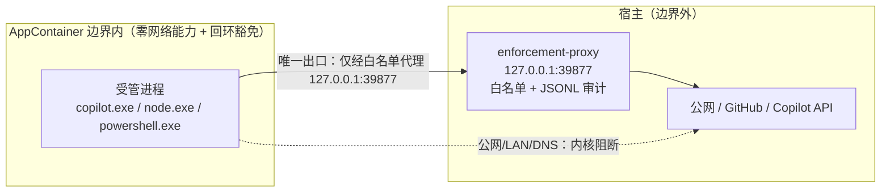

# B2 验证报告：外部 OS 强制（External OS Enforcement）

- 阶段：B2（外部 OS 强制定案 + 证据）
- 日期：2026-09-17（2026-09-18 更新：排练转录已归档、未闭环项清零，见 §3 第 1 项与 §13）
- 平台：Windows 11（报告为 Windows 10 Home 24H2，build 26100.9457），PowerShell 5.1，Go 1.22 工具链
- 证据根目录：`docs/validation/evidence/b2-2026-09-17/`（含 `MANIFEST.md` 与 `SHA256SUMS.txt`）
- 关联文档：`docs/CONTRACTS.md`、`docs/ARCHITECTURE.md`、`docs/TEST_STRATEGY.md`、`docs/t027/FLASH_OPERATING_DIRECTIVE_v3.1.md`
- **CI 证据**（2026-09-18 观察）：三个提交已推送 `origin/main`（`c5c22ad..408bd99`）——`58757e8`（工具收编：代理 + AppContainer 机器纪律，含 `.gitignore` 的 `/tools/tmp/` 守卫）、`fd99dc3`（本报告 + 证据包 + DEV_PLAN 双语回写）、`408bd99`（`*.raw.txt` 字节保真规则收窄）。GitHub Actions 两跑全绿：run **`35259806285`**（head `fd99dc3`，约 1m48s）与 run **`35261204021`**（head `408bd99`，约 1m52s）——Windows 腿 Build/Vet/Test success，Ubuntu 腿 Build/Vet/Test + **Race**（`CGO_ENABLED=1 go test -race -count=1 ./internal/adapters/... ./internal/chain/...`）+ **Contract fixtures**（`tools/contracts`）全 success。新增代理包 `tools/agent-probe/enforcement-proxy` 的 15 项测试进入**两腿**默认套件（`go test -count=1 ./...`）；该包**不在** `-race` 子集内（Race 仅覆盖 `internal/adapters`、`internal/chain`）。`Candidate build` / `Candidate probe` / `Bootstrap and release evidence` 三个条件任务按设计跳过（仅 `workflow_dispatch`）。

## 1. 结论（定案）

**采用方案 B：外部 OS 强制。** 受管进程运行在**零网络能力 AppContainer** 中，内核级阻断公网、LAN 与 DNS；
容器持有 `loopbackExempt`，唯一可用出口是 `127.0.0.1:39877` 上 ProofRail 自带的**白名单代理**，
由该代理在宿主侧完成受控出网。策略判定发生在操作系统边界与代理两处，均不由受管进程自身控制。

适用于 B2 的边界定义（必须逐字保留）：

- **边界内**：AppContainer 令牌、其网络能力集（无公网/LAN/DNS）、其文件系统授权集、其进程创建能力。
- **边界外**：宿主侧的一切，包括代理进程自身的出网、宿主凭据库、未被授权的宿主文件。
- 代理是**边界上的强制点**，不是边界内组件；代理实现（`tools/agent-probe/enforcement-proxy/`）不随
  受管代码分发，也不由受管进程改配置。
- 术语澄清：上文“唯一出口”指**受管进程只能通过代理出网**（其自身无任何其它网络能力）；代理本身的出网属边界外，
  见第 8.5 条。

## 2. 架构



关键机制与语义：

- **网络能力**：容器能力集为空（无 `internetClient`、无 `privateNetworkClientServer`）；实测公网、LAN
  与 DNS 全部不可达（见 §5、§6）。
- **回环豁免**：`NetworkIsolationSetAppContainerConfig` 整表写入（保留既有条目），为容器 SID 加入豁免。
  选择该 API 的原因：`CheckNetIsolation LoopbackExempt -a/-d` 对非打包 SID 会失败（本会话早期实测，
  错误码 1337；**该转录未归档在本证据包**，如需引用应在管理员会话中重测补录）。
- **豁免无端口粒度**：豁免是"全回环"的，不能只放行 39877。因此**本地回环监听面是残余攻击面**，必须
  以基线枚举的方式记录并随环境变化重测（见 §3 第 2 项、§8）。
- **代理白名单**：按注册域后缀 + 点边界匹配；默认拒绝；每条决策写 JSONL（`decision`/`host`/`port`/`event`）。
  端口固定 `39877`，启动时占用检查**失败即退出，绝不静默改用其它端口**。
  **审计完整性**：日志是 `networkControl` 的证据，写失败即 **fail-closed**——放行前先写 `authorized` 预记录，
  写不进则返回 403、不建立隧道；已建立的隧道立即关闭，并在 stderr 报出首次故障。
  监听地址**只能是回环**（`127.0.0.1`/`::1`/`localhost`），否则启动即拒绝。

## 3. 三项过程要求（用户显式要求）与证据

1. **先排练再实跑（pre-rehearsal）**
   `tools/agent-probe/appcontainer-b2/Invoke-B2LoopbackRehearsal.ps1` 执行 apply → verify(存在) → revert → verify(不存在 + 零差异)
   → apply → verify(存在)。**2026-09-18 由用户在管理员会话中实跑通过并归档**：6 步全部 `exit=0`、`rehearsal-ok=True`，
   第 4 步（revert 后）为 `restoral: zero-difference`。转录（各步日志 + `summary.json` + 收尾 revert/remove/verify）在
   `restorability/rehearsal.txt`；收尾后只读现状在 `restorability/verify-current-state.txt`（零差异、无豁免、无 profile）。
   排练编排会自动识别早于 schemaVersion 2 的旧基线并转发 `-RefreshBaseline`（apply 侧仍要求先确认恢复态）。
   脚本原件已随证据包（`machine-ops/`）归档；**维护副本位于仓库内** `tools/agent-probe/appcontainer-b2/`。
2. **基线失效必须可执行**
   `New-B2Snapshot` 在 **P1 之前**与 **B4 复用同端口之前**各做一次快照；`Get-B2SnapshotDiff` 采用严格模式
   （仅比较豁免表与防火墙配置），`Get-B2ListenerDiff` 仅作信息项（`verify-current-state.txt` 中
   `listener-removed: tcp:127.0.0.1:4709:wpscloudsvr` 即该信息项输出）。快照/差异逻辑在
   `machine-ops/b2-loopback-lib.ps1`，调用点在 apply/revert/verify 三个脚本内。
3. **出口路径必须在证据中声明**
   每次实跑（`machine-ops/container-candidate.ps1`、`container-nodecall.ps1`）都把
   `proxy = http://127.0.0.1:39877`、`allow` 列表、`upstream`（默认空 = 直连）写入 `argv.json` 或结果文件；
   代理 JSONL 逐条记录 allow/deny 决策，**字节计数只在 `connect closed` 等部分事件上出现**（deny 与
   `established` 事件不含字节字段）。**未使用任何 host 侧直连旁路**。

## 4. 机器改动清单与成对纪律

| 项 | 内容 | 施加 | 撤销 | 证据 |
| --- | --- | --- | --- | --- |
| 唯一系统改动 | 容器 SID 回环豁免（整表写入，保留既有条目） | `apply-b2-loopback.ps1` | `revert-b2-loopback.ps1` | `machine-ops/`、`restorability/` |
| 容器 profile 存在性 | `apply` 可能创建 profile（`New-B2ContainerSidIfMissing`）；`verify`/`revert` 一律使用**非创建式**解析（`Get-B2ContainerSidByName`，或需存在性的 `Get-B2ContainerSidExisting`）；存在性以**当前用户注册表** `…\AppContainer\Storage\<name>` 为准（"派生式 API 仅按名字推导、不能判断存在性"为 2026-09-17 实测）；profile 存在性已纳入严格基线 diff（schemaVersion 2） | `apply-b2-loopback.ps1`（唯一创建者） | `revert-b2-loopback.ps1` **默认同时删除 profile**（`-KeepProfile` 可保留供 B4 复用） | `machine-ops/b2-loopback-lib.ps1` |
| 旧基线兼容 | 早于 schemaVersion 2 的基线无法回答 profile 存在性：diff 报告信息行 `profile-existence-unverifiable` 而**不计为差异**；`apply-b2-loopback.ps1 -RefreshBaseline`（或 `Invoke-B2LoopbackRehearsal.ps1 -RefreshBaseline`）在**已验证恢复态**（无豁免、无 profile）时重录有效基线 | 同上 | — | 同上 |
| 临时文件系统授权 | 每个 run 目录对容器 SID 授予 `(OI)(CI)M` | run 脚本内 `icacls` | run 结束随目录清理 | `machine-ops/container-candidate.ps1` |
| 卷根读权限 | **未改动**（`D:\` 卷根保持原状）；本方案不依赖修改卷根 ACL | — | — | 同上 |

成对规则：**任何机器改动都必须同时具备 apply 与 revert，并带基线比对**；只有 apply 没有 revert 的脚本
不允许执行。豁免表状态（当前 3 条：2 条既有 + 1 条本项目）可由 `verify-b2-loopback.ps1` 只读确认。

## 5. 测量事实矩阵（均为 2026-09-17 实测）

### 5.1 容器网络能力矩阵（`boundary-battery.txt` + `measuring/`）

| 检查项 | 结果 |
| --- | --- |
| 容器 → `127.0.0.1:39877`（强制代理） | 可达（豁免生效） |
| 容器 → `127.0.0.1:5037`（其它回环监听，adb） | **可达（残余面，需基线记录）** |
| 容器 → LAN `10.0.0.246:{8080,1081,8081}` | 全部不可达 |
| 容器经代理 → 白名单主机 `https://api.githubcopilot.com/` | HTTP 404（连通；404 为该路径正常响应） |
| 容器经代理 → 未列白名单 `http://example.com/` | **HTTP 403 + `decision:"deny"`** |
| 容器直连出网（不经代理） | 失败：DNS 解析被阻断（**公网阻断的实测表现为 DNS 失败；直接 IP 出网未单独测量**，依据为空能力集） |
| 容器写授权目录 | 成功（`write-inside=ok`） |
| 容器写未授权目录 | 拒绝（`write-outside=denied`） |
| 宿主侧金丝雀文件 | 未被修改 |

### 5.2 容器内的执行/路径行为（影响 B4 及任何受管进程的接入方式）

| 现象 | 实测结论 | 证据 |
| --- | --- | --- |
| 卷根可见性（实测） | 数据卷（`D:\`）卷根对容器 SID 不可读：候选 CLI 的 ESM 加载器在 pre-subst 运行时失败于 `realpathSync` → `EPERM ... lstat 'D:\'` | `container-exec/exec-check-pre-subst-stderr.txt` |
| C: 系统卷差异（**推断，未单独实测**） | 该问题只在数据卷出现，推测与系统卷卷根默认 ACE 有关；本方案不依赖此推断（改用下述 subst 规避） | — |
| 规避手段（零系统改动） | 用**按会话 `subst` 虚拟盘**把 run 目录映射为 `R:`，给子进程只传盘符拼写；候选随即在容器内正常启动 | `container-exec/`（`--version` 输出 `1.0.83`） |
| 路径拼写差异（**两处测量不一致，按保守口径执行**） | `probe13`（同一目录）：`existsD=True/existsR=True`、`listD-count=2`、`listR-count=2`、`createD=ok`、`createR=ok` —— D:/R: 等价；但 `probe10` 与 `ws-result` 的产物显示 `dir R:\ws` 成功而 `dir <D:\...\ws>` 被拒（`拒绝访问`）。**结论：不假设 D: 拼写可用；容器内一律使用 subst 盘符拼写** | `measuring/probe13-path-spelling.txt`、`measuring/probe10-dir-listing.txt`（另有 `probe10-dir-listing.raw.txt` 原始字节副本）、`measuring/ws-result.txt` |
| 子进程创建 | 容器内 PowerShell **无法**派生外部进程；`cmd.exe` 可以，但**按绝对路径调用可执行文件被拒**，按 **PATH 名字解析可成功**（候选即以此方式启动） | `machine-ops/container-candidate.ps1` 注释与 `container-exec/argv.json` |
| 命令行长度（**推断 + 规避实测**） | 用 base64 `-EncodedCommand`（~4KB 脚本）启动时进程立即退出且不创建重定向文件；改为 `-File` 落盘调用后恢复正常。**归因为命令行长度的推断**（未逐字节测定上限） | `machine-ops/container-modelcall.ps1`（含注释）、`token-exchange/node-out.txt` |
| 受限请求头 | .NET `HttpWebRequest` 中 `User-Agent`/`Accept`/`Referer` 必须用属性赋值，直接写 `Headers[]` 抛 `ArgumentException` | `machine-ops/container-modelcall.ps1` |

### 5.3 受管候选身份（绑定值）

| 字段 | 值 |
| --- | --- |
| 路径 | `%APPDATA%\npm\node_modules\@github\copilot\node_modules\@github\copilot-win32-x64\copilot.exe` |
| sha256 | `d3f3bb7b8bbf68357ad29f514a179d09f76135483d8bfb643131b8600f671ee2` |
| 大小 / 版本 | 144,796,448 B / `1.0.83` |
| 凭据来源 | Windows 凭据管理器，generic target `https://github.com:larsonzh.copilot-cli`：**GitHub 凭据绝不写盘**，仅经进程环境块注入（不进 argv、不进日志） |
| 会话令牌（gh 交换结果） | 经由 run 目录内临时文件读取，**解析后立即删除**，且**不入证据包**；删盘前不落任何副本 |

## 6. 真实客户端流量证据

1. **候选 CLI 在容器内经代理完成了认证调用**：`api.github.com` 的 managed-settings 拉取成功
   （候选日志：`server policy: none for this account (404 ...) from https://github.com` / `self-fetch complete for https://github.com/larsonzh`），
   代理 JSONL 记为 `allow`。
2. **deny-by-default 在真实流量上生效**：首次实跑中候选尝试 `api.individual.githubcopilot.com` 与
   `telemetry.individual.githubcopilot.com`，因不在白名单被**连续拒绝 7 次**；据此把两个主机加入白名单后
   重跑，同一主机变为 `allow`。**推断**：对照首轮“Failed to load models”消失可认为模型列表请求已成功，
   但包内无响应内容级证据（TLS 隧道内不可见）。
   —— 证据：`proxy-decisions/deny-run.jsonl`、`proxy-decisions/allow-run.jsonl`。
3. 候选会话在**取得模型列表之后**失败于其自身的会话校验
   （`Error executing prompt: Error: Directory does not exist or cannot be accessed: <ws>`，见
   `proxy-decisions/candidate-session-log.txt`），该失败与边界无关，见 §8。

## 7. 探针台账（预授权 **10 次计费探针**；**已消耗 premium 请求 0 次**）

口径说明：预授权指**计费探针**；免费轮次不计入。下表把“尝试次数”与“计费消耗”分开列，避免混淆。

| 轮次 | 尝试次数 | 结果 | 计费消耗 |
| --- | --- | --- | --- |
| 免费：exec-check（容器内候选 `--version`） | 4 | 成功（subst 机制前后各 2 次），输出 `1.0.83` | 0 |
| 免费：边界电池 / 探针组 / 证据组装 | 多次 | 见 §5；每次均留存 run 目录转录 | 0 |
| 计费尝试：smoke（含各类工作区/拼写变体） | 5 | **全部在模型调用前失败**（工作区校验或白名单拒绝） | **0**（`proxy-decisions/allow-run-usage.json` 显示 `totalPremiumRequestCost=0`、`totalUserRequests=0`） |
| 计费尝试：自建客户端令牌交换与模型列表 | 6 | 令牌端点被 GitHub WAF 403 拦截（含官方 `gh`），未发起任何生成请求 | **0** |

**结论**：计费尝试共 **11 次**，其中**全部**在产生费用之前失败（可核对 `proxy-decisions/allow-run-usage.json` 与 WAF 页面），
故 premium 请求消耗 **0**；“10 次预授权”额度视为**未使用**。若需严格以“计费请求数”计额，本阶段即 0/10。
**计费调用证据未取得**（原因见 §8.3、§8.4）。

## 8. 已知限制与残留风险（必须随结论一起引用）

1. **回环豁免无端口粒度** ⇒ 容器可访问宿主**任意**回环监听服务；实测可触达 adb `5037`。缓解：把宿主
   回环监听面纳入基线枚举，环境变化时重测；不得把"容器只能访问代理"作为安全断言。
2. **卷根可读性差异**：数据卷卷根对容器不可读；当前以**按会话 `subst`** 规避（零系统改动）。若 B4 需要
   脱离虚拟盘运行，须改为提权在卷根授予容器 SID 非继承 `(RX)`，并纳入 apply/revert 纪律。
3. **零能力容器内的候选会话失败**：候选 1.0.83 在取得模型列表后报"工作区不可访问"。已排除 ACL 因素
   （对 5 个子目录逐一核对容器 ACE 存在；对 `R:\`、`R:\home`、`D:\...` 等拼写逐一尝试），故判定为候选
   自身在零能力令牌下的内部校验/会话宿主行为。**后果：B4/B5 不能假设候选 CLI 可在零能力边界内完整运行。**
4. **自建客户端无法完成令牌交换**：`api.github.com/copilot_internal/v2/token` 对手写客户端与官方 `gh`
   一律返回 403（WAF 页），与边界无关，属服务端策略。**后果：以"自建最小客户端"取得计费调用证据的路线
   被阻断**；如需计费证据，应采用官方客户端 + 边界内可运行的工作区配置，或改在 B4 设计阶段一并解决。
5. **宿主侧代理出网属于边界外**：代理出网默认直连（`-upstream` 可选）。证据中如实声明，不得表述为
   "整体流量受管"。
6. **SSRF/白名单非完备性声明**：白名单基于已观测流量 + 必要主机清单构造，**非穷尽**；代理仅做主机级
   允许/拒绝与审计，不做内容级检查。
7. **平台中立性核查（2026-09-17，逐条确认，无需改动）**：
   - 契约/Schema/证据模型（`docs/CONTRACTS*.md`、`schemas/*.json`、`internal/{evidence,guard,taskdef}`）
     未混入 `AppContainer`/`LoopbackExempt`/`SID`/`icacls`/`subst` 等平台专有词；这些词仅存在于 B2 工具、
     本报告与代理 README。
   - 契约中仅有两处**显式声明**的平台相关命名：`windows-credential:<target>` 凭据方案与交付范围
     `windows/amd64`（linux 已列为下一独立目标）——属声明的范围而非安防机制泄漏。
   - `platformHash` 为不透明摘要（`{"$ref": "#/$defs/sha256"}`），契约要求先将环境规范化为 `os`/`arch` 再计算；
     `hook.schema.json` 中的 `loopback` 是策略模式名（`deny`/`loopback`），平台无关。
   - enforcement-proxy **纯标准库**：imports 仅 `bufio/encoding/json/errors/flag/fmt/io/net/net\/http/net\/url/os/os\/signal/strconv/strings/sync/syscall/time`，
     无 Windows 专有包、无第三方依赖；其接口（`-listen`/`-allow`/`-log`）与平台无关。
   - 回环基线方法是平台无关的**操作规程**（枚举回环监听 → 快照 → 严格 diff → 新增监听须人工裁决），
     平台差异仅在枚举 API（当前 Windows 实现见 `tools/agent-probe/appcontainer-b2/`）。
8. **S2 待做（只登记，不实做）**：定义平台无关的 `Sandbox` 接口（`internal/guard/sandbox.go`）+ Windows 实现包装
   （`sandbox_windows.go`）+ fail-closed 空实现（`sandbox_unsupported.go`）。**S1 不实做**，仅在 S2 启动时按此接口扩展；
   在 S1 提前落地该接口会产生无人调用的死代码，反而增加维护面。

## 9. B4 入口条件与移交

- 端口固定 `39877`；**复用前必须重跑基线失效快照**（`New-B2Snapshot` + `Get-B2SnapshotDiff`）。
- 机器改动必须成对（apply/revert）+ 基线比对，经排练后才能执行；沿用 `verify-b2-loopback.ps1` 只读确认。
- 受管进程接入方式：以 PATH 名字解析启动；必要时用 `subst` 盘符拼写；避免 >8KB 命令行。
- 若要在 B4 取得**计费调用**证据，需先解决 §8.3/§8.4 两项（建议优先：官方客户端 + 已被接受的工作区形态，
  或在设计阶段直接评估"是否需要计费调用证据"这一要求本身）。

## 10. 证据清单（详见 `evidence/b2-2026-09-17/MANIFEST.md`）

| 路径 | 内容 |
| --- | --- |
| `machine-ops/` | apply / revert / verify / rehearsal / 边界电池 / 三个 run 脚本 / `ac-lib.ps1` / Node 客户端（仓库编码归一后的副本） |
| `restorability/rehearsal.txt` | 2026-09-18 排练完整转录（6 步日志 + `summary.json` + 收尾 revert/remove/verify，零差异）；`verify-current-state.txt` 为收尾后只读现状（`expect=absent ok=True`） |
| `boundary/boundary-battery.txt` | 边界电池完整转录（含代理 JSONL 三行样例） |
| `container-exec/` | 容器内候选 `--version` 结果、stdout、`argv.json`（无密钥在命令行） |
| `proxy-decisions/` | deny 轮与 allow 轮的代理 JSONL、allow 轮 stderr、候选会话日志 |
| `token-exchange/` | 自建客户端与 `gh` 的 403 WAF 证据、代理 JSONL |
| `measuring/` | 路径拼写矩阵（probe13）、目录枚举（probe10）、边界电池 run 产物（含 `ws-result.txt`）、pre-subst 候选 stderr（`EPERM lstat 'D:\'`） |
| `proxy-decisions/` | 另含 smoke 轮 `allow-run-usage.json`（证明 `totalPremiumRequestCost=0`） |

## 11. 复现命令

机器纪律脚本已提升为仓库内正式工具（`tools/agent-probe/appcontainer-b2/`，见该目录 `README.md`）；
其临时产物写入被 gitignore 的 `tmp/b2/`，因此清理 `tmp/` 不影响复现。证据包内的 `machine-ops/`
是这些脚本在 B2 当时的字节级快照。**临时目录清理策略**：证据包冻结后可直接删除 `tmp/b2/`；
届时 `assemble-evidence.ps1` 会把历史 run 目录报为 `missingArtifact`（预期行为，冻结包与
`SHA256SUMS.txt` 不受影响）。

```powershell
# 机器改动（需要管理员）：排练 -> 施加 -> 只读确认
powershell -NoProfile -ExecutionPolicy Bypass -File tools\agent-probe\appcontainer-b2\Invoke-B2LoopbackRehearsal.ps1
powershell -NoProfile -ExecutionPolicy Bypass -File tools\agent-probe\appcontainer-b2\apply-b2-loopback.ps1
powershell -NoProfile -ExecutionPolicy Bypass -File tools\agent-probe\appcontainer-b2\verify-b2-loopback.ps1

# 免费边界电池（含容器探针与代理决策）
powershell -NoProfile -ExecutionPolicy Bypass -File tools\agent-probe\appcontainer-b2\boundary-battery.ps1

# 容器内候选（免费 exec-check；计费场景需 -Run）
powershell -NoProfile -ExecutionPolicy Bypass -File tools\agent-probe\appcontainer-b2\container-candidate.ps1 -Scenario exec-check

# 证据包重建（会重跑免费电池；排练已在管理员会话中归档一次，重跑须再次提权）
powershell -NoProfile -ExecutionPolicy Bypass -File tools\agent-probe\appcontainer-b2\assemble-evidence.ps1

# 收尾（需要管理员）：撤销回环豁免并确认零差异；可选删除容器 profile
powershell -NoProfile -ExecutionPolicy Bypass -File tools\agent-probe\appcontainer-b2\revert-b2-loopback.ps1
powershell -NoProfile -ExecutionPolicy Bypass -File tools\agent-probe\appcontainer-b2\remove-b2-container-profile.ps1
```

## 12. 契约对照与授权记录

对照 `docs/CONTRACTS.md` 中受管执行/网络控制相关条款：

| 契约要求（`docs/CONTRACTS.md`） | B2 落地 | 证据 |
| --- | --- | --- |
| 网络默认拒绝 | 容器零网络能力，内核阻断 DNS/公网/LAN；唯一可用出口为代理 | `boundary/boundary-battery.txt` |
| 需要网络时以独立能力声明 | 白名单即能力声明，且位于**宿主侧**、受管进程不可修改 | `machine-ops/container-candidate.ps1`、代理 JSONL |
| 环境继承白名单 | harness 构造自定义环境块：剔除 `GH_TOKEN`/`GITHUB_TOKEN`/`COPILOT_GITHUB_TOKEN`/`GITEE_TOKEN` 等，仅注入本次运行必需项；密钥仅经环境块传递 | `container-exec/argv.json`（`envNames`、`secretSource`） |
| 记录 `networkControl` 运行证据 | 代理 JSONL（`decision`/`host`/`port`/`event`，字节计数在 close 事件）+ run 目录产物集合；审计写失败 fail-closed | `proxy-decisions/`、`token-exchange/proxy.jsonl` |
| 受管进程不得自行扩大网络/target | 容器无能力；代理白名单与上游配置在宿主侧；占用端口时 fail-fast，**绝不静默改端口** | `tools/agent-probe/enforcement-proxy/main.go` 及其测试 |
| 变更需可回滚 | apply/revert 成对 + 基线 diff + 排练纪律 | `machine-ops/`、`restorability/` |

授权记录：用户在本轮开工指令中预授权 **10 次探针**；本轮实际计费消耗 **0**（见 §7）。
机器改动的施加与撤销均需管理员会话，且**只能由用户本人发起**（本报告不代执行撤销）。

## 13. 未闭环项与责任归属（单一清单）

**2026-09-18 更新：本清单已清空。** 原唯一未闭环项（排练完整转录）已由用户在管理员会话中完成并归档：
`restorability/rehearsal.txt` 现为**真实排练转录**（6 步全 `exit=0`、`rehearsal-ok=True`、第 3 步 revert 后零差异），
`restorability/verify-current-state.txt` 为收尾后的**只读**现状（零差异、无豁免、无 profile）。本次替换后
`MANIFEST.md` 与 `SHA256SUMS.txt` 已重算，本报告的事实性声明现全部可由证据包自证；包内不存在“有结论无证据”的条目。

| 项 | 状态 | 证据 |
| --- | --- | --- |
| 排练完整转录 | ✅ 已闭环（2026-09-18，用户提权实跑） | `restorability/rehearsal.txt`（6 步日志、`summary.json`、收尾 revert/remove/verify） |
| 机器改动 | 已施加并已撤销，机器处于恢复态 | `restorability/verify-current-state.txt`（`restoralDiff: zero-difference`、`expect=absent ok=True`） |

不变约束（不因清单清空而失效）：
- 机器改动的施加与撤销仍**只能由用户本人**在管理员会话中发起（本助手无法提权，也不得代为执行机器改动）。
- `revert` 默认删除容器 profile；为 B4 复用保留时需显式 `-KeepProfile` 并接受 `profile-existence-changed` 信息行；
  B4 复用同一端口前必须重做基线快照与只读确认。
- 证据包冻结后可直接删除 `tmp/b2/`；届时 `assemble-evidence.ps1` 会把历史 run 目录报为 `missingArtifact`（预期）。
