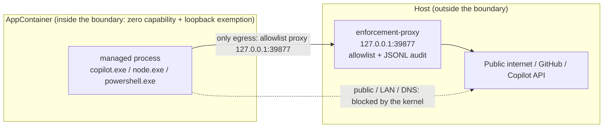

# B2 Validation Report: External OS Enforcement

- Phase: B2 (external OS enforcement decision + evidence)
- Date: 2026-09-17 (updated 2026-09-18: rehearsal transcript archived, open-item list cleared - see section 3 item 1 and section 13)
- Platform: Windows 11 (reported as Windows 10 Home 24H2, build 26100.9457), PowerShell 5.1, Go 1.22 toolchain
- Evidence root: `docs/validation/evidence/b2-2026-09-17/` (with `MANIFEST.md` and `SHA256SUMS.txt`)
- Related documents: `docs/CONTRACTS.md`, `docs/ARCHITECTURE.md`, `docs/TEST_STRATEGY.md`, `docs/DELIVERY_DIRECTIVE.md` (delivery discipline, v1.1), `docs/t027/FLASH_OPERATING_DIRECTIVE_v3.1.md` (**superseded**, historical reference only)
- **CI evidence** (observed 2026-09-18): three commits are pushed to `origin/main` (`c5c22ad..408bd99`) - `58757e8` (tool adoption: the proxy plus the AppContainer discipline, including the `/tools/tmp/` guard in `.gitignore`), `fd99dc3` (this report + the evidence bundle + the bilingual DEV_PLAN write-back) and `408bd99` (narrowing the byte-exact `*.raw.txt` rule). GitHub Actions is green twice: run **`35259806285`** (head `fd99dc3`, about 1m48s) and run **`35261204021`** (head `408bd99`, about 1m52s) - the Windows leg passed Build/Vet/Test and the Ubuntu leg passed Build/Vet/Test plus **Race** (`CGO_ENABLED=1 go test -race -count=1 ./internal/adapters/... ./internal/chain/...`) and **Contract fixtures** (`tools/contracts`). The new `tools/agent-probe/enforcement-proxy` package (15 tests) runs in the default suite (`go test -count=1 ./...`) on **both** legs; it is **not** part of the `-race` subset, which covers `internal/adapters` and `internal/chain` only. `Candidate build` / `Candidate probe` / `Bootstrap and release evidence` are skipped by design (they run only on `workflow_dispatch`).

## 1. Decision

**Option B is adopted: external OS enforcement.** The managed process runs inside a **zero-network-capability
AppContainer**, so public, LAN and DNS traffic are blocked by the kernel. The container holds a
`loopbackExempt` entry, and its only usable egress is the **allowlist proxy** shipped with ProofRail on
`127.0.0.1:39877`; that proxy performs the controlled egress on the host side. Policy decisions therefore
happen at the operating-system boundary and at the proxy, neither of which is controlled by the managed process.

Boundary definitions for B2 (to be preserved verbatim):

- **Inside the boundary**: the AppContainer token, its network capability set (no public/LAN/DNS), its granted
  file-system set, and its process-creation capability.
- **Outside the boundary**: everything on the host, including the proxy's own egress, the host credential store
  and any file system location that has not been granted.
- The proxy is the **enforcement point on the boundary**, not an in-boundary component. Its implementation
  (`tools/agent-probe/enforcement-proxy/`) is not shipped to managed code and cannot be reconfigured by it.
- Terminology: "only egress" above means **the managed process can only reach the network through the proxy**
  (it holds no other network capability). The proxy's own egress is outside the boundary; see §8.5.

## 2. Architecture



Mechanics and semantics:

- **Network capability**: the container capability set is empty (no `internetClient`, no
  `privateNetworkClientServer`); public, LAN and DNS reachability were all measured as blocked (see §5, §6).
- **Loopback exemption**: written through `NetworkIsolationSetAppContainerConfig` (whole-table semantics,
  preserving pre-existing entries) for the container SID. The reason for choosing that API:
  `CheckNetIsolation LoopbackExempt -a/-d` fails for non-packaged SIDs (measured earlier in this session with
  error 1337; **that transcript is not archived in this bundle**, so it should be re-measured in an elevated
  session before being cited).
- **No port granularity**: the exemption is all-or-nothing per container, so the **local loopback listening
  surface is a residual attack surface**. It must be enumerated as a baseline and re-measured when the
  environment changes (see §3 item 2 and §8).
- **Proxy allowlist**: registrable-domain suffixes with dot-boundary matching; deny by default; every decision is
  logged as JSONL (`decision`/`host`/`port`/`event`). The port is fixed at `39877`; the startup occupancy check
  **fails fast and never switches ports silently**.
  **Audit integrity**: the log is the `networkControl` evidence, so a write failure is **fail-closed** — the allow
  paths write an `authorized` record before forwarding, answer `403` and never build the tunnel when that write
  fails, close an already-established tunnel immediately, and report the first failure on stderr.
  The listen address **must be loopback** (`127.0.0.1`/`::1`/`localhost`); anything else is refused at startup.

## 3. The three process requirements and their evidence

1. **Rehearse before running.**
   `tools/agent-probe/appcontainer-b2/Invoke-B2LoopbackRehearsal.ps1` performs apply → verify(present) → revert → verify(absent and
   zero-difference) → apply → verify(present). **Executed by the user in an elevated session and archived on
   2026-09-18**: all six steps `exit=0`, `rehearsal-ok=True`, and step 4 (after the revert) reported
   `restoral: zero-difference`. The transcript (per-step logs + `summary.json` + close-out revert/remove/verify)
   is `restorability/rehearsal.txt`; the read-only state after close-out is
   `restorability/verify-current-state.txt` (zero difference, no exemption, no profile). The orchestration detects
   a baseline older than schemaVersion 2 and forwards `-RefreshBaseline` (apply still requires verified restoral
   state first). The scripts ship in the bundle under `machine-ops/` (including its `ac-lib.ps1` dependency).
2. **Baseline invalidation must be executable.**
   `New-B2Snapshot` is taken **before P1** and **before any B4 reuse of the same port**; `Get-B2SnapshotDiff` runs
   in strict mode (exemptions and firewall configuration only), while `Get-B2ListenerDiff` is informational (the
   `listener-removed: tcp:127.0.0.1:4709:wpscloudsvr` line in `verify-current-state.txt` is that informational
   output). The snapshot/diff logic lives in `machine-ops/b2-loopback-lib.ps1` and is invoked from the
   apply/revert/verify scripts.
3. **The egress path must be declared in the evidence.**
   Every real run (`machine-ops/container-candidate.ps1`, `machine-ops/container-nodecall.ps1`) records
   `proxy = http://127.0.0.1:39877`, the `allow` list and the `upstream` value (empty = direct) in `argv.json` or
   its result file; the proxy JSONL records every allow/deny decision, and **byte counts appear only on some
   events such as `connect closed`** (deny and `established` events carry no byte fields). **No host-side direct
   bypass was used.**

## 4. Machine changes and the pairing discipline

| Item | Content | Apply | Revert | Evidence |
| --- | --- | --- | --- | --- |
| Only system change | container SID loopback exemption (whole-table write, preserving existing entries) | `apply-b2-loopback.ps1` | `revert-b2-loopback.ps1` | `machine-ops/`, `restorability/` |
| Container profile existence | `apply` may create the profile (`New-B2ContainerSidIfMissing`); `verify`/`revert` always use **non-creating** resolution (`Get-B2ContainerSidByName`, or `Get-B2ContainerSidExisting` where existence is required); existence is decided by the **current user's registry key** `…\AppContainer\Storage\<name>` (the derivation API is name-only and cannot answer existence — measured 2026-09-17); profile existence is part of the strict baseline diff (schemaVersion 2) | `apply-b2-loopback.ps1` (the only creator) | `revert-b2-loopback.ps1` **deletes the profile by default** (`-KeepProfile` keeps it for B4 reuse) | `machine-ops/b2-loopback-lib.ps1` |
| Legacy baseline compatibility | A baseline older than schemaVersion 2 cannot answer profile existence: the diff reports the informational line `profile-existence-unverifiable` and does **not** count it as a difference; `apply-b2-loopback.ps1 -RefreshBaseline` (or `Invoke-B2LoopbackRehearsal.ps1 -RefreshBaseline`) records a valid baseline once restoral state has been verified (no exemption, no profile) | as above | — | as above |
| Temporary file-system grant | per-run directory granted `(OI)(CI)M` to the container SID | `icacls` inside the run scripts | removed with the run directory | `machine-ops/container-candidate.ps1` |
| Volume-root read | **unchanged** (the `D:\` root stays as-is); this design does not depend on modifying the volume root ACL | — | — | as above |

Pairing rule: **every machine change must have both an apply and a revert plus a baseline comparison**; a script
with only apply is not allowed to run. The exemption table state (currently 3 entries: 2 pre-existing plus ours)
can be confirmed read-only with `verify-b2-loopback.ps1`.

## 5. Measurement matrix (all measured on 2026-09-17)

### 5.1 Container network matrix (`boundary-battery.txt` + `measuring/`)

| Check | Result |
| --- | --- |
| Container → `127.0.0.1:39877` (enforcement proxy) | reachable (exemption in force) |
| Container → `127.0.0.1:5037` (other loopback listener, adb) | **reachable (residual surface, must be baselined)** |
| Container → LAN `10.0.0.246:{8080,1081,8081}` | all unreachable |
| Container via proxy → allowlisted host `https://api.githubcopilot.com/` | HTTP 404 (connected; 404 is the normal response for that path) |
| Container via proxy → non-allowlisted `http://example.com/` | **HTTP 403 plus `decision:"deny"`** |
| Container direct egress (bypassing the proxy) | fails: DNS resolution is blocked (**the measured form of the public-network block is DNS failure; direct-IP egress was not measured separately**, it rests on the empty capability set) |
| Container writes inside a granted directory | succeeds (`write-inside=ok`) |
| Container writes outside granted directories | denied (`write-outside=denied`) |
| Host-side canary files | unmodified |

### 5.2 Execution and path behaviour inside the container (relevant to B4 and to any managed process)

| Observation | Measured conclusion | Evidence |
| --- | --- | --- |
| Volume-root visibility (measured) | A data volume root (`D:\`) is unreadable for the container SID: during the pre-subst run the candidate CLI's ESM loader failed in `realpathSync` with `EPERM ... lstat 'D:\'` | `container-exec/exec-check-pre-subst-stderr.txt` |
| C: system volume difference (**inference, not measured separately**) | The problem appeared only on the data volume, which is presumed to relate to the system volume's default root ACE; this design does not depend on that inference (it uses the subst workaround below) | — |
| Zero-system-change workaround | map the run directory to a **per-session `subst` drive** (`R:`) and hand the child only drive-letter paths; the candidate then starts normally inside the container | `container-exec/` (`--version` prints `1.0.83`) |
| Path-spelling behaviour (**two measurements disagree; the conservative rule is applied**) | `probe13` (same directory): `existsD=True/existsR=True`, `listD-count=2`, `listR-count=2`, `createD=ok`, `createR=ok` — D: and R: looked equivalent. However `probe10` and `ws-result` show `dir R:\ws` succeeding while `dir <D:\...\ws>` is denied. **Conclusion: do not assume the D: spelling works; always use the subst drive spelling for in-container tools** | `measuring/probe13-path-spelling.txt`, `measuring/probe10-dir-listing.txt` (plus the raw-byte copy `probe10-dir-listing.raw.txt`), `measuring/ws-result.txt` |
| Child-process creation | In-container PowerShell **cannot** spawn external processes; `cmd.exe` can, but **launching a binary by absolute path is denied** whereas **PATH name resolution succeeds** (the candidate is started that way) | comments in `machine-ops/container-candidate.ps1` and `container-exec/argv.json` |
| Command-line length (**inference plus a measured workaround**) | Launching with a base64 `-EncodedCommand` (~4 KB script) made the process exit immediately without creating its redirect files; switching to `-File` from disk restored normal behaviour. **The attribution to command-line length is an inference** (no byte-exact limit was measured) | `machine-ops/container-modelcall.ps1` (comments), `token-exchange/node-out.txt` |
| Restricted headers | In .NET `HttpWebRequest`, `User-Agent`/`Accept`/`Referer` must be set through properties; writing them into `Headers[]` throws `ArgumentException` | `machine-ops/container-modelcall.ps1` |

### 5.3 Managed candidate identity (binding values)

| Field | Value |
| --- | --- |
| Path | `%APPDATA%\npm\node_modules\@github\copilot\node_modules\@github\copilot-win32-x64\copilot.exe` |
| sha256 | `d3f3bb7b8bbf68357ad29f514a179d09f76135483d8bfb643131b8600f671ee2` |
| Size / version | 144,796,448 B / `1.0.83` |
| Credential source | Windows Credential Manager, generic target `https://github.com:larsonzh.copilot-cli`: the **GitHub credential is never written to disk**, it is injected through the process environment block only (not argv, not logs) |
| Session token (gh exchange result) | read from a temporary file inside the run directory, **deleted immediately after parsing** and **excluded from the evidence bundle** |

## 6. Evidence from real client traffic

1. **The candidate CLI completed an authenticated call through the proxy inside the container**: the
   `api.github.com` managed-settings fetch succeeded (candidate log: `server policy: none for this account (404 ...)
   from https://github.com`, `self-fetch complete for https://github.com/larsonzh`), logged by the proxy as `allow`.
2. **Deny-by-default held on real traffic**: on the first run the candidate tried
   `api.individual.githubcopilot.com` and `telemetry.individual.githubcopilot.com` and was **denied 7 times** for
   not being allowlisted; after adding exactly those hosts the same hosts became `allow`. **Inference**: compared
   with the first run, the "Failed to load models" error disappeared, which suggests the model list was retrieved
   successfully, but the bundle has no response-level evidence (it is invisible inside the TLS tunnel).
   Evidence: `proxy-decisions/deny-run.jsonl`, `proxy-decisions/allow-run.jsonl`.
3. The candidate session then failed on **its own session validation**
   (`Error executing prompt: Error: Directory does not exist or cannot be accessed: <ws>`, see
   `proxy-decisions/candidate-session-log.txt`). That failure is unrelated to the boundary; see §8.

## 7. Probe ledger (10 pre-authorized **billable probes**; **0 premium requests consumed**)

The pre-authorization covers **billable probes**; free rounds do not count against it. The table separates
attempts from billing so the two cannot be confused.

| Round | Attempts | Result | Billed |
| --- | --- | --- | --- |
| free: exec-check (in-container candidate `--version`) | 4 | succeeded (twice before and twice after the subst mechanism), printing `1.0.83` | 0 |
| free: boundary battery / probe set / evidence assembly | several | see §5; every run left its own directory of transcripts | 0 |
| billable attempts: smoke (including workspace and spelling variants) | 5 | **all failed before any model call** (workspace validation or allowlist denial) | **0** (`proxy-decisions/allow-run-usage.json` shows `totalPremiumRequestCost=0`, `totalUserRequests=0`) |
| billable attempts: custom-client token exchange and model list | 6 | token endpoint blocked by a GitHub WAF 403 (including the official `gh`); no generation request was ever issued | **0** |

**Conclusion**: 11 billable attempts were made and **all** of them failed before any chargeable work (verifiable
against `proxy-decisions/allow-run-usage.json` and the WAF pages), so premium consumption is **0** and the 10-probe budget is effectively
**unused**. Measured as billable requests, this phase is 0/10. **Billable-call evidence was not obtained**
(see §8.3 and §8.4).

## 8. Known limitations and residual risk (must be cited together with the decision)

1. **The loopback exemption has no port granularity**, so the container can reach **any** loopback listener on the
   host; adb `5037` was measurably reachable. Mitigation: include the host loopback listening surface in the
   baseline enumeration and re-measure when the environment changes; never assert "the container can only reach
   the proxy".
2. **Volume-root readability differs by volume**: a data volume root is unreadable for the container. The current
   avoidance is a **per-session `subst`** mapping (zero system change). If B4 must run without a virtual drive,
   the alternative is an elevated, non-inheriting `(RX)` grant for the container SID on the volume root, which must
   then be folded into the paired apply/revert discipline.
3. **The candidate cannot complete a session inside the zero-capability container**: version 1.0.83 reports an
   inaccessible workspace after retrieving the model list. ACL causes were ruled out (container ACEs verified on all
   five subdirectories; `R:\`, `R:\home` and `D:\...` spellings all attempted), so this is the candidate's own
   internal validation/session-host behaviour under a zero-capability token. **Consequence: B4/B5 must not assume
   the candidate CLI can run fully inside a zero-capability boundary.**
4. **A custom minimal client cannot complete the token exchange**: `api.github.com/copilot_internal/v2/token`
   returns a 403 WAF page for both hand-rolled clients and the official `gh`. This is server-side policy, unrelated
   to the boundary. **Consequence: the "minimal custom client" route to billable-call evidence is blocked.** If
   such evidence is required, use an official client with a workspace configuration that runs inside the boundary,
   or resolve the requirement itself during B4 design.
5. **The host-side proxy egress is outside the boundary**: it dials out directly by default (`-upstream` optional).
   The evidence states this explicitly; it must never be presented as "all traffic is governed".
6. **Non-exhaustive allowlist / SSRF statement**: the allowlist is built from observed traffic plus the necessary
   host set and is **not exhaustive**; the proxy performs host-level allow/deny with auditing and no content
   inspection.
7. **Platform-neutrality audit (2026-09-17, confirmed item by item, no change required)**:
   - The contract, schemas and evidence model (`docs/CONTRACTS*.md`, `schemas/*.json`,
     `internal/{evidence,guard,taskdef}`) contain no `AppContainer`/`LoopbackExempt`/`SID`/`icacls`/`subst`
     vocabulary; those words exist only in the B2 tools, this report and the proxy README.
   - The contract deliberately names only two platform-specific things: the `windows-credential:<target>`
     credential scheme and the delivery scope `windows/amd64` (with linux listed as the next independent
     target) — declared scope, not enforcement-mechanism leakage.
   - `platformHash` is an opaque digest (`{"$ref": "#/$defs/sha256"}`) computed after normalising the
     environment into `os`/`arch`; the `loopback` value in `hook.schema.json` is a policy mode name
     (`deny`/`loopback`) and is platform-neutral.
   - The enforcement proxy is **standard library only** (`bufio/encoding/json/errors/flag/fmt/io/net/net\/http/net\/url/os/os\/signal/strconv/strings/sync/syscall/time`),
     with no Windows-specific package and no third-party dependency; its interface (`-listen`/`-allow`/`-log`)
     is platform-independent.
   - The loopback-baseline method is a platform-neutral **operating procedure** (enumerate loopback listeners →
     snapshot → strict diff → any new listener needs a human decision); only the enumeration API is
     platform-specific (current Windows implementation under `tools/agent-probe/appcontainer-b2/`).
8. **S2 to-do (registered only, deliberately not implemented)**: define a platform-neutral `Sandbox` interface
   (`internal/guard/sandbox.go`) plus a Windows implementation wrapper (`sandbox_windows.go`) and a fail-closed
   unsupported implementation (`sandbox_unsupported.go`). **S1 does not implement it**; the interface is added
   at S2 startup. Landing it during S1 would produce dead code with no caller and add maintenance surface.

## 9. B4 entry conditions and handover

- The port is fixed at `39877`; **re-run the baseline invalidation snapshot before reusing it**
  (`New-B2Snapshot` + `Get-B2SnapshotDiff`).
- Machine changes must stay paired (apply/revert) with baseline comparison, and only after a rehearsal passes;
  keep using `verify-b2-loopback.ps1` for read-only confirmation.
- Managed processes are launched by PATH name resolution, optionally through a `subst` drive spelling, and must
  avoid command lines longer than 8 KB.
- To obtain **billable-call** evidence in B4, §8.3 and §8.4 must be resolved first (recommended: an official client
  with an accepted workspace shape, or explicitly re-evaluate whether billable-call evidence is required at all).

## 10. Evidence inventory (details in `evidence/b2-2026-09-17/MANIFEST.md`)

| Path | Content |
| --- | --- |
| `machine-ops/` | apply / revert / verify / rehearsal / boundary battery / the three run harnesses / `ac-lib.ps1` / Node client (repository-encoding normalized copies) |
| `restorability/rehearsal.txt` | full 2026-09-18 rehearsal transcript (six step logs + `summary.json` + close-out revert/remove/verify, zero difference); `verify-current-state.txt` is the read-only state after close-out (`expect=absent ok=True`) |
| `boundary/boundary-battery.txt` | full boundary battery transcript (including three sample proxy JSONL lines) |
| `container-exec/` | in-container candidate `--version` result, stdout, `argv.json` (no secret on the command line) |
| `proxy-decisions/` | proxy JSONL for the deny and allow runs, the allow-run stderr and the candidate session log |
| `token-exchange/` | 403 WAF evidence for the custom client and `gh`, plus the proxy JSONL |
| `measuring/` | path-spelling matrix (probe13), directory enumeration (probe10), boundary-battery run artifacts (including `ws-result.txt`) and the pre-subst candidate stderr (`EPERM lstat 'D:\'`) |
| `proxy-decisions/` | also the smoke-run `allow-run-usage.json` proving `totalPremiumRequestCost=0` |

## 11. Reproduction commands

The machine-discipline scripts now live as a versioned tool (`tools/agent-probe/appcontainer-b2/`, see its
`README.md`); their scratch output goes to the git-ignored `tmp/b2/`, so cleaning `tmp/` does not affect
reproduction. The `machine-ops/` copies inside the bundle are the byte-level snapshot of these scripts at B2 time.
**Scratch cleanup policy**: once the bundle is frozen, `tmp/b2/` may be deleted; `assemble-evidence.ps1` will
then report the historical run directories as `missingArtifact` (expected; the frozen bundle and its
`SHA256SUMS.txt` are unaffected).

```powershell
# machine changes (elevated): rehearsal -> apply -> read-only confirmation
powershell -NoProfile -ExecutionPolicy Bypass -File tools\agent-probe\appcontainer-b2\Invoke-B2LoopbackRehearsal.ps1
powershell -NoProfile -ExecutionPolicy Bypass -File tools\agent-probe\appcontainer-b2\apply-b2-loopback.ps1
powershell -NoProfile -ExecutionPolicy Bypass -File tools\agent-probe\appcontainer-b2\verify-b2-loopback.ps1

# free boundary battery (container probes plus proxy decisions)
powershell -NoProfile -ExecutionPolicy Bypass -File tools\agent-probe\appcontainer-b2\boundary-battery.ps1

# in-container candidate (free exec-check; billable scenarios need -Run)
powershell -NoProfile -ExecutionPolicy Bypass -File tools\agent-probe\appcontainer-b2\container-candidate.ps1 -Scenario exec-check

# rebuild the evidence bundle (re-runs the free batteries; the rehearsal is archived once and needs elevation to repeat)
powershell -NoProfile -ExecutionPolicy Bypass -File tools\agent-probe\appcontainer-b2\assemble-evidence.ps1

# close-out (elevated): remove the exemption and confirm zero difference; optionally delete the profile
powershell -NoProfile -ExecutionPolicy Bypass -File tools\agent-probe\appcontainer-b2\revert-b2-loopback.ps1
powershell -NoProfile -ExecutionPolicy Bypass -File tools\agent-probe\appcontainer-b2\remove-b2-container-profile.ps1
```

> Note: the maintained machine-discipline scripts are **versioned in the repository** under
> `tools/agent-probe/appcontainer-b2/`; their scratch output lives in the git-ignored `tmp/b2/`, and the
> `machine-ops/` copies inside the evidence bundle are the archived snapshot of those scripts at B2 time.

## 12. Contract mapping and authorization record

Against the managed-execution and network-control clauses in `docs/CONTRACTS.md`:

| Contract requirement (`docs/CONTRACTS.md`) | How B2 satisfies it | Evidence |
| --- | --- | --- |
| Network denied by default | the container holds no network capability; the kernel blocks DNS, public and LAN traffic; the proxy is the only usable egress | `boundary/boundary-battery.txt` |
| Network access declared as a separate capability | the allowlist is that declaration, and it lives on the **host side**, out of reach of the managed process | `machine-ops/container-candidate.ps1`, proxy JSONL |
| Environment inheritance allowlist | the harness builds a custom environment block: it strips `GH_TOKEN`/`GITHUB_TOKEN`/`COPILOT_GITHUB_TOKEN`/`GITEE_TOKEN` and injects only what the run needs; secrets travel through the environment block only | `container-exec/argv.json` (`envNames`, `secretSource`) |
| Record `networkControl` run evidence | proxy JSONL (`decision`/`host`/`port`/`event`, byte counts on close events) plus the per-run artifact set; audit write failure is fail-closed | `proxy-decisions/`, `token-exchange/proxy.jsonl` |
| The managed process must not widen network or target scope | the container has no capability; the allowlist and upstream live on the host side; an occupied port fails fast and the port is **never switched silently** | `tools/agent-probe/enforcement-proxy/main.go` and its tests |
| Changes must be revertible | paired apply/revert plus baseline diff plus the rehearsal discipline | `machine-ops/`, `restorability/` |

Authorization record: the user pre-authorized **10 probes** in this round's launch instruction; actual billing in
this round is **0** (see §7). Applying and reverting the machine change both require an elevated session and are
**performed only by the user** (this report does not perform the revert on the user's behalf).

## 13. Open items and ownership (single list)

**Update 2026-09-18: this list is now empty.** The only open item (full rehearsal transcript) was executed by the
user in an elevated session and archived: `restorability/rehearsal.txt` now holds the **real transcript** (six steps
`exit=0`, `rehearsal-ok=True`, zero difference after the step 3 revert), and
`restorability/verify-current-state.txt` is the **read-only** state after close-out (zero difference, no exemption,
no profile). `MANIFEST.md` and `SHA256SUMS.txt` were recomputed after the replacement, so every factual claim in
this report is self-verifiable from the bundle; there is no "conclusion without evidence" entry.

| Item | Status | Evidence |
| --- | --- | --- |
| Full rehearsal transcript | closed 2026-09-18 (user-run elevated session) | `restorability/rehearsal.txt` (six step logs, `summary.json`, close-out revert/remove/verify) |
| Machine change | applied and reverted; the machine is at restoral state | `restorability/verify-current-state.txt` (`restoralDiff: zero-difference`, `expect=absent ok=True`) |

Standing constraints (unchanged by clearing the list):
- Applying and reverting the machine change remain **user-only** actions in an elevated session (this assistant
  cannot elevate and must not perform machine changes on the user's behalf).
- `revert` deletes the container profile by default; keeping it for a B4 reuse requires the explicit
  `-KeepProfile` and accepting the `profile-existence-changed` informational line; any B4 reuse of the same port
  must take a fresh baseline snapshot and a read-only confirmation first.
- Once the bundle is frozen, `tmp/b2/` may be deleted; `assemble-evidence.ps1` will then report the historical run
  directories as `missingArtifact` (expected).
